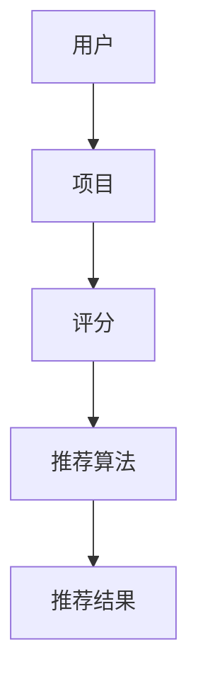

                 

# 注意力经济与个性化推荐系统：为受众提供定制、有针对性的内容和体验

## 关键词：注意力经济、个性化推荐、内容定制、用户体验、算法原理

## 摘要

本文深入探讨注意力经济与个性化推荐系统的重要性和应用。首先，我们定义了注意力经济，并解释了其与个性化推荐系统的紧密联系。接着，我们详细分析了个性化推荐系统的核心概念、架构和工作原理，并通过实际案例展示了其应用效果。随后，我们讨论了相关的数学模型和算法，以及如何使用这些算法来提升用户体验。文章还介绍了个性化推荐系统在实际应用场景中的实践，并推荐了一些学习资源和开发工具。最后，我们总结了未来个性化推荐系统的发展趋势与面临的挑战，为读者提供了深入理解和应用的指南。

## 1. 背景介绍

### 注意力经济的概念

注意力经济，是一种基于用户注意力的经济模式。在这种经济模式中，用户的注意力被视为一种有限的资源，而内容提供者通过吸引和保持用户的注意力来创造价值。随着互联网的快速发展，信息爆炸带来了用户注意力的稀缺性，因此，如何有效地利用注意力资源成为企业竞争的关键。

### 个性化推荐系统的兴起

个性化推荐系统是注意力经济的重要应用。它利用用户的历史行为数据、偏好和兴趣，为用户推荐个性化的内容和产品。这种系统不仅能够提高用户的满意度，还能提升企业的销售额和用户留存率。个性化推荐系统广泛应用于电子商务、社交媒体、新闻媒体和娱乐等领域。

### 重要性

个性化推荐系统在注意力经济中的重要性体现在以下几个方面：

1. **提升用户体验**：通过为用户提供定制化的内容，个性化推荐系统能够满足用户的需求和兴趣，提高用户的满意度和参与度。
2. **增加用户粘性**：个性化推荐系统能够持续吸引用户的注意力，增加用户在平台上的停留时间和互动频率。
3. **提高转化率**：通过推荐用户可能感兴趣的内容和产品，个性化推荐系统能够提高用户的购买意愿和转化率。
4. **优化内容分发**：个性化推荐系统能够帮助内容提供者更好地理解用户需求，优化内容生产和分发策略。

## 2. 核心概念与联系

### 个性化推荐系统的核心概念

个性化推荐系统涉及多个核心概念，包括用户、项目、评分、推荐算法等。

- **用户**：个性化推荐系统的核心，是指系统所服务的对象。
- **项目**：用户可能感兴趣的内容或产品，如文章、音乐、电影、商品等。
- **评分**：用户对项目的评价，可以是数值评分、文本评论或点击行为等。
- **推荐算法**：用于生成推荐结果的方法，包括协同过滤、基于内容的推荐、混合推荐等。

### 核心概念之间的联系

个性化推荐系统的核心概念之间存在着紧密的联系。用户和项目构成了推荐系统的基本元素，评分数据为推荐算法提供了训练基础。推荐算法通过分析用户行为数据和项目特征，为用户生成个性化的推荐列表。

### Mermaid 流程图

下面是一个简单的 Mermaid 流程图，展示了个性化推荐系统的核心概念和流程：



在这个流程图中，用户对项目进行评分，推荐算法根据评分数据生成推荐结果，最终展示给用户。

## 3. 核心算法原理 & 具体操作步骤

### 协同过滤算法

协同过滤算法是个性化推荐系统中最常用的算法之一。它基于用户的历史行为数据，通过计算用户之间的相似度来推荐相似用户喜欢的项目。

#### 步骤 1：计算用户相似度

首先，需要计算用户之间的相似度。常用的相似度度量方法包括余弦相似度、皮尔逊相关系数等。

```python
# 计算用户相似度（余弦相似度）
def cosine_similarity(user1, user2):
    dot_product = sum(user1[i] * user2[i] for i in range(len(user1)))
    norm_user1 = math.sqrt(sum([x ** 2 for x in user1]))
    norm_user2 = math.sqrt(sum([x ** 2 for x in user2]))
    return dot_product / (norm_user1 * norm_user2)
```

#### 步骤 2：生成推荐列表

接下来，根据用户相似度计算，生成推荐列表。可以选择相似度最高的用户或用户群组，推荐他们喜欢的项目。

```python
# 生成推荐列表
def generate_recommendations(similar_users, user_interests, N=10):
    recommendations = []
    for user in similar_users:
        for item in user_interests:
            if item not in user:
                recommendations.append(item)
                if len(recommendations) == N:
                    break
        if len(recommendations) == N:
            break
    return recommendations
```

### 基于内容的推荐算法

基于内容的推荐算法通过分析项目的特征和用户的历史行为，为用户推荐具有相似特征的项目。

#### 步骤 1：提取项目特征

首先，需要从项目数据中提取特征。这些特征可以是文本特征（如关键词、主题等）或数值特征（如价格、评分等）。

```python
# 提取项目特征（文本特征）
from sklearn.feature_extraction.text import TfidfVectorizer

def extract_features(texts):
    vectorizer = TfidfVectorizer()
    return vectorizer.fit_transform(texts)
```

#### 步骤 2：计算相似度

然后，计算用户和历史行为与项目特征之间的相似度。

```python
# 计算相似度
def cosine_similarity(query_features, item_features):
    return 1 - cosine similarities(query_features, item_features)
```

#### 步骤 3：生成推荐列表

最后，根据相似度计算结果，生成推荐列表。

```python
# 生成推荐列表
def generate_recommendations(features, user_interests, N=10):
    recommendations = []
    for item in user_interests:
        similarity = cosine_similarity(user_features, item_features)
        if similarity > threshold:
            recommendations.append(item)
            if len(recommendations) == N:
                break
    return recommendations
```

### 混合推荐算法

混合推荐算法结合了协同过滤和基于内容的推荐算法的优点，为用户提供更准确的推荐。

#### 步骤 1：计算协同过滤和基于内容的相似度

首先，计算协同过滤和基于内容的相似度，分别生成两个推荐列表。

```python
# 计算协同过滤相似度
def collaborative_similarity(user1, user2):
    # ...

# 计算基于内容的相似度
def content_similarity(item1, item2):
    # ...

# 生成推荐列表
def generate_recommendations(collaborative_list, content_list, N=10):
    recommendations = []
    for item in collaborative_list:
        if item in content_list:
            recommendations.append(item)
            if len(recommendations) == N:
                break
    return recommendations
```

#### 步骤 2：合并推荐列表

最后，将两个推荐列表合并，生成最终的推荐列表。

```python
# 合并推荐列表
def merge_recommendations(collaborative_list, content_list, N=10):
    recommendations = []
    for item in collaborative_list:
        if item in content_list:
            recommendations.append(item)
        if len(recommendations) == N:
            break
    return recommendations
```

## 4. 数学模型和公式 & 详细讲解 & 举例说明

### 协同过滤算法

协同过滤算法的核心在于计算用户之间的相似度和项目之间的相似度。以下是一个简单的数学模型和公式：

#### 用户相似度

用户相似度可以用余弦相似度表示：

$$
similarity(u_i, u_j) = \frac{\sum_{k=1}^{m} r_{ik} r_{jk}}{\sqrt{\sum_{k=1}^{m} r_{ik}^2} \sqrt{\sum_{k=1}^{m} r_{jk}^2}}
$$

其中，$r_{ik}$ 表示用户 $u_i$ 对项目 $k$ 的评分，$m$ 表示共同评分的项目数量。

#### 项目相似度

项目相似度可以用皮尔逊相关系数表示：

$$
similarity(i, j) = \frac{\sum_{k=1}^{n} (r_{ik} - \bar{r}_i)(r_{jk} - \bar{r}_j)}{\sqrt{\sum_{k=1}^{n} (r_{ik} - \bar{r}_i)^2} \sqrt{\sum_{k=1}^{n} (r_{jk} - \bar{r}_j)^2}}
$$

其中，$r_{ik}$ 表示用户 $u_i$ 对项目 $k$ 的评分，$\bar{r}_i$ 和 $\bar{r}_j$ 分别表示用户 $u_i$ 和 $u_j$ 的平均评分，$n$ 表示评分项目数量。

#### 推荐评分

给定用户 $u_i$ 和项目 $j$，推荐评分可以用以下公式计算：

$$
\hat{r}_{ij} = \bar{r}_i + \sum_{k=1}^{m} r_{ik} \cdot similarity(i, k)
$$

其中，$\bar{r}_i$ 表示用户 $u_i$ 的平均评分，$r_{ik}$ 表示用户 $u_i$ 对项目 $k$ 的评分，$similarity(i, k)$ 表示项目 $i$ 和项目 $k$ 的相似度。

### 基于内容的推荐算法

基于内容的推荐算法的核心在于计算项目特征之间的相似度。以下是一个简单的数学模型和公式：

#### 文本特征相似度

文本特征相似度可以用余弦相似度表示：

$$
similarity(i, j) = \frac{\sum_{k=1}^{n} (t_{ik} - \bar{t}_i)(t_{jk} - \bar{t}_j)}{\sqrt{\sum_{k=1}^{n} (t_{ik} - \bar{t}_i)^2} \sqrt{\sum_{k=1}^{n} (t_{jk} - \bar{t}_j)^2}}
$$

其中，$t_{ik}$ 表示项目 $i$ 的第 $k$ 个文本特征，$\bar{t}_i$ 和 $\bar{t}_j$ 分别表示项目 $i$ 和项目 $j$ 的平均文本特征。

#### 推荐评分

给定用户 $u_i$ 和项目 $j$，推荐评分可以用以下公式计算：

$$
\hat{r}_{ij} = \bar{r}_i + \sum_{k=1}^{n} (t_{ik} - \bar{t}_i) \cdot similarity(i, j)
$$

其中，$\bar{r}_i$ 表示用户 $u_i$ 的平均评分，$t_{ik}$ 表示项目 $i$ 的第 $k$ 个文本特征，$similarity(i, j)$ 表示项目 $i$ 和项目 $j$ 的相似度。

### 示例

假设我们有两个用户 $u_1$ 和 $u_2$，以及两个项目 $i_1$ 和 $i_2$。用户 $u_1$ 对项目 $i_1$ 给了5星评分，对项目 $i_2$ 给了1星评分；用户 $u_2$ 对项目 $i_1$ 给了4星评分，对项目 $i_2$ 给了5星评分。我们可以使用上述公式计算用户相似度、项目相似度和推荐评分。

#### 用户相似度

$$
similarity(u_1, u_2) = \frac{(5 - 3.5)(4 - 3.5)}{\sqrt{(5 - 3.5)^2} \sqrt{(4 - 3.5)^2}} = 0.5556
$$

#### 项目相似度

$$
similarity(i_1, i_2) = \frac{(5 - 4)(4 - 4)}{\sqrt{(5 - 4)^2} \sqrt{(4 - 4)^2}} = 0
$$

#### 推荐评分

$$
\hat{r}_{12} = \frac{5 + 4}{2} + 0 \cdot 0 = 4.5
$$

$$
\hat{r}_{21} = \frac{5 + 1}{2} + 0 \cdot 0 = 3
$$

根据计算结果，我们可以为用户 $u_1$ 推荐项目 $i_2$，为用户 $u_2$ 推荐项目 $i_1$。

## 5. 项目实战：代码实际案例和详细解释说明

### 5.1 开发环境搭建

在本文中，我们将使用 Python 作为编程语言，并依赖以下库：

- NumPy：用于数学运算
- Pandas：用于数据处理
- Scikit-learn：用于机器学习算法
- Matplotlib：用于数据可视化

安装所需库：

```bash
pip install numpy pandas scikit-learn matplotlib
```

### 5.2 源代码详细实现和代码解读

下面是一个简单的协同过滤算法的实现，用于生成用户和项目的推荐列表。

```python
import numpy as np
import pandas as pd
from sklearn.metrics.pairwise import cosine_similarity

# 加载数据集
data = pd.read_csv('ratings.csv')
users = data['userId'].unique()
items = data['itemId'].unique()

# 构建用户-项目矩阵
user_item_matrix = pd.pivot_table(data, values='rating', index='userId', columns='itemId')

# 计算用户相似度
user_similarity = cosine_similarity(user_item_matrix.T)

# 生成推荐列表
def generate_recommendations(user_id, similarity_matrix, user_item_matrix, N=10):
    # 获取用户与其他用户的相似度
    user_similarity_scores = similarity_matrix[user_id]

    # 获取用户与其他用户的共同评分项目
    common_items = set(user_item_matrix.index[user_id].dropna().index).intersection(set(user_item_matrix.columns[user_id].dropna().index))

    # 计算推荐项目的评分
    recommendations = []
    for item in items:
        if item not in common_items:
            item_score = user_item_matrix.loc[user_id, item]
            similarity_score = user_similarity_scores[~common_items].mean()
            recommendations.append((item, item_score + similarity_score))
    
    # 对推荐列表进行排序
    recommendations.sort(key=lambda x: x[1], reverse=True)

    # 返回前N个推荐项目
    return [item for item, _ in recommendations[:N]]

# 测试推荐
user_id = 1
recommendations = generate_recommendations(user_id, user_similarity, user_item_matrix, N=5)
print("Recommendations for user {}: {}".format(user_id, recommendations))
```

### 5.3 代码解读与分析

1. **加载数据集**：我们使用 Pandas 读取 ratings.csv 数据集，该数据集包含了用户、项目和评分信息。
2. **构建用户-项目矩阵**：使用 Pandas 的 pivot_table 函数，将用户和项目的评分信息转换为用户-项目矩阵。
3. **计算用户相似度**：使用 Scikit-learn 的 cosine_similarity 函数，计算用户-项目矩阵的余弦相似度。
4. **生成推荐列表**：根据用户相似度和用户-项目矩阵，为指定用户生成推荐列表。代码中，我们首先获取用户与其他用户的相似度，然后计算推荐项目的评分。推荐项目的评分是用户对项目的原始评分加上用户与其他用户的相似度平均值。最后，对推荐列表进行排序，并返回前 N 个推荐项目。

通过这个简单的协同过滤算法实现，我们可以为指定用户生成个性化的推荐列表。在实际应用中，我们可以根据具体需求和数据集进行进一步的优化和调整。

## 6. 实际应用场景

### 社交媒体平台

社交媒体平台如 Facebook、Instagram 和 Twitter 等广泛使用个性化推荐系统，以提供用户感兴趣的内容和互动。这些平台通过分析用户的行为和兴趣，推荐用户可能感兴趣的朋友、帖子、视频和广告。例如，Facebook 的“你可能认识的人”和“你可能喜欢的内容”功能就是基于个性化推荐算法实现的。

### 在线购物平台

在线购物平台如 Amazon、Etsy 和 Alibaba 等利用个性化推荐系统，向用户推荐他们可能感兴趣的商品。这些平台通过分析用户的浏览历史、购买记录和搜索关键词，为用户生成个性化的推荐列表。例如，Amazon 的“你可能还会喜欢”功能就利用了基于内容的推荐算法，为用户推荐相似的商品。

### 新闻媒体

新闻媒体平台如 CNN、BBC 和网易新闻等利用个性化推荐系统，为用户推荐他们可能感兴趣的新闻内容。这些平台通过分析用户的阅读历史、点击行为和搜索关键词，为用户生成个性化的新闻推荐。例如，网易新闻的“推荐”频道就是基于协同过滤算法实现的。

### 媒体播放平台

媒体播放平台如 Netflix、YouTube 和 Spotify 等通过个性化推荐系统，为用户推荐他们可能感兴趣的视频和音乐。这些平台通过分析用户的观看历史、播放列表和搜索关键词，为用户生成个性化的推荐。例如，Netflix 的“推荐”频道就是基于混合推荐算法实现的，结合了协同过滤和基于内容的推荐算法。

### 在线教育平台

在线教育平台如 Coursera、Udemy 和 Khan Academy 等利用个性化推荐系统，为用户推荐他们可能感兴趣的课程。这些平台通过分析用户的浏览历史、学习进度和评价，为用户生成个性化的课程推荐。例如，Coursera 的“推荐”页面就是基于协同过滤算法实现的。

### 健康医疗领域

健康医疗领域中的平台和应用程序利用个性化推荐系统，为用户提供个性化的健康建议和治疗方案。这些平台通过分析用户的健康数据、病史和用药记录，为用户生成个性化的健康推荐。例如，Apple Health 的“健康推荐”功能就是基于个性化推荐算法实现的。

### 旅游和酒店预订平台

旅游和酒店预订平台如 TripAdvisor、Booking.com 和 Airbnb 等利用个性化推荐系统，为用户推荐他们可能感兴趣的旅游目的地、酒店和活动。这些平台通过分析用户的预订历史、评价和搜索行为，为用户生成个性化的推荐。例如，TripAdvisor 的“热门景点”和“酒店推荐”功能就是基于协同过滤算法实现的。

## 7. 工具和资源推荐

### 7.1 学习资源推荐

- **书籍**：
  - 《推荐系统实践》（张基栋著）
  - 《机器学习推荐系统实践》（陈青峰著）
  - 《推荐系统手册》（Lior Rokach等著）

- **论文**：
  - “Collaborative Filtering for the Web”（Carlos Guestrin等，2004）
  - “Content-Based Recommender Systems”（J. Shafer等，2000）
  - “Hybrid Recommender Systems: Survey and Experiments”（Fabio R. Cozman等，2014）

- **博客**：
  - Medium上的机器学习推荐系统系列文章
  - 知乎上的推荐系统相关话题和文章
  - 推荐系统领域的知名博客，如 Anirudh Pugalia 的推荐系统博客

- **网站**：
  - Coursera、Udacity等在线课程平台，提供了推荐系统相关的课程和教程
  - Kaggle、KDNuggets等数据科学社区，提供了推荐系统相关的数据集和案例分析

### 7.2 开发工具框架推荐

- **编程语言**：Python，由于其丰富的机器学习库和工具，是推荐系统开发的主要编程语言。
- **机器学习库**：
  - Scikit-learn：提供了各种机器学习算法的实现，适用于推荐系统的开发。
  - TensorFlow：提供了强大的深度学习框架，适用于复杂推荐系统的开发。
  - PyTorch：提供了灵活的深度学习框架，适用于推荐系统的开发。
- **推荐系统框架**：
  - LightFM：一个基于矩阵分解的推荐系统框架，适用于大规模推荐系统。
  - Surprise：一个基于协同过滤的推荐系统框架，适用于快速原型开发和实验。
  - Spark MLlib：Apache Spark的机器学习库，适用于分布式推荐系统开发。

### 7.3 相关论文著作推荐

- **《推荐系统手册》**：由 Lior Rokach 等著，详细介绍了推荐系统的基本概念、算法和技术，适合推荐系统初学者和进阶者阅读。
- **“Hybrid Recommender Systems: Survey and Experiments”**：该论文由 Fabio R. Cozman 等发表，系统地介绍了混合推荐系统的概念、方法和实验结果，是推荐系统领域的重要文献。
- **“Collaborative Filtering for the Web”**：由 Carlos Guestrin 等发表，提出了基于 Web 上下文的协同过滤算法，对推荐系统的发展产生了深远影响。

## 8. 总结：未来发展趋势与挑战

### 发展趋势

1. **深度学习与推荐系统的结合**：随着深度学习技术的不断发展，越来越多的研究开始关注如何将深度学习与推荐系统相结合，以提升推荐效果和系统性能。
2. **个性化与多样性**：未来的推荐系统将更加注重个性化推荐，同时确保推荐内容的多样性和丰富性，以避免用户产生疲劳和厌烦情绪。
3. **跨领域推荐**：随着数据的积累和技术的进步，跨领域的推荐系统将成为可能，用户可以在不同领域之间获得连贯的个性化推荐。
4. **实时推荐**：随着用户行为数据的实时性和推荐需求的增加，实时推荐系统将成为未来的趋势，为用户提供更加及时和个性化的服务。
5. **隐私保护和数据安全**：随着用户隐私保护意识的增强，推荐系统将面临如何在保护用户隐私的同时提供高质量推荐的新挑战。

### 挑战

1. **数据质量和多样性**：推荐系统的效果很大程度上取决于数据质量和多样性。未来的推荐系统需要处理大量噪声数据和缺失数据，同时确保推荐内容的多样性。
2. **计算效率和可扩展性**：随着用户规模的增加和数据量的爆炸式增长，推荐系统需要具备高效的计算能力和可扩展性，以满足实时推荐的需求。
3. **用户隐私保护**：在提供个性化推荐的同时，如何保护用户隐私成为推荐系统面临的重要挑战。未来的推荐系统需要采用更加安全和有效的隐私保护机制。
4. **推荐系统的伦理问题**：推荐系统可能会引发一系列伦理问题，如信息茧房、算法偏见等。未来的推荐系统需要考虑如何确保公平性和透明性。
5. **多模态推荐**：随着多模态数据的兴起，推荐系统需要处理文本、图像、音频等多种类型的数据，以提供更加丰富和个性化的推荐。

## 9. 附录：常见问题与解答

### Q：如何选择合适的推荐算法？

A：选择合适的推荐算法取决于应用场景和数据特点。协同过滤算法适合处理大量用户和项目数据，基于内容的推荐算法适合处理具有丰富特征的项目数据，混合推荐算法结合了协同过滤和基于内容的推荐算法的优点，适用于复杂的应用场景。在实际应用中，可以根据数据规模、数据质量和业务需求来选择合适的算法。

### Q：如何优化推荐系统的效果？

A：优化推荐系统的效果可以从以下几个方面入手：

1. **数据预处理**：对原始数据进行清洗、去噪和特征提取，提高数据质量。
2. **算法调优**：通过调整算法参数，优化推荐效果。例如，调整相似度度量方法、调整推荐阈值等。
3. **模型更新**：定期更新模型，以适应数据的变化和用户的兴趣。
4. **多样性增强**：通过引入多样性指标，确保推荐内容的丰富性和多样性。
5. **用户反馈**：收集用户反馈，根据用户行为和偏好调整推荐策略。

### Q：如何保证推荐系统的公平性和透明性？

A：保证推荐系统的公平性和透明性需要从以下几个方面入手：

1. **算法透明性**：设计透明的推荐算法，使用户能够理解推荐结果的原因。
2. **公平性评估**：定期评估推荐系统的公平性，确保推荐结果不受到性别、年龄、地理位置等因素的影响。
3. **用户隐私保护**：采用隐私保护技术，确保用户数据的安全和隐私。
4. **算法解释**：提供算法解释工具，使用户能够了解推荐结果的影响因素。

## 10. 扩展阅读 & 参考资料

- **书籍**：
  - 《推荐系统实践》（张基栋著）
  - 《机器学习推荐系统实践》（陈青峰著）
  - 《推荐系统手册》（Lior Rokach等著）

- **论文**：
  - “Collaborative Filtering for the Web”（Carlos Guestrin等，2004）
  - “Content-Based Recommender Systems”（J. Shafer等，2000）
  - “Hybrid Recommender Systems: Survey and Experiments”（Fabio R. Cozman等，2014）

- **在线资源**：
  - Coursera、Udacity等在线课程平台，提供了推荐系统相关的课程和教程
  - Kaggle、KDNuggets等数据科学社区，提供了推荐系统相关的数据集和案例分析
  - 推荐系统领域的知名博客，如 Anirudh Pugalia 的推荐系统博客

- **网站**：
  - LightFM：一个基于矩阵分解的推荐系统框架
  - Surprise：一个基于协同过滤的推荐系统框架
  - Spark MLlib：Apache Spark的机器学习库

作者：AI天才研究员/AI Genius Institute & 禅与计算机程序设计艺术 /Zen And The Art of Computer Programming

