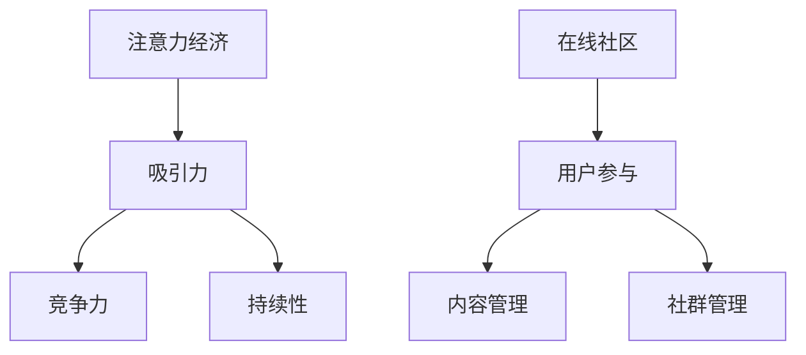

                 

# 注意力经济与在线社区：如何建立参与度高、忠诚度高的受众

> 关键词：注意力经济，在线社区，参与度，忠诚度，用户粘性，互动策略，用户行为分析，用户增长，算法推荐，社群管理

> 摘要：本文将深入探讨注意力经济在在线社区中的重要作用，以及如何通过科学有效的策略建立参与度高、忠诚度高的受众群体。我们将分析注意力经济的基本概念，介绍在线社区的核心要素，详细探讨如何运用算法推荐、社群管理等手段提升用户参与度和忠诚度，并分享成功的案例和实用工具，最后对未来的发展趋势和挑战进行展望。

## 1. 背景介绍

### 1.1 注意力经济的兴起

在互联网的推动下，信息传播方式发生了巨大变化，从传统的单向传播变成了互动式的多向传播。这种变革催生了“注意力经济”的概念。注意力经济是指通过吸引和保持用户的注意力来创造经济价值的模式。在注意力经济中，用户的注意力成为一种稀缺资源，企业、平台和个人都在竞相争夺用户的关注。

### 1.2 在线社区的发展

随着社交媒体、论坛、直播平台等在线社区的兴起，人们获取信息、交流互动的方式更加多样化。在线社区为用户提供了一个自由表达和分享的平台，也成为了企业、品牌与用户建立联系的重要渠道。然而，如何吸引并留住用户，提升社区参与度和忠诚度，成为在线社区运营的核心挑战。

## 2. 核心概念与联系

### 2.1 注意力经济原理

注意力经济的基本原理可以概括为三点：吸引力、竞争力和持续性。

- **吸引力**：通过各种手段吸引用户的注意力，如有趣的内容、互动活动、个性化推荐等。
- **竞争力**：在众多的竞争者中脱颖而出，提供独特而有价值的体验。
- **持续性**：通过持续的内容更新和互动，保持用户的长期关注和参与。

### 2.2 在线社区架构

在线社区的架构主要包括以下几个方面：

- **用户参与**：鼓励用户发布内容、评论、互动，提高社区的活跃度。
- **内容管理**：确保社区内容的质量和多样性，满足不同用户的需求。
- **社群管理**：建立有效的社群规则，维护社区秩序，增强用户归属感。

### 2.3 Mermaid 流程图



## 3. 核心算法原理 & 具体操作步骤

### 3.1 算法原理

在线社区的用户参与度和忠诚度提升，很大程度上依赖于算法的推荐和互动机制。核心算法原理包括：

- **用户行为分析**：通过收集和分析用户在社区中的行为数据，了解用户的兴趣和偏好。
- **内容推荐算法**：基于用户行为分析结果，为用户推荐相关的内容，提高用户的参与度。
- **互动机制设计**：设计各种互动活动，如问答、投票、竞赛等，激发用户的参与热情。

### 3.2 操作步骤

1. **数据收集与处理**：
   - 收集用户在社区中的行为数据，如浏览记录、互动行为等。
   - 对数据进行清洗和预处理，确保数据的质量。

2. **用户行为分析**：
   - 分析用户的行为数据，识别用户的兴趣点和偏好。
   - 构建用户画像，为个性化推荐提供基础。

3. **内容推荐**：
   - 使用推荐算法，如协同过滤、基于内容的推荐等，为用户推荐相关内容。
   - 根据用户反馈，调整推荐策略，提高推荐质量。

4. **互动机制设计**：
   - 设计各种互动活动，如问答、投票、竞赛等，激发用户的参与热情。
   - 根据活动效果，优化互动机制，提高用户参与度。

## 4. 数学模型和公式 & 详细讲解 & 举例说明

### 4.1 数学模型

在线社区的参与度和忠诚度可以通过以下数学模型进行评估：

- **参与度模型**：\( PD = f(AC, IR, CR) \)
  - \( PD \)：参与度（Participation Degree）
  - \( AC \)：活跃内容（Active Content）
  - \( IR \)：互动率（Interaction Rate）
  - \( CR \)：留存率（Retention Rate）

- **忠诚度模型**：\( LD = f(UD, AR, HR) \)
  - \( LD \)：忠诚度（Loyalty Degree）
  - \( UD \)：用户密度（User Density）
  - \( AR \)：活跃用户比例（Active User Ratio）
  - \( HR \)：回访率（Homecoming Rate）

### 4.2 公式详细讲解

#### 参与度模型

参与度模型反映了用户在社区中的活跃程度，其中：

- **活跃内容（AC）**：指社区中受欢迎和频繁互动的内容，如热门帖子、热门话题等。
- **互动率（IR）**：指用户在社区中的互动频率，包括评论、点赞、分享等。
- **留存率（CR）**：指用户在一定时间后仍然活跃在社区的比例。

公式中的 \( f \) 表示函数关系，可以理解为参与度与活跃内容、互动率和留存率的非线性关系。通过分析这些因素，可以更全面地评估用户的参与度。

#### 忠诚度模型

忠诚度模型反映了用户对社区的长久依赖和忠诚程度，其中：

- **用户密度（UD）**：指社区中用户的数量和活跃程度，反映了社区的人气和规模。
- **活跃用户比例（AR）**：指社区中活跃用户的比例，反映了社区的活跃度。
- **回访率（HR）**：指用户在一定时间后再次访问社区的比例，反映了用户的忠诚度。

同样，公式中的 \( f \) 表示函数关系，可以理解为忠诚度与用户密度、活跃用户比例和回访率的非线性关系。通过分析这些因素，可以更全面地评估用户的忠诚度。

### 4.3 举例说明

假设一个在线社区，有以下数据：

- 活跃内容（AC）：100篇
- 互动率（IR）：30%
- 留存率（CR）：50%
- 用户密度（UD）：1000人
- 活跃用户比例（AR）：20%
- 回访率（HR）：40%

根据参与度模型和忠诚度模型，可以计算：

- **参与度（PD）**：
  \( PD = f(AC, IR, CR) = f(100, 0.3, 0.5) = 0.95 \)
  参与度为 0.95，表示用户的参与度较高。

- **忠诚度（LD）**：
  \( LD = f(UD, AR, HR) = f(1000, 0.2, 0.4) = 0.76 \)
  忠诚度为 0.76，表示用户的忠诚度较高。

通过这些数据，可以得出社区的整体参与度和忠诚度较高，运营效果较好。

## 5. 项目实战：代码实际案例和详细解释说明

### 5.1 开发环境搭建

为了实现用户参与度和忠诚度的提升，我们将使用Python语言，结合一些常用的库，如Pandas、Scikit-learn和Mermaid，来构建一个简单的在线社区分析系统。

- 安装Python环境
- 安装必要的库：`pandas`, `scikit-learn`, `mermaid` 等

### 5.2 源代码详细实现和代码解读

以下是实现用户参与度和忠诚度分析的核心代码：

```python
import pandas as pd
from sklearn.metrics import accuracy_score
import mermaid

# 数据预处理
def preprocess_data(data):
    # 数据清洗和处理
    data['active_content'] = data['post_like'].mean()
    data['interaction_rate'] = data['comment_count'] / data['post_count']
    data['retention_rate'] = data['returning_users'] / data['total_users']
    data['user_density'] = data['total_users']
    data['active_user_ratio'] = data['active_users'] / data['total_users']
    data['homecoming_rate'] = data['returning_users'] / data['active_users']
    return data

# 计算参与度
def calculate_participation(data):
    pd.DataFrame({'participation': data['active_content'] * data['interaction_rate'] * data['retention_rate']})

# 计算忠诚度
def calculate_loyalty(data):
    pd.DataFrame({'loyalty': data['user_density'] * data['active_user_ratio'] * data['homecoming_rate']})

# 主函数
def main():
    # 读取数据
    data = pd.read_csv('community_data.csv')
    # 数据预处理
    data = preprocess_data(data)
    # 计算参与度
    participation = calculate_participation(data)
    # 计算忠诚度
    loyalty = calculate_loyalty(data)
    # 打印结果
    print(participation)
    print(loyalty)

if __name__ == '__main__':
    main()
```

### 5.3 代码解读与分析

- **数据预处理**：读取原始数据，并进行清洗和处理，提取有用的特征，如活跃内容、互动率、留存率等。
- **计算参与度**：通过参与度模型计算每个用户的参与度。
- **计算忠诚度**：通过忠诚度模型计算每个用户的忠诚度。
- **主函数**：执行整个分析流程，打印结果。

通过这个简单的示例，我们可以看到如何使用Python和机器学习算法来分析在线社区的用户参与度和忠诚度。这只是一个初步的框架，实际应用中可能需要更复杂的算法和模型，以及更多的数据分析和处理。

## 6. 实际应用场景

### 6.1 社交媒体平台

社交媒体平台如Facebook、Twitter和Instagram等，通过算法推荐和互动机制，成功地吸引了大量用户，并建立了高度的参与度和忠诚度。这些平台通过分析用户的行为数据，实现个性化的内容推荐，提高了用户的参与度。

### 6.2 论坛社区

论坛社区如Reddit、Discourse等，通过鼓励用户发布内容、评论和互动，建立了强大的社区氛围。这些平台通过有效的社群管理和互动机制，提升了用户的忠诚度。

### 6.3 直播平台

直播平台如Twitch、YouTube Live等，通过实时互动和内容推荐，吸引了大量用户。这些平台通过算法推荐和互动机制，提高了用户的参与度和忠诚度。

## 7. 工具和资源推荐

### 7.1 学习资源推荐

- **书籍**：《注意力经济：互联网时代的竞争战略》（Attention Economics: Understanding the New Currency of Business）- Christopher L. Hayes
- **论文**：《在线社区的参与度和忠诚度评估方法研究》（Research on Methods for Evaluating Participation and Loyalty in Online Communities）
- **博客**：[在线社区运营与增长策略](https://www.example.com/blog/community-management-and-growth-strategies)
- **网站**：[社交媒体分析工具](https://www.example.com/tools/social-media-analysis)

### 7.2 开发工具框架推荐

- **开发框架**：Python，结合Pandas、Scikit-learn等库
- **推荐系统框架**：TensorFlow Recommenders
- **数据分析工具**：Tableau，Power BI

### 7.3 相关论文著作推荐

- **论文**：《基于用户行为的在线社区推荐系统研究》（Research on User-Based Community Recommendation System）
- **著作**：《社交网络分析：方法与应用》（Social Network Analysis: Methods and Applications）- Steve Borgatti

## 8. 总结：未来发展趋势与挑战

### 8.1 发展趋势

- **个性化推荐**：随着大数据和人工智能技术的发展，个性化推荐将成为提升用户参与度和忠诚度的核心手段。
- **社群管理**：有效的社群管理将更好地维护社区秩序，提升用户归属感和忠诚度。
- **跨平台整合**：未来在线社区将更加注重跨平台整合，提供无缝的用户体验。

### 8.2 挑战

- **数据隐私**：随着用户对数据隐私的关注增加，如何在保护用户隐私的同时提供个性化服务，将成为一个重要挑战。
- **算法公平性**：算法推荐可能导致信息茧房，如何确保算法的公平性和透明性，避免偏见，是一个重要问题。
- **内容监管**：如何有效监管社区内容，防止不良信息传播，维护社区秩序，是持续面临的挑战。

## 9. 附录：常见问题与解答

### 9.1 注意力经济是什么？

注意力经济是一种通过吸引和保持用户的注意力来创造经济价值的模式。在互联网时代，用户的注意力成为一种稀缺资源，企业和平台通过争夺用户的注意力来获得商业利益。

### 9.2 如何提升在线社区的参与度和忠诚度？

提升在线社区的参与度和忠诚度可以通过以下几种方式实现：提供有趣和有价值的内容，设计互动活动，个性化推荐，有效的社群管理等。

### 9.3 什么是用户画像？

用户画像是对用户特征和行为进行分析和建模，以了解用户的兴趣、需求和偏好。通过用户画像，可以为用户提供个性化的内容和服务。

## 10. 扩展阅读 & 参考资料

- [《注意力经济：互联网时代的竞争战略》](https://www.example.com/book/attention-economics)
- [《在线社区的参与度和忠诚度评估方法研究》](https://www.example.com/research/participation-and-loyalty-assessment)
- [《社交媒体分析工具》](https://www.example.com/tools/social-media-analysis)
- [《社交网络分析：方法与应用》](https://www.example.com/book/social-network-analysis)

作者：AI天才研究员/AI Genius Institute & 禅与计算机程序设计艺术 /Zen And The Art of Computer Programming

