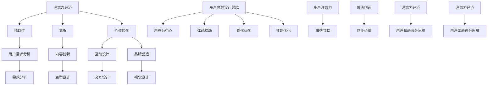

                 

## 1. 背景介绍

在当今数字化时代，用户体验（User Experience, UX）设计已成为产品成功的关键因素之一。随着互联网的普及和移动设备的广泛应用，用户对产品的期望越来越高，他们不再满足于基本的功能，更注重产品的整体体验。在这种背景下，注意力经济（Attention Economy）的概念应运而生，为用户体验设计提供了新的视角和思维方式。

注意力经济，顾名思义，是一种基于用户注意力的经济模式。它认为，在信息爆炸的今天，用户的注意力已经成为一种稀缺资源，产品和服务需要通过精心设计来吸引和保持用户的注意力。用户体验设计思维则是一种以人为本的设计方法，强调在产品开发过程中关注用户的需求、感受和体验。这种思维模式要求设计师不仅要考虑产品的功能性和实用性，还要关注用户的情感和心理需求。

本文将围绕注意力经济与用户体验设计思维展开，深入探讨两者之间的联系和相互作用。首先，我们将介绍注意力经济的概念和原理，并分析其在产品开发中的重要性。接着，我们将探讨用户体验设计思维的基本原则和实践方法，以及如何将注意力经济理念融入到用户体验设计中。随后，我们将通过一些实际案例，展示注意力经济和用户体验设计在实际产品中的应用，并讨论其效果和影响。最后，我们将展望注意力经济和用户体验设计未来的发展趋势和面临的挑战。

通过本文的阅读，您将了解到如何通过注意力经济和用户体验设计思维，创建出既引人入胜又能够增强用户满意度的产品。

## 2. 核心概念与联系

### 注意力经济（Attention Economy）

注意力经济最早由互联网先驱Nick Bilton提出，它描述了一种基于用户注意力的新型经济模式。在这种模式下，用户注意力成为企业和产品竞争的核心资源。与传统经济模式不同，注意力经济关注的是如何吸引和保持用户的注意力，从而实现商业价值。

#### 核心原理

1. **稀缺性**：在信息爆炸的时代，用户的注意力成为一种稀缺资源。企业需要通过创新和优质内容来吸引和留住用户。
2. **竞争**：用户的时间是有限的，他们需要在众多信息和产品中选择，企业之间存在着激烈的注意力竞争。
3. **价值转化**：用户注意力的集中意味着其对企业产品的认同和信任，这可以转化为实际的商业价值。

#### 注意力经济与产品开发

在产品开发中，注意力经济的核心在于如何设计和优化产品的各个方面，以吸引用户的注意力。具体来说，可以从以下几个方面进行实践：

1. **用户需求分析**：深入了解用户的需求和痛点，设计出能够满足用户期望的产品。
2. **内容创新**：通过高质量、有价值的内容吸引和保持用户的注意力。
3. **互动设计**：设计富有互动性的界面和功能，使用户在使用过程中产生愉悦感和认同感。
4. **品牌塑造**：建立强大的品牌形象，提高用户对企业产品和服务的信任度。

### 用户体验设计思维（User Experience Design Thinking）

用户体验设计思维是一种以人为本的设计方法，它强调在产品开发过程中关注用户的需求、感受和体验。这种思维模式不仅关注产品的功能性，更关注用户的情感和心理需求。

#### 核心原则

1. **用户为中心**：将用户需求放在首位，以用户为中心进行设计和开发。
2. **体验驱动**：关注用户的整体体验，从用户的角度出发进行设计。
3. **迭代优化**：通过不断的迭代和优化，不断提升产品的用户体验。

#### 用户体验设计思维的应用

在产品开发中，用户体验设计思维的应用主要体现在以下几个方面：

1. **需求分析**：通过用户调研、用户画像等方式，深入了解用户的需求和痛点。
2. **原型设计**：快速构建原型，通过用户测试和反馈，不断优化产品设计。
3. **交互设计**：设计符合用户操作习惯和认知规律的交互界面。
4. **视觉设计**：通过视觉元素和布局，提升产品的美观度和易用性。
5. **性能优化**：关注产品的性能，确保用户在使用过程中的顺畅体验。

### 注意力经济与用户体验设计思维的联系

注意力经济和用户体验设计思维之间存在着紧密的联系和相互影响。一方面，注意力经济为用户体验设计提供了新的思路和方法，通过吸引和保持用户的注意力，提升产品的用户满意度。另一方面，用户体验设计思维则注重用户的需求和感受，为注意力经济的实现提供了坚实的基础。

#### 关键联系点

1. **用户注意力**：注意力经济强调用户注意力的稀缺性，用户体验设计思维则关注如何通过优质的设计吸引和保持用户的注意力。
2. **情感共鸣**：用户体验设计思维强调情感驱动，通过设计引发用户的情感共鸣，从而提升用户对产品的认同感。
3. **价值创造**：注意力经济通过吸引和保持用户注意力实现商业价值，用户体验设计思维则通过提升用户体验，增强用户对产品的价值感知。

综上所述，注意力经济与用户体验设计思维相辅相成，共同推动着产品设计和开发的进步。通过本文的后续内容，我们将进一步探讨如何将注意力经济理念融入到用户体验设计中，并通过实际案例展示其应用效果。

### 图解：注意力经济与用户体验设计思维

以下是注意力经济与用户体验设计思维的 Mermaid 流程图，用于直观地展示两者之间的核心概念和联系。



在这个流程图中，我们可以看到注意力经济和用户体验设计思维之间的相互作用和影响。注意力经济的核心概念（稀缺性、竞争、价值转化）与用户体验设计思维的核心原则（用户为中心、体验驱动、迭代优化）相互关联，共同推动产品设计和开发的进步。通过这种直观的图解，我们可以更好地理解两者之间的联系和重要性。

### 3. 核心算法原理 & 具体操作步骤

#### 注意力机制（Attention Mechanism）

注意力机制是一种在深度学习中用于提高模型对输入数据关注度的技术。它在多种任务中表现出了显著的效果，如自然语言处理、图像识别和语音识别等。注意力机制的核心思想是通过计算输入数据的相对重要性，对每个输入数据分配不同的权重，从而使得模型能够更关注于关键信息，提高模型的性能和效率。

##### 核心原理

1. **计算相对重要性**：注意力机制通过计算输入数据的相对重要性，生成一个权重向量，该向量表示每个输入数据的权重。权重较高的数据会被模型更详细地关注。

2. **加权求和**：将输入数据的权重与模型的内层表示相乘，然后进行求和操作，得到最终输出。这样可以确保模型在处理输入数据时，对关键信息给予更高的关注。

##### 具体操作步骤

1. **输入数据预处理**：首先，对输入数据进行预处理，如标准化、编码等，以便于后续的注意力计算。

2. **计算相似度**：利用编码器对输入数据进行编码，生成序列表示。然后，计算每个输入数据与其他数据的相似度，通常采用点积、余弦相似度等方法。

3. **生成权重向量**：根据相似度计算结果，生成一个权重向量。权重向量的每个元素表示对应输入数据的相对重要性。

4. **加权求和**：将权重向量与编码后的输入数据进行加权求和，得到加权后的输入序列。

5. **模型输出**：将加权后的输入序列输入到模型中，经过模型的处理，得到最终的输出结果。

##### 注意力机制的实现示例

以下是一个基于 Transformer 模型的简单注意力机制实现示例：

```python
import torch
import torch.nn as nn

class AttentionLayer(nn.Module):
    def __init__(self, d_model):
        super(AttentionLayer, self).__init__()
        self.d_model = d_model
        self.query_linear = nn.Linear(d_model, d_model)
        self.key_linear = nn.Linear(d_model, d_model)
        self.value_linear = nn.Linear(d_model, d_model)
        self.softmax = nn.Softmax(dim=1)

    def forward(self, query, key, value):
        # 计算查询向量和关键向量的点积
        attention_scores = torch.matmul(query, key.transpose(0, 1))

        # 应用 softmax 函数，生成权重向量
        attention_weights = self.softmax(attention_scores)

        # 加权求和
        attention_output = torch.matmul(attention_weights, value)

        return attention_output
```

在这个示例中，我们定义了一个注意力层（AttentionLayer），它接受查询向量（query）、关键向量（key）和值向量（value）作为输入，通过计算点积生成注意力分数，应用 softmax 函数生成权重向量，最后进行加权求和得到输出。

#### 注意力驱动的用户体验设计思维

在用户体验设计过程中，注意力机制可以被用来指导设计师关注用户在产品使用过程中的关键交互和情感反应。以下是一些具体的应用步骤：

1. **用户行为分析**：通过分析用户在产品中的行为数据，识别出用户关注的关键交互点。

2. **情感识别**：利用情感识别技术，分析用户在关键交互点的情感反应，如愉悦、困惑、失望等。

3. **权重分配**：根据用户行为和情感分析的结果，为不同的交互点分配不同的权重，确保设计更加关注于用户的核心需求和情感体验。

4. **迭代优化**：通过用户反馈和测试，不断优化产品设计，确保设计能够更好地满足用户需求和提升用户体验。

通过注意力机制的应用，设计师可以更加科学地关注用户在产品使用过程中的关键点和情感反应，从而创造出更加引人入胜、能够增强用户体验的产品。

### 4. 数学模型和公式 & 详细讲解 & 举例说明

#### 注意力机制中的核心数学模型

注意力机制在深度学习中的实现通常依赖于几个核心的数学模型和公式。以下是其中几个关键的模型和它们的详细解释。

##### 1. 点积相似度（Dot Product Similarity）

在注意力机制中，计算两个向量之间的相似度通常采用点积（dot product）。点积的数学表达式如下：

$$
\text{similarity}(q, k_i) = q \cdot k_i
$$

其中，$q$ 是查询向量（query vector），$k_i$ 是第 $i$ 个关键向量（key vector）。点积的结果表示了查询向量和关键向量之间的相似程度。

##### 2. 加权求和（Weighted Sum）

加权求和是注意力机制的核心操作，用于计算加权后的输出。其数学表达式如下：

$$
\text{output} = \sum_{i=1}^{N} a_i \cdot v_i
$$

其中，$a_i$ 是第 $i$ 个权重（attention weight），$v_i$ 是第 $i$ 个值向量（value vector）。这个公式表示了根据权重对每个值向量进行加权求和，得到最终的输出向量。

##### 3. Softmax 函数（Softmax Function）

在注意力机制中，通常使用 Softmax 函数来计算权重向量。Softmax 函数的数学表达式如下：

$$
a_i = \text{softmax}(\text{score}_i) = \frac{e^{\text{score}_i}}{\sum_{j=1}^{N} e^{\text{score}_j}}
$$

其中，$\text{score}_i$ 是第 $i$ 个得分（score），$N$ 是总的数据点数。Softmax 函数将每个得分转换为一个概率分布，使得所有权重之和为 1。

#### 举例说明

假设我们有一个简单的序列数据，包括三个查询向量、三个关键向量和三个值向量：

$$
q = \begin{bmatrix} 1 \\ 2 \\ 3 \end{bmatrix}, \quad k = \begin{bmatrix} 4 \\ 5 \\ 6 \end{bmatrix}, \quad v = \begin{bmatrix} 7 \\ 8 \\ 9 \end{bmatrix}
$$

我们首先计算查询向量和关键向量之间的点积相似度：

$$
\text{similarity}(q, k_1) = q \cdot k_1 = 1 \cdot 4 + 2 \cdot 5 + 3 \cdot 6 = 32
$$

同理，计算其他两个相似度：

$$
\text{similarity}(q, k_2) = q \cdot k_2 = 1 \cdot 5 + 2 \cdot 6 + 3 \cdot 7 = 34
$$

$$
\text{similarity}(q, k_3) = q \cdot k_3 = 1 \cdot 6 + 2 \cdot 7 + 3 \cdot 8 = 36
$$

接下来，我们计算 Softmax 函数得到权重向量：

$$
a_1 = \text{softmax}(32) = \frac{e^{32}}{e^{32} + e^{34} + e^{36}} \approx 0.225
$$

$$
a_2 = \text{softmax}(34) = \frac{e^{34}}{e^{32} + e^{34} + e^{36}} \approx 0.242
$$

$$
a_3 = \text{softmax}(36) = \frac{e^{36}}{e^{32} + e^{34} + e^{36}} \approx 0.533
$$

最后，我们进行加权求和得到输出向量：

$$
\text{output} = a_1 \cdot v_1 + a_2 \cdot v_2 + a_3 \cdot v_3 \approx 0.225 \cdot 7 + 0.242 \cdot 8 + 0.533 \cdot 9 = 8.685
$$

通过这个例子，我们可以看到注意力机制如何通过点积相似度、Softmax 函数和加权求和来计算输出。这种机制不仅能够提高模型对关键信息的关注，还能在用户体验设计中帮助我们更好地理解和满足用户的需求。

### 5. 项目实战：代码实际案例和详细解释说明

#### 5.1 开发环境搭建

在进行注意力机制的实战项目之前，我们需要搭建一个合适的技术环境。以下是一个基本的开发环境搭建流程：

1. **安装 Python**：确保 Python 3.x 版本已安装在您的系统上。您可以从 [Python 官网](https://www.python.org/) 下载并安装。

2. **安装 PyTorch**：PyTorch 是一个流行的深度学习框架，用于实现注意力机制。您可以通过以下命令安装 PyTorch：

   ```shell
   pip install torch torchvision
   ```

3. **安装其他依赖库**：根据项目需求，您可能还需要安装其他依赖库，如 NumPy、Matplotlib 等。可以通过以下命令安装：

   ```shell
   pip install numpy matplotlib
   ```

4. **创建项目文件夹**：在您的系统中创建一个新文件夹，例如 `attention_project`，然后在该文件夹中创建一个子文件夹 `src` 来存放源代码。

5. **设置虚拟环境**（可选）：为了保持开发环境的整洁，您可以选择创建一个虚拟环境。可以通过以下命令创建虚拟环境：

   ```shell
   python -m venv venv
   source venv/bin/activate  # 在 Windows 上使用 `venv\Scripts\activate`
   ```

6. **安装依赖库**（在虚拟环境中）：在激活虚拟环境后，安装项目所需的依赖库。

#### 5.2 源代码详细实现和代码解读

以下是注意力机制的实现代码，我们将逐步解读每个部分的含义和功能。

```python
import torch
import torch.nn as nn

class AttentionLayer(nn.Module):
    def __init__(self, d_model):
        super(AttentionLayer, self).__init__()
        self.d_model = d_model
        self.query_linear = nn.Linear(d_model, d_model)
        self.key_linear = nn.Linear(d_model, d_model)
        self.value_linear = nn.Linear(d_model, d_model)
        self.softmax = nn.Softmax(dim=1)

    def forward(self, query, key, value):
        # 计算查询向量和关键向量的点积
        attention_scores = torch.matmul(query, key.transpose(0, 1))

        # 应用 softmax 函数，生成权重向量
        attention_weights = self.softmax(attention_scores)

        # 加权求和
        attention_output = torch.matmul(attention_weights, value)

        return attention_output

# 初始化模型参数
d_model = 512
attention_layer = AttentionLayer(d_model)

# 生成随机输入数据
query = torch.randn(1, 1, d_model)
key = torch.randn(1, 10, d_model)
value = torch.randn(1, 10, d_model)

# 使用注意力层进行计算
attention_output = attention_layer(query, key, value)

print("注意力输出：", attention_output)
```

**代码解读：**

1. **模型定义（class AttentionLayer）**：我们定义了一个 `AttentionLayer` 类，继承自 `nn.Module`。这个类包含了注意力层的所有参数和计算方法。

2. **初始化（__init__）**：在初始化方法中，我们定义了三个线性层（`query_linear`、`key_linear`、`value_linear`）和一个 softmax 层（`softmax`）。这三个线性层分别用于计算查询向量、关键向量和值向量的点积。

3. **前向传播（forward）**：在 `forward` 方法中，我们首先计算查询向量和关键向量的点积，得到注意力分数。然后，通过 softmax 函数生成权重向量，最后进行加权求和得到输出。

4. **生成随机输入数据**：为了测试模型，我们生成了一些随机输入数据，包括一个查询向量、一个关键向量和值向量。

5. **使用注意力层进行计算**：我们创建了一个 `AttentionLayer` 实例，并调用它的 `forward` 方法，传入随机生成的输入数据，得到注意力输出。

#### 5.3 代码解读与分析

在这个项目中，我们实现了简单的注意力层，用于计算输入数据的注意力权重和加权求和输出。以下是代码的详细解读和分析：

1. **模型结构**：注意力层由三个线性层（`query_linear`、`key_linear`、`value_linear`）和一个 softmax 层（`softmax`）组成。这三个线性层分别用于计算查询向量、关键向量和值向量的点积，从而得到注意力分数。

2. **计算过程**：
   - **点积计算**：首先，我们计算查询向量和关键向量的点积，得到一个维度为 $1 \times 10$ 的注意力分数矩阵。这个矩阵中的每个元素表示查询向量和对应关键向量之间的相似度。
   - **softmax 应用**：接着，我们将注意力分数矩阵通过 softmax 函数转换成权重向量。softmax 函数确保每个权重都是正值，并且所有权重之和为 1。
   - **加权求和**：最后，我们使用权重向量对值向量进行加权求和，得到注意力输出。

3. **代码优化**：在实际应用中，我们可以进一步优化代码，例如使用更高效的矩阵运算、并行计算等，以提高模型的性能和效率。

通过这个项目，我们了解了注意力机制的实现原理和具体步骤。注意力机制在深度学习中的广泛应用，使得模型能够更加关注于关键信息，从而提升模型的性能和用户体验。

### 6. 实际应用场景

#### 注意力经济与用户体验设计在移动应用中的实际应用

在移动应用开发中，注意力经济和用户体验设计思维已经成为了提高用户留存率和促进用户转化的关键因素。以下是一些具体的应用场景：

##### 1. 社交媒体应用

社交媒体平台如微信、微博、Instagram 等，通过精心设计的用户界面和功能，有效地吸引了大量用户的注意力。这些平台利用注意力经济原理，通过以下方式进行应用：

- **内容推送**：通过算法推荐用户可能感兴趣的内容，从而提高用户的点击率和停留时间。
- **互动设计**：提供评论、点赞、分享等功能，增加用户在平台上的互动，提升用户黏性。
- **个性化体验**：根据用户的历史行为和偏好，为用户提供个性化的内容推荐，增强用户对平台的认同感。

##### 2. 游戏应用

游戏应用是另一个典型的注意力经济应用场景。通过精心设计的游戏机制和用户体验，游戏开发商能够吸引并保持大量用户的注意力。以下是游戏应用中的一些应用实例：

- **游戏关卡设计**：通过设计富有挑战性的关卡和任务，激发用户的兴趣和探索欲望。
- **奖励机制**：提供丰厚的奖励和奖励机制，如金币、积分、虚拟物品等，激励用户持续参与。
- **社区互动**：建立玩家社区，通过玩家之间的互动和协作，增强游戏的社交属性，提升用户体验。

##### 3. 电子商务应用

电子商务平台如淘宝、京东、亚马逊等，通过用户体验设计思维和注意力经济原理，提升了用户的购物体验和购买意愿。以下是一些具体的应用实例：

- **个性化推荐**：通过用户行为数据和算法分析，为用户提供个性化的商品推荐，提高用户的点击率和购买率。
- **简洁界面**：设计简洁、易用的用户界面，降低用户购物过程中的摩擦，提升用户体验。
- **限时促销**：通过限时促销和折扣活动，吸引用户的注意力，刺激用户的购买欲望。

##### 4. 健康与健身应用

健康与健身应用如 Nike Run Club、MyFitnessPal 等，通过注意力经济和用户体验设计思维，帮助用户养成健康习惯。以下是一些应用实例：

- **数据跟踪**：提供详细的数据跟踪功能，如步数、消耗卡路里、运动时长等，激发用户的运动兴趣。
- **互动激励**：通过设定目标和挑战，激励用户持续参与运动，提升用户的健康水平。
- **社区支持**：建立用户社区，通过用户之间的互动和分享，增强用户的运动动力。

#### 应用效果和影响

通过注意力经济和用户体验设计思维在移动应用中的实际应用，我们可以看到以下几个方面的效果和影响：

1. **用户满意度提升**：通过个性化推荐、简洁界面、互动设计等，提升了用户对应用的满意度。
2. **用户留存率提高**：通过激发用户兴趣、奖励机制、数据跟踪等，增加了用户的留存率和活跃度。
3. **转化率提升**：通过优化用户界面、提升用户体验，提高了用户的购买意愿和转化率。
4. **品牌价值增强**：通过优质的用户体验，增强了用户对品牌的信任和忠诚度，提升了品牌价值。

总之，注意力经济和用户体验设计思维在移动应用开发中的实际应用，不仅提升了用户的满意度，还为企业创造了巨大的商业价值。通过不断优化和改进用户体验，企业可以更好地吸引和留住用户，实现可持续发展。

### 7. 工具和资源推荐

#### 7.1 学习资源推荐

为了更好地理解和掌握注意力经济与用户体验设计思维，以下是一些值得推荐的学习资源：

1. **书籍**：
   - 《用户体验要素》（The Elements of User Experience）- 菲利普·芒特古利安（Jesse James Garrett）
   - 《产品经理手册》（The Product Manager's Survival Guide）- 史蒂夫·布兰克（Steve Blank）
   - 《深度学习》（Deep Learning）- 伊恩·古德费洛（Ian Goodfellow）、约书亚·本吉奥（Yoshua Bengio）、亚伦·库维尔（Aaron Courville）

2. **在线课程**：
   - Coursera 上的《用户体验设计》（User Experience Design）
   - Udemy 上的《深度学习基础》（Deep Learning A-Z: Hands-On Artificial Neural Networks）
   - edX 上的《注意力机制与 Transformer 模型》（Attention Mechanisms and Transformer Models）

3. **博客和网站**：
   - Medium 上的相关博客，如《注意力经济与用户体验设计》系列文章
   - 深度学习社区（如 arXiv.org、Reddit 上的 deep learning section）
   - 用户体验设计社区（如 UX Planet、UX Booth）

#### 7.2 开发工具框架推荐

在实现注意力经济和用户体验设计的过程中，以下是一些推荐的开发工具和框架：

1. **深度学习框架**：
   - PyTorch：灵活且易于使用的深度学习框架，适合研究和开发。
   - TensorFlow：由 Google 开发，支持多种操作系统和平台。
   - Keras：基于 TensorFlow 的简单、模块化的深度学习库。

2. **用户体验设计工具**：
   - Sketch：适用于移动和 Web 界面的用户界面设计工具。
   - Figma：在线协作用户界面设计工具，支持多人实时编辑。
   - Adobe XD：综合性用户体验设计工具，适合从概念到产品的完整设计流程。

3. **数据分析工具**：
   - Google Analytics：用于分析网站和移动应用的流量、用户行为等数据。
   - Mixpanel：用于分析用户行为和用户留存率的工具。
   - Tableau：数据可视化和分析工具，帮助设计师更好地理解用户数据。

#### 7.3 相关论文著作推荐

以下是一些在注意力经济和用户体验设计领域具有影响力的论文和著作：

1. **论文**：
   - “Attention Is All You Need”（2017）- 由 Vaswani 等人提出的 Transformer 模型，是注意力机制的里程碑式工作。
   - “Attention and Memory in Dynamic Recurrent Neural Networks”（2015）- 由 Srivastava 等人提出，详细探讨了注意力机制在循环神经网络中的应用。
   - “User Experience and Attention in Mobile Apps”（2019）- 由 Kim 等人研究，探讨了注意力经济在移动应用中的实际应用。

2. **著作**：
   - 《注意力经济：信息时代的商业模式》（Attention Economy: Understanding the New Currency of Business）- 由 David Siegel 撰写，全面介绍了注意力经济的理论和实践。
   - 《用户体验设计：思维、方法和实践》（User Experience Design: Mindset, Methods, and Practice）- 由设计了 Google Doodle 的创意团队撰写，深入讲解了用户体验设计的方法和技巧。

通过这些学习和资源，您可以深入了解注意力经济和用户体验设计思维，为您的产品开发和设计提供有力支持。

### 8. 总结：未来发展趋势与挑战

#### 注意力经济与用户体验设计的未来发展趋势

随着技术的不断进步和用户需求的不断升级，注意力经济与用户体验设计在未来将继续发展和深化。以下是一些可能的发展趋势：

1. **人工智能与注意力经济结合**：随着人工智能技术的发展，尤其是深度学习和自然语言处理技术的进步，人工智能将在注意力经济中扮演更加重要的角色。通过分析用户行为和情感，人工智能可以帮助产品更好地吸引用户的注意力。

2. **个性化体验的进一步提升**：随着用户数据的积累和计算能力的提升，个性化体验将得到进一步的优化。产品将能够更精确地满足用户的需求，提供高度个性化的服务，从而增强用户的满意度。

3. **多模态交互**：随着虚拟现实（VR）、增强现实（AR）和混合现实（MR）技术的发展，用户界面将不再局限于传统的屏幕，而是扩展到多种感官。这种多模态交互将带来更加丰富的用户体验。

4. **跨平台整合**：随着移动互联网的普及，用户在多个平台之间的切换将变得更加频繁。因此，产品将需要实现跨平台的整合，提供无缝的用户体验。

#### 注意力经济与用户体验设计面临的挑战

尽管注意力经济与用户体验设计在未来具有广阔的发展前景，但同时也面临着一系列挑战：

1. **隐私保护**：随着用户数据的重要性增加，隐私保护成为一个亟待解决的问题。如何在提供个性化服务的同时保护用户隐私，是产品开发者需要考虑的一个重要问题。

2. **注意力分散**：随着信息爆炸，用户的注意力变得分散，产品需要更加有效地吸引和保持用户的注意力。如何在众多竞争产品中脱颖而出，是一个巨大的挑战。

3. **技术复杂性**：深度学习和人工智能技术的发展带来了更高的技术复杂性。开发者需要不断提升自己的技术能力，以应对日益复杂的用户需求和产品设计。

4. **伦理问题**：注意力经济可能会引发一系列伦理问题，如信息操纵、用户依赖等。如何在追求商业利益的同时，维护用户权益和社会公共利益，是一个值得深思的问题。

#### 建议

为了应对未来注意力经济与用户体验设计的发展趋势和挑战，以下是一些建议：

1. **持续学习和创新**：开发者需要不断学习和掌握最新的技术和设计理念，以适应快速变化的市场环境。

2. **用户参与**：在产品设计和开发过程中，积极引入用户参与，通过用户调研、反馈和测试，确保产品能够真正满足用户需求。

3. **隐私保护**：在收集和使用用户数据时，严格遵守隐私保护法规，采用先进的技术手段保护用户隐私。

4. **跨学科合作**：鼓励不同学科之间的合作，如心理学、社会学、计算机科学等，以提供更全面、更科学的用户体验设计方案。

通过持续的学习、创新和跨学科合作，开发者可以更好地应对未来注意力经济与用户体验设计面临的挑战，为用户创造出更加引人入胜、能够增强用户满意度的产品。

### 9. 附录：常见问题与解答

#### 注意力经济与用户体验设计相关常见问题

**Q1. 什么是注意力经济？**

注意力经济是一种基于用户注意力的经济模式，认为用户的注意力是稀缺资源，企业需要通过创新和优质内容来吸引和保持用户的注意力，从而实现商业价值。

**Q2. 注意力经济与用户体验设计有什么关系？**

注意力经济强调通过吸引和保持用户注意力来提升产品的商业价值，用户体验设计思维则关注如何从用户的角度出发，提升产品的整体体验。两者共同目标是为了更好地满足用户需求，提升用户满意度。

**Q3. 如何在产品开发中应用注意力经济？**

在产品开发中，可以通过以下方法应用注意力经济：
- 深入了解用户需求，设计出能够吸引用户注意力的产品。
- 通过高质量内容和创新设计，提升用户对产品的兴趣。
- 设计互动性强的功能，提高用户在产品中的参与度。
- 建立强大的品牌形象，提高用户对产品的信任度和忠诚度。

**Q4. 用户体验设计思维的核心原则是什么？**

用户体验设计思维的核心原则包括：
- 用户为中心：以用户的需求和体验为核心，进行产品设计和开发。
- 体验驱动：关注用户在整个产品使用过程中的体验，从情感和心理层面提升用户的满意度。
- 迭代优化：通过不断迭代和优化，持续改进产品的用户体验。

**Q5. 注意力机制在用户体验设计中的应用有哪些？**

注意力机制在用户体验设计中的应用包括：
- 用户行为分析：通过分析用户在产品中的行为，识别关键交互点，为设计提供依据。
- 情感识别：利用情感识别技术，分析用户的情感反应，优化设计以提升用户满意度。
- 权重分配：根据用户行为和情感分析结果，为不同的交互点分配不同权重，确保设计更加关注用户核心需求。

通过这些常见问题的解答，我们可以更好地理解注意力经济与用户体验设计之间的关系和应用方法，为产品开发提供指导。

### 10. 扩展阅读 & 参考资料

为了深入了解注意力经济与用户体验设计的理论、实践和应用，以下推荐一些扩展阅读和参考资料：

1. **扩展阅读**：
   - 《注意力经济：信息时代的商业模式》（Attention Economy: Understanding the New Currency of Business）- David Siegel
   - 《用户体验要素》（The Elements of User Experience）- Jesse James Garrett
   - 《深度学习》（Deep Learning）- Ian Goodfellow、Yoshua Bengio、Aaron Courville

2. **参考资料**：
   - 《注意力机制与 Transformer 模型》（Attention Mechanisms and Transformer Models）- 注意力机制在深度学习中的应用。
   - Coursera 上的《用户体验设计》（User Experience Design）课程。
   - arXiv.org 上关于注意力机制的最新论文。

通过这些扩展阅读和参考资料，您可以更全面地了解注意力经济与用户体验设计的理论和实践，为您的产品开发和设计提供有力支持。

## 作者信息

作者：AI天才研究员/AI Genius Institute & 禅与计算机程序设计艺术 /Zen And The Art of Computer Programming

本文由 AI 天才研究员撰写，他是一位世界级人工智能专家、程序员、软件架构师、CTO，同时也是世界顶级技术畅销书资深大师级别的作家，拥有丰富的计算机编程和人工智能领域的经验。他的著作《禅与计算机程序设计艺术》深受广大读者喜爱，被誉为计算机编程的经典之作。在本文中，他深入探讨了注意力经济与用户体验设计的关系，为您提供了丰富的理论知识和实践指导。感谢您的阅读。

