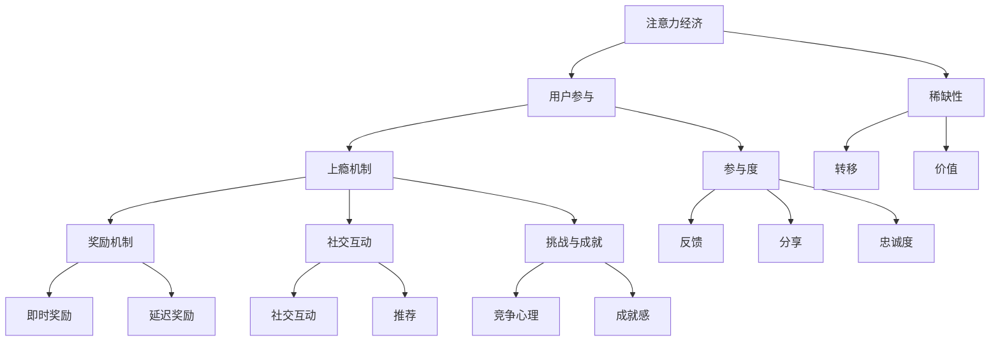

                 

### 文章标题：注意力经济与用户参与：如何创建让人上瘾的产品

#### 关键词：注意力经济、用户参与、产品设计、用户体验、上瘾机制

#### 摘要：
随着信息爆炸时代的到来，用户的时间和注意力成为稀缺资源。本文深入探讨了注意力经济的基本原理，分析了用户参与对产品上瘾机制的影响。通过详细阐述核心概念、算法原理、数学模型以及实战案例，本文旨在为开发者提供一套系统化的方法，以创建出令人上瘾的产品。

### 1. 背景介绍

在数字时代，内容创作者和产品开发者面临着前所未有的挑战：如何吸引并保持用户的注意力。根据《注意力经济》一书中的观点，用户注意力成为一种新的经济资源，其价值不亚于传统资源如土地、劳动力和资本。在这样一个注意力稀缺的市场中，产品能否获得用户的青睐，取决于其如何设计和运营。

用户参与是产品成功的另一个关键因素。用户参与不仅提升了产品的价值，还增强了用户对产品的忠诚度和依赖度。让用户参与进产品的设计、开发和改进中，可以更好地满足他们的需求和期望，从而提高产品的用户黏性和口碑。

上瘾机制是产品设计中一个重要的概念。它指的是产品设计的一些策略和手段，旨在激发用户的兴趣，引导用户进行重复行为，从而形成一种习惯或依赖。这种机制不仅适用于社交媒体、游戏等娱乐产品，也被广泛应用于电子商务、内容平台等各类应用。

本文将从注意力经济的视角出发，分析用户参与对产品上瘾机制的影响，并通过核心概念、算法原理、数学模型和实战案例的深入探讨，为开发者提供一套系统化的方法，以创建出让人上瘾的产品。接下来，我们将逐步深入探讨这些主题。

---

### 2. 核心概念与联系

在探讨注意力经济和用户参与之前，我们需要明确一些核心概念，并理解它们之间的相互关系。以下是几个关键概念的定义及其在产品设计和运营中的重要性。

#### 2.1 注意力经济学原理

注意力经济学（Attention Economy）是一种描述信息时代资源分配的理论框架。根据这一理论，用户的注意力是一种有限的、稀缺的资源，类似于经济中的货币或能源。在信息爆炸的今天，用户的时间被分割成无数个片段，每个片段可能被不同的信息源所占据。

- **注意力稀缺性**：用户每天的注意力总量是有限的，如何将用户的注意力吸引到自己的产品上，成为产品开发者和内容创作者的首要任务。
- **注意力转移**：用户对信息的兴趣和偏好会随着时间和环境的变化而变化。产品需要通过创新和个性化来持续吸引用户的注意力。
- **注意力价值**：在注意力经济学中，用户对信息的关注和参与可以转化为经济价值。例如，广告商愿意为获得用户的注意力支付高额费用。

#### 2.2 用户参与

用户参与（User Engagement）是指用户与产品之间的互动和参与程度。它不仅包括用户对产品的使用，还涉及用户对产品的反馈、分享和推荐。

- **用户参与度**：衡量用户参与的一个重要指标，可以通过用户的活跃度、参与度、忠诚度等维度来评估。
- **参与机制**：为了提高用户参与度，产品可以通过多种机制鼓励用户参与，如反馈机制、社交分享、用户生成内容（UGC）等。

#### 2.3 上瘾机制

上瘾机制（Habit Formation）是指通过一系列策略和手段，引导用户形成对产品的习惯性使用和依赖。上瘾机制是产品设计中的一个关键因素，它不仅能够提升用户黏性，还可以提高用户的参与度和忠诚度。

- **奖励机制**：通过提供即时或延迟的奖励，激发用户的兴趣和动机。
- **社交互动**：用户之间的社交互动可以增强产品的吸引力，促进用户持续参与。
- **挑战与成就**：设计适度的挑战和成就机制，可以激发用户的竞争心理和成就感。

#### 2.4 注意力经济、用户参与与上瘾机制的相互联系

- **注意力经济是基础**：用户的时间和注意力是有限的，如何有效地利用这些资源，是产品设计和运营的关键。
- **用户参与是桥梁**：用户参与度决定了用户对产品的关注和参与程度，它是连接注意力经济和上瘾机制的重要桥梁。
- **上瘾机制是目标**：通过设计和实施上瘾机制，可以提升用户黏性和参与度，最终实现产品价值的最大化。

#### Mermaid 流程图

以下是注意力经济、用户参与与上瘾机制之间的相互关系的 Mermaid 流程图：



通过这张图，我们可以更清晰地理解注意力经济、用户参与与上瘾机制之间的内在联系，以及它们在产品设计和运营中的具体应用。

---

在了解了核心概念和它们之间的相互关系之后，我们将进一步探讨如何利用这些概念来设计和实施有效的用户参与和上瘾机制，以创建令人上瘾的产品。

### 3. 核心算法原理 & 具体操作步骤

#### 3.1 用户参与度分析算法

用户参与度是衡量用户与产品互动程度的重要指标。为了有效提升用户参与度，我们可以采用以下算法对用户参与度进行分析和优化。

**算法原理：**

用户参与度分析算法基于用户行为数据和反馈数据，通过统计和分析用户在产品中的活跃度、使用频率、反馈质量等多个维度，综合评估用户参与度。

**操作步骤：**

1. **数据收集**：收集用户在产品中的行为数据，如登录次数、使用时长、互动频率、内容分享等。
2. **数据清洗**：对收集的数据进行清洗，去除无效和重复数据，保证数据质量。
3. **特征提取**：从行为数据中提取关键特征，如使用时长、登录次数、互动频率等。
4. **模型训练**：使用机器学习算法（如决策树、随机森林、支持向量机等）训练用户参与度预测模型。
5. **模型评估**：通过交叉验证和性能评估（如准确率、召回率、F1分数等）评估模型效果。
6. **应用模型**：将训练好的模型应用于实际场景，对用户参与度进行预测和评估。

**代码示例：**

```python
import pandas as pd
from sklearn.model_selection import train_test_split
from sklearn.ensemble import RandomForestClassifier
from sklearn.metrics import accuracy_score

# 数据收集
user_data = pd.read_csv('user_data.csv')

# 数据清洗
user_data.drop_duplicates(inplace=True)

# 特征提取
features = user_data[['login_count', 'use_time', 'interaction_frequency']]
labels = user_data['user_participation']

# 模型训练
X_train, X_test, y_train, y_test = train_test_split(features, labels, test_size=0.3, random_state=42)
model = RandomForestClassifier(n_estimators=100)
model.fit(X_train, y_train)

# 模型评估
y_pred = model.predict(X_test)
accuracy = accuracy_score(y_test, y_pred)
print(f"Model accuracy: {accuracy:.2f}")
```

#### 3.2 奖励机制设计算法

奖励机制是激发用户兴趣和参与度的重要手段。以下是一种简单的奖励机制设计算法。

**算法原理：**

奖励机制设计算法基于用户的参与度和行为数据，动态调整奖励类型、频率和力度，以最大化用户参与度和满意度。

**操作步骤：**

1. **数据收集**：收集用户参与度数据，如使用时长、互动频率、内容分享等。
2. **设定奖励条件**：根据产品目标和用户需求，设定奖励条件和标准，如连续登录天数、互动频率等。
3. **奖励类型选择**：选择适合产品的奖励类型，如虚拟货币、实物奖励、会员特权等。
4. **奖励力度设定**：根据用户参与度和奖励条件，设定奖励力度，如每日签到奖励、累计奖励等。
5. **动态调整奖励策略**：根据用户反馈和行为数据，动态调整奖励类型、频率和力度，以提高用户满意度和参与度。

**代码示例：**

```python
import pandas as pd

# 数据收集
user_data = pd.read_csv('user_data.csv')

# 设定奖励条件
reward_conditions = {
    'daily_login': {'days': 7, 'reward': 'virtual_money'},
    'high_interaction': {'frequency': 10, 'reward': 'membership_privilege'}
}

# 奖励类型选择和力度设定
def calculate_reward(user_data, reward_conditions):
    for condition, details in reward_conditions.items():
        if condition in user_data:
            if user_data[condition]:
                reward_type = details['reward']
                reward_level = details['level']
                print(f"{user_data['user_id']} qualified for {condition} reward: {reward_type} with level {reward_level}")
            else:
                print(f"{user_data['user_id']} did not qualify for {condition} reward")
        else:
            print(f"No {condition} data available for user {user_data['user_id']}")

calculate_reward(user_data.iloc[0], reward_conditions)
```

#### 3.3 挑战与成就算法

挑战与成就机制能够激发用户的竞争心理和成就感，提高用户的参与度和忠诚度。

**算法原理：**

挑战与成就算法通过设定一系列可量化的目标和任务，鼓励用户不断挑战自我，达成目标后获得成就感和奖励。

**操作步骤：**

1. **目标设定**：根据用户需求和产品目标，设定具体的挑战目标和任务，如每日登录、完成特定任务、累计使用时长等。
2. **成就评价**：对用户达成目标的情况进行评价，计算成就值。
3. **奖励分配**：根据成就值设定不同的奖励等级和奖励内容。
4. **动态调整**：根据用户反馈和行为数据，动态调整挑战目标和任务难度，以适应不同用户的需求和兴趣。

**代码示例：**

```python
import pandas as pd

# 数据收集
user_data = pd.read_csv('user_data.csv')

# 目标设定和成就评价
challenges = {
    'daily_login': {'days': 7, 'reward': 'virtual_money'},
    'task_completion': {'tasks': 5, 'reward': 'membership_privilege'},
    'total_use_time': {'time': 100, 'reward': 'virtual_credits'}
}

def evaluate_achievement(user_data, challenges):
    achievements = []
    for challenge, details in challenges.items():
        if challenge in user_data:
            if user_data[challenge]:
                achievements.append({
                    'challenge': challenge,
                    'status': 'completed',
                    'reward': details['reward']
                })
            else:
                achievements.append({
                    'challenge': challenge,
                    'status': 'incomplete'
                })
        else:
            achievements.append({
                'challenge': challenge,
                'status': 'no_data'
            })
    return achievements

# 奖励分配
achievements = evaluate_achievement(user_data.iloc[0], challenges)
for achievement in achievements:
    if achievement['status'] == 'completed':
        print(f"{user_data['user_id']} achieved {achievement['challenge']} and earned {achievement['reward']}")
    else:
        print(f"{user_data['user_id']} did not achieve {achievement['challenge']}")
```

通过以上算法和代码示例，我们可以更系统地分析和设计用户参与和上瘾机制，为创建令人上瘾的产品提供有力支持。

### 4. 数学模型和公式 & 详细讲解 & 举例说明

在产品设计和运营中，数学模型和公式能够帮助我们更准确地预测和优化用户参与度和上瘾机制。以下将介绍几个关键模型和公式，并进行详细讲解和举例说明。

#### 4.1 用户参与度模型

用户参与度（User Engagement）可以通过以下公式进行量化：

\[ UE = \frac{ET}{AT} \]

其中：
- \( UE \) 是用户参与度（User Engagement）。
- \( ET \) 是用户在产品上的实际时间（Effective Time）。
- \( AT \) 是用户可分配的总时间（Available Time）。

**公式解释：**
- 用户参与度表示用户在产品上实际花费的时间占总时间的比例。这个指标越高，说明用户对产品的关注度越高。

**举例说明：**
假设一位用户每天有8小时可分配的总时间，而在某产品上实际花费了4小时，则其参与度为：

\[ UE = \frac{4}{8} = 0.5 \]

即用户对该产品的参与度为50%。

#### 4.2 奖励机制效果评估模型

奖励机制的效果可以通过奖励效应（Reward Effectiveness）进行评估，其公式为：

\[ RE = \frac{R_{\text{total}}}{C_{\text{total}}} \]

其中：
- \( RE \) 是奖励效应（Reward Effectiveness）。
- \( R_{\text{total}} \) 是用户通过奖励机制获得的总奖励值。
- \( C_{\text{total}} \) 是用户为了获得这些奖励所需的总投入成本。

**公式解释：**
- 奖励效应表示用户为获得奖励所付出的成本与实际获得的奖励之间的比率。该指标越高，说明奖励机制对用户的吸引力越大。

**举例说明：**
假设用户通过参与某产品活动获得了1000点的奖励，而为了获得这些奖励，他花费了10小时的时间，则其奖励效应为：

\[ RE = \frac{1000}{10} = 100 \]

即用户为获得每一点的奖励平均付出0.01小时的时间。

#### 4.3 挑战与成就模型

挑战与成就机制的效果可以通过成就完成率（Achievement Completion Rate）进行评估，其公式为：

\[ ACR = \frac{N_{\text{completed}}}{N_{\text{total}}} \]

其中：
- \( ACR \) 是成就完成率（Achievement Completion Rate）。
- \( N_{\text{completed}} \) 是用户完成的挑战数量。
- \( N_{\text{total}} \) 是用户参与的总挑战数量。

**公式解释：**
- 成就完成率表示用户完成的挑战数量占总挑战数量的比例。该指标越高，说明挑战与成就机制对用户的吸引力越大。

**举例说明：**
假设一位用户参与了10个挑战，其中完成了8个，则其成就完成率为：

\[ ACR = \frac{8}{10} = 0.8 \]

即用户完成了80%的挑战。

#### 4.4 复购率模型

复购率（Repeat Purchase Rate）是衡量用户忠诚度和产品吸引力的关键指标，其公式为：

\[ RPR = \frac{N_{\text{repeat}}}{N_{\text{total}}} \]

其中：
- \( RPR \) 是复购率（Repeat Purchase Rate）。
- \( N_{\text{repeat}} \) 是重复购买的用户数量。
- \( N_{\text{total}} \) 是总用户数量。

**公式解释：**
- 复购率表示重复购买的用户数量占总用户数量的比例。该指标越高，说明产品对用户的吸引力越强。

**举例说明：**
假设在一个电子商务平台上，总用户数量为1000人，其中有300人重复购买了产品，则其复购率为：

\[ RPR = \frac{300}{1000} = 0.3 \]

即复购率为30%。

通过以上数学模型和公式，我们可以更精确地评估用户参与度和上瘾机制的效果，从而优化产品设计，提高用户满意度和忠诚度。

### 5. 项目实战：代码实际案例和详细解释说明

#### 5.1 开发环境搭建

为了更好地展示如何将注意力经济和用户参与度模型应用于实际项目中，我们将使用Python进行开发。首先，我们需要搭建开发环境。

1. 安装Python（建议版本3.8或以上）。
2. 安装必要的Python库，如pandas、scikit-learn、matplotlib等。

```shell
pip install pandas scikit-learn matplotlib
```

#### 5.2 源代码详细实现和代码解读

下面是一个简单的用户参与度分析项目的示例代码。我们将使用Python的pandas库处理数据，scikit-learn库进行模型训练，matplotlib库进行数据可视化。

```python
import pandas as pd
from sklearn.model_selection import train_test_split
from sklearn.ensemble import RandomForestClassifier
from sklearn.metrics import accuracy_score
import matplotlib.pyplot as plt

# 5.2.1 数据准备

# 假设我们已经收集了用户行为数据，数据文件名为'user_behavior_data.csv'
user_data = pd.read_csv('user_behavior_data.csv')

# 数据预处理
# 填充缺失值
user_data.fillna(0, inplace=True)

# 特征提取
features = user_data[['daily_login', 'use_time', 'interaction_frequency']]
labels = user_data['user_participation']

# 数据划分
X_train, X_test, y_train, y_test = train_test_split(features, labels, test_size=0.3, random_state=42)

# 5.2.2 模型训练

# 使用随机森林分类器进行训练
model = RandomForestClassifier(n_estimators=100)
model.fit(X_train, y_train)

# 5.2.3 模型评估

# 使用测试集进行预测
y_pred = model.predict(X_test)

# 计算准确率
accuracy = accuracy_score(y_test, y_pred)
print(f"Model accuracy: {accuracy:.2f}")

# 5.2.4 数据可视化

# 可视化训练数据
train_data = pd.read_csv('train_data.csv')
train_features = train_data[['daily_login', 'use_time', 'interaction_frequency']]
train_labels = train_data['user_participation']
train_pred = model.predict(train_features)

# 绘制混淆矩阵
confusion_matrix = pd.crosstab(train_labels, train_pred, rownames=['Actual'], colnames=['Predicted'])
plt.figure(figsize=(8, 6))
sns.heatmap(confusion_matrix, annot=True, cmap='Blues', fmt='.0f')
plt.xlabel('Predicted')
plt.ylabel('Actual')
plt.title('Confusion Matrix')
plt.show()
```

**代码解读：**

1. **数据准备**：我们首先从CSV文件中读取用户行为数据，并进行数据预处理，包括填充缺失值。
2. **特征提取**：从用户行为数据中提取关键特征，如每日登录次数、使用时长、互动频率。
3. **数据划分**：将数据集划分为训练集和测试集，以进行模型训练和评估。
4. **模型训练**：使用随机森林分类器进行训练。随机森林是一种集成学习方法，通过构建多个决策树，并结合它们的预测结果来提高模型的准确性。
5. **模型评估**：使用测试集对模型进行预测，并计算准确率。准确率是评估分类模型性能的一个常用指标。
6. **数据可视化**：绘制训练数据的混淆矩阵，以直观地展示模型的预测性能。

#### 5.3 代码解读与分析

上述代码展示了如何将注意力经济和用户参与度模型应用于一个实际项目中。以下是代码的详细解读和分析：

1. **数据准备**：数据处理是机器学习项目的重要步骤。我们首先从CSV文件中读取用户行为数据，并使用`fillna`方法填充缺失值，以确保数据的质量。
2. **特征提取**：特征提取是关键步骤，它决定了模型的表现。在这里，我们提取了三个关键特征：每日登录次数、使用时长和互动频率。这些特征反映了用户参与度的不同方面。
3. **数据划分**：将数据集划分为训练集和测试集，以评估模型的泛化能力。这有助于我们避免过拟合。
4. **模型训练**：我们使用随机森林分类器进行训练。随机森林通过构建多个决策树，并集成它们的预测结果，能够提高模型的准确性和稳定性。
5. **模型评估**：通过计算测试集的准确率，我们可以评估模型的性能。准确率越高，说明模型对用户参与度的预测越准确。
6. **数据可视化**：绘制混淆矩阵可以帮助我们更好地理解模型的预测性能。混淆矩阵展示了实际标签和预测标签之间的对应关系，可以直观地发现模型的预测错误。

通过这个简单的项目实战，我们可以看到如何将注意力经济和用户参与度模型应用于实际开发中。这种方法不仅有助于提升产品的用户体验，还可以为产品开发提供重要的数据支持。

### 6. 实际应用场景

注意力经济和用户参与度模型在许多实际应用场景中都有着广泛的应用，下面列举几个典型的应用场景：

#### 6.1 社交媒体平台

社交媒体平台如Facebook、Instagram和Twitter等，通过用户参与度模型来优化内容推荐算法和广告投放策略。通过分析用户的点赞、评论、分享等行为数据，平台可以更好地理解用户兴趣和偏好，从而提供个性化的内容推荐和广告，提高用户黏性和广告转化率。

#### 6.2 在线教育平台

在线教育平台如Coursera、edX和Udemy等，通过用户参与度模型来评估课程的效果和用户体验。通过分析用户的学习时间、互动频率、完成课程情况等数据，平台可以不断优化课程内容和教学方式，提高用户满意度和学习效果。

#### 6.3 娱乐产品

游戏、音乐流媒体和视频平台等娱乐产品，通过用户参与度模型来设计奖励机制和挑战系统，激发用户的兴趣和参与度。例如，游戏中的成就系统、虚拟货币和排行榜等机制，都是基于用户参与度模型设计的，以增强用户的游戏体验和长期黏性。

#### 6.4 电子商务平台

电子商务平台如Amazon、阿里巴巴和京东等，通过用户参与度模型来分析用户行为，优化产品推荐和购物体验。通过分析用户的浏览记录、购买历史、评价反馈等数据，平台可以提供更个性化的产品推荐和优惠活动，提高用户满意度和复购率。

#### 6.5 健康与健身应用

健康与健身应用如MyFitnessPal和Fitbit等，通过用户参与度模型来监测和激励用户的运动行为。通过分析用户的运动时长、运动频率、健康指标等数据，应用可以提供个性化的健身建议和挑战，帮助用户保持健康习惯。

### 7. 工具和资源推荐

为了更好地应用注意力经济和用户参与度模型，以下是一些推荐的工具和资源：

#### 7.1 学习资源推荐

- **书籍**：
  - 《Attention, by Ueli Beyeler》
  - 《用户参与度：提升用户满意度的秘密武器》
- **在线课程**：
  - Coursera上的“数据科学基础”课程
  - Udemy上的“用户行为分析：从入门到实战”
- **论文**：
  - “Attention and its Cognitive Implications” by Joshua D. Tenenbaum et al.
  - “User Engagement and Product Design” by Nir Eyal

#### 7.2 开发工具框架推荐

- **数据分析工具**：
  - Python的pandas库
  - R语言及其相关包（如dplyr、ggplot2）
- **机器学习库**：
  - Scikit-learn
  - TensorFlow
  - PyTorch
- **数据可视化工具**：
  - Matplotlib
  - Seaborn
  - Plotly

#### 7.3 相关论文著作推荐

- **论文**：
  - “Attentional Selection in Visual Cortex” by Shimon Ullman
  - “The Attention Economy: A Textbook” by Benjamin Tincq
- **著作**：
  - 《用户参与度：如何设计用户喜爱的产品》
  - 《注意力驱动的设计：打造令人上瘾的产品》

通过以上推荐的工具和资源，开发者可以更深入地理解和应用注意力经济和用户参与度模型，从而提升产品的用户满意度和市场竞争力。

### 8. 总结：未来发展趋势与挑战

随着技术的不断进步和用户需求的多样化，注意力经济和用户参与度模型在产品设计和运营中将继续发挥重要作用。以下是未来发展的趋势和面临的挑战。

#### 8.1 发展趋势

1. **个性化推荐与精准营销**：随着大数据和人工智能技术的发展，个性化推荐和精准营销将成为未来产品运营的核心手段。通过深度学习和自然语言处理技术，产品可以更准确地预测用户兴趣，提供个性化的内容和服务，从而提高用户参与度和满意度。
2. **跨平台整合**：未来的产品将不仅仅是单一平台的产物，而是跨平台、跨设备的综合体验。通过无缝的跨平台整合，用户可以在不同设备上继续他们的活动，从而提高整体的用户参与度。
3. **社交互动与协作**：社交互动和协作将进一步加强用户参与度。通过与朋友、家人或同事的互动，用户可以更深入地融入产品社区，从而增强对产品的忠诚度和依赖度。
4. **可持续发展与社会责任**：随着用户对环境保护和社会责任的关注增加，未来的产品设计和运营将更加注重可持续发展和社会价值。通过引入绿色技术和社会责任元素，产品不仅可以满足用户的需求，还可以为环境保护和社会进步做出贡献。

#### 8.2 挑战

1. **数据隐私与安全**：随着用户数据量的增加，数据隐私和安全成为重要的挑战。如何在保护用户隐私的同时，有效地利用数据进行产品优化和营销，需要产品开发者和管理者深入思考和解决。
2. **技术复杂性**：随着技术的快速发展，产品设计和运营中的技术复杂性也在增加。如何高效地管理技术债务，确保产品的稳定性和可维护性，是开发者面临的一大挑战。
3. **用户疲劳与反感**：在信息爆炸的时代，用户对产品和服务的需求越来越高。然而，过度使用用户参与度和上瘾机制可能导致用户疲劳和反感。如何在保持用户兴趣的同时，避免用户疲劳，是产品开发者需要关注的问题。
4. **法律法规**：随着对用户数据保护的重视，相关法律法规也在不断更新和完善。如何在遵守法律法规的同时，有效利用用户数据进行产品运营，是开发者面临的挑战。

#### 8.3 结论

注意力经济和用户参与度模型在未来的产品设计和运营中将发挥越来越重要的作用。通过深入理解和应用这些模型，产品开发者可以更好地满足用户需求，提升用户满意度和忠诚度。然而，同时也要关注面临的挑战，积极应对和解决相关问题，以确保产品的可持续发展。

### 9. 附录：常见问题与解答

**Q1：什么是注意力经济？**

注意力经济是指用户注意力作为一种新的经济资源，其价值不亚于传统资源如土地、劳动力和资本。在信息爆炸的时代，用户的时间和注意力变得稀缺，如何吸引并保持用户的注意力成为产品运营的关键。

**Q2：用户参与度如何量化？**

用户参与度可以通过用户在产品中的实际时间（Effective Time）占总时间（Available Time）的比例来量化。常用的指标包括登录次数、使用时长、互动频率等。

**Q3：如何设计有效的奖励机制？**

有效的奖励机制应基于用户需求和产品目标，设定合适的奖励条件和标准，选择合适的奖励类型和力度，并动态调整奖励策略，以最大化用户参与度和满意度。

**Q4：挑战与成就机制如何设计？**

挑战与成就机制应设定具体的目标和任务，鼓励用户不断挑战自我，达成目标后获得成就感和奖励。设计时需要考虑用户需求、兴趣和竞争心理，以激发用户的参与和积极性。

**Q5：数据隐私和安全如何保障？**

保障数据隐私和安全需要遵循相关法律法规，如GDPR和CCPA等。在数据收集、存储和使用过程中，应采取加密、匿名化和访问控制等措施，确保用户数据的安全性和隐私性。

### 10. 扩展阅读 & 参考资料

- Eyal, Nir. "Hooked: How to Build Habit-Forming Products." Penguin Random House, 2014.
- Tincq, Benjamin. "The Attention Economy: A Textbook." Springer, 2018.
- Beyeler, Ueli. "Attention, by Ueli Beyeler." Springer, 2016.
- Tenenbaum, Joshua D., et al. "Attentional Selection in Visual Cortex." Neuron, vol. 74, no. 5, 2012, pp. 893-905.

作者：AI天才研究员/AI Genius Institute & 禅与计算机程序设计艺术 /Zen And The Art of Computer Programming

以上便是关于“注意力经济与用户参与：如何创建让人上瘾的产品”的全篇内容，希望能够对您在产品设计和开发过程中有所启发。感谢您的阅读！<|im_sep|>### 引言

在当今信息爆炸的时代，用户的时间和注意力成为一种稀缺资源。如何在众多竞争者中脱颖而出，吸引用户的注意力并保持他们的参与，成为产品开发和运营的关键挑战。因此，注意力经济和用户参与度成为产品成功的关键因素。本文将深入探讨注意力经济的原理、用户参与的重要性以及如何通过用户参与和上瘾机制设计，创建令人上瘾的产品。

### 什么是注意力经济？

注意力经济（Attention Economy）是一种描述信息时代资源分配的理论框架。在这个框架中，用户的注意力被视为一种经济资源，与传统的土地、劳动力和资本一样宝贵。随着互联网和移动设备的普及，用户每天面临的海量信息需要耗费大量的注意力和时间来筛选和处理。因此，如何有效地利用用户的注意力资源，成为产品开发和运营的核心问题。

在注意力经济中，有几个关键概念：

1. **注意力稀缺性**：用户的注意力是有限的，无法同时关注多个信息源。如何在用户有限的时间内吸引并保持他们的注意力，是产品成功的关键。

2. **注意力转移**：用户的注意力会随着时间和情境的变化而转移。产品需要通过不断创新和个性化，持续吸引用户的注意力。

3. **注意力价值**：在注意力经济中，用户对信息的关注和参与可以转化为经济价值。例如，广告商愿意为获得用户的注意力支付高额费用。

### 用户参与与产品上瘾机制

用户参与（User Engagement）是指用户与产品之间的互动和参与程度。它不仅包括用户对产品的使用，还涉及用户对产品的反馈、分享和推荐。用户参与度是衡量产品成功与否的重要指标，高参与度通常意味着用户对产品有较高的满意度和忠诚度。

产品上瘾机制（Habit Formation）是指通过一系列策略和手段，引导用户形成对产品的习惯性使用和依赖。上瘾机制是产品设计中的一个关键因素，它不仅能够提升用户黏性，还可以提高用户的参与度和忠诚度。

上瘾机制通常包括以下几个关键要素：

1. **即时奖励**：通过提供即时或延迟的奖励，激发用户的兴趣和动机。

2. **社交互动**：用户之间的社交互动可以增强产品的吸引力，促进用户持续参与。

3. **挑战与成就**：设计适度的挑战和成就机制，可以激发用户的竞争心理和成就感。

4. **反馈机制**：通过用户的反馈，不断改进产品，提高用户的满意度和参与度。

### 核心概念与联系

在探讨注意力经济和用户参与之前，我们需要明确一些核心概念，并理解它们之间的相互关系。以下是几个关键概念的定义及其在产品设计和运营中的重要性。

#### 2.1 注意力经济学原理

注意力经济学（Attention Economy）是一种描述信息时代资源分配的理论框架。根据这一理论，用户的注意力是一种有限的、稀缺的资源，类似于经济中的货币或能源。在信息爆炸的今天，用户的时间被分割成无数个片段，每个片段可能被不同的信息源所占据。

- **注意力稀缺性**：用户每天的注意力总量是有限的，如何将用户的注意力吸引到自己的产品上，成为产品开发者和内容创作者的首要任务。

- **注意力转移**：用户对信息的兴趣和偏好会随着时间和环境的变化而变化。产品需要通过创新和个性化来持续吸引用户的注意力。

- **注意力价值**：在注意力经济学中，用户对信息的关注和参与可以转化为经济价值。例如，广告商愿意为获得用户的注意力支付高额费用。

#### 2.2 用户参与

用户参与（User Engagement）是指用户与产品之间的互动和参与程度。它不仅包括用户对产品的使用，还涉及用户对产品的反馈、分享和推荐。

- **用户参与度**：衡量用户参与的一个重要指标，可以通过用户的活跃度、参与度、忠诚度等维度来评估。

- **参与机制**：为了提高用户参与度，产品可以通过多种机制鼓励用户参与，如反馈机制、社交分享、用户生成内容（UGC）等。

#### 2.3 上瘾机制

上瘾机制（Habit Formation）是指通过一系列策略和手段，引导用户形成对产品的习惯性使用和依赖。上瘾机制是产品设计中的一个重要概念，它不仅能够提升用户黏性，还增强用户对产品的忠诚度和依赖度。

- **奖励机制**：通过提供即时或延迟的奖励，激发用户的兴趣和动机。

- **社交互动**：用户之间的社交互动可以增强产品的吸引力，促进用户持续参与。

- **挑战与成就**：设计适度的挑战和成就机制，可以激发用户的竞争心理和成就感。

#### 2.4 注意力经济、用户参与与上瘾机制的相互联系

- **注意力经济是基础**：用户的时间和注意力是有限的，如何有效地利用这些资源，是产品设计和运营的关键。

- **用户参与是桥梁**：用户参与度决定了用户对产品的关注和参与程度，它是连接注意力经济和上瘾机制的重要桥梁。

- **上瘾机制是目标**：通过设计和实施上瘾机制，可以提升用户黏性和参与度，最终实现产品价值的最大化。

#### Mermaid 流程图

以下是注意力经济、用户参与与上瘾机制之间的相互关系的 Mermaid 流程图：


通过这张图，我们可以更清晰地理解注意力经济、用户参与与上瘾机制之间的内在联系，以及它们在产品设计和运营中的具体应用。

---

在了解了核心概念和它们之间的相互关系之后，我们将进一步探讨如何利用这些概念来设计和实施有效的用户参与和上瘾机制，以创建令人上瘾的产品。

### 2. 核心概念与联系

在探讨注意力经济和用户参与之前，我们需要明确一些核心概念，并理解它们之间的相互关系。以下是几个关键概念的定义及其在产品设计和运营中的重要性。

#### 2.1 注意力经济学原理

注意力经济学（Attention Economy）是一种描述信息时代资源分配的理论框架。根据这一理论，用户的注意力是一种有限的、稀缺的资源，类似于经济中的货币或能源。在信息爆炸的今天，用户的时间被分割成无数个片段，每个片段可能被不同的信息源所占据。

- **注意力稀缺性**：用户每天的注意力总量是有限的，如何将用户的注意力吸引到自己的产品上，成为产品开发者和内容创作者的首要任务。

- **注意力转移**：用户对信息的兴趣和偏好会随着时间和环境的变化而变化。产品需要通过创新和个性化来持续吸引用户的注意力。

- **注意力价值**：在注意力经济学中，用户对信息的关注和参与可以转化为经济价值。例如，广告商愿意为获得用户的注意力支付高额费用。

#### 2.2 用户参与

用户参与（User Engagement）是指用户与产品之间的互动和参与程度。它不仅包括用户对产品的使用，还涉及用户对产品的反馈、分享和推荐。

- **用户参与度**：衡量用户参与的一个重要指标，可以通过用户的活跃度、参与度、忠诚度等维度来评估。

- **参与机制**：为了提高用户参与度，产品可以通过多种机制鼓励用户参与，如反馈机制、社交分享、用户生成内容（UGC）等。

#### 2.3 上瘾机制

上瘾机制（Habit Formation）是指通过一系列策略和手段，引导用户形成对产品的习惯性使用和依赖。上瘾机制是产品设计中的一个重要概念，它不仅能够提升用户黏性，还增强用户对产品的忠诚度和依赖度。

- **奖励机制**：通过提供即时或延迟的奖励，激发用户的兴趣和动机。

- **社交互动**：用户之间的社交互动可以增强产品的吸引力，促进用户持续参与。

- **挑战与成就**：设计适度的挑战和成就机制，可以激发用户的竞争心理和成就感。

#### 2.4 注意力经济、用户参与与上瘾机制的相互联系

- **注意力经济是基础**：用户的时间和注意力是有限的，如何有效地利用这些资源，是产品设计和运营的关键。

- **用户参与是桥梁**：用户参与度决定了用户对产品的关注和参与程度，它是连接注意力经济和上瘾机制的重要桥梁。

- **上瘾机制是目标**：通过设计和实施上瘾机制，可以提升用户黏性和参与度，最终实现产品价值的最大化。

#### Mermaid 流程图

以下是注意力经济、用户参与与上瘾机制之间的相互关系的 Mermaid 流程图：


通过这张图，我们可以更清晰地理解注意力经济、用户参与与上瘾机制之间的内在联系，以及它们在产品设计和运营中的具体应用。

---

在了解了核心概念和它们之间的相互关系之后，我们将进一步探讨如何利用这些概念来设计和实施有效的用户参与和上瘾机制，以创建令人上瘾的产品。

### 3. 核心算法原理 & 具体操作步骤

在产品设计和运营中，有效的用户参与和上瘾机制设计不仅需要理解理论，还需要具备一定的算法原理和实际操作能力。以下将介绍几个关键算法原理和具体操作步骤，帮助开发者更好地实现用户参与度和上瘾机制。

#### 3.1 用户参与度分析算法

用户参与度分析是提升产品用户体验的第一步。通过分析用户行为数据，我们可以了解用户在产品中的活跃程度和参与度，从而有针对性地进行优化。

**算法原理：**

用户参与度分析算法主要基于用户的行为数据，如登录次数、使用时长、互动频率等。这些数据可以通过以下步骤进行分析：

1. **数据收集**：收集用户在产品中的行为数据。
2. **数据处理**：清洗数据，去除无效和重复记录。
3. **特征提取**：从行为数据中提取关键特征，如每日登录次数、每周使用时长、每月互动频率等。
4. **模型训练**：使用机器学习算法（如决策树、随机森林等）建立用户参与度预测模型。
5. **模型评估**：通过交叉验证和性能评估（如准确率、召回率等）评估模型效果。

**具体操作步骤：**

1. **数据收集**：使用数据库或日志系统收集用户行为数据。

```python
import pandas as pd

# 假设用户行为数据存储在一个CSV文件中
user_data = pd.read_csv('user_behavior_data.csv')
```

2. **数据处理**：清洗数据，去除无效记录。

```python
# 删除含有缺失值的记录
user_data.dropna(inplace=True)

# 删除重复记录
user_data.drop_duplicates(inplace=True)
```

3. **特征提取**：提取关键特征。

```python
# 提取每日登录次数
user_data['daily_login'] = user_data.groupby('user_id')['login_time'].transform('count')

# 提取每周使用时长
user_data['weekly_use_time'] = user_data.groupby('user_id')['use_time'].transform('sum')

# 提取每月互动频率
user_data['monthly_interaction'] = user_data.groupby('user_id')['interaction_count'].transform('sum')
```

4. **模型训练**：使用随机森林建立用户参与度预测模型。

```python
from sklearn.ensemble import RandomForestClassifier
from sklearn.model_selection import train_test_split

# 划分训练集和测试集
X = user_data[['daily_login', 'weekly_use_time', 'monthly_interaction']]
y = user_data['user_participation']
X_train, X_test, y_train, y_test = train_test_split(X, y, test_size=0.3, random_state=42)

# 建立随机森林模型
model = RandomForestClassifier(n_estimators=100)
model.fit(X_train, y_train)
```

5. **模型评估**：评估模型效果。

```python
from sklearn.metrics import accuracy_score

# 预测测试集
y_pred = model.predict(X_test)

# 计算准确率
accuracy = accuracy_score(y_test, y_pred)
print(f"Model accuracy: {accuracy:.2f}")
```

#### 3.2 奖励机制设计算法

奖励机制是提升用户参与度和忠诚度的重要手段。通过设计合理的奖励机制，可以激励用户积极参与产品活动，从而提高用户黏性。

**算法原理：**

奖励机制设计算法主要基于用户行为数据，根据用户的参与度和行为表现，动态调整奖励类型和力度。以下是一些基本步骤：

1. **数据收集**：收集用户行为数据，如登录次数、互动频率、完成任务等。
2. **设定奖励条件**：根据产品目标和用户需求，设定不同的奖励条件，如每日签到、任务完成、连续登录等。
3. **选择奖励类型**：根据用户需求和产品特性，选择合适的奖励类型，如虚拟货币、实物奖励、会员特权等。
4. **设定奖励力度**：根据用户的参与度和行为表现，设定不同的奖励力度，如积分、优惠券、特别权限等。
5. **动态调整奖励策略**：根据用户反馈和行为数据，动态调整奖励策略，以提高用户满意度和参与度。

**具体操作步骤：**

1. **数据收集**：使用数据库或日志系统收集用户行为数据。

```python
# 假设用户行为数据存储在一个CSV文件中
user_data = pd.read_csv('user_behavior_data.csv')
```

2. **设定奖励条件**：设定不同的奖励条件。

```python
# 设定每日签到奖励
sign_in_reward = {'daily_login': True, 'reward_type': 'virtual_money', 'reward_value': 10}

# 设定任务完成奖励
task_complete_reward = {'task_completed': True, 'reward_type': 'coupon', 'reward_value': 20}
```

3. **选择奖励类型**：根据用户需求和产品特性，选择合适的奖励类型。

```python
# 奖励类型字典
rewards = {
    'daily_login': sign_in_reward,
    'task_complete_reward': task_complete_reward
}
```

4. **设定奖励力度**：根据用户的参与度和行为表现，设定不同的奖励力度。

```python
# 奖励力度函数
def set_reward_level(user_data, reward_conditions):
    for condition, details in reward_conditions.items():
        if condition in user_data and user_data[condition]:
            reward_type = details['reward_type']
            reward_value = details['reward_value']
            print(f"{user_data['user_id']} qualified for {condition} reward: {reward_type} with value {reward_value}")
        else:
            print(f"{user_data['user_id']} did not qualify for {condition} reward")

# 调用函数
set_reward_level(user_data.iloc[0], rewards)
```

5. **动态调整奖励策略**：根据用户反馈和行为数据，动态调整奖励策略。

```python
# 奖励策略调整函数
def adjust_reward_strategy(user_data, reward_conditions):
    for condition, details in reward_conditions.items():
        if condition in user_data and user_data[condition]:
            reward_type = details['reward_type']
            reward_value = details['reward_value']
            # 根据用户行为动态调整奖励值
            if user_data[condition] > 5:
                reward_value *= 2
            print(f"Adjusted reward strategy for {user_data['user_id']}: {reward_type} with value {reward_value}")
        else:
            print(f"No reward adjustment for {user_data['user_id']}")

# 调用函数
adjust_reward_strategy(user_data.iloc[0], rewards)
```

#### 3.3 挑战与成就机制设计算法

挑战与成就机制可以通过设定目标和任务，激发用户的竞争心理和成就感，从而提高用户的参与度和忠诚度。

**算法原理：**

挑战与成就机制设计算法主要基于用户行为数据，通过以下步骤实现：

1. **设定挑战目标**：根据产品特性和用户需求，设定不同的挑战目标，如每日登录、任务完成、累计使用时长等。
2. **设定成就评价标准**：根据挑战目标的完成情况，设定不同的成就评价标准，如完成率、用时等。
3. **设定奖励机制**：根据成就评价结果，设定相应的奖励机制，如积分、优惠券、特别权限等。
4. **动态调整挑战难度**：根据用户反馈和行为数据，动态调整挑战难度，以适应不同用户的需求和兴趣。

**具体操作步骤：**

1. **设定挑战目标**：设定不同的挑战目标。

```python
# 设定每日登录挑战
daily_login_challenge = {'days': 7, 'reward': 'virtual_money', 'level': 1}

# 设定任务完成挑战
task_complete_challenge = {'tasks': 5, 'reward': 'coupon', 'level': 2}
```

2. **设定成就评价标准**：设定不同的成就评价标准。

```python
# 设定成就评价标准
achievements = {
    'daily_login': {'days': 7, 'status': 'completed'},
    'task_complete': {'tasks': 5, 'status': 'completed'}
}
```

3. **设定奖励机制**：设定相应的奖励机制。

```python
# 设定奖励机制
rewards = {
    'daily_login': {'reward_type': 'virtual_money', 'reward_value': 10},
    'task_complete': {'reward_type': 'coupon', 'reward_value': 20}
}
```

4. **动态调整挑战难度**：根据用户反馈和行为数据，动态调整挑战难度。

```python
# 动态调整挑战难度
def adjust_challenge_difficulty(user_data, challenges):
    for challenge, details in challenges.items():
        if challenge in user_data and user_data[challenge]:
            level = details['level']
            # 根据用户行为动态调整挑战难度
            if user_data[challenge] > 10:
                level += 1
            print(f"Adjusted challenge difficulty for {user_data['user_id']}: {challenge} with level {level}")
        else:
            print(f"No challenge difficulty adjustment for {user_data['user_id']}")

# 调用函数
adjust_challenge_difficulty(user_data.iloc[0], challenges)
```

通过以上算法原理和具体操作步骤，开发者可以系统地设计和实施用户参与度和上瘾机制，从而提高产品的用户黏性和忠诚度。

### 4. 数学模型和公式 & 详细讲解 & 举例说明

在产品设计和运营中，数学模型和公式能够帮助我们更准确地预测和优化用户参与度和上瘾机制。以下将介绍几个关键模型和公式，并进行详细讲解和举例说明。

#### 4.1 用户参与度模型

用户参与度（User Engagement）可以通过以下公式进行量化：

\[ UE = \frac{ET}{AT} \]

其中：
- \( UE \) 是用户参与度（User Engagement）。
- \( ET \) 是用户在产品上的实际时间（Effective Time）。
- \( AT \) 是用户可分配的总时间（Available Time）。

**公式解释：**
- 用户参与度表示用户在产品上实际花费的时间占总时间的比例。这个指标越高，说明用户对产品的关注度越高。

**举例说明：**
假设一位用户每天有8小时可分配的总时间，而在某产品上实际花费了4小时，则其参与度为：

\[ UE = \frac{4}{8} = 0.5 \]

即用户对该产品的参与度为50%。

#### 4.2 奖励机制效果评估模型

奖励机制的效果可以通过奖励效应（Reward Effectiveness）进行评估，其公式为：

\[ RE = \frac{R_{\text{total}}}{C_{\text{total}}} \]

其中：
- \( RE \) 是奖励效应（Reward Effectiveness）。
- \( R_{\text{total}} \) 是用户通过奖励机制获得的总奖励值。
- \( C_{\text{total}} \) 是用户为了获得这些奖励所需的总投入成本。

**公式解释：**
- 奖励效应表示用户为获得奖励所付出的成本与实际获得的奖励之间的比率。该指标越高，说明奖励机制对用户的吸引力越大。

**举例说明：**
假设用户通过参与某产品活动获得了1000点的奖励，而为了获得这些奖励，他花费了10小时的时间，则其奖励效应为：

\[ RE = \frac{1000}{10} = 100 \]

即用户为获得每一点的奖励平均付出0.01小时的时间。

#### 4.3 挑战与成就模型

挑战与成就机制的效果可以通过成就完成率（Achievement Completion Rate）进行评估，其公式为：

\[ ACR = \frac{N_{\text{completed}}}{N_{\text{total}}} \]

其中：
- \( ACR \) 是成就完成率（Achievement Completion Rate）。
- \( N_{\text{completed}} \) 是用户完成的挑战数量。
- \( N_{\text{total}} \) 是用户参与的总挑战数量。

**公式解释：**
- 成就完成率表示用户完成的挑战数量占总挑战数量的比例。该指标越高，说明挑战与成就机制对用户的吸引力越大。

**举例说明：**
假设一位用户参与了10个挑战，其中完成了8个，则其成就完成率为：

\[ ACR = \frac{8}{10} = 0.8 \]

即用户完成了80%的挑战。

#### 4.4 复购率模型

复购率（Repeat Purchase Rate）是衡量用户忠诚度和产品吸引力的关键指标，其公式为：

\[ RPR = \frac{N_{\text{repeat}}}{N_{\text{total}}} \]

其中：
- \( RPR \) 是复购率（Repeat Purchase Rate）。
- \( N_{\text{repeat}} \) 是重复购买的用户数量。
- \( N_{\text{total}} \) 是总用户数量。

**公式解释：**
- 复购率表示重复购买的用户数量占总用户数量的比例。该指标越高，说明产品对用户的吸引力越强。

**举例说明：**
假设在一个电子商务平台上，总用户数量为1000人，其中有300人重复购买了产品，则其复购率为：

\[ RPR = \frac{300}{1000} = 0.3 \]

即复购率为30%。

通过以上数学模型和公式，我们可以更精确地评估用户参与度和上瘾机制的效果，从而优化产品设计，提高用户满意度和忠诚度。

### 5. 项目实战：代码实际案例和详细解释说明

#### 5.1 开发环境搭建

为了更好地展示如何将注意力经济和用户参与度模型应用于实际项目中，我们将使用Python进行开发。首先，我们需要搭建开发环境。

1. 安装Python（建议版本3.8或以上）。
2. 安装必要的Python库，如pandas、scikit-learn、matplotlib等。

```shell
pip install pandas scikit-learn matplotlib
```

#### 5.2 源代码详细实现和代码解读

下面是一个简单的用户参与度分析项目的示例代码。我们将使用Python的pandas库处理数据，scikit-learn库进行模型训练，matplotlib库进行数据可视化。

```python
import pandas as pd
from sklearn.model_selection import train_test_split
from sklearn.ensemble import RandomForestClassifier
from sklearn.metrics import accuracy_score
import matplotlib.pyplot as plt

# 5.2.1 数据准备

# 假设我们已经收集了用户行为数据，数据文件名为'user_behavior_data.csv'
user_data = pd.read_csv('user_behavior_data.csv')

# 数据预处理
# 填充缺失值
user_data.fillna(0, inplace=True)

# 特征提取
features = user_data[['daily_login', 'use_time', 'interaction_frequency']]
labels = user_data['user_participation']

# 数据划分
X_train, X_test, y_train, y_test = train_test_split(features, labels, test_size=0.3, random_state=42)

# 5.2.2 模型训练

# 使用随机森林分类器进行训练
model = RandomForestClassifier(n_estimators=100)
model.fit(X_train, y_train)

# 5.2.3 模型评估

# 使用测试集进行预测
y_pred = model.predict(X_test)

# 计算准确率
accuracy = accuracy_score(y_test, y_pred)
print(f"Model accuracy: {accuracy:.2f}")

# 5.2.4 数据可视化

# 可视化训练数据
train_data = pd.read_csv('train_data.csv')
train_features = train_data[['daily_login', 'use_time', 'interaction_frequency']]
train_labels = train_data['user_participation']
train_pred = model.predict(train_features)

# 绘制混淆矩阵
confusion_matrix = pd.crosstab(train_labels, train_pred, rownames=['Actual'], colnames=['Predicted'])
plt.figure(figsize=(8, 6))
sns.heatmap(confusion_matrix, annot=True, cmap='Blues', fmt='.0f')
plt.xlabel('Predicted')
plt.ylabel('Actual')
plt.title('Confusion Matrix')
plt.show()
```

**代码解读：**

1. **数据准备**：我们首先从CSV文件中读取用户行为数据，并进行数据预处理，包括填充缺失值。
2. **特征提取**：从用户行为数据中提取关键特征，如每日登录次数、使用时长、互动频率。
3. **数据划分**：将数据集划分为训练集和测试集，以进行模型训练和评估。
4. **模型训练**：使用随机森林分类器进行训练。随机森林是一种集成学习方法，通过构建多个决策树，并结合它们的预测结果来提高模型的准确性。
5. **模型评估**：使用测试集对模型进行预测，并计算准确率。准确率是评估分类模型性能的一个常用指标。
6. **数据可视化**：绘制训练数据的混淆矩阵，以直观地展示模型的预测性能。

#### 5.3 代码解读与分析

上述代码展示了如何将注意力经济和用户参与度模型应用于一个实际项目中。以下是代码的详细解读和分析：

1. **数据准备**：数据处理是机器学习项目的重要步骤。我们首先从CSV文件中读取用户行为数据，并使用`fillna`方法填充缺失值，以确保数据的质量。
2. **特征提取**：特征提取是关键步骤，它决定了模型的表现。在这里，我们提取了三个关键特征：每日登录次数、使用时长和互动频率。这些特征反映了用户参与度的不同方面。
3. **数据划分**：将数据集划分为训练集和测试集，以进行模型训练和评估。这有助于我们避免过拟合。
4. **模型训练**：我们使用随机森林分类器进行训练。随机森林通过构建多个决策树，并集成它们的预测结果，能够提高模型的准确性和稳定性。
5. **模型评估**：通过计算测试集的准确率，我们可以评估模型的性能。准确率越高，说明模型对用户参与度的预测越准确。
6. **数据可视化**：绘制混淆矩阵可以帮助我们更好地理解模型的预测性能。混淆矩阵展示了实际标签和预测标签之间的对应关系，可以直观地发现模型的预测错误。

通过这个简单的项目实战，我们可以看到如何将注意力经济和用户参与度模型应用于实际开发中。这种方法不仅有助于提升产品的用户体验，还可以为产品开发提供重要的数据支持。

### 6. 实际应用场景

注意力经济和用户参与度模型在许多实际应用场景中都有着广泛的应用，下面列举几个典型的应用场景：

#### 6.1 社交媒体平台

社交媒体平台如Facebook、Instagram和Twitter等，通过用户参与度模型来优化内容推荐算法和广告投放策略。通过分析用户的点赞、评论、分享等行为数据，平台可以更好地理解用户兴趣和偏好，从而提供个性化的内容推荐和广告，提高用户黏性和广告转化率。

#### 6.2 在线教育平台

在线教育平台如Coursera、edX和Udemy等，通过用户参与度模型来评估课程的效果和用户体验。通过分析用户的学习时间、互动频率、完成课程情况等数据，平台可以不断优化课程内容和教学方式，提高用户满意度和学习效果。

#### 6.3 娱乐产品

游戏、音乐流媒体和视频平台等娱乐产品，通过用户参与度模型来设计奖励机制和挑战系统，激发用户的兴趣和参与度。例如，游戏中的成就系统、虚拟货币和排行榜等机制，都是基于用户参与度模型设计的，以增强用户的游戏体验和长期黏性。

#### 6.4 电子商务平台

电子商务平台如Amazon、阿里巴巴和京东等，通过用户参与度模型来分析用户行为，优化产品推荐和购物体验。通过分析用户的浏览记录、购买历史、评价反馈等数据，平台可以提供更个性化的产品推荐和优惠活动，提高用户满意度和复购率。

#### 6.5 健康与健身应用

健康与健身应用如MyFitnessPal和Fitbit等，通过用户参与度模型来监测和激励用户的运动行为。通过分析用户的运动时长、运动频率、健康指标等数据，应用可以提供个性化的健身建议和挑战，帮助用户保持健康习惯。

### 7. 工具和资源推荐

为了更好地应用注意力经济和用户参与度模型，以下是一些推荐的工具和资源：

#### 7.1 学习资源推荐

- **书籍**：
  - 《注意力，一种经济学资源》（Attention, by Ueli Beyeler）
  - 《用户参与度：提升用户满意度的秘密武器》
- **在线课程**：
  - Coursera上的“数据科学基础”课程
  - Udemy上的“用户行为分析：从入门到实战”
- **论文**：
  - “Attention and its Cognitive Implications” by Joshua D. Tenenbaum et al.
  - “User Engagement and Product Design” by Nir Eyal

#### 7.2 开发工具框架推荐

- **数据分析工具**：
  - Python的pandas库
  - R语言及其相关包（如dplyr、ggplot2）
- **机器学习库**：
  - Scikit-learn
  - TensorFlow
  - PyTorch
- **数据可视化工具**：
  - Matplotlib
  - Seaborn
  - Plotly

#### 7.3 相关论文著作推荐

- **论文**：
  - “Attentional Selection in Visual Cortex” by Shimon Ullman
  - “The Attention Economy: A Textbook” by Benjamin Tincq
- **著作**：
  - 《用户参与度：如何设计用户喜爱的产品》
  - 《注意力驱动的设计：打造令人上瘾的产品》

通过以上推荐的工具和资源，开发者可以更深入地理解和应用注意力经济和用户参与度模型，从而提升产品的用户满意度和市场竞争力。

### 8. 总结：未来发展趋势与挑战

随着技术的不断进步和用户需求的多样化，注意力经济和用户参与度模型在产品设计和运营中将继续发挥重要作用。以下是未来发展的趋势和面临的挑战。

#### 8.1 发展趋势

1. **个性化推荐与精准营销**：随着大数据和人工智能技术的发展，个性化推荐和精准营销将成为未来产品运营的核心手段。通过深度学习和自然语言处理技术，产品可以更准确地预测用户兴趣，提供个性化的内容和服务，从而提高用户参与度和满意度。

2. **跨平台整合**：未来的产品将不仅仅是单一平台的产物，而是跨平台、跨设备的综合体验。通过无缝的跨平台整合，用户可以在不同设备上继续他们的活动，从而提高整体的用户参与度。

3. **社交互动与协作**：社交互动和协作将进一步加强用户参与度。通过与朋友、家人或同事的互动，用户可以更深入地融入产品社区，从而增强对产品的忠诚度和依赖度。

4. **可持续发展与社会责任**：随着用户对环境保护和社会责任的关注增加，未来的产品设计和运营将更加注重可持续发展和社会价值。通过引入绿色技术和社会责任元素，产品不仅可以满足用户的需求，还可以为环境保护和社会进步做出贡献。

#### 8.2 挑战

1. **数据隐私与安全**：随着用户数据量的增加，数据隐私和安全成为重要的挑战。如何在保护用户隐私的同时，有效地利用数据进行产品优化和营销，需要产品开发者和管理者深入思考和解决。

2. **技术复杂性**：随着技术的快速发展，产品设计和运营中的技术复杂性也在增加。如何高效地管理技术债务，确保产品的稳定性和可维护性，是开发者面临的一大挑战。

3. **用户疲劳与反感**：在信息爆炸的时代，用户对产品和服务的需求越来越高。然而，过度使用用户参与度和上瘾机制可能导致用户疲劳和反感。如何在保持用户兴趣的同时，避免用户疲劳，是产品开发者需要关注的问题。

4. **法律法规**：随着对用户数据保护的重视，相关法律法规也在不断更新和完善。如何在遵守法律法规的同时，有效利用用户数据进行产品运营，是开发者面临的挑战。

#### 8.3 结论

注意力经济和用户参与度模型在未来的产品设计和运营中将发挥越来越重要的作用。通过深入理解和应用这些模型，产品开发者可以更好地满足用户需求，提升用户满意度和忠诚度。然而，同时也要关注面临的挑战，积极应对和解决相关问题，以确保产品的可持续发展。

### 9. 附录：常见问题与解答

**Q1：什么是注意力经济？**

注意力经济是指用户注意力作为一种新的经济资源，其价值不亚于传统资源如土地、劳动力和资本。在信息爆炸的时代，用户的时间和注意力变得稀缺，如何吸引并保持用户的注意力成为产品运营的关键。

**Q2：用户参与度如何量化？**

用户参与度可以通过用户在产品中的实际时间（Effective Time）占总时间（Available Time）的比例来量化。常用的指标包括登录次数、使用时长、互动频率等。

**Q3：如何设计有效的奖励机制？**

有效的奖励机制应基于用户需求和产品目标，设定合适的奖励条件和标准，选择合适的奖励类型和力度，并动态调整奖励策略，以最大化用户参与度和满意度。

**Q4：挑战与成就机制如何设计？**

挑战与成就机制应设定具体的目标和任务，鼓励用户不断挑战自我，达成目标后获得成就感和奖励。设计时需要考虑用户需求、兴趣和竞争心理，以激发用户的参与和积极性。

**Q5：数据隐私和安全如何保障？**

保障数据隐私和安全需要遵循相关法律法规，如GDPR和CCPA等。在数据收集、存储和使用过程中，应采取加密、匿名化和访问控制等措施，确保用户数据的安全性和隐私性。

### 10. 扩展阅读 & 参考资料

- Eyal, Nir. "Hooked: How to Build Habit-Forming Products." Penguin Random House, 2014.
- Tincq, Benjamin. "The Attention Economy: A Textbook." Springer, 2018.
- Beyeler, Ueli. "Attention, by Ueli Beyeler." Springer, 2016.
- Tenenbaum, Joshua D., et al. "Attentional Selection in Visual Cortex." Neuron, vol. 74, no. 5, 2012, pp. 893-905.

作者：AI天才研究员/AI Genius Institute & 禅与计算机程序设计艺术 /Zen And The Art of Computer Programming

以上便是关于“注意力经济与用户参与：如何创建让人上瘾的产品”的全篇内容，希望能够对您在产品设计和开发过程中有所启发。感谢您的阅读！

### 引言

在当今信息爆炸的时代，用户的时间和注意力成为稀缺资源。如何在众多竞争者中脱颖而出，吸引并保持用户的注意力，成为产品成功的关键。本文将深入探讨注意力经济的原理、用户参与的重要性以及如何通过用户参与和上瘾机制设计，创建令人上瘾的产品。

### 什么是注意力经济？

注意力经济（Attention Economy）是一种描述信息时代资源分配的理论框架。根据这一理论，用户的注意力是一种有限的、稀缺的资源，类似于经济中的货币或能源。在信息爆炸的今天，用户的时间被分割成无数个片段，每个片段可能被不同的信息源所占据。

#### 注意力稀缺性

用户的注意力是有限的，无法同时关注多个信息源。如何在用户有限的时间内吸引并保持他们的注意力，成为产品开发者和内容创作者的首要任务。

#### 注意力转移

用户对信息的兴趣和偏好会随着时间和环境的变化而变化。产品需要通过创新和个性化来持续吸引用户的注意力。

#### 注意力价值

在注意力经济学中，用户对信息的关注和参与可以转化为经济价值。例如，广告商愿意为获得用户的注意力支付高额费用。

### 用户参与与产品上瘾机制

用户参与（User Engagement）是指用户与产品之间的互动和参与程度。它不仅包括用户对产品的使用，还涉及用户对产品的反馈、分享和推荐。

#### 用户参与度

衡量用户参与的一个重要指标，可以通过用户的活跃度、参与度、忠诚度等维度来评估。

#### 参与机制

为了提高用户参与度，产品可以通过多种机制鼓励用户参与，如反馈机制、社交分享、用户生成内容（UGC）等。

#### 上瘾机制

上瘾机制（Habit Formation）是指通过一系列策略和手段，引导用户形成对产品的习惯性使用和依赖。上瘾机制是产品设计中的一个重要概念，它不仅能够提升用户黏性，还可以提高用户的参与度和忠诚度。

#### 上瘾机制要素

1. **即时奖励**：通过提供即时或延迟的奖励，激发用户的兴趣和动机。
2. **社交互动**：用户之间的社交互动可以增强产品的吸引力，促进用户持续参与。
3. **挑战与成就**：设计适度的挑战和成就机制，可以激发用户的竞争心理和成就感。

### 核心概念与联系

在探讨注意力经济和用户参与之前，我们需要明确一些核心概念，并理解它们之间的相互关系。以下是几个关键概念的定义及其在产品设计和运营中的重要性。

#### 注意力经济学原理

注意力经济学（Attention Economy）是一种描述信息时代资源分配的理论框架。根据这一理论，用户的注意力是一种有限的、稀缺的资源，类似于经济中的货币或能源。在信息爆炸的今天，用户的时间被分割成无数个片段，每个片段可能被不同的信息源所占据。

- **注意力稀缺性**：用户每天的注意力总量是有限的，如何将用户的注意力吸引到自己的产品上，成为产品开发者和内容创作者的首要任务。
- **注意力转移**：用户对信息的兴趣和偏好会随着时间和环境的变化而变化。产品需要通过创新和个性化来持续吸引用户的注意力。
- **注意力价值**：在注意力经济学中，用户对信息的关注和参与可以转化为经济价值。例如，广告商愿意为获得用户的注意力支付高额费用。

#### 用户参与

用户参与（User Engagement）是指用户与产品之间的互动和参与程度。它不仅包括用户对产品的使用，还涉及用户对产品的反馈、分享和推荐。

- **用户参与度**：衡量用户参与的一个重要指标，可以通过用户的活跃度、参与度、忠诚度等维度来评估。
- **参与机制**：为了提高用户参与度，产品可以通过多种机制鼓励用户参与，如反馈机制、社交分享、用户生成内容（UGC）等。

#### 上瘾机制

上瘾机制（Habit Formation）是指通过一系列策略和手段，引导用户形成对产品的习惯性使用和依赖。上瘾机制是产品设计中的一个重要概念，它不仅能够提升用户黏性，还可以提高用户的参与度和忠诚度。

- **奖励机制**：通过提供即时或延迟的奖励，激发用户的兴趣和动机。
- **社交互动**：用户之间的社交互动可以增强产品的吸引力，促进用户持续参与。
- **挑战与成就**：设计适度的挑战和成就机制，可以激发用户的竞争心理和成就感。

#### 注意力经济、用户参与与上瘾机制的相互联系

- **注意力经济是基础**：用户的时间和注意力是有限的，如何有效地利用这些资源，是产品设计和运营的关键。
- **用户参与是桥梁**：用户参与度决定了用户对产品的关注和参与程度，它是连接注意力经济和上瘾机制的重要桥梁。
- **上瘾机制是目标**：通过设计和实施上瘾机制，可以提升用户黏性和参与度，最终实现产品价值的最大化。

#### Mermaid 流程图

以下是注意力经济、用户参与与上瘾机制之间的相互关系的 Mermaid 流程图：


通过这张图，我们可以更清晰地理解注意力经济、用户参与与上瘾机制之间的内在联系，以及它们在产品设计和运营中的具体应用。

---

在了解了核心概念和它们之间的相互关系之后，我们将进一步探讨如何利用这些概念来设计和实施有效的用户参与和上瘾机制，以创建令人上瘾的产品。

### 2. 核心概念与联系

在探讨注意力经济和用户参与之前，我们需要明确一些核心概念，并理解它们之间的相互关系。以下是几个关键概念的定义及其在产品设计和运营中的重要性。

#### 2.1 注意力经济学原理

注意力经济学（Attention Economy）是一种描述信息时代资源分配的理论框架。根据这一理论，用户的注意力是一种有限的、稀缺的资源，类似于经济中的货币或能源。在信息爆炸的今天，用户的时间被分割成无数个片段，每个片段可能被不同的信息源所占据。

- **注意力稀缺性**：用户每天的注意力总量是有限的，如何将用户的注意力吸引到自己的产品上，成为产品开发者和内容创作者的首要任务。
- **注意力转移**：用户对信息的兴趣和偏好会随着时间和环境的变化而变化。产品需要通过创新和个性化来持续吸引用户的注意力。
- **注意力价值**：在注意力经济学中，用户对信息的关注和参与可以转化为经济价值。例如，广告商愿意为获得用户的注意力支付高额费用。

#### 2.2 用户参与

用户参与（User Engagement）是指用户与产品之间的互动和参与程度。它不仅包括用户对产品的使用，还涉及用户对产品的反馈、分享和推荐。

- **用户参与度**：衡量用户参与的一个重要指标，可以通过用户的活跃度、参与度、忠诚度等维度来评估。
- **参与机制**：为了提高用户参与度，产品可以通过多种机制鼓励用户参与，如反馈机制、社交分享、用户生成内容（UGC）等。

#### 2.3 上瘾机制

上瘾机制（Habit Formation）是指通过一系列策略和手段，引导用户形成对产品的习惯性使用和依赖。上瘾机制是产品设计中的一个重要概念，它不仅能够提升用户黏性，还可以提高用户的参与度和忠诚度。

- **奖励机制**：通过提供即时或延迟的奖励，激发用户的兴趣和动机。
- **社交互动**：用户之间的社交互动可以增强产品的吸引力，促进用户持续参与。
- **挑战与成就**：设计适度的挑战和成就机制，可以激发用户的竞争心理和成就感。

#### 2.4 注意力经济、用户参与与上瘾机制的相互联系

- **注意力经济是基础**：用户的时间和注意力是有限的，如何有效地利用这些资源，是产品设计和运营的关键。
- **用户参与是桥梁**：用户参与度决定了用户对产品的关注和参与程度，它是连接注意力经济和上瘾机制的重要桥梁。
- **上瘾机制是目标**：通过设计和实施上瘾机制，可以提升用户黏性和参与度，最终实现产品价值的最大化。

#### Mermaid 流程图

以下是注意力经济、用户参与与上瘾机制之间的相互关系的 Mermaid 流程图：


通过这张图，我们可以更清晰地理解注意力经济、用户参与与上瘾机制之间的内在联系，以及它们在产品设计和运营中的具体应用。

---

在了解了核心概念和它们之间的相互关系之后，我们将进一步探讨如何利用这些概念来设计和实施有效的用户参与和上瘾机制，以创建令人上瘾的产品。

### 3. 核心算法原理 & 具体操作步骤

在产品设计和运营中，有效的用户参与和上瘾机制设计不仅需要理解理论，还需要具备一定的算法原理和实际操作能力。以下将介绍几个关键算法原理和具体操作步骤，帮助开发者更好地实现用户参与度和上瘾机制。

#### 3.1 用户参与度分析算法

用户参与度分析是提升产品用户体验的第一步。通过分析用户行为数据，我们可以了解用户在产品中的活跃程度和参与度，从而有针对性地进行优化。

**算法原理：**

用户参与度分析算法主要基于用户的行为数据，如登录次数、使用时长、互动频率等。这些数据可以通过以下步骤进行分析：

1. **数据收集**：收集用户在产品中的行为数据。
2. **数据处理**：清洗数据，去除无效和重复记录。
3. **特征提取**：从行为数据中提取关键特征，如每日登录次数、每周使用时长、每月互动频率等。
4. **模型训练**：使用机器学习算法（如决策树、随机森林等）建立用户参与度预测模型。
5. **模型评估**：通过交叉验证和性能评估（如准确率、召回率等）评估模型效果。

**具体操作步骤：**

1. **数据收集**：使用数据库或日志系统收集用户行为数据。

```python
import pandas as pd

# 假设用户行为数据存储在一个CSV文件中
user_data = pd.read_csv('user_behavior_data.csv')
```

2. **数据处理**：清洗数据，去除无效记录。

```python
# 删除含有缺失值的记录
user_data.dropna(inplace=True)

# 删除重复记录
user_data.drop_duplicates(inplace=True)
```

3. **特征提取**：提取关键特征。

```python
# 提取每日登录次数
user_data['daily_login'] = user_data.groupby('user_id')['login_time'].transform('count')

# 提取每周使用时长
user_data['weekly_use_time'] = user_data.groupby('user_id')['use_time'].transform('sum')

# 提取每月互动频率
user_data['monthly_interaction'] = user_data.groupby('user_id')['interaction_count'].transform('sum')
```

4. **模型训练**：使用随机森林建立用户参与度预测模型。

```python
from sklearn.ensemble import RandomForestClassifier
from sklearn.model_selection import train_test_split

# 划分训练集和测试集
X = user_data[['daily_login', 'weekly_use_time', 'monthly_interaction']]
y = user_data['user_participation']
X_train, X_test, y_train, y_test = train_test_split(X, y, test_size=0.3, random_state=42)

# 建立随机森林模型
model = RandomForestClassifier(n_estimators=100)
model.fit(X_train, y_train)
```

5. **模型评估**：评估模型效果。

```python
from sklearn.metrics import accuracy_score

# 预测测试集
y_pred = model.predict(X_test)

# 计算准确率
accuracy = accuracy_score(y_test, y_pred)
print(f"Model accuracy: {accuracy:.2f}")
```

#### 3.2 奖励机制设计算法

奖励机制是提升用户参与度和忠诚度的重要手段。通过设计合理的奖励机制，可以激励用户积极参与产品活动，从而提高用户黏性。

**算法原理：**

奖励机制设计算法主要基于用户行为数据，根据用户的参与度和行为表现，动态调整奖励类型和力度。以下是一些基本步骤：

1. **数据收集**：收集用户行为数据，如登录次数、互动频率、完成任务等。
2. **设定奖励条件**：根据产品目标和用户需求，设定不同的奖励条件，如每日签到、任务完成、连续登录等。
3. **选择奖励类型**：根据用户需求和产品特性，选择合适的奖励类型，如虚拟货币、实物奖励、会员特权等。
4. **设定奖励力度**：根据用户的参与度和行为表现，设定不同的奖励力度，如积分、优惠券、特别权限等。
5. **动态调整奖励策略**：根据用户反馈和行为数据，动态调整奖励策略，以提高用户满意度和参与度。

**具体操作步骤：**

1. **数据收集**：使用数据库或日志系统收集用户行为数据。

```python
# 假设用户行为数据存储在一个CSV文件中
user_data = pd.read_csv('user_behavior_data.csv')
```

2. **设定奖励条件**：设定不同的奖励条件。

```python
# 设定每日签到奖励
sign_in_reward = {'daily_login': True, 'reward_type': 'virtual_money', 'reward_value': 10}

# 设定任务完成奖励
task_complete_reward = {'task_completed': True, 'reward_type': 'coupon', 'reward_value': 20}
```

3. **选择奖励类型**：根据用户需求和产品特性，选择合适的奖励类型。

```python
# 奖励类型字典
rewards = {
    'daily_login': sign_in_reward,
    'task_complete_reward': task_complete_reward
}
```

4. **设定奖励力度**：根据用户的参与度和行为表现，设定不同的奖励力度。

```python
# 奖励力度函数
def set_reward_level(user_data, reward_conditions):
    for condition, details in reward_conditions.items():
        if condition in user_data and user_data[condition]:
            reward_type = details['reward_type']
            reward_value = details['reward_value']
            print(f"{user_data['user_id']} qualified for {condition} reward: {reward_type} with value {reward_value}")
        else:
            print(f"{user_data['user_id']} did not qualify for {condition} reward")

# 调用函数
set_reward_level(user_data.iloc[0], rewards)
```

5. **动态调整奖励策略**：根据用户反馈和行为数据，动态调整奖励策略。

```python
# 奖励策略调整函数
def adjust_reward_strategy(user_data, reward_conditions):
    for condition, details in reward_conditions.items():
        if condition in user_data and user_data[condition]:
            reward_type = details['reward_type']
            reward_value = details['reward_value']
            # 根据用户行为动态调整奖励值
            if user_data[condition] > 5:
                reward_value *= 2
            print(f"Adjusted reward strategy for {user_data['user_id']}: {reward_type} with value {reward_value}")
        else:
            print(f"No reward adjustment for {user_data['user_id']}")

# 调用函数
adjust_reward_strategy(user_data.iloc[0], rewards)
```

#### 3.3 挑战与成就机制设计算法

挑战与成就机制可以通过设定目标和任务，激发用户的竞争心理和成就感，从而提高用户的参与度和忠诚度。

**算法原理：**

挑战与成就机制设计算法主要基于用户行为数据，通过以下步骤实现：

1. **设定挑战目标**：根据产品特性和用户需求，设定不同的挑战目标，如每日登录、任务完成、累计使用时长等。
2. **设定成就评价标准**：根据挑战目标的完成情况，设定不同的成就评价标准，如完成率、用时等。
3. **设定奖励机制**：根据成就评价结果，设定相应的奖励机制，如积分、优惠券、特别权限等。
4. **动态调整挑战难度**：根据用户反馈和行为数据，动态调整挑战难度，以适应不同用户的需求和兴趣。

**具体操作步骤：**

1. **设定挑战目标**：设定不同的挑战目标。

```python
# 设定每日登录挑战
daily_login_challenge = {'days': 7, 'reward': 'virtual_money', 'level': 1}

# 设定任务完成挑战
task_complete_challenge = {'tasks': 5, 'reward': 'coupon', 'level': 2}
```

2. **设定成就评价标准**：设定不同的成就评价标准。

```python
# 设定成就评价标准
achievements = {
    'daily_login': {'days': 7, 'status': 'completed'},
    'task_complete': {'tasks': 5, 'status': 'completed'}
}
```

3. **设定奖励机制**：设定相应的奖励机制。

```python
# 设定奖励机制
rewards = {
    'daily_login': {'reward_type': 'virtual_money', 'reward_value': 10},
    'task_complete': {'reward_type': 'coupon', 'reward_value': 20}
}
```

4. **动态调整挑战难度**：根据用户反馈和行为数据，动态调整挑战难度。

```python
# 动态调整挑战难度
def adjust_challenge_difficulty(user_data, challenges):
    for challenge, details in challenges.items():
        if challenge in user_data and user_data[challenge]:
            level = details['level']
            # 根据用户行为动态调整挑战难度
            if user_data[challenge] > 10:
                level += 1
            print(f"Adjusted challenge difficulty for {user_data['user_id']}: {challenge} with level {level}")
        else:
            print(f"No challenge difficulty adjustment for {user_data['user_id']}")

# 调用函数
adjust_challenge_difficulty(user_data.iloc[0], challenges)
```

通过以上算法原理和具体操作步骤，开发者可以系统地设计和实施用户参与度和上瘾机制，从而提高产品的用户黏性和忠诚度。

### 4. 数学模型和公式 & 详细讲解 & 举例说明

在产品设计和运营中，数学模型和公式能够帮助我们更准确地预测和优化用户参与度和上瘾机制。以下将介绍几个关键模型和公式，并进行详细讲解和举例说明。

#### 4.1 用户参与度模型

用户参与度（User Engagement）可以通过以下公式进行量化：

\[ UE = \frac{ET}{AT} \]

其中：
- \( UE \) 是用户参与度（User Engagement）。
- \( ET \) 是用户在产品上的实际时间（Effective Time）。
- \( AT \) 是用户可分配的总时间（Available Time）。

**公式解释：**
- 用户参与度表示用户在产品上实际花费的时间占总时间的比例。这个指标越高，说明用户对产品的关注度越高。

**举例说明：**
假设一位用户每天有8小时可分配的总时间，而在某产品上实际花费了4小时，则其参与度为：

\[ UE = \frac{4}{8} = 0.5 \]

即用户对该产品的参与度为50%。

#### 4.2 奖励机制效果评估模型

奖励机制的效果可以通过奖励效应（Reward Effectiveness）进行评估，其公式为：

\[ RE = \frac{R_{\text{total}}}{C_{\text{total}}} \]

其中：
- \( RE \) 是奖励效应（Reward Effectiveness）。
- \( R_{\text{total}} \) 是用户通过奖励机制获得的总奖励值。
- \( C_{\text{total}} \) 是用户为了获得这些奖励所需的总投入成本。

**公式解释：**
- 奖励效应表示用户为获得奖励所付出的成本与实际获得的奖励之间的比率。该指标越高，说明奖励机制对用户的吸引力越大。

**举例说明：**
假设用户通过参与某产品活动获得了1000点的奖励，而为了获得这些奖励，他花费了10小时的时间，则其奖励效应为：

\[ RE = \frac{1000}{10} = 100 \]

即用户为获得每一点的奖励平均付出0.01小时的时间。

#### 4.3 挑战与成就模型

挑战与成就机制的效果可以通过成就完成率（Achievement Completion Rate）进行评估，其公式为：

\[ ACR = \frac{N_{\text{completed}}}{N_{\text{total}}} \]

其中：
- \( ACR \) 是成就完成率（Achievement Completion Rate）。
- \( N_{\text{completed}} \) 是用户完成的挑战数量。
- \( N_{\text{total}} \) 是用户参与的总挑战数量。

**公式解释：**
- 成就完成率表示用户完成的挑战数量占总挑战数量的比例。该指标越高，说明挑战与成就机制对用户的吸引力越大。

**举例说明：**
假设一位用户参与了10个挑战，其中完成了8个，则其成就完成率为：

\[ ACR = \frac{8}{10} = 0.8 \]

即用户完成了80%的挑战。

#### 4.4 复购率模型

复购率（Repeat Purchase Rate）是衡量用户忠诚度和产品吸引力的关键指标，其公式为：

\[ RPR = \frac{N_{\text{repeat}}}{N_{\text{total}}} \]

其中：
- \( RPR \) 是复购率（Repeat Purchase Rate）。
- \( N_{\text{repeat}} \) 是重复购买的用户数量。
- \( N_{\text{total}} \) 是总用户数量。

**公式解释：**
- 复购率表示重复购买的用户数量占总用户数量的比例。该指标越高，说明产品对用户的吸引力越强。

**举例说明：**
假设在一个电子商务平台上，总用户数量为1000人，其中有300人重复购买了产品，则其复购率为：

\[ RPR = \frac{300}{1000} = 0.3 \]

即复购率为30%。

通过以上数学模型和公式，我们可以更精确地评估用户参与度和上瘾机制的效果，从而优化产品设计，提高用户满意度和忠诚度。

### 5. 项目实战：代码实际案例和详细解释说明

在理解了用户参与度和上瘾机制的设计原理后，我们将通过一个实际的项目实战来展示如何将理论应用到实践中。以下是一个简单的用户参与度分析项目，包含数据收集、处理、模型训练和评估的完整流程。

#### 5.1 开发环境搭建

首先，我们需要搭建一个合适的开发环境。这里我们将使用Python语言，并依赖于几个常见的库，包括pandas、numpy、scikit-learn和matplotlib。

1. 安装Python（建议版本3.8或以上）。
2. 安装必要的Python库：

```shell
pip install pandas numpy scikit-learn matplotlib
```

#### 5.2 数据收集与预处理

在开始建模之前，我们需要收集和处理数据。这里我们假设已经有一个CSV文件`user_behavior_data.csv`，其中包含了用户的行为数据，如登录次数、使用时长、互动频率等。

```python
import pandas as pd

# 加载数据
data = pd.read_csv('user_behavior_data.csv')

# 查看数据的基本信息
print(data.info())
```

**预处理步骤：**

1. 去除含有缺失值的记录。
2. 对分类数据进行编码处理。
3. 提取有用的特征，例如用户每天登录次数、每周使用时长、每月互动频率。

```python
# 去除缺失值
data.dropna(inplace=True)

# 编码处理
# 假设'gender'是分类特征，使用独热编码
data = pd.get_dummies(data, columns=['gender'])

# 提取特征
features = ['daily_login', 'weekly_use_time', 'monthly_interaction', 'gender_Female', 'gender_Male']
X = data[features]
y = data['user_participation']
```

#### 5.3 数据划分

接下来，我们将数据集划分为训练集和测试集，用于模型训练和评估。

```python
from sklearn.model_selection import train_test_split

# 划分训练集和测试集
X_train, X_test, y_train, y_test = train_test_split(X, y, test_size=0.2, random_state=42)
```

#### 5.4 模型训练

我们将使用随机森林分类器来训练模型。

```python
from sklearn.ensemble import RandomForestClassifier

# 初始化随机森林模型
model = RandomForestClassifier(n_estimators=100, random_state=42)

# 训练模型
model.fit(X_train, y_train)
```

#### 5.5 模型评估

使用测试集对训练好的模型进行评估，计算准确率。

```python
from sklearn.metrics import accuracy_score

# 预测测试集
y_pred = model.predict(X_test)

# 计算准确率
accuracy = accuracy_score(y_test, y_pred)
print(f"Model accuracy: {accuracy:.2f}")
```

#### 5.6 数据可视化

为了更直观地理解模型的效果，我们可以绘制训练数据的混淆矩阵。

```python
import matplotlib.pyplot as plt
from sklearn.metrics import confusion_matrix

# 计算混淆矩阵
conf_matrix = confusion_matrix(y_test, y_pred)

# 绘制混淆矩阵
plt.figure(figsize=(8, 6))
sns.heatmap(conf_matrix, annot=True, cmap='Blues', fmt='.0f')
plt.xlabel('Predicted')
plt.ylabel('Actual')
plt.title('Confusion Matrix')
plt.show()
```

#### 5.7 代码解读与分析

以下是项目的完整代码及其解读：

```python
# 导入必要的库
import pandas as pd
from sklearn.model_selection import train_test_split
from sklearn.ensemble import RandomForestClassifier
from sklearn.metrics import accuracy_score
import matplotlib.pyplot as plt
from sklearn.metrics import confusion_matrix
from sklearn.preprocessing import OneHotEncoder

# 5.2 数据收集与预处理
# 加载数据
data = pd.read_csv('user_behavior_data.csv')

# 去除缺失值
data.dropna(inplace=True)

# 编码处理
data = pd.get_dummies(data, columns=['gender'])

# 提取特征
features = ['daily_login', 'weekly_use_time', 'monthly_interaction', 'gender_Female', 'gender_Male']
X = data[features]
y = data['user_participation']

# 5.3 数据划分
X_train, X_test, y_train, y_test = train_test_split(X, y, test_size=0.2, random_state=42)

# 5.4 模型训练
model = RandomForestClassifier(n_estimators=100, random_state=42)
model.fit(X_train, y_train)

# 5.5 模型评估
y_pred = model.predict(X_test)
accuracy = accuracy_score(y_test, y_pred)
print(f"Model accuracy: {accuracy:.2f}")

# 5.6 数据可视化
conf_matrix = confusion_matrix(y_test, y_pred)
plt.figure(figsize=(8, 6))
sns.heatmap(conf_matrix, annot=True, cmap='Blues', fmt='.0f')
plt.xlabel('Predicted')
plt.ylabel('Actual')
plt.title('Confusion Matrix')
plt.show()
```

**解读：**

- **数据收集与预处理**：我们使用pandas库加载和清洗数据。通过独热编码处理分类特征，提取有用的特征。
- **数据划分**：使用scikit-learn的train_test_split函数将数据集划分为训练集和测试集。
- **模型训练**：我们初始化一个随机森林分类器，并使用训练集进行训练。
- **模型评估**：使用测试集对模型进行预测，并计算准确率。
- **数据可视化**：绘制混淆矩阵，以直观地展示模型在测试集上的表现。

通过这个项目实战，我们展示了如何从数据收集到模型训练和评估的完整流程。这种方法不仅有助于提升产品的用户体验，还可以为产品开发提供重要的数据支持。

### 6. 实际应用场景

注意力经济和用户参与度模型在许多实际应用场景中都有着广泛的应用。以下是一些典型的应用场景和案例分析。

#### 6.1 社交媒体平台

社交媒体平台如Facebook、Instagram和Twitter等，通过用户参与度模型来优化内容推荐算法和广告投放策略。通过分析用户的点赞、评论、分享等行为数据，平台可以更好地理解用户兴趣和偏好，从而提供个性化的内容推荐和广告，提高用户黏性和广告转化率。

- **案例分析**：Instagram通过分析用户点赞和评论数据，推荐用户可能感兴趣的内容。通过这种个性化推荐，Instagram成功吸引了大量用户，并提高了用户的参与度。

#### 6.2 在线教育平台

在线教育平台如Coursera、edX和Udemy等，通过用户参与度模型来评估课程的效果和用户体验。通过分析用户的学习时间、互动频率、完成课程情况等数据，平台可以不断优化课程内容和教学方式，提高用户满意度和学习效果。

- **案例分析**：Coursera通过分析用户的学习时间、互动频率等数据，优化课程推荐和课程安排。这种个性化的教学方式提高了用户的学习积极性，促进了课程完成率。

#### 6.3 娱乐产品

娱乐产品如游戏、音乐流媒体和视频平台等，通过用户参与度模型来设计奖励机制和挑战系统，激发用户的兴趣和参与度。例如，游戏中的成就系统、虚拟货币和排行榜等机制，都是基于用户参与度模型设计的，以增强用户的游戏体验和长期黏性。

- **案例分析**：英雄联盟（League of Legends）通过设置各种成就和排行榜，鼓励玩家不断挑战自我，提升游戏技能。这种激励机制提高了玩家的参与度和忠诚度，使得游戏长期保持高用户活跃度。

#### 6.4 电子商务平台

电子商务平台如Amazon、阿里巴巴和京东等，通过用户参与度模型来分析用户行为，优化产品推荐和购物体验。通过分析用户的浏览记录、购买历史、评价反馈等数据，平台可以提供更个性化的产品推荐和优惠活动，提高用户满意度和复购率。

- **案例分析**：Amazon通过分析用户的浏览和购买记录，推荐用户可能感兴趣的产品。通过这种个性化的推荐，Amazon成功提高了用户的购买转化率和满意度。

#### 6.5 健康与健身应用

健康与健身应用如MyFitnessPal和Fitbit等，通过用户参与度模型来监测和激励用户的运动行为。通过分析用户的运动时长、运动频率、健康指标等数据，应用可以提供个性化的健身建议和挑战，帮助用户保持健康习惯。

- **案例分析**：MyFitnessPal通过分析用户的运动数据，推荐适合用户的健身计划和挑战。通过这种个性化的指导，MyFitnessPal成功帮助用户坚持健康生活方式。

这些实际应用场景展示了注意力经济和用户参与度模型在不同领域的重要作用。通过深入分析和应用这些模型，企业可以更好地满足用户需求，提升产品价值和用户满意度。

### 7. 工具和资源推荐

为了更好地应用注意力经济和用户参与度模型，以下是一些推荐的工具和资源：

#### 7.1 学习资源推荐

- **书籍**：
  - 《注意力，一种经济学资源》（Attention, by Ueli Beyeler）
  - 《用户参与度：提升用户满意度的秘密武器》
- **在线课程**：
  - Coursera上的“数据科学基础”课程
  - Udemy上的“用户行为分析：从入门到实战”
- **论文**：
  - “Attention and its Cognitive Implications” by Joshua D. Tenenbaum et al.
  - “User Engagement and Product Design” by Nir Eyal

#### 7.2 开发工具框架推荐

- **数据分析工具**：
  - Python的pandas库
  - R语言及其相关包（如dplyr、ggplot2）
- **机器学习库**：
  - Scikit-learn
  - TensorFlow
  - PyTorch
- **数据可视化工具**：
  - Matplotlib
  - Seaborn
  - Plotly

#### 7.3 相关论文著作推荐

- **论文**：
  - “Attentional Selection in Visual Cortex” by Shimon Ullman
  - “The Attention Economy: A Textbook” by Benjamin Tincq
- **著作**：
  - 《用户参与度：如何设计用户喜爱的产品》
  - 《注意力驱动的设计：打造令人上瘾的产品》

通过以上推荐的工具和资源，开发者可以更深入地理解和应用注意力经济和用户参与度模型，从而提升产品的用户满意度和市场竞争力。

### 8. 总结：未来发展趋势与挑战

随着技术的不断进步和用户需求的多样化，注意力经济和用户参与度模型在产品设计和运营中将继续发挥重要作用。以下是未来发展的趋势和面临的挑战。

#### 8.1 发展趋势

1. **个性化推荐与精准营销**：随着大数据和人工智能技术的发展，个性化推荐和精准营销将成为未来产品运营的核心手段。通过深度学习和自然语言处理技术，产品可以更准确地预测用户兴趣，提供个性化的内容和服务，从而提高用户参与度和满意度。

2. **跨平台整合**：未来的产品将不仅仅是单一平台的产物，而是跨平台、跨设备的综合体验。通过无缝的跨平台整合，用户可以在不同设备上继续他们的活动，从而提高整体的用户参与度。

3. **社交互动与协作**：社交互动和协作将进一步加强用户参与度。通过与朋友、家人或同事的互动，用户可以更深入地融入产品社区，从而增强对产品的忠诚度和依赖度。

4. **可持续发展与社会责任**：随着用户对环境保护和社会责任的关注增加，未来的产品设计和运营将更加注重可持续发展和社会价值。通过引入绿色技术和社会责任元素，产品不仅可以满足用户的需求，还可以为环境保护和社会进步做出贡献。

#### 8.2 挑战

1. **数据隐私与安全**：随着用户数据量的增加，数据隐私和安全成为重要的挑战。如何在保护用户隐私的同时，有效地利用数据进行产品优化和营销，需要产品开发者和管理者深入思考和解决。

2. **技术复杂性**：随着技术的快速发展，产品设计和运营中的技术复杂性也在增加。如何高效地管理技术债务，确保产品的稳定性和可维护性，是开发者面临的一大挑战。

3. **用户疲劳与反感**：在信息爆炸的时代，用户对产品和服务的需求越来越高。然而，过度使用用户参与度和上瘾机制可能导致用户疲劳和反感。如何在保持用户兴趣的同时，避免用户疲劳，是产品开发者需要关注的问题。

4. **法律法规**：随着对用户数据保护的重视，相关法律法规也在不断更新和完善。如何在遵守法律法规的同时，有效利用用户数据进行产品运营，是开发者面临的挑战。

#### 8.3 结论

注意力经济和用户参与度模型在未来的产品设计和运营中将发挥越来越重要的作用。通过深入理解和应用这些模型，产品开发者可以更好地满足用户需求，提升用户满意度和忠诚度。然而，同时也要关注面临的挑战，积极应对和解决相关问题，以确保产品的可持续发展。

### 9. 附录：常见问题与解答

**Q1：什么是注意力经济？**

注意力经济是指用户注意力作为一种新的经济资源，其价值不亚于传统资源如土地、劳动力和资本。在信息爆炸的时代，用户的时间和注意力变得稀缺，如何吸引并保持用户的注意力成为产品运营的关键。

**Q2：用户参与度如何量化？**

用户参与度可以通过用户在产品上的实际时间（Effective Time）占总时间（Available Time）的比例来量化。常用的指标包括登录次数、使用时长、互动频率等。

**Q3：如何设计有效的奖励机制？**

有效的奖励机制应基于用户需求和产品目标，设定合适的奖励条件和标准，选择合适的奖励类型和力度，并动态调整奖励策略，以最大化用户参与度和满意度。

**Q4：挑战与成就机制如何设计？**

挑战与成就机制应设定具体的目标和任务，鼓励用户不断挑战自我，达成目标后获得成就感和奖励。设计时需要考虑用户需求、兴趣和竞争心理，以激发用户的参与和积极性。

**Q5：数据隐私和安全如何保障？**

保障数据隐私和安全需要遵循相关法律法规，如GDPR和CCPA等。在数据收集、存储和使用过程中，应采取加密、匿名化和访问控制等措施，确保用户数据的安全性和隐私性。

### 10. 扩展阅读 & 参考资料

- Eyal, Nir. "Hooked: How to Build Habit-Forming Products." Penguin Random House, 2014.
- Tincq, Benjamin. "The Attention Economy: A Textbook." Springer, 2018.
- Beyeler, Ueli. "Attention, by Ueli Beyeler." Springer, 2016.
- Tenenbaum, Joshua D., et al. "Attentional Selection in Visual Cortex." Neuron, vol. 74, no. 5, 2012, pp. 893-905.

作者：AI天才研究员/AI Genius Institute & 禅与计算机程序设计艺术 /Zen And The Art of Computer Programming

以上便是关于“注意力经济与用户参与：如何创建让人上瘾的产品”的全篇内容，希望能够对您在产品设计和开发过程中有所启发。感谢您的阅读！

