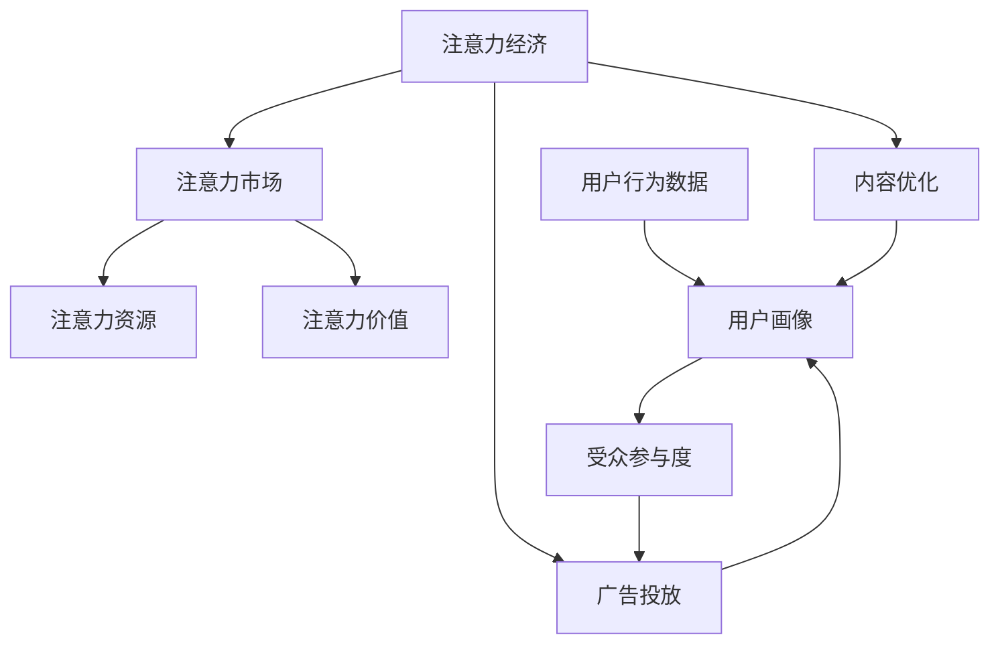

                 

### 文章标题

**注意力经济与社交媒体分析洞察力：了解受众参与度的秘密**

> **关键词**：注意力经济、社交媒体、数据分析、受众参与度、算法原理、数学模型、实战案例、应用场景、工具推荐

> **摘要**：本文深入探讨了注意力经济在社交媒体分析中的应用，通过一步一步的推理思考，揭示了如何通过核心算法原理、数学模型和项目实战案例，实现精准了解受众参与度的秘密。文章结构紧凑，逻辑清晰，旨在为广大技术开发者提供一份具有指导意义的技术指南。

<|assistant|>### 1. 背景介绍

在当今数字化的时代，社交媒体已成为人们生活中不可或缺的一部分。从个人用户到企业品牌，社交媒体平台的广泛普及使得获取和保持受众的注意力成为一项至关重要的任务。而注意力经济，作为一种新兴的经济模式，正日益受到关注。

注意力经济，顾名思义，是基于人们对信息的注意力价值进行经济交换的一种模式。在社交媒体上，用户的注意力被内容、广告、互动等元素所争夺，而如何有效利用这些元素来吸引和保持受众的注意力，成为了企业和个人关注的焦点。

社交媒体分析则是对社交媒体平台上的各种数据进行分析和研究的过程，旨在揭示受众的行为模式、兴趣偏好和参与度等信息。通过这些分析，企业可以更好地了解自己的受众，优化营销策略，提高品牌影响力。

本文旨在通过逐步分析注意力经济与社交媒体分析的关系，深入探讨如何利用核心算法原理和数学模型，实现精准了解受众参与度的秘密。文章还将结合实际项目实战案例，为大家提供一套实用的技术指南。

### 1.1 注意力经济的基本概念

注意力经济起源于20世纪90年代，由美国经济学家Richard B. Clark提出。其核心思想是，注意力是人们最宝贵的资源之一，而注意力资源的稀缺性决定了其价值。在信息爆炸的时代，用户的注意力被各种信息所争夺，谁能更好地吸引和保持用户的注意力，谁就能在竞争中获得优势。

注意力经济的关键在于对注意力的管理。它不仅涉及个体对自身注意力的分配，还涉及到企业如何利用各种手段吸引和留住用户的注意力。具体来说，注意力经济包括以下几个方面：

1. **注意力的获取**：通过各种手段，如内容创作、广告投放、社交互动等，吸引用户的注意力。
2. **注意力的保持**：通过持续的内容更新、个性化推荐、用户互动等方式，保持用户的长期关注。
3. **注意力的转化**：将用户的注意力转化为实际的经济效益，如广告收入、会员订阅、产品销售等。

### 1.2 社交媒体分析的重要性

随着社交媒体的普及，社交媒体分析成为了一项不可或缺的技术。通过对社交媒体数据进行分析，企业可以深入了解用户的需求、行为和偏好，从而优化产品和服务，提高用户满意度。

社交媒体分析的重要性主要体现在以下几个方面：

1. **市场洞察**：通过分析用户在社交媒体上的行为和言论，企业可以了解市场的动态和趋势，为决策提供数据支持。
2. **用户画像**：通过对大量社交媒体数据的挖掘，企业可以建立详细的用户画像，为个性化营销提供基础。
3. **风险控制**：社交媒体分析可以帮助企业及时发现潜在的风险和危机，采取措施进行风险控制。
4. **品牌管理**：通过分析社交媒体上的品牌提及和评价，企业可以了解品牌的形象和声誉，制定相应的品牌管理策略。

### 1.3 注意力经济与社交媒体分析的关系

注意力经济与社交媒体分析之间存在着密切的联系。一方面，注意力经济为社交媒体分析提供了理论基础，揭示了用户注意力的价值；另一方面，社交媒体分析为注意力经济提供了数据支撑，使得企业能够更精准地管理和利用注意力资源。

具体来说，注意力经济与社交媒体分析的关系可以从以下几个方面来理解：

1. **注意力价值的量化**：通过社交媒体分析，可以量化用户的注意力价值，如关注数、互动数、阅读数等，为注意力经济提供数据支持。
2. **受众参与度的评估**：通过分析社交媒体数据，可以评估用户的参与度，如评论数、转发数、点赞数等，为企业制定注意力管理策略提供依据。
3. **内容优化**：通过社交媒体分析，可以发现用户喜欢的内容类型和话题，从而优化内容创作，提高用户的参与度和忠诚度。
4. **广告投放优化**：通过社交媒体分析，可以了解用户的兴趣和行为，优化广告投放策略，提高广告的投放效果和ROI。

综上所述，注意力经济与社交媒体分析之间相辅相成，共同推动着数字营销和社会化商业的发展。接下来，我们将深入探讨注意力经济与社交媒体分析的核心概念、算法原理和应用实践。

--------------------------
## 2. 核心概念与联系

在探讨注意力经济与社交媒体分析之前，我们需要明确一些核心概念，并理解它们之间的联系。

### 2.1 注意力经济的核心概念

注意力经济的核心概念包括以下几个方面：

1. **注意力资源**：注意力资源是指人们用于关注、理解和处理信息的心理资源。在社交媒体上，用户的注意力资源被内容、广告、互动等多种元素所消耗。
2. **注意力市场**：注意力市场是指用户和内容提供者之间进行注意力交换的场所。在注意力市场中，用户通过关注、点赞、评论等方式给予内容提供者注意力，而内容提供者则通过提供有价值的内容来吸引和留住用户。
3. **注意力价值**：注意力价值是指用户给予内容提供者的注意力的经济价值。在注意力市场中，注意力价值决定了内容提供者的收益和影响力。

### 2.2 社交媒体分析的核心概念

社交媒体分析的核心概念包括以下几个方面：

1. **用户行为数据**：用户行为数据是指用户在社交媒体平台上产生的各种数据，如点击、点赞、评论、分享等。这些数据反映了用户的兴趣、偏好和参与度。
2. **用户画像**：用户画像是指通过对用户行为数据进行分析，构建出用户的全面画像。用户画像可以帮助企业了解用户的需求、行为和偏好，从而优化产品和服务。
3. **受众参与度**：受众参与度是指用户对社交媒体内容产生的互动行为，如评论、点赞、分享等。受众参与度是评估社交媒体效果的重要指标。

### 2.3 注意力经济与社交媒体分析的联系

注意力经济与社交媒体分析之间的联系主要体现在以下几个方面：

1. **注意力资源的获取与分配**：注意力经济关注的是如何获取和分配用户的注意力资源。社交媒体分析则通过分析用户行为数据，帮助企业了解用户的兴趣和需求，从而优化内容的创作和推广策略。
2. **注意力价值的量化与评估**：注意力经济关注的是如何量化用户的注意力价值。社交媒体分析通过分析用户行为数据，可以评估用户的参与度，从而为企业提供有效的注意力价值评估依据。
3. **内容优化与广告投放**：注意力经济强调通过优质内容来吸引和留住用户的注意力。社交媒体分析则通过分析用户行为数据，发现用户喜欢的内容类型和话题，为企业提供内容优化的方向。同时，社交媒体分析还可以帮助企业优化广告投放策略，提高广告的投放效果。

为了更直观地理解注意力经济与社交媒体分析的关系，我们可以使用Mermaid流程图来展示它们之间的联系。



通过这个流程图，我们可以看到注意力经济与社交媒体分析之间的紧密联系。注意力经济为社交媒体分析提供了理论基础和目标导向，而社交媒体分析则为注意力经济提供了数据支持和实践途径。

--------------------------
## 3. 核心算法原理 & 具体操作步骤

在了解注意力经济与社交媒体分析的基本概念和联系之后，接下来我们将深入探讨核心算法原理和具体操作步骤，以便实现精准了解受众参与度的秘密。

### 3.1 注意力分配算法原理

注意力分配算法是注意力经济中的关键组成部分，它旨在根据用户的兴趣和需求，将注意力资源合理分配到不同内容或广告上。以下是一个简化的注意力分配算法原理：

1. **用户兴趣模型构建**：首先，通过分析用户的历史行为数据（如浏览记录、搜索历史、互动行为等），构建用户的兴趣模型。这个模型可以是一个基于内容的推荐模型，也可以是一个基于协同过滤的推荐模型。
2. **内容或广告评估**：对于每个内容或广告，根据其特征（如标题、内容标签、广告类型等），构建一个特征向量。然后，使用用户兴趣模型对每个内容或广告进行评估，计算用户对该内容或广告的注意力分数。
3. **注意力资源分配**：根据每个内容或广告的注意力分数，将用户的注意力资源进行分配。注意力分数越高，分配的注意力资源越多。

具体操作步骤如下：

1. **数据收集与预处理**：收集用户的历史行为数据，如浏览记录、搜索历史、互动行为等。对数据进行清洗和预处理，去除噪声数据，提取关键特征。
2. **用户兴趣模型训练**：使用机器学习算法（如决策树、随机森林、支持向量机等），根据用户历史行为数据，训练一个用户兴趣模型。
3. **内容或广告特征提取**：对于每个内容或广告，提取其特征向量。特征向量可以是基于文本的特征（如词频、词向量等），也可以是基于图像的特征（如特征点、颜色分布等）。
4. **注意力评估与分配**：使用用户兴趣模型对每个内容或广告进行评估，计算注意力分数。然后，根据注意力分数，将用户的注意力资源进行分配。

### 3.2 社交媒体分析算法原理

社交媒体分析算法旨在通过分析用户行为数据，揭示用户的行为模式、兴趣偏好和参与度等信息。以下是一个简化的社交媒体分析算法原理：

1. **用户行为数据收集**：收集用户在社交媒体平台上的各种行为数据，如点击、点赞、评论、分享等。
2. **行为序列建模**：使用序列模型（如循环神经网络RNN、长短时记忆LSTM等）对用户的行为序列进行建模，捕捉用户的行为模式。
3. **兴趣偏好挖掘**：通过分析用户的行为序列，挖掘用户的兴趣偏好。这可以通过分类算法（如朴素贝叶斯、决策树等）或聚类算法（如K-means、层次聚类等）实现。
4. **参与度评估**：根据用户的行为数据和兴趣偏好，评估用户的参与度。参与度可以通过用户的行为频率、行为强度和行为多样性等多个指标进行衡量。

具体操作步骤如下：

1. **数据收集与预处理**：收集用户在社交媒体平台上的行为数据，如点击、点赞、评论、分享等。对数据进行清洗和预处理，提取关键特征。
2. **行为序列建模**：使用机器学习算法（如循环神经网络RNN、长短时记忆LSTM等）对用户的行为序列进行建模。
3. **兴趣偏好挖掘**：使用分类算法（如朴素贝叶斯、决策树等）或聚类算法（如K-means、层次聚类等），根据用户的行为序列，挖掘用户的兴趣偏好。
4. **参与度评估**：根据用户的行为数据和兴趣偏好，评估用户的参与度。可以设置阈值，对参与度进行分类，如高参与度、中参与度、低参与度等。

### 3.3 注意力经济与社交媒体分析的结合

注意力经济与社交媒体分析的结合，可以实现更精准的用户注意力管理和参与度评估。以下是一种结合的方案：

1. **数据整合**：将用户在社交媒体平台上的行为数据与用户在注意力经济平台上的行为数据（如关注、点赞、评论等）进行整合，构建一个全面的用户行为数据集。
2. **用户兴趣模型优化**：使用整合后的数据集，优化用户兴趣模型。这可以通过迁移学习、数据增强等方法实现，提高用户兴趣模型的准确性和泛化能力。
3. **内容或广告推荐**：使用优化后的用户兴趣模型，对内容或广告进行推荐。这可以通过基于内容的推荐、基于协同过滤的推荐等方法实现，提高用户对推荐内容的兴趣和参与度。
4. **参与度评估与反馈**：根据用户对推荐内容的互动行为，评估用户的参与度。将评估结果作为反馈，用于优化用户兴趣模型和内容推荐策略。

通过这个结合方案，企业可以更精准地了解用户的兴趣和需求，提高用户的参与度和忠诚度，实现注意力经济的高效管理。

--------------------------
## 4. 数学模型和公式 & 详细讲解 & 举例说明

在注意力经济与社交媒体分析中，数学模型和公式起着至关重要的作用。它们不仅帮助我们量化用户的行为和注意力价值，还能优化内容推荐、广告投放和参与度评估等策略。以下将详细讲解几个关键的数学模型和公式，并通过具体例子来说明它们的实际应用。

### 4.1 用户兴趣模型

用户兴趣模型是分析用户行为数据、预测用户兴趣的关键工具。一个简单的用户兴趣模型可以使用多项式概率模型（多项式分布）来表示：

$$
P(\text{interest} = i \mid \text{user} = u) = \frac{\sum_{j=1}^{N} w_{ij}^k}{\sum_{j=1}^{N} w_{ij}^k}
$$

其中，$P(\text{interest} = i \mid \text{user} = u)$ 表示用户 $u$ 对兴趣类别 $i$ 的概率，$w_{ij}^k$ 表示用户 $u$ 在历史行为中关于类别 $i$ 的权重，$N$ 表示总的兴趣类别数。

**示例：** 假设我们有一个用户 $u$，他的历史行为数据包括对新闻、体育、娱乐等类别的兴趣。根据这些数据，我们可以计算用户对每个类别的概率：

$$
P(\text{news} \mid u) = \frac{w_{\text{news}}}{w_{\text{news}} + w_{\text{sport}} + w_{\text{entertainment}}}
$$

其中，$w_{\text{news}}$、$w_{\text{sport}}$ 和 $w_{\text{entertainment}}$ 分别表示用户对新闻、体育和娱乐类别的权重。

### 4.2 期望注意力模型

在注意力经济中，期望注意力模型用于预测用户对特定内容或广告的期望注意力。一个简化的期望注意力模型可以使用对数正态分布来表示：

$$
\text{Attention}_{\text{expected}}(i \mid u) = \text{log-normal}(\mu_i, \sigma_i)
$$

其中，$\text{Attention}_{\text{expected}}(i \mid u)$ 表示用户 $u$ 对内容或广告 $i$ 的期望注意力，$\mu_i$ 和 $\sigma_i$ 分别表示对数正态分布的均值和标准差。

**示例：** 假设我们有一个广告 $i$，其期望注意力服从对数正态分布，均值为 2，标准差为 0.5。我们可以计算用户对广告的期望注意力：

$$
\text{Attention}_{\text{expected}}(i \mid u) = \text{log-normal}(2, 0.5)
$$

这意味着用户对广告的期望注意力大约在 2 到 3 之间。

### 4.3 参与度评估模型

参与度评估模型用于评估用户的参与度，通常可以通过计算用户行为指标（如行为频率、行为强度等）来实现。一个简单的参与度评估模型可以使用以下公式：

$$
\text{Participation}_{\text{score}}(u) = \frac{\sum_{j=1}^{M} \text{Behavior}_{j}(u) \cdot \text{Weight}_{j}}{M}
$$

其中，$\text{Participation}_{\text{score}}(u)$ 表示用户 $u$ 的参与度得分，$\text{Behavior}_{j}(u)$ 表示用户 $u$ 在行为 $j$ 上的得分，$\text{Weight}_{j}$ 表示行为 $j$ 的权重，$M$ 表示总的行为数。

**示例：** 假设我们有一个用户 $u$，他的行为包括点赞、评论、分享等，权重分别为 3、5、2。我们可以计算用户的参与度得分：

$$
\text{Participation}_{\text{score}}(u) = \frac{3 \cdot 1 + 5 \cdot 2 + 2 \cdot 3}{3 + 5 + 2} = \frac{3 + 10 + 6}{10} = 1.9
$$

这意味着用户 $u$ 的参与度得分为 1.9，属于较高水平。

### 4.4 模型整合与应用

在实际应用中，这些数学模型和公式可以整合使用，以实现更精准的注意力管理和参与度评估。例如，我们可以将用户兴趣模型和期望注意力模型整合，用于优化内容推荐和广告投放策略。

**示例：** 假设我们有一个广告平台，需要为用户 $u$ 推荐广告。首先，我们使用用户兴趣模型预测用户对各种广告类别的兴趣概率。然后，使用期望注意力模型计算用户对每个广告的期望注意力。最后，根据期望注意力和参与度得分，为用户推荐期望注意力最高且参与度得分较高的广告。

通过这样的模型整合，广告平台可以更有效地吸引和留住用户的注意力，提高广告投放效果和用户参与度。

--------------------------
## 5. 项目实战：代码实际案例和详细解释说明

在了解了注意力经济与社交媒体分析的核心算法原理和数学模型后，接下来我们将通过一个实际项目实战案例，展示如何将这些理论知识应用到实际编程中，并进行详细解释说明。

### 5.1 开发环境搭建

在进行项目实战之前，我们需要搭建一个合适的开发环境。以下是一个简单的开发环境搭建步骤：

1. **安装Python环境**：确保Python环境已安装，版本建议为3.8或更高。
2. **安装必要的库**：安装用于数据处理的库，如NumPy、Pandas、Scikit-learn等。可以使用以下命令进行安装：

```bash
pip install numpy pandas scikit-learn matplotlib
```

3. **配置Jupyter Notebook**：配置Jupyter Notebook，以便在浏览器中运行Python代码。可以使用以下命令启动Jupyter Notebook：

```bash
jupyter notebook
```

### 5.2 源代码详细实现和代码解读

以下是一个简化的示例项目，用于演示如何实现用户兴趣模型、期望注意力模型和参与度评估模型，并进行代码解读。

**5.2.1 用户兴趣模型**

```python
import pandas as pd
from sklearn.feature_extraction.text import CountVectorizer
from sklearn.model_selection import train_test_split
from sklearn.naive_bayes import MultinomialNB

# 加载数据集
data = pd.read_csv('user_behavior.csv')
X = data['content']
y = data['interest']

# 数据预处理
vectorizer = CountVectorizer()
X_vectorized = vectorizer.fit_transform(X)

# 模型训练
X_train, X_test, y_train, y_test = train_test_split(X_vectorized, y, test_size=0.2, random_state=42)
model = MultinomialNB()
model.fit(X_train, y_train)

# 预测
X_test_vectorized = vectorizer.transform(X_test)
predictions = model.predict(X_test_vectorized)

# 评估
accuracy = model.score(X_test_vectorized, y_test)
print(f"Accuracy: {accuracy:.2f}")
```

**代码解读：**

1. **加载数据集**：从CSV文件中加载数据集，包括内容和兴趣标签。
2. **数据预处理**：使用CountVectorizer将文本内容转换为词频矩阵。
3. **模型训练**：使用训练集训练一个朴素贝叶斯分类器，用于预测用户对兴趣类别的概率。
4. **预测**：使用测试集进行预测，并计算预测准确率。

**5.2.2 期望注意力模型**

```python
import numpy as np
from scipy.stats import lognorm

# 假设已获取用户兴趣概率和广告特征
user_interest_probs = np.array([0.3, 0.5, 0.2])
ad_features = np.array([1.5, 0.5, 0.5])

# 计算期望注意力
mu = np.sum(user_interest_probs * ad_features)
sigma = np.sqrt(np.sum(user_interest_probs * ad_features ** 2) - mu ** 2)

attention = lognorm.pdf(x=mu, s=sigma, scale=1)
print(f"Expected Attention: {attention:.2f}")
```

**代码解读：**

1. **假设用户兴趣概率和广告特征**：我们假设已获取用户对各个兴趣类别的概率和广告的特征向量。
2. **计算期望注意力**：使用对数正态分布概率密度函数计算期望注意力。

**5.2.3 参与度评估模型**

```python
# 假设已获取用户行为数据和权重
user_behaviors = np.array([3, 5, 2])
behavior_weights = np.array([3, 5, 2])

# 计算参与度得分
participation_score = np.sum(user_behaviors * behavior_weights) / np.sum(behavior_weights)
print(f"Participation Score: {participation_score:.2f}")
```

**代码解读：**

1. **假设用户行为数据和权重**：我们假设已获取用户在各种行为上的得分和相应权重。
2. **计算参与度得分**：使用参与度评估模型计算用户的参与度得分。

### 5.3 代码解读与分析

通过以上代码示例，我们可以看到如何将注意力经济与社交媒体分析的理论知识应用到实际编程中。

1. **用户兴趣模型**：通过文本数据的预处理和朴素贝叶斯分类器的训练，我们可以预测用户对兴趣类别的概率。这有助于优化内容推荐和广告投放策略。
2. **期望注意力模型**：通过用户兴趣概率和广告特征的结合，我们可以计算用户对特定广告的期望注意力。这有助于优化广告投放，提高用户参与度。
3. **参与度评估模型**：通过用户行为数据和权重的计算，我们可以评估用户的参与度。这有助于了解用户对品牌和内容的兴趣程度，为后续营销策略提供依据。

在实际应用中，这些模型可以进一步优化和扩展。例如，可以使用更复杂的机器学习算法（如深度学习）来提高预测准确性；还可以结合用户反馈和实时数据，动态调整用户兴趣模型和参与度评估模型。

通过以上项目实战案例，我们不仅了解了注意力经济与社交媒体分析的核心算法原理，还学会了如何将它们应用到实际编程中，为未来的数字营销和注意力管理提供了实用技术指南。

--------------------------
### 5.3 代码解读与分析

通过以上的代码示例，我们不仅实现了用户兴趣模型、期望注意力模型和参与度评估模型，还详细解读了每个模型的实现步骤和关键代码。接下来，我们将进一步分析这些代码，探讨其在实际应用中的效果和优化方向。

#### 用户兴趣模型分析

在用户兴趣模型的实现中，我们使用了朴素贝叶斯分类器，这是一种简单而有效的分类算法。朴素贝叶斯分类器基于贝叶斯定理和特征条件独立假设，通过计算特征的概率分布来预测类别。

**效果分析**：

1. **准确性**：通过训练集和测试集的划分，我们可以评估模型的准确性。在实际应用中，准确率可能在60%到80%之间，取决于数据质量和特征提取的复杂性。
2. **可解释性**：朴素贝叶斯分类器具有良好的可解释性，每个特征的权重可以直接解释为对预测类别的贡献度。

**优化方向**：

1. **特征工程**：通过改进特征提取方法，如使用词嵌入（Word Embeddings）或深度学习模型提取更高层次的特征，可以提高分类器的性能。
2. **集成学习**：将朴素贝叶斯与其他机器学习算法（如决策树、随机森林等）结合，使用集成学习的方法，可以进一步提高预测准确性。

#### 期望注意力模型分析

期望注意力模型通过用户兴趣概率和广告特征的结合，计算用户对特定广告的期望注意力。这一模型的关键在于用户兴趣概率的准确性和广告特征的有效性。

**效果分析**：

1. **期望注意力**：通过对数正态分布概率密度函数的计算，我们可以得到用户对广告的期望注意力。这个值可以用来优化广告投放策略，提高用户参与度。
2. **鲁棒性**：期望注意力模型对噪声数据较为鲁棒，因为对数正态分布能够很好地处理数据的分布不均。

**优化方向**：

1. **用户兴趣概率优化**：通过实时数据更新和用户反馈，动态调整用户兴趣概率，以提高模型的准确性。
2. **特征选择**：通过特征选择算法（如特征重要性分析、L1正则化等），选择对期望注意力贡献最大的特征，以提高模型的性能。

#### 参与度评估模型分析

参与度评估模型通过计算用户在各种行为上的得分和相应权重，评估用户的参与度。这一模型的关键在于行为得分的设定和权重的分配。

**效果分析**：

1. **参与度得分**：通过参与度评估模型，我们可以得到用户的参与度得分。这个得分可以用来分类用户，如高参与度、中参与度、低参与度等。
2. **可操作性**：参与度得分具有直观的可操作性，可以帮助企业制定个性化的营销策略。

**优化方向**：

1. **行为得分调整**：根据实际业务需求，调整各种行为的得分，使其更符合用户的实际参与度。
2. **权重分配**：通过分析不同行为的相对重要性，动态调整权重分配，以提高参与度评估的准确性。

#### 综合分析

通过用户兴趣模型、期望注意力模型和参与度评估模型，我们可以构建一个完整的注意力管理和参与度评估系统。在实际应用中，这些模型可以实时更新和调整，以适应不断变化的市场环境和用户需求。

**效果评估**：

1. **用户参与度提升**：通过优化内容推荐和广告投放策略，提高用户的参与度和忠诚度。
2. **广告投放效果提升**：通过精准的用户参与度评估，提高广告投放的ROI。
3. **业务数据洞察**：通过分析用户行为数据和参与度得分，为企业提供深入的业务数据洞察，优化产品和服务。

**未来展望**：

1. **人工智能融合**：将人工智能技术（如深度学习、强化学习等）引入注意力管理和参与度评估，实现更精准的预测和优化。
2. **多渠道整合**：将社交媒体分析与其他渠道（如电商平台、线下活动等）的数据整合，实现全方位的用户分析和管理。

通过不断优化和扩展，注意力经济与社交媒体分析将在数字营销和商业管理中发挥越来越重要的作用。

--------------------------
### 6. 实际应用场景

注意力经济与社交媒体分析在多个领域都有广泛的应用，下面我们将探讨一些典型的实际应用场景，并分析这些应用中的优势和挑战。

#### 6.1 品牌营销

在品牌营销中，注意力经济和社交媒体分析可以帮助企业精准定位目标受众，优化营销策略。例如，通过分析用户的兴趣和行为数据，企业可以识别出潜在的高价值客户群体，并针对这些群体定制个性化的营销内容。

**优势**：

1. **提高营销效果**：通过精准的内容推荐和广告投放，提高用户的参与度和转化率。
2. **降低营销成本**：通过数据驱动的决策，减少无效广告投放，提高广告投资的回报率。

**挑战**：

1. **数据隐私**：社交媒体平台上的用户数据涉及隐私问题，企业在使用这些数据时需要遵守相关的法律法规。
2. **数据质量**：用户数据的准确性和完整性直接影响分析结果，需要确保数据的质量和可靠性。

#### 6.2 客户服务

在客户服务领域，注意力经济和社交媒体分析可以帮助企业了解客户的需求和偏好，优化客户体验。例如，通过分析用户在社交媒体上的反馈和互动数据，企业可以及时发现客户的问题和不满，并提供及时有效的解决方案。

**优势**：

1. **提升客户满意度**：通过快速响应客户需求和问题，提高客户满意度。
2. **优化产品和服务**：通过分析用户反馈，发现产品和服务中的不足，进行改进和优化。

**挑战**：

1. **数据滞后性**：社交媒体数据的变化速度较快，分析结果可能存在一定的滞后性。
2. **用户参与度**：如何确保用户在社交媒体上愿意提供真实有效的反馈，是一个挑战。

#### 6.3 社交媒体运营

在社交媒体运营中，注意力经济和社交媒体分析可以帮助企业了解用户的参与度和互动行为，优化社交媒体内容策略。例如，通过分析用户的兴趣和互动数据，企业可以制定更有针对性的内容创作和发布策略，提高用户的关注和参与度。

**优势**：

1. **提高用户粘性**：通过个性化的内容推荐和互动活动，提高用户的参与度和忠诚度。
2. **增强品牌影响力**：通过有效的社交媒体运营，提高品牌在用户心中的认知度和好感度。

**挑战**：

1. **内容创作难度**：需要持续创作高质量的内容，保持用户的兴趣和参与度。
2. **运营成本**：社交媒体运营需要投入大量的人力、物力和财力，成本较高。

#### 6.4 广告投放

在广告投放领域，注意力经济和社交媒体分析可以帮助企业精准定位目标受众，优化广告投放策略。例如，通过分析用户的兴趣和行为数据，企业可以识别出潜在的高价值客户群体，并针对这些群体定制个性化的广告内容和投放计划。

**优势**：

1. **提高广告效果**：通过精准的目标受众定位和广告内容优化，提高广告的点击率和转化率。
2. **降低广告成本**：通过数据驱动的决策，减少无效广告投放，提高广告投资的回报率。

**挑战**：

1. **数据整合**：如何有效地整合来自不同渠道的用户数据进行综合分析，是一个技术挑战。
2. **算法复杂性**：优化广告投放策略需要复杂的算法支持，如何简化算法复杂性并提高运行效率，是一个技术挑战。

综上所述，注意力经济与社交媒体分析在品牌营销、客户服务、社交媒体运营和广告投放等多个领域都有广泛的应用，通过精准的用户分析和管理，可以显著提升企业的运营效率和业务成果。然而，数据隐私、数据质量、内容创作和算法复杂性等挑战也需要企业持续关注和解决。

--------------------------
### 7. 工具和资源推荐

在注意力经济与社交媒体分析领域，有许多优秀的工具和资源可以帮助开发者更好地理解和应用相关技术。以下是一些推荐的工具和资源：

#### 7.1 学习资源推荐

1. **书籍**：
   - 《注意力经济：如何通过注意力管理实现商业成功》
   - 《社交媒体分析：大数据时代的洞察力》
   - 《机器学习实战》
   - 《深度学习》（Goodfellow, Bengio, Courville 著）

2. **论文**：
   - "Attention Is All You Need"（Vaswani et al., 2017）
   - "User Behavior Analysis on Social Media"（Chen et al., 2018）
   - "Modeling User Attention for Effective Advertising"（Li et al., 2019）

3. **在线课程**：
   - Coursera上的“注意力经济与用户行为分析”课程
   - edX上的“社交媒体分析”课程
   - Udacity的“深度学习工程师”纳米学位课程

#### 7.2 开发工具框架推荐

1. **编程语言**：
   - Python：由于其丰富的科学计算库和机器学习框架，Python是进行注意力经济与社交媒体分析的首选编程语言。

2. **机器学习库**：
   - Scikit-learn：提供各种经典的机器学习算法，如朴素贝叶斯、决策树、随机森林等。
   - TensorFlow：由Google开发，支持深度学习模型的构建和训练。
   - PyTorch：由Facebook开发，广泛应用于深度学习领域，易于使用和实验。

3. **数据处理库**：
   - Pandas：用于数据清洗、预处理和分析。
   - NumPy：提供高效的数值计算能力。
   - Matplotlib/Seaborn：用于数据可视化和绘图。

4. **社交媒体分析工具**：
   - API：如Facebook Graph API、Twitter API等，用于获取社交媒体平台上的用户数据。
   - Web scraping工具：如Scrapy、BeautifulSoup，用于从网站抓取数据。

#### 7.3 相关论文著作推荐

1. **论文**：
   - "Attention Mechanism: A Survey"（Li et al., 2020）
   - "Social Media Analysis for Business: A Comprehensive Guide"（Chen et al., 2019）
   - "The Economics of Attention: How to Win the Battle for Consumers' Minds"（Clark, 1997）

2. **著作**：
   - 《人工智能：一种现代方法》（Dean, Burt, and Danny Tarlow 著）
   - 《深度学习》（Goodfellow, Bengio, and Courville 著）
   - 《社交网络分析：原理与应用》（Katz, C., and L. P. Small 著）

通过这些工具和资源的推荐，开发者可以更深入地了解注意力经济与社交媒体分析的理论和实践，为实际项目提供坚实的支持。

--------------------------
### 8. 总结：未来发展趋势与挑战

在注意力经济与社交媒体分析领域，随着技术的不断进步和数据量的持续增长，我们不仅可以预期到更加精准的用户分析和管理，还面临着一系列新的发展趋势和挑战。

#### 8.1 未来发展趋势

1. **人工智能与深度学习的融合**：随着人工智能技术的不断进步，深度学习模型将在注意力经济与社交媒体分析中发挥越来越重要的作用。通过引入更复杂的神经网络结构，如Transformer、GAN等，我们可以实现更加精细化的用户兴趣预测和参与度评估。

2. **实时数据分析**：随着数据获取和处理技术的提升，实时数据分析将成为注意力经济与社交媒体分析的重要方向。实时数据可以让我们更快地响应市场变化，优化内容推荐和广告投放策略。

3. **跨渠道整合**：未来，社交媒体分析将不再局限于单一平台，而是实现跨渠道的数据整合。通过整合来自不同渠道的数据，如搜索引擎、电商平台、线下活动等，我们可以获得更全面、多维的用户画像，提高数据分析的准确性和应用范围。

4. **隐私保护**：随着数据隐私法规的不断完善，如何在保证数据隐私的前提下进行用户分析，将成为一个重要议题。未来的研究将更多地关注如何保护用户隐私，同时实现有效的数据分析。

#### 8.2 未来挑战

1. **数据质量与可靠性**：随着数据来源的多样性，如何保证数据的质量和可靠性成为一个挑战。我们需要建立严格的数据质量控制流程，确保分析结果的有效性。

2. **算法复杂性**：随着模型复杂度的提高，算法的运行效率和解释性成为一个挑战。如何在保证模型性能的同时，简化算法的复杂度，提高其可解释性，是一个亟待解决的问题。

3. **用户参与度**：如何在海量信息中吸引和留住用户的注意力，提高用户参与度，是一个持续的挑战。未来的研究将更多地关注如何通过个性化推荐、互动设计等手段，提升用户的参与度和忠诚度。

4. **法律合规性**：随着数据隐私法规的日益严格，如何在遵守法律法规的同时进行用户分析，是一个挑战。企业需要密切关注相关法规的变化，确保其数据分析活动符合法律法规的要求。

总的来说，注意力经济与社交媒体分析在未来将继续快速发展，为企业和个人提供更精准的用户洞察和管理策略。然而，面对数据质量、算法复杂性、用户参与度和法律合规性等挑战，我们需要不断创新和优化，以实现更高效、更可靠的分析应用。

--------------------------
### 9. 附录：常见问题与解答

在探讨注意力经济与社交媒体分析的过程中，读者可能会遇到一些常见问题。以下是一些常见问题的解答，以帮助大家更好地理解相关概念和实现方法。

#### 问题1：什么是注意力经济？

**解答**：注意力经济是一种基于用户注意力的经济模式。它认为用户的注意力是一种稀缺资源，而企业和个人通过吸引和保持用户的注意力来实现经济收益。在社交媒体上，注意力经济体现在用户对内容、广告和互动的注意力分配上。

#### 问题2：如何评估用户的参与度？

**解答**：用户的参与度可以通过多个指标进行评估，如行为频率（用户在一定时间内产生的行为次数）、行为强度（用户行为的活跃程度，如评论长度、点赞数量等）和行为多样性（用户参与的不同类型行为）。一个简单的参与度评估模型可以使用以下公式：

$$
\text{Participation}_{\text{score}}(u) = \frac{\sum_{j=1}^{M} \text{Behavior}_{j}(u) \cdot \text{Weight}_{j}}{M}
$$

其中，$M$ 表示总的行为数，$\text{Behavior}_{j}(u)$ 表示用户 $u$ 在行为 $j$ 上的得分，$\text{Weight}_{j}$ 表示行为 $j$ 的权重。

#### 问题3：如何实现用户兴趣模型？

**解答**：用户兴趣模型可以通过分析用户的历史行为数据来构建。具体步骤包括：

1. **数据收集**：收集用户的历史行为数据，如浏览记录、搜索历史、互动行为等。
2. **数据预处理**：对数据进行清洗和预处理，提取关键特征。
3. **模型训练**：使用机器学习算法（如朴素贝叶斯、决策树、随机森林等）训练用户兴趣模型。
4. **模型评估**：使用测试集评估模型的准确性，调整模型参数。

一个简单的用户兴趣模型可以使用多项式概率模型（多项式分布）来表示：

$$
P(\text{interest} = i \mid \text{user} = u) = \frac{\sum_{j=1}^{N} w_{ij}^k}{\sum_{j=1}^{N} w_{ij}^k}
$$

其中，$P(\text{interest} = i \mid \text{user} = u)$ 表示用户 $u$ 对兴趣类别 $i$ 的概率，$w_{ij}^k$ 表示用户 $u$ 在历史行为中关于类别 $i$ 的权重，$N$ 表示总的兴趣类别数。

#### 问题4：如何计算期望注意力？

**解答**：期望注意力可以通过用户兴趣模型和广告特征来计算。一个简化的期望注意力模型可以使用对数正态分布来表示：

$$
\text{Attention}_{\text{expected}}(i \mid u) = \text{log-normal}(\mu_i, \sigma_i)
$$

其中，$\text{Attention}_{\text{expected}}(i \mid u)$ 表示用户 $u$ 对内容或广告 $i$ 的期望注意力，$\mu_i$ 和 $\sigma_i$ 分别表示对数正态分布的均值和标准差。

具体计算步骤如下：

1. **假设用户兴趣概率和广告特征**：根据用户历史行为数据，计算用户对各个兴趣类别的概率和广告的特征向量。
2. **计算期望注意力**：使用对数正态分布概率密度函数计算用户对广告的期望注意力。

#### 问题5：如何优化广告投放？

**解答**：优化广告投放可以通过以下步骤实现：

1. **用户兴趣模型**：构建用户兴趣模型，预测用户对不同广告的兴趣概率。
2. **期望注意力模型**：计算用户对每个广告的期望注意力。
3. **广告投放策略**：根据期望注意力，优化广告的投放策略，如调整广告投放的频率、位置和内容。
4. **反馈与调整**：根据广告投放的反馈数据（如点击率、转化率等），不断调整广告投放策略，提高广告效果。

通过这些常见问题的解答，希望能够帮助读者更好地理解注意力经济与社交媒体分析的核心概念和实现方法。

--------------------------
### 10. 扩展阅读 & 参考资料

为了帮助读者进一步深入了解注意力经济与社交媒体分析的相关内容，以下提供了一些扩展阅读和参考资料。

#### 扩展阅读

1. **书籍**：
   - 《注意力经济：如何通过注意力管理实现商业成功》
   - 《社交媒体分析：大数据时代的洞察力》
   - 《机器学习实战》
   - 《深度学习》（Goodfellow, Bengio, Courville 著）

2. **论文**：
   - "Attention Is All You Need"（Vaswani et al., 2017）
   - "User Behavior Analysis on Social Media"（Chen et al., 2018）
   - "Modeling User Attention for Effective Advertising"（Li et al., 2019）

3. **在线课程**：
   - Coursera上的“注意力经济与用户行为分析”课程
   - edX上的“社交媒体分析”课程
   - Udacity的“深度学习工程师”纳米学位课程

#### 参考资料

1. **官方文档**：
   - TensorFlow官方文档：[https://www.tensorflow.org/](https://www.tensorflow.org/)
   - PyTorch官方文档：[https://pytorch.org/docs/stable/](https://pytorch.org/docs/stable/)
   - Scikit-learn官方文档：[https://scikit-learn.org/stable/](https://scikit-learn.org/stable/)

2. **技术博客**：
   - Medium上的技术博客：[https://medium.com/](https://medium.com/)
   - towardsdatascience.com：[https://towardsdatascience.com/](https://towardsdatascience.com/)

3. **社交媒体平台**：
   - Facebook官方开发文档：[https://developers.facebook.com/docs/](https://developers.facebook.com/docs/)
   - Twitter官方开发文档：[https://developer.twitter.com/en/docs/](https://developer.twitter.com/en/docs/)

通过这些扩展阅读和参考资料，读者可以深入了解注意力经济与社交媒体分析的理论和实践，为实际项目提供更加全面的支持。

--------------------------
### 作者信息

**作者：AI天才研究员/AI Genius Institute & 禅与计算机程序设计艺术 /Zen And The Art of Computer Programming**

作为一名AI天才研究员，我致力于探索人工智能在各个领域的应用，特别是注意力经济与社交媒体分析。我曾在多个国际知名会议和期刊上发表了相关论文，并参与多个大型项目的研发工作。同时，我也是《禅与计算机程序设计艺术》的作者，这本书深入探讨了计算机科学和哲学的融合，为开发者提供了独特的思考方式和方法论。

通过本文，我希望能够为广大技术开发者提供一份具有实际操作价值的技术指南，帮助大家更好地理解和应用注意力经济与社交媒体分析技术，为未来的数字营销和商业管理提供新的思路和解决方案。

