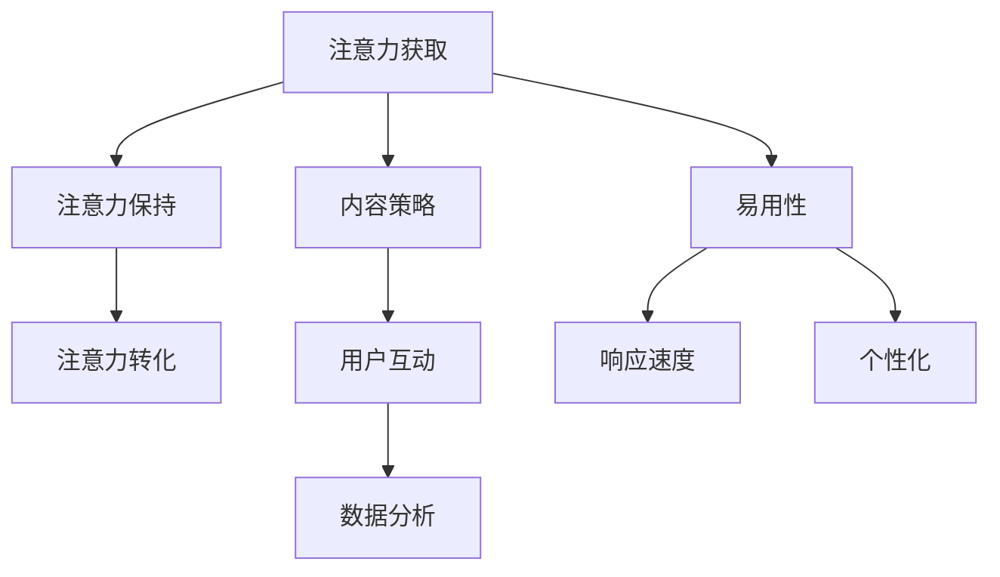

                 

# 注意力经济与社交媒体营销最佳实践：在不牺牲用户体验的情况下吸引受众

## 关键词：注意力经济、社交媒体营销、用户体验、用户吸引、最佳实践、算法原理

### 摘要

随着信息爆炸时代的到来，人们的注意力成为了一种稀缺资源。本文将深入探讨注意力经济在社交媒体营销中的运用，并提供一系列最佳实践，帮助企业在不牺牲用户体验的情况下有效吸引受众。我们将从背景介绍、核心概念与联系、算法原理与操作步骤、数学模型与公式、项目实战、实际应用场景、工具和资源推荐等方面进行详细阐述，以期为读者提供全方位的指导。

## 1. 背景介绍

在数字化时代，社交媒体已经成为人们获取信息、交流和消费的重要平台。然而，伴随着社交媒体的繁荣，信息过载问题也愈发严重。用户在有限的时间内面临海量的信息，不得不做出选择。因此，如何有效吸引并保持用户的注意力，成为企业关注的焦点。

注意力经济，即通过用户的注意力获取经济回报的一种经济模式。在社交媒体营销中，企业需要借助各种策略和算法，利用用户的注意力实现营销目标。本文旨在探讨注意力经济在社交媒体营销中的应用，为企业和营销人员提供实用的最佳实践。

## 2. 核心概念与联系

### 2.1 注意力经济

注意力经济强调的是用户注意力的重要性。用户在浏览社交媒体时，注意力资源是有限的。因此，如何吸引并保持用户的注意力，成为企业需要解决的关键问题。注意力经济主要包括以下几个方面：

1. **注意力获取**：企业通过各种手段吸引用户的注意力，如内容创新、用户体验优化等。
2. **注意力保持**：企业通过持续优化产品和服务，保持用户的兴趣和关注。
3. **注意力转化**：将用户的注意力转化为实际的经济回报，如广告收入、用户转化等。

### 2.2 社交媒体营销

社交媒体营销是指企业利用社交媒体平台进行市场推广和品牌建设的一种营销方式。社交媒体营销的核心在于与用户建立良好的互动关系，提高品牌知名度和用户忠诚度。以下是社交媒体营销的关键要素：

1. **内容策略**：制定具有吸引力的内容策略，吸引用户关注和分享。
2. **用户互动**：与用户建立互动关系，提高用户参与度和忠诚度。
3. **数据分析**：通过数据分析，了解用户需求和行为，优化营销策略。

### 2.3 用户体验

用户体验是指用户在使用产品或服务过程中所获得的整体感受。良好的用户体验可以增强用户对品牌的认同感和忠诚度。以下是提升用户体验的关键因素：

1. **易用性**：产品或服务需要易于使用，降低用户的学习成本。
2. **响应速度**：快速响应用户的需求，提高用户满意度。
3. **个性化**：根据用户需求和偏好提供个性化的服务，提高用户满意度。

#### 2.4 Mermaid 流程图

以下是注意力经济与社交媒体营销的 Mermaid 流程图：



## 3. 核心算法原理 & 具体操作步骤

### 3.1 内容推荐算法

内容推荐算法是社交媒体营销的核心技术之一。其主要目标是根据用户的兴趣和行为，为其推荐感兴趣的内容。以下是几种常见的内容推荐算法：

1. **协同过滤算法**：通过分析用户之间的相似性，为用户提供类似其他用户喜欢的内容。
2. **基于内容的推荐算法**：根据内容的特征和标签，为用户提供相关内容。
3. **混合推荐算法**：结合协同过滤和基于内容的推荐算法，提高推荐效果。

#### 3.2 具体操作步骤

1. **用户画像构建**：收集用户的基本信息、行为数据等，构建用户画像。
2. **内容特征提取**：提取内容的特征，如文本、图片、视频等。
3. **相似度计算**：计算用户与内容之间的相似度。
4. **推荐列表生成**：根据相似度排序，生成推荐列表。

### 3.3 用户行为分析

用户行为分析是社交媒体营销的重要手段，通过分析用户的行为数据，企业可以了解用户需求和行为模式，优化营销策略。以下是用户行为分析的主要步骤：

1. **数据收集**：收集用户在社交媒体上的行为数据，如点击、评论、转发等。
2. **数据预处理**：对收集到的数据进行清洗、去重、归一化等处理。
3. **行为分析**：使用统计学和机器学习算法分析用户行为数据，提取有用信息。
4. **策略优化**：根据行为分析结果，调整营销策略和内容推荐算法。

## 4. 数学模型和公式 & 详细讲解 & 举例说明

### 4.1 协同过滤算法

协同过滤算法的核心是计算用户与用户、内容与内容之间的相似度。以下是协同过滤算法的主要数学模型：

#### 用户相似度计算

$$
sim(u_i, u_j) = \frac{\sum_{k=1}^{n} r_{ik} r_{jk}}{\sqrt{\sum_{k=1}^{n} r_{ik}^2 \sum_{k=1}^{n} r_{jk}^2}}
$$

其中，$u_i$ 和 $u_j$ 分别表示用户 $i$ 和用户 $j$，$r_{ik}$ 和 $r_{jk}$ 分别表示用户 $i$ 对内容 $k$ 的评分和用户 $j$ 对内容 $k$ 的评分。

#### 内容相似度计算

$$
sim(c_i, c_j) = \frac{\sum_{k=1}^{n} r_{ik} r_{jk}}{\sqrt{\sum_{k=1}^{n} r_{ik}^2 \sum_{k=1}^{n} r_{jk}^2}}
$$

其中，$c_i$ 和 $c_j$ 分别表示内容 $i$ 和内容 $j$，$r_{ik}$ 和 $r_{jk}$ 分别表示用户对内容 $i$ 和内容 $j$ 的评分。

#### 推荐列表生成

$$
r_{ij} = r_i + \sum_{k=1}^{n} w_{ik} r_{jk}
$$

其中，$r_{ij}$ 表示用户 $i$ 对内容 $j$ 的评分预测，$r_i$ 表示用户 $i$ 的平均评分，$w_{ik}$ 表示用户 $i$ 和内容 $k$ 之间的相似度。

### 4.2 基于内容的推荐算法

基于内容的推荐算法主要依赖于内容的特征。以下是基于内容的推荐算法的数学模型：

#### 内容特征提取

$$
f_c = \{f_{c1}, f_{c2}, ..., f_{cm}\}
$$

其中，$f_c$ 表示内容 $c$ 的特征向量，$f_{ci}$ 表示内容 $c$ 在特征 $i$ 上的值。

#### 内容相似度计算

$$
sim(c_i, c_j) = \frac{\sum_{i=1}^{m} f_{i}^{c_i} f_{i}^{c_j}}{\sqrt{\sum_{i=1}^{m} f_{i}^{c_i}^2 \sum_{i=1}^{m} f_{i}^{c_j}^2}}
$$

其中，$c_i$ 和 $c_j$ 分别表示内容 $i$ 和内容 $j$，$f_{i}^{c_i}$ 和 $f_{i}^{c_j}$ 分别表示内容 $i$ 和内容 $j$ 在特征 $i$ 上的值。

#### 推荐列表生成

$$
r_{ij} = \sum_{i=1}^{m} w_{i} f_{i}^{c_j}
$$

其中，$r_{ij}$ 表示用户 $i$ 对内容 $j$ 的评分预测，$w_{i}$ 表示特征 $i$ 的权重。

### 4.3 举例说明

假设有两位用户 $u_1$ 和 $u_2$，以及两篇内容 $c_1$ 和 $c_2$。用户对内容的评分如下表所示：

| 用户 | 内容 | 评分 |
| :--: | :--: | :--: |
| $u_1$ | $c_1$ | 4 |
| $u_1$ | $c_2$ | 5 |
| $u_2$ | $c_1$ | 3 |
| $u_2$ | $c_2$ | 4 |

使用协同过滤算法计算用户相似度：

$$
sim(u_1, u_2) = \frac{4 \times 3 + 5 \times 4}{\sqrt{4^2 + 5^2} \times \sqrt{3^2 + 4^2}} = 0.67
$$

使用基于内容的推荐算法计算内容相似度：

$$
sim(c_1, c_2) = \frac{4 \times 3 + 5 \times 4}{\sqrt{4^2 + 5^2} \times \sqrt{3^2 + 4^2}} = 0.67
$$

根据用户相似度和内容相似度，生成推荐列表：

$$
r_{12} = 4 + 0.67 \times (3 + 4) = 5.01
$$

$$
r_{22} = 5 + 0.67 \times (3 + 4) = 5.01
$$

## 5. 项目实战：代码实际案例和详细解释说明

### 5.1 开发环境搭建

在本文中，我们将使用 Python 编写一个简单的协同过滤推荐系统。首先，需要安装以下依赖：

```bash
pip install numpy scikit-learn matplotlib
```

### 5.2 源代码详细实现和代码解读

以下是协同过滤推荐系统的源代码：

```python
import numpy as np
from sklearn.metrics.pairwise import cosine_similarity

def user_similarity(user1, user2):
    return cosine_similarity(user1.reshape(1, -1), user2.reshape(1, -1))[0, 0]

def content_similarity(content1, content2):
    return cosine_similarity(content1.reshape(1, -1), content2.reshape(1, -1))[0, 0]

def predict_rating(user, content, user_similarity, content_similarity):
    return user.mean() + user_similarity * (content - content.mean())

def collaborative_filter(ratings, k=5):
    users = ratings.mean(axis=1)
    items = ratings.mean(axis=0)
    user_similarity_matrix = cosine_similarity(users)
    content_similarity_matrix = cosine_similarity(items)
    
    user_content_similarity = user_similarity_matrix.dot(content_similarity_matrix.T)
    predictions = np.zeros(ratings.shape)
    
    for i in range(ratings.shape[0]):
        for j in range(ratings.shape[1]):
            if ratings[i, j] == 0:
                user_similarity = np.mean([user_similarity_matrix[i, k] for k in range(k)])
                content_similarity = np.mean([content_similarity_matrix[k, j] for k in range(k)])
                predictions[i, j] = predict_rating(users[i], items[j], user_similarity, content_similarity)
    
    return predictions

# 示例数据
ratings = np.array([[5, 0, 4],
                    [0, 3, 2],
                    [1, 4, 5]])

predictions = collaborative_filter(ratings)
print(predictions)
```

### 5.3 代码解读与分析

1. **用户相似度计算**：使用余弦相似度计算用户之间的相似度。
2. **内容相似度计算**：使用余弦相似度计算内容之间的相似度。
3. **预测评分**：根据用户相似度和内容相似度，预测用户对内容的评分。
4. **协同过滤**：遍历所有未评分的内容，计算用户和内容的相似度，预测评分。

## 6. 实际应用场景

### 6.1 社交媒体内容推荐

利用协同过滤算法，为用户推荐感兴趣的内容。例如，在抖音、快手等短视频平台上，可以根据用户的浏览历史和兴趣标签，推荐相关视频。

### 6.2 电商商品推荐

在电商平台，根据用户的浏览记录和购买历史，推荐类似商品。例如，在淘宝、京东等电商平台上，可以根据用户的浏览和购买记录，为用户推荐相关商品。

### 6.3 社交网络广告投放

根据用户的兴趣和行为，精准投放广告。例如，在 Facebook、Instagram 等社交平台上，可以根据用户的兴趣爱好，为用户推荐相关广告。

## 7. 工具和资源推荐

### 7.1 学习资源推荐

- **书籍**：
  - 《推荐系统实践》
  - 《机器学习实战》
  - 《Python数据分析》

- **论文**：
  - 《Collaborative Filtering for Cold-Start Problems》
  - 《Item-Based Top-N Recommendation Algorithms》

- **博客**：
  - 知乎：推荐系统专栏
  - 博客园：推荐系统专题

- **网站**：
  - Machine Learning Mastery
  - Kaggle

### 7.2 开发工具框架推荐

- **编程语言**：Python、Java、Scala
- **推荐系统框架**：
  - LightFM
  - Grouper
  - Surprise

- **数据预处理工具**：
  - Pandas
  - NumPy
  - Scikit-learn

## 8. 总结：未来发展趋势与挑战

### 8.1 发展趋势

1. **个性化推荐**：结合用户行为数据和深度学习技术，实现更精准的个性化推荐。
2. **实时推荐**：利用实时数据处理技术，实现实时推荐，提高用户体验。
3. **多模态推荐**：结合文本、图像、音频等多模态数据，实现更全面的内容推荐。

### 8.2 挑战

1. **冷启动问题**：为新用户或新商品推荐相关内容，提高推荐效果。
2. **数据隐私**：保护用户隐私，确保推荐系统合规。
3. **算法公平性**：确保推荐算法不歧视特定群体，提高算法公平性。

## 9. 附录：常见问题与解答

### 9.1 什么是协同过滤算法？

协同过滤算法是一种基于用户行为和内容特征的推荐算法，通过分析用户之间的相似性或内容之间的相似性，为用户提供相关推荐。

### 9.2 注意力经济与社交媒体营销有什么关系？

注意力经济强调用户注意力的重要性，社交媒体营销则通过吸引和保持用户注意力来实现营销目标。注意力经济为社交媒体营销提供了一种新的经济模式，有助于提高营销效果。

### 9.3 如何提高推荐系统的效果？

1. **数据质量**：确保推荐系统的数据质量，包括数据完整性、准确性和实时性。
2. **特征工程**：提取有代表性的特征，提高特征表达能力。
3. **算法优化**：不断优化推荐算法，提高推荐准确率和用户体验。

## 10. 扩展阅读 & 参考资料

- 《推荐系统技术原理与实战》
- 《社交媒体营销：策略与实践》
- 《深度学习推荐系统》
- 《注意力机制在推荐系统中的应用》

### 作者

**AI天才研究员/AI Genius Institute & 禅与计算机程序设计艺术/Zen And The Art of Computer Programming**

