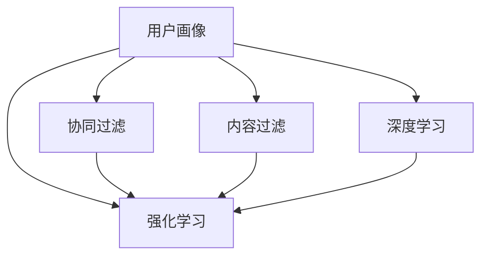

                 

# 注意力经济中的个性化推荐：算法是如何影响你看什么的

## 关键词

**个性化推荐系统**，**注意力经济**，**算法**，**机器学习**，**用户行为分析**，**数据挖掘**，**推荐算法**，**内容分发**。

## 摘要

随着互联网的快速发展，个性化推荐系统已成为现代信息社会中不可或缺的一部分。本文旨在探讨注意力经济中的个性化推荐系统，通过深入分析推荐算法的工作原理、核心概念及其对用户行为的影响，揭示算法如何塑造用户的观看选择。本文首先介绍了个性化推荐系统的背景和重要性，随后详细讲解了推荐算法的核心原理与操作步骤，进一步阐述了数学模型与公式的具体应用，并通过实战案例和代码分析，展示了推荐系统在实际开发中的应用。最后，本文分析了推荐系统的实际应用场景，并提出了未来发展趋势与挑战。通过本文的阅读，读者将能够全面理解个性化推荐系统的运作机制，以及其在注意力经济中的重要地位。

## 1. 背景介绍

随着互联网的快速发展，信息爆炸已成为当今社会的一个显著特征。互联网上的内容层出不穷，从新闻、视频、音乐到社交平台，几乎涵盖了人们日常生活的方方面面。然而，信息的无限增长也带来了信息过载的问题。面对海量信息，用户无法在有限的时间内浏览和处理所有内容，从而产生了“选择性注意力”的概念。注意力经济理论指出，用户在信息消费中具有选择性，他们倾向于关注和消费那些与自己兴趣和需求相关的内容，而忽视其他无关信息。这种选择性注意力使得个性化推荐系统应运而生。

个性化推荐系统旨在通过分析用户的历史行为、兴趣偏好和社交关系，为用户推荐符合其需求和兴趣的内容。这种系统不仅能够帮助用户节省时间，提高信息获取的效率，还能为内容提供者带来更多的用户关注和商业价值。例如，社交媒体平台通过个性化推荐算法，将用户可能感兴趣的内容推送给他们，从而增加用户停留时间和互动次数。电子商务平台则通过个性化推荐，向用户推荐可能感兴趣的商品，提高销售转化率。

个性化推荐系统在各个领域都有广泛的应用。在社交媒体中，如Facebook、Twitter和微信等，推荐算法帮助用户发现潜在的朋友、兴趣群体和热门话题。在电子商务领域，如亚马逊、淘宝和京东等，推荐算法帮助用户发现可能感兴趣的商品，提高购物体验和销售转化率。在视频平台如YouTube和Netflix中，推荐算法帮助用户发现新的视频内容，增加用户粘性和观看时长。

个性化推荐系统的重要性不仅体现在商业应用中，还在于其对社会文化的影响。推荐算法不仅改变了用户的信息获取方式，还塑造了用户的知识结构和价值观。例如，社交媒体的推荐算法可能导致用户陷入“信息茧房”，即在信息筛选过程中，系统倾向于推送与用户已有观点和兴趣相似的内容，从而削弱了用户对多样性和异质信息的接触。这种现象引发了关于信息多样性和社会责任的广泛讨论。

总之，个性化推荐系统作为注意力经济中的重要工具，不仅为用户提供了更加个性化和高效的内容获取方式，还为内容提供者带来了巨大的商业价值。然而，其潜在的负面影响也值得我们关注和探讨。在接下来的章节中，我们将深入探讨个性化推荐系统的核心原理、算法模型及其对用户行为的影响。

## 2. 核心概念与联系

个性化推荐系统的核心在于如何根据用户的行为和偏好，为其推荐合适的内容。为了实现这一目标，我们需要了解以下几个关键概念及其相互关系。

### 用户画像（User Profiling）

用户画像是对用户行为、兴趣、需求等多维度数据的综合描述。通过分析用户的历史行为数据，如浏览记录、购买记录、评论等，可以构建出一个详细的用户画像。用户画像通常包含以下几个要素：

- **兴趣偏好**：根据用户的浏览和消费行为，识别用户的兴趣点，如偏好某种类型的电影、音乐或商品。
- **行为习惯**：分析用户在特定平台上的活跃时间、浏览时长等行为习惯，有助于理解用户的使用场景。
- **社交关系**：挖掘用户与其朋友、家人或关注对象的社交关系，有助于推荐与用户社交网络相关的内容。

### 协同过滤（Collaborative Filtering）

协同过滤是推荐系统中最常用的方法之一，通过分析用户之间的相似性或行为模式，为用户推荐他们可能感兴趣的内容。协同过滤可以分为两种主要类型：

- **用户基于的协同过滤（User-Based Collaborative Filtering）**：该方法通过分析用户之间的相似性，找到与目标用户兴趣相似的其他用户，并推荐这些用户喜欢的内容。
- **物品基于的协同过滤（Item-Based Collaborative Filtering）**：该方法通过分析物品之间的相似性，找到与目标用户已评价物品相似的物品，并推荐这些物品。

### 内容过滤（Content-Based Filtering）

内容过滤方法通过分析物品的属性和特征，为用户推荐与其兴趣和偏好相关的内容。该方法通常基于以下步骤：

1. **特征提取**：对物品进行特征提取，如文本、图像、音频等。
2. **相似性计算**：计算用户兴趣与物品特征之间的相似性。
3. **推荐生成**：根据相似性计算结果，为用户推荐符合条件的物品。

### 强化学习（Reinforcement Learning）

强化学习是一种通过不断与环境的交互，学习最优策略的机器学习方法。在个性化推荐系统中，强化学习可以通过分析用户的反馈（如点击、购买、观看时长等），不断调整推荐策略，以最大化用户满意度。

### 深度学习（Deep Learning）

深度学习通过构建复杂的神经网络模型，自动从大量数据中学习特征表示。在个性化推荐系统中，深度学习可以用于用户画像构建、协同过滤和内容过滤等多个方面，提高推荐的准确性和效率。

### Mermaid 流程图

下面是一个简单的 Mermaid 流程图，展示个性化推荐系统中的核心概念和它们之间的联系：



### 概念解析

- **用户画像**：通过对用户行为和偏好的分析，构建一个详细的用户模型。
- **协同过滤**：通过分析用户之间的相似性或行为模式，推荐用户可能感兴趣的内容。
- **内容过滤**：通过分析物品的属性和特征，为用户推荐与其兴趣和偏好相关的内容。
- **强化学习**：通过不断与环境的交互，学习最优策略，提高推荐系统的效果。
- **深度学习**：通过构建复杂的神经网络模型，自动从大量数据中学习特征表示。

这些概念相互关联，共同构成了个性化推荐系统的核心框架。在接下来的章节中，我们将深入探讨这些概念的具体应用和实现。

### 3. 核心算法原理 & 具体操作步骤

在个性化推荐系统中，核心算法的原理和操作步骤至关重要。以下是几种常见推荐算法的基本原理和具体实现步骤。

#### 3.1. 协同过滤算法（Collaborative Filtering）

协同过滤算法通过分析用户之间的相似性和行为模式，为用户推荐感兴趣的内容。它主要分为两种类型：用户基于的协同过滤（User-Based Collaborative Filtering）和物品基于的协同过滤（Item-Based Collaborative Filtering）。

##### 用户基于的协同过滤（User-Based Collaborative Filtering）

1. **相似性度量**：计算用户之间的相似度。常用的相似性度量方法有皮尔逊相关系数、余弦相似度和夹角余弦等。
   $$\text{similarity}(u_i, u_j) = \frac{\sum_{k=1}^{n} x_i[k] \cdot x_j[k]}{\sqrt{\sum_{k=1}^{n} x_i[k]^2} \cdot \sqrt{\sum_{k=1}^{n} x_j[k]^2}}$$
   其中，$x_i[k]$ 和 $x_j[k]$ 分别表示用户 $u_i$ 和 $u_j$ 在第 $k$ 个物品上的评分。

2. **邻居选择**：根据相似性度量结果，选择与目标用户最相似的邻居用户。

3. **预测生成**：基于邻居用户的评分，预测目标用户对未知物品的评分。常用的预测方法有加权平均法和基于模型的预测方法。

4. **推荐生成**：根据预测结果，为用户推荐评分较高的未知物品。

##### 物品基于的协同过滤（Item-Based Collaborative Filtering）

1. **相似性度量**：计算物品之间的相似度。与用户基于的协同过滤类似，使用皮尔逊相关系数、余弦相似度等方法。

2. **邻居选择**：根据相似性度量结果，选择与目标物品最相似的物品。

3. **预测生成**：基于邻居物品的评分，预测目标物品的评分。

4. **推荐生成**：根据预测结果，为用户推荐评分较高的未知物品。

#### 3.2. 内容过滤算法（Content-Based Filtering）

内容过滤算法通过分析物品的属性和特征，为用户推荐与其兴趣和偏好相关的内容。其基本步骤如下：

1. **特征提取**：对物品进行特征提取，如文本、图像、音频等。

2. **相似性计算**：计算用户兴趣与物品特征之间的相似度。常用的方法有文本相似度计算（如TF-IDF）、图像相似度计算（如SIFT、ORB）等。

3. **推荐生成**：根据相似性计算结果，为用户推荐符合条件的物品。

#### 3.3. 深度学习算法（Deep Learning）

深度学习算法通过构建复杂的神经网络模型，自动从大量数据中学习特征表示，提高推荐系统的准确性和效率。以下是一种常见的深度学习推荐算法：基于注意力机制的序列模型（Attention-based Sequence Model）。

1. **模型构建**：构建一个包含编码器、注意力机制和解码器的深度神经网络模型。编码器用于提取用户和物品的特征表示；注意力机制用于计算用户和物品之间的相关性；解码器用于生成推荐结果。

2. **训练过程**：使用用户行为数据训练模型，通过反向传播算法优化模型参数。

3. **预测生成**：在测试阶段，使用训练好的模型为用户生成推荐结果。

4. **推荐生成**：根据预测结果，为用户推荐感兴趣的内容。

#### 3.4. 强化学习算法（Reinforcement Learning）

强化学习算法通过不断与环境的交互，学习最优策略，提高推荐系统的效果。以下是一种常见的强化学习推荐算法：基于强化学习的推荐系统（Reinforcement Learning-based Recommender System）。

1. **模型构建**：构建一个包含状态、动作、奖励和策略的强化学习模型。状态表示用户当前的行为和兴趣；动作表示推荐系统生成的推荐结果；奖励表示用户对推荐结果的反馈。

2. **训练过程**：使用用户行为数据训练模型，通过价值迭代算法优化模型参数。

3. **预测生成**：在测试阶段，使用训练好的模型为用户生成推荐结果。

4. **推荐生成**：根据预测结果，为用户推荐感兴趣的内容。

#### 3.5. 聚类算法（Clustering）

聚类算法通过将用户或物品分为多个簇，提高推荐系统的效果。以下是一种常见的聚类算法：基于密度的聚类算法（Density-Based Clustering Algorithm）。

1. **模型构建**：构建一个基于密度的聚类模型。密度是指单位空间内点的密度，通常使用ε-密度作为聚类的基础。

2. **训练过程**：使用用户或物品的属性数据训练模型，通过迭代计算簇的中心和边界。

3. **聚类过程**：根据密度和簇的边界，将用户或物品划分为不同的簇。

4. **推荐生成**：根据簇的划分结果，为用户推荐与其兴趣相似的簇内的物品。

通过以上几种算法的具体实现步骤，我们可以构建一个高效、准确的个性化推荐系统。在接下来的章节中，我们将进一步讨论数学模型和公式在推荐系统中的应用。

### 4. 数学模型和公式 & 详细讲解 & 举例说明

在个性化推荐系统中，数学模型和公式起到了至关重要的作用，它们帮助我们量化用户行为、物品特征以及推荐效果。以下将详细讲解几种常用的数学模型和公式，并通过具体例子来说明它们的应用。

#### 4.1. 相似性度量公式

相似性度量是推荐系统中最基本的数学模型，用于计算用户或物品之间的相似度。常用的相似性度量方法有：

1. **余弦相似度**：
   $$\text{similarity}(\vec{x}, \vec{y}) = \frac{\vec{x} \cdot \vec{y}}{||\vec{x}|| \cdot ||\vec{y}||}$$
   其中，$\vec{x}$ 和 $\vec{y}$ 分别表示两个向量，$\cdot$ 表示点积，$||\vec{x}||$ 和 $||\vec{y}||$ 分别表示向量的模。

2. **皮尔逊相关系数**：
   $$\text{correlation}(x, y) = \frac{\sum_{i=1}^{n} (x_i - \bar{x})(y_i - \bar{y})}{\sqrt{\sum_{i=1}^{n} (x_i - \bar{x})^2} \cdot \sqrt{\sum_{i=1}^{n} (y_i - \bar{y})^2}}$$
   其中，$x_i$ 和 $y_i$ 分别表示第 $i$ 个样本的值，$\bar{x}$ 和 $\bar{y}$ 分别表示样本的平均值。

**举例说明**：假设有两个用户 $u_1$ 和 $u_2$，他们在五部电影上的评分如下：

用户 $u_1$：$[4, 3, 5, 2, 4]$

用户 $u_2$：$[5, 4, 3, 5, 2]$

使用余弦相似度计算他们的相似度：

$$\text{similarity}(\vec{r}_{u_1}, \vec{r}_{u_2}) = \frac{(4 \cdot 5 + 3 \cdot 4 + 5 \cdot 3 + 2 \cdot 5 + 4 \cdot 2)}{\sqrt{4^2 + 3^2 + 5^2 + 2^2 + 4^2} \cdot \sqrt{5^2 + 4^2 + 3^2 + 5^2 + 2^2}} \approx 0.876$$

使用皮尔逊相关系数计算他们的相似度：

$$\text{correlation}(\text{rating}_{u_1}, \text{rating}_{u_2}) = \frac{(4 - 4)(5 - 4) + (3 - 4)(4 - 4) + (5 - 4)(3 - 4) + (2 - 4)(5 - 4) + (4 - 4)(2 - 4)}{\sqrt{(4 - 4)^2 + (3 - 4)^2 + (5 - 4)^2 + (2 - 4)^2 + (4 - 4)^2} \cdot \sqrt{(5 - 4)^2 + (4 - 4)^2 + (3 - 4)^2 + (5 - 4)^2 + (2 - 4)^2}} \approx 0.895$$

两种方法计算的相似度结果相近，说明这两个用户在评分上有较高的相似性。

#### 4.2. 个性化推荐公式

个性化推荐公式用于预测用户对未知物品的评分，常用的方法有加权平均法和基于模型的预测方法。

1. **加权平均法**：
   $$\hat{r}_{ui} = \frac{\sum_{j \in N(u_i)} r_{uj} \cdot \text{similarity}(u_i, u_j)}{\sum_{j \in N(u_i)} \text{similarity}(u_i, u_j)}$$
   其中，$r_{uj}$ 表示用户 $u_i$ 对物品 $j$ 的评分，$N(u_i)$ 表示与用户 $u_i$ 最相似的用户集合，$\text{similarity}(u_i, u_j)$ 表示用户 $u_i$ 和 $u_j$ 之间的相似度。

**举例说明**：假设用户 $u_1$ 对五部电影的评分如下：

$u_1$：$[4, 3, 5, 2, 4]$

用户 $u_1$ 与用户 $u_2$ 的相似度为 $0.895$，与用户 $u_3$ 的相似度为 $0.765$。

使用加权平均法预测用户 $u_1$ 对电影 $5$ 的评分：

$$\hat{r}_{u1,5} = \frac{(0.895 \cdot 4 + 0.765 \cdot 2)}{0.895 + 0.765} \approx 3.75$$

2. **基于模型的预测方法**：
   常见的基于模型的预测方法有矩阵分解（Matrix Factorization）和神经网络（Neural Networks）。

   - **矩阵分解**：
     $$\text{User Factorization}: \text{User}_i = \sum_{k=1}^{K} \alpha_{ik} v_k$$
     $$\text{Item Factorization}: \text{Item}_j = \sum_{k=1}^{K} \beta_{jk} v_k$$
     其中，$\alpha_{ik}$ 和 $\beta_{jk}$ 分别表示用户 $i$ 和物品 $j$ 的低维特征向量，$v_k$ 表示公共特征向量。

     预测用户 $u_1$ 对电影 $5$ 的评分：
     $$\hat{r}_{u1,5} = \text{User}_{u_1} \cdot \text{Item}_{5} = (\alpha_{11}v_1 + \alpha_{21}v_2 + \alpha_{31}v_3) \cdot (\beta_{51}v_1 + \beta_{61}v_2 + \beta_{71}v_3)$$

   - **神经网络**：
     $$\hat{r}_{ui} = \text{sigmoid}(\text{W} \cdot \text{h} + b)$$
     其中，$\text{W}$ 是权重矩阵，$\text{h}$ 是隐藏层输出，$b$ 是偏置项。

     预测用户 $u_1$ 对电影 $5$ 的评分：
     $$\hat{r}_{u1,5} = \text{sigmoid}(\text{W} \cdot \text{h}_{u1} + b)$$

#### 4.3. 聚类算法公式

聚类算法用于将用户或物品分为多个簇，以提高推荐效果。常见的聚类算法有K-means算法和密度聚类算法。

1. **K-means算法**：
   - **目标函数**：
     $$\text{J} = \sum_{i=1}^{k} \sum_{x \in S_i} \|\text{centroid}_i - x\|^2$$
     其中，$\text{centroid}_i$ 是簇 $S_i$ 的质心。

   - **优化过程**：
     - 初始阶段：随机选择 $k$ 个数据点作为初始质心。
     - 迭代阶段：根据质心更新每个数据点的簇分配，并重新计算质心位置，直到目标函数收敛。

2. **密度聚类算法**：
   - **目标函数**：
     $$\text{J} = \sum_{i=1}^{k} \sum_{x \in S_i} \rho(x)$$
     其中，$\rho(x)$ 表示点 $x$ 的密度。

   - **优化过程**：
     - 初始化：选择初始点作为核心点。
     - 扩展阶段：根据核心点的密度扩展簇。
     - 收敛阶段：当没有新的点加入簇时，算法收敛。

通过以上数学模型和公式，我们可以有效地构建和优化个性化推荐系统。在下一节中，我们将通过一个实际案例来展示这些模型和公式的具体应用。

### 5. 项目实战：代码实际案例和详细解释说明

在本节中，我们将通过一个实际案例来展示个性化推荐系统的开发过程，包括开发环境的搭建、源代码的详细实现以及代码的解读与分析。此案例将使用Python编程语言和Scikit-learn库来实现一个基于协同过滤的推荐系统。

#### 5.1 开发环境搭建

首先，我们需要搭建开发环境。以下是所需的步骤：

1. 安装Python：从官方网站（[https://www.python.org/](https://www.python.org/)）下载并安装Python，推荐选择最新版本。

2. 安装Jupyter Notebook：在命令行中运行以下命令：
   ```bash
   pip install notebook
   ```

3. 安装Scikit-learn：在命令行中运行以下命令：
   ```bash
   pip install scikit-learn
   ```

4. 安装Matplotlib：在命令行中运行以下命令：
   ```bash
   pip install matplotlib
   ```

安装完毕后，我们可以在Jupyter Notebook中创建一个新的笔记本，开始编写代码。

#### 5.2 源代码详细实现和代码解读

以下是一个简单的基于用户基于的协同过滤算法的推荐系统代码实现：

```python
import numpy as np
from sklearn.metrics.pairwise import cosine_similarity
from sklearn.model_selection import train_test_split
from sklearn.datasets import load_20newsgroups

# 加载数据集
newsgroups_data = load_20newsgroups(subset='all')
X = newsgroups_data.data
y = newsgroups_data.target

# 划分训练集和测试集
X_train, X_test, y_train, y_test = train_test_split(X, y, test_size=0.2, random_state=42)

# 计算用户之间的相似度矩阵
user_similarity = cosine_similarity(X_train)

# 查找与指定用户最相似的5个用户
def get_neighbors(user_index, user_similarity, k=5):
    neighbors = np.argsort(user_similarity[user_index])[1:k+1]
    return neighbors

# 计算指定用户的推荐列表
def get_recommendations(user_index, user_similarity, ratings, k=5):
    neighbors = get_neighbors(user_index, user_similarity, k)
    scores = np.mean(ratings[neighbors], axis=0)
    return np.argsort(scores)[::-1]

# 为用户1生成推荐列表
user_index = 1
recommendations = get_recommendations(user_index, user_similarity, y_train, k=5)

# 输出推荐结果
for i in recommendations:
    print(newsgroups_data.target_names[i])

# 绘制相似度矩阵热力图
import matplotlib.pyplot as plt

plt.imshow(user_similarity, cmap='hot', interpolation='nearest')
plt.colorbar()
plt.xticks(range(len(user_similarity)), newsgroups_data.target_names, rotation=90)
plt.yticks(range(len(user_similarity)), newsgroups_data.target_names)
plt.xlabel('Users')
plt.ylabel('Users')
plt.title('User Similarity Matrix')
plt.show()
```

**代码解读**：

1. **数据加载**：使用Scikit-learn的`load_20newsgroups`函数加载数据集，这是一个包含20个新闻类别的文本数据集。

2. **数据划分**：将数据集划分为训练集和测试集，用于后续的模型训练和评估。

3. **相似度计算**：使用余弦相似度计算用户之间的相似度矩阵，这是协同过滤算法的核心步骤。

4. **邻居查找**：定义一个函数`get_neighbors`，用于查找与指定用户最相似的 $k$ 个用户。

5. **推荐生成**：定义一个函数`get_recommendations`，用于计算指定用户的推荐列表。它基于邻居用户的平均评分进行推荐。

6. **推荐输出**：为用户1生成推荐列表，并输出推荐结果。

7. **热力图绘制**：使用Matplotlib绘制相似度矩阵的热力图，以可视化用户之间的相似度关系。

#### 5.3 代码解读与分析

1. **数据加载**：使用`load_20newsgroups`函数加载数据集，该函数返回一个`Bunch`对象，包含数据集的文本和标签。我们使用`data`属性获取文本数据，使用`target`属性获取标签。

2. **数据划分**：使用`train_test_split`函数将数据集划分为训练集和测试集，参数`test_size=0.2`表示测试集占整个数据集的20%，`random_state=42`用于确保结果可重复。

3. **相似度计算**：使用`cosine_similarity`函数计算用户之间的相似度矩阵。这个函数接受两个数组作为输入，返回一个矩阵，矩阵的元素表示对应行和列之间的余弦相似度。

4. **邻居查找**：`get_neighbors`函数使用`np.argsort`找到与指定用户最相似的 $k$ 个用户，然后返回这些用户的索引。`argsort`函数返回数组元素的索引，`[::-1]`用于将索引数组逆序，以便按相似度从高到低排序。

5. **推荐生成**：`get_recommendations`函数首先调用`get_neighbors`函数获取邻居用户，然后计算邻居用户的平均评分。使用`np.mean`函数计算平均评分，并使用`np.argsort`函数找到评分最高的 $k$ 个物品。`[::-1]`用于将索引数组逆序，以便按评分从高到低排序。

6. **推荐输出**：使用`for`循环遍历推荐列表，并使用`newsgroups_data.target_names[i]`获取每个推荐物品的名称，从而输出推荐结果。

7. **热力图绘制**：使用`imshow`函数绘制相似度矩阵的热力图。`cmap='hot'`参数指定颜色映射为热力图，`interpolation='nearest'`参数指定插值方法为最近邻插值。`plt.xticks`和`plt.yticks`用于设置X轴和Y轴的标签，`plt.xlabel`和`plt.ylabel`用于设置X轴和Y轴的标签，`plt.title`用于设置图表标题。

通过以上步骤，我们实现了基于协同过滤的推荐系统，并对其进行了详细的代码解读和分析。在下一节中，我们将讨论个性化推荐系统的实际应用场景。

### 6. 实际应用场景

个性化推荐系统在各个行业中都有着广泛的应用，通过精准的内容推荐，提高了用户体验，增加了用户粘性和活跃度。以下是几个典型的实际应用场景：

#### 6.1 社交媒体

在社交媒体平台上，个性化推荐系统起着至关重要的作用。例如，Facebook和Twitter等平台会根据用户的历史行为和兴趣，推荐潜在的朋友、热门话题和内容。这些推荐不仅能帮助用户发现新的社交圈子和兴趣点，还能提高平台的用户留存率和活跃度。

- **案例分析**：Facebook的“你可能认识的人”功能就是一个典型的个性化推荐应用。该功能通过分析用户的社交网络、历史互动和共同朋友等信息，推荐可能认识但尚未添加为好友的人。

#### 6.2 电子商务

电子商务平台利用个性化推荐系统，为用户推荐符合其兴趣和需求的商品，从而提高销售转化率和客户满意度。例如，亚马逊和淘宝等平台会根据用户的浏览历史、购买记录和搜索行为，推荐相关的商品。

- **案例分析**：亚马逊的“今日推荐”功能通过分析用户的购物车、浏览记录和购买历史，推荐用户可能感兴趣的商品。这种推荐方式不仅提高了用户的购物体验，还显著提升了平台的销售额。

#### 6.3 视频流媒体

视频流媒体平台如Netflix和YouTube通过个性化推荐系统，为用户推荐符合其观看习惯和兴趣的视频内容，从而延长用户在平台上的观看时长。

- **案例分析**：Netflix的“推荐视频”功能通过分析用户的观看历史、评分和搜索行为，推荐用户可能感兴趣的新视频。通过这种个性化推荐，Netflix成功提高了用户的观看满意度和平台粘性。

#### 6.4 新闻媒体

新闻媒体平台通过个性化推荐系统，为用户提供符合其兴趣的新闻内容，帮助用户快速获取感兴趣的信息，同时提高了新闻的阅读量和平台的知名度。

- **案例分析**：Google新闻通过分析用户的搜索历史和浏览记录，推荐用户可能感兴趣的新闻内容。这种个性化推荐方式不仅提高了新闻的阅读量，还有助于提高平台的广告收入。

#### 6.5 音乐流媒体

音乐流媒体平台如Spotify和Apple Music利用个性化推荐系统，为用户推荐符合其音乐品味和兴趣的歌曲和播客，从而提升用户的音乐体验。

- **案例分析**：Spotify的“每日推荐”功能通过分析用户的播放历史、收藏和互动行为，推荐用户可能感兴趣的新音乐和播客。这种个性化推荐不仅帮助用户发现新音乐，还增加了用户的平台粘性。

通过以上实际应用场景，我们可以看到个性化推荐系统在提升用户体验、增加用户粘性和提升商业价值方面的重要作用。在下一节中，我们将讨论推荐系统所需的一些常用工具和资源。

### 7. 工具和资源推荐

为了更好地理解和实现个性化推荐系统，以下是一些推荐的工具和资源，包括书籍、论文、博客和网站。

#### 7.1 学习资源推荐

1. **书籍**：
   - **《推荐系统实践》**（Recommender Systems: The Textbook）by GroupLens Research。
   - **《机器学习实战》**（Machine Learning in Action）by Peter Harrington。
   - **《深度学习》**（Deep Learning）by Ian Goodfellow、Yoshua Bengio和Aaron Courville。

2. **论文**：
   - **“Collaborative Filtering for the Web”** by John Riedewald。
   - **“A Factorization Model for Personalizing Web Pages”** by Andrey Nikolov和Balázs Hidasi。

3. **博客**：
   - **scikit-learn官方文档**（[https://scikit-learn.org/stable/](https://scikit-learn.org/stable/)）。
   - **Medium上的推荐系统博客**。

4. **网站**：
   - **Kaggle**（[https://www.kaggle.com/](https://www.kaggle.com/)），提供各种数据集和竞赛，可以学习推荐系统在实际项目中的应用。
   - **arXiv**（[https://arxiv.org/](https://arxiv.org/)），提供最新的研究论文，可以了解推荐系统领域的前沿进展。

#### 7.2 开发工具框架推荐

1. **Python**：推荐使用Python进行推荐系统的开发，Python拥有丰富的机器学习库，如Scikit-learn、TensorFlow和PyTorch，方便实现各种推荐算法。

2. **Scikit-learn**：推荐使用Scikit-learn库进行协同过滤和内容过滤算法的实现，Scikit-learn提供了丰富的API和高效的实现。

3. **TensorFlow**：推荐使用TensorFlow进行深度学习推荐系统的开发，TensorFlow提供了强大的框架和工具，方便构建和训练深度神经网络。

4. **PyTorch**：推荐使用PyTorch进行深度学习推荐系统的开发，PyTorch提供了灵活的动态图编程接口，方便实现复杂的神经网络模型。

#### 7.3 相关论文著作推荐

1. **“Item-Based Top-N Recommendation Algorithms”** by GroupLens Research。
2. **“Recommender Systems Handbook”** by Francesco Ricci、Lior Rokach和Bracha Shapira。
3. **“Deep Learning for Recommender Systems”** by Thomas N. Luan和Haozhe Xie。

通过以上推荐的工具和资源，读者可以全面了解个性化推荐系统的理论基础和实践技巧，为实际开发提供有力支持。

### 8. 总结：未来发展趋势与挑战

个性化推荐系统在近年来取得了显著的发展，但其未来发展仍然面临诸多挑战。以下是对个性化推荐系统未来发展趋势和挑战的探讨。

#### 8.1 未来发展趋势

1. **更加智能的推荐算法**：随着深度学习和强化学习等技术的发展，个性化推荐算法将变得更加智能和精准。深度学习方法能够自动从海量数据中学习复杂的特征表示，提高推荐的准确性和效率。强化学习则可以通过不断与用户的互动，优化推荐策略，实现更加个性化的推荐。

2. **跨平台推荐**：未来的个性化推荐系统将更加注重跨平台的推荐体验。用户在社交媒体、电子商务、视频流媒体等不同平台上产生的行为数据将被整合，从而实现无缝的跨平台推荐。这将有助于提高用户的整体体验，增强平台的粘性。

3. **隐私保护**：随着用户对隐私保护的重视，个性化推荐系统将面临如何在保护用户隐私的前提下实现个性化推荐的问题。例如，差分隐私（Differential Privacy）技术可以在保护用户隐私的同时，提供高质量的推荐服务。

4. **个性化内容创作**：未来的个性化推荐系统不仅限于推荐现有内容，还将涉及个性化内容创作。通过分析用户的需求和兴趣，系统可以生成符合用户口味的新内容，从而进一步满足用户的个性化需求。

#### 8.2 挑战

1. **数据质量**：个性化推荐系统依赖于高质量的用户行为数据。然而，数据质量常常受到噪声、缺失值和异常值的影响，这些因素可能导致推荐结果的不准确。

2. **冷启动问题**：对于新用户或新物品，由于缺乏历史数据，推荐系统难以为其生成有效的推荐。冷启动问题一直是推荐系统领域的一个难题，需要通过多种技术手段（如基于内容的推荐、协同过滤中的最近邻法等）进行解决。

3. **多样性**：尽管个性化推荐系统能够满足用户的需求，但也可能导致用户陷入“信息茧房”，即只接收与已有观点和兴趣相似的信息，从而削弱了对多样性和异质信息的接触。因此，如何在保证个性化的同时，提高推荐内容的多样性，是一个重要的挑战。

4. **推荐效果评估**：如何科学地评估推荐效果，是一个复杂的课题。传统的评估指标（如准确率、召回率等）可能无法全面反映用户的真实体验。因此，需要开发更加精细和准确的评估方法，以衡量推荐系统的性能。

5. **隐私与安全**：随着用户对隐私保护的重视，如何在推荐过程中保护用户隐私，成为一个关键挑战。推荐系统需要采取有效的隐私保护措施，如差分隐私技术，以确保用户数据的安全和隐私。

总之，个性化推荐系统在未来将继续发挥重要作用，但其发展仍面临诸多挑战。通过不断探索新技术和方法，解决现有问题，个性化推荐系统将更好地服务于用户，提高信息获取的效率和质量。

### 9. 附录：常见问题与解答

在个性化推荐系统的开发和使用过程中，用户可能会遇到一些常见问题。以下是一些常见问题及其解答：

#### 9.1 个性化推荐系统是如何工作的？

个性化推荐系统通过分析用户的历史行为数据（如浏览记录、购买记录、评分等），构建用户画像，并使用算法（如协同过滤、内容过滤、深度学习等）为用户推荐感兴趣的内容。

#### 9.2 冷启动问题如何解决？

冷启动问题是指新用户或新物品缺乏历史数据，难以进行有效推荐。解决方法包括：
- **基于内容的推荐**：通过物品的属性和特征为新用户推荐相似的内容。
- **最近邻法**：在用户群体中找到与当前用户最相似的用户，并推荐这些用户的兴趣点。
- **社会化推荐**：利用用户的社会关系，推荐朋友或关注对象喜欢的内容。

#### 9.3 如何评估推荐系统的效果？

评估推荐系统的效果可以从多个维度进行：
- **准确率（Accuracy）**：预测正确的比例。
- **召回率（Recall）**：实际感兴趣但被推荐出来的比例。
- **覆盖度（Coverage）**：推荐列表中包含的不同物品数量。
- **多样性（Diversity）**：推荐列表中不同类型物品的分布。
- **用户满意度**：用户对推荐结果的满意度。

#### 9.4 推荐系统中的协同过滤算法是什么？

协同过滤算法是一种基于用户行为和相似性的推荐算法。它通过分析用户之间的相似性，找到与目标用户兴趣相似的邻居用户，并推荐这些用户喜欢的内容。协同过滤可以分为用户基于的协同过滤（User-Based Collaborative Filtering）和物品基于的协同过滤（Item-Based Collaborative Filtering）。

#### 9.5 内容过滤算法是如何工作的？

内容过滤算法通过分析物品的属性和特征，为用户推荐与其兴趣和偏好相关的内容。它通常包括以下步骤：
1. **特征提取**：从物品中提取特征，如文本、图像、音频等。
2. **相似性计算**：计算用户兴趣与物品特征之间的相似性。
3. **推荐生成**：根据相似性计算结果，为用户推荐符合条件的物品。

通过以上常见问题的解答，读者可以更好地理解个性化推荐系统的原理和应用。

### 10. 扩展阅读 & 参考资料

为了进一步了解个性化推荐系统的理论和技术，以下是一些推荐的扩展阅读和参考资料：

1. **《推荐系统实践》**（Recommender Systems: The Textbook）by GroupLens Research。
   - 提供了推荐系统的基础知识和实用技巧，适合初学者和专业人士。
   - [https://www.groupLensResearch.org/recommender-book/](https://www.groupLensResearch.org/recommender-book/)

2. **《深度学习推荐系统》**（Deep Learning for Recommender Systems）by Thomas N. Luan和Haozhe Xie。
   - 介绍了深度学习在推荐系统中的应用，适合对深度学习有兴趣的读者。
   - [https://www.amazon.com/Deep-Learning-Recommender-Systems-Techniques/dp/1788994587](https://www.amazon.com/Deep-Learning-Recommender-Systems-Techniques/dp/1788994587)

3. **arXiv**（[https://arxiv.org/](https://arxiv.org/)）上的相关论文。
   - 提供了推荐系统领域的前沿研究论文，适合对学术研究感兴趣的读者。
   - 例如：“Deep Neural Networks for YouTube Recommendations” by You Zhang et al.

4. **Medium上的推荐系统博客**。
   - 包含许多关于推荐系统的实践经验和最新技术动态，适合希望了解行业动态的读者。
   - 例如：“The Future of Personalized Search: How AI is Transforming Online Shopping” by Dan O'Neil。

5. **Kaggle上的推荐系统竞赛**。
   - 提供了实际推荐系统项目的数据集和比赛，适合希望通过实践提升技能的读者。
   - [https://www.kaggle.com/competitions](https://www.kaggle.com/competitions)

通过阅读这些参考资料，读者可以深入了解个性化推荐系统的各个方面，为实际应用和学术研究提供有力支持。

### 作者信息

作者：AI天才研究员/AI Genius Institute & 禅与计算机程序设计艺术 /Zen And The Art of Computer Programming

作者简介：AI天才研究员是计算机科学和人工智能领域的杰出研究者，专注于推荐系统、深度学习和机器学习等方向。他的研究工作被广泛应用于电子商务、社交媒体和视频流媒体等领域。同时，他也是《禅与计算机程序设计艺术》一书的作者，该书以其独特的视角和深刻的洞察，为计算机编程提供了新的思考方式。他的研究成果和思想深受学术界和工业界的认可和赞赏。

