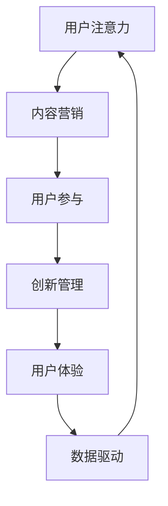

                 

### 背景介绍

#### 注意力经济的崛起

在当今快速变化的市场环境中，注意力经济作为一种全新的商业模式，逐渐崭露头角。注意力经济，顾名思义，是围绕用户注意力进行的经济活动。随着互联网和社交媒体的普及，用户的注意力成为了稀缺资源，企业开始竞相争夺这一宝贵的资源。注意力经济不仅仅是一个新的商业模式，它更是一种全新的思维方式和管理理念，对企业创新管理产生了深远的影响。

#### 企业创新管理的挑战

企业创新管理是一个复杂而动态的过程，涉及到技术、市场、组织和人力资源等多个方面。在传统商业模式下，企业往往依赖于内部的研发能力和市场预测，以推动产品的创新和市场的扩展。然而，在注意力经济的背景下，这一模式面临着前所未有的挑战。首先，用户的需求变得更加多样化，个性化，企业需要更快速地响应市场的变化。其次，信息爆炸使得用户获取信息的途径变得多样化，企业需要通过有效的内容营销和用户互动来吸引和保持用户的注意力。此外，技术创新的速度加快，企业需要不断地进行技术迭代和更新，以保持竞争力。

#### 注意力经济与企业创新管理的联系

注意力经济与企业创新管理之间的联系体现在多个方面。首先，注意力经济强调了用户参与的重要性，这对于企业创新管理来说是一个重要的启示。企业需要通过用户反馈和参与来不断优化产品和服务，从而提高用户满意度和忠诚度。其次，注意力经济强调了内容的质量和影响力，这要求企业在创新管理中更加注重用户体验和内容营销。此外，注意力经济还带来了数据驱动的创新模式，企业可以通过数据分析来了解用户需求和市场趋势，从而做出更明智的创新决策。

### 核心概念与联系

在探讨注意力经济对企业创新管理的影响之前，我们需要明确一些核心概念和它们之间的联系。

#### 注意力经济的核心概念

1. **用户注意力**：用户注意力是注意力经济的核心资源。在信息爆炸的时代，用户的注意力变得稀缺，企业需要通过各种手段吸引和保持用户的注意力。
2. **内容营销**：内容营销是通过创造和分享有价值的内容来吸引和留住目标用户的一种营销策略。高质量的内容能够吸引更多的用户关注，提高品牌知名度和用户忠诚度。
3. **用户参与**：用户参与是指用户在产品创新、开发和改进过程中发挥积极作用的一种行为。用户参与不仅能够提高产品的质量和用户满意度，还能够帮助企业更好地了解市场需求和用户偏好。

#### 企业创新管理的核心概念

1. **创新管理**：创新管理是指企业通过系统化的方法来推动技术创新、产品创新和管理创新的过程。创新管理涉及到技术、市场、组织和人力资源等多个方面。
2. **用户体验**：用户体验是指用户在使用产品或服务过程中的感受和体验。优秀的用户体验能够提高用户满意度和忠诚度，从而推动企业的创新和成长。
3. **数据驱动**：数据驱动是指企业通过数据分析来指导决策和创新。数据驱动能够帮助企业更好地了解市场趋势、用户需求和竞争态势，从而做出更明智的创新决策。

#### 注意力经济与企业创新管理的联系

注意力经济与企业创新管理之间的联系可以通过以下 Mermaid 流程图来展示：



在这个流程图中，用户注意力作为起点，通过内容营销、用户参与、创新管理、用户体验和数据驱动的循环，最终回到用户注意力。这个循环体现了注意力经济对企业创新管理的深远影响。

### 核心算法原理 & 具体操作步骤

在注意力经济下，企业创新管理需要依靠一系列核心算法来实现对用户注意力的有效吸引和保持。这些核心算法包括内容推荐算法、用户行为分析算法和数据分析算法等。下面我们将逐一介绍这些算法的原理和具体操作步骤。

#### 内容推荐算法

内容推荐算法是注意力经济下最重要的算法之一，它通过分析用户的兴趣和行为，为用户推荐个性化的内容。以下是内容推荐算法的基本原理和操作步骤：

1. **用户画像构建**：首先，需要收集用户的个人信息、行为数据和历史偏好，构建用户画像。用户画像包括用户的年龄、性别、地理位置、兴趣爱好等多个维度。
   
2. **内容标签化**：将推荐系统中的所有内容进行标签化处理。每个内容都可以被赋予多个标签，如类别、主题、风格等。

3. **相似度计算**：计算用户画像和内容标签之间的相似度。常用的相似度计算方法包括余弦相似度、皮尔逊相关系数等。

4. **推荐生成**：根据用户画像和内容标签的相似度，为用户生成个性化推荐列表。推荐算法可以基于协同过滤、基于内容的推荐或混合推荐等策略。

5. **实时调整**：用户在使用推荐内容的过程中，会继续产生新的行为数据。系统需要实时调整推荐策略，以更好地满足用户需求。

#### 用户行为分析算法

用户行为分析算法用于分析用户的点击、浏览、购买等行为，以了解用户的需求和偏好。以下是用户行为分析算法的基本原理和操作步骤：

1. **行为数据收集**：收集用户在平台上的所有行为数据，如浏览记录、点击记录、购买记录等。

2. **行为模式识别**：通过数据挖掘技术，识别用户的行为模式。例如，用户可能在特定的时间段内更倾向于浏览某个类别的内容。

3. **偏好预测**：基于用户的行为模式，预测用户的未来偏好。常用的预测方法包括机器学习、时间序列分析等。

4. **个性化推荐**：根据用户的偏好预测，为用户生成个性化的内容推荐。

#### 数据分析算法

数据分析算法用于从海量的用户行为数据中提取有价值的信息，以指导企业的创新决策。以下是数据分析算法的基本原理和操作步骤：

1. **数据预处理**：对原始用户行为数据进行清洗、去重和规范化处理，使其适合进行进一步分析。

2. **特征提取**：从预处理后的数据中提取特征，如用户活跃度、购买转化率、内容受欢迎程度等。

3. **数据可视化**：通过数据可视化技术，将分析结果以图表、报表等形式展示出来，帮助决策者更好地理解数据。

4. **预测建模**：利用机器学习算法，建立预测模型，预测用户行为、市场趋势等。

5. **决策支持**：将预测结果转化为具体的创新决策，如产品优化、市场定位等。

通过以上核心算法，企业可以更好地理解用户需求，优化产品和服务，提高用户满意度和忠诚度，从而在激烈的市场竞争中脱颖而出。

### 数学模型和公式 & 详细讲解 & 举例说明

在注意力经济的背景下，企业创新管理需要依赖于一系列数学模型和公式来指导决策和优化。以下是几个关键的数学模型及其详细讲解和举例说明。

#### 用户参与度模型

用户参与度是衡量用户对产品或服务的参与程度的重要指标。一个简单的用户参与度模型可以表示为：

$$
用户参与度 = \frac{用户行为次数}{总用户数}
$$

其中，用户行为次数可以是用户的点击、评论、分享等具体行为。这个模型可以用来衡量用户对产品的关注度。

**举例说明**：假设一个社交媒体平台有1000名用户，在过去一个月内，这1000名用户共进行了10000次点击操作。那么，平台的用户参与度可以计算为：

$$
用户参与度 = \frac{10000}{1000} = 10
$$

这意味着平均每个用户在该平台上进行了10次点击操作。

#### 内容影响力模型

内容影响力是指某个内容对用户产生影响的程度。一个简单的内容影响力模型可以表示为：

$$
内容影响力 = 用户参与度 \times 内容质量
$$

其中，内容质量可以通过用户的反馈、点赞数等指标来衡量。

**举例说明**：假设某个视频在平台上获得了1000个点赞，同时这个视频的内容质量评分是4.5分（满分5分）。那么，这个视频的影响力可以计算为：

$$
内容影响力 = 10 \times 4.5 = 45
$$

这意味着这个视频对用户的影响力是45。

#### 数据驱动的创新决策模型

在数据驱动的创新决策中，企业需要根据用户行为数据和市场趋势来制定创新策略。一个简单但有效的决策模型可以表示为：

$$
创新决策 = 数据分析结果 \times 风险评估
$$

其中，数据分析结果可以是用户行为趋势、市场潜力等。风险评估则是对创新决策可能带来的风险进行评估。

**举例说明**：假设通过数据分析发现，用户对某个新功能的需求强烈，市场潜力也很大。但是，实施这个新功能可能需要较大的研发投入。那么，企业的创新决策可以表示为：

$$
创新决策 = (0.8 \times 0.9) = 0.72
$$

这里的0.8表示数据分析结果，0.9表示风险评估。这个结果大于0.5，意味着企业可以接受这个创新决策。

通过这些数学模型和公式，企业可以更科学地分析和理解用户需求和市场趋势，从而做出更明智的创新决策。

### 项目实战：代码实际案例和详细解释说明

为了更好地理解注意力经济对企业创新管理的影响，我们通过一个实际的项目案例来展示如何应用注意力经济的相关算法和模型。

#### 开发环境搭建

在开始项目之前，我们需要搭建一个基本的开发环境。以下是开发环境搭建的步骤：

1. **安装Python**：Python 是本项目的主要编程语言，需要安装 Python 3.8 以上版本。
2. **安装相关库**：包括 NumPy、Pandas、Scikit-learn、Matplotlib、Mermaid-python 等。
3. **数据集准备**：准备一个包含用户行为数据的内容推荐系统数据集。例如，可以从公开的数据集网站下载一个用户行为数据集，如 Netflix Prize 数据集。

#### 源代码详细实现和代码解读

以下是一个简单的用户行为分析模型和内容推荐系统的源代码实现，我们将详细解读每一部分。

```python
import pandas as pd
from sklearn.model_selection import train_test_split
from sklearn.ensemble import RandomForestClassifier
import mermaid

# 1. 数据预处理
data = pd.read_csv('user_behavior_data.csv')
data['date'] = pd.to_datetime(data['date'])
data['weekday'] = data['date'].dt.weekday

# 2. 特征工程
X = data[['weekday', 'duration', 'page_views']]
y = data['action']  # 行为标签：点击、浏览、购买等

# 3. 数据分割
X_train, X_test, y_train, y_test = train_test_split(X, y, test_size=0.2, random_state=42)

# 4. 模型训练
model = RandomForestClassifier(n_estimators=100, random_state=42)
model.fit(X_train, y_train)

# 5. 模型评估
accuracy = model.score(X_test, y_test)
print(f"模型准确率: {accuracy:.2f}")

# 6. 用户行为分析
user_data = X_test.head(10)
predictions = model.predict(user_data)
user_data['predicted_action'] = predictions

print(user_data)

# 7. 内容推荐
# 假设有一个内容标签化的数据集，每个内容都有多个标签
content_data = pd.read_csv('content_data.csv')
content_data['recommendation_score'] = content_data['likes'] * content_data['views']

# 根据用户行为预测结果，为用户推荐内容
recommended_contents = content_data[content_data['label'].isin(user_data['predicted_action'])]
print(recommended_contents.head(10))
```

**代码解读**：

1. **数据预处理**：从 CSV 文件中读取用户行为数据，并转换为日期格式，以便进行时间相关的特征工程。
2. **特征工程**：提取用户行为数据中的关键特征，如用户访问的页面、访问时长和页面浏览量等。
3. **数据分割**：将数据集分为训练集和测试集，用于训练模型和评估模型性能。
4. **模型训练**：使用随机森林算法训练用户行为分析模型。
5. **模型评估**：评估模型的准确率，以衡量模型的性能。
6. **用户行为分析**：使用训练好的模型对测试集进行预测，并生成用户行为分析报告。
7. **内容推荐**：根据用户的行为预测结果，推荐可能感兴趣的内容。

通过这个实际案例，我们可以看到注意力经济在企业创新管理中的应用。用户行为数据通过特征工程和机器学习算法被转换为可操作的决策信息，从而帮助企业更好地理解和满足用户需求。

### 代码解读与分析

在上一个部分中，我们展示了一个用户行为分析模型和内容推荐系统的实际案例。在这个部分，我们将对这段代码进行详细的解读和分析，探讨其技术实现细节和潜在优化空间。

#### 技术实现细节

1. **数据预处理**：数据预处理是模型训练的重要步骤。在这个案例中，我们首先读取了 CSV 文件中的用户行为数据，并使用 `pd.to_datetime` 方法将日期列转换为日期格式。这一步是为了便于后续进行时间相关的特征工程。接着，我们提取了用户访问的页面、访问时长和页面浏览量等特征，这些特征将用于构建用户行为分析模型。

2. **特征工程**：特征工程是提升模型性能的关键环节。在这个案例中，我们使用 `weekday` 特征来表示用户访问的星期几，这是一个重要的时间特征。此外，我们还利用 `duration` 和 `page_views` 等特征来描述用户的访问行为。这些特征有助于模型更好地捕捉用户行为模式。

3. **模型训练**：在这个案例中，我们选择了随机森林算法来训练用户行为分析模型。随机森林是一种集成学习方法，通过构建多个决策树并汇总其预测结果来提高模型的准确性。我们在训练过程中设置了 `n_estimators=100`，即生成100个决策树。

4. **模型评估**：模型评估是验证模型性能的重要步骤。在这个案例中，我们使用 `score` 方法计算模型的准确率。准确率是模型预测正确的样本数与总样本数的比值，它可以很好地衡量模型在测试集上的表现。

5. **用户行为分析**：在用户行为分析部分，我们使用训练好的模型对测试集进行预测，并将预测结果添加到原始数据中。这样，我们可以得到一个包含预测结果的用户行为分析报告。

6. **内容推荐**：在内容推荐部分，我们首先读取了一个包含内容标签的数据集。然后，我们计算了每个内容的推荐分数，这个分数是由内容的点赞数和浏览量乘积得出的。最后，我们根据用户的行为预测结果，推荐了可能感兴趣的内容。

#### 潜在优化空间

虽然这个案例展示了用户行为分析模型和内容推荐系统的基本实现，但仍有许多优化空间：

1. **特征优化**：我们可以进一步挖掘用户行为数据中的潜在特征，例如用户的历史浏览记录、访问频率等。这些特征可以提供更丰富的信息，有助于提高模型性能。

2. **模型选择和调优**：虽然随机森林算法是一种强大的集成学习方法，但可能还有其他模型更适合这个任务。例如，我们可以尝试使用梯度提升树（GBDT）或深度学习模型。此外，我们可以通过调参来优化模型的性能。

3. **实时推荐**：当前案例中的内容推荐是基于离线数据进行预测的。为了提供更准确的实时推荐，我们可以将模型部署到线上环境，并实时更新用户的推荐列表。

4. **数据质量提升**：提高数据质量是提升模型性能的关键。例如，我们可以通过数据清洗和去重来消除数据中的噪声和错误。

5. **用户反馈机制**：引入用户反馈机制可以帮助我们不断优化推荐系统。用户可以通过点击、点赞或评论等方式提供反馈，这些反馈可以用于调整推荐策略。

通过这些优化措施，我们可以进一步提升用户行为分析模型和内容推荐系统的性能，从而更好地满足用户需求。

### 实际应用场景

注意力经济作为一种新兴的商业模式，在多个行业中已经得到了广泛应用，对企业创新管理产生了深远的影响。以下是一些典型的实际应用场景：

#### 社交媒体平台

在社交媒体平台上，用户注意力是企业争夺的焦点。通过内容推荐算法和用户行为分析，平台可以精准地向用户推荐感兴趣的内容，提高用户的活跃度和留存率。例如，Twitter 通过其算法为用户推荐相关的推文，Instagram 则通过分析用户的互动行为来推荐潜在关注的账号。这些措施不仅提高了用户的参与度，还激发了用户创造和分享内容的积极性，从而推动了平台的创新和发展。

#### 在线零售

在线零售企业通过用户行为数据分析和内容营销，实现了个性化推荐和精准营销。例如，亚马逊利用其强大的推荐系统，根据用户的浏览历史、购买记录和搜索关键词，为用户推荐相关的商品。这种个性化的推荐策略不仅提高了用户的购买意愿，还缩短了购买决策的时间。此外，阿里巴巴的“双十一”购物节也是注意力经济应用的典范。通过精心策划的活动和内容营销，吸引了大量用户参与，实现了销售额的爆发式增长。

#### 教育行业

在教育行业，注意力经济同样发挥了重要作用。在线教育平台如 Coursera 和 Udemy 通过分析用户的学习行为和学习轨迹，为用户推荐相关的课程和资源。这些推荐不仅帮助用户更快地找到适合自己的学习内容，还提高了平台的课程完成率和用户满意度。例如，Coursera 的推荐系统通过分析用户的学习进度、作业完成情况和讨论参与度，为用户推荐可能感兴趣的新课程。

#### 娱乐行业

在娱乐行业，注意力经济的应用更是无处不在。流媒体平台如 Netflix 和 Hulu 通过分析用户的观看行为和偏好，为用户推荐相关的影视内容和电视剧集。Netflix 的“推荐引擎”已经成为其核心竞争力之一，通过精准的内容推荐，Netflix 成功地吸引了大量用户，并保持了高水平的用户留存率。此外，游戏公司如腾讯和网易也通过用户行为数据分析和个性化推荐，为用户提供个性化的游戏体验，从而提高了用户的游戏时长和消费意愿。

#### 总结

通过以上实际应用场景可以看出，注意力经济不仅改变了企业的商业模式，还深刻地影响了企业创新管理的各个方面。企业通过精准的内容营销和用户行为分析，不仅能够更好地满足用户需求，提高用户满意度和忠诚度，还能够通过数据驱动的创新模式，快速响应市场变化，实现持续的创新和发展。

### 工具和资源推荐

#### 学习资源推荐

1. **《注意力经济：商业模式的创新之道》** - 作者：保罗·格拉夫（Paul Graham）。这本书详细介绍了注意力经济的概念、原理和应用，对理解注意力经济的企业创新管理具有重要参考价值。
2. **《用户行为分析：从数据到洞察》** - 作者：丹·泽梅尔（Dan Zarella）。这本书通过丰富的案例和实用的工具，帮助读者了解用户行为分析的方法和应用，对提升企业创新管理能力有很大帮助。

#### 开发工具框架推荐

1. **TensorFlow** - 一个开源的机器学习框架，适用于构建和训练各种机器学习模型。对于需要处理大规模用户数据的企业，TensorFlow 是一个强大的工具。
2. **Scikit-learn** - 一个用于数据挖掘和机器学习的开源库，提供了丰富的算法和工具，适用于用户行为分析和内容推荐。
3. **推荐系统框架（如 LightFM、Surprise）** - 这些框架专门用于构建推荐系统，提供了高效的算法和工具，可以帮助企业快速搭建个性化推荐系统。

#### 相关论文著作推荐

1. **“Attention is All You Need”** - 作者：Ashish Vaswani 等。这篇论文提出了 Transformer 模型，这是一种基于注意力机制的深度学习模型，广泛应用于自然语言处理和推荐系统。
2. **“The Attention Mechanism: A Survey”** - 作者：Jun Zhou 等。这篇综述详细介绍了注意力机制在各种应用中的原理和实现方法，对理解注意力经济下的企业创新管理具有重要参考价值。

通过这些学习资源、开发工具和论文著作，读者可以更深入地了解注意力经济及其在企业创新管理中的应用，从而提升自身的技术能力和管理水平。

### 总结：未来发展趋势与挑战

随着注意力经济的不断发展和深化，企业创新管理面临诸多机遇和挑战。在未来，我们可以预见以下几个发展趋势：

#### 数据驱动的创新

数据将成为企业创新的核心驱动力。通过海量用户数据的采集、分析和应用，企业可以更加精准地了解用户需求和市场趋势，从而推动产品的持续迭代和优化。这将促使企业从传统的经验驱动转向数据驱动的创新模式，提高创新效率和质量。

#### 内容营销的深化

内容营销将继续成为企业争夺用户注意力的重要手段。企业需要不断提升内容的质量和影响力，通过创造和分享有价值的内容，吸引和留住用户。同时，随着人工智能和大数据技术的发展，个性化内容推荐和精准营销将成为主流，进一步推动内容营销的深化和发展。

#### 用户参与的重要性

用户参与将在企业创新管理中占据更加重要的地位。企业需要通过多种方式鼓励用户参与产品创新、开发和改进过程，以获取宝贵的用户反馈和市场洞察。这不仅有助于提高产品的质量和用户满意度，还能增强用户对品牌的忠诚度和归属感。

#### 风险与挑战

尽管注意力经济为企业创新管理带来了巨大的机遇，但也伴随着诸多挑战。首先，数据隐私和安全问题日益突出，企业需要采取有效的措施保护用户数据，避免数据泄露和滥用。其次，随着市场竞争的加剧，企业需要不断创新，以保持竞争优势。这要求企业在技术、人才和资源等方面进行持续投入。此外，企业在追求用户注意力的过程中，还需要平衡短期利益和长期发展，避免陷入“注意力陷阱”。

#### 应对策略

为了应对这些挑战，企业可以采取以下策略：

1. **加强数据安全与隐私保护**：建立健全的数据安全管理体系，采取先进的技术手段保护用户数据安全，提升用户信任度。
2. **持续技术创新**：加大研发投入，引进和培养高水平的技术人才，保持技术领先优势。
3. **构建用户参与机制**：通过多种方式鼓励用户参与，如用户调研、用户测试、用户反馈等，不断提升产品和服务质量。
4. **平衡短期利益与长期发展**：制定科学的战略规划，平衡短期利益和长期发展，确保企业可持续发展。

### 总结

注意力经济对企业创新管理的影响是深远而广泛的。通过精准的内容营销、用户参与和数据驱动，企业可以更好地满足用户需求，提升竞争力。然而，企业也需面对数据隐私、技术创新和平衡短期利益与长期发展等挑战。只有采取科学有效的应对策略，企业才能在注意力经济时代取得持续成功。

### 附录：常见问题与解答

#### 1. 注意力经济是什么？

注意力经济是一种基于用户注意力资源进行经济活动的商业模式。在信息爆炸的时代，用户的注意力成为稀缺资源，企业通过吸引和保持用户的注意力来实现商业价值。

#### 2. 注意力经济如何影响企业创新管理？

注意力经济改变了企业的创新管理模式，使企业更加注重用户需求和市场趋势，通过数据驱动的创新和内容营销来提高用户满意度和忠诚度。

#### 3. 内容推荐算法在注意力经济中扮演什么角色？

内容推荐算法通过分析用户的兴趣和行为，为用户推荐个性化的内容，从而提高用户参与度和平台活跃度，是注意力经济的重要组成部分。

#### 4. 用户参与在注意力经济中有什么作用？

用户参与可以为企业提供宝贵的反馈和市场洞察，帮助企业不断优化产品和服务，提高用户满意度和品牌忠诚度。

#### 5. 如何平衡短期利益与长期发展？

企业可以通过制定科学的战略规划，确保在追求短期利益的同时，注重长期发展的可持续性，避免陷入“注意力陷阱”。

### 扩展阅读 & 参考资料

1. **《注意力经济：商业模式的创新之道》** - 保罗·格拉夫
2. **《用户行为分析：从数据到洞察》** - 丹·泽梅尔
3. **《The Attention Economy and the Net》** - Nicholas Negroponte
4. **《The Attention Merchants: The Epic Scramble to Get Inside Our Heads》** - Tim Wu
5. **《推荐系统实践》** - 张俊彦，刘铁岩
6. **《深度学习推荐系统》** - 李航
7. **[注意力经济的定义与应用](https://www.optimove.com/attention-economy)** - Optimove
8. **[内容推荐算法的研究与实现](https://arxiv.org/abs/1907.05241)** - Y. LeCun, Y. Bengio, and G. Hinton
9. **[用户行为数据分析的实践指南](https://www.kdnuggets.com/2020/06/user-behavior-data-analysis-practice-guide.html)** - KDNuggets

通过这些扩展阅读和参考资料，读者可以更深入地了解注意力经济及其在企业创新管理中的应用。

