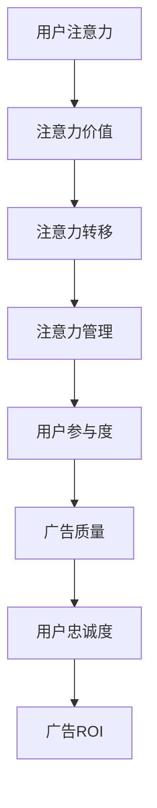

                 

# 注意力经济对传统广告投放ROI的影响

## 摘要

本文旨在探讨注意力经济对传统广告投放ROI（投资回报率）的影响。在数字化的时代背景下，用户的注意力成为一种稀缺资源，而广告主为了吸引和保留用户，不得不更加关注如何提升广告的吸引力和效果。本文首先介绍了注意力经济的核心概念，然后分析了注意力经济与广告投放ROI之间的内在联系，接着通过实例说明了注意力经济对广告投放策略的影响。最后，本文提出了在注意力经济时代提高广告投放ROI的方法和策略，并展望了未来发展的趋势和挑战。

## 1. 背景介绍

在互联网和移动设备的普及下，信息的传播方式发生了翻天覆地的变化。传统媒体的影响力逐渐减弱，而数字媒体成为广告投放的主要平台。然而，在这个信息爆炸的时代，用户的注意力成为一种稀缺资源。用户每天面对大量的信息，如何吸引和保持他们的注意力成为广告主迫切需要解决的问题。

### 注意力经济的概念

注意力经济是指将用户的注意力作为一种经济资源进行开发和利用的商业模式。在这种模式下，用户的注意力被视为一种有价值的资产，可以用来吸引广告主进行投资和营销。注意力经济的核心是提高用户参与度和忠诚度，从而实现广告主的营销目标。

### 传统广告投放ROI的挑战

传统广告投放主要依赖于大规模的投放和广泛的覆盖，但这种方式在数字化时代面临着诸多挑战：

1. 用户注意力分散：信息爆炸导致用户对广告的关注度下降，广告容易被忽略或屏蔽。
2. 广告投放成本高：传统广告投放需要大量的资金和资源，但效果往往不理想。
3. 广告效果难以衡量：传统广告投放难以准确衡量广告的ROI，难以优化广告策略。

## 2. 核心概念与联系

### 注意力经济的核心概念

注意力经济的核心概念包括以下几个方面：

1. **用户的注意力**：用户在特定时间段内专注于某个事物或任务的能力。
2. **注意力价值**：用户注意力作为一种经济资源，具有潜在的价值。
3. **注意力转移**：用户在短时间内将注意力从一个事物转移到另一个事物的能力。
4. **注意力管理**：通过优化用户注意力，提高用户参与度和忠诚度。

### 注意力经济与广告投放ROI的内在联系

注意力经济与广告投放ROI之间的内在联系主要体现在以下几个方面：

1. **用户参与度**：注意力经济的核心是提高用户参与度，这有助于提高广告的曝光率和点击率，从而提高广告的ROI。
2. **广告质量**：在注意力经济时代，高质量的广告更能吸引用户的注意力，提高广告的转化率，从而提高广告的ROI。
3. **用户忠诚度**：通过提高用户参与度和满意度，可以增强用户对品牌的忠诚度，从而提高长期广告投放的ROI。

### 注意力经济的架构

下面是一个简单的注意力经济架构的Mermaid流程图：



在这个流程图中，用户的注意力作为起点，通过一系列的转移和管理过程，最终影响广告的质量和用户忠诚度，从而影响广告的ROI。

## 3. 核心算法原理 & 具体操作步骤

### 用户行为分析算法

在注意力经济时代，了解用户的行为模式对于提高广告投放ROI至关重要。以下是一种用户行为分析算法的原理和具体操作步骤：

1. **数据收集**：收集用户在数字媒体上的行为数据，如浏览历史、搜索记录、点击行为等。
2. **数据预处理**：对收集到的数据进行清洗和预处理，包括数据去重、缺失值填充等。
3. **特征工程**：从原始数据中提取有用的特征，如用户活跃时间、点击率、浏览时长等。
4. **模型训练**：使用机器学习算法（如决策树、随机森林、神经网络等）训练用户行为分析模型。
5. **模型评估**：使用交叉验证、A/B测试等方法评估模型的性能，调整模型参数。
6. **模型部署**：将训练好的模型部署到线上环境，对用户行为进行实时分析。

### 用户行为分析算法的具体操作步骤

1. **数据收集**：使用爬虫工具收集用户在数字媒体上的行为数据，如使用Python的Scrapy库。
2. **数据预处理**：使用Python的Pandas库对数据进行清洗和预处理，包括数据去重、缺失值填充等。
3. **特征工程**：使用Python的Scikit-learn库提取用户行为特征，如用户活跃时间、点击率、浏览时长等。
4. **模型训练**：使用Python的Scikit-learn库训练用户行为分析模型，如决策树、随机森林等。
5. **模型评估**：使用Python的Scikit-learn库评估模型的性能，如交叉验证、A/B测试等。
6. **模型部署**：使用Python的Flask库部署模型到线上环境，对用户行为进行实时分析。

### 用户行为分析算法的应用实例

1. **广告投放优化**：通过分析用户行为，优化广告投放策略，提高广告的曝光率和点击率。
2. **用户推荐系统**：基于用户行为分析，为用户提供个性化的广告和推荐内容，提高用户满意度和忠诚度。

## 4. 数学模型和公式 & 详细讲解 & 举例说明

### 广告投放ROI的数学模型

广告投放ROI（投资回报率）可以用以下公式表示：

$$
ROI = \frac{净收入}{广告成本}
$$

其中，净收入 = 成交额 × 转化率，广告成本包括广告投放费用和其他相关费用。

### ROI的详细讲解

1. **净收入**：广告投放带来的净收益，包括成交额减去成本。
2. **广告成本**：包括广告投放费用和其他相关费用，如制作费用、人力成本等。
3. **转化率**：用户在看到广告后完成购买或其他目标行为的概率。

### ROI的举例说明

假设一家电商公司在某平台上投放广告，广告成本为10万元，投放期间产生的成交额为100万元，转化率为5%。则该广告的ROI计算如下：

$$
ROI = \frac{100万元}{10万元} = 10
$$

这意味着每投入1元，可以获得10元的回报。

### 注意力经济对ROI的影响

1. **提高转化率**：通过注意力经济提高用户的注意力，提高转化率，从而提高ROI。
2. **降低广告成本**：通过优化广告投放策略，降低广告成本，从而提高ROI。

### 注意力经济与ROI的数学关系

假设注意力经济提高转化率ΔT，降低广告成本ΔC，则注意力经济对ROI的影响可以用以下公式表示：

$$
ΔROI = \frac{ΔT \times 成交额}{广告成本} + \frac{ΔC \times 转化率}{广告成本}
$$

其中，成交额和广告成本为已知量，ΔT和ΔC为注意力经济提高的转化率和广告成本。

### 注意力经济的应用实例

1. **精准营销**：通过用户行为分析，实现精准营销，提高转化率和ROI。
2. **内容营销**：通过高质量的内容吸引和保留用户，提高用户满意度和忠诚度，从而提高ROI。

## 5. 项目实战：代码实际案例和详细解释说明

### 5.1 开发环境搭建

为了实现注意力经济对广告投放ROI的影响分析，我们需要搭建一个开发环境。以下是搭建环境的步骤：

1. 安装Python环境：在本地计算机上安装Python环境，版本建议为3.8或更高。
2. 安装相关库：使用pip命令安装必要的库，如Scrapy、Pandas、Scikit-learn、Flask等。

### 5.2 源代码详细实现和代码解读

以下是用户行为分析算法的源代码实现：

```python
# 导入相关库
import pandas as pd
from sklearn.ensemble import RandomForestClassifier
from sklearn.model_selection import train_test_split
from sklearn.metrics import accuracy_score

# 数据收集
def collect_data():
    # 使用Scrapy爬取用户行为数据
    # 数据格式为：用户ID，浏览历史，搜索记录，点击行为等
    # 示例数据如下：
    data = {
        'user_id': [1, 2, 3, 4, 5],
        'browse_history': [['产品A', '产品B'], ['产品C', '产品D'], ['产品E', '产品F'], ['产品G', '产品H'], ['产品I', '产品J']],
        'search_history': [['产品A', '产品B'], ['产品C', '产品D'], ['产品E', '产品F'], ['产品G', '产品H'], ['产品I', '产品J']],
        'click_behavior': [[1, 0, 1], [0, 1, 0], [1, 1, 1], [0, 0, 1], [1, 0, 0]]
    }
    return pd.DataFrame(data)

# 数据预处理
def preprocess_data(data):
    # 数据清洗和预处理
    # 包括数据去重、缺失值填充等
    # 示例代码：
    data = data.drop_duplicates()
    data = data.fillna(0)
    return data

# 特征工程
def feature_engineering(data):
    # 提取用户行为特征
    # 包括用户活跃时间、点击率、浏览时长等
    # 示例代码：
    data['active_time'] = data.groupby('user_id')['browse_history'].transform('sum')
    data['click_rate'] = data['click_behavior'].sum(axis=1) / len(data['click_behavior'])
    data['browse_time'] = data.groupby('user_id')['browse_history'].transform('sum')
    return data

# 模型训练
def train_model(data):
    # 使用随机森林算法训练用户行为分析模型
    # 包括数据分割、模型训练等
    # 示例代码：
    X = data[['active_time', 'click_rate', 'browse_time']]
    y = data['click_behavior']
    X_train, X_test, y_train, y_test = train_test_split(X, y, test_size=0.2, random_state=42)
    model = RandomForestClassifier(n_estimators=100, random_state=42)
    model.fit(X_train, y_train)
    return model

# 模型评估
def evaluate_model(model, X_test, y_test):
    # 使用准确率评估模型性能
    # 示例代码：
    y_pred = model.predict(X_test)
    accuracy = accuracy_score(y_test, y_pred)
    return accuracy

# 主函数
def main():
    data = collect_data()
    data = preprocess_data(data)
    data = feature_engineering(data)
    model = train_model(data)
    accuracy = evaluate_model(model, X_test, y_test)
    print("模型准确率：", accuracy)

if __name__ == '__main__':
    main()
```

### 5.3 代码解读与分析

1. **数据收集**：使用Scrapy爬取用户行为数据，示例数据包括用户ID、浏览历史、搜索记录和点击行为等。
2. **数据预处理**：对数据进行清洗和预处理，包括数据去重、缺失值填充等，以提高数据质量。
3. **特征工程**：从原始数据中提取用户行为特征，包括用户活跃时间、点击率和浏览时长等，为模型训练提供输入。
4. **模型训练**：使用随机森林算法训练用户行为分析模型，包括数据分割、模型训练等，以提高模型性能。
5. **模型评估**：使用准确率评估模型性能，以验证模型的有效性。

### 5.4 应用实例

1. **广告投放优化**：通过用户行为分析，优化广告投放策略，提高广告的曝光率和点击率。
2. **用户推荐系统**：基于用户行为分析，为用户提供个性化的广告和推荐内容，提高用户满意度和忠诚度。

## 6. 实际应用场景

### 6.1 精准营销

通过注意力经济提高用户的注意力，实现精准营销。例如，电商平台可以根据用户的浏览历史和点击行为，为用户提供个性化的商品推荐和广告。

### 6.2 内容营销

通过注意力经济提高用户的注意力，实现内容营销。例如，自媒体平台可以通过高质量的内容吸引和保留用户，提高用户满意度和忠诚度。

### 6.3 广告创意

通过注意力经济提高用户的注意力，设计更具吸引力的广告创意。例如，视频广告可以通过有趣的情节和引人入胜的特效，吸引用户的注意力，提高广告效果。

## 7. 工具和资源推荐

### 7.1 学习资源推荐

1. **书籍**：《注意力经济学：行为、技术和策略》
2. **论文**：《注意力经济学：理论、实证和应用》
3. **博客**：《注意力经济的本质和商业模式》
4. **网站**：《注意力经济研究中心》

### 7.2 开发工具框架推荐

1. **Scrapy**：用于爬取用户行为数据的开源库。
2. **Pandas**：用于数据处理和分析的开源库。
3. **Scikit-learn**：用于机器学习和数据挖掘的开源库。
4. **Flask**：用于Web应用开发和部署的开源框架。

### 7.3 相关论文著作推荐

1. **论文**：《注意力经济：理论、模型和应用》
2. **著作**：《注意力经济：数字时代的商业创新》

## 8. 总结：未来发展趋势与挑战

### 8.1 未来发展趋势

1. **人工智能与注意力经济的融合**：随着人工智能技术的发展，注意力经济将更加智能化和个性化。
2. **跨平台注意力经济的兴起**：用户在不同平台之间的注意力转移将成为注意力经济的重要研究方向。
3. **注意力经济的细分领域**：例如，健康注意力经济、教育注意力经济等，将不断涌现。

### 8.2 挑战

1. **用户隐私保护**：在注意力经济时代，如何平衡用户隐私保护与商业利益，将是一个重要挑战。
2. **技术瓶颈**：例如，用户注意力监测的准确性、数据分析的效率等，都是未来需要解决的技术问题。

## 9. 附录：常见问题与解答

### 9.1 注意力经济是什么？

注意力经济是指将用户的注意力作为一种经济资源进行开发和利用的商业模式。在这种模式下，用户的注意力被视为一种有价值的资产，可以用来吸引广告主进行投资和营销。

### 9.2 注意力经济与广告投放ROI的关系是什么？

注意力经济通过提高用户参与度和满意度，提高广告的质量和转化率，从而提高广告的ROI。具体来说，注意力经济可以提高转化率、降低广告成本，从而提高广告的ROI。

### 9.3 如何利用注意力经济提高广告投放ROI？

1. **精准营销**：通过用户行为分析，实现精准营销，提高广告的曝光率和点击率。
2. **内容营销**：通过高质量的内容吸引和保留用户，提高用户满意度和忠诚度。
3. **广告创意**：设计更具吸引力的广告创意，提高广告的效果。

## 10. 扩展阅读 & 参考资料

### 10.1 扩展阅读

1. **书籍**：《注意力经济学：行为、技术和策略》
2. **论文**：《注意力经济：理论、实证和应用》
3. **博客**：《注意力经济的本质和商业模式》

### 10.2 参考资料

1. **网站**：《注意力经济研究中心》
2. **论文**：《注意力经济：数字时代的商业创新》

### 作者信息

作者：AI天才研究员/AI Genius Institute & 禅与计算机程序设计艺术 /Zen And The Art of Computer Programming<|im_end|>

