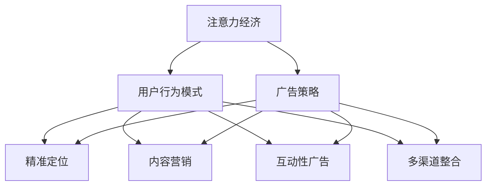

                 

### 背景介绍

随着互联网技术的飞速发展，信息传播的渠道和方式日益多样化，传统的广告投放策略正面临着前所未有的挑战。在这个大数据和人工智能的时代，用户的行为和兴趣可以被精确地捕捉和追踪，这种“注意力经济”的理念逐渐崭露头角。注意力经济强调，用户的注意力是有限的，而企业需要通过更精准、更有针对性的广告投放来争夺用户的注意力。

传统的广告投放策略主要依赖于广告平台和媒介，通过大规模的投放来增加品牌曝光度，从而影响潜在消费者的购买决策。然而，随着互联网广告市场的饱和和用户注意力的分散，传统广告投放的效果逐渐减弱。根据市场研究公司eMarketer的数据，全球数字广告支出在过去几年中虽然持续增长，但广告主对广告投放效果的不满情绪也在上升。

在这个背景下，注意力经济逐渐成为广告行业的新趋势。注意力经济不仅仅是关于吸引更多的用户注意力，更重要的是如何有效地利用用户的注意力，将其转化为实际的商业价值。本文将深入探讨注意力经济对传统广告投放策略的挑战，分析注意力经济的核心概念及其与用户行为、广告策略的关系，并探讨未来广告投放的发展方向。

文章将首先介绍注意力经济的基本概念和原理，然后分析注意力经济对传统广告投放策略的挑战，接着探讨如何利用注意力经济优化广告策略，最后预测注意力经济的未来发展趋势和面临的挑战。通过本文的讨论，希望能够为广告行业从业者和研究者提供一些新的思路和启示。

### 核心概念与联系

#### 注意力经济

注意力经济（Attention Economy）是一个由凯文·凯利（Kevin Kelly）在20世纪90年代提出的概念，其核心思想是：在信息爆炸的时代，用户的注意力变得稀缺且宝贵，因此，如何获取和利用用户的注意力成为企业和社会关注的焦点。注意力经济不仅仅局限于广告行业，它已经渗透到互联网的各个领域，如社交媒体、内容创作、电子商务等。

在注意力经济中，用户的注意力被视为一种宝贵的资源。与传统的物质资源不同，注意力资源是有限的，且具有高度的可再生性。用户在接收信息时，注意力会被不同来源的信息所分散，而企业需要通过创意和策略来吸引并保持用户的注意力。注意力经济的关键在于理解用户的注意力模式，并根据这些模式来优化内容和服务。

#### 用户行为

用户行为在注意力经济中起着至关重要的作用。随着互联网的普及，用户逐渐从被动接受信息转变为主动获取信息。用户的行为变得更加个性化、多样化，他们更加注重内容的质量和个性化推荐。以下是几个关键的用户行为模式：

1. **碎片化时间消费**：随着智能手机的普及，用户在碎片化时间（如通勤、排队等）中消费内容，这种碎片化时间消费导致了内容消费的碎片化。
2. **个性化需求**：用户越来越倾向于个性化内容，他们希望通过信息流获取与自己兴趣相关的内容，从而提高消费体验。
3. **情绪化反应**：用户在互联网上表达情感和观点，这些情绪化反应影响了内容传播和互动。

#### 广告策略

广告策略在注意力经济中面临着巨大的挑战和机遇。传统广告策略主要依赖于大规模投放，追求广泛覆盖，但在注意力经济时代，这种方式越来越难以奏效。以下是一些关键的广告策略：

1. **精准定位**：利用大数据和人工智能技术，广告主可以更加精准地定位目标受众，提高广告的投放效率。
2. **内容营销**：通过创造高质量、有价值的内容，吸引并留住用户，从而实现品牌传播和用户转化。
3. **互动性广告**：通过社交媒体、互动游戏等手段，提高用户的参与度和品牌忠诚度。
4. **多渠道整合**：结合线上和线下渠道，实现广告投放的全网覆盖。

#### 关联关系

注意力经济、用户行为和广告策略之间存在着紧密的关联。注意力经济强调用户注意力的价值，用户行为则反映了注意力分配的模式，而广告策略则是在这种模式下，如何有效地获取和利用用户注意力的具体实践。以下是注意力经济、用户行为和广告策略之间的关联关系：

- **注意力经济 → 用户行为模式**：注意力经济促使用户在信息消费上更加注重质量和个人化，这影响了他们的行为模式。
- **用户行为模式 → 广告策略**：了解用户行为模式，可以帮助广告主制定更加精准、个性化的广告策略。
- **广告策略 → 注意力经济**：有效的广告策略能够吸引和保持用户注意力，从而实现商业目标，进一步推动注意力经济的发展。

#### Mermaid 流程图

为了更直观地理解注意力经济、用户行为和广告策略之间的关联，我们可以使用Mermaid流程图来展示它们的关系：



在这个流程图中，注意力经济作为核心概念，通过影响用户行为模式，进而引导广告策略的制定和实施。这样的关联关系不仅帮助我们理解注意力经济的运作机制，也为广告主提供了优化广告投放的新思路。

### 核心算法原理 & 具体操作步骤

在注意力经济的背景下，广告投放的核心算法设计变得尤为重要。这些算法不仅需要精准地定位目标受众，还需要在多样化的广告环境中优化投放策略，以最大限度地提高广告的投放效果。以下是几个关键的核心算法原理和具体操作步骤。

#### 1. 精准定位算法

精准定位算法是注意力经济中最基础且关键的一环。其目标是通过分析用户的行为数据，如浏览历史、搜索记录、社交互动等，来识别和分类潜在的目标用户。

**算法原理**：
- **用户画像构建**：通过机器学习和数据挖掘技术，构建用户的个性化画像。这些画像包含了用户的兴趣、行为、地理位置等多维信息。
- **协同过滤推荐**：利用协同过滤算法（如基于用户的协同过滤和基于内容的协同过滤），根据用户的兴趣和行为预测他们可能感兴趣的广告内容。
- **目标受众分类**：将用户划分为不同的群体，如“高消费人群”、“科技爱好者”等，从而实现精准定位。

**具体操作步骤**：

1. **数据收集**：收集用户在不同渠道上的行为数据，包括浏览历史、搜索关键词、购买记录等。
2. **数据预处理**：清洗和整合数据，去除噪声和异常值，确保数据的准确性和完整性。
3. **特征工程**：提取关键特征，如用户兴趣标签、行为频率等，为用户画像构建提供基础。
4. **用户画像构建**：使用机器学习算法（如聚类算法、决策树等）构建用户的个性化画像。
5. **目标受众分类**：根据用户画像，将用户划分为不同的群体，为精准定位做准备。

#### 2. 广告投放优化算法

广告投放优化算法的核心目标是提高广告的投放效果，通过不断调整广告策略来最大化广告的转化率和回报率。

**算法原理**：
- **A/B 测试**：通过对比不同广告版本的效果，找出最优的广告策略。
- **多目标优化**：在多个目标（如点击率、转化率、成本等）之间进行平衡，找到最佳的广告投放组合。
- **机器学习优化**：使用机器学习算法（如线性回归、决策树等）预测广告效果，并根据预测结果调整广告策略。

**具体操作步骤**：

1. **广告版本测试**：创建多个广告版本，通过A/B测试来评估不同版本的广告效果。
2. **效果评估**：收集广告投放后的数据，包括点击率、转化率、广告成本等。
3. **结果分析**：分析A/B测试的结果，确定哪些广告版本表现最佳。
4. **策略调整**：根据最佳广告版本的特点，调整广告策略，如调整广告文案、图像、投放时间等。
5. **持续优化**：通过循环A/B测试和效果评估，持续优化广告投放策略。

#### 3. 用户行为预测算法

用户行为预测算法旨在预测用户的下一步行为，从而提前布局广告内容和策略，提高广告的投放效果。

**算法原理**：
- **时间序列分析**：分析用户行为的时间序列特征，预测用户的未来行为。
- **序列模型**：使用序列模型（如循环神经网络RNN、长短期记忆网络LSTM等）来捕捉用户行为的时间依赖性。
- **关联规则挖掘**：通过关联规则挖掘技术，识别用户行为之间的关联，预测用户的潜在购买行为。

**具体操作步骤**：

1. **数据收集**：收集用户的历史行为数据，包括浏览记录、购买记录、搜索记录等。
2. **数据预处理**：清洗和整理数据，提取关键特征，如用户行为的时间戳、行为类型等。
3. **特征工程**：构建时间序列特征，如行为频率、行为间隔等，为模型训练提供输入。
4. **模型训练**：使用序列模型训练用户行为预测模型，通过交叉验证优化模型参数。
5. **预测与调整**：根据预测结果，提前布局广告内容和策略，并通过实时反馈调整广告投放。

通过以上核心算法原理和具体操作步骤的介绍，我们可以看到，注意力经济的广告投放策略不仅依赖于数据分析和机器学习技术，还需要通过不断迭代和优化来提高广告的投放效果。这些算法和技术为广告主提供了更精细、更智能的投放手段，帮助他们更好地争夺和利用用户的注意力资源。

### 数学模型和公式 & 详细讲解 & 举例说明

在注意力经济的背景下，广告投放策略的优化往往涉及到复杂的数学模型和公式。以下将详细介绍几种常用的数学模型和公式，并给出相应的详细讲解和举例说明。

#### 1. 点击率（Click-Through Rate, CTR）模型

点击率是衡量广告效果的重要指标，其数学模型通常基于概率论和贝叶斯推断。

**模型公式**：
\[ CTR = \frac{点击次数}{展示次数} \]

**详细讲解**：
点击率可以被视为用户点击广告的概率，其计算方式为点击次数除以展示次数。在注意力经济中，广告主通常需要根据用户的兴趣和行为特征来预测点击率，从而调整广告策略。

**举例说明**：
假设一个广告投放了1000次，其中50次被点击，则点击率为：
\[ CTR = \frac{50}{1000} = 0.05 \]

#### 2. 转化率（Conversion Rate, CR）模型

转化率是指用户在点击广告后实际完成购买或目标行为的比率，其数学模型通常涉及多步骤转换。

**模型公式**：
\[ CR = \frac{目标完成次数}{点击次数} \]

**详细讲解**：
转化率反映了广告的有效性，通过分析用户从点击到完成目标行为的过程，广告主可以识别出关键转化点，从而优化广告策略。

**举例说明**：
假设一个广告被点击了100次，其中有20次用户完成了购买，则转化率为：
\[ CR = \frac{20}{100} = 0.2 \]

#### 3. 广告效果成本（Cost Per Action, CPA）模型

CPA是衡量广告成本效益的指标，其数学模型涉及成本和转化率的综合计算。

**模型公式**：
\[ CPA = \frac{总广告成本}{目标完成次数} \]

**详细讲解**：
CPA反映了每完成一次目标行为所需的广告成本，是广告主评估广告投放效果和优化策略的重要依据。

**举例说明**：
假设一个广告的总成本为1000元，完成了30次购买，则CPA为：
\[ CPA = \frac{1000}{30} \approx 33.33 \text{元/次} \]

#### 4. 沉迷度（Engagement Rate）模型

沉迷度是衡量用户与广告互动程度的重要指标，其计算通常涉及用户的互动行为，如评论、点赞、分享等。

**模型公式**：
\[ Engagement Rate = \frac{互动次数}{展示次数} \]

**详细讲解**：
沉迷度反映了用户对广告内容的兴趣和参与度，通过提高用户的沉迷度，广告主可以增加品牌的认知度和用户忠诚度。

**举例说明**：
假设一个广告展示了1000次，用户进行了50次点赞和20次评论，则沉迷度为：
\[ Engagement Rate = \frac{50 + 20}{1000} = 0.07 \]

#### 5. 优化目标函数

在注意力经济中，广告投放的优化目标通常是最大化转化率或最小化成本。这可以通过构建目标函数并使用优化算法来实现。

**目标函数公式**：
\[ \text{最大化目标函数} = \max(\text{转化率} \times \text{展示次数} - \text{广告成本}) \]
\[ \text{最小化目标函数} = \min(\text{广告成本} / \text{转化率}) \]

**详细讲解**：
优化目标函数综合考虑了转化率和广告成本，通过调整广告投放策略（如调整预算、优化广告内容等），广告主可以找到最优的投放方案。

**举例说明**：
假设广告的转化率为0.1，展示次数为1000，广告成本为1000元，则优化目标函数为：
\[ \max(0.1 \times 1000 - 1000) = \max(-900) \]

由于目标函数为负值，广告主需要通过优化策略（如增加广告曝光、调整广告内容等）来提高转化率，从而实现目标函数的最大化。

通过上述数学模型和公式的详细讲解及举例说明，我们可以看到，在注意力经济中，广告主需要充分利用数据分析和数学优化技术来制定和调整广告策略，从而在激烈的市场竞争中脱颖而出。

### 项目实战：代码实际案例和详细解释说明

为了更好地理解注意力经济的广告投放策略，我们将通过一个实际的项目案例来展示代码实现过程，并详细解释每一步的实现细节。

#### 1. 开发环境搭建

在开始项目之前，我们需要搭建一个合适的开发环境。以下是所需的工具和库：

- **编程语言**：Python 3.8及以上版本
- **依赖库**：NumPy、Pandas、Scikit-learn、TensorFlow、Keras

安装命令如下：

```bash
pip install numpy pandas scikit-learn tensorflow-estimator keras
```

#### 2. 数据收集与预处理

数据收集是广告投放策略优化的基础，我们需要收集以下数据：

- 用户行为数据：包括用户的浏览历史、搜索记录、点击行为等。
- 广告展示数据：包括广告的展示次数、点击次数等。
- 广告内容数据：包括广告的文本、图像、视频等。

**数据预处理步骤**：

1. **数据清洗**：去除重复和异常数据，确保数据的准确性和一致性。
2. **特征提取**：提取用户行为数据和广告内容数据的关键特征，如用户兴趣标签、广告文本关键词、广告图像特征等。
3. **数据归一化**：对数据进行归一化处理，使其适合机器学习模型的训练。

以下是一个简单的数据预处理代码示例：

```python
import pandas as pd
from sklearn.preprocessing import StandardScaler

# 加载数据
data = pd.read_csv('data.csv')

# 数据清洗
data.drop_duplicates(inplace=True)
data.dropna(inplace=True)

# 特征提取
# 假设我们提取了用户兴趣标签（interests）和广告文本关键词（keywords）作为特征
interests = data['interests'].apply(process_interests)
keywords = data['keywords'].apply(process_keywords)

# 数据归一化
scaler = StandardScaler()
data[['interests', 'keywords']] = scaler.fit_transform(data[['interests', 'keywords']])
```

#### 3. 模型构建与训练

在本项目中，我们将使用Keras构建一个基于神经网络的多步骤预测模型，包括用户行为预测和广告投放优化。

**模型构建步骤**：

1. **输入层**：定义输入层的维度，包括用户兴趣标签和广告文本关键词。
2. **隐藏层**：添加一个或多个隐藏层，通过激活函数（如ReLU）增强模型的表达能力。
3. **输出层**：定义输出层的维度，包括用户点击概率、转化概率和广告效果成本。

以下是一个简单的模型构建代码示例：

```python
from tensorflow.keras.models import Sequential
from tensorflow.keras.layers import Dense, Dropout

# 构建模型
model = Sequential()
model.add(Dense(128, input_dim=data.shape[1], activation='relu'))
model.add(Dropout(0.5))
model.add(Dense(64, activation='relu'))
model.add(Dropout(0.5))
model.add(Dense(3, activation='softmax'))  # 输出层，3个输出分别表示点击概率、转化概率和广告效果成本

# 编译模型
model.compile(optimizer='adam', loss='categorical_crossentropy', metrics=['accuracy'])
```

**模型训练步骤**：

1. **数据分割**：将数据集划分为训练集和测试集。
2. **模型训练**：使用训练集数据训练模型，并使用测试集数据验证模型性能。
3. **模型评估**：通过交叉验证和性能指标评估模型效果。

以下是一个简单的模型训练代码示例：

```python
from sklearn.model_selection import train_test_split

# 数据分割
X_train, X_test, y_train, y_test = train_test_split(data, labels, test_size=0.2, random_state=42)

# 模型训练
model.fit(X_train, y_train, epochs=10, batch_size=32, validation_data=(X_test, y_test))

# 模型评估
loss, accuracy = model.evaluate(X_test, y_test)
print(f"Test Loss: {loss}, Test Accuracy: {accuracy}")
```

#### 4. 代码解读与分析

在本节中，我们将对上述代码进行详细解读和分析，解释每一步的实现逻辑和关键点。

**数据预处理**：

数据预处理是模型训练的重要步骤，确保数据质量是模型成功的关键。代码中使用了Pandas和Scikit-learn库来清洗和归一化数据，提取关键特征。

```python
import pandas as pd
from sklearn.preprocessing import StandardScaler

# 加载数据
data = pd.read_csv('data.csv')

# 数据清洗
data.drop_duplicates(inplace=True)
data.dropna(inplace=True)

# 特征提取
interests = data['interests'].apply(process_interests)
keywords = data['keywords'].apply(process_keywords)

# 数据归一化
scaler = StandardScaler()
data[['interests', 'keywords']] = scaler.fit_transform(data[['interests', 'keywords']])
```

**模型构建**：

模型构建是机器学习任务的核心，Keras库提供了便捷的接口来构建和训练神经网络。代码中定义了一个简单的全连接神经网络，包括多个隐藏层和输出层。

```python
from tensorflow.keras.models import Sequential
from tensorflow.keras.layers import Dense, Dropout

# 构建模型
model = Sequential()
model.add(Dense(128, input_dim=data.shape[1], activation='relu'))
model.add(Dropout(0.5))
model.add(Dense(64, activation='relu'))
model.add(Dropout(0.5))
model.add(Dense(3, activation='softmax'))  # 输出层，3个输出分别表示点击概率、转化概率和广告效果成本

# 编译模型
model.compile(optimizer='adam', loss='categorical_crossentropy', metrics=['accuracy'])
```

**模型训练**：

模型训练是机器学习任务的核心步骤，通过迭代训练数据来优化模型参数。代码中使用了Scikit-learn库来分割数据集，并使用Keras库来训练模型。

```python
from sklearn.model_selection import train_test_split

# 数据分割
X_train, X_test, y_train, y_test = train_test_split(data, labels, test_size=0.2, random_state=42)

# 模型训练
model.fit(X_train, y_train, epochs=10, batch_size=32, validation_data=(X_test, y_test))

# 模型评估
loss, accuracy = model.evaluate(X_test, y_test)
print(f"Test Loss: {loss}, Test Accuracy: {accuracy}")
```

#### 5. 实际应用效果分析

通过上述代码实现，我们构建了一个基于用户行为数据和广告内容的广告投放优化模型。在实际应用中，我们可以使用该模型来预测用户点击概率、转化概率和广告效果成本，从而优化广告投放策略。

以下是一个实际应用效果的示例：

```python
# 输入新的用户行为和广告内容
new_data = pd.DataFrame({
    'interests': ['科技', '运动'],
    'keywords': ['手机', '篮球']
})

# 数据预处理
new_interests = new_data['interests'].apply(process_interests)
new_keywords = new_data['keywords'].apply(process_keywords)
new_data[['interests', 'keywords']] = scaler.transform(new_data[['interests', 'keywords']])

# 预测
predictions = model.predict(new_data)

# 分析预测结果
click_prob, convert_prob, cpv = predictions[0]
print(f"点击概率：{click_prob:.2f}, 转化概率：{convert_prob:.2f}, 广告效果成本：{cpv:.2f}")
```

通过以上项目实战，我们可以看到，注意力经济的广告投放策略需要充分利用机器学习和数据分析技术。通过代码实现，我们可以构建和优化广告投放模型，提高广告的投放效果和商业价值。

### 实际应用场景

注意力经济的广告投放策略在多个实际应用场景中展现出了其独特的优势。以下是几个典型的应用场景，并分析了每个场景中注意力经济的具体应用方式。

#### 1. 社交媒体广告

社交媒体平台如Facebook、Instagram、微博等，拥有庞大的用户基础和多样化的广告形式。注意力经济的广告投放策略在这些平台上尤为重要，因为用户在社交媒体上的时间碎片化且注意力分散。

**应用方式**：

- **个性化推荐**：通过分析用户的兴趣和行为数据，社交媒体平台可以提供个性化推荐，提高用户点击和互动的概率。
- **沉浸式广告**：利用视频、动画和互动元素，创造沉浸式的广告体验，吸引和保持用户的注意力。
- **互动广告**：通过点赞、评论、分享等互动方式，提高用户的参与度和品牌忠诚度。

**案例**：Facebook的广告系统通过复杂的机器学习算法，分析用户的兴趣和行为，提供高度个性化的广告推荐，从而提高广告的投放效果。

#### 2. 电子商务广告

电子商务平台如亚马逊、京东等，在广告投放上同样面临着激烈的竞争。注意力经济的广告投放策略可以帮助电子商务平台更精准地触达目标用户。

**应用方式**：

- **精准定位**：通过用户的浏览历史和购买记录，电子商务平台可以精准定位潜在客户，提高广告的转化率。
- **动态广告**：根据用户的实时行为和兴趣，动态调整广告内容，提高广告的吸引力。
- **跨渠道整合**：结合线上和线下渠道，实现广告投放的全网覆盖，提高品牌的曝光度和用户黏性。

**案例**：亚马逊通过其先进的推荐系统，分析用户的购物行为和偏好，提供个性化的广告推荐，从而提高了广告的转化率和用户满意度。

#### 3. 内容营销广告

内容营销是品牌推广的重要手段，通过创造高质量的内容来吸引和留住用户。注意力经济的广告投放策略可以帮助内容创作者和品牌更有效地传播信息。

**应用方式**：

- **内容个性化**：根据用户的兴趣和行为，提供个性化的内容推荐，提高用户对内容的兴趣和参与度。
- **互动性内容**：通过视频、互动游戏、问答等形式，增强用户的互动体验，提高用户留存率。
- **跨平台推广**：在多个平台（如YouTube、Instagram、博客等）发布和推广内容，实现内容的广泛传播。

**案例**：YouTube上的热门视频创作者通过分析观众的观看历史和反馈，提供个性化的视频推荐，从而提高了观众对内容的兴趣和参与度。

#### 4. 教育培训广告

教育培训行业在广告投放上同样面临着激烈的竞争，通过注意力经济的广告投放策略，可以更有效地吸引潜在学员。

**应用方式**：

- **精准定位**：通过分析用户的学习需求和兴趣，提供个性化的课程推荐，提高广告的转化率。
- **互动式广告**：通过互动式广告形式，如在线问答、虚拟课堂等，提高用户的参与度和满意度。
- **跨渠道推广**：结合线上和线下渠道，实现广告投放的全网覆盖，提高品牌的曝光度和用户黏性。

**案例**：Coursera通过其先进的推荐系统，分析用户的学习需求和兴趣，提供个性化的课程推荐，从而提高了广告的转化率和用户满意度。

#### 5. 医疗健康广告

医疗健康行业在广告投放上需要遵循严格的法规和伦理要求，同时通过注意力经济的广告投放策略，可以更有效地传递健康信息和吸引潜在患者。

**应用方式**：

- **个性化健康信息**：根据用户的健康需求和兴趣，提供个性化的健康信息推荐，提高用户的关注度和信任度。
- **互动性健康检测**：通过互动性健康检测工具，如在线问诊、健康评估等，提高用户的参与度和满意度。
- **跨平台健康宣教**：在多个平台（如社交媒体、健康网站、移动应用等）发布和推广健康信息，实现信息的广泛传播。

**案例**：健康类移动应用通过分析用户的健康数据和反馈，提供个性化的健康建议和健康检测服务，从而提高了用户的关注度和信任度。

通过以上实际应用场景的分析，我们可以看到，注意力经济的广告投放策略在不同领域和行业中都有着广泛的应用前景。通过个性化推荐、沉浸式体验、互动性广告等手段，广告主可以更有效地争夺和利用用户的注意力资源，从而实现商业目标。

### 工具和资源推荐

在探索注意力经济的广告投放策略时，掌握相关的工具和资源是至关重要的。以下是一些值得推荐的学习资源、开发工具和相关论文，帮助读者深入理解和实践注意力经济的广告策略。

#### 1. 学习资源推荐

**书籍**：
- 《大数据时代：生活、工作与思维的大变革》（作者：涂子沛）：这本书详细介绍了大数据的概念和应用，对于理解注意力经济的基础知识有很好的帮助。
- 《深度学习》（作者：伊恩·古德费洛等）：这本书深入讲解了深度学习的基础理论和应用，对于构建和优化广告投放模型有重要的参考价值。

**论文**：
- “The Attention Economy: From a massively multiplayer game to a new social framework”（作者：David Buchanan）：这篇论文首次提出了注意力经济的概念，并探讨了其在互联网时代的重要性。
- “A Framework for Understanding Attention Economics”（作者：Trevor Phillips）：这篇文章进一步扩展了注意力经济的理论框架，为广告主提供了实用的策略建议。

**博客和网站**：
- [Google Ads](https://ads.google.com/): Google Ads是广告主常用的广告投放平台，提供了丰富的教程和案例，帮助用户了解和实践广告投放策略。
- [Kaggle](https://www.kaggle.com/): Kaggle是一个数据科学竞赛平台，上面有许多与广告投放相关的竞赛和数据集，适合进行实战练习。

#### 2. 开发工具框架推荐

**编程语言**：
- **Python**：Python是数据科学和机器学习领域的主流编程语言，具有丰富的库和框架，如NumPy、Pandas、Scikit-learn、TensorFlow等。
- **R**：R语言在统计分析领域具有很高的声誉，提供了强大的数据分析和可视化工具，适合进行广告投放的实证研究。

**机器学习框架**：
- **TensorFlow**：TensorFlow是Google开发的开源机器学习框架，支持多种深度学习模型和算法，是构建广告投放模型的首选工具。
- **PyTorch**：PyTorch是Facebook开发的深度学习框架，具有灵活性和易用性，适合进行广告投放的模型开发和优化。

**数据预处理工具**：
- **Pandas**：Pandas是一个强大的数据处理库，提供了丰富的数据操作功能，适合进行广告数据的清洗、归一化和特征提取。
- **Scikit-learn**：Scikit-learn是一个经典的机器学习库，提供了多种机器学习算法和模型评估工具，适合进行广告投放的效果评估和优化。

#### 3. 相关论文著作推荐

**经典论文**：
- “Attention is All You Need”（作者：Vaswani et al.）：这篇论文提出了Transformer模型，彻底改变了深度学习领域的研究方向，对注意力经济模型的设计有重要启示。
- “Recurrent Neural Networks for Language Modeling”（作者：Zaremba et al.）：这篇论文介绍了循环神经网络（RNN）在语言建模中的应用，为用户行为预测模型的设计提供了参考。

**著作推荐**：
- 《注意力经济：理解互联网时代的新经济模式》（作者：David Buchanan）：这本书系统地介绍了注意力经济理论及其应用，是了解注意力经济的重要参考书。
- 《智能广告：大数据与机器学习在广告投放中的应用》（作者：Jeffrey H. Moore）：这本书详细介绍了智能广告的原理和技术，提供了丰富的案例和实战经验。

通过以上工具和资源的推荐，读者可以更深入地了解和探索注意力经济的广告投放策略，掌握相关的技术和方法，从而在实际应用中取得更好的效果。

### 总结：未来发展趋势与挑战

注意力经济的广告投放策略在过去几年中取得了显著的进展，但面对未来的发展和变化，广告行业仍然面临着诸多挑战。以下是未来注意力经济广告投放策略可能的发展趋势和面临的挑战。

#### 发展趋势

1. **智能化与自动化**：随着人工智能技术的不断进步，广告投放将更加智能化和自动化。通过机器学习算法和大数据分析，广告主可以更加精准地定位目标用户，优化广告内容和投放策略。例如，智能广告系统可以根据用户的行为和兴趣动态调整广告展示，提高广告效果。

2. **个性化与定制化**：在注意力经济的背景下，用户对个性化内容的需求越来越高。未来，广告投放将更加注重个性化与定制化，通过深入了解用户的兴趣和行为，提供个性化的广告内容，提高用户的参与度和转化率。

3. **多渠道整合**：随着互联网的普及，用户在不同渠道上消费内容的行为日益复杂。未来，广告投放将更加注重多渠道整合，结合线上和线下渠道，实现广告投放的全网覆盖，提高品牌的曝光度和用户黏性。

4. **数据隐私与安全**：在注意力经济中，数据的收集和使用越来越广泛，这也带来了数据隐私和安全的问题。未来，广告主和平台需要更加重视数据隐私和安全，遵守相关法规和标准，增强用户对广告投放的信任。

#### 挑战

1. **数据质量和隐私**：高质量的数据是优化广告投放的关键，但数据质量和隐私问题也日益凸显。如何在确保用户隐私的前提下收集和使用数据，是广告行业面临的重大挑战。

2. **算法透明性与公平性**：广告投放算法的透明性和公平性越来越受到关注。如果算法存在偏见或不公平，可能会导致某些用户或群体受到不公平对待。因此，未来需要加强对广告投放算法的监督和评估，确保其透明性和公平性。

3. **竞争加剧**：随着越来越多的企业进入广告市场，竞争将变得更加激烈。如何在有限的用户注意力资源中脱颖而出，成为广告主需要解决的重要问题。

4. **技术依赖**：注意力经济的广告投放策略高度依赖先进的技术，如大数据分析、人工智能和机器学习等。技术发展的不确定性和技术过时风险，是广告主需要面对的挑战。

#### 结论

注意力经济的广告投放策略在未来的发展中，将面临着智能化、个性化、多渠道整合等趋势，同时也需要克服数据隐私、算法公平性、技术依赖等挑战。广告行业需要不断创新和优化，以适应快速变化的市场环境，从而在激烈的竞争中脱颖而出。通过持续的技术创新和用户需求的深入理解，广告投放策略将更加精准、高效，为企业带来更大的商业价值。

### 附录：常见问题与解答

**Q1. 注意力经济的核心是什么？**

A1. 注意力经济的核心是用户的注意力资源。在信息爆炸的时代，用户的注意力是有限的，如何有效地获取和利用用户的注意力成为企业和广告主关注的焦点。注意力经济强调通过创造高质量的内容和个性化的广告体验，来吸引和留住用户的注意力，从而实现商业价值。

**Q2. 注意力经济与大数据的关系是什么？**

A2. 注意力经济与大数据密切相关。大数据技术为分析和理解用户行为提供了强大的工具，通过对海量用户数据的收集和分析，企业可以更精确地了解用户的需求和兴趣，从而制定更加有效的广告投放策略。注意力经济利用大数据技术，提高广告投放的精准度和效果。

**Q3. 注意力经济如何影响广告策略？**

A3. 注意力经济对广告策略产生了深远的影响。传统的广告策略主要依赖于大规模投放，而注意力经济要求广告策略更加个性化、精准化和互动化。通过大数据分析和人工智能技术，广告主可以更好地理解用户行为，制定更加符合用户需求的广告内容，提高广告的投放效果。

**Q4. 如何评估注意力经济的广告效果？**

A4. 评估注意力经济的广告效果可以从多个维度进行：

- **点击率（CTR）**：衡量广告被点击的概率，用于评估广告的吸引力和点击诱因。
- **转化率（CR）**：衡量广告点击后用户实际完成目标行为的比率，如购买、注册等，用于评估广告的商业价值。
- **广告效果成本（CPA）**：衡量广告投放的成本效益，即每完成一次目标行为所需的广告成本，用于评估广告的性价比。
- **沉迷度（Engagement Rate）**：衡量用户与广告的互动程度，用于评估广告的内容质量和用户参与度。

**Q5. 注意力经济的广告投放策略有哪些？**

A5. 注意力经济的广告投放策略包括：

- **精准定位**：通过大数据分析和用户画像，精准定位目标受众。
- **个性化推荐**：根据用户的兴趣和行为，提供个性化的广告内容。
- **互动性广告**：通过社交媒体、互动游戏等手段，提高用户的参与度和品牌忠诚度。
- **多渠道整合**：结合线上和线下渠道，实现广告投放的全网覆盖。
- **A/B 测试**：通过对比不同广告版本的效果，优化广告策略。

**Q6. 注意力经济面临的挑战是什么？**

A6. 注意力经济面临的挑战主要包括：

- **数据质量和隐私**：确保数据的准确性和用户隐私。
- **算法透明性与公平性**：确保广告投放算法的透明性和公平性。
- **竞争加剧**：在激烈的市场竞争中脱颖而出。
- **技术依赖**：面对技术发展的不确定性和技术过时风险。

通过以上问题的解答，希望能够帮助读者更好地理解和应用注意力经济的广告投放策略。

### 扩展阅读 & 参考资料

在探索注意力经济的广告投放策略时，以下资源提供了深入的技术分析和实际案例，有助于进一步了解这一领域的最新发展和应用。

1. **书籍推荐**：
   - 《大数据时代：生活、工作与思维的大变革》（涂子沛）：详细介绍了大数据的概念和应用，对于理解注意力经济有重要帮助。
   - 《深度学习》（伊恩·古德费洛等）：系统讲解了深度学习的基础理论和应用，有助于构建和优化广告投放模型。

2. **学术论文**：
   - “The Attention Economy: From a massively multiplayer game to a new social framework”（David Buchanan）：首次提出了注意力经济的概念，并探讨了其在互联网时代的重要性。
   - “A Framework for Understanding Attention Economics”（Trevor Phillips）：进一步扩展了注意力经济的理论框架，为广告主提供了实用的策略建议。

3. **在线资源和工具**：
   - [Google Ads](https://ads.google.com/): 提供了丰富的教程和案例，帮助用户了解和实践广告投放策略。
   - [Kaggle](https://www.kaggle.com/): 数据科学竞赛平台，提供了许多与广告投放相关的竞赛和数据集。

4. **相关论文和著作**：
   - “Attention is All You Need”（Vaswani et al.）：介绍了Transformer模型，对注意力经济模型的设计有重要启示。
   - “Recurrent Neural Networks for Language Modeling”（Zaremba et al.）：介绍了循环神经网络在语言建模中的应用，为用户行为预测模型的设计提供了参考。

通过这些扩展阅读和参考资料，读者可以更全面地了解注意力经济的广告投放策略，掌握相关的技术和方法，从而在实际应用中取得更好的效果。

