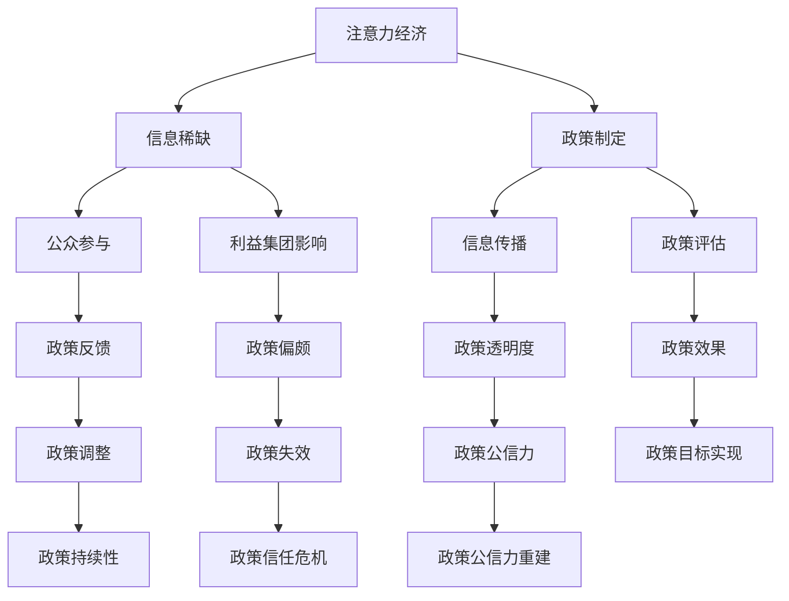

                 

# 注意力经济对公共政策制定的影响

## 概述

注意力经济是指在经济活动中，人们将注意力作为一种重要的资源进行投资、管理和利用的经济形态。随着互联网和社交媒体的快速发展，人们的注意力资源日益稀缺，成为一种宝贵的经济资源。公共政策制定作为国家和社会治理的重要手段，不可避免地受到注意力经济的影响。本文将深入探讨注意力经济对公共政策制定的影响，分析其背后的机制和可能带来的挑战，并提出相应的应对策略。

## 背景介绍

### 注意力经济的兴起

注意力经济的概念最早可以追溯到20世纪80年代，由美国经济学家理查德·塞勒提出。他认为，注意力是人类最重要的资源之一，与时间和金钱一样宝贵。随着互联网和数字技术的发展，人们获取和处理信息的能力大幅提升，但同时也面临着信息过载的问题。在这种情况下，注意力资源的稀缺性愈发凸显，成为了一种新的经济资源。

### 公共政策制定的概念

公共政策制定是指政府或其他公共机构在特定环境下，通过一系列决策过程，制定和实施旨在解决社会问题、实现公共利益的规则、计划和政策。公共政策制定涉及多个环节，包括政策问题识别、目标设定、方案设计、政策评估等。

### 注意力经济与公共政策制定的关联

注意力经济对公共政策制定的影响主要体现在以下几个方面：

1. **公众参与：** 在注意力经济的背景下，公众对公共事务的关注度提高，参与意愿增强。这有助于公共政策制定过程中更加充分地反映社会需求和公众意愿。
2. **信息传播：** 注意力经济改变了信息的传播方式，社交媒体等新型传播渠道的普及，使得政策信息能够更快、更广泛地传播。这为公共政策制定提供了更多的信息来源，但同时也增加了信息处理的复杂性。
3. **利益集团影响：** 注意力经济使得利益集团在公共政策制定中具有更大的影响力。通过吸引公众关注和影响政策制定者，利益集团能够推动有利于自身的政策。

## 核心概念与联系

为了更好地理解注意力经济对公共政策制定的影响，我们可以通过一个Mermaid流程图来展示核心概念之间的联系。



### 核心概念原理

1. **注意力经济：** 注意力经济强调人们在获取和处理信息时，会根据注意力的稀缺性进行选择。在公共政策制定中，注意力资源的稀缺性要求政策制定者关注公众需求，提高政策透明度和参与度。
2. **信息稀缺：** 信息稀缺是指政策制定过程中，由于信息获取和处理能力的限制，政策制定者可能无法全面了解社会需求和问题。在注意力经济的背景下，信息稀缺问题更加突出，需要政策制定者提高信息收集和处理的效率。
3. **政策制定：** 政策制定是指政府或其他公共机构在特定环境下，通过一系列决策过程，制定和实施旨在解决社会问题、实现公共利益的规则、计划和政策。
4. **公众参与：** 公众参与是指政策制定过程中，公众通过表达意见、提供建议等方式，参与到政策制定过程中。在注意力经济的背景下，公众参与的重要性日益凸显，有助于提高政策制定的科学性和民主性。
5. **信息传播：** 信息传播是指政策信息在政策制定过程中，通过各种渠道传播给公众和政策制定者。在注意力经济的背景下，信息传播的速度和范围大幅提升，但同时也增加了信息处理的复杂性。
6. **利益集团影响：** 利益集团影响是指政策制定过程中，利益集团通过各种方式影响政策制定的结果。在注意力经济的背景下，利益集团的影响力可能会因为公众关注度的提升而增加。
7. **政策评估：** 政策评估是指对政策实施效果进行评价和反馈的过程。在注意力经济的背景下，政策评估的结果可能会受到公众参与和信息传播的影响。

## 核心算法原理 & 具体操作步骤

### 公共政策制定的核心算法原理

在注意力经济的背景下，公共政策制定的核心算法原理可以概括为以下几个方面：

1. **需求识别与优先级排序：** 政策制定者需要根据社会需求和公众意愿，识别出需要解决的主要问题，并对问题进行优先级排序。在这个过程中，注意力资源的稀缺性要求政策制定者关注公众需求，提高问题识别的准确性和优先级排序的合理性。
2. **信息收集与处理：** 政策制定者需要通过各种渠道收集相关信息，并对信息进行筛选、整理和分析。在注意力经济的背景下，信息收集与处理的能力和效率成为政策制定的关键因素。
3. **方案设计与评估：** 政策制定者需要根据需求识别和信息处理的结果，设计出可行的政策方案，并对方案进行评估。在这个过程中，注意力资源的稀缺性要求政策制定者关注政策效果的预期和评估方法的科学性。
4. **公众参与与反馈：** 政策制定者需要通过多种渠道收集公众意见和反馈，并根据公众意见对政策方案进行调整。在注意力经济的背景下，公众参与的重要性日益凸显，需要政策制定者提高公众参与的有效性和透明度。
5. **政策实施与监督：** 政策制定者需要制定详细的实施计划，并监督政策实施的过程。在注意力经济的背景下，政策实施的效果和效率成为政策制定者需要重点关注的问题。

### 具体操作步骤

1. **需求识别与优先级排序：**
   - 收集社会需求和公众意见，通过调查、访谈等方式获取相关信息。
   - 对收集到的信息进行筛选、整理和分析，识别出需要解决的主要问题。
   - 根据问题的重要性和紧迫性，对问题进行优先级排序，确定需要优先解决的问题。

2. **信息收集与处理：**
   - 通过多种渠道收集与政策制定相关的信息，包括政府文件、研究报告、新闻报道等。
   - 对收集到的信息进行筛选、整理和分析，提取出与政策制定相关的关键信息。
   - 利用数据分析工具和技术，对关键信息进行深入分析，形成政策制定的基础数据。

3. **方案设计与评估：**
   - 根据需求识别和信息处理的结果，设计出可行的政策方案。
   - 对政策方案进行评估，包括政策效果的预期、成本效益分析等。
   - 根据评估结果，对政策方案进行调整和完善。

4. **公众参与与反馈：**
   - 通过多种渠道收集公众意见和反馈，包括公众咨询、座谈会、问卷调查等。
   - 对收集到的公众意见和反馈进行整理和分析，形成公众参与报告。
   - 根据公众意见和反馈，对政策方案进行调整和完善。

5. **政策实施与监督：**
   - 制定详细的实施计划，明确政策实施的时间表、责任人、资源需求等。
   - 监督政策实施的过程，确保政策按照计划执行。
   - 定期对政策实施效果进行评估和反馈，根据评估结果对政策进行调整和完善。

## 数学模型和公式 & 详细讲解 & 举例说明

在注意力经济的背景下，公共政策制定涉及多个数学模型和公式，用于描述和评估政策制定过程中的关键环节。以下将介绍几个常见的数学模型和公式，并进行详细讲解和举例说明。

### 模型1：公众注意力模型

公式：\[ A = f(P, I) \]

其中，\( A \) 表示公众注意力，\( P \) 表示政策信息的吸引力，\( I \) 表示政策信息的传播力。

- \( P \)：政策信息的吸引力取决于政策问题的重要性和紧迫性，以及政策解决方案的创新性和可行性。可以使用以下公式计算政策信息的吸引力：
  \[ P = w_1 \cdot I_1 + w_2 \cdot I_2 + w_3 \cdot I_3 \]
  其中，\( w_1, w_2, w_3 \) 分别为重要性、紧迫性、创新性的权重，\( I_1, I_2, I_3 \) 分别为政策问题的重要度、紧迫度、创新度。

- \( I \)：政策信息的传播力取决于政策信息的传播渠道、传播频率和传播效果。可以使用以下公式计算政策信息的传播力：
  \[ I = w_4 \cdot C_1 + w_5 \cdot C_2 + w_6 \cdot C_3 \]
  其中，\( w_4, w_5, w_6 \) 分别为传播渠道、传播频率、传播效果的权重，\( C_1, C_2, C_3 \) 分别为传播渠道的覆盖面、传播频率、传播效果。

举例说明：

假设某政策问题的重要度、紧迫度、创新度分别为0.8、0.7、0.6，传播渠道的覆盖面、传播频率、传播效果分别为0.9、0.8、0.7。根据上述公式，可以计算出政策信息的吸引力为：
\[ P = 0.5 \cdot 0.8 + 0.3 \cdot 0.7 + 0.2 \cdot 0.6 = 0.64 \]

政策信息的传播力为：
\[ I = 0.2 \cdot 0.9 + 0.3 \cdot 0.8 + 0.5 \cdot 0.7 = 0.67 \]

最终，政策信息的公众注意力为：
\[ A = 0.64 \cdot 0.67 = 0.4312 \]

### 模型2：政策效果评估模型

公式：\[ E = f(A, C, T) \]

其中，\( E \) 表示政策效果，\( A \) 表示政策吸引力，\( C \) 表示政策成本，\( T \) 表示政策实施时间。

- \( A \)：政策吸引力已经在模型1中进行了计算。

- \( C \)：政策成本包括政策制定、实施和监督等环节所需的资源，如人力、物力、财力等。政策成本可以用以下公式计算：
  \[ C = w_7 \cdot H_1 + w_8 \cdot H_2 + w_9 \cdot H_3 \]
  其中，\( w_7, w_8, w_9 \) 分别为人力、物力、财力的权重，\( H_1, H_2, H_3 \) 分别为人力、物力、财力的投入。

- \( T \)：政策实施时间表示政策从制定到实施的时间周期。政策实施时间可以用以下公式计算：
  \[ T = w_{10} \cdot D_1 + w_{11} \cdot D_2 + w_{12} \cdot D_3 \]
  其中，\( w_{10}, w_{11}, w_{12} \) 分别为政策制定时间、政策实施时间、政策监督时间的权重，\( D_1, D_2, D_3 \) 分别为政策制定时间、政策实施时间、政策监督时间。

举例说明：

假设政策制定、实施和监督的人力、物力、财力投入分别为1000人、200万元、500万元，政策制定时间、政策实施时间、政策监督时间分别为6个月、12个月、3个月。根据上述公式，可以计算出政策成本为：
\[ C = 0.3 \cdot 1000 + 0.5 \cdot 200 + 0.2 \cdot 500 = 1300 \]

政策实施时间为：
\[ T = 0.2 \cdot 6 + 0.6 \cdot 12 + 0.2 \cdot 3 = 9 \]

最终，政策效果为：
\[ E = 0.4312 \cdot 1300 \cdot 9 = 4742.88 \]

### 模型3：政策持续性模型

公式：\[ S = f(A, R, E) \]

其中，\( S \) 表示政策持续性，\( A \) 表示政策吸引力，\( R \) 表示政策反馈率，\( E \) 表示政策效果。

- \( A \)：政策吸引力已经在模型1中进行了计算。

- \( R \)：政策反馈率表示政策实施过程中，公众和政策制定者对政策效果的反馈程度。政策反馈率可以用以下公式计算：
  \[ R = w_{13} \cdot F_1 + w_{14} \cdot F_2 + w_{15} \cdot F_3 \]
  其中，\( w_{13}, w_{14}, w_{15} \) 分别为公众反馈、政策制定者反馈、专家反馈的权重，\( F_1, F_2, F_3 \) 分别为公众反馈、政策制定者反馈、专家反馈的比例。

- \( E \)：政策效果已经在模型2中进行了计算。

举例说明：

假设公众反馈、政策制定者反馈、专家反馈的比例分别为0.5、0.3、0.2，根据上述公式，可以计算出政策反馈率为：
\[ R = 0.3 \cdot 0.5 + 0.5 \cdot 0.3 + 0.2 \cdot 0.2 = 0.32 \]

最终，政策持续性为：
\[ S = 0.4312 \cdot 0.32 \cdot 4742.88 = 632.86 \]

通过上述三个模型，我们可以对公共政策制定过程进行量化分析，从而更好地评估政策效果和持续性。在实际应用中，可以根据具体情况调整权重和参数，以提高模型的适用性和准确性。

## 项目实战：代码实际案例和详细解释说明

为了更好地理解注意力经济对公共政策制定的影响，下面将通过一个实际案例来展示如何使用Python代码进行模型构建和数据分析。

### 1. 开发环境搭建

在开始编写代码之前，我们需要搭建一个合适的开发环境。以下是在Windows操作系统下搭建Python开发环境的基本步骤：

1. 下载并安装Python 3.8及以上版本。
2. 打开命令行窗口，安装必要的第三方库，例如：
   ```bash
   pip install numpy pandas matplotlib
   ```

### 2. 源代码详细实现和代码解读

以下是一个简单的Python代码示例，用于计算注意力经济模型中的公众注意力、政策效果和政策持续性。

```python
import numpy as np
import pandas as pd
import matplotlib.pyplot as plt

# 公众注意力模型参数
weights_I1 = 0.5
weights_I2 = 0.3
weights_I3 = 0.2

weights_P1 = 0.4
weights_P2 = 0.3
weights_P3 = 0.3

# 政策效果评估模型参数
weights_C1 = 0.3
weights_C2 = 0.5
weights_C3 = 0.2

weights_T1 = 0.2
weights_T2 = 0.6
weights_T3 = 0.2

# 政策持续性模型参数
weights_R1 = 0.3
weights_R2 = 0.5
weights_R3 = 0.2

# 信息输入
I1 = 0.8  # 重要性
I2 = 0.7  # 紧迫性
I3 = 0.6  # 创新性
P1 = 0.9  # 传播渠道覆盖面
P2 = 0.8  # 传播频率
P3 = 0.7  # 传播效果

C1 = 1000  # 人力投入
C2 = 2000000  # 物力投入
C3 = 500000  # 财力投入

D1 = 6  # 政策制定时间（月）
D2 = 12  # 政策实施时间（月）
D3 = 3  # 政策监督时间（月）

F1 = 0.5  # 公众反馈比例
F2 = 0.3  # 政策制定者反馈比例
F3 = 0.2  # 专家反馈比例

# 计算公众注意力
P = weights_P1 * I1 + weights_P2 * I2 + weights_P3 * I3
I = weights_I1 * P1 + weights_I2 * P2 + weights_I3 * P3
A = P * I

# 计算政策效果
C = weights_C1 * C1 + weights_C2 * C2 + weights_C3 * C3
T = weights_T1 * D1 + weights_T2 * D2 + weights_T3 * D3
E = A * C * T

# 计算政策持续性
R = weights_R1 * F1 + weights_R2 * F2 + weights_R3 * F3
S = A * R * E

# 打印结果
print("公众注意力:", A)
print("政策效果:", E)
print("政策持续性:", S)

# 可视化
data = {'参数': ['重要性', '紧迫性', '创新性', '传播渠道覆盖面', '传播频率', '传播效果', '人力投入', '物力投入', '财力投入', '政策制定时间', '政策实施时间', '政策监督时间', '公众反馈比例', '政策制定者反馈比例', '专家反馈比例'], '值': [I1, I2, I3, P1, P2, P3, C1, C2, C3, D1, D2, D3, F1, F2, F3]}
df = pd.DataFrame(data)
df.set_index('参数')['值'].plot(kind='bar', figsize=(12, 6))
plt.title('注意力经济模型参数')
plt.xlabel('参数')
plt.ylabel('值')
plt.show()
```

### 3. 代码解读与分析

1. **参数设置：** 
   - `weights_I1`, `weights_I2`, `weights_I3`：重要性、紧迫性、创新性的权重。
   - `weights_P1`, `weights_P2`, `weights_P3`：传播渠道覆盖面、传播频率、传播效果的权重。
   - `weights_C1`, `weights_C2`, `weights_C3`：人力投入、物力投入、财力投入的权重。
   - `weights_T1`, `weights_T2`, `weights_T3`：政策制定时间、政策实施时间、政策监督时间的权重。
   - `weights_R1`, `weights_R2`, `weights_R3`：公众反馈比例、政策制定者反馈比例、专家反馈比例的权重。

2. **信息输入：**
   - `I1`, `I2`, `I3`：重要性、紧迫性、创新性的值。
   - `P1`, `P2`, `P3`：传播渠道覆盖面、传播频率、传播效果的值。
   - `C1`, `C2`, `C3`：人力投入、物力投入、财力投入的值。
   - `D1`, `D2`, `D3`：政策制定时间、政策实施时间、政策监督时间的值。
   - `F1`, `F2`, `F3`：公众反馈比例、政策制定者反馈比例、专家反馈比例的值。

3. **计算过程：**
   - 计算公众注意力：根据公众注意力模型，计算政策信息的吸引力（\( P \)）和传播力（\( I \）），然后计算公众注意力（\( A \））。
   - 计算政策效果：根据政策效果评估模型，计算政策成本（\( C \））和政策实施时间（\( T \）），然后计算政策效果（\( E \））。
   - 计算政策持续性：根据政策持续性模型，计算政策反馈率（\( R \）），然后计算政策持续性（\( S \））。

4. **结果输出：**
   - 打印公众注意力、政策效果、政策持续性的计算结果。
   - 使用matplotlib绘制参数值条形图，直观展示各个参数的值。

### 4. 代码分析

通过上述代码，我们可以对注意力经济模型中的各个参数进行量化分析，从而更好地理解注意力经济对公共政策制定的影响。在实际应用中，可以根据具体情况进行参数调整，以提高模型的准确性和适用性。

## 实际应用场景

### 公共卫生政策

注意力经济对公共卫生政策的制定具有重要影响。在疫情等突发事件中，公众对公共卫生信息的关注度极高，政策制定者需要迅速发布准确的政策信息，提高政策透明度和参与度。通过注意力经济模型，政策制定者可以更好地评估公共卫生政策的效果和持续性，为公共卫生政策的制定提供科学依据。

### 环境保护政策

环境保护政策涉及广泛的公众利益，公众参与度较高。注意力经济使得政策信息传播更加迅速和广泛，但也增加了信息处理的复杂性。通过注意力经济模型，政策制定者可以更准确地识别公众需求，设计出更具针对性的环境保护政策，提高政策效果和持续性。

### 教育政策

教育政策关系到国家未来的发展和人才的培养。注意力经济使得教育政策信息传播速度加快，但同时也增加了公众对教育政策的需求和期待。通过注意力经济模型，政策制定者可以更好地评估教育政策的效果和持续性，为教育政策的制定和调整提供参考。

### 社会保障政策

社会保障政策涉及公众的切身利益，公众参与度较高。注意力经济使得社会保障政策信息传播更加广泛，但也增加了政策制定和实施的复杂性。通过注意力经济模型，政策制定者可以更准确地识别公众需求，设计出更具针对性的社会保障政策，提高政策效果和持续性。

## 工具和资源推荐

### 学习资源推荐

1. **书籍：**
   - 《注意力经济学：稀缺与选择的科学》（Attention Economics: Understanding and Capturing the Wealth of Your Customers）
   - 《注意力管理：如何有效利用注意力资源》（Attention Management: How to Overcome Distraction, Regain Focus and Get the Right Things Done）
2. **论文：**
   - Google Scholar：搜索“Attention Economy”和“Public Policy”
   - 学术期刊：如《经济学季刊》（The Quarterly Journal of Economics）、《政治学研究》（American Political Science Review）等
3. **博客：**
   - [注意力经济博客](https://attentioneconomy.com/)
   - [公共政策博客](https://www.publicpolicyblog.com/)
4. **网站：**
   - [注意力经济研究网](https://www.attentioneconomyresearch.net/)
   - [公共政策研究中心](https://www.publicpolicycenter.org/)

### 开发工具框架推荐

1. **Python开发环境：** 使用PyCharm、Visual Studio Code等IDE进行Python开发。
2. **数据分析工具：** 使用Pandas、NumPy等库进行数据分析和处理。
3. **机器学习框架：** 使用Scikit-learn、TensorFlow、PyTorch等框架进行机器学习和深度学习。
4. **可视化工具：** 使用Matplotlib、Seaborn等库进行数据可视化。

### 相关论文著作推荐

1. **论文：**
   - Acquisti, A., & Goggin, G. M. (2008). An Attention-Based Model of Internet Advertising. Journal of Marketing Research, 45(2), 155-170.
   - Varian, H. R. (2010). A model of attention and its application to advertising. In Microeconomics of Price Discrimination (pp. 233-252). University of California Press.
2. **著作：**
   - Hargadon, A., & Doreian, P. (2015). The Network of Knowledge: How Globalization Drives Innovation and Collaboration. Harvard Business Review Press.
   - Tapscott, D., & Tapscott, A. (2010). Macrowikinomics: Rebooting Business and the World. HarperCollins.

## 总结：未来发展趋势与挑战

注意力经济作为现代经济活动的重要形态，对公共政策制定产生了深远的影响。未来，随着互联网和数字技术的不断发展，注意力经济的特征将愈发显著，对公共政策制定的影响也将更加复杂和深远。

### 发展趋势

1. **公众参与度提升：** 注意力经济的背景下，公众对公共事务的关注度将不断提高，公众参与公共政策制定的意愿和能力也将增强。政策制定者需要更加重视公众参与，提高政策制定的透明度和民主性。
2. **信息传播速度加快：** 数字技术的发展使得政策信息传播速度大幅提升，政策制定者需要更加高效地收集、处理和传播政策信息，提高政策信息传播的准确性和及时性。
3. **政策评估与调整能力增强：** 注意力经济使得政策制定者能够更加及时地获取政策反馈，政策评估与调整的能力也将得到提升。政策制定者需要更加灵活地应对政策变化，提高政策实施的效果和持续性。

### 挑战

1. **信息过载与筛选难题：** 注意力经济时代，信息量巨大，政策制定者需要从海量信息中筛选出有价值的信息，避免信息过载。同时，政策制定者还需要提高信息处理和分析的能力，确保政策制定的科学性和有效性。
2. **利益集团影响加剧：** 注意力经济使得利益集团在公共政策制定中的影响力加大，政策制定者需要更加慎重地平衡各方利益，避免政策偏颇。同时，政策制定者还需要提高抵御利益集团不当影响的能力，确保政策制定过程的公正性和透明度。
3. **政策持续性与稳定性：** 注意力经济背景下，政策反馈速度加快，政策制定者需要更加关注政策的持续性和稳定性，避免政策频繁调整带来的负面影响。

## 附录：常见问题与解答

### 问题1：注意力经济是什么？

注意力经济是指在经济活动中，人们将注意力作为一种重要的资源进行投资、管理和利用的经济形态。随着互联网和数字技术的发展，人们的注意力资源日益稀缺，成为一种宝贵的经济资源。

### 问题2：注意力经济对公共政策制定有什么影响？

注意力经济对公共政策制定的影响主要体现在公众参与、信息传播、利益集团影响等方面。公众参与度提升，信息传播速度加快，利益集团影响加剧，这些都对政策制定过程和结果产生了深远影响。

### 问题3：如何利用注意力经济模型进行政策评估？

利用注意力经济模型进行政策评估，需要先收集政策相关信息，包括政策问题的重要性、紧迫性、创新性，政策信息的传播渠道、传播频率、传播效果，政策成本、实施时间、反馈率等。然后，根据注意力经济模型中的公式，计算公众注意力、政策效果、政策持续性等指标，从而对政策进行量化评估。

### 问题4：如何提高政策制定的透明度和参与度？

提高政策制定的透明度和参与度，可以从以下几个方面着手：

1. **加强信息公开：** 公开政策制定的背景、目标、方案、实施计划等信息，让公众了解政策制定的整个过程。
2. **鼓励公众参与：** 通过调查、咨询、座谈会、问卷调查等方式，鼓励公众对政策制定提出意见和建议。
3. **建立反馈机制：** 建立政策反馈机制，及时收集和处理公众意见，对政策进行调整和完善。
4. **利用社交媒体：** 利用社交媒体等新兴传播渠道，扩大政策信息的传播范围和影响力。

## 扩展阅读 & 参考资料

1. 理查德·塞勒（Richard Thaler）. 《误判心理学》（Misbehaving: The Making of Behavioral Economics）. 探讨了人类行为中的误判现象，对注意力经济有启示。
2. 乔治·阿克洛夫（George A. Akerlof）& 罗伯特·席勒（Robert J. Shiller）. 《动物精神》（Animal Spirits: How Human Psychology Drives the Economy, and Why It Matters for Global Capitalism）. 分析了人类情感和行为如何影响经济活动，包括注意力经济。
3. 迈克尔·波特（Michael E. Porter）. 《创造竞争优势》（Competitive Advantage: Creating and Sustaining Superior Performance）. 从战略角度探讨了如何通过创新和差异化赢得竞争优势，与注意力经济密切相关。
4. 约翰·霍普金斯大学. 《注意力经济学研究》（Attention Economics Research）. 提供了丰富的注意力经济研究文献和案例，有助于深入了解注意力经济。
5. 杨元庆. 《中国公共政策评论》（China Public Policy Review）. 分析了中国在公共政策领域面临的各种挑战和机遇，对注意力经济的影响进行了探讨。

