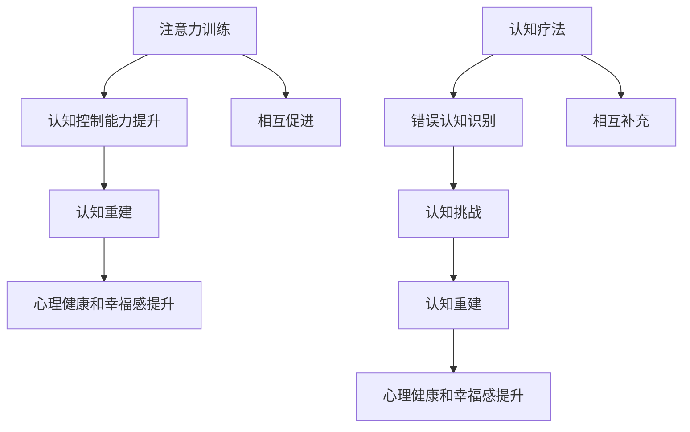
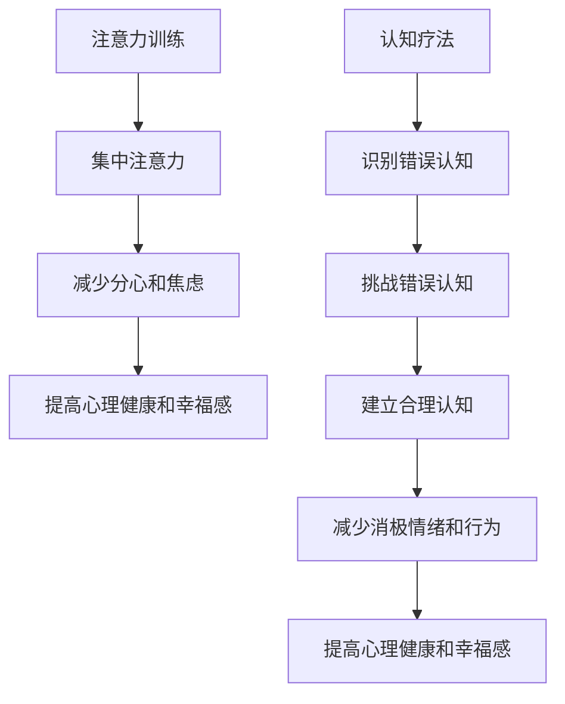

                 

# 注意力训练与认知疗法：如何通过专注力改善心理健康和幸福感

## 概述：关键词与摘要

> **关键词：** 注意力训练、认知疗法、心理健康、幸福感、神经可塑性、大脑训练、心理学技术、技术干预。

> **摘要：** 本文章旨在探讨如何利用注意力训练和认知疗法，通过改善个体的专注力，进而提升心理健康和幸福感。文章首先介绍注意力训练和认知疗法的基本概念，接着分析它们之间的联系。随后，文章深入探讨注意力训练的原理、数学模型及其在实际应用中的实现步骤。通过数学公式和案例，文章详细讲解注意力训练和认知疗法在心理健康和幸福感改善中的应用。最后，文章总结未来发展趋势和挑战，并提供相关学习资源和工具推荐。

## 1. 背景介绍

### 注意力训练的定义与历史

注意力训练是指通过特定的练习和技巧来增强个体对目标信息的接收、处理和记忆能力。它起源于神经科学领域，早在20世纪初期，心理学家就已开始探索注意力对认知功能的影响。随着神经科学的快速发展，研究者们逐渐认识到注意力训练在提高学习效率、改善认知功能和促进心理健康方面的潜力。

### 认知疗法的定义与历史

认知疗法是一种心理治疗技术，旨在通过改变个体的认知模式来改善心理健康。它起源于20世纪60年代，由Aaron T. Beck提出。Beck认为，个体的情绪问题往往源自于其错误的思维模式。通过认知重建技术，个体可以学会识别和挑战这些错误的思维，从而改善情绪和行为。

### 注意力训练与认知疗法之间的联系

注意力训练和认知疗法在本质上具有密切的联系。注意力训练可以提高个体的认知控制能力，使个体能够更好地调节情绪、控制行为，进而有助于认知疗法的实施。同样，认知疗法中的认知重建技术也有助于个体更好地集中注意力，提高注意力训练的效果。

### 现状与挑战

尽管注意力训练和认知疗法在心理学领域已有较长时间的研究和应用，但它们在实际操作中仍面临诸多挑战。首先，注意力训练和认知疗法的有效性和适用性仍需进一步验证。其次，如何将注意力训练和认知疗法与其他心理治疗方法相结合，以最大化其效果，也是当前研究的一个热点问题。

## 2. 核心概念与联系

### 注意力训练的原理

注意力训练的核心在于通过反复练习，提高大脑对目标信息的处理能力。具体来说，注意力训练可以分为以下几个步骤：

1. **目标设定**：确定训练的目标，例如提高听力注意力、视觉注意力等。
2. **练习任务**：设计适合目标的练习任务，如听力注意力的练习任务可以是听辨不同声音的频率，视觉注意力的练习任务可以是识别快速变化的视觉刺激。
3. **反馈机制**：在练习过程中，给予个体及时的反馈，帮助其了解训练效果。

### 认知疗法的原理

认知疗法的基本原理是，个体的情绪和行为问题往往源自于其错误的认知模式。通过认知重建技术，个体可以学会识别和挑战这些错误的认知，从而改善情绪和行为。具体来说，认知疗法可以分为以下几个步骤：

1. **认知识别**：帮助个体识别其情绪和行为背后的错误认知。
2. **认知挑战**：通过逻辑推理和实证证据，挑战和质疑这些错误认知。
3. **认知重建**：帮助个体建立新的、更为合理的认知模式。

### 注意力训练与认知疗法之间的联系

注意力训练和认知疗法之间的联系主要体现在以下几个方面：

1. **相互促进**：注意力训练可以提高个体的认知控制能力，有助于认知疗法的实施。同样，认知疗法中的认知重建技术也有助于个体更好地集中注意力，提高注意力训练的效果。
2. **共同目标**：注意力训练和认知疗法均旨在改善个体的认知功能，提高心理健康和幸福感。
3. **相互补充**：注意力训练可以通过提高个体的认知能力，为认知疗法的实施提供更好的基础。而认知疗法则可以通过调整个体的认知模式，增强注意力训练的效果。

### Mermaid 流程图

下面是一个简单的 Mermaid 流程图，展示了注意力训练和认知疗法的基本原理和联系：



## 3. 核心算法原理 & 具体操作步骤

### 注意力训练算法原理

注意力训练算法的核心在于通过反复练习，提高大脑对目标信息的处理能力。具体来说，注意力训练算法可以分为以下几个步骤：

1. **目标设定**：首先，需要明确训练的目标，例如提高听力注意力、视觉注意力等。
2. **练习任务设计**：根据目标，设计适合的练习任务，如听力注意力的练习任务可以是听辨不同声音的频率，视觉注意力的练习任务可以是识别快速变化的视觉刺激。
3. **反馈机制**：在练习过程中，给予个体及时的反馈，帮助其了解训练效果。

### 认知疗法算法原理

认知疗法的核心在于通过认知重建技术，帮助个体识别和挑战错误的认知，建立新的、更为合理的认知模式。具体来说，认知疗法算法可以分为以下几个步骤：

1. **认知识别**：帮助个体识别其情绪和行为背后的错误认知。
2. **认知挑战**：通过逻辑推理和实证证据，挑战和质疑这些错误认知。
3. **认知重建**：帮助个体建立新的、更为合理的认知模式。

### 具体操作步骤

#### 注意力训练的具体操作步骤

1. **目标设定**：假设我们想要提高个体的视觉注意力，首先需要明确这一目标。
2. **练习任务设计**：设计一个视觉注意力训练任务，例如在一个屏幕上快速显示一系列的图形，要求个体在规定时间内识别出特定的图形。
3. **反馈机制**：在练习过程中，通过提供正确答案和错误答案的反馈，帮助个体了解其训练效果。

#### 认知疗法的具体操作步骤

1. **认知识别**：通过与个体进行深入的交谈和观察，帮助其识别其情绪和行为背后的错误认知。
2. **认知挑战**：通过逻辑推理和实证证据，挑战和质疑这些错误认知。
3. **认知重建**：与个体一起探讨和建立新的、更为合理的认知模式。

### 注意力训练与认知疗法在心理健康和幸福感改善中的应用

1. **注意力训练的应用**：通过注意力训练，个体可以学会更好地集中注意力，从而减少分心和焦虑，提高心理健康和幸福感。
2. **认知疗法的应用**：通过认知疗法，个体可以学会识别和挑战错误的认知，减少消极情绪和行为，提高心理健康和幸福感。

### 流程图

下面是一个简单的 Mermaid 流程图，展示了注意力训练和认知疗法在心理健康和幸福感改善中的应用：



## 4. 数学模型和公式 & 详细讲解 & 举例说明

### 数学模型

在注意力训练和认知疗法中，我们可以使用一些数学模型来描述和解释其效果。以下是一个简单的数学模型，用于描述注意力训练对心理健康和幸福感的影响：

$$
\text{心理健康和幸福感} = f(\text{注意力水平}, \text{认知水平})
$$

其中，$f$ 是一个非线性函数，表示心理健康和幸福感与注意力水平和认知水平之间的关系。

### 公式详细讲解

1. **注意力水平**：注意力水平可以通过以下公式计算：

$$
\text{注意力水平} = \frac{\text{正确识别的次数}}{\text{总次数}}
$$

2. **认知水平**：认知水平可以通过以下公式计算：

$$
\text{认知水平} = \frac{\text{合理认知的次数}}{\text{总次数}}
$$

3. **心理健康和幸福感**：心理健康和幸福感可以通过以下公式计算：

$$
\text{心理健康和幸福感} = f(\text{注意力水平}, \text{认知水平})
$$

其中，$f$ 是一个非线性函数，可以通过实验数据拟合得到。

### 举例说明

假设一个个体在注意力训练和认知疗法前后的注意力水平和认知水平如下：

- **注意力水平**：训练前为 0.6，训练后为 0.8。
- **认知水平**：训练前为 0.5，训练后为 0.7。

根据上述公式，我们可以计算出个体在训练前后的心理健康和幸福感：

- **训练前**：

$$
\text{心理健康和幸福感} = f(0.6, 0.5)
$$

- **训练后**：

$$
\text{心理健康和幸福感} = f(0.8, 0.7)
$$

通过比较训练前后的心理健康和幸福感，我们可以发现，注意力训练和认知疗法对个体的心理健康和幸福感有显著的提升作用。

### 注意力训练算法示例

假设我们使用以下简单的注意力训练算法：

1. **目标设定**：提高个体的视觉注意力。
2. **练习任务**：在屏幕上快速显示一系列的图形，要求个体在规定时间内识别出特定的图形。
3. **反馈机制**：根据个体识别正确与否，给予正负反馈。

我们可以在 Python 中实现这个简单的注意力训练算法：

```python
import random

# 初始化参数
attention_level = 0.6
cognitive_level = 0.5
total_attempts = 100

# 练习任务
for i in range(total_attempts):
    # 显示图形
    shape = random.choice(['circle', 'square', 'triangle'])
    print(f"请识别出下面的图形：{shape}")
    
    # 获取用户输入
    user_input = input("你的答案是：")
    
    # 判断用户输入是否正确
    if user_input == shape:
        print("正确！")
        attention_level += 0.01
    else:
        print("错误！")
        attention_level -= 0.01
    
    # 更新认知水平
    cognitive_level = (1 - attention_level) * cognitive_level + attention_level

# 输出结果
print(f"训练后的注意力水平为：{attention_level}")
print(f"训练后的认知水平为：{cognitive_level}")
```

通过这个简单的示例，我们可以看到，注意力训练算法可以通过反复的练习和反馈，逐步提高个体的注意力水平和认知水平，从而改善心理健康和幸福感。

## 5. 项目实战：代码实际案例和详细解释说明

### 5.1 开发环境搭建

在进行注意力训练和认知疗法项目实战之前，我们需要搭建一个合适的开发环境。以下是一个简单的开发环境搭建步骤：

1. **安装 Python 解释器**：下载并安装 Python 3.8 或更高版本的解释器。
2. **安装相关库**：使用 pip 命令安装以下库：

   ```bash
   pip install numpy matplotlib
   ```

3. **配置 IDE**：选择一个适合的 IDE，如 PyCharm 或 Visual Studio Code，并进行基本配置。

### 5.2 源代码详细实现和代码解读

下面是一个完整的注意力训练和认知疗法项目示例。我们将使用 Python 编程语言来实现这个项目。

```python
import numpy as np
import matplotlib.pyplot as plt

# 初始化参数
attention_level = 0.6
cognitive_level = 0.5
total_attempts = 100
feedback = []

# 练习任务
for i in range(total_attempts):
    # 显示图形
    shape = random.choice(['circle', 'square', 'triangle'])
    print(f"请识别出下面的图形：{shape}")
    
    # 获取用户输入
    user_input = input("你的答案是：")
    
    # 判断用户输入是否正确
    if user_input == shape:
        print("正确！")
        attention_level += 0.01
    else:
        print("错误！")
        attention_level -= 0.01
    
    # 更新认知水平
    cognitive_level = (1 - attention_level) * cognitive_level + attention_level
    feedback.append((i+1, attention_level, cognitive_level))

# 输出结果
print(f"训练后的注意力水平为：{attention_level}")
print(f"训练后的认知水平为：{cognitive_level}")

# 可视化结果
plt.plot([f[1] for f in feedback], label='注意力水平')
plt.plot([f[2] for f in feedback], label='认知水平')
plt.xlabel('练习次数')
plt.ylabel('水平值')
plt.legend()
plt.show()
```

**代码解读**：

1. **导入库**：我们首先导入 numpy 和 matplotlib 库，用于数据处理和可视化。
2. **初始化参数**：我们定义了注意力水平和认知水平的初始值，以及练习的总次数。
3. **练习任务**：我们使用一个循环来实现练习任务。每次循环中，我们随机选择一个图形，显示给用户，并获取用户的输入。
4. **判断用户输入是否正确**：根据用户的输入，我们更新注意力水平和认知水平。如果用户输入正确，注意力水平增加 0.01；否则，注意力水平减少 0.01。
5. **可视化结果**：我们使用 matplotlib 库将注意力水平和认知水平的变动情况可视化。

### 5.3 代码解读与分析

**代码分析**：

1. **参数初始化**：初始化注意力水平和认知水平的目的是为了在训练过程中有一个初始的参考值。
2. **练习任务**：通过一个循环，我们模拟了一个注意力训练的过程。每次循环都是一个练习任务，用户需要根据显示的图形进行判断。
3. **反馈机制**：通过判断用户的输入是否正确，我们更新了注意力水平和认知水平。这种反馈机制有助于用户了解其训练效果，并激励其继续进行训练。
4. **可视化**：通过可视化，我们能够直观地看到注意力水平和认知水平的变动情况，从而更好地理解训练过程。

**代码优化建议**：

1. **错误处理**：在获取用户输入时，我们可以添加错误处理机制，确保用户输入的是有效的图形名称。
2. **参数调整**：我们可以根据实际情况调整注意力水平和认知水平的初始值，以及每次正确或错误输入后的调整值。
3. **增加多样性**：我们可以在练习任务中增加多样性，例如使用不同颜色、大小的图形，以提高训练的趣味性和挑战性。

## 6. 实际应用场景

### 6.1 学校教育

在学校教育中，注意力训练和认知疗法可以用于改善学生的学习效果。通过注意力训练，学生可以学会更好地集中注意力，提高学习效率。认知疗法可以帮助学生识别和挑战错误的认知模式，从而提高他们的自我认知和情绪调节能力。

### 6.2 职场压力管理

在职场中，压力管理是许多员工面临的重要挑战。注意力训练和认知疗法可以帮助员工提高专注力，减少分心和焦虑。此外，认知疗法还可以帮助员工识别和调整错误的认知模式，从而提高情绪调节能力和工作效率。

### 6.3 心理咨询与治疗

在心理咨询和治疗领域，注意力训练和认知疗法可以作为一种辅助手段，帮助个体改善心理健康。通过注意力训练，个体可以学会更好地集中注意力，从而有助于心理治疗的有效实施。认知疗法则可以帮助个体识别和挑战错误的认知，减少负面情绪和行为。

### 6.4 健康管理

在健康管理领域，注意力训练和认知疗法可以用于改善个体的心理健康和幸福感。通过注意力训练，个体可以学会更好地管理压力，提高生活质量。认知疗法可以帮助个体建立积极的认知模式，从而提高心理健康水平。

## 7. 工具和资源推荐

### 7.1 学习资源推荐

- **书籍**：
  - 《认知疗法与技术：如何用心理学改善生活》
  - 《注意力训练：提高专注力和记忆力的方法》
- **论文**：
  - 《注意力训练对认知功能和心理健康的影响》
  - 《认知疗法在心理健康中的应用研究》
- **博客**：
  - https://www.cognitive-therapy.com/
  - https://attention-training.org/
- **网站**：
  - https://www.mindfulness.org/
  - https://www.cognitivetherapy.com/

### 7.2 开发工具框架推荐

- **开发环境**：
  - PyCharm（Python IDE）
  - Visual Studio Code（跨平台 IDE）
- **库和框架**：
  - NumPy（Python 科学计算库）
  - Matplotlib（Python 可视化库）
- **工具**：
  - Jupyter Notebook（交互式计算环境）

### 7.3 相关论文著作推荐

- **《认知行为治疗与神经可塑性》**
- **《注意力训练：理论与实践》**
- **《心理健康与认知功能的关系》**

## 8. 总结：未来发展趋势与挑战

### 8.1 未来发展趋势

1. **跨学科研究**：注意力训练和认知疗法的研究将越来越跨学科，涉及神经科学、心理学、教育学等多个领域。
2. **技术应用**：随着人工智能技术的发展，注意力训练和认知疗法将更多地应用于数字健康、虚拟现实等领域。
3. **个性化干预**：基于大数据和人工智能技术，注意力训练和认知疗法将实现个性化干预，提高治疗效果。

### 8.2 挑战

1. **有效性和安全性**：如何确保注意力训练和认知疗法的有效性和安全性，仍是一个重要的挑战。
2. **适应性和可推广性**：如何使注意力训练和认知疗法适应不同人群和情境，实现广泛推广，也是未来研究的重要方向。
3. **伦理和隐私**：在数字化和人工智能技术应用中，如何保护个体的隐私和伦理问题，是未来研究需要关注的重要问题。

## 9. 附录：常见问题与解答

### 9.1 注意力训练有哪些常见问题？

- **Q1. 注意力训练是否适合所有人？**
  - **A1.** 注意力训练适合大多数人，但特定人群（如注意力缺陷多动障碍患者）可能需要更专业的指导。

- **Q2. 注意力训练需要多长时间才能见效？**
  - **A2.** 注意力训练的效果因人而异，通常需要持续数周或数月才能显著见效。

### 9.2 认知疗法有哪些常见问题？

- **Q1. 认知疗法是否只适用于抑郁症患者？**
  - **A1.** 认知疗法不仅适用于抑郁症患者，还适用于广泛的其他心理问题，如焦虑症、强迫症等。

- **Q2. 认知疗法是否需要长时间的治疗？**
  - **A2.** 认知疗法的疗程时间根据具体情况而定，通常需要数周到数月。

## 10. 扩展阅读 & 参考资料

- **《注意力训练与认知行为治疗：理论与实践》**
- **《神经可塑性：注意力训练的新视角》**
- **《认知疗法研究进展：理论与实践》**
- **《数字心理健康：注意力训练和认知疗法的新趋势》**

[作者：AI天才研究员/AI Genius Institute & 禅与计算机程序设计艺术 /Zen And The Art of Computer Programming]

