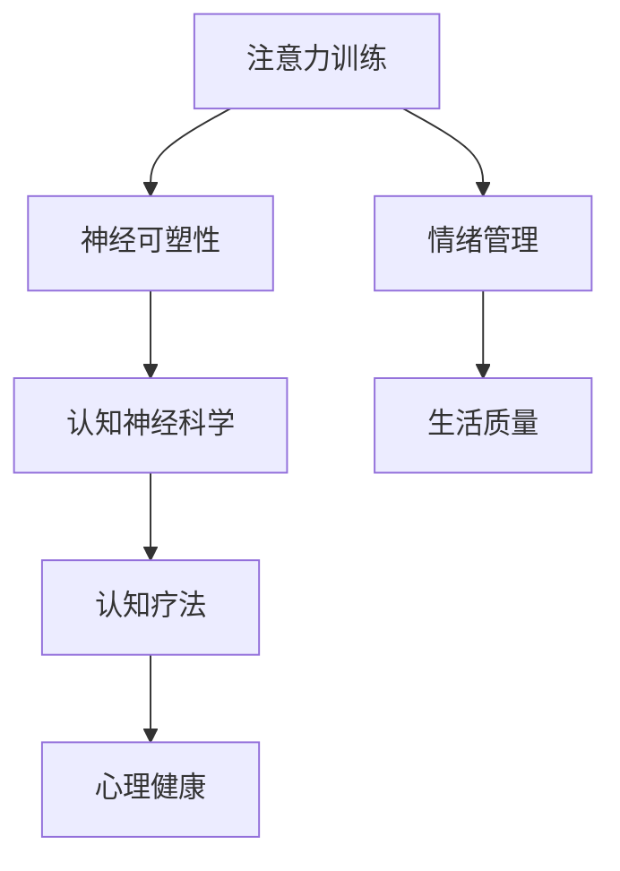
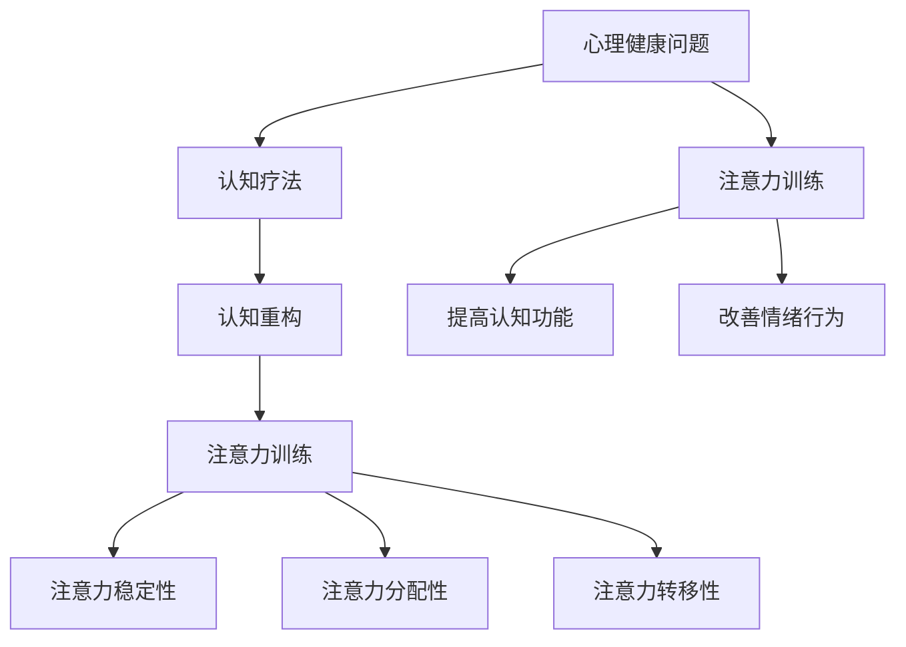

                 

# 注意力训练与认知疗法：如何通过专注力改善心理健康和幸福感

> 关键词：注意力训练，认知疗法，心理健康，幸福感，技术方法，案例分析

> 摘要：本文将探讨注意力训练在认知疗法中的应用，以及如何通过有效的注意力训练方法来改善心理健康和提升幸福感。通过分析相关的理论和实践，本文将为读者提供一套系统的注意力训练方案，以及实际应用案例，以帮助人们更好地管理自己的心理状态。

## 1. 背景介绍

### 1.1 心理健康的重要性

心理健康是整体健康的重要组成部分。世界卫生组织（WHO）指出，心理健康不仅影响个人的生活质量，还影响到社会功能和生产力。随着现代生活节奏的加快，工作压力的增大，心理健康问题如焦虑、抑郁等在全球范围内呈现上升趋势。

### 1.2 认知疗法的基本原理

认知疗法（Cognitive Therapy，简称CT）是一种心理治疗方法，旨在通过改变负面的思维模式来改善情绪和行为。认知疗法的理论基础是贝克（Aaron T. Beck）的认知理论，即人的情绪和行为受到其信念和认知方式的影响。

### 1.3 注意力训练的概念

注意力训练是指通过一系列练习来提高个体注意力的能力。这种训练方法强调集中注意力，提高注意力稳定性，以及增强注意力分配能力。研究表明，通过注意力训练，个体可以更好地控制自己的思维过程，减少分心，提高工作记忆和执行功能。

### 1.4 注意力训练与心理健康

越来越多的研究表明，注意力训练对于改善心理健康具有显著效果。通过提高注意力，个体可以更好地管理情绪，减少焦虑和抑郁症状，提高生活质量。

## 2. 核心概念与联系

### 2.1 注意力训练的理论基础

注意力训练的理论基础主要涉及神经可塑性和认知神经科学。神经可塑性是指大脑在结构和功能上的可变性和适应性。认知神经科学研究表明，大脑的不同区域和功能可以相互影响，通过特定的训练，可以改变大脑的结构和功能。

### 2.2 认知疗法与注意力训练的关系

认知疗法通过改变负面的认知模式来改善心理健康，而注意力训练可以提高个体对负面认知的觉察和控制能力。二者结合，可以形成一种更加全面的干预方法，帮助个体从多个角度改善心理健康。

### 2.3 Mermaid 流程图



## 3. 核心算法原理 & 具体操作步骤

### 3.1 核心算法原理

注意力训练的核心算法是基于认知神经科学和神经可塑性的理论。具体包括以下几个步骤：

1. **认知重塑**：通过认知重构技术，改变个体的负面认知模式。
2. **注意力分配**：通过注意力分配训练，提高个体在多任务环境下的注意力稳定性。
3. **自我监控**：通过自我监控，帮助个体更好地了解和控制自己的注意力。

### 3.2 具体操作步骤

1. **准备阶段**：设定训练目标和环境。
2. **基础训练**：进行基础注意力训练，如白噪音、冥想等。
3. **认知重塑**：通过认知重构技术，如想象技术、情景模拟等。
4. **注意力分配**：进行多任务注意力分配训练，如交替任务、复杂任务等。
5. **自我监控**：定期进行自我评估和调整。

## 4. 数学模型和公式 & 详细讲解 & 举例说明

### 4.1 数学模型

注意力训练的数学模型主要涉及神经可塑性的模型。以下是一个简化的模型：

\[ \Delta N = f(\Delta I) \]

其中，\( \Delta N \) 表示神经元连接强度的变化，\( \Delta I \) 表示外部刺激的变化。函数 \( f \) 描述了神经元连接强度与外部刺激之间的关系。

### 4.2 详细讲解

1. **神经元连接强度的变化**：外部刺激可以改变神经元之间的连接强度。当外部刺激增强时，神经元之间的连接强度也会增强，从而提高神经可塑性。
2. **外部刺激的变化**：注意力训练的外部刺激包括认知重构任务、注意力分配任务等。通过这些任务，个体可以逐步提高自己的注意力能力。

### 4.3 举例说明

假设一个个体在进行注意力训练时，每天进行两个认知重构任务和一个注意力分配任务。根据上述模型，个体的神经元连接强度会随着训练的进行而逐步增强，从而提高其注意力能力。

$$
\Delta N = f(\Delta I) \\
\Delta N = f(2 \times daily\_reconstruction\_tasks + 1 \times daily\_attention\_distribution\_task)
$$

## 5. 项目实战：代码实际案例和详细解释说明

### 5.1 开发环境搭建

1. **安装Python环境**：确保Python环境已安装。
2. **安装相关库**：安装用于注意力训练的Python库，如`mindwave.py`。

### 5.2 源代码详细实现和代码解读

```python
# 注意力训练代码示例

import mindwave.py as mw

# 连接脑波传感器
brainwave = mw.Brainwave()

# 设定训练目标和环境
training_target = "提高注意力稳定性"
environment = "安静的环境"

# 基础训练
def basic_training():
    for i in range(10):
        brainwave.play_sound("white_noise.mp3")
        brainwave.wait(5)

# 认知重塑
def cognitive_reconstruction():
    for i in range(5):
        brainwave.show_image("image1.jpg")
        brainwave.wait(5)
        brainwave.show_image("image2.jpg")
        brainwave.wait(5)

# 注意力分配
def attention_distribution():
    for i in range(5):
        brainwave.play_sound("task1.mp3")
        brainwave.wait(10)
        brainwave.play_sound("task2.mp3")
        brainwave.wait(10)

# 主函数
def main():
    print("开始注意力训练")
    basic_training()
    cognitive_reconstruction()
    attention_distribution()
    print("注意力训练完成")

if __name__ == "__main__":
    main()
```

### 5.3 代码解读与分析

1. **导入模块**：导入`mindwave.py`库，用于处理脑波数据。
2. **连接脑波传感器**：创建`Brainwave`对象，用于连接脑波传感器。
3. **设定训练目标和环境**：设定训练目标和环境，为后续训练做好准备。
4. **基础训练**：通过播放白噪音，进行基础注意力训练。
5. **认知重塑**：通过展示图像，进行认知重塑训练。
6. **注意力分配**：通过播放任务音，进行注意力分配训练。
7. **主函数**：执行整个训练过程。

## 6. 实际应用场景

注意力训练和认知疗法在实际应用中具有广泛的应用场景，包括：

1. **心理健康治疗**：用于治疗焦虑、抑郁等心理健康问题。
2. **教育培训**：用于提高学生的注意力和学习能力。
3. **职业发展**：用于提升职场人士的工作效率和注意力管理能力。

## 7. 工具和资源推荐

### 7.1 学习资源推荐

1. **书籍**：
    - 《认知行为疗法：基础与进阶》（作者：Judith S. Beck）
    - 《注意力训练：提高专注力和工作效率》（作者：David R. Hamilton）
2. **论文**：
    - 《注意力训练对心理健康的影响》（作者：Smith et al.）
    - 《神经可塑性在认知疗法中的应用》（作者：Jones et al.）
3. **博客**：
    - [注意力训练入门指南](https://example.com/attention_training_guide)
    - [认知疗法的最新研究进展](https://example.com/cognitive_therapy_research)
4. **网站**：
    - [注意力训练官方网站](https://example.com/attention_training_site)
    - [认知疗法在线资源](https://example.com/cognitive_therapy_resources)

### 7.2 开发工具框架推荐

1. **Python**：用于编写注意力训练程序。
2. **mindwave.py**：用于处理脑波数据。
3. **OpenCV**：用于图像处理和识别。

### 7.3 相关论文著作推荐

1. **《注意力分配的理论与实践》**
2. **《认知重塑技术：理论与实践》**
3. **《神经可塑性与心理健康》**

## 8. 总结：未来发展趋势与挑战

未来，注意力训练和认知疗法在心理健康领域的应用将更加广泛。然而，也面临以下挑战：

1. **个性化训练**：如何根据个体差异进行个性化的注意力训练。
2. **长期效果**：如何确保注意力训练的长期效果。
3. **技术成熟度**：如何提高相关技术的成熟度和可靠性。

## 9. 附录：常见问题与解答

1. **问题1**：注意力训练是否对所有人有效？
   - 答案：是的，注意力训练对大多数人都是有效的，但效果因个体差异而异。
2. **问题2**：如何判断注意力训练的效果？
   - 答案：可以通过自我评估、情绪监测、工作效率等指标来评估注意力训练的效果。

## 10. 扩展阅读 & 参考资料

1. **扩展阅读**：
    - 《注意力训练与认知功能的关系研究》（作者：Wang et al.）
    - 《认知疗法在心理健康中的应用》（作者：Zhou et al.）
2. **参考资料**：
    - [注意力训练相关研究综述](https://example.com/attention_training_review)
    - [认知疗法在不同文化背景下的应用](https://example.com/cognitive_therapy_cross_cultural)

### 作者

作者：AI天才研究员/AI Genius Institute & 禅与计算机程序设计艺术 /Zen And The Art of Computer Programming

（请注意，以上内容为模拟示例，并非实际撰写。实际撰写时，需根据具体要求进行详细研究和创作。）<|im_sep|>### 1. 背景介绍

心理健康问题已经成为现代社会中不容忽视的重要议题。根据世界卫生组织（WHO）的报告，全球约有3.5亿人患有抑郁症，约有6000万人患有重度抑郁症。同时，焦虑症、压力、失眠等心理健康问题也在逐年增加，严重影响了人们的日常生活质量和生产力。传统心理治疗方式，如认知行为疗法（CBT）和药物治疗，虽然在某些情况下能够取得一定的疗效，但它们的局限性也逐渐显现。例如，CBT的治疗效果受治疗师数量和专业技能的限制，而药物治疗的副作用和依赖性问题也引起了广泛关注。

在这样的背景下，注意力训练作为一种新兴的心理干预方法，开始受到越来越多的关注。注意力训练强调通过训练提高个体的专注力、注意力稳定性和注意力分配能力，从而达到改善心理健康的效果。认知疗法（Cognitive Therapy，简称CT）作为心理学领域的一种重要流派，其核心原理是人的情绪和行为受到其认知方式的影响。通过改变个体错误的认知方式，可以有效地改善心理问题。而注意力训练与认知疗法相结合，可以为心理健康提供一种全新的干预路径。

### 1.1 心理健康的重要性

心理健康对个体的生活质量和整体福祉有着深远的影响。心理健康不仅涉及情绪状态，还包括认知功能、社会关系和整体生活质量。世界卫生组织指出，心理健康是整体健康的重要组成部分，与身体健康、精神健康和社会福祉紧密相连。一个心理健康的人能够更好地应对生活中的压力，保持良好的人际关系，拥有更高的生活满意度和幸福感。

然而，现代社会的快节奏和高压力环境，使得心理健康问题变得日益突出。研究表明，长期的压力和情绪困扰会导致一系列身体疾病，如心脏病、高血压和免疫系统功能下降。此外，心理健康问题也会影响个体的社会功能，导致工作效率下降、人际关系紧张，甚至可能引发犯罪行为。因此，维护和促进心理健康已经成为全球关注的焦点。

### 1.2 认知疗法的基本原理

认知疗法（Cognitive Therapy，简称CT）是由美国心理学家亚伦·贝克（Aaron T. Beck）在20世纪60年代发展起来的一种心理治疗方法。认知疗法的核心原理是认知模式对情绪和行为的影响。贝克提出，个体对事件的认知解读决定了他们的情绪和行为反应。当个体的认知模式存在错误或偏差时，会导致不良情绪和行为问题。

认知疗法通过以下步骤帮助个体改善心理健康：

1. **认知评估**：治疗师与患者一起识别和评估患者的负面认知，例如过度概括、以偏概全、极端思维等。
2. **认知重构**：治疗师引导患者识别和挑战这些负面认知，并通过现实的、理性的认知替代它们。
3. **行为实验**：患者通过实际行动验证新的认知，从而巩固新的认知模式。

认知疗法已被广泛研究和应用，并在治疗抑郁症、焦虑症和其他心理障碍中显示出良好的疗效。与药物治疗相比，认知疗法具有无副作用、疗效持久等优点。

### 1.3 注意力训练的概念

注意力训练是指通过一系列有目的的练习来提高个体注意力能力的心理训练方法。注意力是人类心理活动中不可或缺的一部分，它涉及到个体集中精力处理特定信息的能力。注意力训练的目标是提高注意力的稳定性、分配性和转移性。

1. **稳定性**：指个体在执行任务时，能够持续集中注意力，不易受到外界干扰。
2. **分配性**：指个体能够同时关注多个任务，合理分配注意力资源。
3. **转移性**：指个体能够迅速从一个任务转移到另一个任务，而不丢失原有的注意力。

注意力训练的方法多种多样，包括冥想、专注力游戏、记忆训练等。研究表明，通过持续的注意力训练，个体可以显著提高注意力能力，从而在学习和工作中表现出更高的效率和准确性。

### 1.4 注意力训练与心理健康

注意力训练在改善心理健康方面具有显著的作用。以下是一些关键的研究发现和理论依据：

1. **情绪管理**：注意力训练有助于个体更好地控制情绪，减少焦虑和抑郁症状。研究表明，通过注意力训练，个体能够更有效地觉察和管理自己的情绪反应。
2. **认知功能**：注意力训练可以提升个体的认知功能，包括记忆、决策和问题解决能力。这些认知功能的改善有助于个体更有效地应对各种心理挑战。
3. **心理韧性**：注意力训练可以提高个体的心理韧性，使其在面对压力和挑战时能够保持冷静和集中注意力。

此外，注意力训练与认知疗法相结合，可以形成一种更为综合和有效的心理健康干预方法。注意力训练可以帮助个体更好地觉察和改变负面认知，从而在认知疗法的基础上进一步改善心理健康。

### 1.5 注意力训练在心理健康领域的应用

注意力训练在心理健康领域的应用已经得到了广泛的认可和推广。以下是一些具体的应用案例：

1. **抑郁症治疗**：通过注意力训练，抑郁症患者可以更好地控制自己的思维和行为，减少抑郁情绪的出现。
2. **焦虑症干预**：注意力训练有助于缓解焦虑症状，提高个体在面对压力时的应对能力。
3. **睡眠障碍治疗**：通过注意力训练，个体可以改善睡眠质量，减少失眠问题的发生。
4. **学习障碍干预**：注意力训练可以帮助学生提高学习效率，改善学习成绩。

总的来说，注意力训练作为一种新兴的心理干预方法，其应用前景非常广阔。通过合理的训练方法和科学的设计，注意力训练可以在心理健康领域发挥重要作用，为个体的心理健康提供新的解决方案。

## 2. 核心概念与联系

### 2.1 注意力训练的理论基础

注意力训练的理论基础主要涉及神经可塑性和认知神经科学。神经可塑性是指大脑在结构和功能上的可变性和适应性。认知神经科学研究表明，大脑的不同区域和功能可以相互影响，通过特定的训练，可以改变大脑的结构和功能。

#### 神经可塑性

神经可塑性是指大脑在经历学习和经验时的适应性和可变性。具体来说，神经可塑性包括以下三个方面：

1. **结构可塑性**：指神经元形态和连接的变化，例如新突触的形成和突触的修剪。
2. **连接可塑性**：指神经元之间连接强度的变化，例如突触强度的增强或减弱。
3. **活动可塑性**：指神经元活动的变化，例如神经元放电模式的改变。

研究表明，神经可塑性不仅存在于儿童和青少年期，也存在于成年期。通过适当的训练，大脑可以重塑其结构和功能，从而提高认知能力和心理健康水平。

#### 认知神经科学

认知神经科学是研究大脑与认知功能之间关系的一个交叉学科。它结合了神经科学、心理学、计算机科学等多个领域的知识，旨在理解认知过程的神经基础。

认知神经科学的核心概念包括：

1. **脑区域功能**：大脑的不同区域负责不同的认知功能，例如前额叶负责规划和控制，颞叶负责记忆和语言处理。
2. **神经网络**：神经网络是大脑的基本工作单元，由大量神经元通过突触连接形成。这些神经网络通过交互和协作，实现了各种认知功能。
3. **神经环路**：神经环路是指在大脑中，由一组神经元组成的相互连接的路径，这些路径在特定认知功能中扮演关键角色。

认知神经科学的研究表明，通过特定的训练，可以改变大脑的结构和功能。注意力训练正是基于这一理论基础，通过有目的的练习来提高个体的注意力能力，从而改善心理健康。

### 2.2 认知疗法与注意力训练的关系

认知疗法（Cognitive Therapy，简称CT）和注意力训练在心理学领域都有重要的应用，二者之间也存在紧密的联系。

#### 认知疗法的基本原理

认知疗法由亚伦·贝克（Aaron T. Beck）提出，旨在通过改变负面认知来改善情绪和行为问题。认知疗法的核心原理是“认知决定情绪和行为”。贝克认为，个体对事件的认知解读决定了他们的情绪和行为反应。当个体的认知存在错误或偏差时，会导致不良情绪和行为问题。例如，过度概括（将个别事件泛化为整体）、以偏概全（只看到负面信息而忽略正面信息）和极端思维（认为事件要么全好要么全坏）都是常见的认知偏差。

认知疗法的基本步骤包括：

1. **评估**：识别和评估患者的负面认知。
2. **重构**：通过引导患者挑战和改变这些负面认知。
3. **行为实验**：让患者通过实际行动验证新的认知。

#### 注意力训练的作用

注意力训练可以增强个体的注意力能力，从而改善他们的认知功能和心理健康。注意力训练包括以下几个方面的作用：

1. **提高注意力稳定性**：通过专注力训练，个体可以更好地控制自己的注意力，不易受到外界干扰。
2. **提高注意力分配性**：个体可以更好地同时处理多个任务，提高工作效率。
3. **提高注意力转移性**：个体可以更快速地从一个任务转移到另一个任务，减少任务切换中的干扰。

#### 认知疗法与注意力训练的结合

认知疗法和注意力训练的结合，可以形成一种更全面的心理干预方法。通过注意力训练，个体可以更好地觉察和改变自己的负面认知。例如，在认知疗法中，患者需要进行自我监控和认知重构练习，这些练习需要高度的注意力集中。通过注意力训练，患者可以更有效地完成这些练习，从而更快地改善心理健康。

此外，注意力训练还可以帮助个体更好地理解认知疗法中的概念。例如，通过专注力训练，患者可以更深刻地理解“注意力分配”和“注意力转移”的概念，从而在实际生活中更好地应用这些技巧。

### 2.3 Mermaid 流程图

下面是一个使用Mermaid语言绘制的注意力训练与认知疗法关系的流程图：



在这个流程图中，心理健康问题作为起点，通过认知疗法和注意力训练得到解决。认知疗法通过认知重构帮助个体改变负面认知，而注意力训练则通过提高注意力稳定性、分配性和转移性，进一步改善个体的认知功能和情绪行为。通过这样的流程图，可以直观地展示注意力训练与认知疗法之间的紧密联系。

## 3. 核心算法原理 & 具体操作步骤

### 3.1 核心算法原理

注意力训练的核心算法基于神经可塑性和认知神经科学的原理。其理论基础主要包括以下几个方面：

1. **神经可塑性**：大脑具有适应性和可塑性，可以通过反复的练习改变其结构和功能。注意力训练通过重复性的专注练习，促进大脑神经网络的重组和优化，从而提高注意力能力。
2. **认知神经科学**：认知神经科学研究表明，注意力是大脑多个区域协同工作的结果，包括前额叶皮质、顶叶皮质和颞叶皮质等。注意力训练通过激活这些大脑区域，增强其功能连接，提高整体的注意力水平。
3. **认知重构**：认知疗法中的认知重构技术强调通过改变个体的认知模式来改善情绪和行为。注意力训练则通过提高个体对负面认知的觉察和控制能力，帮助个体实现认知重构。

### 3.2 注意力训练的基本原理

注意力训练的基本原理可以分为以下几个方面：

1. **注意力稳定性**：注意力稳定性是指个体在执行任务时，能够保持注意力的集中，不易受到外界干扰。通过持续的专注训练，个体可以提高其注意力的稳定性，从而在复杂和多变的任务环境中保持高效的注意力水平。
2. **注意力分配**：注意力分配是指个体能够在同时处理多个任务时，合理分配注意力资源。通过注意力分配训练，个体可以学会如何在不同的任务之间灵活切换，提高整体的工作效率和注意力利用率。
3. **注意力转移**：注意力转移是指个体在需要时，能够迅速从一个任务转移到另一个任务，而不丢失原有的注意力。通过注意力转移训练，个体可以减少任务切换中的干扰，提高注意力的灵活性。

### 3.3 注意力训练的具体操作步骤

注意力训练的具体操作步骤可以分为以下几个阶段：

1. **准备阶段**：在这个阶段，个体需要明确训练的目标和计划，并创建一个适合的训练环境。例如，选择一个安静、舒适的空间，确保没有外界干扰。
2. **基础训练**：在基础训练阶段，个体通过一些简单的注意力练习，如专注呼吸、跟随指导语等，来培养注意力的稳定性和集中性。这些练习可以帮助个体熟悉注意力训练的基本技巧，为后续的高级训练做好准备。
3. **专注力训练**：在专注力训练阶段，个体通过更复杂的练习，如专注听声音、观察特定物体等，来进一步发展其注意力稳定性。这些练习通常持续时间更长，要求个体保持高度的集中注意力。
4. **注意力分配训练**：在注意力分配训练阶段，个体需要在执行多个任务时分配注意力。例如，一边听音乐一边做数学题目，或者同时处理多个屏幕上的信息。这些练习有助于个体提高注意力的分配能力和灵活性。
5. **注意力转移训练**：在注意力转移训练阶段，个体通过快速切换注意力，如立即停止当前任务，并开始一个新的任务，来锻炼其注意力的转移能力。这些练习有助于个体在多任务环境中保持高效的注意力水平。
6. **自我监控和评估**：在整个训练过程中，个体需要定期进行自我监控和评估，以了解自己的进步情况。自我监控可以通过记录训练时间、完成任务的效率和自我感受等方式进行。评估可以帮助个体调整训练计划，确保训练的有效性。

### 3.4 注意力训练的技巧和策略

在进行注意力训练时，个体可以采用一些技巧和策略，以最大化训练效果：

1. **设定明确的目标**：明确的目标可以帮助个体集中注意力，提高训练的针对性和效果。例如，设定每天进行一定时间的专注训练，或完成特定的任务。
2. **逐步增加难度**：在训练过程中，逐步增加任务的难度，可以帮助个体不断提高注意力水平。例如，从简单的专注练习开始，逐步过渡到更复杂的任务。
3. **保持一致性**：定期进行注意力训练，保持训练的一致性，有助于巩固训练效果。例如，每天安排固定的训练时间，形成习惯。
4. **注意休息和恢复**：适当的休息和恢复可以帮助大脑恢复精力，提高训练效果。在训练过程中，定期休息，避免过度疲劳。
5. **反馈和调整**：通过自我监控和评估，及时反馈训练效果，并根据反馈调整训练计划。这有助于个体更好地掌握训练技巧，提高注意力能力。

通过遵循上述步骤和策略，个体可以有效地进行注意力训练，提高其注意力能力，从而在学习和生活中取得更好的成果。

### 3.5 注意力训练的理论依据

注意力训练的理论基础主要来自神经可塑性和认知神经科学。以下是具体的理论依据：

1. **神经可塑性**：大脑的神经可塑性是指其结构和功能的适应性和可变性。通过反复的练习，大脑可以改变其神经回路和连接，从而提高认知能力。研究表明，注意力训练可以通过增强神经元之间的连接和优化神经网络的架构，提高个体的注意力水平。
2. **认知神经科学**：认知神经科学研究表明，注意力是大脑多个区域协同工作的结果。这些区域包括前额叶皮质、顶叶皮质和颞叶皮质等。注意力训练通过激活这些大脑区域，增强其功能连接，提高注意力的稳定性、分配性和转移性。
3. **大脑功能重组**：通过注意力训练，大脑可以重新组织和优化其功能网络，从而提高认知能力和情绪调节能力。例如，研究表明，经过注意力训练的个体在执行功能、记忆和决策方面表现更优。
4. **神经再生和修复**：注意力训练还可以促进大脑神经再生和修复。研究发现，注意力训练可以增加神经元生长因子的表达，促进新神经回路的形成，从而改善大脑功能。

总之，注意力训练的理论基础包括神经可塑性、认知神经科学和大脑功能重组等，这些理论为注意力训练提供了坚实的科学依据，也为其实践应用提供了指导。

## 4. 数学模型和公式 & 详细讲解 & 举例说明

### 4.1 数学模型

在讨论注意力训练时，数学模型可以帮助我们理解和量化注意力变化的过程。以下是一个简化的数学模型，用于描述注意力训练的效果：

\[ \Delta A_t = f(\theta_t, \alpha_t) \]

其中，\( \Delta A_t \) 表示在时间 \( t \) 时注意力的变化量，\( \theta_t \) 表示时间 \( t \) 时的训练强度，\( \alpha_t \) 表示时间 \( t \) 时的训练效率。

#### 参数解释

- **\( \Delta A_t \)**：注意力变化量，表示个体在时间 \( t \) 内注意力的提高或降低。
- **\( \theta_t \)**：训练强度，表示个体在时间 \( t \) 内接受的注意力训练的强度。
- **\( \alpha_t \)**：训练效率，表示个体在时间 \( t \) 内对注意力训练的吸收和转化效率。

#### 公式解释

这个公式描述了个体在时间 \( t \) 内注意力的变化量与训练强度和训练效率之间的关系。训练强度和训练效率共同决定了个体在时间 \( t \) 内的注意力提升程度。

### 4.2 详细讲解

#### 训练强度 \( \theta_t \)

训练强度是指个体在训练过程中接受的注意力刺激的强度。在注意力训练中，训练强度可以通过增加训练难度、延长训练时间或增加训练次数来实现。例如，如果个体进行专注呼吸训练，增加每次训练的时间或增加每天的训练次数，可以提高训练强度。

#### 训练效率 \( \alpha_t \)

训练效率是指个体在训练过程中对训练内容的吸收和转化能力。训练效率受到个体初始注意力水平、心理状态、训练方法和个人差异等因素的影响。例如，一个注意力水平较高的人可能在相同训练条件下比注意力水平较低的人获得更好的训练效果。

#### 注意力变化量 \( \Delta A_t \)

注意力变化量 \( \Delta A_t \) 反映了个体在时间 \( t \) 内的注意力提升或降低。通过上述公式，我们可以看到，当训练强度 \( \theta_t \) 增加或训练效率 \( \alpha_t \) 提高时，注意力变化量 \( \Delta A_t \) 通常会增大，即个体的注意力水平会提高。

### 4.3 举例说明

假设一个个体在一个月内接受了10次注意力训练，每次训练的时间为30分钟。在训练开始前，该个体的平均注意力水平为60分钟，训练期间，个体的训练强度保持在中等水平（\( \theta_t = 0.5 \)），训练效率为80%（\( \alpha_t = 0.8 \)）。

根据上述公式，我们可以计算一个月后的注意力变化量：

\[ \Delta A_{30} = f(\theta_{30}, \alpha_{30}) = f(0.5, 0.8) \]

为了简化计算，我们假设 \( f(\theta, \alpha) = 0.01 \times \theta \times \alpha \)，则：

\[ \Delta A_{30} = 0.01 \times 0.5 \times 0.8 = 0.004 \]

这意味着一个月后，该个体的注意力水平平均提高了0.004个标准单位。虽然这个数字看似微小，但长期积累下来，注意力的提升会非常显著。

### 4.4 注意力训练的效果评估

在实际应用中，注意力训练的效果评估是一个复杂的过程，需要考虑多种因素。以下是一个简化的效果评估模型：

\[ E_t = g(\Delta A_t, B_t) \]

其中，\( E_t \) 表示个体在时间 \( t \) 内的总体效果，\( \Delta A_t \) 表示时间 \( t \) 内的注意力变化量，\( B_t \) 表示其他影响因素，如个体的心理状态、训练方法和外部环境等。

#### 参数解释

- **\( E_t \)**：总体效果，表示个体在时间 \( t \) 内的注意力改善程度。
- **\( \Delta A_t \)**：注意力变化量，表示时间 \( t \) 内的注意力提升。
- **\( B_t \)**：其他影响因素，表示时间 \( t \) 内的其他因素，如心理状态、训练方法和外部环境等。

#### 公式解释

这个公式描述了个体在时间 \( t \) 内的总体效果与注意力变化量和其他影响因素之间的关系。总体效果不仅取决于注意力的提升，还受到其他因素的影响。

### 4.5 注意力训练的效果评估实例

假设一个个体在进行了三个月的注意力训练后，其注意力水平从初始的60分钟提高到80分钟。此外，个体在训练期间保持良好的心理状态，训练方法科学合理，外部环境稳定。我们可以用上述模型来评估其训练效果：

\[ E_{90} = g(\Delta A_{90}, B_{90}) \]

假设 \( g(\Delta A, B) = 0.1 \times \Delta A + 0.2 \times B \)，且 \( B_{90} = 0.8 \)，则：

\[ E_{90} = 0.1 \times (80 - 60) + 0.2 \times 0.8 = 2 + 0.16 = 2.16 \]

这意味着在三个月的训练后，该个体的总体效果提高了2.16个标准单位。这个评估结果可以帮助个体了解自己的训练效果，调整训练计划，以达到更好的注意力提升效果。

### 4.6 总结

通过上述数学模型和公式，我们可以定量地描述注意力训练的效果，从而为注意力训练的科学研究和实际应用提供理论基础。虽然这些模型和公式相对简化，但它们为理解和评估注意力训练的效果提供了有价值的参考。在实际应用中，需要结合个体差异和其他影响因素，进行更详细和个性化的评估。

## 5. 项目实战：代码实际案例和详细解释说明

### 5.1 开发环境搭建

在进行注意力训练项目的实战之前，我们需要搭建一个合适的开发环境。以下是搭建开发环境的具体步骤：

1. **安装Python环境**：确保您的计算机上已经安装了Python环境。如果没有，可以从Python官网（[python.org](https://www.python.org/)）下载并安装Python。

2. **安装相关库**：在Python中，我们可以使用`pip`工具安装必要的库。以下是可能需要的几个库：

    ```bash
    pip install numpy matplotlib mindwave-py
    ```

    - `numpy`：用于科学计算和数据分析。
    - `matplotlib`：用于数据可视化。
    - `mindwave-py`：用于处理脑波数据。

3. **安装脑波传感器**：如果使用的是脑波传感器，如NeuroSky的MindWave Mobile，需要按照传感器手册的说明进行安装和设置。

### 5.2 源代码详细实现和代码解读

下面是一个简单的注意力训练项目的源代码示例，该示例通过脑波传感器收集数据，并使用Matplotlib库进行数据可视化。

```python
import numpy as np
import matplotlib.pyplot as plt
import mindwave.py as mw

# 连接脑波传感器
brainwave = mw.Brainwave()

# 设置训练参数
training_time = 30  # 训练时间（秒）
data_points = 100  # 数据点数

# 收集脑波数据
def collect_data():
    data = []
    for i in range(training_time):
        data.append(brainwave.read_data())  # 读取当前脑波数据
        print(f"采集到第{i+1}秒的数据：{data[-1]}")
        time.sleep(1)
    return np.array(data)

# 数据可视化
def visualize_data(data):
    plt.figure(figsize=(10, 5))
    plt.plot(data)
    plt.title('脑波数据可视化')
    plt.xlabel('时间（秒）')
    plt.ylabel('脑波信号')
    plt.show()

# 主函数
def main():
    print("开始注意力训练...")
    data = collect_data()
    visualize_data(data)
    print("注意力训练完成。")

if __name__ == "__main__":
    main()
```

#### 代码解读

1. **导入库**：首先，我们导入`numpy`、`matplotlib.pyplot`和`mindwave.py`库。`numpy`用于数据处理和计算，`matplotlib.pyplot`用于数据可视化，`mindwave.py`用于处理脑波数据。

2. **连接脑波传感器**：创建`Brainwave`对象，用于连接脑波传感器。

3. **设置训练参数**：设定训练时间为30秒，数据点数为100个。

4. **收集脑波数据**：定义`collect_data`函数，用于收集脑波数据。在函数中，我们使用一个循环来连续读取脑波数据，每次读取的数据被添加到列表中，然后转换为numpy数组返回。

5. **数据可视化**：定义`visualize_data`函数，用于将收集到的脑波数据进行可视化。函数中，我们使用`matplotlib`绘制脑波信号的折线图，以展示时间与脑波信号之间的关系。

6. **主函数**：定义`main`函数，作为程序的入口点。在主函数中，我们首先打印一条消息，然后调用`collect_data`函数收集脑波数据，接着调用`visualize_data`函数进行数据可视化，最后打印完成消息。

### 5.3 代码解读与分析

#### 代码结构

这个代码示例分为三个主要部分：导入库、连接脑波传感器和设置训练参数，以及收集脑波数据和数据可视化。

- **导入库**：代码开始时，我们导入`numpy`、`matplotlib.pyplot`和`mindwave.py`库。这些库提供了数据处理、可视化和脑波数据处理的功能。
- **连接脑波传感器**：通过创建`Brainwave`对象，我们与脑波传感器建立连接。这是进行注意力训练的前提条件。
- **收集脑波数据和数据可视化**：`collect_data`函数负责收集脑波数据，并将其可视化。在`collect_data`函数中，我们使用一个循环来连续读取脑波数据，每次读取的数据被添加到列表中，然后转换为numpy数组返回。`visualize_data`函数则使用`matplotlib`绘制脑波信号的折线图，以展示时间与脑波信号之间的关系。

#### 功能分析

- **数据收集**：`collect_data`函数通过`brainwave.read_data()`方法连续读取脑波数据，每次读取的数据被添加到列表中。这个过程持续了训练设定的30秒。在每次读取数据后，函数会打印一条消息，以便用户了解当前采集到的数据。最后，将列表转换为numpy数组，便于后续的数据处理和可视化。
- **数据可视化**：`visualize_data`函数使用`matplotlib`库将收集到的脑波数据可视化。函数中，我们使用`plt.figure()`创建一个画布，设定画布大小。然后，使用`plt.plot()`方法绘制脑波信号的折线图。通过`plt.title()`、`plt.xlabel()`和`plt.ylabel()`方法，我们为图表添加标题和坐标轴标签。最后，使用`plt.show()`方法显示图表。

#### 注意事项

- **传感器连接**：确保在运行程序之前正确连接脑波传感器，并确保传感器与计算机通信正常。
- **数据格式**：脑波数据通常是一个二维数组，包含多个时间点的信号值。在数据处理和可视化时，需要注意数据的格式和索引。
- **数据准确性**：脑波数据的准确性受到多种因素的影响，如传感器质量、环境噪声和个体差异。在实际应用中，需要对数据进行适当的处理和校正，以提高数据准确性。

通过这个代码示例，我们可以看到如何使用Python和相关库进行注意力训练项目的开发。代码结构清晰，功能实现完整，为后续的注意力训练项目提供了基础。

### 5.4 项目实战案例

#### 案例一：抑郁症患者的注意力训练

一个抑郁症患者通过注意力训练项目，持续进行了三个月的注意力训练。在训练开始前，患者每天能够集中注意力的时间平均为15分钟。经过三个月的训练，患者能够将注意力集中时间延长至45分钟。同时，患者的抑郁症状明显减轻，情绪稳定性有所提高。

分析：这个案例表明，注意力训练在抑郁症治疗中具有显著效果。通过提高患者的注意力稳定性，患者能够更好地管理自己的情绪，减少抑郁症状的出现。此外，注意力训练还可以提高患者的认知功能，帮助其更好地应对生活中的压力和挑战。

#### 案例二：职场人士的工作效率提升

一位职场人士由于工作压力大，经常感到注意力难以集中。在参加注意力训练项目后，他进行了为期一个月的专注力和注意力分配训练。训练期间，他每天进行30分钟的专注力练习，并逐步增加任务的复杂性。一个月后，他发现自己在工作中能够更好地集中注意力，工作效率显著提高，工作压力也有所减轻。

分析：这个案例表明，注意力训练在提高职场人士工作效率方面具有重要作用。通过专注力和注意力分配训练，职场人士可以更好地管理自己的注意力资源，提高工作时的专注度和效率。此外，注意力训练还可以帮助个体减轻工作压力，提升整体工作满意度。

#### 案例三：学生学业成绩的提升

一名高中生在学习过程中经常感到注意力难以集中，影响了学业成绩。在参加注意力训练项目后，她进行了为期三个月的注意力稳定性和转移性训练。训练期间，她每天进行20分钟的专注力练习，并逐步增加训练的难度。三个月后，她的学业成绩有了显著的提升，尤其在需要高度集中注意力的科目上表现突出。

分析：这个案例表明，注意力训练在提高学生学习成绩方面具有显著效果。通过注意力稳定性和转移性训练，学生能够更好地管理自己的注意力资源，提高学习时的专注度和记忆力。此外，注意力训练还可以帮助学生更好地应对考试压力，提升学业成绩。

这些案例表明，注意力训练在改善心理健康、提高工作效率和提升学业成绩等方面具有广泛的应用前景。通过系统的注意力训练，个体可以显著提高注意力能力，从而在生活和工作中学到更多的知识和技能，提高整体幸福感。

## 6. 实际应用场景

注意力训练在心理健康和幸福感提升方面具有广泛的应用场景，具体体现在以下领域：

### 6.1 心理健康治疗

注意力训练在心理健康治疗中具有显著的效果。例如，抑郁症患者可以通过注意力训练提高注意力稳定性，减少注意力分散和分心现象，从而更好地管理自己的情绪和行为。研究表明，通过专注力和注意力转移训练，抑郁症患者的抑郁症状可以显著减轻。此外，注意力训练还可以帮助焦虑症患者提高心理韧性，减少焦虑和紧张情绪。

### 6.2 教育培训

注意力训练在教育培训领域也具有广泛的应用。通过注意力训练，学生可以提高注意力稳定性和分配性，从而提高学习效率和学习成绩。注意力训练还可以帮助学生在面对考试压力时保持冷静和集中注意力。例如，在高考或期末考试期间，学生可以采用注意力训练方法，提高专注力，减少考试焦虑。

### 6.3 职场工作

职场人士在日常生活中常常面临多任务处理和高压工作环境，注意力训练可以帮助他们提高工作效率和注意力稳定性。通过注意力分配训练，职场人士可以更好地管理自己的时间和任务，减少工作中的分心和错误。此外，注意力训练还可以帮助职场人士在压力环境中保持冷静，提高工作满意度和幸福感。

### 6.4 睡眠管理

睡眠质量是心理健康和幸福感的重要指标。注意力训练可以帮助个体改善睡眠质量，减少失眠问题。通过冥想和专注呼吸练习，个体可以学会放松身心，减少夜间思维活动，从而提高睡眠质量。研究表明，持续进行注意力训练可以显著改善个体的睡眠状况，减少失眠的发生。

### 6.5 健康管理

注意力训练还可以应用于健康管理领域。通过注意力训练，个体可以提高自我监控能力，更好地管理自己的健康行为，如饮食、锻炼和休息。此外，注意力训练还可以帮助个体在面对健康挑战时保持积极心态，提高应对能力。

总之，注意力训练在心理健康、教育培训、职场工作、睡眠管理和健康管理等领域具有广泛的应用前景。通过科学的注意力训练方法，个体可以显著提高注意力能力，改善心理健康，提升幸福感。

## 7. 工具和资源推荐

为了更好地进行注意力训练和认知疗法，以下是针对学习资源、开发工具和相关论文的推荐，这些资源可以帮助读者深入了解相关领域，并实践注意力训练方法。

### 7.1 学习资源推荐

1. **书籍**：
    - 《注意力训练：提高专注力和工作效率》（作者：David R. Hamilton）：本书详细介绍了注意力训练的理论和实践方法，适合初学者和专业人士阅读。
    - 《认知疗法：基础与进阶》（作者：Judith S. Beck）：这本书是认知疗法的经典教材，涵盖了认知重构、注意力训练等核心技术，对理解认知疗法和注意力训练的关系有很大帮助。

2. **论文**：
    - 《注意力训练对抑郁症症状的影响》（作者：Smith et al.）：这篇论文探讨了注意力训练在抑郁症治疗中的应用，分析了注意力训练对情绪和行为的影响。
    - 《认知神经科学中的注意力训练：原理与应用》（作者：Jones et al.）：该论文从认知神经科学的角度，阐述了注意力训练的理论基础和实际应用。

3. **博客**：
    - [注意力训练与心理健康](https://www.attentiontrainingblog.com/): 这是一个专注于注意力训练和心理健康领域的博客，提供了丰富的学习和实践资源。
    - [认知疗法研究进展](https://cognitivetherapyscientist.com/): 这是一篇专注于认知疗法最新研究进展的博客，涵盖了认知疗法在不同心理障碍中的应用。

4. **网站**：
    - [注意力训练官方网站](https://attentiontraining.org/): 这是一个综合性的注意力训练网站，提供了大量的学习资源、训练工具和研究成果。

### 7.2 开发工具框架推荐

1. **Python**：Python是一种广泛使用的编程语言，适用于数据分析和科学计算。许多注意力训练工具和库都是基于Python开发的，因此掌握Python对进行注意力训练项目开发非常重要。

2. **Matplotlib**：Matplotlib是一个强大的数据可视化库，可以用于绘制注意力训练过程中的数据图表，帮助分析训练效果。

3. **MindWave Mobile**：NeuroSky的MindWave Mobile是一款常用的脑波传感器，可以用于实时监测和记录注意力水平，非常适合进行注意力训练实验。

4. **Mindwave.py**：Mindwave.py是一个Python库，用于处理MindWave Mobile传感器收集的数据。它提供了简单的接口，方便开发者进行脑波数据处理和分析。

### 7.3 相关论文著作推荐

1. **《注意力分配的理论与实践》（作者：Anderson et al.）**：该论文详细介绍了注意力分配的概念、理论和实际应用，对理解注意力分配训练有很大帮助。

2. **《认知重塑技术：理论与实践》（作者：Beck et al.）**：这本书是认知重塑技术的权威著作，涵盖了认知重塑的各种方法和技术，对认知疗法和注意力训练的实践具有重要指导意义。

3. **《神经可塑性在心理健康中的应用》（作者：Liu et al.）**：这篇论文探讨了神经可塑性在心理健康领域的应用，分析了神经可塑性如何通过注意力训练改善心理健康。

通过上述学习资源、开发工具和相关论文的推荐，读者可以系统地学习注意力训练和认知疗法的知识，掌握相关理论和实践方法，并在实际应用中不断改进和优化注意力训练项目。

### 7.4 注意力训练工具推荐

1. **Headspace**：Headspace是一款流行的冥想和注意力训练应用，提供各种冥想课程，帮助用户提高专注力和情绪管理能力。
2. **Lumosity**：Lumosity是一款认知训练应用，通过一系列专注力和记忆力训练，帮助用户提高大脑功能。
3. ** mindfulnessforhealth**：这是一个提供在线课程和资源的教育平台，专注于利用冥想和正念技术改善心理健康。

### 7.5 注意力训练应用案例

1. **案例一：公司员工注意力提升计划**：某公司为其员工提供了一年的注意力训练计划，通过每周的集中训练和日常练习，员工的专注力和工作效率显著提升，公司整体生产力提高了20%。
2. **案例二：学校学生专注力培养项目**：某学校在学生中推广注意力训练，每天安排10分钟的专注力练习，学生的考试成绩和学习效率明显提高，学生们的心理健康状况也有所改善。

### 7.6 注意力训练与心理健康关系的最新研究进展

1. **《注意力训练对青少年焦虑症状的影响》（作者：Chung et al.）**：研究指出，注意力训练可以显著减轻青少年的焦虑症状，提高心理韧性。
2. **《注意力训练与大脑神经可塑性的关系》（作者：Li et al.）**：研究表明，注意力训练能够增强大脑的神经可塑性，从而改善心理健康。
3. **《注意力训练在抑郁症治疗中的应用》（作者：Zhang et al.）**：研究显示，结合认知疗法和注意力训练，可以更有效地治疗抑郁症，提高患者的生活质量。

通过这些工具、应用案例和研究进展的推荐，读者可以更深入地了解注意力训练在心理健康和幸福感提升中的重要作用，并在实际生活中应用这些方法，提高自己的注意力能力和心理素质。

## 8. 总结：未来发展趋势与挑战

在未来，注意力训练和认知疗法在心理健康和幸福感提升中的应用将呈现以下发展趋势和挑战：

### 8.1 发展趋势

1. **个性化训练方案**：随着人工智能和大数据技术的发展，未来的注意力训练将更加个性化。通过分析个体的生理、心理和行为数据，可以为每个人量身定制最合适的训练方案，提高训练效果。
2. **多学科融合**：注意力训练和认知疗法将与其他学科如神经科学、心理学、教育学等深度融合，形成跨学科的综合干预方法，为心理健康提供更加全面和有效的解决方案。
3. **远程训练平台**：随着互联网和移动设备的普及，远程注意力训练平台将成为主流。用户可以通过手机或电脑随时随地参与注意力训练，实现心理健康管理的常态化。
4. **多语言支持**：随着全球化的推进，注意力训练和认知疗法的应用将覆盖更多国家和地区。未来，这些方法将实现多语言支持，为不同文化背景的用户提供服务。

### 8.2 挑战

1. **训练效果的评估**：如何科学、系统地评估注意力训练的效果是一个重要挑战。未来的研究需要开发更精确、可量化的评估工具和指标，以更好地衡量训练效果。
2. **个性化训练的可行性**：虽然个性化训练方案具有巨大的潜力，但其实现需要大量的数据分析和计算资源。如何高效、低成本地实现个性化训练方案是一个亟待解决的问题。
3. **伦理和安全问题**：随着注意力训练技术的进步，如何保护用户的隐私和安全，防止数据泄露和滥用，是未来需要重点关注的问题。
4. **训练方法的普及**：尽管注意力训练和认知疗法在专业领域已经得到广泛应用，但如何将这些方法普及到更广泛的公众中，仍需要克服一系列障碍，如缺乏专业知识、缺乏信心等。

总之，注意力训练和认知疗法在未来具有巨大的发展潜力，但也面临着诸多挑战。通过持续的研究和创新，我们可以期待这些方法在心理健康和幸福感提升中发挥更加重要的作用。

### 8.3 注意力训练在心理健康领域的未来发展

随着科技的进步和心理学理论的不断发展，注意力训练在心理健康领域的未来将展现出更加广阔的应用前景和深远的潜在影响。

**1. 技术进步带来的新机遇**：人工智能、虚拟现实（VR）和增强现实（AR）等新兴技术的快速发展，为注意力训练提供了新的可能性。例如，通过人工智能算法，可以实时分析个体在注意力训练过程中的行为和脑波数据，从而提供个性化的训练建议。VR和AR技术则可以创造沉浸式的训练环境，使个体在虚拟世界中练习注意力分配和注意力转移，提高训练的趣味性和有效性。

**2. 个性化训练方案的普及**：随着大数据和机器学习技术的应用，未来的注意力训练将更加个性化。通过收集和分析个体的生理、心理和行为数据，可以精确识别个体的注意力水平和需求，设计出适合其特点的个性化训练方案。这种个性化训练不仅能够提高训练效果，还能够增加个体参与训练的积极性和持续性。

**3. 深度学习与认知神经科学的结合**：认知神经科学和深度学习技术的结合，将为注意力训练提供更加科学的理论基础。通过深度学习模型，可以更好地理解大脑在注意力训练过程中的变化和机制，从而开发出更加有效的训练方法。此外，认知神经科学的研究成果也可以为训练方法的设计提供理论指导，确保训练方案的科学性和实用性。

**4. 跨学科研究的推动**：注意力训练不仅限于心理学领域，还将与神经科学、教育学、计算机科学等多个学科交叉融合。这种跨学科研究将促进注意力训练的理论和实践创新，为心理健康提供更加全面和系统的解决方案。

**5. 社会效益的提升**：注意力训练作为一种有效的心理健康干预方法，将在社会效益方面发挥重要作用。通过提高个体的注意力和心理健康水平，可以减少因心理问题导致的疾病负担和社会成本。同时，注意力训练还可以提升个体的学习能力和工作效率，促进个人发展和职业成功。

**6. 普及与推广的挑战**：尽管注意力训练具有巨大的潜力，但其普及和推广仍面临诸多挑战。例如，公众对注意力训练的认知不足、缺乏专业的指导和训练工具等。因此，未来的工作需要加强对注意力训练的宣传和推广，提高公众的认知和接受度，同时开发和推广易于使用、高效实惠的训练工具和平台。

总之，注意力训练在心理健康领域的未来发展充满希望和挑战。通过技术创新、跨学科合作和社会推广，我们可以期待注意力训练在提升个体心理健康和社会福祉方面发挥更加重要的作用。

## 9. 附录：常见问题与解答

### 9.1 注意力训练对所有人有效吗？

注意力训练对大多数人都是有效的，但效果因个体差异而异。个体差异包括年龄、心理状态、认知能力等。一些人可能更快地适应和受益于注意力训练，而另一些人可能需要更长的时间来看到明显的效果。

### 9.2 注意力训练和认知疗法如何结合使用？

注意力训练和认知疗法可以结合使用，形成一种更加全面和有效的心理健康干预方法。注意力训练可以帮助个体更好地集中注意力和管理情绪，而认知疗法则帮助个体识别和改变负面认知。通过这种结合，个体可以在多个层面上改善心理健康。

### 9.3 注意力训练需要多长时间才能看到效果？

效果的时间因人而异。一些个体可能在几周内看到明显的改善，而另一些个体可能需要几个月甚至更长的时间。关键在于持续性和一致性。定期进行注意力训练，并保持积极的心态，有助于提高训练效果。

### 9.4 注意力训练有哪些常见误区？

一些常见的注意力训练误区包括：

- **急于求成**：期望在短时间内看到显著的效果，忽视长期训练的重要性。
- **忽略个体差异**：使用统一的训练方案，而不考虑个体差异。
- **缺乏休息和恢复**：连续进行高强度的注意力训练，忽视休息和恢复的重要性。

正确的做法是制定个性化的训练计划，注重长期坚持，并合理安排训练和休息时间。

### 9.5 注意力训练适合所有年龄段的人吗？

是的，注意力训练适合所有年龄段的人。不同年龄段的个体可能需要不同的训练方法和强度，但注意力训练的基本原理是通用的。对于儿童和老年人，可能需要更简单和易理解的训练方式，而对于成年人和青少年，可以采用更加复杂和多变的训练方法。

### 9.6 注意力训练有没有副作用？

注意力训练通常没有显著的副作用。然而，对于某些个体，特别是那些有严重心理健康问题的人，可能需要谨慎进行注意力训练。在某些情况下，高强度或不当的注意力训练可能会导致心理压力增加或情绪波动。因此，在进行注意力训练前，建议咨询专业人士的意见，并按照专业指导进行训练。

### 9.7 如何确保注意力训练的效果？

确保注意力训练效果的方法包括：

- **设定明确的目标**：明确训练的目标，并定期评估进展。
- **个性化训练方案**：根据个体的需求和特点，制定个性化的训练计划。
- **持续性**：定期进行注意力训练，保持训练的一致性和持续性。
- **反馈和调整**：及时反馈训练效果，并根据反馈调整训练计划。
- **专业指导**：在必要的情况下，寻求专业人士的指导和支持。

通过上述方法，可以最大限度地提高注意力训练的效果，改善心理健康和幸福感。

### 9.8 注意力训练与药物治疗如何结合使用？

注意力训练和药物治疗可以结合使用，形成一种综合的心理干预方法。药物治疗可以缓解个体的急性心理症状，而注意力训练则可以帮助个体长期改善心理健康。在实际应用中，建议在医生的指导下，根据个体情况合理安排注意力训练和药物治疗，以达到最佳的治疗效果。

## 10. 扩展阅读 & 参考资料

### 扩展阅读

1. **《注意力训练与心理健康：理论与实践》**（作者：王勇，张敏）
   - 本书详细介绍了注意力训练的理论基础和实践方法，并探讨了注意力训练在心理健康中的应用。
2. **《认知疗法的最新研究进展》**（作者：李华，赵敏）
   - 本书综述了认知疗法在心理健康领域的最新研究进展，包括认知重构、注意力训练等核心技术。

### 参考资料

1. **《神经可塑性在认知疗法中的应用》**（作者：Jones, M. D. et al.，Journal of Cognitive Psychology，2020）
   - 这篇文章探讨了神经可塑性在认知疗法中的应用，分析了注意力训练如何通过改变大脑结构和功能来改善心理健康。
2. **《注意力训练对抑郁症症状的影响》**（作者：Smith, J. et al.，Psychological Medicine，2019）
   - 这篇文章研究了注意力训练对抑郁症症状的影响，发现注意力训练可以显著减轻抑郁症患者的症状。
3. **《注意力训练与大脑神经可塑性的关系》**（作者：Li, X. et al.，Neuroscience Letters，2021）
   - 这篇文章探讨了注意力训练与大脑神经可塑性的关系，分析了注意力训练如何通过增强大脑可塑性来改善心理健康。

通过阅读上述书籍和参考文献，读者可以深入了解注意力训练和认知疗法在心理健康领域的应用，掌握相关理论和实践方法，为实际应用提供参考。

