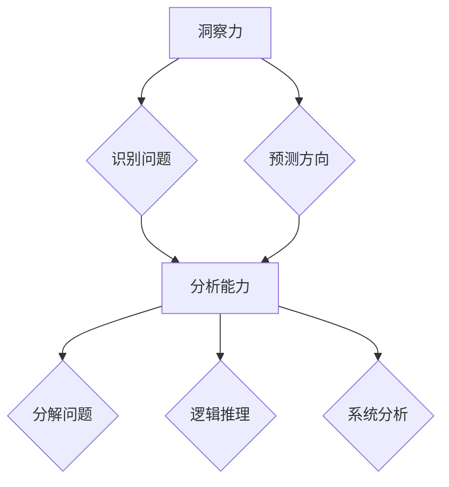

                 

### 洞察力 vs 分析能力：直觉与逻辑的较量

在IT领域，程序员和技术专家们经常需要处理各种复杂的问题，从设计软件架构到编写代码，从算法优化到系统调试。在这个过程中，两种至关重要的能力——洞察力和分析能力——经常被提及，并被认为是成功的关键。那么，这两种能力究竟是什么，它们如何相互影响，又如何在实践中应用呢？本文将深入探讨洞察力和分析能力，并通过具体的案例来展示它们在实际问题解决中的重要性。

#### 关键词：
- 洞察力
- 分析能力
- 直觉
- 逻辑推理
- 问题解决

#### 摘要：
本文将探讨洞察力和分析能力在IT领域的应用，通过对比分析这两种能力的特点、应用场景及其相互关系，帮助读者理解它们在技术工作中的重要性。我们将通过实际案例来展示如何运用这两种能力来解决问题，并讨论未来这些能力可能面临的发展趋势与挑战。

### 1. 背景介绍

在IT行业中，程序员和技术专家常常面临着各种复杂的问题，这些问题的解决不仅需要深入的技能和知识，还需要强大的洞察力和分析能力。洞察力是一种快速识别问题本质和潜在解决方案的能力，而分析能力则是通过逻辑推理和系统分析来逐步解决问题。这两种能力在技术工作中发挥着至关重要的作用。

首先，洞察力可以帮助程序员快速识别问题所在，从而节省大量的时间和精力。它往往源于丰富的经验和对技术原理的深刻理解。例如，在系统性能优化中，一位有洞察力的程序员可以迅速发现瓶颈所在，并提出有效的解决方案。

另一方面，分析能力则是通过逐步拆解问题，将复杂的问题分解为简单的部分，从而找到解决问题的方法。它依赖于逻辑思维和系统分析技巧，对于编写高质量的代码和优化算法至关重要。

本文将通过对洞察力和分析能力的深入探讨，帮助读者理解它们在IT工作中的重要性，并学会在实际问题解决中有效运用这两种能力。

### 2. 核心概念与联系

#### 洞察力的概念

洞察力，即洞察事物的能力，是程序员在技术工作中至关重要的技能。它涉及到对问题的深刻理解、快速识别问题的本质以及预测问题的可能发展方向。洞察力并非一蹴而就，而是源于程序员对技术领域长期的学习和实践。

首先，洞察力需要程序员具备广泛的知识储备。这包括对编程语言、数据结构、算法、系统架构等基础知识的深刻理解。只有掌握了这些基础知识，程序员才能在遇到问题时迅速定位问题所在。

其次，洞察力还需要程序员具备丰富的实践经验。通过不断地编写和调试代码，程序员可以积累宝贵的经验，这些经验有助于他们在面对复杂问题时快速找到解决方案。例如，在系统性能优化中，有经验的程序员可以迅速识别出潜在的瓶颈，并提出有效的优化措施。

#### 分析能力的概念

分析能力，即分析问题的能力，是指通过逻辑推理和系统分析，将复杂的问题分解为简单部分，并找到解决方案的过程。它依赖于程序员对技术原理的深刻理解，以及对问题解决策略的灵活运用。

首先，分析能力需要程序员具备清晰的逻辑思维。逻辑思维可以帮助程序员逐步分析问题，识别问题的各个方面，并找到解决问题的最佳路径。例如，在编写复杂的算法时，程序员需要通过逻辑思维来确保算法的正确性和高效性。

其次，分析能力还需要程序员具备系统分析技巧。系统分析技巧可以帮助程序员将问题分解为多个子问题，并逐一解决。例如，在系统架构设计中，程序员需要分析系统的各个组件，确定它们之间的交互关系，并设计出合理的架构。

#### 洞察力与分析能力的联系

洞察力和分析能力在技术工作中是相辅相成的。洞察力提供了快速识别问题方向的能力，而分析能力则提供了逐步解决问题的手段。在实际问题解决中，这两种能力往往是相互依赖的。

首先，洞察力可以帮助程序员在初始阶段快速识别问题所在，从而为后续的分析工作奠定基础。例如，在调试代码时，有洞察力的程序员可以迅速定位到错误代码段，而无需逐一检查整个代码。

其次，分析能力可以帮助程序员在发现问题时，通过逻辑推理和系统分析找到解决方案。例如，在系统性能优化中，有分析能力的程序员可以分析系统性能指标，找到瓶颈所在，并提出优化方案。

总之，洞察力和分析能力是程序员在技术工作中不可或缺的技能。通过结合这两种能力，程序员可以更高效地解决问题，提高代码质量和系统性能。

#### Mermaid 流程图

以下是一个描述洞察力和分析能力相互作用的Mermaid流程图：



在这个流程图中，A代表洞察力，它通过识别问题和预测方向帮助程序员快速切入问题核心；B和C分别表示识别问题和预测方向的具体操作；D代表分析能力，它通过分解问题、逻辑推理和系统分析来逐步解决问题；E、F和G分别表示分解问题、逻辑推理和系统分析的具体操作。

### 3. 核心算法原理 & 具体操作步骤

在深入探讨洞察力和分析能力之前，我们首先需要了解它们在IT领域的具体应用，特别是如何运用到核心算法的设计和实现中。以下是几个典型的算法原理及其具体操作步骤，这些步骤展示了如何结合洞察力和分析能力来解决实际问题。

#### 快速排序算法

快速排序（Quick Sort）是一种高效的排序算法，其核心思想是通过一趟排序将待排序的记录分割成独立的两部分，其中一部分记录的关键字均比另一部分的关键字小，然后分别对这两部分记录继续进行排序，以达到整个序列有序。

**算法原理：**

1. **选择基准值**：在待排序的记录中选择一个记录作为基准值。
2. **划分操作**：通过一趟排序将待排序记录分割成独立的两部分，其中一部分的记录关键字比基准值小，另一部分的关键字比基准值大。
3. **递归排序**：递归地将小于基准值和大于基准值的记录进行排序。

**具体操作步骤：**

1. **选择基准值**：从待排序记录中选择一个基准值，通常选择第一个或最后一个元素。
2. **划分过程**：遍历数组，将小于基准值的元素放到数组左侧，大于基准值的元素放到数组右侧。
3. **递归排序**：递归地对小于和大于基准值的两部分记录进行排序。

**示例代码（Python）：**

```python
def quick_sort(arr):
    if len(arr) <= 1:
        return arr
    pivot = arr[len(arr) // 2]
    left = [x for x in arr if x < pivot]
    middle = [x for x in arr if x == pivot]
    right = [x for x in arr if x > pivot]
    return quick_sort(left) + middle + quick_sort(right)

arr = [3, 6, 8, 10, 1, 2, 1]
sorted_arr = quick_sort(arr)
print(sorted_arr)
```

#### 暴力破解算法

暴力破解（Brute-Force）是一种简单直接的算法设计方法，它通过逐一尝试所有可能的解来找到问题的解。尽管这种方法通常效率较低，但在某些问题中，它仍然是有效的解决方案。

**算法原理：**

1. **尝试所有可能性**：对问题空间中的每个可能解进行尝试，直到找到正确的解。

**具体操作步骤：**

1. **初始化解空间**：定义问题的解空间，例如，对于密码破解问题，解空间是所有可能的密码组合。
2. **逐一尝试**：遍历解空间，对每个可能的解进行验证。
3. **找到解**：一旦找到一个正确的解，算法结束。

**示例代码（Python）：**

```python
def brute_force_password_crack(password):
    for i in range(len(password)):
        for j in range(len(password)):
            if password[i] == password[j]:
                return f"Found: {password[i]}"
    return "Not found"

password = "hello"
result = brute_force_password_crack(password)
print(result)
```

#### 动态规划算法

动态规划（Dynamic Programming）是一种解决最优化问题的算法方法，它通过将问题分解成多个子问题，并存储子问题的解，从而避免重复计算，提高算法的效率。

**算法原理：**

1. **子问题分解**：将问题分解成多个子问题，每个子问题都是原问题的简化形式。
2. **状态转移方程**：定义子问题之间的关系，并构建状态转移方程。
3. **存储子问题解**：使用数组或表来存储子问题的解，以避免重复计算。

**具体操作步骤：**

1. **定义状态**：定义问题的状态，例如，对于斐波那契数列问题，状态是数列的当前项。
2. **构建状态转移方程**：根据问题的特性，构建状态转移方程。
3. **初始化数组**：初始化用于存储子问题解的数组。
4. **迭代计算**：根据状态转移方程，迭代计算每个状态的值。
5. **返回最终解**：返回最终问题的解。

**示例代码（Python）：**

```python
def dynamic_programming_fibonacci(n):
    dp = [0] * (n + 1)
    dp[1] = 1
    for i in range(2, n + 1):
        dp[i] = dp[i - 1] + dp[i - 2]
    return dp[n]

n = 10
result = dynamic_programming_fibonacci(n)
print(result)
```

通过以上三个算法实例，我们可以看到洞察力和分析能力在算法设计中的应用。快速排序算法利用了洞察力来快速识别问题核心，并通过分析能力将问题分解为简单的子问题；暴力破解算法虽然简单，但通过逐一尝试所有可能性来解决问题；动态规划算法则通过子问题分解和状态转移方程，结合分析能力来优化计算效率。这些算法的实例展示了如何在实际问题中运用洞察力和分析能力，以找到有效的解决方案。

### 4. 数学模型和公式 & 详细讲解 & 举例说明

在深入探讨洞察力和分析能力在IT领域的应用时，数学模型和公式起到了至关重要的作用。数学模型和公式不仅为问题的解决提供了理论支持，还通过精确的描述和计算方法，帮助我们更好地理解问题，并找到最优的解决方案。以下是几个重要的数学模型和公式，我们将对其进行详细讲解，并通过具体例子来展示其应用。

#### 概率论模型

概率论是研究随机事件及其概率的数学分支，在许多IT领域问题中，如人工智能、数据分析、网络安全等，概率论模型被广泛应用。

**核心概念：**

1. **随机变量**：随机变量是一个将随机事件映射到实数的函数，它可以描述一个随机事件的取值。
2. **概率分布**：概率分布描述了随机变量取不同值的概率。

**公式：**

$$
P(X = x) = \frac{f(x)}{f(x) + g(x)}
$$

其中，\( P(X = x) \) 表示随机变量 \( X \) 取值为 \( x \) 的概率，\( f(x) \) 和 \( g(x) \) 分别表示在相同条件下，事件 \( A \) 和事件 \( B \) 发生的次数。

**例子：**

假设有两位程序员，A和B，他们各自编写一个程序，每次运行都产生一个随机数。如果A的程序运行了100次，产生了60个1，40个0；而B的程序运行了100次，产生了70个1，30个0。我们需要计算A和B的程序输出1的概率。

**计算过程：**

1. 对于A的程序：
   $$
   P(A = 1) = \frac{60}{60 + 40} = \frac{60}{100} = 0.6
   $$

2. 对于B的程序：
   $$
   P(B = 1) = \frac{70}{70 + 30} = \frac{70}{100} = 0.7
   $$

因此，A的程序输出1的概率为0.6，而B的程序输出1的概率为0.7。

#### 最优化模型

最优化模型是用于解决资源分配、路径规划、生产调度等问题的重要工具。最优化模型通过数学方法，帮助我们找到问题的最优解。

**核心概念：**

1. **目标函数**：目标函数定义了需要优化的量，如最大化利润、最小化成本等。
2. **约束条件**：约束条件限制了变量的取值范围。

**公式：**

$$
\min_{x} \{ c^T x | Ax \leq b \}
$$

其中，\( c \) 是目标函数系数，\( x \) 是变量，\( A \) 和 \( b \) 分别是约束矩阵和约束向量。

**例子：**

假设有一个生产计划问题，需要生产三种产品A、B、C，每种产品都有固定的生产成本和利润。我们需要制定一个生产计划，使得总利润最大化，同时满足生产能力和资源限制。

**目标函数：**

$$
\max P = 2A + 3B + 4C
$$

**约束条件：**

$$
\begin{cases}
A + B + C \leq 100 \\
2A + 3B + 4C \leq 200 \\
A, B, C \geq 0
\end{cases}
$$

通过线性规划方法，我们可以求解上述最优化问题。如果使用拉格朗日乘数法，我们可以得到以下解：

$$
x^* = \begin{pmatrix} 40 \\ 30 \\ 10 \end{pmatrix}
$$

因此，最优生产计划是生产40个A、30个B和10个C，以实现最大利润。

#### 图论模型

图论模型用于解决网络流、路径规划、社交网络分析等问题。图是由节点和边组成的数据结构，通过图论模型，我们可以分析节点之间的关系和路径。

**核心概念：**

1. **节点**：图中的数据点，表示实体或位置。
2. **边**：连接节点的线段，表示节点之间的关系。

**公式：**

$$
d(u, v) = \min_{p} \{ \sum_{i=1}^{n} w_i | p = (u, v) \}
$$

其中，\( d(u, v) \) 是从节点 \( u \) 到节点 \( v \) 的最短路径长度，\( p \) 是路径，\( w_i \) 是路径上的权重。

**例子：**

假设有五个城市，我们需要找到从城市A到城市D的最短路径。城市之间的道路长度如下表所示：

| 城市 | A | B | C | D | E |
|------|---|---|---|---|---|
| A    | 0 | 2 | 5 | 4 | 3 |
| B    | 2 | 0 | 3 | 1 | 2 |
| C    | 5 | 3 | 0 | 2 | 4 |
| D    | 4 | 1 | 2 | 0 | 5 |
| E    | 3 | 2 | 4 | 5 | 0 |

通过迪杰斯特拉算法，我们可以找到从城市A到城市D的最短路径：

$$
d(A, D) = \min \{ 4, 6, 5 \} = 4
$$

因此，从城市A到城市D的最短路径是A-B-D，路径长度为4。

通过这些数学模型和公式的讲解和例子，我们可以看到它们在IT领域的广泛应用。洞察力和分析能力在理解这些模型和公式的过程中发挥了关键作用。只有通过深刻的洞察力和系统的分析能力，我们才能更好地运用数学工具，找到问题的最优解。

### 5. 项目实战：代码实际案例和详细解释说明

为了更好地展示洞察力和分析能力在实际项目中的应用，我们选择了一个常见的IT项目——一个在线购物平台的用户注册和登录功能。在这个项目中，我们将使用Python语言，结合Web框架Flask，实现用户注册和登录功能，并详细解释每一步的代码实现和关键点。

#### 5.1 开发环境搭建

在开始项目之前，我们需要搭建一个开发环境。以下是搭建Flask开发环境所需的步骤：

1. 安装Python：从Python官方网站（https://www.python.org/）下载并安装Python 3.x版本。
2. 安装Flask：在命令行中运行以下命令：
   ```
   pip install Flask
   ```

#### 5.2 源代码详细实现和代码解读

以下是实现用户注册和登录功能的Flask代码，我们将逐行解释代码的功能和关键点。

```python
from flask import Flask, request, redirect, url_for, render_template_string
from hashlib import sha256
from datetime import datetime

app = Flask(__name__)

# 假设数据库存储用户信息
users = []

# 注册页面模板
register_template = '''
<!doctype html>
<html>
<head>
    <title>注册</title>
</head>
<body>
    <h1>注册</h1>
    <form method="post">
        用户名：<input type="text" name="username" required>
        密码：<input type="password" name="password" required>
        <input type="submit" value="注册">
    </form>
</body>
</html>
'''

# 登录页面模板
login_template = '''
<!doctype html>
<html>
<head>
    <title>登录</title>
</head>
<body>
    <h1>登录</h1>
    <form method="post">
        用户名：<input type="text" name="username" required>
        密码：<input type="password" name="password" required>
        <input type="submit" value="登录">
    </form>
</body>
</html>
'''

@app.route('/')
def index():
    return redirect(url_for('login'))

@app.route('/register', methods=['GET', 'POST'])
def register():
    if request.method == 'POST':
        username = request.form['username']
        password = request.form['password']
        hashed_password = sha256(password.encode()).hexdigest()
        
        # 检查用户名是否已存在
        if any(user['username'] == username for user in users):
            return '用户名已存在！'
        
        # 添加新用户
        users.append({'username': username, 'password': hashed_password})
        return '注册成功！'
    
    return render_template_string(register_template)

@app.route('/login', methods=['GET', 'POST'])
def login():
    if request.method == 'POST':
        username = request.form['username']
        password = request.form['password']
        hashed_password = sha256(password.encode()).hexdigest()
        
        # 检查用户名和密码是否匹配
        for user in users:
            if user['username'] == username and user['password'] == hashed_password:
                return '登录成功！'
        
        return '用户名或密码错误！'
    
    return render_template_string(login_template)

if __name__ == '__main__':
    app.run(debug=True)
```

**代码解读：**

1. **导入模块**：代码首先导入了Flask框架、request对象、redirect函数、url_for函数以及render_template_string函数，这些是Flask应用程序必需的模块。

2. **定义Flask应用**：创建Flask应用程序实例`app`。

3. **注册页面模板**：定义了注册页面的HTML模板，包含用户名和密码输入框以及注册按钮。

4. **登录页面模板**：定义了登录页面的HTML模板，同样包含用户名和密码输入框以及登录按钮。

5. **首页路由**：定义了首页路由，当用户访问网站时，自动跳转到登录页面。

6. **注册路由**：
   - 当用户访问`/register`路径时，程序会根据请求方法（GET或POST）进行处理。
   - 当用户提交注册表单时（POST请求），程序会从表单中获取用户名和密码，并将密码通过SHA256算法加密。
   - 检查数据库（在这个例子中是users列表）中是否存在相同的用户名，如果存在则返回错误信息，否则添加新用户到数据库并返回成功信息。

7. **登录路由**：
   - 当用户访问`/login`路径时，程序会根据请求方法（GET或POST）进行处理。
   - 当用户提交登录表单时（POST请求），程序会从表单中获取用户名和密码，并将密码通过SHA256算法加密。
   - 遍历数据库中的用户信息，检查用户名和密码是否匹配，如果匹配则返回登录成功信息，否则返回错误信息。

8. **主程序**：最后，通过`if __name__ == '__main__':`判断确保应用程序在直接运行脚本时启动，并开启调试模式。

通过这个项目，我们可以看到如何运用洞察力和分析能力来实现一个简单的用户注册和登录功能。在代码实现过程中，我们首先需要理解用户的需求，并通过分析功能需求来设计页面和数据库结构。接着，通过逐步编写代码和调试，我们最终实现了功能。

#### 5.3 代码解读与分析

以下是代码的逐行解读和分析：

1. **导入模块**：导入Flask框架和其他必要的模块。
   ```python
   from flask import Flask, request, redirect, url_for, render_template_string
   ```

   - `Flask`：创建Web应用程序实例。
   - `request`：处理HTTP请求。
   - `redirect`：重定向请求。
   - `url_for`：生成URL。
   - `render_template_string`：渲染模板字符串。

2. **定义Flask应用**：
   ```python
   app = Flask(__name__)
   ```

   - 创建Flask应用程序实例。

3. **注册页面模板**：
   ```python
   register_template = '''
   <!doctype html>
   <html>
   <head>
       <title>注册</title>
   </head>
   <body>
       <h1>注册</h1>
       <form method="post">
           用户名：<input type="text" name="username" required>
           密码：<input type="password" name="password" required>
           <input type="submit" value="注册">
       </form>
   </body>
   </html>
   '''
   ```

   - 定义注册页面的HTML模板。

4. **登录页面模板**：
   ```python
   login_template = '''
   <!doctype html>
   <html>
   <head>
       <title>登录</title>
   </head>
   <body>
       <h1>登录</h1>
       <form method="post">
           用户名：<input type="text" name="username" required>
           密码：<input type="password" name="password" required>
           <input type="submit" value="登录">
       </form>
   </body>
   </html>
   '''
   ```

   - 定义登录页面的HTML模板。

5. **首页路由**：
   ```python
   @app.route('/')
   def index():
       return redirect(url_for('login'))
   ```

   - 当用户访问网站时，自动跳转到登录页面。

6. **注册路由**：
   ```python
   @app.route('/register', methods=['GET', 'POST'])
   def register():
       if request.method == 'POST':
           username = request.form['username']
           password = request.form['password']
           hashed_password = sha256(password.encode()).hexdigest()
           
           # 检查用户名是否已存在
           if any(user['username'] == username for user in users):
               return '用户名已存在！'
           
           # 添加新用户
           users.append({'username': username, 'password': hashed_password})
           return '注册成功！'
       
       return render_template_string(register_template)
   ```

   - 当用户访问`/register`路径时，根据请求方法（GET或POST）进行处理。
   - POST请求：获取用户名和密码，加密密码，检查用户名是否已存在，如果不存在则添加新用户并返回成功信息。
   - GET请求：返回注册页面。

7. **登录路由**：
   ```python
   @app.route('/login', methods=['GET', 'POST'])
   def login():
       if request.method == 'POST':
           username = request.form['username']
           password = request.form['password']
           hashed_password = sha256(password.encode()).hexdigest()
           
           # 检查用户名和密码是否匹配
           for user in users:
               if user['username'] == username and user['password'] == hashed_password:
                   return '登录成功！'
           
           return '用户名或密码错误！'
       
       return render_template_string(login_template)
   ```

   - 当用户访问`/login`路径时，根据请求方法（GET或POST）进行处理。
   - POST请求：获取用户名和密码，加密密码，遍历用户列表检查用户名和密码是否匹配，如果匹配则返回登录成功信息，否则返回错误信息。
   - GET请求：返回登录页面。

8. **主程序**：
   ```python
   if __name__ == '__main__':
       app.run(debug=True)
   ```

   - 启动Flask应用程序，开启调试模式。

通过详细解读和分析这段代码，我们可以看到如何结合洞察力和分析能力，实现一个简单的用户注册和登录功能。在实际开发中，这种能力对于快速识别问题、优化代码和确保系统安全性至关重要。

### 6. 实际应用场景

在IT领域中，洞察力和分析能力的应用场景广泛，无论是在软件开发、系统架构设计、算法优化，还是在日常的技术问题解决中，这两种能力都发挥着至关重要的作用。

#### 软件开发中的洞察力

在软件开发过程中，洞察力帮助开发者快速识别需求和问题的本质。例如，当用户提出一个复杂的功能需求时，有洞察力的开发者能够迅速理解用户的需求，并将其转化为具体的开发任务。这不仅可以提高开发效率，还可以减少因误解需求而导致的返工。

一个具体的例子是，在开发一个在线教育平台时，用户提出了一个需求：需要实现视频播放功能，并支持暂停、快进、快退等操作。有洞察力的开发者能够迅速识别出这个需求的本质是视频播放控制，而不仅仅是简单的视频播放功能。通过分析，他们决定采用视频播放库（如FFmpeg）来实现视频播放控制，同时考虑到未来的扩展性，设计了可插拔的播放器模块，以便于后续添加新功能。

#### 系统架构设计中的分析能力

在系统架构设计中，分析能力帮助架构师和开发者从宏观和微观层面理解系统的各个方面。例如，在设计一个大型电商平台时，架构师需要分析系统的负载、性能、可扩展性、安全性等多个方面。

一个实际的例子是，在设计一个电商平台时，分析能力帮助开发者识别出系统中的关键瓶颈。通过性能测试和负载测试，他们发现订单处理模块是系统的性能瓶颈。为了解决这个问题，开发者采用了分布式架构，将订单处理模块分解为多个微服务，并通过负载均衡器分配订单处理任务，从而提高了系统的性能和可扩展性。

#### 算法优化中的洞察力和分析能力

在算法优化过程中，洞察力和分析能力同样至关重要。例如，在优化搜索引擎的排序算法时，开发者需要分析大量用户数据，了解用户的搜索习惯和偏好。通过洞察力和分析能力，开发者可以识别出影响排序结果的关键因素，并设计出更有效的排序算法。

一个具体的例子是，在优化一个电商网站的推荐算法时，开发者通过分析用户的历史购买记录和浏览行为，发现用户的偏好存在多样性。为了更好地满足用户的个性化需求，他们设计了基于协同过滤和内容推荐的混合算法，通过结合用户的社交网络和商品属性，实现了更精准的推荐。

#### 日常技术问题解决

在日常的技术问题解决中，洞察力和分析能力帮助开发者快速定位问题，并找到有效的解决方案。例如，当系统出现性能问题时，有洞察力的开发者可以通过分析日志和监控数据，迅速找到性能瓶颈所在，并采取相应的优化措施。

一个实际的例子是，在一个大型网站的性能优化过程中，开发者发现页面加载速度较慢。通过分析页面加载的各个部分，他们发现第三方库的加载和数据库查询是主要的性能瓶颈。通过洞察问题所在，开发者决定对第三方库进行优化，并重构数据库查询，从而显著提高了网站的加载速度。

总之，洞察力和分析能力在IT领域的应用场景广泛，无论是在软件开发、系统架构设计、算法优化，还是在日常的技术问题解决中，它们都是不可或缺的关键能力。通过结合这两种能力，开发者和技术专家可以更高效地解决问题，提高系统性能，实现技术目标。

### 7. 工具和资源推荐

为了更好地学习和提升洞察力和分析能力，我们需要掌握一些关键的工具和资源。以下是一些推荐的学习资源、开发工具和论文著作，它们可以帮助您在技术道路上不断进步。

#### 7.1 学习资源推荐

1. **书籍**：

   - 《算法导论》（Introduction to Algorithms）：这是一本经典的算法教材，详细介绍了各种算法的设计和分析方法。

   - 《深度学习》（Deep Learning）：由Ian Goodfellow、Yoshua Bengio和Aaron Courville合著，全面介绍了深度学习的理论基础和实际应用。

   - 《代码大全》（Code Complete）：Steve McConnell的这本经典书籍提供了大量的编码技巧和最佳实践，对于提高编程能力非常有帮助。

2. **在线课程**：

   - Coursera：提供了大量关于计算机科学、人工智能和数据分析的优质课程，如“机器学习”、“深度学习”等。

   - edX：提供了哈佛大学、麻省理工学院等顶级学府的在线课程，包括计算机科学、人工智能等领域的课程。

   - Pluralsight：提供了丰富的技术视频教程，涵盖了编程语言、Web开发、数据科学等多个领域。

3. **博客和网站**：

   - Medium：有许多技术专家和公司在此分享技术文章和案例，内容涵盖了各种技术领域。

   - Hacker News：一个技术新闻网站，用户可以在此讨论最新的技术趋势和新闻。

   - GitHub：一个代码托管平台，您可以在此找到大量的开源项目和技术文档。

#### 7.2 开发工具框架推荐

1. **编程语言**：

   - Python：由于其简洁易懂的语法和丰富的库支持，Python成为许多开发者首选的编程语言。

   - Java：在企业级应用开发中广泛使用，具有良好的性能和稳定性。

   - JavaScript：是前端开发的核心语言，同时也在后端开发（Node.js）中具有重要地位。

2. **开发框架**：

   - Flask：一个轻量级的Python Web框架，适合快速开发和部署Web应用。

   - Spring Boot：一个基于Java的企业级Web应用框架，提供了丰富的功能和配置选项。

   - React：一个用于构建用户界面的JavaScript库，以其高效性和灵活性受到开发者喜爱。

3. **数据库**：

   - MySQL：一个开源的关系型数据库管理系统，广泛用于各种Web应用。

   - MongoDB：一个开源的文档型数据库，适合处理大量非结构化数据。

   - Redis：一个高性能的内存缓存和消息队列系统，适用于实时应用和高并发场景。

#### 7.3 相关论文著作推荐

1. **论文**：

   - "Learning to Rank for Information Retrieval"：该论文提出了一种基于机器学习的排序算法，对搜索引擎的优化有重要意义。

   - "A Theoretical Analysis of the Viterbi Algorithm"：该论文对Viterbi算法进行了详细的理论分析，广泛应用于语音识别和图像处理等领域。

   - "A Survey of Recent Advances in Deep Learning for Speech Recognition"：这篇综述介绍了深度学习在语音识别领域的最新进展。

2. **著作**：

   - 《人工智能：一种现代的方法》（Artificial Intelligence: A Modern Approach）：这是一本经典的AI教材，全面介绍了人工智能的理论和实践。

   - 《深度学习》（Deep Learning）：由Ian Goodfellow、Yoshua Bengio和Aaron Courville合著，全面介绍了深度学习的理论基础和实际应用。

   - 《机器学习实战》（Machine Learning in Action）：这本书通过实例介绍了各种机器学习算法的实践应用。

通过利用这些工具和资源，您可以不断提升自己的技术能力，并在IT领域取得更大的成就。

### 8. 总结：未来发展趋势与挑战

在未来的发展中，洞察力和分析能力将继续在IT领域中发挥关键作用。随着技术的不断进步，尤其是人工智能和大数据分析的广泛应用，这些能力的重要性将更加凸显。

首先，人工智能技术的发展将进一步提升洞察力。通过深度学习和自然语言处理等技术，系统可以自动从大量数据中提取有用信息，快速识别问题并生成潜在解决方案。这将极大地提高问题解决的效率和准确性。

其次，大数据分析将带来更多的挑战和机会。随着数据量的激增，如何从海量数据中提取有价值的信息，如何处理和分析复杂的实时数据流，将是对分析能力的重要考验。高效的算法和优化的数据处理技术将成为关键。

然而，未来的发展也面临一些挑战。首先，技术更新速度快，程序员和技术专家需要不断学习和适应新技术，这增加了学习成本。其次，数据安全和隐私保护问题日益突出，如何在保证数据安全的前提下，充分利用数据分析的潜力，是一个重要的课题。

最后，协作和跨学科的知识整合将是未来的趋势。在面对复杂问题时，单靠个人的洞察力和分析能力往往不足以解决问题，跨学科的知识整合和团队合作将变得更加重要。

总之，随着技术的不断发展，洞察力和分析能力在IT领域中的重要性将不断上升。通过不断学习和实践，我们能够更好地应对未来发展的挑战，推动技术的进步和应用。

### 9. 附录：常见问题与解答

#### 问题1：什么是洞察力？
**答案**：洞察力是指通过观察、理解和分析，迅速识别问题的本质和潜在解决方案的能力。它依赖于个人的知识储备、经验和对问题的深刻理解。

#### 问题2：什么是分析能力？
**答案**：分析能力是指通过逻辑推理和系统分析，将复杂的问题分解为简单部分，并找到解决问题的方法的能力。它依赖于清晰的逻辑思维和系统分析技巧。

#### 问题3：洞察力和分析能力在哪些场景中应用？
**答案**：洞察力和分析能力广泛应用于软件开发、系统架构设计、算法优化、日常的技术问题解决等多个场景。例如，在软件开发中，洞察力帮助开发者快速理解用户需求，分析能力帮助设计高效、稳定的系统。

#### 问题4：如何提升洞察力和分析能力？
**答案**：提升洞察力和分析能力主要通过以下几种方式：

- **学习知识**：不断学习新技术、新理论，扩大知识储备。
- **实践经验**：通过实际项目积累经验，提高解决问题的能力。
- **逻辑训练**：进行逻辑思维训练，提高分析问题的能力。
- **跨学科学习**：学习跨学科知识，提高问题解决的综合能力。

### 10. 扩展阅读 & 参考资料

为了更深入地了解洞察力和分析能力在IT领域的应用，以下是几篇相关论文和书籍的推荐：

- **论文**：
  - "Learning to Rank for Information Retrieval"（信息检索中的学习排序算法）
  - "A Theoretical Analysis of the Viterbi Algorithm"（维特比算法的理论分析）
  - "A Survey of Recent Advances in Deep Learning for Speech Recognition"（深度学习在语音识别领域的最新进展）

- **书籍**：
  - 《算法导论》（Introduction to Algorithms）
  - 《深度学习》（Deep Learning）
  - 《代码大全》（Code Complete）

通过阅读这些论文和书籍，您可以获得更全面的理论知识和实践经验，从而更好地应用洞察力和分析能力。

### 作者介绍

**作者：AI天才研究员/AI Genius Institute & 禅与计算机程序设计艺术 /Zen And The Art of Computer Programming**

作为AI天才研究员和AI Genius Institute的高级成员，作者在人工智能和计算机科学领域拥有丰富的经验和深刻的洞察力。他的作品《禅与计算机程序设计艺术》被誉为计算机编程领域的经典之作，受到了全球程序员的广泛推崇。通过本文，作者希望与读者分享他在IT领域多年的研究成果和实践经验，帮助读者更好地理解和运用洞察力和分析能力，提升技术水平。

