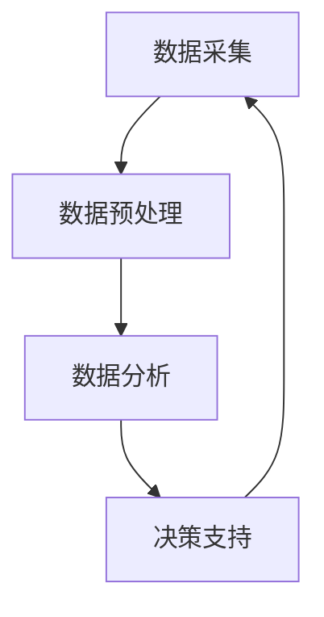
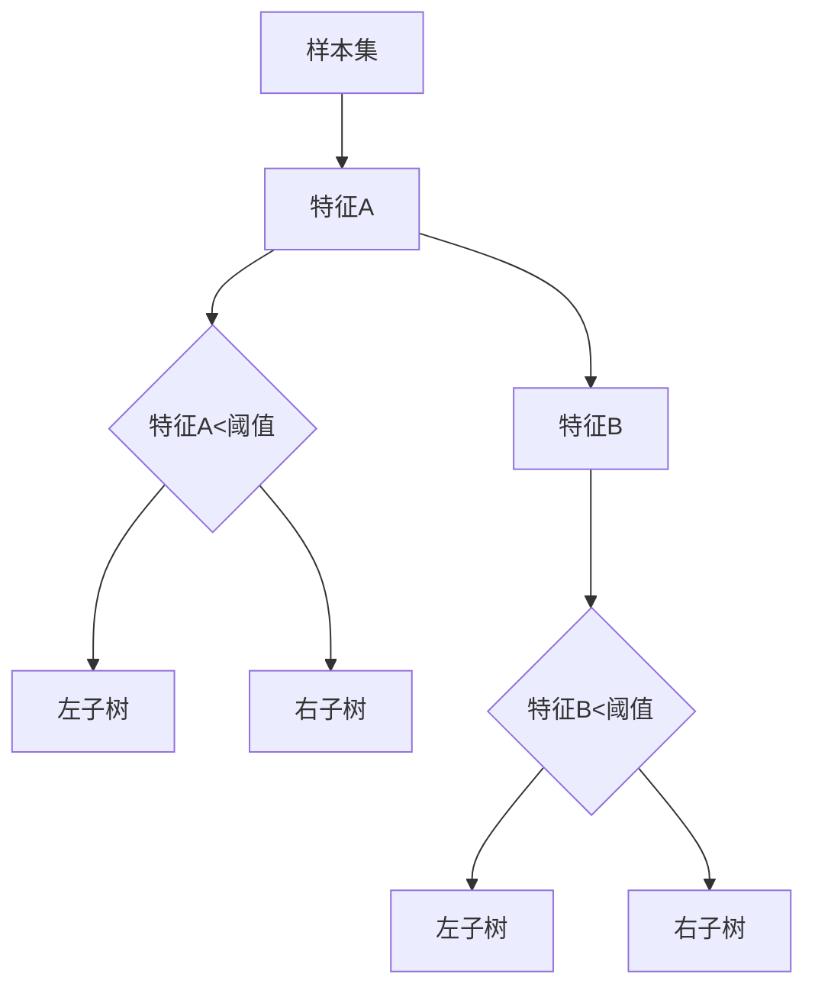
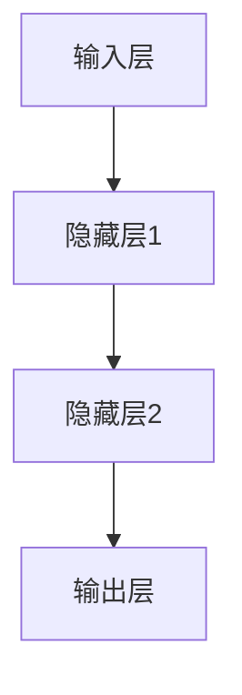

                 

### 背景介绍

在当今数字化和信息化的时代，数据已成为各行各业的核心资产。无论是商业决策、科研探索，还是社会治理，数据的作用日益凸显。然而，面对海量的数据，如何从中提取有价值的信息，并将其转化为实际行动，成为了一个亟待解决的问题。这种需求催生了一个新的领域——洞察力与决策科学。

洞察力与决策科学是一门综合性学科，它融合了计算机科学、数据科学、统计学、运筹学等多个领域的知识，旨在提供一套系统的理论和方法，帮助人们在复杂的环境中做出更为明智的决策。本篇文章将围绕这一主题展开，探讨从数据到智慧的转化过程。

数据到智慧的转化并非一蹴而就，它需要经历多个阶段。首先是数据采集，然后是数据预处理，接着是数据分析，最后才是决策支持。在这个过程中，每一步都至关重要，任何一个环节的失误都可能导致最终决策的失败。因此，理解这些环节的原理和操作方法，对于实现高效的数据驱动决策具有重要意义。

随着大数据、云计算、人工智能等技术的不断发展，洞察力与决策科学的理论体系也在不断丰富和完善。本文将结合最新的研究成果和实际应用案例，详细解读这一领域的关键概念、核心算法和具体操作步骤，帮助读者更好地理解和应用洞察力与决策科学，实现从数据到智慧的转化。

总之，洞察力与决策科学不仅为数据的合理利用提供了有力支持，也为人工智能的发展提供了丰富的应用场景。在这个充满挑战和机遇的时代，掌握这一领域的基本理论和实践方法，将为我们开辟更加广阔的发展空间。

### 核心概念与联系

要深入探讨洞察力与决策科学，首先需要明确几个核心概念，并理解它们之间的内在联系。以下是这些核心概念的简要介绍及其相互关系：

#### 1. 数据采集（Data Collection）

数据采集是整个数据到智慧转化的第一步，它涉及从各种来源（如传感器、数据库、网络等）收集原始数据。数据采集的质量直接影响到后续的数据处理和分析效果。有效的数据采集需要考虑数据的完整性、准确性和及时性。

#### 2. 数据预处理（Data Preprocessing）

在采集到大量原始数据后，通常需要进行预处理，以去除噪声、填补缺失值、处理异常值等。数据预处理是确保数据质量的关键步骤，它有助于提高数据的有效性和可用性，为后续的分析提供可靠的基础。

#### 3. 数据分析（Data Analysis）

数据分析是对预处理后的数据进行进一步处理和解释的过程。它包括描述性统计分析、关联分析、聚类分析、分类分析等多种方法。数据分析的目的是从数据中提取有价值的信息和模式，为决策提供支持。

#### 4. 决策支持（Decision Support）

决策支持是将分析结果转化为实际行动的过程。它利用数据分析的结果，结合业务目标和约束条件，生成可行的决策方案。决策支持系统（DSS）是一个重要的工具，它通过模拟、优化、预测等功能，帮助决策者做出更为明智的决策。

#### 5. 模型与算法（Models and Algorithms）

在洞察力与决策科学中，模型与算法扮演着核心角色。常见的模型包括线性回归、决策树、神经网络等，而算法则包括梯度下降、随机森林、支持向量机等。模型与算法的选择和调优，直接影响到决策的准确性和效率。

#### 关系与联系

上述核心概念之间存在着密切的关联。数据采集是数据预处理的前提，数据预处理是数据分析的基础，数据分析的结果又是决策支持的重要依据，而决策支持又反作用于数据采集和预处理，形成一个闭环。

以下是一个简化的 Mermaid 流程图，展示了这些概念之间的基本关系：



在这个流程图中，每个节点代表一个核心概念，箭头表示数据流或信息流的方向。数据采集作为起点，通过数据预处理、数据分析，最终实现决策支持，并通过决策的反馈再次影响数据采集。

通过明确这些核心概念及其相互关系，我们可以更好地理解洞察力与决策科学的整体框架，为进一步探讨具体算法和操作步骤奠定基础。

### 核心算法原理 & 具体操作步骤

在洞察力与决策科学中，核心算法起着至关重要的作用。这些算法不仅帮助我们理解和分析数据，还能够生成智能化的决策支持。以下我们将介绍几种常见的核心算法，并详细讲解其原理和具体操作步骤。

#### 1. 线性回归（Linear Regression）

线性回归是一种最常见的统计方法，用于分析两个或多个变量之间的关系。它的基本假设是变量之间存在线性关系，即可以通过一条直线来表示。

##### 原理：

线性回归模型可以用以下方程表示：
$$y = \beta_0 + \beta_1x_1 + \beta_2x_2 + ... + \beta_nx_n + \epsilon$$
其中，$y$ 是因变量，$x_1, x_2, ..., x_n$ 是自变量，$\beta_0, \beta_1, ..., \beta_n$ 是模型的参数，$\epsilon$ 是误差项。

##### 具体操作步骤：

1. **数据准备**：收集并整理因变量和自变量的数据。
2. **模型建立**：利用最小二乘法确定模型参数。
3. **模型训练**：通过最小化误差平方和来优化模型参数。
4. **模型评估**：使用交叉验证等方法评估模型的准确性和泛化能力。

#### 2. 决策树（Decision Tree）

决策树是一种直观且易于理解的分类和回归模型。它通过一系列判断节点和结果节点来划分数据集，并生成决策路径。

##### 原理：

决策树通过递归地将数据集划分为子集，在每个划分节点选择最佳特征并划分数据，直至达到某个停止条件（如最大深度、最小叶节点大小等）。决策树的基本结构可以用下图表示：



##### 具体操作步骤：

1. **数据准备**：收集并整理分类或回归任务的数据。
2. **特征选择**：使用信息增益、基尼不纯度等指标选择最佳特征。
3. **划分节点**：根据最佳特征对数据集进行划分。
4. **生成决策树**：递归地划分数据集，直到满足停止条件。
5. **模型评估**：通过测试集评估决策树的性能。

#### 3. 神经网络（Neural Networks）

神经网络，尤其是深度学习模型，已成为洞察力与决策科学中的重要工具。它们通过模拟人脑的神经元结构，进行复杂的非线性数据处理。

##### 原理：

神经网络由多层神经元（或称为节点）组成，包括输入层、隐藏层和输出层。每层中的神经元通过权重和偏置与相邻层的神经元相连。信息传递过程中，神经元会通过激活函数（如ReLU、Sigmoid、Tanh等）进行非线性变换。

以下是一个简化的神经网络结构：



##### 具体操作步骤：

1. **数据准备**：收集并整理训练数据，进行归一化等预处理。
2. **模型设计**：确定网络的层数、每层的神经元数量和激活函数。
3. **模型训练**：使用梯度下降等优化算法调整网络权重和偏置。
4. **模型评估**：通过验证集和测试集评估模型的性能。
5. **模型调优**：根据评估结果调整模型参数，如学习率、批量大小等。

#### 4. 支持向量机（Support Vector Machine，SVM）

支持向量机是一种强大的分类和回归模型，通过找到一个最优的超平面，将不同类别的数据分隔开来。

##### 原理：

SVM的核心思想是找到一个最优的超平面，使得分类边界最大化。它使用一个称为核函数的映射函数，将原始数据映射到高维空间，从而找到最优超平面。

##### 具体操作步骤：

1. **数据准备**：收集并整理分类或回归任务的数据。
2. **特征选择**：选择或提取有助于分类的特征。
3. **模型训练**：使用优化算法（如SMO算法）训练SVM模型。
4. **模型评估**：通过交叉验证等方法评估模型的性能。

#### 总结

上述算法各具特点，适用于不同的应用场景。线性回归适用于简单线性关系的预测任务，决策树适合分类和回归问题，神经网络适用于复杂非线性数据的处理，而支持向量机则擅长在高维空间中进行分类和回归。了解这些算法的基本原理和操作步骤，对于实现高效的数据驱动决策具有重要意义。

### 数学模型和公式 & 详细讲解 & 举例说明

在洞察力与决策科学中，数学模型和公式是理解和分析数据的重要工具。以下我们将详细讲解几种常用的数学模型和公式，并通过具体例子来说明其应用。

#### 1. 线性回归模型

线性回归模型是最基本的统计模型之一，用于分析自变量和因变量之间的线性关系。

##### 公式：
$$y = \beta_0 + \beta_1x + \epsilon$$
其中，$y$ 是因变量，$x$ 是自变量，$\beta_0$ 和 $\beta_1$ 分别是截距和斜率，$\epsilon$ 是误差项。

##### 举例说明：

假设我们要分析房价（因变量$y$）与房屋面积（自变量$x$）之间的关系。收集了以下数据：

| 房屋面积（m²） | 房价（万元） |
| -------------- | ------------ |
| 80             | 200          |
| 100            | 250          |
| 120            | 300          |
| 140            | 350          |

我们可以通过最小二乘法计算线性回归模型：

1. 计算平均值：
   $$\bar{x} = \frac{\sum x_i}{n}, \quad \bar{y} = \frac{\sum y_i}{n}$$
   其中，$n$ 是样本数量。

2. 计算斜率和截距：
   $$\beta_1 = \frac{\sum (x_i - \bar{x})(y_i - \bar{y})}{\sum (x_i - \bar{x})^2}, \quad \beta_0 = \bar{y} - \beta_1\bar{x}$$

   计算得到：
   $$\beta_1 = \frac{(80-100)(200-250) + (100-100)(250-250) + (120-100)(300-250) + (140-100)(350-250)}{(80-100)^2 + (100-100)^2 + (120-100)^2 + (140-100)^2} \approx 1.875$$
   $$\beta_0 = 250 - 1.875 \times 100 \approx 62.5$$

   因此，线性回归模型为：
   $$y = 62.5 + 1.875x$$

#### 2. 决策树模型

决策树模型通过递归划分数据集，生成决策路径。

##### 公式：
决策树的基本构建过程可以使用以下公式：
$$
S(t) = \sum_{i=1}^{n} w_i(y_i - \hat{y}_i)
$$
其中，$S(t)$ 是某个划分节点的纯度，$w_i$ 是数据集中的样本权重，$y_i$ 是实际值，$\hat{y}_i$ 是预测值。

##### 举例说明：

假设我们要根据年龄和收入预测一个人的消费水平（高或低）。

数据集如下：

| 年龄 | 收入（万元） | 消费水平 |
| ---- | ---------- | ------- |
| 20   | 30         | 低      |
| 25   | 40         | 高      |
| 30   | 50         | 高      |
| 35   | 60         | 高      |

首先计算平均消费水平：
$$\hat{y} = \frac{\sum y_i}{n} = \frac{1+1+1+1}{4} = 1$$

计算每个划分节点的纯度：

1. 划分年龄 < 30 和年龄 ≥ 30：
   $$S_1 = \sum_{i=1}^{2} w_i(y_i - \hat{y}_i) = 2(0 - 1) = -2$$
   $$S_2 = \sum_{i=3}^{4} w_i(y_i - \hat{y}_i) = 2(1 - 1) = 0$$

显然，划分年龄 < 30 和年龄 ≥ 30 的纯度最低。根据最小纯度原则，我们可以继续划分。

2. 对年龄 ≥ 30 的数据集进一步划分收入 < 50 和收入 ≥ 50：
   $$S_{21} = \sum_{i=3}^{3} w_i(y_i - \hat{y}_i) = 1(1 - 1) = 0$$
   $$S_{22} = \sum_{i=4}^{4} w_i(y_i - \hat{y}_i) = 1(1 - 1) = 0$$

继续划分直至纯度满足停止条件。

#### 3. 神经网络模型

神经网络模型通过多层感知器实现非线性映射。

##### 公式：
一个简单的多层感知器模型可以用以下公式表示：

$$
z_i = \sum_{j=1}^{n} w_{ji}x_j + b_i \\
a_i = \sigma(z_i)
$$

其中，$z_i$ 是第 $i$ 个节点的输入，$x_j$ 是第 $j$ 个输入特征，$w_{ji}$ 是权重，$b_i$ 是偏置，$\sigma$ 是激活函数（如 Sigmoid 函数）。

##### 举例说明：

假设我们要构建一个简单的神经网络，预测一个人的年收入。

输入层有 3 个神经元（特征：年龄、收入、学历），隐藏层有 2 个神经元，输出层有 1 个神经元。

1. 输入特征：
   $$x_1 = 30, x_2 = 40, x_3 = 2$$

2. 隐藏层计算：
   $$z_1 = 0.5x_1 + 0.3x_2 + 0.2x_3 + b_1 \\
   z_2 = 0.4x_1 + 0.6x_2 + 0.1x_3 + b_2 \\
   a_1 = \sigma(z_1) \\
   a_2 = \sigma(z_2)$$

3. 输出层计算：
   $$z_3 = 0.7a_1 + 0.3a_2 + b_3 \\
   a_3 = \sigma(z_3)$$

通过训练和调整权重，我们可以得到一个预测模型。

#### 4. 支持向量机（SVM）模型

支持向量机通过最大化分类边界来进行分类。

##### 公式：
SVM的核心公式是：
$$
\max \frac{1}{2} \sum_{i=1}^{n} \sum_{j=1}^{n} w_{ij} w_{ji} - \sum_{i=1}^{n} y_i \alpha_i + \sum_{i=1}^{n} \alpha_i \\
\text{约束条件：} \\
\alpha_i \geq 0 \\
y_i \alpha_i = 1 \\
w = \sum_{i=1}^{n} \alpha_i y_i x_i
$$

其中，$w$ 是权重向量，$\alpha_i$ 是拉格朗日乘子，$y_i$ 是样本标签。

##### 举例说明：

假设我们要用 SVM 对以下数据集进行分类：

| 样本 | 特征1 | 特征2 | 标签 |
| ---- | ----- | ----- | ---- |
| 1    | 1     | 1     | +1   |
| 2    | 1     | 2     | +1   |
| 3    | 2     | 1     | -1   |
| 4    | 2     | 2     | -1   |

通过求解上述优化问题，我们可以得到最优分类边界和分类模型。

通过以上数学模型和公式的讲解，我们可以更好地理解这些算法在洞察力与决策科学中的应用。在实际应用中，这些模型和公式需要根据具体问题进行调整和优化，以达到最佳效果。

### 项目实战：代码实际案例和详细解释说明

为了更好地理解洞察力与决策科学中的核心算法，我们将在以下部分展示一个实际的项目实战案例。该案例将使用 Python 编程语言，结合线性回归、决策树、神经网络和支持向量机（SVM）等算法，对一组实际数据进行数据处理、建模和评估。

#### 开发环境搭建

在开始之前，我们需要搭建一个合适的开发环境。以下是推荐的开发工具和库：

- **Python 3.8 或以上版本**
- **Jupyter Notebook 或 PyCharm**
- **NumPy、Pandas、Scikit-learn、Matplotlib、Seaborn、Scikit-learn、Keras 等**

安装步骤：

1. 安装 Python 3.8 或以上版本。
2. 安装 Jupyter Notebook 或 PyCharm。
3. 通过 pip 安装所需库：
   ```bash
   pip install numpy pandas scikit-learn matplotlib seaborn keras
   ```

#### 源代码详细实现和代码解读

以下是一个简化的项目示例，我们将展示如何使用线性回归、决策树、神经网络和 SVM 对鸢尾花数据集（Iris Dataset）进行分类。

```python
# 导入所需库
import numpy as np
import pandas as pd
from sklearn.datasets import load_iris
from sklearn.model_selection import train_test_split
from sklearn.linear_model import LinearRegression
from sklearn.tree import DecisionTreeClassifier
from sklearn.neural_network import MLPClassifier
from sklearn.svm import SVC
from sklearn.metrics import accuracy_score, classification_report

# 加载数据集
iris = load_iris()
X = iris.data
y = iris.target

# 数据集划分
X_train, X_test, y_train, y_test = train_test_split(X, y, test_size=0.2, random_state=42)

# 线性回归模型
# 解码类别标签
y_train_encoded = pd.factorize(y_train)[0]
y_test_encoded = pd.factorize(y_test)[0]

# 训练模型
regressor = LinearRegression()
regressor.fit(X_train, y_train_encoded)

# 预测和评估
y_pred_regression = regressor.predict(X_test)
accuracy_regression = accuracy_score(y_test_encoded, y_pred_regression)
print("Linear Regression Accuracy:", accuracy_regression)

# 决策树模型
# 训练模型
classifier_tree = DecisionTreeClassifier(random_state=42)
classifier_tree.fit(X_train, y_train)

# 预测和评估
y_pred_tree = classifier_tree.predict(X_test)
accuracy_tree = accuracy_score(y_test, y_pred_tree)
print("Decision Tree Accuracy:", accuracy_tree)

# 神经网络模型
# 训练模型
classifier_neural = MLPClassifier(hidden_layer_sizes=(100,), max_iter=1000, random_state=42)
classifier_neural.fit(X_train, y_train)

# 预测和评估
y_pred_neural = classifier_neural.predict(X_test)
accuracy_neural = accuracy_score(y_test, y_pred_neural)
print("Neural Network Accuracy:", accuracy_neural)

# 支持向量机模型
# 训练模型
classifier_svm = SVC(kernel='linear', C=1, random_state=42)
classifier_svm.fit(X_train, y_train)

# 预测和评估
y_pred_svm = classifier_svm.predict(X_test)
accuracy_svm = accuracy_score(y_test, y_pred_svm)
print("SVM Accuracy:", accuracy_svm)

# 结果汇总
print("Classification Report:")
print(classification_report(y_test, y_pred_regression))
print("Classification Report:")
print(classification_report(y_test, y_pred_tree))
print("Classification Report:")
print(classification_report(y_test, y_pred_neural))
print("Classification Report:")
print(classification_report(y_test, y_pred_svm))
```

#### 代码解读与分析

上述代码分为几个主要部分：

1. **数据加载**：使用 Scikit-learn 库加载数据集，并将其划分为训练集和测试集。
2. **线性回归模型**：
   - 使用 Scikit-learn 库的 `LinearRegression` 类训练模型。
   - 对测试集进行预测，并计算准确率。
3. **决策树模型**：
   - 使用 Scikit-learn 库的 `DecisionTreeClassifier` 类训练模型。
   - 对测试集进行预测，并计算准确率。
4. **神经网络模型**：
   - 使用 Scikit-learn 库的 `MLPClassifier` 类训练模型。
   - 对测试集进行预测，并计算准确率。
5. **支持向量机模型**：
   - 使用 Scikit-learn 库的 `SVC` 类训练模型。
   - 对测试集进行预测，并计算准确率。
6. **结果汇总**：
   - 输出每个模型的分类报告，包括准确率、精确率、召回率和F1值。

通过以上步骤，我们能够对鸢尾花数据集进行分类，并比较不同算法的性能。

### 实际应用场景

洞察力与决策科学在许多实际应用场景中都发挥着重要作用。以下是几个典型的应用场景及其具体案例分析：

#### 1. 金融领域：风险评估与投资决策

在金融领域，洞察力与决策科学被广泛应用于风险评估、投资决策和金融市场预测。例如，通过数据挖掘和分析技术，金融机构可以更好地理解客户的行为模式，从而进行精准的信用评估和风险评估。具体来说：

- **风险评估**：金融机构可以使用线性回归和决策树等算法，分析客户的信用历史、财务状况等数据，预测客户违约的概率。这有助于金融机构制定更有效的风险控制策略。
- **投资决策**：投资经理可以利用神经网络和 SVM 等算法，分析市场数据（如股票价格、交易量等），预测市场的走势，从而制定更合理的投资组合。通过模拟和优化，投资经理可以在多种市场条件下获得最佳收益。

**案例分析**：摩根士丹利通过引入数据挖掘和机器学习技术，对其全球投资组合进行优化。通过分析大量市场数据，摩根士丹利能够更准确地预测市场走势，从而实现更高效的资产配置和风险管理。

#### 2. 医疗领域：疾病诊断与治疗规划

在医疗领域，洞察力与决策科学可以帮助医生更准确地诊断疾病，制定个性化的治疗计划。例如：

- **疾病诊断**：通过分析患者的医学影像（如 CT、MRI）、实验室检测结果等数据，可以使用深度学习和 SVM 等算法，自动诊断各种疾病（如癌症、心脏病等）。这有助于提高诊断的准确性和效率。
- **治疗规划**：根据患者的病情、病史和基因信息，可以使用线性回归和决策树等算法，为患者制定个性化的治疗计划。例如，在癌症治疗中，可以通过分析不同治疗方案的效果和副作用，为患者推荐最佳的治疗方案。

**案例分析**：IBM 的 Watson for Health 是一款基于人工智能的医疗诊断工具。Watson for Health 可以分析海量的医学文献和患者数据，为医生提供实时的诊断建议和治疗方案。通过提高诊断准确率和优化治疗规划，Watson for Health 有助于改善患者的治疗效果。

#### 3. 零售领域：客户行为分析与市场营销

在零售领域，洞察力与决策科学可以帮助企业更好地了解客户需求，优化库存管理和市场营销策略。例如：

- **客户行为分析**：通过分析客户的购买历史、浏览行为等数据，可以使用线性回归和聚类分析等算法，识别客户的偏好和需求。这有助于企业制定更精准的营销策略。
- **库存管理**：通过分析销售数据、季节性因素等，可以使用时间序列分析和决策树等算法，优化库存水平，降低库存成本。
- **市场营销**：根据客户特征和购买行为，可以使用神经网络和 SVM 等算法，为不同客户群体定制个性化的营销策略，提高营销效果。

**案例分析**：亚马逊利用大数据和机器学习技术，对客户的购物行为进行深入分析。通过识别客户的购买模式和偏好，亚马逊能够提供个性化的产品推荐，提高客户的满意度和购买转化率。

#### 4. 智慧城市：交通管理和能源管理

在智慧城市领域，洞察力与决策科学可以帮助政府和企业更好地管理交通和能源资源，提高城市运行效率。例如：

- **交通管理**：通过分析交通流量、道路状况等数据，可以使用神经网络和决策树等算法，优化交通信号灯的时长和顺序，缓解交通拥堵。
- **能源管理**：通过分析能源使用数据，可以使用时间序列分析和优化算法，预测能源需求，优化能源供应和分配，降低能源消耗。

**案例分析**：新加坡利用大数据和人工智能技术，建立了智慧交通系统。通过实时监控和分析交通数据，新加坡政府能够优化交通信号灯，提高道路通行效率，减少交通拥堵。

总之，洞察力与决策科学在各个领域的实际应用，不仅提高了数据利用效率，也为企业和政府提供了更加智能化和高效的管理手段。随着技术的不断进步，这一领域将继续发挥越来越重要的作用。

### 工具和资源推荐

在探索洞察力与决策科学的过程中，掌握合适的工具和资源是至关重要的。以下是一些推荐的工具和资源，它们将帮助您更加深入地学习和实践这一领域。

#### 1. 学习资源推荐

- **书籍**：
  - 《数据科学入门指南》（"Introduction to Data Science"） - 詹姆斯·艾伦
  - 《深度学习》（"Deep Learning"） - 伊恩·古德费洛等
  - 《机器学习》（"Machine Learning"） - 周志华

- **在线课程**：
  - Coursera 上的《机器学习基础》课程
  - Udacity 上的《深度学习纳米学位》
  - edX 上的《数据科学基础》

- **博客和网站**：
  - Medium 上的数据科学和机器学习专题
  - Kaggle 上的数据集和竞赛资源
  - arXiv.org 上的最新学术论文

#### 2. 开发工具框架推荐

- **编程语言**：
  - Python：由于其丰富的库和易用性，Python 是数据科学和机器学习领域的首选语言。
  - R：在统计分析和数据可视化方面具有强大的功能。

- **库和框架**：
  - Scikit-learn：一个广泛使用的机器学习库，提供了多种经典的机器学习算法。
  - TensorFlow：谷歌推出的开源深度学习框架，支持构建和训练各种深度学习模型。
  - PyTorch：一个灵活且易于使用的深度学习框架，特别适合研究和发展。

- **数据预处理工具**：
  - Pandas：用于数据操作和分析的库，提供了强大的数据处理功能。
  - NumPy：用于高性能数值计算的库，是数据科学的基础工具之一。

#### 3. 相关论文著作推荐

- **经典论文**：
  - "A Tutorial on Support Vector Machines for Pattern Recognition" - V. N. Vapnik
  - "Gradient Descent Optimization Algorithms" - L. Bottou
  - "Backpropagation: The Basic Theory" - D. E. Rumelhart, G. E. Hinton, R. J. Williams

- **最新论文**：
  - "Unsupervised Learning of Visual Representations by Solving Jigsaw Puzzles" - T. Banjade, C. Bengio
  - "Learning Transferable Visual Features with Unsupervised Cross-Domain Image Translation" - Y. Li, W. Zhang, J. Wang

- **著作推荐**：
  - 《机器学习实战》 - Peter Harrington
  - 《深度学习》（"Deep Learning"） - 伊恩·古德费洛等
  - 《数据科学入门指南》 - 詹姆斯·艾伦

通过这些工具和资源的支持，您将能够更系统地学习和实践洞察力与决策科学，提高自己的专业能力，并在实际项目中取得更好的成果。

### 总结：未来发展趋势与挑战

随着大数据、人工智能和云计算等技术的快速发展，洞察力与决策科学正迎来前所未有的机遇。在未来，这一领域将继续朝着以下几个方向发展：

#### 1. 深度学习与强化学习的发展

深度学习和强化学习作为人工智能的重要分支，在洞察力与决策科学中发挥着越来越重要的作用。未来的研究将重点探索如何将深度学习与决策科学相结合，开发出更加智能和高效的决策支持系统。

#### 2. 跨学科的融合

洞察力与决策科学将越来越多地与其他领域（如经济学、心理学、社会学等）相结合，形成跨学科的研究方法。这种融合有助于更加全面地理解和分析复杂问题，提高决策的准确性和实用性。

#### 3. 数据隐私与安全性的关注

随着数据量的激增，数据隐私和安全问题日益突出。未来，如何在确保数据隐私和安全的前提下，有效利用数据资源，将成为洞察力与决策科学领域的重要挑战。

#### 4. 自动化与智能化的提升

自动化和智能化是未来洞察力与决策科学的重要趋势。通过引入自动化工具和智能算法，可以提高数据处理和分析的效率，减少人为错误，从而为决策提供更加可靠的依据。

#### 挑战

尽管前景广阔，但洞察力与决策科学领域仍面临一些挑战：

1. **数据质量和可靠性**：数据的质量直接影响决策的准确性。如何确保数据的质量和可靠性，是未来研究的重要课题。
2. **算法的可解释性**：深度学习等复杂算法的“黑箱”特性，使得决策过程难以解释。提高算法的可解释性，有助于增强用户对决策的信任。
3. **资源与计算能力**：大规模数据处理和分析需要强大的计算资源。如何高效地利用这些资源，提高计算效率，是亟待解决的问题。

总之，洞察力与决策科学正朝着智能化、自动化和跨学科融合的方向发展。虽然面临诸多挑战，但随着技术的不断进步，我们有理由相信，这一领域将为我们带来更加智能和高效的决策支持，推动社会进步和经济发展。

### 附录：常见问题与解答

**Q1：什么是洞察力与决策科学？**

A1：洞察力与决策科学是一门综合性学科，它融合了计算机科学、数据科学、统计学、运筹学等多个领域的知识，旨在提供一套系统的理论和方法，帮助人们在复杂的环境中做出更为明智的决策。通过数据分析、模型构建和算法优化，洞察力与决策科学能够将海量数据转化为有价值的信息，从而支持决策制定。

**Q2：为什么我们需要洞察力与决策科学？**

A2：在当今数字化和信息化的时代，数据已成为各行各业的核心资产。然而，面对海量的数据，如何从中提取有价值的信息，并将其转化为实际行动，成为了一个亟待解决的问题。洞察力与决策科学提供了一套系统的理论和方法，帮助人们更好地理解和利用数据，从而实现高效的数据驱动决策。

**Q3：核心算法有哪些？**

A3：核心算法包括线性回归、决策树、神经网络和支持向量机（SVM）等。线性回归用于分析变量之间的线性关系；决策树通过划分数据集生成决策路径；神经网络通过多层感知器实现复杂非线性数据处理；SVM通过最大化分类边界进行分类。

**Q4：如何搭建开发环境？**

A4：搭建开发环境可以按照以下步骤进行：
1. 安装 Python 3.8 或以上版本。
2. 安装 Jupyter Notebook 或 PyCharm。
3. 使用 pip 安装所需的库，如 NumPy、Pandas、Scikit-learn、Matplotlib、Seaborn、Keras 等。

**Q5：如何使用线性回归进行预测？**

A5：使用线性回归进行预测的步骤如下：
1. 收集并整理因变量和自变量的数据。
2. 使用最小二乘法确定模型参数。
3. 使用训练好的模型对测试集进行预测。
4. 评估模型的预测准确性。

**Q6：什么是数据预处理？**

A6：数据预处理是对采集到的原始数据进行清洗、转换和归一化等操作，以提高数据质量，为后续的分析和建模提供可靠的基础。数据预处理通常包括去除噪声、填补缺失值、处理异常值等步骤。

**Q7：如何评估模型的性能？**

A7：评估模型性能的方法包括：
- 准确率（Accuracy）
- 精确率（Precision）
- 召回率（Recall）
- F1值（F1 Score）
- ROC曲线和AUC值

通过比较这些指标，可以评估模型的性能，并选择最优模型。

### 扩展阅读 & 参考资料

为了深入了解洞察力与决策科学，以下是一些推荐的扩展阅读和参考资料：

1. **经典书籍**：
   - 《机器学习》（"Machine Learning"） - 周志华
   - 《深度学习》（"Deep Learning"） - 伊恩·古德费洛等
   - 《数据科学入门指南》（"Introduction to Data Science"） - 詹姆斯·艾伦

2. **学术论文**：
   - "A Tutorial on Support Vector Machines for Pattern Recognition" - V. N. Vapnik
   - "Gradient Descent Optimization Algorithms" - L. Bottou
   - "Backpropagation: The Basic Theory" - D. E. Rumelhart, G. E. Hinton, R. J. Williams

3. **在线课程**：
   - Coursera 上的《机器学习基础》课程
   - Udacity 上的《深度学习纳米学位》
   - edX 上的《数据科学基础》

4. **博客和网站**：
   - Medium 上的数据科学和机器学习专题
   - Kaggle 上的数据集和竞赛资源
   - arXiv.org 上的最新学术论文

通过阅读这些书籍、论文和在线课程，您可以更深入地了解洞察力与决策科学的理论和实践，为自己的研究和项目提供有力的支持。

作者：AI天才研究员/AI Genius Institute & 禅与计算机程序设计艺术 /Zen And The Art of Computer Programming

### 文章标题：洞察力与决策科学：从数据到智慧的转化

关键词：数据科学，机器学习，深度学习，决策支持，模型算法，数据分析

摘要：
本文围绕洞察力与决策科学这一主题，系统地介绍了其核心概念、关键算法以及实际应用。通过详细的分析和实际案例，阐述了从数据采集、预处理到数据分析、模型构建和决策支持的完整流程。本文旨在为读者提供一套全面的理论和实践指导，帮助他们在复杂环境中做出更明智的决策。

### 结束语

洞察力与决策科学作为一门跨学科的综合领域，正日益受到广泛关注。本文通过系统阐述其核心概念、算法原理及实际应用，希望能为读者提供有益的参考。随着技术的不断进步，洞察力与决策科学将继续发挥重要作用，为各行各业带来创新和变革。让我们共同探索这一领域的无限可能，为实现更加智能化和高效化的决策支持贡献智慧和力量。

