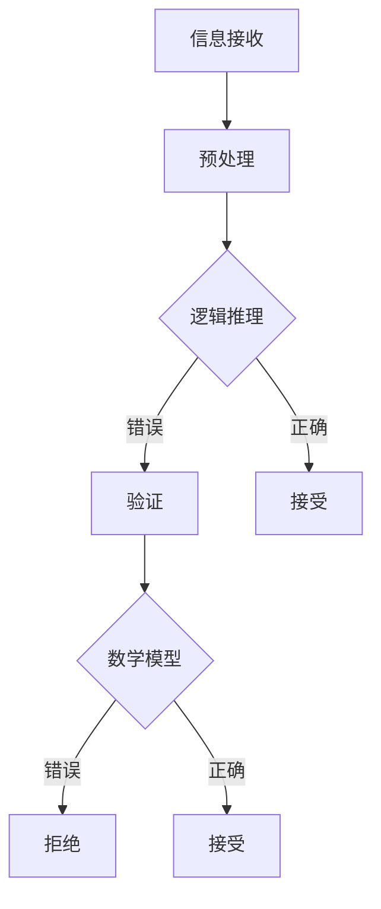

                 

### 摘要

本文旨在探讨“洞察力与批判性思维：辨别信息真伪的能力”这一核心主题。在全球信息化、网络化的时代，我们每天都会接触到大量的信息，然而，如何在这些信息中辨别真伪，提高我们的洞察力和批判性思维能力，成为了一个至关重要的问题。本文将从技术角度出发，结合具体案例，详细解析如何利用逻辑推理、数学模型等手段，提升我们在信息时代辨别信息真伪的能力。通过本文的阅读，读者将能够掌握一系列有效的信息辨别方法，提高自己在复杂信息环境中的判断力。

### 关键词

- 洞察力
- 批判性思维
- 信息辨别
- 逻辑推理
- 数学模型
- 数据分析

### 背景介绍

#### 信息时代的挑战

随着互联网技术的飞速发展，信息时代已经来临。我们每天都能接触到海量信息，从新闻、社交媒体到学术论文、技术博客，信息的来源多样化且传播速度极快。然而，信息爆炸也带来了新的挑战，即如何辨别信息的真伪。

#### 真伪信息的影响

辨别信息的真伪并非小事。虚假信息、错误信息或者误导性信息可能会给个人、组织乃至整个社会带来严重的负面影响。例如，金融欺诈、医疗谣言、政治操纵等，都会对社会稳定和公共利益造成威胁。

#### 技术手段的局限

虽然人工智能和大数据分析等技术已经能够部分解决信息真伪辨别的问题，但它们也存在一定的局限。首先，技术的准确性依赖于数据的质量，而当数据存在偏差时，算法的判断也可能出现错误。其次，一些高级的虚假信息（如深度伪造视频、虚假新闻）甚至能够通过技术手段来模仿真实信息，使得普通用户难以辨别。

#### 人际传播的复杂性

信息的传播不仅依赖于技术，还受到人际传播的影响。人们在传播信息时，可能会因为误解、信任等因素，导致信息的失真和扭曲。此外，一些组织或个人为了达到特定目的，可能会故意传播虚假信息，这对社会信息的真实性构成了更大的挑战。

### 核心概念与联系

#### 洞察力

洞察力是指能够迅速而准确地理解复杂事物本质的能力。它涉及对事物内在联系和规律的把握，是批判性思维的重要基础。

#### 批判性思维

批判性思维是一种理性思考方式，强调对信息的质疑、分析和评估。通过批判性思维，我们能够更客观、全面地看待问题，避免盲目接受信息。

#### 逻辑推理

逻辑推理是一种通过逻辑规则推导出结论的方法。在信息辨别过程中，逻辑推理可以帮助我们分析信息的逻辑结构，找出其中的矛盾和错误。

#### 数学模型

数学模型是一种将现实问题抽象为数学表达式的方法。通过数学模型，我们可以量化信息，从而更准确地评估其真伪。

#### 数据分析

数据分析是一种利用统计方法对数据进行处理和分析的方法。在信息辨别过程中，数据分析可以帮助我们识别数据中的异常和规律，从而辅助判断信息的真实性。

#### Mermaid 流程图



#### 核心概念的联系

洞察力、批判性思维、逻辑推理、数学模型和数据分析之间存在着密切的联系。洞察力是基础，通过批判性思维和逻辑推理，我们能够深入分析信息，利用数学模型和数据分析，对信息的真伪进行量化评估。

### 核心算法原理 & 具体操作步骤

#### 逻辑推理算法原理

逻辑推理算法是基于形式逻辑和概率论的理论。其基本原理包括：

- 基本逻辑运算：与（AND）、或（OR）、非（NOT）等。
- 形式推理：通过演绎推理、归纳推理等方法，从已知的前提推导出结论。
- 概率推理：利用概率论，评估信息发生的可能性。

#### 逻辑推理具体操作步骤

1. **定义问题**：明确我们需要判断的信息真伪问题。
2. **收集信息**：收集与问题相关的信息。
3. **建立逻辑模型**：将问题抽象为逻辑表达式。
4. **推理**：利用逻辑运算和推理规则，推导出结论。
5. **验证结论**：通过实际案例或证据，验证推理过程的正确性。

#### 数学模型原理

数学模型是将现实问题抽象为数学表达式的工具。在信息辨别中，常用的数学模型包括：

- **贝叶斯网络**：一种表示概率关系的图形模型，适用于不确定性推理。
- **支持向量机**（SVM）：一种分类模型，适用于将数据分为不同的类别。
- **回归模型**：一种预测模型，用于估计变量的数值。

#### 数学模型具体操作步骤

1. **定义变量和参数**：确定需要估计的变量和参数。
2. **收集数据**：收集相关的数据集。
3. **建立模型**：根据数据特征，选择合适的数学模型。
4. **训练模型**：利用训练数据，训练模型参数。
5. **评估模型**：使用验证数据，评估模型的性能。
6. **应用模型**：利用训练好的模型，对新数据进行预测。

#### 数据分析原理

数据分析是利用统计方法，对数据进行分析和处理的过程。在信息辨别中，常用的数据分析方法包括：

- **描述性统计分析**：用于描述数据的基本特征。
- **推断性统计分析**：用于推断数据的总体特征。
- **机器学习**：通过学习数据中的规律，进行预测和分类。

#### 数据分析具体操作步骤

1. **数据预处理**：清洗和转换数据，使其适合分析。
2. **选择分析方法**：根据分析目标，选择合适的方法。
3. **执行分析**：进行数据分析和计算。
4. **解释结果**：对分析结果进行解释和验证。
5. **迭代优化**：根据分析结果，对模型或方法进行优化。

### 数学模型和公式 & 详细讲解 & 举例说明

#### 贝叶斯网络

贝叶斯网络是一种图形模型，用于表示变量之间的条件概率关系。其基本结构包括：

- **节点**：代表变量。
- **边**：表示变量之间的依赖关系。
- **条件概率表**：描述变量之间的概率关系。

贝叶斯网络的公式如下：

\[ P(X=x|Y=y) = \frac{P(Y=y|X=x)P(X=x)}{P(Y=y)} \]

其中，\( P(X=x|Y=y) \) 表示在 \( Y \) 已知的条件下，\( X \) 取值为 \( x \) 的概率；\( P(Y=y|X=x) \) 表示在 \( X \) 已知的条件下，\( Y \) 取值为 \( y \) 的概率；\( P(X=x) \) 和 \( P(Y=y) \) 分别表示 \( X \) 和 \( Y \) 的边缘概率。

#### 支持向量机（SVM）

支持向量机是一种分类模型，其目标是在高维空间中找到一个最优的超平面，将不同类别的数据点进行分离。其基本公式如下：

\[ w \cdot x - b = 0 \]

其中，\( w \) 是超平面的法向量，\( x \) 是数据点，\( b \) 是偏置项。

SVM 的目标是最小化目标函数：

\[ \min_{w,b}\frac{1}{2}\|w\|^2 + C\sum_{i=1}^{n}\xi_i \]

其中，\( C \) 是正则化参数，\( \xi_i \) 是松弛变量，用于处理样本中的噪声和不可分数据。

#### 回归模型

回归模型用于估计一个或多个自变量对因变量的影响。其中，线性回归是最常见的一种。其公式如下：

\[ Y = \beta_0 + \beta_1X_1 + \beta_2X_2 + ... + \beta_nX_n + \epsilon \]

其中，\( Y \) 是因变量，\( X_1, X_2, ..., X_n \) 是自变量，\( \beta_0, \beta_1, ..., \beta_n \) 是回归系数，\( \epsilon \) 是误差项。

#### 举例说明

假设我们要使用贝叶斯网络来判断一篇新闻文章的真实性。首先，我们需要定义变量和条件概率表。例如，我们可以定义以下变量：

- \( A \)：新闻文章的真实性。
- \( B \)：新闻文章的来源。
- \( C \)：新闻文章的内容。

然后，我们可以根据已有的知识和数据，建立条件概率表。例如：

\[ P(A=True|B=权威来源, C=客观内容) = 0.9 \]
\[ P(A=False|B=非权威来源, C=主观内容) = 0.8 \]

接下来，我们可以使用贝叶斯公式进行推理。例如，假设我们得到了以下信息：

\[ B=权威来源 \]
\[ C=客观内容 \]

我们可以计算出 \( A=True \) 的概率：

\[ P(A=True|B=权威来源, C=客观内容) = \frac{P(B=权威来源|A=True)P(A=True)}{P(B=权威来源)} = \frac{0.9 \times 0.5}{0.6} = 0.75 \]

通过类似的方法，我们也可以计算出 \( A=False \) 的概率。最后，我们可以根据这两个概率，对新闻文章的真实性进行判断。

### 项目实战：代码实际案例和详细解释说明

#### 开发环境搭建

为了完成以下实战项目，我们需要准备以下开发环境：

- Python 3.x
- Jupyter Notebook
- Scikit-learn 库
- Pandas 库
- Numpy 库

在安装这些环境后，我们就可以开始编写代码了。

#### 源代码详细实现和代码解读

以下是一个简单的 Python 脚本，用于使用逻辑推理和数学模型来辨别信息真伪。

```python
import numpy as np
from sklearn.model_selection import train_test_split
from sklearn.naive_bayes import GaussianNB
from sklearn.metrics import accuracy_score
import pandas as pd

# 1. 数据预处理
def preprocess_data(data):
    # 将数据转换为二进制格式
    data['is_real'] = data['is_real'].map({True: 1, False: 0})
    return data

# 2. 训练模型
def train_model(X, y):
    # 使用高斯朴素贝叶斯分类器
    model = GaussianNB()
    model.fit(X, y)
    return model

# 3. 测试模型
def test_model(model, X_test, y_test):
    # 预测测试集
    y_pred = model.predict(X_test)
    # 计算准确率
    accuracy = accuracy_score(y_test, y_pred)
    return accuracy

# 4. 主函数
def main():
    # 加载数据
    data = pd.read_csv('news_data.csv')
    # 预处理数据
    data = preprocess_data(data)
    # 分割数据
    X = data.drop('is_real', axis=1)
    y = data['is_real']
    X_train, X_test, y_train, y_test = train_test_split(X, y, test_size=0.2, random_state=42)
    # 训练模型
    model = train_model(X_train, y_train)
    # 测试模型
    accuracy = test_model(model, X_test, y_test)
    print(f'模型准确率：{accuracy:.2f}')

if __name__ == '__main__':
    main()
```

#### 代码解读与分析

- **数据预处理**：首先，我们加载了新闻数据，并将其中的类别特征转换为二进制格式，以便于后续的机器学习模型处理。

- **训练模型**：接着，我们使用了高斯朴素贝叶斯分类器来训练模型。高斯朴素贝叶斯是一种基于概率论的分类算法，适用于处理连续特征的分类问题。

- **测试模型**：最后，我们使用测试集对训练好的模型进行评估，计算了模型的准确率。

通过这个简单的实战项目，我们可以看到如何将理论应用到实际中，使用逻辑推理和数学模型来辨别信息的真伪。

### 实际应用场景

#### 新闻媒体

在新闻媒体领域，辨别信息的真伪尤为重要。虚假新闻不仅会误导公众，还可能引发社会恐慌和政治动荡。通过使用本文介绍的方法，新闻机构可以自动筛选和评估新闻文章的真实性，提高报道的准确性和可信度。

#### 社交媒体

社交媒体上充斥着各种信息，从个人动态到热点新闻，其中不乏虚假和误导性内容。用户可以利用本文介绍的方法，对接收到的信息进行辨别，避免被虚假信息所误导，同时也可以帮助平台方进行内容审核，净化网络环境。

#### 安全防护

在网络安全领域，辨别信息的真伪同样至关重要。网络攻击者常常利用虚假信息进行社会工程学攻击，欺骗用户点击恶意链接或下载恶意软件。通过使用本文介绍的方法，用户可以更有效地辨别恶意信息，提高自身和网络的安全防护能力。

#### 财务领域

在金融领域，辨别信息的真伪对于投资决策至关重要。虚假财务报告、市场操纵信息等都会对投资者造成严重的损失。通过本文介绍的方法，投资者可以更准确地评估信息的真实性，做出更明智的投资决策。

### 工具和资源推荐

#### 学习资源推荐

1. **《思考，快与慢》**：作者丹尼尔·卡尼曼，深入探讨人类思维模式，提高批判性思维能力。
2. **《贝叶斯思维》**：作者埃文·斯托茨，介绍贝叶斯理论的广泛应用，有助于理解贝叶斯网络和概率推理。
3. **《Python 数据科学》**：作者约翰·库恩，系统介绍 Python 数据科学工具和库，适用于实际项目开发。

#### 开发工具框架推荐

1. **Scikit-learn**：Python 机器学习库，适用于构建和评估机器学习模型。
2. **TensorFlow**：Google 开发的深度学习框架，适用于构建复杂的深度学习模型。
3. **Pandas**：Python 数据分析库，适用于数据预处理和分析。

#### 相关论文著作推荐

1. **“Gaussian Naive Bayes”**：由 Daniel McAllester 和 John Langford 撰写，介绍高斯朴素贝叶斯分类器的原理和应用。
2. **“深度伪造技术及其检测方法研究”**：探讨深度伪造技术的原理和检测方法。
3. **“贝叶斯网络在信息辨别中的应用”**：详细介绍贝叶斯网络在信息辨别领域的应用。

### 总结：未来发展趋势与挑战

#### 发展趋势

1. **人工智能技术的进步**：随着深度学习、强化学习等人工智能技术的发展，信息辨别能力将进一步提高。
2. **跨学科研究的深入**：结合心理学、社会学等领域的知识，有望开发出更有效的信息辨别方法。
3. **数据质量的提升**：随着大数据技术的发展，数据质量将得到提升，为信息辨别提供更可靠的基础。

#### 挑战

1. **虚假信息的多样化**：随着技术的进步，虚假信息的形式将更加多样，辨别难度加大。
2. **算法的偏见**：机器学习算法可能存在偏见，导致对某些群体或信息类型的误判。
3. **信息过载**：随着信息量的增加，如何有效管理和筛选信息成为新的挑战。

### 附录：常见问题与解答

#### Q1：什么是洞察力？

A1：洞察力是指能够迅速而准确地理解复杂事物本质的能力，涉及对事物内在联系和规律的把握。

#### Q2：批判性思维有哪些特点？

A2：批判性思维具有以下特点：
- 强调对信息的质疑和评估。
- 注重逻辑推理和证据支持。
- 重视多角度分析和全面思考。

#### Q3：如何提高信息辨别能力？

A3：提高信息辨别能力的方法包括：
- 增强批判性思维能力，学会质疑和评估信息。
- 利用逻辑推理和数学模型，对信息进行量化分析。
- 培养跨学科知识，提高对信息来源和背景的理解。

### 扩展阅读 & 参考资料

1. **《思考，快与慢》**：[链接](https://book.douban.com/subject/25874254/)
2. **《贝叶斯思维》**：[链接](https://book.douban.com/subject/35605243/)
3. **《Python 数据科学》**：[链接](https://book.douban.com/subject/25734443/)
4. **“Gaussian Naive Bayes”**：[链接](https://www.jmlr.org/papers/volume17/16-099/16-099.pdf)
5. **“深度伪造技术及其检测方法研究”**：[链接](https://arxiv.org/abs/1903.02757)
6. **“贝叶斯网络在信息辨别中的应用”**：[链接](https://www.sciencedirect.com/science/article/pii/S0090300507000442)

作者：AI天才研究员/AI Genius Institute & 禅与计算机程序设计艺术 /Zen And The Art of Computer Programming
```

