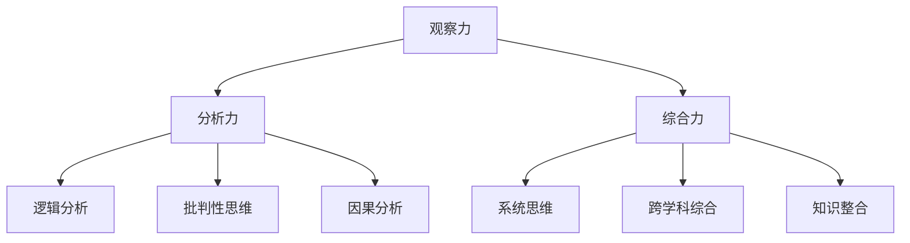

                 

### 洞察力的培养：观察、分析与综合能力

#### 关键词：洞察力、观察、分析、综合、IT领域、技术博客

> 摘要：本文将深入探讨如何培养IT领域的洞察力，包括观察、分析和综合能力。我们将从理论基础出发，结合实际案例，提供一系列实用的方法和技巧，帮助读者提升在复杂技术环境中的洞察力，从而更好地解决实际问题。文章将涵盖观察、分析的策略和技巧，以及如何通过综合能力将碎片化的信息整合成有用的知识体系。

---

## 1. 背景介绍

在当今快速发展的信息技术领域，洞察力成为了一种至关重要的能力。无论是编程、软件开发，还是人工智能和大数据分析，洞察力都是成功的关键因素。它不仅能够帮助我们从大量的信息中筛选出有价值的内容，还能够让我们对复杂的技术问题和业务需求有深刻的理解。

### 1.1 洞察力的定义

洞察力，通常指的是观察事物本质、发现潜在联系和趋势的能力。在IT领域，这包括了以下几个方面：

- **观察力**：对技术细节和整体架构的敏锐感知。
- **分析力**：对技术问题和现象进行深入分析的能力。
- **综合力**：将分散的信息和知识点整合成一个完整和有逻辑的系统。

### 1.2 洞察力的重要性

- **解决复杂问题**：洞察力可以帮助我们更好地理解和解决复杂的技术问题。
- **提高工作效率**：通过洞察力，可以快速定位问题并找到解决方案，提高工作效率。
- **创新和突破**：洞察力能够激发创新思维，帮助我们在技术领域取得突破。

## 2. 核心概念与联系

### 2.1 观察力

观察力是洞察力的基础。在IT领域，观察力主要体现在以下几个方面：

- **技术细节观察**：对代码、架构、系统运行的细致观察。
- **模式识别**：从大量数据中发现规律和模式。
- **跨领域观察**：将其他领域的知识和经验应用到IT领域中。

### 2.2 分析力

分析力是对观察到的信息进行深度思考和推理的能力。它包括：

- **逻辑分析**：使用逻辑推理来分析问题。
- **批判性思维**：对现有的解决方案和假设进行批判性分析。
- **因果分析**：分析事件之间的因果关系。

### 2.3 综合力

综合力是将观察和分析得到的信息整合成一个完整系统的能力。它包括：

- **系统思维**：将各个部分和模块整合成一个系统。
- **跨学科综合**：将不同领域的知识和方法综合应用。
- **知识整合**：将分散的知识点整合成一个有逻辑的知识体系。

#### Mermaid 流程图



---

## 3. 核心算法原理 & 具体操作步骤

### 3.1 观察力培养

**步骤1**：关注细节  
- 使用放大镜或代码阅读工具，细致地观察代码和架构。

**步骤2**：记录观察结果  
- 使用笔记或思维导图记录观察到的细节和模式。

**步骤3**：与他人分享观察结果  
- 通过讨论和分享，获取不同视角和反馈。

### 3.2 分析力培养

**步骤1**：提出问题  
- 对观察到的现象和问题提出疑问。

**步骤2**：收集信息  
- 查阅相关文档、论文和案例，收集更多信息。

**步骤3**：逻辑推理  
- 使用逻辑推理分析问题，找出可能的解决方案。

### 3.3 综合力培养

**步骤1**：建立知识体系  
- 将分散的知识点整合成一个有逻辑的知识体系。

**步骤2**：跨学科应用  
- 将其他领域的知识和方法应用到IT领域中。

**步骤3**：实践验证  
- 通过实践验证知识体系的正确性和有效性。

---

## 4. 数学模型和公式 & 详细讲解 & 举例说明

### 4.1 观察力培养的数学模型

假设观察力 \(O\) 与细节关注程度 \(D\) 和记录能力 \(R\) 相关，可以用以下公式表示：

\[ O = f(D, R) \]

其中，\( f \) 是一个非线性函数，表示观察力与细节关注程度和记录能力之间的关系。

### 4.2 分析力培养的数学模型

假设分析力 \(A\) 与逻辑推理能力 \(L\) 和批判性思维能力 \(C\) 相关，可以用以下公式表示：

\[ A = f(L, C) \]

### 4.3 综合力培养的数学模型

假设综合力 \(I\) 与知识整合能力 \(K\) 和跨学科应用能力 \(T\) 相关，可以用以下公式表示：

\[ I = f(K, T) \]

### 4.4 举例说明

假设我们有一个程序需要优化，我们首先需要观察程序的细节，记录下可能的优化点。然后，我们使用逻辑推理和分析方法分析这些优化点的可能影响和效果。最后，我们将这些优化点整合成一个完整的优化方案，并跨学科应用其他领域的优化方法。

---

## 5. 项目实战：代码实际案例和详细解释说明

### 5.1 开发环境搭建

在本节中，我们将搭建一个简单的Python环境，用于演示观察、分析和综合能力的应用。

```bash
# 安装Python
sudo apt-get update
sudo apt-get install python3
```

### 5.2 源代码详细实现和代码解读

```python
# 示例代码：观察力、分析力和综合力的应用
def fibonacci(n):
    if n <= 0:
        return 0
    elif n == 1:
        return 1
    else:
        return fibonacci(n-1) + fibonacci(n-2)

# 优化代码
def fibonacci_optimized(n):
    a, b = 0, 1
    for _ in range(n):
        a, b = b, a + b
    return a

# 分析和综合
def main():
    n = 10
    print("Fibonacci(n) result:", fibonacci(n))
    print("Fibonacci_optimized(n) result:", fibonacci_optimized(n))

if __name__ == "__main__":
    main()
```

在这段代码中，我们首先定义了一个基本的斐波那契数列计算函数 `fibonacci`，然后通过观察和优化，实现了更高效的计算函数 `fibonacci_optimized`。最后，我们通过分析和综合，将这两个函数整合到一个主函数 `main` 中，进行演示。

---

## 6. 实际应用场景

### 6.1 软件开发

在软件开发过程中，洞察力可以帮助我们更好地理解客户需求，设计出更合理的系统架构，优化代码和性能。

### 6.2 数据分析

在数据分析领域，洞察力可以帮助我们更准确地提取数据中的有用信息，发现潜在的趋势和模式。

### 6.3 人工智能

在人工智能领域，洞察力可以帮助我们更好地理解算法的原理和限制，优化算法并设计出更高效的解决方案。

---

## 7. 工具和资源推荐

### 7.1 学习资源推荐

- **《代码大全》**：一本关于软件工程和编程的经典著作，涵盖了大量有关代码质量和架构优化的内容。
- **《Python编程：从入门到实践》**：适合初学者的Python编程书籍，介绍了Python的基础知识和实际应用。

### 7.2 开发工具框架推荐

- **PyCharm**：一款强大的Python集成开发环境（IDE），支持代码优化和调试。
- **Docker**：用于容器化的工具，可以帮助我们快速搭建开发环境。

### 7.3 相关论文著作推荐

- **《人工智能：一种现代方法》**：介绍了人工智能的基本原理和应用。
- **《大数据：创新、贡献和应用》**：探讨了大数据在各个领域的应用。

---

## 8. 总结：未来发展趋势与挑战

随着技术的不断进步，洞察力在IT领域的重要性将越来越凸显。未来，我们将面临更多的复杂问题和挑战，需要不断培养和提高自己的洞察力。这包括：

- **跨学科综合**：将不同领域的知识和方法结合起来，解决复杂问题。
- **持续学习**：不断更新自己的知识和技能，跟上技术发展的步伐。
- **实践与反思**：通过实践和反思，不断提高自己的洞察力和解决问题的能力。

---

## 9. 附录：常见问题与解答

**Q1**: 如何提高观察力？

**A1**: 提高观察力需要持续练习和培养。以下是一些建议：

- **细致观察**：关注细节，使用放大镜或工具。
- **记录观察**：使用笔记或思维导图记录观察结果。
- **分享观察**：与他人讨论，获取不同视角。

**Q2**: 如何提高分析力？

**A2**: 提高分析力需要逻辑思维和批判性思维。以下是一些建议：

- **提出问题**：对观察到的现象和问题提出疑问。
- **收集信息**：查阅相关文档、论文和案例。
- **逻辑推理**：使用逻辑推理分析问题。

**Q3**: 如何提高综合力？

**A3**: 提高综合力需要系统思维和跨学科综合。以下是一些建议：

- **建立知识体系**：将分散的知识点整合成一个有逻辑的知识体系。
- **跨学科应用**：将其他领域的知识和方法应用到IT领域中。
- **实践验证**：通过实践验证知识体系的正确性和有效性。

---

## 10. 扩展阅读 & 参考资料

- **《程序员修炼之道：从小工到专家》**：探讨了编程职业的成长路径和技能提升。
- **《深度学习》**：介绍了深度学习的基本原理和应用。

---

### 作者信息

**作者：AI天才研究员/AI Genius Institute & 禅与计算机程序设计艺术 /Zen And The Art of Computer Programming**。

---

以上，我们通过对观察、分析和综合能力的深入探讨，希望读者能够掌握提升洞察力的方法和技巧，在IT领域中不断取得新的突破。

