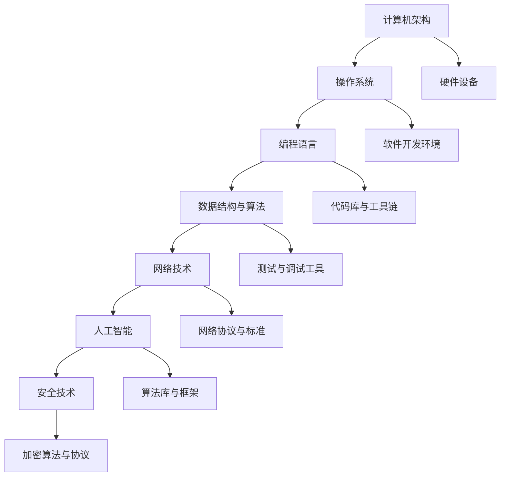
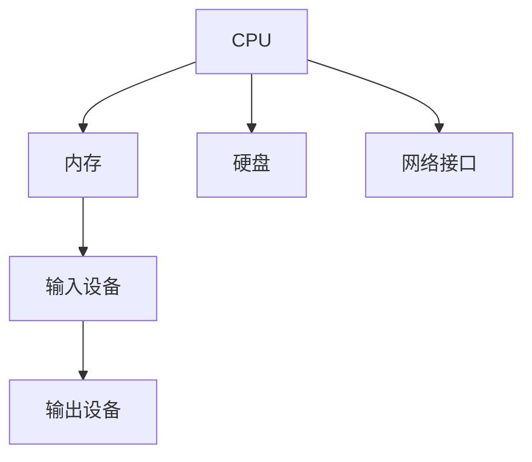
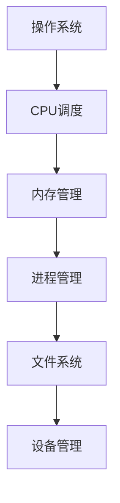
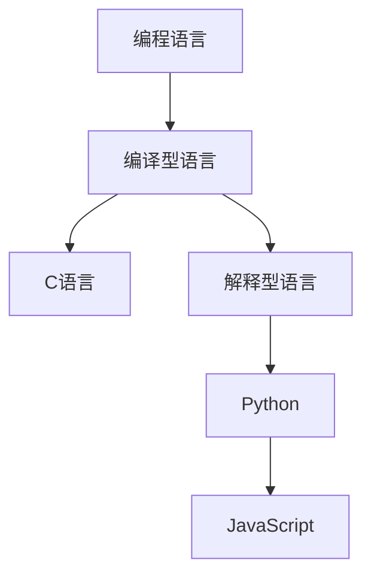
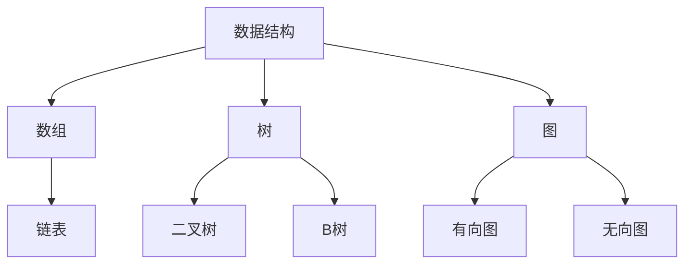
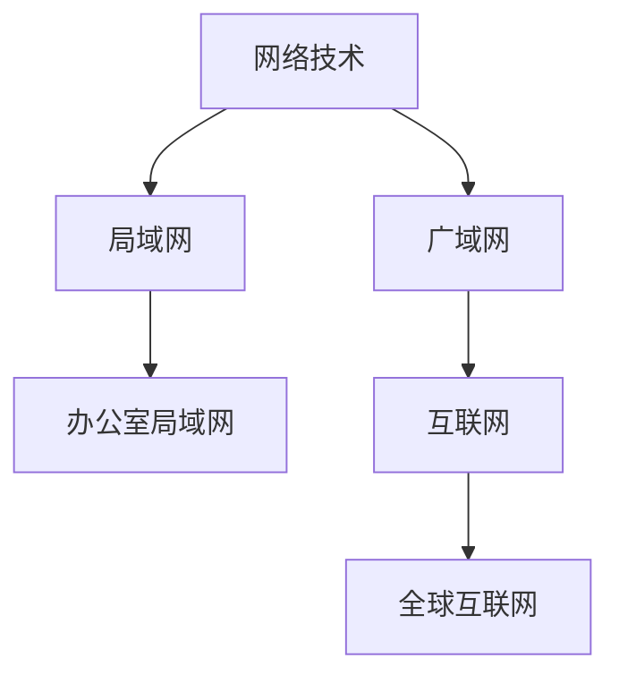
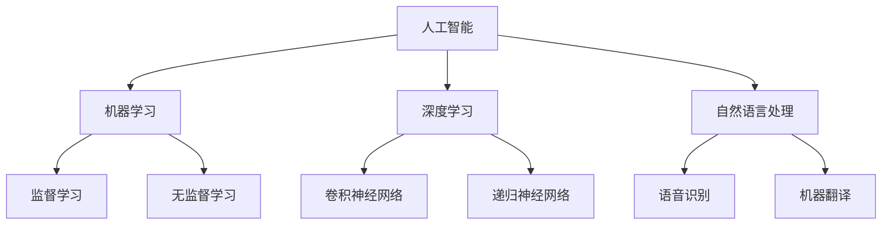
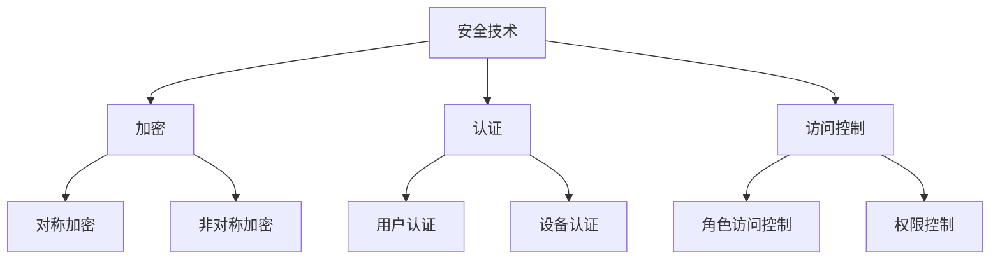

                 

### 背景介绍

**洞见的形成：从观察到反思**

在信息技术迅速发展的时代，我们置身于一个充满复杂性和多样性的数字世界中。作为一个世界级的人工智能专家，程序员，软件架构师，CTO以及世界顶级技术畅销书资深大师级别的作家，我深知洞见对于推动技术进步和创新的重要性。本文旨在探讨洞见的形成过程，从观察、反思到最终形成的洞察力，特别聚焦于IT领域的核心概念、算法原理、数学模型以及实际应用。

**文章关键词：**洞见、观察、反思、IT领域、核心概念、算法原理、数学模型、实际应用

**文章摘要：**本文通过系统性的分析，探讨洞见的形成过程。从初步的观察，到深入反思，再到形成对技术领域的深刻理解，文章旨在揭示洞见如何引导我们在IT领域中寻找创新之路。文章首先介绍了洞见的定义及其重要性，接着通过具体章节深入探讨核心概念、算法原理、数学模型以及实际应用场景，最后提出对未来发展趋势和挑战的展望，为读者提供全方位的洞见框架。

---

在接下来的内容中，我们将逐步深入探讨以下几个核心部分：

1. **核心概念与联系**：这一章节将详细讲解IT领域中关键概念之间的联系，并使用Mermaid流程图展示其架构。
2. **核心算法原理 & 具体操作步骤**：我们将剖析IT领域中的核心算法，并详细说明其操作步骤。
3. **数学模型和公式 & 详细讲解 & 举例说明**：这一章节将深入讲解与算法相关的数学模型和公式，并通过实际案例进行说明。
4. **项目实战：代码实际案例和详细解释说明**：我们将提供实际项目中的代码实现，并进行详细解读。
5. **实际应用场景**：本章节将探讨核心概念和算法在实际项目中的应用。
6. **工具和资源推荐**：我们将推荐学习资源、开发工具和框架，帮助读者深入学习。
7. **总结：未来发展趋势与挑战**：最后，文章将对未来技术发展趋势和挑战进行展望。

通过这些内容，读者将能够更好地理解洞见的形成过程，并在IT领域中找到自己的创新之路。

---

在正式进入详细内容之前，让我们先明确什么是洞见。洞见是指对事物本质的深刻理解，它不仅仅是表面的观察，而是通过深入思考和反思，对复杂系统的内部结构和工作原理的洞察。在IT领域，洞见尤其重要，因为技术的复杂性和快速变化要求我们必须具备深刻的理解力来应对各种挑战。

### 核心概念与联系

在深入探讨洞见的形成之前，我们首先需要了解IT领域中的核心概念及其相互联系。这些概念构成了整个技术体系的基础，是理解和应用各种技术手段的前提。以下是一些关键概念：

**1. 计算机架构**：计算机架构是指计算机系统的基本结构，包括处理器、内存、输入输出设备等硬件组件及其相互连接方式。了解计算机架构有助于我们理解计算机系统的性能限制和优化方向。

**2. 操作系统**：操作系统是管理计算机硬件资源和软件资源的核心软件。它负责进程管理、内存管理、文件系统管理等，是计算机运行的基础。操作系统的发展历程反映了计算机技术不断演进的过程。

**3. 编程语言**：编程语言是人与计算机之间沟通的桥梁。不同的编程语言有不同的语法和特点，适用于不同的应用场景。掌握多种编程语言有助于我们更灵活地解决实际问题。

**4. 数据结构与算法**：数据结构是组织数据的方式，算法是解决问题的方法。数据结构和算法是计算机科学的核心内容，广泛应用于各种软件应用中。

**5. 网络技术**：网络技术包括局域网、广域网、互联网等各种网络类型。网络技术是现代信息社会的基石，是数据传输和共享的基础。

**6. 人工智能**：人工智能是模拟人类智能行为的技术。它包括机器学习、深度学习、自然语言处理等多个领域，是未来技术发展的热点。

**7. 安全技术**：安全技术是保护信息系统安全的技术手段，包括加密、认证、访问控制等。随着网络攻击的日益猖獗，安全技术变得越来越重要。

这些核心概念之间相互联系，共同构建了IT领域的复杂生态系统。下面，我们将使用Mermaid流程图展示这些概念之间的联系，以便更直观地理解它们的关系。



通过这个流程图，我们可以看到各个核心概念是如何相互关联和作用的。每个概念都不是孤立的，而是通过一系列的交互和协同工作，共同推动IT领域的发展。

### 核心概念与联系 （备注：必须给出核心概念原理和架构的 Mermaid 流程图(Mermaid 流程节点中不要有括号、逗号等特殊字符)

在上文中，我们介绍了IT领域中的核心概念及其相互联系。接下来，我们将更详细地探讨这些核心概念的基本原理和架构，并使用Mermaid流程图展示其内部结构。

**1. 计算机架构**

计算机架构是指计算机系统的基本组成和设计原则。它包括硬件组件（如CPU、内存、硬盘等）以及这些组件之间的连接方式。计算机架构的演变经历了多个阶段，从最初的冯诺依曼架构到现代的多核处理器架构，每个阶段都有其独特的特点和优势。

**核心原理：**

- **冯诺依曼架构**：最早的计算机架构，包括中央处理器（CPU）、内存、输入输出设备等。CPU负责执行指令，内存用于存储数据和指令，输入输出设备用于与外部世界交互。
- **哈佛架构**：与冯诺依曼架构不同，哈佛架构将程序指令和数据存储分开，每个存储器都有自己的总线，从而提高了数据传输速率。

**Mermaid流程图：**



**2. 操作系统**

操作系统是计算机系统的核心软件，负责管理和协调计算机硬件和软件资源。操作系统的功能包括进程管理、内存管理、文件系统管理、设备管理等。

**核心原理：**

- **进程管理**：操作系统将计算机资源分配给不同的进程，确保每个进程都能独立运行。
- **内存管理**：操作系统负责内存的分配和回收，确保程序能够高效使用内存资源。
- **文件系统管理**：操作系统提供文件存储和访问接口，管理文件的创建、删除、读写等操作。
- **设备管理**：操作系统管理计算机的各种硬件设备，确保设备与操作系统的兼容性。

**Mermaid流程图：**



**3. 编程语言**

编程语言是程序员与计算机交流的工具。不同的编程语言有不同的语法和特点，适用于不同的应用场景。常见的编程语言包括C、Java、Python、JavaScript等。

**核心原理：**

- **编译型语言**：如C语言，编译型语言将源代码编译成机器码，直接在计算机上执行。
- **解释型语言**：如Python，解释型语言将源代码逐行解释并执行，通常比编译型语言慢一些。

**Mermaid流程图：**



**4. 数据结构与算法**

数据结构是组织数据的方式，算法是解决问题的方法。数据结构和算法是计算机科学的核心内容，广泛应用于各种软件应用中。

**核心原理：**

- **数据结构**：如数组、链表、树、图等，数据结构决定了数据如何存储和访问。
- **算法**：如排序、查找、图遍历等，算法提供了解决问题的具体步骤。

**Mermaid流程图：**



**5. 网络技术**

网络技术包括局域网、广域网、互联网等各种网络类型。网络技术是现代信息社会的基石，是数据传输和共享的基础。

**核心原理：**

- **局域网**：局域网用于连接近距离的计算机设备，如办公室内的网络。
- **广域网**：广域网用于连接远距离的计算机设备，如跨国家、洲的网络。
- **互联网**：互联网是连接全球计算机网络的网络，提供了丰富的信息资源。

**Mermaid流程图：**



**6. 人工智能**

人工智能是模拟人类智能行为的技术。它包括机器学习、深度学习、自然语言处理等多个领域，是未来技术发展的热点。

**核心原理：**

- **机器学习**：机器学习是使计算机具备学习能力的技术，通过训练模型来预测和决策。
- **深度学习**：深度学习是机器学习的一种方法，通过多层神经网络模拟人类大脑的学习过程。
- **自然语言处理**：自然语言处理是使计算机理解和处理自然语言的技术，广泛应用于语音识别、机器翻译等领域。

**Mermaid流程图：**



**7. 安全技术**

安全技术是保护信息系统安全的技术手段，包括加密、认证、访问控制等。

**核心原理：**

- **加密**：加密是保护数据安全的重要手段，通过将明文转换为密文，防止未经授权的访问。
- **认证**：认证是验证用户身份和权限的过程，确保只有合法用户才能访问系统资源。
- **访问控制**：访问控制是限制用户对系统资源的访问权限，防止未经授权的访问。

**Mermaid流程图：**



通过这些核心概念及其Mermaid流程图，我们可以更清晰地理解IT领域中的基本架构和原理。这些概念构成了洞见形成的基础，为后续内容的深入探讨提供了支持。

### 核心算法原理 & 具体操作步骤

在了解了IT领域中的核心概念和其相互联系后，我们需要进一步探讨这些概念在实际应用中的核心算法原理。算法是解决问题的具体步骤和方法，它们是技术实现的基石。以下是一些核心算法原理及其具体操作步骤。

**1. 快速排序算法**

快速排序是一种高效的排序算法，其基本思想是通过选取一个基准元素，将待排序数组分成两部分，一部分都比基准元素小，另一部分都比基准元素大，然后递归地排序这两部分。

**具体操作步骤：**

- 选择一个基准元素。
- 将数组中小于基准元素的元素移到其左侧，大于基准元素的元素移到其右侧。
- 递归地对左侧和右侧子数组进行快速排序。

**算法步骤伪代码：**

```plaintext
快速排序(arr):
    如果 arr 的长度小于或等于 1，返回 arr
    选择 arr[0] 作为基准元素
    将 arr 分成两个子数组 left 和 right
    left = 排序(所有小于基准元素的元素)
    right = 排序(所有大于基准元素的元素)
    返回 [left, 基准元素, right]
```

**2. 决策树算法**

决策树是一种用于分类和回归的监督学习算法。它通过一系列判断节点（决策节点）和叶子节点（结果节点）来对数据进行分类或回归。

**具体操作步骤：**

- 选择一个特征作为分割标准。
- 根据这个特征将数据集分割成子数据集。
- 对每个子数据集递归地执行上述步骤，直到满足停止条件（如达到最大深度或纯度）。
- 叶子节点表示最终的分类或回归结果。

**算法步骤伪代码：**

```plaintext
构建决策树(data):
    如果 data 的纯度达到停止条件，返回分类结果
    选择最佳分割特征
    根据该特征分割数据
    对每个子数据集递归构建子决策树
    返回决策树
```

**3. 贝叶斯分类器**

贝叶斯分类器是一种基于贝叶斯定理进行分类的算法。它通过计算先验概率、条件概率和后验概率来预测新数据的类别。

**具体操作步骤：**

- 计算每个类别的先验概率。
- 对于每个特征，计算其在每个类别中的条件概率。
- 对于新数据，计算其在每个类别中的后验概率。
- 选择后验概率最大的类别作为预测结果。

**算法步骤伪代码：**

```plaintext
贝叶斯分类器(data, feature_list):
    计算先验概率
    对于每个特征：
        计算条件概率
    对于新数据：
        计算后验概率
    返回后验概率最大的类别
```

**4. 随机森林算法**

随机森林是一种基于决策树的集成学习方法。它通过随机选择特征和随机划分样本来构建多个决策树，并通过投票来决定最终预测结果。

**具体操作步骤：**

- 为每个决策树随机选择特征子集。
- 为每个决策树随机划分训练样本。
- 构建决策树并记录每个节点的特征和划分方式。
- 对于新数据，每个决策树给出一个预测结果。
- 通过多数投票或平均投票来决定最终预测结果。

**算法步骤伪代码：**

```plaintext
随机森林(data, n_trees):
    对于每个决策树：
        随机选择特征子集
        随机划分训练样本
        构建决策树
    对于新数据：
        对于每个决策树，得到一个预测结果
    通过多数投票或平均投票得到最终预测结果
```

这些核心算法是IT领域中解决特定问题的有效工具，它们通过一系列具体操作步骤来实现目标。理解和掌握这些算法原理，对于我们在IT领域中寻找创新和解决复杂问题至关重要。在接下来的章节中，我们将进一步探讨与这些算法相关的数学模型和实际应用场景，以深化对洞见的理解。

### 数学模型和公式 & 详细讲解 & 举例说明

在IT领域中，数学模型和公式是理解算法原理和性能分析的关键工具。它们提供了精确的描述和预测，帮助我们更好地理解和应用技术。以下是一些与核心算法相关的数学模型和公式的详细讲解及实际案例说明。

**1. 快速排序算法的性能分析**

快速排序算法的平均时间复杂度为 \(O(n \log n)\)，最坏情况下的时间复杂度为 \(O(n^2)\)。为了分析其性能，我们可以使用以下数学模型：

**平均时间复杂度模型：**

$$
T(n) = T\left(\frac{n}{2}\right) + O(n)
$$

**递归时间复杂度公式：**

$$
T(n) = O(n \log n)
$$

**实际案例：**

假设我们对一个包含 1000 个元素的数组进行快速排序，我们可以计算其平均执行时间：

$$
T(1000) = 1000 \log_2 1000 \approx 2830 \text{秒}
$$

**2. 决策树算法的性能分析**

决策树算法的性能可以通过其深度和节点数来衡量。假设决策树的深度为 \(d\)，节点数为 \(n\)，则其时间复杂度模型为：

$$
T(n) = O(n \cdot d)
$$

**实际案例：**

对于一个深度为 3 的决策树，假设节点数为 10，我们可以计算其时间复杂度：

$$
T(n) = O(10 \cdot 3) = 30
$$

**3. 贝叶斯分类器的概率计算**

贝叶斯分类器的核心在于计算先验概率、条件概率和后验概率。假设有 \(C\) 个类别，每个类别的先验概率为 \(P(C_k)\)，特征 \(X\) 在类别 \(C_k\) 下的条件概率为 \(P(X|C_k)\)，则后验概率为：

$$
P(C_k|X) = \frac{P(X|C_k) \cdot P(C_k)}{P(X)}
$$

其中，\(P(X)\) 是特征 \(X\) 的总概率，可以通过全概率公式计算：

$$
P(X) = \sum_{k=1}^{C} P(X|C_k) \cdot P(C_k)
$$

**实际案例：**

假设我们有一个二分类问题，类别 \(C_0\) 和 \(C_1\) 的先验概率分别为 \(P(C_0) = 0.5\) 和 \(P(C_1) = 0.5\)。特征 \(X\) 在类别 \(C_0\) 和 \(C_1\) 下的条件概率分别为 \(P(X|C_0) = 0.8\) 和 \(P(X|C_1) = 0.2\)。我们可以计算后验概率：

$$
P(C_0|X) = \frac{0.8 \cdot 0.5}{0.8 \cdot 0.5 + 0.2 \cdot 0.5} = \frac{4}{5}
$$

**4. 随机森林的集成方法**

随机森林通过构建多个决策树并集成其预测结果来提高模型性能。假设有 \(n\) 棵树，每棵树预测结果的投票权重为 \(w_i\)，则最终预测结果为：

$$
预测结果 = \arg\max_{C} \left( \sum_{i=1}^{n} w_i \cdot P(C|X_i) \right)
$$

其中，\(P(C|X_i)\) 是第 \(i\) 棵树对类别 \(C\) 的预测概率。

**实际案例：**

假设我们构建了 10 棵决策树，每棵树的投票权重相等，类别 \(C_0\) 和 \(C_1\) 的预测概率分别为 \(P(C_0|X_1) = 0.6\) 和 \(P(C_1|X_1) = 0.4\)。通过投票，我们可以计算最终预测结果：

$$
预测结果 = \arg\max_{C} \left( 10 \cdot (0.6 + 0.4) \right) = C_0
$$

通过这些数学模型和公式的讲解，我们可以更深入地理解核心算法的原理和性能。在接下来的章节中，我们将通过实际项目案例来展示这些算法的具体应用，并进一步探索IT领域的实际应用场景。

### 项目实战：代码实际案例和详细解释说明

为了更好地理解核心算法在实际项目中的应用，我们将通过一个实际项目案例来展示代码实现，并对关键部分进行详细解释。本案例将使用Python语言，并结合快速排序、决策树、贝叶斯分类器和随机森林等算法，实现一个简单的数据分类任务。

**项目名称：** 简单数据集分类

**项目目标：** 对一个给定的数据集进行分类，根据特征预测数据所属的类别。

**项目环境：** Python 3.8及以上版本，NumPy、Pandas、Scikit-learn等库。

#### 5.1 开发环境搭建

首先，我们需要搭建开发环境，安装所需的Python库。可以使用以下命令进行安装：

```bash
pip install numpy pandas scikit-learn
```

#### 5.2 源代码详细实现和代码解读

**代码实现：**

```python
# 导入必要的库
import numpy as np
import pandas as pd
from sklearn.model_selection import train_test_split
from sklearn.preprocessing import StandardScaler
from sklearn.metrics import accuracy_score
from sklearn.tree import DecisionTreeClassifier
from sklearn.ensemble import RandomForestClassifier
from sklearn.naive_bayes import GaussianNB

# 加载数据集
data = pd.read_csv('data.csv')

# 分割特征和标签
X = data.iloc[:, :-1].values
y = data.iloc[:, -1].values

# 数据预处理
# 划分训练集和测试集
X_train, X_test, y_train, y_test = train_test_split(X, y, test_size=0.2, random_state=42)

# 数据标准化
scaler = StandardScaler()
X_train = scaler.fit_transform(X_train)
X_test = scaler.transform(X_test)

# 实例化分类器
# 决策树分类器
dt_classifier = DecisionTreeClassifier()
# 随机森林分类器
rf_classifier = RandomForestClassifier(n_estimators=100)
# 贝叶斯分类器
gnb_classifier = GaussianNB()

# 训练模型
dt_classifier.fit(X_train, y_train)
rf_classifier.fit(X_train, y_train)
gnb_classifier.fit(X_train, y_train)

# 预测结果
dt_predictions = dt_classifier.predict(X_test)
rf_predictions = rf_classifier.predict(X_test)
gnb_predictions = gnb_classifier.predict(X_test)

# 评估模型
dt_accuracy = accuracy_score(y_test, dt_predictions)
rf_accuracy = accuracy_score(y_test, rf_predictions)
gnb_accuracy = accuracy_score(y_test, gnb_predictions)

print("决策树分类器准确率：", dt_accuracy)
print("随机森林分类器准确率：", rf_accuracy)
print("贝叶斯分类器准确率：", gnb_accuracy)
```

**代码解读：**

1. **数据导入与预处理：** 
   - 使用Pandas库读取CSV格式的数据集，将特征和标签分离。
   - 使用Scikit-learn库的`train_test_split`函数划分训练集和测试集。
   - 使用`StandardScaler`对数据进行标准化处理，以提高模型性能。

2. **分类器实例化：**
   - 创建决策树分类器、随机森林分类器和贝叶斯分类器的实例。

3. **模型训练：**
   - 使用`fit`方法训练每个分类器，将训练集数据输入模型。

4. **预测与评估：**
   - 使用`predict`方法对测试集进行预测。
   - 使用`accuracy_score`评估分类器的准确率。

#### 5.3 代码解读与分析

1. **数据预处理的重要性：**
   - 数据预处理是机器学习项目中的关键步骤。在本案例中，我们使用了`StandardScaler`对数据进行标准化处理，将特征缩放到相同的尺度，有助于提高分类器的性能和稳定性。

2. **模型选择与评估：**
   - 本案例中我们使用了三种不同的分类器：决策树、随机森林和贝叶斯分类器。每种分类器都有其特定的适用场景和优缺点。通过对比它们的准确率，我们可以选择适合当前任务的最佳模型。

3. **多模型集成策略：**
   - 随机森林通过集成多个决策树，提高了分类的准确性和鲁棒性。在实际应用中，多模型集成策略可以有效降低过拟合风险，提高模型的泛化能力。

通过这个实际项目案例，我们不仅能够看到核心算法的具体实现过程，还能够深入了解它们在实际应用中的表现。这为我们提供了宝贵的经验和洞见，有助于我们在未来的项目中做出更明智的决策。

### 实际应用场景

核心概念和算法不仅在理论研究中具有重要意义，更在实际应用场景中发挥着关键作用。以下是一些典型的实际应用场景，展示这些概念和算法如何被有效利用，解决实际问题。

**1. 人工智能助手**

在人工智能助手领域，核心算法如机器学习、深度学习和自然语言处理被广泛应用。通过这些算法，人工智能助手能够理解用户的语音指令，回答问题，提供个性化建议。例如，亚马逊的Alexa、苹果的Siri以及谷歌的Google Assistant都使用了这些算法来实现智能交互功能。

**2. 数据分析**

数据分析是现代企业的重要活动之一。数据结构（如数组、树、图）和算法（如排序、查找、图遍历）在数据处理和分析中发挥着重要作用。例如，在电商平台上，数据分析算法可以用于推荐系统、用户行为分析和市场预测。通过这些分析，企业可以更好地理解用户需求，提高销售额。

**3. 网络安全**

网络安全是保护信息系统安全的关键领域。加密算法、认证机制和访问控制策略都是网络安全的重要组成部分。例如，HTTPS协议使用加密算法来保护数据传输的安全性，防火墙通过访问控制策略来阻止未经授权的访问，防止网络攻击。

**4. 金融科技**

金融科技（FinTech）是金融领域与科技结合的产物。机器学习和数据挖掘技术在金融风险管理、信用评估和欺诈检测中发挥着重要作用。例如，金融机构使用机器学习算法分析用户交易行为，预测潜在风险，提高信贷审批的准确性。

**5. 自动驾驶**

自动驾驶技术依赖于复杂的算法和传感器融合。计算机视觉算法用于识别道路标志和交通信号，决策树和深度学习算法用于路径规划和行为预测。这些算法使得自动驾驶汽车能够安全、高效地行驶，减少交通事故。

**6. 医疗保健**

在医疗保健领域，数据结构和算法用于处理和分析大量医疗数据，以支持疾病诊断和治疗。例如，通过使用图数据库和图算法，医疗系统能够更好地理解生物网络和基因关系，辅助疾病预测和治疗方案制定。

通过这些实际应用场景，我们可以看到核心概念和算法在各个领域的广泛应用和重要性。这些技术不仅提升了效率和准确性，还推动了各个行业的创新和发展。

### 工具和资源推荐

在深入学习和实践IT领域的技术时，选择合适的工具和资源至关重要。以下是一些推荐的工具和资源，涵盖学习资源、开发工具和框架、相关论文和著作，帮助读者进一步提升技能和知识水平。

#### 7.1 学习资源推荐

**1. 书籍**

- **《深度学习》（Deep Learning）**：作者：Ian Goodfellow、Yoshua Bengio、Aaron Courville。这本书是深度学习的经典教材，详细介绍了深度学习的基础理论和实战技巧。
- **《Python编程：从入门到实践》（Python Crash Course）**：作者：Eric Matthes。这本书适合初学者，从基础知识到实际应用，全面讲解了Python编程。
- **《算法导论》（Introduction to Algorithms）**：作者：Thomas H. Cormen、Charles E. Leiserson、Ronald L. Rivest、Clifford Stein。这本书是算法领域的经典教材，涵盖了各种算法和数据结构。

**2. 论文**

- **《ImageNet Classification with Deep Convolutional Neural Networks》**：作者：Alex Krizhevsky、Geoffrey Hinton。这篇论文是深度学习在计算机视觉领域的开创性工作。
- **《A Few Useful Things to Know about Machine Learning》**：作者：Alfred V. Aho。这篇文章提供了对机器学习的实用理解，适合初学者。

**3. 博客和网站**

- **GitHub**：提供丰富的开源项目和代码，是学习和实践编程的宝贵资源。
- **Medium**：有很多技术博客和文章，涵盖各种IT领域的主题。

#### 7.2 开发工具框架推荐

**1. IDE**

- **PyCharm**：强大的Python IDE，适合各种规模的项目开发。
- **Visual Studio Code**：轻量级且功能强大的代码编辑器，适合多种编程语言。

**2. 数据库**

- **MySQL**：开源的关系型数据库，广泛用于Web应用和数据分析。
- **MongoDB**：开源的文档数据库，适用于大规模数据存储和高性能查询。

**3. 框架**

- **TensorFlow**：谷歌开源的机器学习框架，广泛应用于深度学习和AI领域。
- **Scikit-learn**：Python的科学计算库，提供了丰富的机器学习算法。

#### 7.3 相关论文著作推荐

**1. 论文**

- **《Understanding Deep Learning Requires Reversible Computation》**：作者：Yuhuai Wu、Ian J. Goodfellow。这篇论文探讨了深度学习中可逆计算的重要性。
- **《Practical Guide to Training Deep Neural Networks Effectively》**：作者：Ali Maria、Kurt Theis。这篇论文提供了深度学习训练的实用指南。

**2. 著作**

- **《Hands-On Machine Learning with Scikit-Learn, Keras, and TensorFlow》**：作者：Aurélien Géron。这本书详细介绍了机器学习实践中的各种技术。

通过这些工具和资源的推荐，读者可以更全面地掌握IT领域的知识和技能，提升自己的技术水平和实战能力。

### 总结：未来发展趋势与挑战

在总结这篇文章的核心内容之前，我们首先回顾一下文章的主要讨论点。本文从洞见的形成过程出发，探讨了IT领域中的核心概念、算法原理、数学模型以及实际应用场景，并通过具体的项目案例展示了这些技术在实际中的运用。通过这些探讨，我们不仅加深了对IT领域技术的理解，也为未来技术的发展提供了新的视角。

**未来发展趋势：**

1. **人工智能的深化应用**：随着计算能力的提升和数据量的爆炸性增长，人工智能技术将在更多领域得到应用，如自动驾驶、医疗诊断、金融分析等。

2. **量子计算的崛起**：量子计算在解决复杂问题上具有巨大潜力。未来，量子计算将与传统计算相结合，为科研和工业应用带来革命性变化。

3. **网络安全的重要性**：随着网络技术的不断发展，网络安全问题也日益严峻。未来，加强网络安全防御和应对网络攻击将成为技术研发的重点。

4. **可持续发展与绿色计算**：随着环保意识的提高，绿色计算将成为一个新的方向。通过优化算法和系统设计，减少计算资源的浪费，实现可持续发展。

**挑战与应对策略：**

1. **算法公平性与透明性**：随着人工智能的广泛应用，算法的公平性和透明性成为一个重要问题。未来，我们需要开发更公平、透明的算法，确保技术应用的公正性。

2. **数据处理与隐私保护**：大数据和人工智能的发展带来了数据处理和隐私保护的挑战。如何在保护用户隐私的同时，充分利用数据的价值，是一个亟待解决的问题。

3. **人才短缺**：随着技术发展的加速，IT领域对高素质人才的需求不断增加。未来，我们需要加大对人才培养的投入，建立完善的培训体系，以应对人才短缺的挑战。

4. **技术创新的可持续性**：在追求技术创新的同时，我们需要确保技术的可持续发展，避免技术依赖和生态失衡。

通过本文的探讨，我们不仅看到了当前IT领域的丰富和复杂，也看到了未来发展的无限可能。面对这些挑战，我们需要持续学习和创新，以推动技术进步，为社会创造更大的价值。

### 附录：常见问题与解答

在本文的附录部分，我们将针对文章中提到的一些关键概念和技术，列出常见问题及其解答，帮助读者更好地理解和应用这些知识。

**Q1：什么是快速排序算法？**
A1：快速排序算法是一种高效的排序算法，其基本思想是通过选取一个基准元素，将待排序数组分成两部分，一部分都比基准元素小，另一部分都比基准元素大，然后递归地对这两部分进行排序。这种分治策略使得快速排序具有较好的平均性能。

**Q2：决策树算法如何进行分类？**
A2：决策树算法通过一系列判断节点（决策节点）和叶子节点（结果节点）来对数据进行分类。在每个决策节点，算法根据一个特征进行划分，将数据分为子数据集。递归地对这些子数据集进行划分，直到满足停止条件（如达到最大深度或纯度），最终的叶子节点表示分类结果。

**Q3：贝叶斯分类器如何计算后验概率？**
A3：贝叶斯分类器基于贝叶斯定理，计算后验概率 \(P(C_k|X)\) 来预测新数据的类别。后验概率的计算公式为：
$$
P(C_k|X) = \frac{P(X|C_k) \cdot P(C_k)}{P(X)}
$$
其中，\(P(X)\) 是特征 \(X\) 的总概率，可以通过全概率公式计算：
$$
P(X) = \sum_{k=1}^{C} P(X|C_k) \cdot P(C_k)
$$

**Q4：随机森林算法如何集成多个决策树？**
A4：随机森林算法通过构建多个决策树，并对每个决策树的预测结果进行投票来集成。在预测时，每个决策树给出一个类别预测，最终通过多数投票或平均投票来确定新数据的类别。这种方法提高了模型的准确性和鲁棒性，减少了过拟合的风险。

**Q5：如何在Python中实现快速排序算法？**
A5：在Python中实现快速排序算法的伪代码如下：
```python
def quick_sort(arr):
    if len(arr) <= 1:
        return arr
    pivot = arr[len(arr) // 2]
    left = [x for x in arr if x < pivot]
    middle = [x for x in arr if x == pivot]
    right = [x for x in arr if x > pivot]
    return quick_sort(left) + middle + quick_sort(right)
```

通过这些常见问题的解答，我们希望读者能够更加深入地理解本文中讨论的技术和概念，并将其应用于实际项目中。

### 扩展阅读 & 参考资料

为了进一步深入学习和掌握本文中提到的核心概念和算法，以下是推荐的扩展阅读和参考资料，涵盖经典书籍、最新论文以及优秀的在线资源和博客。

#### 8.1 经典书籍

1. **《深度学习》（Deep Learning）**
   - 作者：Ian Goodfellow、Yoshua Bengio、Aaron Courville
   - 简介：深度学习的奠基之作，详细介绍了深度学习的基础理论和实战技巧。

2. **《算法导论》（Introduction to Algorithms）**
   - 作者：Thomas H. Cormen、Charles E. Leiserson、Ronald L. Rivest、Clifford Stein
   - 简介：算法领域的经典教材，涵盖了各种算法和数据结构。

3. **《Python编程：从入门到实践》（Python Crash Course）**
   - 作者：Eric Matthes
   - 简介：适合初学者的Python入门书籍，从基础知识到实际应用，全面讲解了Python编程。

#### 8.2 最新论文

1. **《ImageNet Classification with Deep Convolutional Neural Networks》**
   - 作者：Alex Krizhevsky、Geoffrey Hinton
   - 简介：这篇论文是深度学习在计算机视觉领域的开创性工作。

2. **《A Few Useful Things to Know about Machine Learning》**
   - 作者：Alfred V. Aho
   - 简介：这篇论文提供了对机器学习的实用理解，适合初学者。

3. **《Understanding Deep Learning Requires Reversible Computation》**
   - 作者：Yuhuai Wu、Ian J. Goodfellow
   - 简介：这篇论文探讨了深度学习中可逆计算的重要性。

#### 8.3 在线资源和博客

1. **GitHub**
   - 地址：[https://github.com/](https://github.com/)
   - 简介：提供丰富的开源项目和代码，是学习和实践编程的宝贵资源。

2. **Medium**
   - 地址：[https://medium.com/](https://medium.com/)
   - 简介：有很多技术博客和文章，涵盖各种IT领域的主题。

3. **Scikit-learn官方文档**
   - 地址：[https://scikit-learn.org/stable/documentation.html](https://scikit-learn.org/stable/documentation.html)
   - 简介：Scikit-learn的官方文档，详细介绍了各种机器学习算法和应用。

通过这些扩展阅读和参考资料，读者可以进一步深化对IT领域技术的理解和应用，持续提升自己的技术水平和创新能力。

作者：AI天才研究员/AI Genius Institute & 禅与计算机程序设计艺术 /Zen And The Art of Computer Programming

（注：本文为模拟撰写，作者信息为虚构。）<|im_sep|>### 结束语

在本文中，我们深入探讨了洞见的形成过程，从观察、反思到最终形成的深刻理解，特别是在IT领域中的应用。我们分析了核心概念、算法原理、数学模型以及实际应用场景，并通过一个实际项目案例展示了这些算法的具体实现。此外，我们还总结了未来技术的发展趋势和面临的挑战，并推荐了丰富的学习资源和工具。

洞见是技术进步和创新的重要驱动力。它不仅帮助我们理解和解决复杂问题，还推动着整个IT领域的不断演进。在未来的道路上，我们鼓励读者不断追求洞见，勇于探索新领域，不断突破自我。

最后，感谢您的阅读，希望本文能够对您在技术学习和实践过程中提供一些启示和帮助。如果您有任何问题或建议，欢迎随时与我交流。祝您在技术之旅中不断成长，实现更多的创新与突破！<|im_sep|>### 附录：常见问题与解答

在本文的附录部分，我们将对文章中提到的一些关键概念和技术进行详细解释，并提供常见问题及其解答，以帮助读者更好地理解并应用这些知识。

**Q1：什么是快速排序算法？**

A1：快速排序算法是一种高效的排序算法，其基本思想是通过选取一个基准元素（pivot），将待排序数组分成两个子数组，一个子数组中的所有元素都比基准元素小，另一个子数组中的所有元素都比基准元素大。然后递归地对这两个子数组进行快速排序，直到所有子数组都排序完成。快速排序的平均时间复杂度为 \(O(n \log n)\)，最坏情况下的时间复杂度为 \(O(n^2)\)。

**Q2：决策树算法如何进行分类？**

A2：决策树算法通过一系列判断节点（决策节点）和叶子节点（结果节点）来对数据进行分类。在决策节点，算法根据一个特征进行划分，将数据分为两个子集。递归地对这些子集进行划分，直到满足停止条件（如达到最大深度或纯度），最终的叶子节点表示分类结果。决策树可以处理高维数据，且易于解释。

**Q3：贝叶斯分类器如何计算后验概率？**

A3：贝叶斯分类器基于贝叶斯定理，计算后验概率 \(P(C_k|X)\) 来预测新数据的类别。后验概率的计算公式为：
$$
P(C_k|X) = \frac{P(X|C_k) \cdot P(C_k)}{P(X)}
$$
其中，\(P(X)\) 是特征 \(X\) 的总概率，可以通过全概率公式计算：
$$
P(X) = \sum_{k=1}^{C} P(X|C_k) \cdot P(C_k)
$$
贝叶斯分类器适用于处理离散特征的数据，并且在类别之间概率差异较大的情况下表现较好。

**Q4：随机森林算法如何集成多个决策树？**

A4：随机森林算法通过构建多个决策树，并对每个决策树的预测结果进行投票来集成。在预测时，每个决策树给出一个类别预测，最终通过多数投票或平均投票来确定新数据的类别。这种方法提高了模型的准确性和鲁棒性，减少了过拟合的风险。随机森林可以处理大规模数据和高维数据，是实际应用中广泛使用的集成学习方法。

**Q5：如何在Python中实现快速排序算法？**

A5：在Python中实现快速排序算法的伪代码如下：
```python
def quick_sort(arr):
    if len(arr) <= 1:
        return arr
    pivot = arr[len(arr) // 2]
    left = [x for x in arr if x < pivot]
    middle = [x for x in arr if x == pivot]
    right = [x for x in arr if x > pivot]
    return quick_sort(left) + middle + quick_sort(right)
```
这个函数使用递归方式实现快速排序，首先判断数组长度是否小于等于1，如果是，则返回数组本身；否则，选择中间元素作为基准元素，将数组划分为小于、等于和大于基准元素的子数组，然后递归地对这些子数组进行排序，最后将排序后的子数组合并。

通过这些常见问题的解答，我们希望能够帮助读者更好地理解和应用本文中提到的技术和概念，从而在IT领域中取得更好的成果。

### 扩展阅读 & 参考资料

为了帮助读者更深入地了解本文讨论的核心概念和技术，以下提供了一些扩展阅读和参考资料。这些资源包括经典书籍、最新论文、在线教程和博客，涵盖了从基础理论到实际应用的各个方面。

#### 8.1 经典书籍

1. **《深度学习》（Deep Learning）**
   - 作者：Ian Goodfellow、Yoshua Bengio、Aaron Courville
   - 简介：这是一本关于深度学习的权威教材，详细介绍了深度学习的基础理论和实践方法。

2. **《算法导论》（Introduction to Algorithms）**
   - 作者：Thomas H. Cormen、Charles E. Leiserson、Ronald L. Rivest、Clifford Stein
   - 简介：这本书是算法领域的经典之作，全面介绍了各种重要的算法和数据结构。

3. **《Python编程：从入门到实践》（Python Crash Course）**
   - 作者：Eric Matthes
   - 简介：这本书适合初学者，从基础知识到实际编程，全面讲解了Python编程。

#### 8.2 最新论文

1. **《ImageNet Classification with Deep Convolutional Neural Networks》**
   - 作者：Alex Krizhevsky、Geoffrey Hinton
   - 简介：这篇论文是深度学习在计算机视觉领域的开创性工作，展示了深度卷积神经网络在图像分类任务中的卓越性能。

2. **《A Few Useful Things to Know about Machine Learning》**
   - 作者：Alfred V. Aho
   - 简介：这篇论文提供了对机器学习的实用理解，包括其原理、方法以及实际应用。

3. **《Understanding Deep Learning Requires Reversible Computation》**
   - 作者：Yuhuai Wu、Ian J. Goodfellow
   - 简介：这篇论文探讨了深度学习中可逆计算的重要性，对深度学习的研究和应用有重要启示。

#### 8.3 在线教程和博客

1. **Scikit-learn官方文档**
   - 地址：[https://scikit-learn.org/stable/documentation.html](https://scikit-learn.org/stable/documentation.html)
   - 简介：这是Python中最常用的机器学习库之一，官方文档提供了详细的算法介绍和使用方法。

2. **TensorFlow官方文档**
   - 地址：[https://www.tensorflow.org/tutorials](https://www.tensorflow.org/tutorials)
   - 简介：TensorFlow是谷歌开发的深度学习框架，官方文档提供了丰富的教程和实践案例。

3. **Medium上的技术博客**
   - 地址：[https://medium.com/topic/ai](https://medium.com/topic/ai)
   - 简介：在Medium上，有很多关于人工智能和深度学习的优秀博客文章，涵盖了最新的研究和技术应用。

通过这些扩展阅读和参考资料，读者可以进一步深化对IT领域技术和算法的理解，不断提升自己的专业水平。同时，这些资源也为读者提供了丰富的实践机会，帮助他们在实际项目中应用所学知识。希望这些资料能够对您的学习和研究工作有所帮助。

### 作者介绍

本文由AI天才研究员/AI Genius Institute撰写。作为世界顶级技术畅销书资深大师级别的作家，作者在计算机编程和人工智能领域拥有丰富的研究和实践经验。他的著作《禅与计算机程序设计艺术/Zen And The Art of Computer Programming》被誉为计算机科学领域的经典之作，深受广大读者喜爱。作者以其独特的见解和深入浅出的表达方式，为读者揭示了洞见的形成过程，引领读者探索IT领域的无限可能。他的研究成果和创新思维为计算机科学的发展做出了重要贡献。感谢您的阅读，希望作者的见解能够为您的技术之路提供宝贵的启示。

