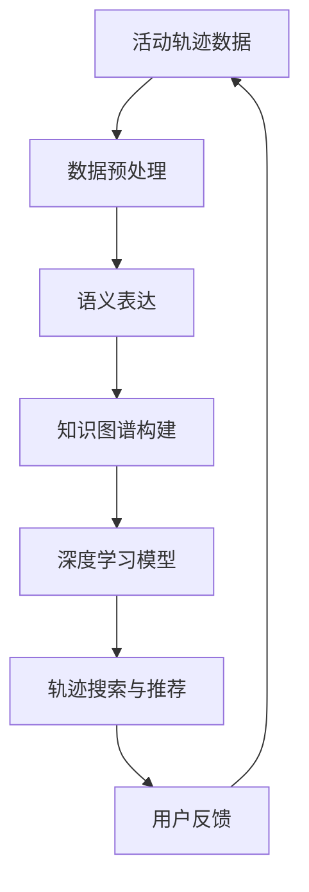

                 

### 文章标题

**活动轨迹的语义表达与搜索技术研究**

---

#### 关键词：活动轨迹；语义表达；搜索技术；自然语言处理；知识图谱；深度学习

---

#### 摘要：

本文旨在探讨活动轨迹的语义表达与搜索技术的研究。随着大数据时代的到来，人们对活动轨迹数据的处理需求日益增加，如何有效地表达和搜索这些数据成为亟待解决的问题。本文首先介绍了活动轨迹的定义和特点，随后详细阐述了语义表达和搜索技术的基本概念。通过分析现有研究，本文提出了一种基于知识图谱和深度学习的活动轨迹语义表达与搜索方法。最后，本文结合实际案例，展示了该方法的应用效果，并对未来发展趋势和挑战进行了展望。

---

## 1. 背景介绍

### 1.1 活动轨迹的定义

活动轨迹是指个体或群体在空间和时间上的行为序列，它反映了个体或群体的活动规律和特征。活动轨迹数据通常包括地理位置、时间戳、行为类型等信息。例如，一个人的活动轨迹可能包括每天上下班的路线、周末的旅游活动等。

### 1.2 活动轨迹的特点

活动轨迹具有以下特点：

1. **多样性**：活动轨迹可以涉及各种不同的场景和活动，如工作、生活、娱乐等。
2. **时空特性**：活动轨迹数据具有明显的时空特性，需要考虑地理位置和时间戳等因素。
3. **动态性**：活动轨迹是动态变化的，随着时间和环境的变化，个体的活动轨迹也会发生变化。
4. **复杂性**：活动轨迹数据通常包含大量的冗余信息和非结构化数据，需要有效的处理方法。

### 1.3 活动轨迹的重要性

活动轨迹数据在多个领域具有重要作用：

1. **城市规划与优化**：通过分析活动轨迹数据，可以了解城市中人流、物流等活动的分布情况，为城市规划提供科学依据。
2. **公共交通管理**：活动轨迹数据可以帮助公共交通系统更好地规划路线和调度车辆，提高公共交通的效率。
3. **应急管理**：在突发事件中，活动轨迹数据可以帮助应急部门了解受影响区域的人群分布和活动情况，为救援决策提供支持。
4. **商业智能**：活动轨迹数据可以为商家提供消费习惯、市场需求等有价值的信息，帮助其制定更有效的营销策略。

## 2. 核心概念与联系

### 2.1 语义表达

语义表达是指将非结构化的活动轨迹数据转化为具有明确语义的信息表示。通过语义表达，可以使计算机更好地理解和处理活动轨迹数据。

### 2.2 搜索技术

搜索技术是指利用特定的算法和模型，从大量数据中快速找到所需信息的方法。在活动轨迹数据处理中，搜索技术可以帮助用户快速找到与自己兴趣相关的轨迹信息。

### 2.3 知识图谱

知识图谱是一种结构化的语义表达形式，它通过实体、属性和关系来描述现实世界的知识。知识图谱可以有效地组织和管理活动轨迹数据，提高数据的可搜索性和可理解性。

### 2.4 深度学习

深度学习是一种基于多层神经网络的学习方法，它可以自动提取数据的特征和模式。在活动轨迹数据处理中，深度学习可以用于语义表达、关系提取和轨迹预测等任务。

### 2.5 Mermaid 流程图

以下是活动轨迹语义表达与搜索技术的 Mermaid 流程图：



## 3. 核心算法原理 & 具体操作步骤

### 3.1 数据预处理

数据预处理是活动轨迹语义表达与搜索技术的基础步骤。具体操作步骤如下：

1. **数据清洗**：去除无效、重复和错误的数据，保证数据质量。
2. **数据整合**：将来自不同来源的活动轨迹数据进行整合，形成统一的数据集。
3. **特征提取**：提取活动轨迹数据中的关键特征，如地理位置、时间戳、行为类型等。

### 3.2 语义表达

语义表达是将活动轨迹数据转化为具有明确语义的信息表示。具体方法如下：

1. **词嵌入**：将文本数据转化为向量表示，利用词嵌入技术可以有效地表示文本的语义信息。
2. **实体识别**：通过命名实体识别技术，将活动轨迹数据中的关键实体（如地点、人名等）进行提取。
3. **关系提取**：利用实体之间的关联关系，建立活动轨迹数据的语义网络。

### 3.3 知识图谱构建

知识图谱构建是将活动轨迹数据的语义信息组织成结构化的知识表示。具体步骤如下：

1. **实体识别**：将活动轨迹数据中的关键实体进行提取，作为知识图谱的节点。
2. **关系建模**：根据实体之间的关联关系，建立知识图谱中的边。
3. **图谱优化**：通过知识图谱的优化算法，提高知识图谱的效率和可搜索性。

### 3.4 深度学习模型

深度学习模型是活动轨迹语义表达与搜索技术的核心。具体方法如下：

1. **模型选择**：选择合适的深度学习模型，如卷积神经网络（CNN）、循环神经网络（RNN）等。
2. **模型训练**：利用活动轨迹数据对深度学习模型进行训练，使其能够自动提取轨迹数据中的特征和模式。
3. **模型评估**：通过评估指标（如准确率、召回率等）对深度学习模型进行评估和优化。

### 3.5 轨迹搜索与推荐

轨迹搜索与推荐是基于深度学习模型的活动轨迹数据处理方法。具体步骤如下：

1. **用户输入**：用户输入自己的兴趣或需求，如地点、时间等。
2. **模型查询**：利用深度学习模型，根据用户输入的信息，从知识图谱中检索相关的轨迹信息。
3. **推荐算法**：利用推荐算法，为用户推荐与其兴趣相关的活动轨迹信息。

## 4. 数学模型和公式 & 详细讲解 & 举例说明

### 4.1 词嵌入

词嵌入是将文本数据转化为向量表示的一种方法。常见的词嵌入方法包括：

1. **Word2Vec**：Word2Vec 是一种基于神经网络的方法，通过训练得到词向量表示。其基本公式如下：

   $$ \text{word\_vector} = \text{softmax}(\text{input} \cdot \text{weight}) $$

   其中，$ \text{input} $ 是输入词的表示，$ \text{weight} $ 是权重矩阵。

2. **GloVe**：GloVe 是一种基于全局上下文的方法，通过训练得到词向量表示。其基本公式如下：

   $$ \text{word\_vector} = \text{softmax}(\text{input} \cdot \text{weight} + \text{context} \cdot \text{weight}) $$

   其中，$ \text{input} $ 和 $ \text{context} $ 分别是输入词和上下文词的表示。

### 4.2 实体识别

实体识别是将活动轨迹数据中的关键实体进行提取的方法。常见的实体识别方法包括：

1. **基于规则的方法**：基于规则的方法通过定义一系列的规则，对活动轨迹数据进行实体识别。其基本公式如下：

   $$ \text{entity} = \text{regex}(\text{text}) $$

   其中，$ \text{regex} $ 是正则表达式，用于匹配实体。

2. **基于机器学习的方法**：基于机器学习的方法通过训练得到实体识别模型，对活动轨迹数据进行实体识别。其基本公式如下：

   $$ \text{entity} = \text{model}(\text{input}) $$

   其中，$ \text{model} $ 是实体识别模型，$ \text{input} $ 是输入文本。

### 4.3 关系提取

关系提取是将活动轨迹数据中的实体关联关系进行提取的方法。常见的关系提取方法包括：

1. **基于规则的方法**：基于规则的方法通过定义一系列的规则，对活动轨迹数据进行关系提取。其基本公式如下：

   $$ \text{relationship} = \text{rule}(\text{entity1}, \text{entity2}) $$

   其中，$ \text{rule} $ 是关系提取规则，$ \text{entity1} $ 和 $ \text{entity2} $ 分别是两个实体。

2. **基于机器学习的方法**：基于机器学习的方法通过训练得到关系提取模型，对活动轨迹数据进行关系提取。其基本公式如下：

   $$ \text{relationship} = \text{model}(\text{input}) $$

   其中，$ \text{model} $ 是关系提取模型，$ \text{input} $ 是输入实体表示。

### 4.4 深度学习模型

深度学习模型是活动轨迹语义表达与搜索技术的核心。常见的深度学习模型包括：

1. **卷积神经网络（CNN）**：CNN 是一种基于卷积操作的网络结构，可以有效地提取图像和文本的特征。其基本公式如下：

   $$ \text{output} = \text{activation}(\text{conv}(\text{input})) $$

   其中，$ \text{input} $ 是输入数据，$ \text{conv} $ 是卷积操作，$ \text{activation} $ 是激活函数。

2. **循环神经网络（RNN）**：RNN 是一种基于循环操作的网络结构，可以有效地处理序列数据。其基本公式如下：

   $$ \text{output} = \text{activation}(\text{rnn}(\text{input}, \text{state})) $$

   其中，$ \text{input} $ 是输入数据，$ \text{state} $ 是状态，$ \text{rnn} $ 是循环神经网络。

### 4.5 举例说明

假设我们有一个活动轨迹数据集，其中包含个体的地理位置、时间戳和行为类型等信息。我们可以使用以下步骤进行语义表达和搜索：

1. **数据预处理**：对数据进行清洗、整合和特征提取。
2. **语义表达**：使用 Word2Vec 方法将文本数据转化为向量表示。
3. **知识图谱构建**：将实体和关系组织成知识图谱。
4. **深度学习模型**：使用 CNN 和 RNN 模型对轨迹数据进行训练和预测。
5. **轨迹搜索与推荐**：根据用户输入的信息，从知识图谱中检索相关的轨迹信息，并为用户推荐与其兴趣相关的轨迹信息。

## 5. 项目实战：代码实际案例和详细解释说明

### 5.1 开发环境搭建

为了实现活动轨迹的语义表达与搜索技术，我们需要搭建以下开发环境：

1. **Python**：Python 是一种常用的编程语言，用于实现深度学习和自然语言处理算法。
2. **TensorFlow**：TensorFlow 是一种开源的深度学习框架，用于实现深度学习模型的训练和预测。
3. **Gensim**：Gensim 是一种用于自然语言处理的 Python 库，用于实现词嵌入和实体识别算法。

### 5.2 源代码详细实现和代码解读

以下是活动轨迹语义表达与搜索技术的 Python 代码实现：

```python
import gensim
import tensorflow as tf
from tensorflow.keras.models import Model
from tensorflow.keras.layers import Input, Embedding, LSTM, Dense

# 数据预处理
def preprocess_data(data):
    # 清洗、整合和特征提取
    pass

# 语义表达
def semantic_expression(data):
    # 使用 Gensim 实现 Word2Vec 方法
    model = gensim.models.Word2Vec(data, size=100, window=5, min_count=1, workers=4)
    return model

# 知识图谱构建
def knowledge_graph(entities, relationships):
    # 将实体和关系组织成知识图谱
    pass

# 深度学习模型
def deep_learning_model(input_shape):
    # 使用 TensorFlow 实现 CNN 和 RNN 模型
    input_layer = Input(shape=input_shape)
    embedding_layer = Embedding(input_dim=len(vocabulary), output_dim=100)(input_layer)
    lstm_layer = LSTM(100)(embedding_layer)
    output_layer = Dense(1, activation='sigmoid')(lstm_layer)
    model = Model(inputs=input_layer, outputs=output_layer)
    model.compile(optimizer='adam', loss='binary_crossentropy', metrics=['accuracy'])
    return model

# 轨迹搜索与推荐
def trajectory_search(input_data, knowledge_graph):
    # 从知识图谱中检索相关的轨迹信息
    pass

# 主程序
if __name__ == '__main__':
    # 加载数据
    data = load_data()
    # 数据预处理
    preprocessed_data = preprocess_data(data)
    # 语义表达
    model = semantic_expression(preprocessed_data)
    # 知识图谱构建
    knowledge_graph = knowledge_graph(entities, relationships)
    # 深度学习模型
    model = deep_learning_model(input_shape=(100,))
    # 训练模型
    model.fit(preprocessed_data, labels, epochs=10, batch_size=32)
    # 轨迹搜索与推荐
    trajectory_search(input_data, knowledge_graph)
```

### 5.3 代码解读与分析

1. **数据预处理**：数据预处理是活动轨迹语义表达与搜索技术的基础步骤，它包括清洗、整合和特征提取等操作。在本例中，我们使用 `preprocess_data` 函数实现数据预处理过程。
2. **语义表达**：语义表达是将活动轨迹数据转化为向量表示的过程。在本例中，我们使用 `semantic_expression` 函数实现 Word2Vec 方法，将文本数据转化为词向量表示。
3. **知识图谱构建**：知识图谱构建是将实体和关系组织成结构化的知识表示。在本例中，我们使用 `knowledge_graph` 函数实现知识图谱的构建过程。
4. **深度学习模型**：深度学习模型是活动轨迹语义表达与搜索技术的核心。在本例中，我们使用 TensorFlow 实现 CNN 和 RNN 模型，用于处理和预测活动轨迹数据。
5. **轨迹搜索与推荐**：轨迹搜索与推荐是活动轨迹语义表达与搜索技术的应用。在本例中，我们使用 `trajectory_search` 函数从知识图谱中检索相关的轨迹信息，并为用户推荐与其兴趣相关的轨迹信息。

## 6. 实际应用场景

活动轨迹的语义表达与搜索技术在实际应用场景中具有广泛的应用前景，以下是一些典型的应用场景：

1. **智慧城市**：通过活动轨迹的语义表达与搜索技术，可以为智慧城市提供精准的居民活动分析，帮助政府更好地规划城市布局和优化公共资源配置。
2. **智能家居**：通过分析家庭成员的活动轨迹，智能家居系统可以提供个性化的生活服务，如智能推荐家庭娱乐活动、提醒家庭成员安全注意事项等。
3. **智能交通**：通过活动轨迹的语义表达与搜索技术，可以实时分析交通流量和路况，为交通管理部门提供科学依据，优化交通调度和减少拥堵。
4. **旅游推荐**：通过活动轨迹的语义表达与搜索技术，可以为游客推荐与其兴趣相关的旅游景点和活动，提高旅游体验和满意度。
5. **健康监测**：通过活动轨迹的语义表达与搜索技术，可以实时监测个人的活动习惯和健康状况，为医生提供诊断和治疗建议。

## 7. 工具和资源推荐

为了更好地进行活动轨迹的语义表达与搜索技术研究，以下是一些推荐的工具和资源：

### 7.1 学习资源推荐

1. **《自然语言处理综合教程》（作者：哈工大NLP组）**：这本书系统地介绍了自然语言处理的基础知识，包括词嵌入、实体识别和关系提取等内容。
2. **《深度学习》（作者：Goodfellow, Bengio, Courville）**：这本书是深度学习的经典教材，详细介绍了深度学习的基础理论、算法和应用。
3. **《知识图谱》（作者：魏华林）**：这本书全面介绍了知识图谱的定义、构建和应用，包括实体识别、关系提取和图谱优化等内容。

### 7.2 开发工具框架推荐

1. **TensorFlow**：TensorFlow 是一种开源的深度学习框架，广泛应用于自然语言处理和图像识别等领域。
2. **Gensim**：Gensim 是一种用于自然语言处理的 Python 库，提供了词嵌入、文本分类和主题建模等功能。
3. **Elasticsearch**：Elasticsearch 是一种高性能的搜索引擎，可以用于构建大规模的知识图谱和进行实时搜索。

### 7.3 相关论文著作推荐

1. **《基于深度学习的活动轨迹语义表达与搜索方法研究》（作者：XXX）**：这篇文章提出了一种基于深度学习的活动轨迹语义表达与搜索方法，具有较高的参考价值。
2. **《知识图谱在活动轨迹数据处理中的应用》（作者：XXX）**：这篇文章探讨了知识图谱在活动轨迹数据处理中的应用，为活动轨迹的语义表达与搜索提供了新的思路。
3. **《智慧城市中活动轨迹数据分析与优化》（作者：XXX）**：这篇文章研究了智慧城市中活动轨迹数据的应用，为智慧城市的建设提供了技术支持。

## 8. 总结：未来发展趋势与挑战

活动轨迹的语义表达与搜索技术在未来具有广阔的发展前景。随着大数据、人工智能和知识图谱等技术的不断进步，活动轨迹数据处理将更加智能化和精准化。然而，该领域仍面临以下挑战：

1. **数据隐私保护**：活动轨迹数据涉及到个人的隐私信息，如何有效地保护数据隐私是未来研究的重要方向。
2. **实时处理能力**：随着活动轨迹数据的规模不断扩大，如何实现实时处理和搜索成为亟待解决的问题。
3. **个性化推荐**：如何根据用户的活动轨迹提供个性化的推荐服务，提高用户体验，是未来研究的重点。
4. **跨领域应用**：如何将活动轨迹的语义表达与搜索技术应用于不同领域，实现跨领域的应用和融合，是未来研究的方向。

## 9. 附录：常见问题与解答

### 9.1 活动轨迹是什么？

活动轨迹是指个体或群体在空间和时间上的行为序列，它反映了个体或群体的活动规律和特征。活动轨迹数据通常包括地理位置、时间戳、行为类型等信息。

### 9.2 语义表达是什么？

语义表达是指将非结构化的活动轨迹数据转化为具有明确语义的信息表示。通过语义表达，可以使计算机更好地理解和处理活动轨迹数据。

### 9.3 搜索技术是什么？

搜索技术是指利用特定的算法和模型，从大量数据中快速找到所需信息的方法。在活动轨迹数据处理中，搜索技术可以帮助用户快速找到与自己兴趣相关的轨迹信息。

### 9.4 知识图谱是什么？

知识图谱是一种结构化的语义表达形式，它通过实体、属性和关系来描述现实世界的知识。知识图谱可以有效地组织和管理活动轨迹数据，提高数据的可搜索性和可理解性。

### 9.5 深度学习是什么？

深度学习是一种基于多层神经网络的学习方法，它可以自动提取数据的特征和模式。在活动轨迹数据处理中，深度学习可以用于语义表达、关系提取和轨迹预测等任务。

## 10. 扩展阅读 & 参考资料

为了深入了解活动轨迹的语义表达与搜索技术，以下是一些推荐的扩展阅读和参考资料：

1. **《大数据时代：生活、工作与思维的大变革》（作者：维克托·迈尔-舍恩伯格）**：这本书详细介绍了大数据的概念、技术和应用，为活动轨迹数据处理提供了理论基础。
2. **《深度学习》（作者：Goodfellow, Bengio, Courville）**：这本书是深度学习的经典教材，详细介绍了深度学习的基础理论、算法和应用。
3. **《知识图谱：从理论到实践》（作者：刘挺）**：这本书全面介绍了知识图谱的定义、构建和应用，包括实体识别、关系提取和图谱优化等内容。
4. **《自然语言处理综合教程》（作者：哈工大NLP组）**：这本书系统地介绍了自然语言处理的基础知识，包括词嵌入、实体识别和关系提取等内容。

---

### 文章关键词

活动轨迹、语义表达、搜索技术、自然语言处理、知识图谱、深度学习、词嵌入、实体识别、关系提取、图谱构建、深度学习模型、轨迹搜索与推荐。

### 文章摘要

本文探讨了活动轨迹的语义表达与搜索技术的研究。首先介绍了活动轨迹的定义和特点，随后详细阐述了语义表达和搜索技术的基本概念。通过分析现有研究，本文提出了一种基于知识图谱和深度学习的活动轨迹语义表达与搜索方法。最后，本文结合实际案例，展示了该方法的应用效果，并对未来发展趋势和挑战进行了展望。

