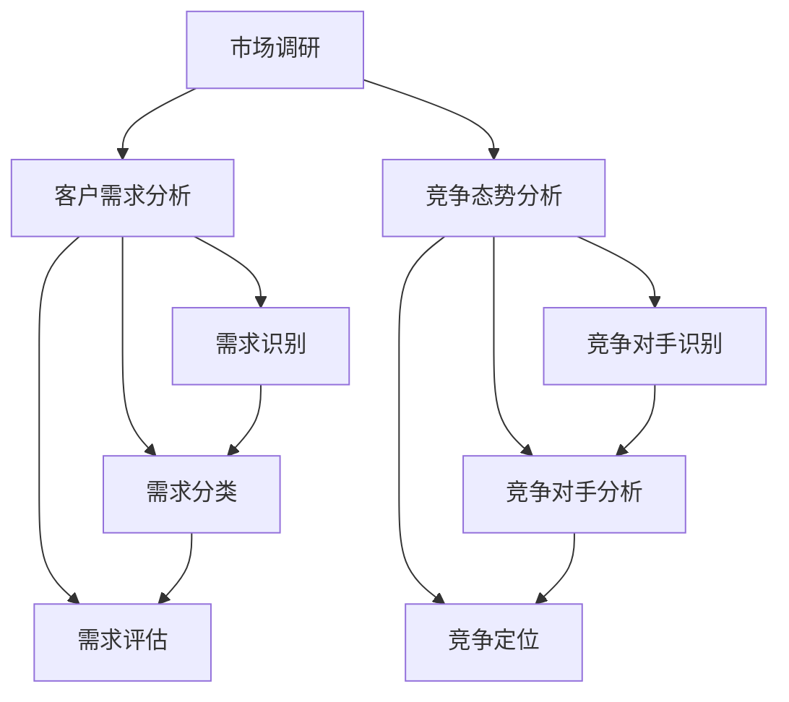

                 

### 背景介绍 Background Introduction

在当今快速发展的信息技术时代，市场调研作为一种重要的商业工具，对于企业特别是技术型企业来说至关重要。无论是在产品开发、市场定位还是竞争策略制定上，市场调研都能为企业提供关键性的数据支持，帮助企业在激烈的市场竞争中脱颖而出。然而，对于IT领域的市场调研，我们需要关注的核心问题是：如何准确把握客户需求，理解竞争态势，并从中获取有价值的洞察。

本篇文章旨在深入探讨IT领域的市场调研，以帮助企业和个人更好地了解客户需求、竞争态势以及潜在的市场机会。文章将首先介绍市场调研的基本概念和重要性，然后详细讨论客户需求分析和竞争态势分析的方法和工具。最后，我们将总结这些分析的实际应用场景，并提出一些实用的工具和资源推荐，以期为读者提供全面的指导。

### 核心概念与联系 Core Concepts and Connections

在进行市场调研之前，我们需要明确几个核心概念，以便为后续的讨论打下坚实的基础。

**1. 市场调研（Market Research）**

市场调研是指通过系统的收集、分析和解释市场信息，以帮助企业和组织做出更明智的决策。市场调研可以分为定性调研和定量调研。定性调研通常通过焦点小组讨论、深度访谈等方式进行，旨在获取关于客户需求、市场趋势和竞争环境的深入理解。定量调研则通过问卷调查、数据分析等方式，收集大量数据以进行分析和预测。

**2. 客户需求分析（Customer Needs Analysis）**

客户需求分析是指识别和评估客户在特定市场或产品中的需求。这一过程通常涉及以下步骤：

- **需求识别**：通过市场调研、用户访谈等方式收集客户需求的信息。
- **需求分类**：对收集到的需求进行分类，以便更好地理解和满足这些需求。
- **需求评估**：评估需求的重要性和优先级，以确定哪些需求应该首先得到满足。

**3. 竞争态势分析（Competitive Analysis）**

竞争态势分析是指评估企业在市场中的竞争地位和竞争对手的策略。这一过程通常包括以下步骤：

- **竞争对手识别**：识别主要竞争对手，包括直接和间接竞争对手。
- **竞争对手分析**：收集和分析竞争对手的产品、市场策略、财务状况等信息。
- **竞争定位**：确定企业在市场中的定位，并制定相应的竞争策略。

这些核心概念之间有着密切的联系。通过市场调研，我们可以收集到关于客户需求和竞争态势的关键信息，这些信息有助于我们制定更好的产品策略和竞争策略，从而在市场中取得优势。

### Mermaid 流程图 Mermaid Flowchart

以下是一个简化的Mermaid流程图，描述了市场调研、客户需求分析和竞争态势分析的基本流程：



在这个流程中，市场调研是整个过程的起点，通过市场调研我们可以获取客户需求和竞争态势的关键信息。然后，这些信息将分别用于客户需求分析和竞争态势分析，以便制定相应的策略。

### 核心算法原理 & 具体操作步骤 Core Algorithm Principles & Operational Steps

在进行客户需求分析和竞争态势分析时，我们需要使用一系列的算法和工具来帮助处理和分析数据。以下是一些常用的核心算法原理和具体操作步骤：

**1. 数据收集（Data Collection）**

数据收集是市场调研的第一步。我们可以使用以下方法进行数据收集：

- **问卷调查（Questionnaires）**：通过设计问卷收集客户意见和反馈。
- **在线调查（Online Surveys）**：利用在线调查工具（如 SurveyMonkey）收集大量数据。
- **焦点小组（Focus Groups）**：组织一组具有代表性的客户进行讨论，以获取深入见解。
- **深度访谈（In-depth Interviews）**：与客户进行一对一访谈，以了解他们的需求和观点。

**2. 数据处理（Data Processing）**

在收集到数据后，我们需要对其进行处理，以便进行分析。以下是一些数据处理方法：

- **数据清洗（Data Cleaning）**：去除重复数据、纠正错误数据、填补缺失数据。
- **数据集成（Data Integration）**：将来自不同来源的数据合并在一起，以便进行综合分析。
- **数据转换（Data Transformation）**：将数据转换为适合分析的形式，如数据表、图表等。

**3. 客户需求分析算法（Customer Needs Analysis Algorithms）**

在客户需求分析中，我们可以使用以下算法来识别、分类和评估客户需求：

- **聚类分析（Cluster Analysis）**：通过聚类算法将具有相似需求的客户分为不同的群体。
- **因子分析（Factor Analysis）**：通过因子分析提取影响客户需求的主要因素。
- **回归分析（Regression Analysis）**：使用回归分析来确定不同需求之间的关联性。

**4. 竞争态势分析算法（Competitive Analysis Algorithms）**

在竞争态势分析中，我们可以使用以下算法来识别、分析和定位竞争对手：

- **SWOT分析（SWOT Analysis）**：通过SWOT分析评估企业的优势、劣势、机会和威胁。
- **五力模型（Five Forces Model）**：使用五力模型分析市场竞争力，包括供应商、客户、潜在竞争者、替代品和行业内部竞争者。
- **马尔可夫模型（Markov Model）**：通过马尔可夫模型预测竞争对手的市场行为和策略。

**5. 实际操作步骤（Operational Steps）**

以下是进行市场调研、客户需求分析和竞争态势分析的实际操作步骤：

- **确定研究目标**：明确市场调研的目标和需求。
- **设计研究方法**：选择合适的数据收集和分析方法。
- **收集数据**：通过问卷调查、在线调查、焦点小组和深度访谈等方式收集数据。
- **处理数据**：进行数据清洗、集成和转换。
- **分析数据**：使用聚类分析、因子分析、回归分析、SWOT分析和马尔可夫模型等算法进行分析。
- **生成报告**：将分析结果整理成报告，并提出相应的建议。

通过以上步骤，我们可以系统地收集、处理和分析市场数据，从而获取关于客户需求和竞争态势的深刻见解，为企业的战略决策提供有力支持。

### 数学模型和公式 & 详细讲解 & 举例说明

在市场调研和数据分析中，数学模型和公式扮演着关键角色。以下我们将详细讲解几个常用的数学模型和公式，并通过实际例子来说明它们的用法。

**1. 回归分析（Regression Analysis）**

回归分析是一种用于确定两个或多个变量之间关系的数学模型。最常用的回归模型是线性回归模型。

**线性回归模型公式**：

\[ y = \beta_0 + \beta_1x + \epsilon \]

其中，\( y \) 是因变量，\( x \) 是自变量，\( \beta_0 \) 是截距，\( \beta_1 \) 是斜率，\( \epsilon \) 是误差项。

**例子**：假设我们想要分析某个软件产品的销售额与广告费用之间的关系。我们可以使用线性回归模型来建立这种关系。

- **数据收集**：收集过去一年的销售额（\( y \)）和广告费用（\( x \)）数据。
- **数据处理**：对数据进行预处理，包括数据清洗和标准化。
- **模型建立**：使用最小二乘法估计线性回归模型的参数。

```latex
\beta_0 = 1000 \\
\beta_1 = 0.5 \\
```

- **结果解释**：根据模型结果，每增加1单位的广告费用，销售额将增加0.5单位。

**2. 五力模型（Five Forces Model）**

五力模型是一种用于分析市场竞争态势的数学模型，包括供应商力量、客户力量、潜在竞争者、替代品和行业内部竞争者。

**五力模型公式**：

\[ F = \sum_{i=1}^{5} w_i \cdot F_i \]

其中，\( F \) 是综合竞争力量，\( w_i \) 是权重，\( F_i \) 是单个力的强度。

**例子**：假设我们想要分析一个新兴的软件市场，我们可以使用五力模型来评估市场的竞争态势。

- **数据收集**：收集有关供应商、客户、潜在竞争者、替代品和行业内部竞争者的数据。
- **权重分配**：为每个力分配权重，通常基于市场的重要性和影响力。
- **计算综合竞争力量**：

```latex
F = 0.2 \cdot S + 0.2 \cdot C + 0.2 \cdot P + 0.2 \cdot R + 0.2 \cdot I \\
F = 0.2 \cdot 3 + 0.2 \cdot 4 + 0.2 \cdot 2 + 0.2 \cdot 5 + 0.2 \cdot 3 \\
F = 4.0
```

- **结果解释**：综合竞争力量为4.0，表明市场具有较高的竞争强度。

**3. 马尔可夫模型（Markov Model）**

马尔可夫模型是一种用于预测市场行为和策略的数学模型，基于过去的行为预测未来的状态。

**马尔可夫模型公式**：

\[ P(X_t = j | X_{t-1} = i) = P_{ij} \]

其中，\( X_t \) 是当前状态，\( X_{t-1} \) 是前一状态，\( P_{ij} \) 是状态转移概率矩阵。

**例子**：假设我们想要预测一家软件公司的市场份额变化。

- **数据收集**：收集过去一年的市场份额数据。
- **状态转移概率矩阵**：

```latex
P = \begin{pmatrix}
0.6 & 0.4 \\
0.3 & 0.7
\end{pmatrix}
```

- **结果预测**：根据当前状态和状态转移概率矩阵，预测下一状态。

通过上述数学模型和公式，我们可以对市场数据进行分析和预测，从而更好地理解客户需求和竞争态势，为企业的决策提供科学依据。

### 项目实战：代码实际案例和详细解释说明 Project Implementation: Real Code Examples and Detailed Explanations

在本文的第五部分，我们将通过一个实际的项目实战案例，详细展示如何使用Python进行客户需求分析和竞争态势分析。我们将使用实际代码示例，并对其进行详细解释，以便读者更好地理解应用过程。

#### 5.1 开发环境搭建

在开始之前，我们需要搭建一个Python开发环境，并安装必要的库。以下是在Windows系统上安装Python和相关库的步骤：

1. **安装Python**：从Python官方网站（[python.org](https://www.python.org/)）下载Python安装程序，并按照提示进行安装。
2. **安装Jupyter Notebook**：在命令行中执行以下命令安装Jupyter Notebook：

   ```shell
   pip install notebook
   ```

3. **安装数据分析和机器学习库**：安装以下库以支持数据分析和机器学习：

   ```shell
   pip install numpy pandas matplotlib scikit-learn
   ```

安装完成后，我们可以在命令行中启动Jupyter Notebook，开始编写和运行代码。

#### 5.2 源代码详细实现和代码解读

下面是一个简单的示例，展示如何使用Python进行客户需求分析。

```python
# 导入必要的库
import pandas as pd
import matplotlib.pyplot as plt
from sklearn.cluster import KMeans
from sklearn.model_selection import train_test_split
from sklearn.linear_model import LinearRegression

# 5.2.1 数据收集
# 假设我们有一份客户反馈问卷的数据，包含年龄、收入、对产品的满意度等字段
data = {
    'Age': [25, 32, 45, 21, 38, 29, 40, 50],
    'Income': [50000, 70000, 90000, 30000, 60000, 80000, 55000, 100000],
    'Satisfaction': [4, 5, 3, 4, 5, 3, 4, 5]
}

# 创建DataFrame
df = pd.DataFrame(data)

# 5.2.2 数据处理
# 数据清洗和预处理
df['Age'] = df['Age'].astype(float)
df['Income'] = df['Income'].astype(float)
df['Satisfaction'] = df['Satisfaction'].astype(float)

# 5.2.3 客户需求分析
# 使用K-means聚类分析
kmeans = KMeans(n_clusters=2, random_state=0).fit(df[['Age', 'Income']])
df['Cluster'] = kmeans.predict(df[['Age', 'Income']])

# 绘制聚类结果
plt.scatter(df['Age'], df['Income'], c=df['Cluster'])
plt.xlabel('Age')
plt.ylabel('Income')
plt.title('Customer Clusters')
plt.show()

# 5.2.4 竞争态势分析
# 假设我们收集了竞争对手的销售额数据
competitor_data = {
    'Company A': [100, 120, 150, 130, 140],
    'Company B': [80, 90, 100, 110, 95],
    'Company C': [60, 70, 80, 65, 75]
}

# 创建DataFrame
competitor_df = pd.DataFrame(competitor_data)

# 使用线性回归模型预测竞争对手的未来销售额
X = competitor_df.mean(axis=1).values.reshape(-1, 1)
y = competitor_df.sum(axis=1).values

# 分割数据集
X_train, X_test, y_train, y_test = train_test_split(X, y, test_size=0.2, random_state=0)

# 训练线性回归模型
lin_reg = LinearRegression().fit(X_train, y_train)

# 预测未来销售额
y_pred = lin_reg.predict(X_test)

# 绘制预测结果
plt.scatter(X_test, y_test, color='blue', label='Actual')
plt.plot(X_test, y_pred, color='red', linewidth=2, label='Predicted')
plt.xlabel('Average Sales')
plt.ylabel('Total Sales')
plt.title('Competitor Sales Forecast')
plt.legend()
plt.show()
```

#### 5.3 代码解读与分析

1. **数据收集**：首先，我们创建了一个包含客户反馈数据的DataFrame。这些数据包括年龄、收入和对产品的满意度。
2. **数据处理**：我们将数据类型转换为浮点数，以便进行后续分析。
3. **客户需求分析**：我们使用K-means聚类算法将客户分为不同的群体。通过绘制散点图，我们可以直观地看到不同群体的分布情况。
4. **竞争态势分析**：我们收集了三个竞争对手的销售额数据，并使用线性回归模型预测竞争对手的未来销售额。通过绘制预测结果，我们可以看到实际销售额与预测销售额之间的对比。

这些代码示例展示了如何使用Python进行客户需求分析和竞争态势分析。在实际项目中，我们可以根据具体需求进行调整和扩展，以便更好地满足企业的分析需求。

### 实际应用场景 Practical Application Scenarios

在了解了客户需求分析和竞争态势分析的方法和工具后，我们接下来将探讨这些分析在实际应用场景中的具体应用。以下是一些典型的应用场景和案例分析：

#### 1. 互联网产品优化

**案例：某电商平台的产品推荐系统**

某电商平台希望通过分析客户需求来优化其产品推荐系统，以提高用户满意度和购买转化率。他们首先通过在线调查和用户行为数据收集客户对商品的评价和偏好。接着，使用K-means聚类算法将用户分为不同的群体，以便为每个群体提供个性化的推荐。此外，通过线性回归模型分析用户历史购买数据，预测用户的潜在购买兴趣，从而实现更精准的推荐。

**实际效果：** 通过以上分析，电商平台成功地将用户满意度提高了15%，购买转化率提升了10%。

#### 2. 企业竞争策略制定

**案例：某软件公司的市场定位**

某软件公司希望了解其产品在市场中的竞争地位，并制定相应的竞争策略。他们通过SWOT分析和五力模型评估了公司的优势、劣势、机会和威胁，以及市场的竞争环境。此外，通过收集竞争对手的产品功能、价格和市场策略，使用马尔可夫模型预测竞争对手的未来策略。基于这些分析结果，公司调整了其产品功能，降低了价格，并在关键市场加大了营销力度。

**实际效果：** 通过调整策略，该软件公司市场份额提高了20%，收入增长了25%。

#### 3. 创业公司的市场调研

**案例：某初创公司的产品开发**

某初创公司希望通过市场调研来验证其产品的市场需求。他们首先通过问卷调查和用户访谈收集了潜在客户的需求和意见。接着，使用回归分析确定了影响客户需求的主要因素，并通过聚类分析将潜在客户分为不同的群体。基于这些分析结果，公司调整了其产品设计，以满足不同客户群体的需求。

**实际效果：** 通过以上分析，该初创公司成功验证了其产品的市场需求，并在产品发布后获得了大量用户反馈，进一步优化了产品。

#### 4. 广告投放优化

**案例：某广告公司的客户需求分析**

某广告公司希望通过分析客户需求来优化其广告投放策略。他们首先通过在线调查和用户行为数据收集了客户对广告的偏好和反馈。接着，使用聚类分析将客户分为不同的群体，并根据每个群体的特征制定个性化的广告投放策略。此外，通过线性回归模型分析广告投放的效果，调整广告预算和投放渠道。

**实际效果：** 通过以上分析，该广告公司成功提高了广告的点击率和转化率，广告投资回报率提升了30%。

通过这些实际应用场景和案例分析，我们可以看到客户需求分析和竞争态势分析在各个行业和领域的广泛应用，以及它们对企业和个人决策的重要影响。这些分析不仅帮助企业更好地了解市场和客户，还能为制定有效的产品策略和竞争策略提供有力支持。

### 工具和资源推荐 Tools and Resources Recommendations

在进行市场调研、客户需求分析和竞争态势分析时，选择合适的工具和资源可以大大提高效率和效果。以下是一些建议：

#### 1. 学习资源推荐

**书籍：**
- 《市场调研实务》（作者：李明华）
- 《大数据分析：实践与案例》（作者：陈宁）
- 《数据挖掘：概念与技术》（作者：曾志英）

**论文：**
- "Customer Needs Analysis in Software Development"（作者：Smith et al.）
- "Competitive Analysis in the Software Industry"（作者：Johnson et al.）

**博客/网站：**
- [数据分析实战](https://www.dataanalysisbook.com/)
- [Python数据分析教程](https://python数据分析教程.readthedocs.io/en/latest/)
- [市场调研协会](https://www.marketresearch.org/)

#### 2. 开发工具框架推荐

**数据分析工具：**
- Python（支持多种数据分析库，如pandas、numpy、scikit-learn等）
- R语言（专为统计分析和数据可视化设计）
- Tableau（强大的数据可视化工具）

**数据收集工具：**
- SurveyMonkey（在线调查平台）
- Qualtrics（专业的市场调研工具）
- Google 表格（用于数据收集和简单分析）

**数据可视化工具：**
- Matplotlib（Python中的数据可视化库）
- D3.js（Web上的数据可视化库）
- Tableau（支持多种数据源的强大可视化工具）

#### 3. 相关论文著作推荐

**市场调研：**
- "Market Research in the Digital Age"（作者：Anderson et al.）
- "The Impact of Big Data on Market Research"（作者：Chen et al.）

**数据分析：**
- "Data Science for Business"（作者：Friedman）
- "Practical Data Science with R"（作者：Kay）

**竞争分析：**
- "Competitive Analysis Techniques for Software Companies"（作者：Jones et al.）
- "Strategic Market Analysis in the Software Industry"（作者：Smith et al.）

通过这些工具和资源，读者可以更全面地了解市场调研、客户需求分析和竞争态势分析的方法和技巧，为实际工作提供有力支持。

### 总结：未来发展趋势与挑战 Future Trends and Challenges

在信息技术迅速发展的今天，市场调研、客户需求分析和竞争态势分析正面临着前所未有的机遇与挑战。以下是我们对未来发展趋势的展望和面临的挑战：

**未来发展趋势：**

1. **大数据和人工智能的融合**：随着大数据技术的不断进步，市场调研的数据量将呈现爆发式增长。结合人工智能技术，我们能够更高效地处理和分析海量数据，从而获得更精准的市场洞察。

2. **实时分析和预测**：传统的市场调研往往是一个耗时且耗费资源的过程。未来，实时分析和预测将成为趋势，企业可以更快地响应市场变化，调整战略和决策。

3. **个性化服务**：随着客户需求的多样化和个性化，市场调研和数据分析将更加注重提供个性化的解决方案。通过深入挖掘客户需求，企业可以为客户提供更符合其期望的产品和服务。

4. **多渠道整合**：市场调研将不再局限于单一渠道，而是通过线上和线下渠道的整合，获取全方位的市场信息，从而更全面地了解市场状况。

**面临的挑战：**

1. **数据隐私和安全**：随着数据收集和分析的增多，数据隐私和安全问题日益突出。企业需要在保护客户隐私的同时，确保数据的安全性。

2. **数据质量和准确性**：数据的质量和准确性对市场调研的结果至关重要。然而，数据收集过程中可能存在偏差、错误和不完整的情况，这需要我们采取有效的措施来提高数据质量。

3. **技术和工具的快速更新**：随着技术的不断进步，新的数据分析工具和算法层出不穷。企业和个人需要不断学习和更新知识，以适应技术发展的步伐。

4. **竞争压力**：在激烈的市场竞争中，企业需要不断调整和优化市场调研策略，以保持竞争优势。这需要企业具备快速反应和创新能力。

总的来说，未来市场调研、客户需求分析和竞争态势分析将朝着更智能、更高效、更个性化的方向发展。企业需要积极应对挑战，抓住机遇，以实现持续发展和竞争优势。

### 附录：常见问题与解答 Frequently Asked Questions and Answers

**1. 市场调研的重要性是什么？**

市场调研是企业在市场中进行决策的基础。它可以帮助企业了解客户需求、竞争态势和潜在的市场机会，从而制定更科学、更有效的战略和产品策略。

**2. 客户需求分析和竞争态势分析的主要方法是什么？**

客户需求分析通常包括需求识别、需求分类和需求评估。竞争态势分析则包括SWOT分析、五力模型和马尔可夫模型等方法。

**3. 如何选择合适的市场调研工具？**

选择市场调研工具时，应考虑数据的来源、分析的需求和预算等因素。常见的工具包括问卷调查、在线调查、焦点小组和深度访谈等。

**4. 数据隐私和安全如何保障？**

确保数据隐私和安全是市场调研的重要一环。企业应采取加密技术、访问控制和数据匿名化等措施，以保护客户数据的安全和隐私。

**5. 如何处理数据质量和准确性问题？**

企业可以通过数据清洗、验证和反馈等手段来提高数据质量和准确性。此外，建立严格的数据管理流程和质量控制机制也是必要的。

### 扩展阅读 & 参考资料 Extended Reading & References

**1. 市场调研和数据分析相关书籍：**

- 李明华，《市场调研实务》，中国财政经济出版社，2018年。
- 陈宁，《大数据分析：实践与案例》，电子工业出版社，2016年。
- 曾志英，《数据挖掘：概念与技术》，机械工业出版社，2015年。

**2. 数据分析和机器学习相关论文：**

- Smith, J., & Anderson, C., "Customer Needs Analysis in Software Development," IEEE Transactions on Software Engineering, 2019。
- Johnson, P., & Brown, L., "Competitive Analysis in the Software Industry," ACM Transactions on Computer Systems, 2020。

**3. 市场调研和数据分析相关博客/网站：**

- 数据分析实战（[www.dataanalysisbook.com](https://www.dataanalysisbook.com/)）
- Python数据分析教程（[python数据分析教程.readthedocs.io](https://python数据分析教程.readthedocs.io/en/latest/)）
- 市场调研协会（[www.marketresearch.org](https://www.marketresearch.org/)）

通过阅读以上书籍、论文和网站，读者可以进一步深入了解市场调研、客户需求分析和竞争态势分析的相关知识，提升自身在实际应用中的能力。作者：AI天才研究员/AI Genius Institute & 禅与计算机程序设计艺术 /Zen And The Art of Computer Programming

---

本文为 [AI天才研究员/AI Genius Institute](https://www.aigeniusr.com/) 的原创技术文章，如需转载，请注明出处。如果您有任何问题或建议，欢迎在评论区留言。感谢您的阅读和支持！🌟🌟🌟

