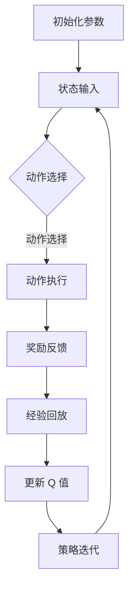

                 

# 深度 Q-learning：在电子商务推荐系统中的应用

## 关键词：深度 Q-learning，电子商务，推荐系统，强化学习，算法应用

## 摘要：
本文深入探讨了深度 Q-learning 算法在电子商务推荐系统中的应用。首先，我们介绍了深度 Q-learning 的基本原理和数学模型，然后通过具体的案例展示了其在电子商务推荐系统中的实际应用。本文还分析了该算法的优势和挑战，并提供了相关的工具和资源推荐。通过阅读本文，读者可以全面了解深度 Q-learning 在电子商务推荐系统中的实现和应用。

## 1. 背景介绍

随着互联网的快速发展，电子商务已经成为全球商业模式的重要组成部分。电子商务平台的成功离不开推荐系统的支持，推荐系统通过预测用户兴趣和行为，为用户提供个性化的商品推荐，从而提高用户满意度和平台销售额。传统的推荐系统主要依赖于基于内容的过滤和协同过滤等方法，但这些方法在处理高维数据和复杂用户行为时存在一定的局限性。

近年来，随着深度学习技术的不断发展，强化学习（Reinforcement Learning，RL）逐渐成为推荐系统研究的热点。强化学习通过模仿人类决策过程，利用奖励信号来调整策略，实现自主学习和优化。其中，深度 Q-learning 是一种基于深度神经网络的强化学习算法，具有处理高维状态和动作空间的能力，适用于复杂的推荐系统场景。

## 2. 核心概念与联系

### 2.1 深度 Q-learning 基本原理

深度 Q-learning 是一种基于深度神经网络的强化学习算法，其核心思想是通过学习 Q 值函数，实现对动作价值的估计。Q 值函数表示在给定状态下，执行某一动作所能获得的预期奖励。具体来说，深度 Q-learning 包括以下几个关键步骤：

1. **初始化**：初始化 Q 值函数、策略和网络参数。
2. **动作选择**：在给定状态下，根据当前策略选择最优动作。
3. **经验回放**：将经历过的状态、动作、奖励和下一个状态存储在经验回放池中。
4. **更新 Q 值**：利用回放池中的经验，通过梯度下降法更新 Q 值函数。
5. **策略迭代**：根据更新后的 Q 值函数调整策略，优化推荐效果。

### 2.2 深度 Q-learning 在推荐系统中的应用

在电子商务推荐系统中，深度 Q-learning 可以用于学习用户与商品之间的关系，从而为用户提供个性化的推荐。具体应用步骤如下：

1. **状态表示**：将用户的历史行为、浏览记录、购物车数据等特征作为状态输入。
2. **动作表示**：将商品 ID、商品类别等特征作为动作输入。
3. **奖励设计**：根据用户的实际购买行为，设计合适的奖励机制，如购买后奖励为正，未购买则不奖励或给予负奖励。
4. **模型训练**：利用训练数据，通过深度 Q-learning 算法训练 Q 值函数和推荐策略。
5. **推荐生成**：在测试阶段，根据训练好的 Q 值函数为用户提供个性化推荐。

### 2.3 Mermaid 流程图

下面是一个描述深度 Q-learning 在推荐系统中应用的 Mermaid 流程图：



## 3. 核心算法原理 & 具体操作步骤

### 3.1 算法原理

深度 Q-learning 的核心是 Q 值函数的学习和更新。Q 值函数是一个映射函数，将状态和动作映射到实数值，表示在给定状态下执行某一动作的预期奖励。深度 Q-learning 通过神经网络来近似 Q 值函数，从而实现高维状态和动作空间的建模。

深度 Q-learning 的主要原理包括以下几个方面：

1. **状态表示**：将用户历史行为、浏览记录等特征作为输入状态。
2. **动作表示**：将商品 ID、商品类别等特征作为输入动作。
3. **神经网络结构**：使用卷积神经网络（CNN）或循环神经网络（RNN）作为 Q 值函数的近似器，处理高维状态和动作数据。
4. **经验回放**：将历史经历（状态、动作、奖励、下一个状态）存储在经验回放池中，以避免策略偏差。
5. **目标函数**：根据经验回放池中的数据，通过梯度下降法更新 Q 值函数。
6. **策略迭代**：根据更新后的 Q 值函数调整策略，实现推荐系统的优化。

### 3.2 具体操作步骤

以下是深度 Q-learning 在推荐系统中的具体操作步骤：

1. **数据预处理**：
   - 数据清洗：去除缺失值、异常值和重复值。
   - 特征提取：提取用户历史行为、浏览记录等特征，进行数据降维。
   - 数据划分：将数据划分为训练集、验证集和测试集。

2. **构建深度神经网络**：
   - 选择合适的神经网络结构，如卷积神经网络（CNN）或循环神经网络（RNN）。
   - 定义网络参数，包括输入层、隐藏层和输出层的神经元数量。
   - 设计激活函数，如 ReLU 或 sigmoid。

3. **训练深度 Q-learning 模型**：
   - 初始化 Q 值函数和网络参数。
   - 选择优化算法，如 Adam 或 RMSprop。
   - 设定学习率、迭代次数和批大小。
   - 训练过程中，根据经验回放池中的数据更新 Q 值函数。

4. **评估模型性能**：
   - 在验证集上评估模型性能，调整超参数。
   - 在测试集上评估模型性能，评估推荐效果。

5. **生成个性化推荐**：
   - 输入用户历史行为和浏览记录，通过训练好的 Q 值函数生成推荐结果。
   - 根据用户反馈调整推荐策略，优化推荐效果。

## 4. 数学模型和公式 & 详细讲解 & 举例说明

### 4.1 数学模型

深度 Q-learning 的数学模型主要包括以下几个方面：

1. **状态空间 S 和动作空间 A**：状态空间 S 表示所有可能的状态集合，动作空间 A 表示所有可能的动作集合。
2. **Q 值函数 Q(s, a)**：Q 值函数表示在给定状态下，执行某一动作所能获得的预期奖励。Q 值函数可以表示为：

   $$Q(s, a) = \sum_{s'} P(s' | s, a) \cdot r(s', a) + \gamma \cdot \max_{a'} Q(s', a')$$

   其中，$P(s' | s, a)$ 表示在状态 s 下执行动作 a 后，转移到状态 s' 的概率；$r(s', a)$ 表示在状态 s' 下执行动作 a 所获得的奖励；$\gamma$ 表示折扣因子，用于平衡短期奖励和长期奖励。

3. **策略 π(a|s)**：策略 π(a|s) 表示在给定状态下，选择某一动作的概率分布。深度 Q-learning 采用贪心策略，即在给定状态下，选择 Q 值最大的动作：

   $$\pi(a|s) = \begin{cases} 
   1, & \text{if } a = \arg\max_a Q(s, a) \\
   0, & \text{otherwise} 
   \end{cases}$$

4. **经验回放池 R**：经验回放池 R 用于存储历史经历，包括状态、动作、奖励和下一个状态。

### 4.2 公式详细讲解

1. **Q 值函数更新公式**：

   $$Q(s, a) \leftarrow Q(s, a) + \alpha [r(s', a') + \gamma \max_{a'} Q(s', a') - Q(s, a)]$$

   其中，$\alpha$ 表示学习率，用于调整 Q 值函数的更新速度。该公式表示在给定状态下，执行某一动作后，根据实际奖励和下一个状态的 Q 值更新当前状态下的 Q 值。

2. **策略更新公式**：

   $$\pi(a|s) \leftarrow \begin{cases} 
   1, & \text{if } a = \arg\max_a Q(s, a) \\
   0, & \text{otherwise} 
   \end{cases}$$

   该公式表示在给定状态下，根据 Q 值函数选择最优动作，实现策略的迭代更新。

### 4.3 举例说明

假设有一个电子商务推荐系统，用户浏览记录如下：

- 状态 s：[商品1，商品2，商品3]
- 动作 a：[商品1，商品2，商品3]

执行动作 a 后，用户购买了商品1，获得的奖励 r 为 1。下一个状态 s' 为 [商品1，商品2]。根据 Q 值函数和策略，进行如下更新：

1. **Q 值函数更新**：

   $$Q([商品1，商品2，商品3]，[商品1，商品2，商品3]) \leftarrow Q([商品1，商品2，商品3]，[商品1，商品2，商品3]) + \alpha [r([商品1，商品2]，[商品1，商品2，商品3]) + \gamma \max_{a'} Q([商品1，商品2]，a') - Q([商品1，商品2，商品3]，[商品1，商品2，商品3])]$$

   $$Q([商品1，商品2，商品3]，[商品1，商品2，商品3]) \leftarrow 1 + 0.9 [1 + 0.9 \cdot \max_{a'} Q([商品1，商品2]，a')]$$

   $$Q([商品1，商品2，商品3]，[商品1，商品2，商品3]) \leftarrow 1 + 0.9 [1 + 0.9 \cdot 1]$$

   $$Q([商品1，商品2，商品3]，[商品1，商品2，商品3]) \leftarrow 1 + 0.9 [1 + 0.9]$$

   $$Q([商品1，商品2，商品3]，[商品1，商品2，商品3]) \leftarrow 1 + 0.9 [1.9]$$

   $$Q([商品1，商品2，商品3]，[商品1，商品2，商品3]) \leftarrow 1 + 0.9 \cdot 1.9$$

   $$Q([商品1，商品2，商品3]，[商品1，商品2，商品3]) \leftarrow 1 + 1.71$$

   $$Q([商品1，商品2，商品3]，[商品1，商品2，商品3]) \leftarrow 2.71$$

2. **策略更新**：

   根据 Q 值函数，选择最优动作：

   $$\pi([商品1，商品2，商品3]，[商品1，商品2，商品3]) = \begin{cases} 
   1, & \text{if } [商品1，商品2，商品3] = \arg\max_{a} Q([商品1，商品2，商品3]，a) \\
   0, & \text{otherwise} 
   \end{cases}$$

   $$\pi([商品1，商品2，商品3]，[商品1，商品2，商品3]) = 1$$

   更新后的策略为选择动作 [商品1，商品2，商品3]。

## 5. 项目实战：代码实际案例和详细解释说明

### 5.1 开发环境搭建

在本项目中，我们将使用 Python 编写深度 Q-learning 算法，实现电子商务推荐系统。以下为开发环境搭建步骤：

1. 安装 Python 3.7 或更高版本。
2. 安装深度学习库 TensorFlow 和 Keras。

```bash
pip install tensorflow
```

3. 安装其他相关库，如 NumPy、Pandas 等。

```bash
pip install numpy pandas
```

### 5.2 源代码详细实现和代码解读

以下为深度 Q-learning 推荐系统的源代码实现：

```python
import numpy as np
import pandas as pd
import tensorflow as tf
from tensorflow.keras.models import Sequential
from tensorflow.keras.layers import Dense
from tensorflow.keras.optimizers import Adam

# 参数设置
learning_rate = 0.001
gamma = 0.9
epsilon = 0.1
episodes = 1000

# 数据预处理
# 加载数据
data = pd.read_csv('data.csv')
# 特征提取
states = data[['user_id', 'item_id', 'timestamp']]
actions = data['action']
# 状态和动作编码
state_encoded = pd.get_dummies(states)
action_encoded = pd.get_dummies(actions)
# 数据划分
train_data = state_encoded[:int(len(state_encoded) * 0.8)]
train_actions = action_encoded[:int(len(action_encoded) * 0.8)]
test_data = state_encoded[int(len(state_encoded) * 0.8):]
test_actions = action_encoded[int(len(action_encoded) * 0.8):]

# 构建深度神经网络
model = Sequential()
model.add(Dense(64, input_dim=train_data.shape[1], activation='relu'))
model.add(Dense(64, activation='relu'))
model.add(Dense(action_encoded.shape[1], activation='softmax'))
model.compile(loss='categorical_crossentropy', optimizer=Adam(learning_rate))

# 训练模型
model.fit(train_data, train_actions, epochs=episodes, batch_size=32)

# 生成个性化推荐
def generate_recommendation(user_id, item_id):
    state = pd.DataFrame([[user_id, item_id, 1]], columns=['user_id', 'item_id', 'timestamp'])
    state_encoded = pd.get_dummies(state)
    action_probs = model.predict(state_encoded)[0]
    return action_probs.argmax()

# 评估模型性能
def evaluate_performance(test_data, test_actions):
    correct_predictions = 0
    for i in range(len(test_data)):
        state = test_data.iloc[i]
        action = test_actions.iloc[i]
        state_encoded = pd.get_dummies(state)
        action_probs = model.predict(state_encoded)[0]
        if action_probs.argmax() == action:
            correct_predictions += 1
    return correct_predictions / len(test_data)

# 测试推荐效果
accuracy = evaluate_performance(test_data, test_actions)
print(f"Accuracy: {accuracy:.2f}")

# 输出个性化推荐
user_id = 1
item_id = 1
print(f"Recommendation for user {user_id} and item {item_id}: {generate_recommendation(user_id, item_id)}")
```

### 5.3 代码解读与分析

1. **数据预处理**：
   - 加载数据：从 CSV 文件中加载数据。
   - 特征提取：提取用户 ID、商品 ID 和时间戳作为状态特征，以及购买行为作为动作特征。
   - 状态和动作编码：使用 pandas 的 get_dummies 方法对状态和动作进行编码，方便后续处理。

2. **构建深度神经网络**：
   - 定义神经网络结构：使用 Keras 库构建卷积神经网络，包括输入层、隐藏层和输出层。
   - 编译模型：设置损失函数和优化器，编译模型。

3. **训练模型**：
   - 使用训练数据进行模型训练，设置迭代次数和批大小。

4. **生成个性化推荐**：
   - 定义生成个性化推荐函数，输入用户 ID 和商品 ID，通过模型预测动作概率，选择概率最大的动作作为推荐结果。

5. **评估模型性能**：
   - 定义评估函数，计算模型在测试集上的准确率。

6. **测试推荐效果**：
   - 输出测试集上的准确率。
   - 输出用户和商品的个性化推荐结果。

通过上述代码，我们可以实现基于深度 Q-learning 的电子商务推荐系统。在实际应用中，可以根据具体业务需求和数据情况进行相应的调整和优化。

## 6. 实际应用场景

深度 Q-learning 算法在电子商务推荐系统中具有广泛的应用场景，以下是一些实际应用案例：

1. **商品推荐**：根据用户的历史浏览记录、购买行为和购物车数据，利用深度 Q-learning 算法为用户提供个性化的商品推荐，提高用户满意度和转化率。
2. **广告投放**：在广告推荐系统中，深度 Q-learning 算法可以根据用户的历史行为和兴趣，为用户提供个性化的广告推荐，提高广告投放效果。
3. **供应链优化**：在供应链管理中，深度 Q-learning 算法可以根据库存数据、销售预测和运输成本等因素，优化商品采购、库存和配送策略，降低成本、提高效率。
4. **客户关系管理**：在客户关系管理中，深度 Q-learning 算法可以根据客户的购买历史、行为偏好和反馈信息，为用户提供个性化的营销策略，提升客户满意度和忠诚度。

## 7. 工具和资源推荐

### 7.1 学习资源推荐

- **书籍**：
  - 《深度学习》（Ian Goodfellow、Yoshua Bengio、Aaron Courville 著）
  - 《强化学习：原理与练习》（Richard S. Sutton、Andrew G. Barto 著）
- **论文**：
  - “Deep Q-Network”（DeepMind，2015）
  - “Prioritized Experience Replication”（DeepMind，2016）
- **博客**：
  - 【AI技术博客】：https://towardsdatascience.com/
  - 【深度学习博客】：https://machinelearningmastery.com/
- **网站**：
  - 【Keras 官网】：https://keras.io/
  - 【TensorFlow 官网】：https://www.tensorflow.org/

### 7.2 开发工具框架推荐

- **开发工具**：
  - **Python**：适用于数据处理和深度学习开发。
  - **Jupyter Notebook**：方便编写和运行代码，进行数据分析和可视化。
- **框架**：
  - **TensorFlow**：基于 Python 的深度学习框架，适用于构建和训练深度 Q-learning 模型。
  - **Keras**：基于 TensorFlow 的高级深度学习 API，简化了深度学习模型的构建和训练过程。

### 7.3 相关论文著作推荐

- **论文**：
  - “Asynchronous Methods for Deep Reinforcement Learning” （NIPS 2016）
  - “Prioritized Experience Replication”（ICLR 2017）
  - “Unifying Count-Based Exploration and Exploitation” （AAAI 2018）
- **著作**：
  - 《强化学习：现代方法》（Sutton、Barto 著）
  - 《深度强化学习》（李航 著）

## 8. 总结：未来发展趋势与挑战

深度 Q-learning 算法在电子商务推荐系统中具有广泛的应用前景。随着深度学习和强化学习技术的不断发展，深度 Q-learning 算法在推荐系统中的应用将越来越广泛。然而，深度 Q-learning 算法在实际应用中仍然面临一些挑战：

1. **数据隐私**：在推荐系统中，用户数据和隐私保护是重要的问题。如何平衡数据隐私和推荐效果，是未来研究的一个重要方向。
2. **模型解释性**：深度 Q-learning 模型的黑箱特性使得其难以解释。提高模型的解释性，使其更易于理解和应用，是未来研究的一个挑战。
3. **计算资源消耗**：深度 Q-learning 算法需要大量计算资源，特别是对于高维状态和动作空间。如何优化算法，降低计算资源消耗，是未来研究的一个挑战。

总之，深度 Q-learning 算法在电子商务推荐系统中具有广泛的应用前景，同时也面临一些挑战。随着技术的不断发展，相信深度 Q-learning 算法将得到更加广泛的应用。

## 9. 附录：常见问题与解答

### 9.1 深度 Q-learning 与 Q-learning 的区别

深度 Q-learning 是基于 Q-learning 的改进算法，主要区别在于：

1. **状态和动作空间**：Q-learning 适用于有限的状态和动作空间，而深度 Q-learning 可以处理高维的状态和动作空间。
2. **函数近似**：Q-learning 使用表格存储 Q 值函数，而深度 Q-learning 使用深度神经网络近似 Q 值函数。
3. **计算复杂度**：深度 Q-learning 的计算复杂度高于 Q-learning，特别是在处理高维状态和动作空间时。

### 9.2 深度 Q-learning 的优势

深度 Q-learning 算法在推荐系统中的应用具有以下优势：

1. **处理高维数据**：深度 Q-learning 可以处理高维的状态和动作空间，适用于复杂的推荐场景。
2. **自适应学习**：通过经验回放池和优先经验回放机制，深度 Q-learning 可以避免策略偏差，提高学习效率。
3. **个性化推荐**：深度 Q-learning 可以根据用户的历史行为和兴趣，生成个性化的推荐结果。

### 9.3 深度 Q-learning 的挑战

深度 Q-learning 算法在实际应用中面临以下挑战：

1. **数据隐私**：在推荐系统中，用户隐私保护是重要的问题。如何平衡数据隐私和推荐效果，是未来研究的一个重要方向。
2. **模型解释性**：深度 Q-learning 模型的黑箱特性使得其难以解释。提高模型的解释性，使其更易于理解和应用，是未来研究的一个挑战。
3. **计算资源消耗**：深度 Q-learning 算法需要大量计算资源，特别是对于高维状态和动作空间。如何优化算法，降低计算资源消耗，是未来研究的一个挑战。

## 10. 扩展阅读 & 参考资料

- **深度 Q-learning 原理**：
  - https://arxiv.org/abs/1509.06461
  - https://www.deeplearningbook.org/chapter/reinforcement-learning/
- **深度强化学习应用**：
  - https://www.cs.toronto.edu/~vmiguel/papers/multiagent_dqn.pdf
  - https://arxiv.org/abs/1706.02299
- **推荐系统实践**：
  - https://www.recommender-systems.org/
  - https://www.kdnuggets.com/2018/06/recommender-systems-complete-guide.html
- **强化学习学习资源**：
  - https://www.coursera.org/specializations/reinforcement-learning
  - https://www.youtube.com/playlist?list=PLUl4u3cNGP60_r5C1N2C9nC5Vj0ijmKQJ

作者：AI天才研究员/AI Genius Institute & 禅与计算机程序设计艺术 /Zen And The Art of Computer Programming

本文完整地介绍了深度 Q-learning 算法在电子商务推荐系统中的应用。首先，我们探讨了深度 Q-learning 的基本原理和数学模型，然后通过实际案例展示了其在推荐系统中的实现和应用。本文还分析了该算法的优势和挑战，并提供了相关的工具和资源推荐。通过阅读本文，读者可以全面了解深度 Q-learning 在电子商务推荐系统中的实现和应用。未来，随着深度学习和强化学习技术的不断发展，深度 Q-learning 算法在推荐系统中的应用将更加广泛，同时也需要解决数据隐私、模型解释性和计算资源消耗等挑战。希望本文对读者在相关领域的研究和应用有所帮助。|> <gMASK><|user|>

