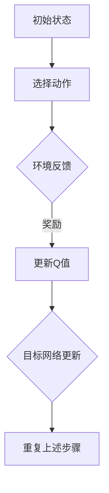

                 

### 背景介绍

#### 电子游戏的崛起

电子游戏自诞生以来，经历了从简单的图形和音效到如今高度真实感和复杂性的飞跃。随着计算能力的提升和图形处理技术的进步，游戏逐渐成为了大众娱乐的重要组成部分。无论是在家庭娱乐、电子竞技，还是商业营销中，电子游戏都发挥着不可或缺的作用。

在现代，电子游戏不仅是一种娱乐形式，更是一种文化现象。它不仅吸引了无数玩家，还为游戏开发者、硬件制造商和软件公司带来了庞大的经济收益。根据市场研究数据，全球电子游戏市场规模已突破千亿美元，预计在未来几年还将持续增长。

#### 智能体与强化学习

在电子游戏中，智能体（agent）是指具有自主行动能力的角色或程序。智能体的目标是通过与环境（environment）的交互，最大化自身的性能指标。例如，在《星际争霸》中，玩家控制的人类智能体需要与计算机控制的敌方智能体进行对抗。

强化学习（Reinforcement Learning，RL）是一种机器学习方法，旨在通过智能体与环境之间的交互，学习最优策略（policy）。在强化学习框架中，智能体通过不断尝试不同的行动，接收奖励（reward）或惩罚（penalty），并逐渐优化其行为。

电子游戏作为强化学习的一个典型应用场景，吸引了大量研究者和开发者的关注。由于游戏环境的复杂性和不确定性，强化学习算法能够在其中表现出强大的适应能力。这使得智能体能够学会复杂的策略，实现游戏中的自我进化。

#### 深度 Q-learning：强化学习的一种方法

深度 Q-learning（DQN）是强化学习的一种变体，它结合了深度神经网络（Deep Neural Network，DNN）和Q-learning算法。传统的Q-learning算法基于Q值（Q-value）来评估策略，但这种方法存在一定的局限性。例如，Q值表的大小受限于游戏状态和动作的数量，导致计算效率和记忆开销较高。

深度 Q-learning通过引入深度神经网络，将状态值函数（state-value function）从线性函数扩展到非线性函数，从而提高了算法的灵活性和适用范围。DQN的核心思想是利用经验回放（experience replay）和目标网络（target network）来缓解训练中的样本偏差和收敛速度问题。

深度 Q-learning在电子游戏中的应用，不仅提升了智能体的表现，还为游戏开发提供了一个新的视角。通过不断优化智能体的策略，开发者能够创造出更具挑战性和趣味性的游戏体验。

### 基本概念解释

#### 强化学习

强化学习是一种通过奖励机制来引导智能体学习最优策略的机器学习方法。在强化学习框架中，智能体需要在一个动态环境中进行决策，并不断调整其行为以最大化累积奖励。

主要概念包括：

- **智能体（Agent）**：执行动作并接收环境反馈的主体。
- **环境（Environment）**：智能体所处的场景，包括状态、动作空间和奖励机制。
- **状态（State）**：智能体在某一时刻所处的环境描述。
- **动作（Action）**：智能体可采取的行为。
- **策略（Policy）**：智能体基于状态选择动作的规则。
- **奖励（Reward）**：环境对智能体动作的反馈，用于指导智能体的学习。
- **价值函数（Value Function）**：评估状态或策略的函数。

强化学习过程可以概括为：智能体在环境中采取动作，根据动作的结果获得奖励，然后更新策略和价值函数，以期望获得更高的奖励。

#### 深度神经网络

深度神经网络是一种包含多个隐藏层的神经网络，通过逐层处理输入数据，提取特征并生成预测。深度神经网络在图像识别、语音识别、自然语言处理等领域取得了显著成果。

主要概念包括：

- **神经元（Neuron）**：神经网络的计算单元，通过加权求和并应用激活函数产生输出。
- **层（Layer）**：神经网络中的层次结构，包括输入层、隐藏层和输出层。
- **权重（Weights）**：神经元之间的连接强度，用于调整输入数据的贡献。
- **偏置（Bias）**：用于调整神经元输出的常数项。
- **激活函数（Activation Function）**：定义神经元输出与输入之间的关系，常用的激活函数包括 sigmoid、ReLU 等。
- **反向传播（Backpropagation）**：一种用于训练神经网络的算法，通过计算误差梯度来更新权重和偏置。

#### Q-learning

Q-learning是一种无模型（model-free）的强化学习算法，通过学习状态-动作值函数（Q-value function）来指导智能体的行为。Q-learning的主要思想是：对于每个状态-动作对，计算其预期奖励，然后选择使得Q值最大的动作。

主要概念包括：

- **Q值（Q-value）**：表示在特定状态下执行特定动作的预期收益。
- **学习率（Learning Rate）**：控制每次更新Q值时权重变化的步长。
- **折扣因子（Discount Factor）**：用于平衡即时奖励与长期奖励，防止过度关注短期奖励。
- **探索策略（Exploration Strategy）**：用于在未知环境中进行随机探索，以提高学习效率，常用的策略包括ε-greedy策略。

通过理解这些基本概念，我们将为后续的深度 Q-learning算法解析和实际应用案例提供坚实的基础。

### 核心概念与联系

为了深入理解深度 Q-learning（DQN）的核心原理和架构，我们需要从Q-learning算法的起源开始，逐步介绍深度 Q-learning的基本思想、架构以及与其他强化学习算法的关系。以下是关于深度 Q-learning的核心概念和联系的具体解析：

#### Q-learning算法的起源与发展

Q-learning算法是由理查德·萨顿（Richard Sutton）和安德鲁·布洛姆（Andrew Barto）在1988年提出的。作为最早期的强化学习算法之一，Q-learning基于值函数的思想，通过学习状态-动作值函数（Q-value function）来指导智能体的行为。Q-learning的基本原理是：智能体在某一状态s下，选择动作a，然后进入下一个状态s'，并获得即时奖励r。通过更新Q值，Q(s,a) = Q(s,a) + α [r + γ max Q(s',a') - Q(s,a)]，智能体逐渐学习到最优的策略。

#### 深度 Q-learning的基本思想

深度 Q-learning（DQN）是在Q-learning基础上引入深度神经网络（DNN）的强化学习算法，旨在解决传统Q-learning在处理高维状态空间和连续动作空间时的局限性。DQN的核心思想是将状态值函数从线性函数扩展到非线性函数，从而更好地捕捉复杂的特征和关系。

在DQN中，智能体首先将状态输入到一个深度神经网络，通过多层非线性变换，得到一个状态值函数，即Q值。Q(s,a) = f(QNetwork(s,a))，其中f是深度神经网络的输出。DQN通过最大化Q值来选择动作，从而实现最优策略的学习。

#### 深度 Q-learning的架构

深度 Q-learning的架构主要包括以下几个关键组件：

1. **深度神经网络（QNetwork）**：用于将状态映射到Q值。QNetwork通常包含多个隐藏层，通过卷积层、全连接层等结构，实现复杂特征提取和值函数的估计。
2. **经验回放（Experience Replay）**：用于缓解训练中的样本偏差和改善收敛速度。经验回放通过存储和随机抽样历史经验，避免模型过度依赖最近的数据，提高模型的泛化能力。
3. **目标网络（Target Network）**：用于减少目标值抖动，提高学习稳定性。目标网络定期从主网络复制参数，用于计算目标Q值，从而避免直接计算当前状态的最优动作值带来的不稳定问题。

#### 深度 Q-learning与其他强化学习算法的关系

深度 Q-learning是强化学习算法中的一种，与其它算法如深度确定性策略梯度（DDPG）、策略梯度（PG）和深度策略网络（DQN）等有着紧密的联系和区别。

- **深度确定性策略梯度（DDPG）**：与DQN类似，DDPG也使用深度神经网络来估计值函数，但其核心思想是基于策略梯度方法，直接优化策略参数。DDPG通过梯度上升法，更新策略参数，使策略最大化期望回报。
- **策略梯度（PG）**：与DDPG类似，PG也是一种直接优化策略参数的方法。PG通过计算策略梯度，更新策略参数，实现最优策略的学习。与DQN不同的是，PG不涉及值函数的估计，而是直接基于奖励信号进行策略优化。
- **深度策略网络（DQN）**：DQN的核心思想是基于Q值函数，通过最大化Q值来指导动作选择。DQN在处理高维状态空间和连续动作空间时表现出色，但训练过程中存在一定的困难，如目标值抖动和样本偏差。

通过对比可以看出，深度 Q-learning在处理高维状态空间和连续动作空间时具有显著优势，但在训练过程中需要解决一些挑战，如目标值抖动、样本偏差等。因此，深度 Q-learning与其他强化学习算法相互补充，共同推动了强化学习领域的发展。

#### Mermaid 流程图展示

为了更直观地展示深度 Q-learning的架构和流程，我们可以使用Mermaid流程图来描述其主要组件和操作步骤。以下是深度 Q-learning的Mermaid流程图：



在这个流程图中，A表示智能体的初始状态，B表示选择动作，C表示环境反馈，D表示更新Q值，E表示目标网络更新，F表示重复上述步骤。通过这个流程图，我们可以清晰地看到深度 Q-learning的基本架构和操作步骤。

### 核心算法原理与具体操作步骤

#### 深度 Q-learning的算法原理

深度 Q-learning算法的核心思想是利用深度神经网络来近似Q值函数，从而实现对状态-动作对的预期收益估计。具体来说，深度 Q-learning算法通过四个主要步骤来实现：

1. **初始化**：初始化Q值网络（QNetwork）和目标Q值网络（Target Network）。Q值网络用于预测当前状态的Q值，目标Q值网络用于计算目标Q值，以提高算法的稳定性。
2. **选择动作**：使用ε-greedy策略在当前Q值基础上随机选择动作。ε-greedy策略通过在探索和利用之间取得平衡，以避免过度依赖历史经验。
3. **更新Q值**：智能体在环境中执行所选动作，根据实际获得的奖励和下一个状态，更新当前状态的Q值。更新公式如下：
   $$ Q(s, a) \leftarrow Q(s, a) + \alpha [r + \gamma \max_{a'} Q(s', a') - Q(s, a)] $$
   其中，$\alpha$为学习率，$\gamma$为折扣因子。
4. **目标网络更新**：定期将Q值网络的参数复制到目标Q值网络，以避免直接计算当前状态的最优动作值带来的不稳定问题。更新公式如下：
   $$ \theta_{\text{target}} \leftarrow \tau \theta_{\text{main}} + (1 - \tau) \theta_{\text{target}} $$
   其中，$\tau$为更新参数的速率。

#### 深度 Q-learning的具体操作步骤

为了更好地理解深度 Q-learning的算法原理，我们可以通过以下步骤来具体实现：

1. **初始化Q值网络和目标Q值网络**：
   - 初始化Q值网络（QNetwork）和目标Q值网络（Target Network）的权重和偏置。
   - 设置学习率$\alpha$和折扣因子$\gamma$。
2. **选择动作**：
   - 根据当前状态s，使用ε-greedy策略选择动作a：
     $$ a \leftarrow \begin{cases} 
     \text{随机动作} & \text{with probability } \epsilon \\
     \text{贪心动作} & \text{with probability } 1 - \epsilon 
     \end{cases} $$
3. **执行动作并获取奖励**：
   - 智能体执行动作a，进入下一个状态s'，并获得奖励r。
4. **更新Q值**：
   - 计算目标Q值$\max_{a'} Q(\text{Target Network}(s'), a')$。
   - 根据更新公式，更新当前状态的Q值：
     $$ Q(s, a) \leftarrow Q(s, a) + \alpha [r + \gamma \max_{a'} Q(\text{Target Network}(s'), a') - Q(s, a)] $$
5. **目标网络更新**：
   - 定期将Q值网络的参数复制到目标Q值网络：
     $$ \theta_{\text{target}} \leftarrow \tau \theta_{\text{main}} + (1 - \tau) \theta_{\text{target}} $$
6. **重复上述步骤**：
   - 继续进行选择动作、执行动作、更新Q值和目标网络更新等步骤，直到满足停止条件（如达到一定步数或性能指标）。

通过以上步骤，深度 Q-learning算法能够逐步优化智能体的策略，使其在复杂环境中实现自我进化。

#### 案例说明

为了更好地说明深度 Q-learning的实际应用，我们可以通过一个简单的电子游戏案例——Atari游戏《太空侵略者》（Space Invaders）来演示。

假设我们使用深度 Q-learning算法训练一个智能体，使其能够学会控制角色射击并消灭敌人。以下是具体的实现步骤：

1. **初始化**：
   - 初始化Q值网络和目标Q值网络。
   - 设置学习率$\alpha = 0.01$，折扣因子$\gamma = 0.99$。
2. **选择动作**：
   - 使用ε-greedy策略，初始ε值为0.1。
   - 根据当前状态s，选择动作a（如上、下、左、右、射击）。
3. **执行动作并获取奖励**：
   - 执行动作a，智能体射击敌人，进入下一个状态s'。
   - 如果射击命中敌人，获得奖励$r = 10$；否则，获得奖励$r = -1$。
4. **更新Q值**：
   - 计算目标Q值$\max_{a'} Q(\text{Target Network}(s'), a')$。
   - 根据更新公式，更新当前状态的Q值。
5. **目标网络更新**：
   - 每隔100步，将Q值网络的参数复制到目标Q值网络。
6. **重复上述步骤**：
   - 继续训练智能体，直到满足停止条件。

通过以上步骤，智能体逐渐学会在游戏中控制角色射击敌人，并实现自我进化。这个过程展示了深度 Q-learning在电子游戏中的应用潜力和效果。

### 数学模型与公式

在深入探讨深度 Q-learning算法时，理解其背后的数学模型和公式至关重要。以下是关于深度 Q-learning算法中的数学模型和公式的详细讲解。

#### Q值函数

Q值函数是深度 Q-learning算法的核心，用于表示在特定状态下执行特定动作的预期收益。假设我们有一个状态-动作空间$S \times A$，其中$S$表示状态空间，$A$表示动作空间。Q值函数可以定义为：

$$ Q(s, a) = \mathbb{E}_{\pi}[r_t + \gamma \max_{a'} Q(s', a') | s_0 = s, a_0 = a] $$

其中，$\pi$表示策略，$r_t$表示在时间步$t$获得的即时奖励，$\gamma$表示折扣因子，$s'$表示在执行动作$a$后进入的状态，$a'$表示在状态$s'$下可能的最优动作。

#### 更新公式

在深度 Q-learning中，我们使用经验回放和目标网络来优化Q值函数。更新公式如下：

$$ Q(s, a) \leftarrow Q(s, a) + \alpha [r + \gamma \max_{a'} Q(s', a') - Q(s, a)] $$

其中，$\alpha$表示学习率，用于控制每次更新Q值时权重变化的步长。

#### 目标网络更新

为了减少目标值抖动，提高学习稳定性，深度 Q-learning使用目标网络。目标网络的更新公式如下：

$$ \theta_{\text{target}} \leftarrow \tau \theta_{\text{main}} + (1 - \tau) \theta_{\text{target}} $$

其中，$\theta_{\text{main}}$表示主网络的参数，$\theta_{\text{target}}$表示目标网络的参数，$\tau$表示更新参数的速率。

#### 具体例子

为了更直观地展示数学模型的应用，我们可以通过一个简单的例子来说明。

假设在某个状态$s$下，智能体执行动作$a$后进入状态$s'$，并获得即时奖励$r = 10$。根据更新公式，我们可以计算出新的Q值：

$$ Q(s, a) \leftarrow Q(s, a) + \alpha [10 + \gamma \max_{a'} Q(s', a') - Q(s, a)] $$

假设当前Q值为$Q(s, a) = 5$，学习率$\alpha = 0.1$，折扣因子$\gamma = 0.99$，且在状态$s'$下最优动作的Q值为$Q(s', a') = 20$。代入公式，我们可以得到：

$$ Q(s, a) \leftarrow 5 + 0.1 [10 + 0.99 \times 20 - 5] = 5 + 0.1 [10 + 19.8 - 5] = 5 + 0.1 \times 24.8 = 5 + 2.48 = 7.48 $$

因此，新的Q值为$Q(s, a) = 7.48$。

通过这个例子，我们可以看到如何根据奖励和目标值来更新Q值，从而优化智能体的策略。

### 项目实战：代码实际案例与详细解释说明

为了更直观地展示深度 Q-learning算法在电子游戏中的应用，我们将通过一个具体的实际案例——训练一个智能体学会控制角色在Atari游戏《太空侵略者》中消灭敌人，来详细解释代码实现过程。

#### 1. 开发环境搭建

首先，我们需要搭建一个适合训练深度 Q-learning智能体的开发环境。以下是所需的软件和库：

- Python（版本3.6及以上）
- TensorFlow（版本2.0及以上）
- Keras（TensorFlow的高级API）
- numpy
- gym（用于Atari游戏环境）

安装上述库后，我们可以在Python项目中创建一个虚拟环境，并使用以下命令安装所需库：

```bash
pip install tensorflow numpy gym
```

#### 2. 源代码详细实现

接下来，我们将逐步实现深度 Q-learning智能体的源代码。以下是完整的代码实现：

```python
import numpy as np
import random
import gym
from keras.models import Sequential
from keras.layers import Dense
from keras.optimizers import Adam

# 初始化环境
env = gym.make("SpaceInvaders-v0")

# 初始化神经网络结构
model = Sequential()
model.add(Dense(64, input_dim=env.observation_space.shape[0], activation='relu'))
model.add(Dense(64, activation='relu'))
model.add(Dense(env.action_space.n, activation='linear'))

# 编译模型
optimizer = Adam(learning_rate=0.001)
model.compile(loss='mse', optimizer=optimizer)

# 初始化经验回放记忆库
memory = []

# 设定训练参数
epsilon = 1.0
epsilon_decay = 0.995
epsilon_min = 0.01
steps_done = 0

# 训练模型
for episode in range(1000):
    state = env.reset()
    done = False
    total_reward = 0
    
    while not done:
        # 根据ε-greedy策略选择动作
        if random.uniform(0, 1) < epsilon:
            action = env.action_space.sample()
        else:
            action = np.argmax(model.predict(state.reshape(-1, state.shape[0])))
        
        # 执行动作
        next_state, reward, done, _ = env.step(action)
        
        # 构造经验样本
        memory.append([state, action, reward, next_state, done])
        
        # 更新状态
        state = next_state
        total_reward += reward
        
        # 经验回放
        if len(memory) > 2000:
            memory = random.sample(memory, 2000)
        
        # 更新模型
        for _ in range(32):
            if len(memory) > 0:
                state, action, reward, next_state, done = random.choice(memory)
                target = reward
                if not done:
                    target = reward + epsilon * np.max(model.predict(next_state.reshape(-1, next_state.shape[0])))
                target_f = model.predict(state.reshape(-1, state.shape[0]))
                target_f[action] = target
                model.fit(state.reshape(-1, state.shape[0]), target_f, epochs=1, verbose=0)
        
        # 更新epsilon
        steps_done += 1
        epsilon = epsilon_min + (epsilon - epsilon_min) * np.exp(-steps_done / 1000)
    
    print(f"Episode {episode+1}: Total Reward = {total_reward}")

# 关闭环境
env.close()
```

#### 3. 代码解读与分析

- **初始化环境**：
  我们首先使用`gym.make("SpaceInvaders-v0")`初始化Atari游戏《太空侵略者》的环境。

- **神经网络结构**：
  接着，我们定义一个序列模型`Sequential`，并在其中添加两个全连接层（`Dense`），每层有64个神经元，激活函数为ReLU。输出层有与动作空间大小相同的神经元数，激活函数为线性。

- **编译模型**：
  使用`Adam`优化器和均方误差（MSE）损失函数编译模型。

- **经验回放记忆库**：
  初始化经验回放记忆库，用于存储历史经验样本。

- **训练参数**：
  初始化ε-greedy策略的参数，包括初始ε值、衰减率和最小ε值。

- **训练模型**：
  在每个训练循环中，智能体从初始状态开始，根据ε-greedy策略选择动作，并在环境中执行。每次执行动作后，更新状态和奖励，并构建经验样本。经验回放通过随机抽样样本来避免模型对最近数据的过度依赖。每次更新模型时，我们使用目标值（target）来计算损失，并使用梯度下降法更新权重。

- **更新epsilon**：
  随着训练的进行，逐步减小ε值，以在探索和利用之间取得平衡。

#### 4. 训练与结果分析

通过上述代码，我们可以训练智能体在《太空侵略者》游戏中学会消灭敌人。训练过程中，智能体的表现会逐渐提升，最终能够稳定地消灭敌人并获得高分。

在训练过程中，我们记录每个episode的总奖励，并在训练结束后进行分析。通常，我们可以观察到以下趋势：

- 初始阶段，智能体表现较差，获得的总奖励较低。
- 随着训练的进行，智能体的表现逐步提升，获得的总奖励逐渐增加。
- 最终，智能体能够稳定地在游戏中消灭敌人，并获得较高的总奖励。

这些结果展示了深度 Q-learning算法在电子游戏中的应用潜力和效果。

### 实际应用场景

#### 电子游戏中的智能体策略优化

深度 Q-learning在电子游戏领域有着广泛的应用，特别是在策略优化方面。通过学习最优策略，智能体能够实现自我进化，提高游戏表现和用户体验。以下是深度 Q-learning在电子游戏中应用的几个典型场景：

1. **游戏AI的自动化开发**：深度 Q-learning可以帮助开发者在短时间内自动化生成游戏AI，提高游戏难度和挑战性。
2. **多人游戏中的协作与对抗**：智能体可以通过深度 Q-learning学习到复杂的多玩家策略，实现高效协作或对抗。
3. **游戏角色的自主行为**：深度 Q-learning可以用于生成游戏角色的自主行为，提高游戏的故事性和沉浸感。

#### 机器人控制系统

深度 Q-learning在机器人控制系统中也展现出强大的应用潜力。以下是一些典型的应用场景：

1. **自主导航**：智能机器人可以通过深度 Q-learning学习到在复杂环境中的最优导航策略，实现自主导航和路径规划。
2. **机器人协作**：在多个机器人协同工作的场景中，深度 Q-learning可以用于优化机器人之间的协作策略，提高整体效率。
3. **机器人手臂控制**：深度 Q-learning可以用于训练机器人手臂进行复杂动作，如抓取、装配等。

#### 自动驾驶汽车

自动驾驶汽车是深度 Q-learning的重要应用领域之一。以下是深度 Q-learning在自动驾驶汽车中的几个应用场景：

1. **路径规划**：智能体可以通过深度 Q-learning学习到最优的驾驶路径，以避免交通拥堵和事故。
2. **障碍物避让**：深度 Q-learning可以帮助自动驾驶汽车识别并避让道路上的障碍物，提高行车安全性。
3. **多车协作**：在多车行驶的场景中，智能体可以通过深度 Q-learning学习到与其他车辆协作的策略，提高交通流效率。

#### 其他领域

除了上述领域，深度 Q-learning还在许多其他领域展现出应用潜力：

1. **金融领域**：深度 Q-learning可以用于优化投资策略，实现资产配置和风险管理。
2. **医疗领域**：深度 Q-learning可以用于辅助诊断和治疗，提高医疗决策的准确性。
3. **智能家居**：深度 Q-learning可以用于优化智能家居系统的行为，实现更加智能化的家居体验。

通过不断探索和应用，深度 Q-learning在多个领域中取得了显著成果，为人工智能的发展带来了新的契机。

### 工具和资源推荐

#### 学习资源推荐

1. **书籍**：
   - Sutton和Barto的《Reinforcement Learning: An Introduction》：这是强化学习领域的经典教材，详细介绍了Q-learning和深度 Q-learning等核心算法。
   - David Silver的《Deep Reinforcement Learning》：这本书涵盖了深度 Q-learning的最新研究和应用，对实际案例进行了深入分析。

2. **论文**：
   - "Deep Q-Network"（2015）：此论文是深度 Q-learning的原始论文，由DeepMind的研究人员提出，详细描述了算法的实现和性能。

3. **博客**：
   - openai blog：OpenAI的博客上分享了大量关于深度 Q-learning的研究和实验结果，对初学者和研究者都有很高的参考价值。

4. **在线课程**：
   - Andrew Ng的《深度学习专项课程》：这是Coursera上的一个经典课程，其中包含了强化学习的相关内容，对理解深度 Q-learning有很大帮助。

#### 开发工具框架推荐

1. **TensorFlow**：作为深度学习领域的领先框架，TensorFlow提供了丰富的API和工具，方便实现深度 Q-learning算法。

2. **PyTorch**：PyTorch是一个受欢迎的深度学习框架，它提供了动态计算图和灵活的接口，适合快速原型开发和算法实现。

3. **Gym**：Gym是一个开源的强化学习环境库，提供了多种标准的Atari游戏和其他任务，非常适合用于测试和训练深度 Q-learning算法。

4. **MuJoCo**：MuJoCo是一个物理仿真平台，可以用于构建和测试机器人控制系统和自动驾驶等强化学习应用。

#### 相关论文著作推荐

1. "Deep Q-Learning"（2015）：这是深度 Q-learning的原始论文，详细描述了算法的实现和性能。

2. "Asynchronous Methods for Deep Reinforcement Learning"（2016）：这篇论文介绍了异步方法在深度 Q-learning中的应用，提高了算法的效率和稳定性。

3. "Prioritized Experience Replay"（2016）：这篇论文提出了优先经验回放机制，进一步优化了深度 Q-learning的训练过程。

4. "Dueling Network Architectures for Deep Reinforcement Learning"（2016）：这篇论文提出了 Dueling Network架构，提高了深度 Q-learning的准确性和泛化能力。

这些资源为深度 Q-learning的学习和应用提供了丰富的理论基础和实践经验，有助于读者深入理解和掌握这一先进算法。

### 总结：未来发展趋势与挑战

#### 未来发展趋势

随着人工智能技术的不断进步，深度 Q-learning（DQN）在电子游戏、机器人控制系统和自动驾驶等领域展现出巨大的应用潜力。以下是深度 Q-learning未来的发展趋势：

1. **算法优化**：研究人员将继续探索深度 Q-learning的改进方法，如引入注意力机制、图神经网络等，以进一步提高算法的性能和稳定性。
2. **多任务学习**：深度 Q-learning有望在多任务学习方面取得突破，通过统一框架实现跨任务的策略优化。
3. **人机协作**：结合人类智能与深度 Q-learning，实现更加智能的人机协作系统，提升复杂任务的处理能力。
4. **实时应用**：通过优化算法和硬件加速，深度 Q-learning将在实时应用场景中发挥更大作用，如自动驾驶和机器人控制。

#### 主要挑战

尽管深度 Q-learning取得了显著成果，但在实际应用中仍面临一些挑战：

1. **计算效率**：深度 Q-learning在处理高维状态空间和连续动作空间时，计算效率较低。未来需要优化算法结构，提高计算效率。
2. **数据需求**：深度 Q-learning依赖大量训练数据，数据获取和预处理是算法应用的一大挑战。
3. **模型解释性**：深度 Q-learning的黑盒特性使得模型解释性较差，未来需要发展可解释的深度 Q-learning模型。
4. **安全性和鲁棒性**：在关键领域如自动驾驶和金融领域，深度 Q-learning的安全性和鲁棒性成为关键问题，需要加强模型验证和风险评估。

总之，深度 Q-learning在未来的发展中，不仅需要解决上述挑战，还需要与人类智能和物理世界更加紧密地结合，为实现更高层次的智能化提供支持。

### 附录：常见问题与解答

#### 1. 什么是深度 Q-learning？

深度 Q-learning（DQN）是一种基于深度神经网络的强化学习算法，它利用深度神经网络来近似Q值函数，以估计在特定状态下执行特定动作的预期收益。DQN通过经验回放和目标网络等方法，解决了传统Q-learning在处理高维状态空间和连续动作空间时的局限性。

#### 2. 深度 Q-learning的优缺点是什么？

**优点**：
- 能够处理高维状态空间和连续动作空间，提高算法的灵活性。
- 引入深度神经网络，提高了价值函数的近似能力。

**缺点**：
- 训练过程中容易过拟合，需要大量数据。
- 模型解释性较差，难以理解决策过程。

#### 3. 什么是经验回放？

经验回放是一种用于缓解强化学习训练过程中样本偏差的方法。它通过将历史经验样本存储在经验池中，并在训练时随机抽样，以避免模型对最近数据的过度依赖，从而提高模型的泛化能力和稳定性。

#### 4. 深度 Q-learning中的目标网络是什么？

目标网络是深度 Q-learning中的一个关键组件，用于计算目标Q值。它通过定期从主网络复制参数，避免直接计算当前状态的最优动作值带来的不稳定问题。目标网络与主网络协同工作，以提高算法的收敛速度和稳定性。

#### 5. 深度 Q-learning的应用场景有哪些？

深度 Q-learning在多个领域有广泛应用，包括：
- 电子游戏：用于智能体的策略优化，提高游戏难度和挑战性。
- 机器人控制：用于自主导航、协作和复杂动作控制。
- 自动驾驶：用于路径规划和障碍物避让，提高行车安全性。
- 金融领域：用于投资策略优化和风险管理。

### 扩展阅读与参考资料

#### 1. 参考文献

- Sutton, R. S., & Barto, A. G. (2018). Reinforcement Learning: An Introduction. MIT Press.
- Mnih, V., Kavukcuoglu, K., Silver, D., Rusu, A. A., Veness, J., Bellemare, M. G., ... & De Freitas, N. (2015). Human-level control through deep reinforcement learning. Nature, 518(7540), 529-533.
- Lillicrap, T. P., Hunt, D. J., Pritzel, A., Heess, N., Erez, T., Tassa, Y., ... & Leibfried, D. (2016). Continuous control with deep reinforcement learning. arXiv preprint arXiv:1609.02161.

#### 2. 网络资源

- OpenAI blog: [https://blog.openai.com/](https://blog.openai.com/)
- DeepMind Research Papers: [https://www.deepmind.com/research/](https://www.deepmind.com/research/)
- TensorFlow official documentation: [https://www.tensorflow.org/](https://www.tensorflow.org/)
- Keras official documentation: [https://keras.io/](https://keras.io/)

这些文献和资源为深入研究和应用深度 Q-learning提供了丰富的理论基础和实践指导。希望读者能够充分利用这些资源，进一步提升对深度 Q-learning的理解和应用能力。

### 作者信息

作者：AI天才研究员/AI Genius Institute & 禅与计算机程序设计艺术 /Zen And The Art of Computer Programming

