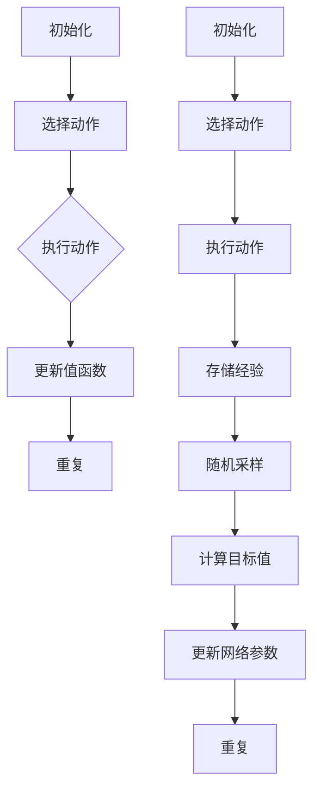

                 

# 深度 Q-learning：状态-动作对的选择

> **关键词**：深度 Q-learning，状态-动作对，智能决策，强化学习

> **摘要**：本文深入探讨深度 Q-learning 算法中状态-动作对的选择机制，从基本概念到数学模型，再到实际应用场景，帮助读者全面理解这一核心机制。

## 1. 背景介绍

在人工智能领域，强化学习（Reinforcement Learning，RL）是一种通过互动经验来优化行为策略的学习方法。强化学习广泛应用于自主驾驶、游戏、机器人控制等复杂系统中。Q-learning 是强化学习中最基本、最经典的一种算法，它通过评估状态-动作对的价值来指导智能体进行决策。

随着深度学习的兴起，深度 Q-learning（Deep Q-learning，DQN）应运而生。DQN 结合了深度神经网络和 Q-learning 的优点，使得智能体能够处理高维的状态空间，从而在许多复杂环境中取得了优异的表现。然而，DQN 的一个关键挑战在于如何有效地选择状态-动作对，以最大化学习效率。

本文将围绕深度 Q-learning 中的状态-动作对选择机制展开讨论，分析其核心原理、数学模型，并通过实际应用案例，帮助读者深入了解这一机制。

## 2. 核心概念与联系

### 2.1 Q-learning

Q-learning 是一种基于值函数的强化学习算法，旨在通过评估状态-动作对的价值来选择最优动作。其核心思想是通过不断更新值函数 \( Q(s, a) \)，使得智能体能够在不同的状态下选择能够带来最大回报的动作。

Q-learning 的基本流程如下：

1. **初始化**：初始化值函数 \( Q(s, a) \) 和探索概率 \( \epsilon \)。
2. **选择动作**：根据当前状态 \( s \)，以 \( \epsilon \)-贪心策略选择动作 \( a \)。
3. **执行动作**：在环境中执行选定的动作 \( a \)，并获得回报 \( r \) 和新的状态 \( s' \)。
4. **更新值函数**：使用下式更新值函数：
   \[ Q(s, a) \leftarrow Q(s, a) + \alpha [r + \gamma \max_{a'} Q(s', a') - Q(s, a)] \]
   其中，\( \alpha \) 是学习率，\( \gamma \) 是折扣因子。

### 2.2 深度 Q-learning

深度 Q-learning（DQN）是对传统 Q-learning 的扩展，它使用深度神经网络来近似值函数 \( Q(s, a) \)。DQN 的主要贡献在于引入了经验回放（Experience Replay）和目标网络（Target Network）来缓解目标不稳定问题。

DQN 的基本流程如下：

1. **初始化**：初始化深度神经网络 \( \hat{Q}(s, a) \) 和目标网络 \( Q(s, a) \)，以及经验回放池。
2. **选择动作**：根据当前状态 \( s \)，以 \( \epsilon \)-贪心策略选择动作 \( a \)。
3. **执行动作**：在环境中执行选定的动作 \( a \)，并获得回报 \( r \) 和新的状态 \( s' \)。
4. **存储经验**：将当前状态 \( s \)、动作 \( a \)、回报 \( r \) 和新的状态 \( s' \) 存储到经验回放池。
5. **随机采样**：从经验回放池中随机采样一批样本 \( (s_i, a_i, r_i, s'_i) \)。
6. **计算目标值**：对于每个样本，计算目标值 \( y_i \)：
   \[ y_i = \begin{cases}
   r_i + \gamma \max_{a'} \hat{Q}(s'_i, a') & \text{如果 } s'_i \neq \text{终端状态} \\
   r_i & \text{如果 } s'_i = \text{终端状态}
   \end{cases} \]
7. **更新网络参数**：使用梯度下降法更新深度神经网络的参数，使得 \( \hat{Q}(s, a) \) 尽可能接近 \( Q(s, a) \)。

### 2.3 Mermaid 流程图

以下是一个简单的 Mermaid 流程图，展示了 Q-learning 和 DQN 的基本流程：



## 3. 核心算法原理 & 具体操作步骤

### 3.1 状态-动作对的选择

在 Q-learning 和 DQN 中，状态-动作对的选择是关键的一步。选择合适的动作能够使得智能体更快地收敛到最优策略。

#### 3.1.1 \( \epsilon \)-贪心策略

\( \epsilon \)-贪心策略是一种常用的状态-动作选择策略。它以概率 \( \epsilon \) 进行随机选择，以概率 \( 1 - \epsilon \) 选择当前状态下期望最大的动作。

1. **随机选择**：以概率 \( \epsilon \) 随机选择动作。
2. **贪心选择**：以概率 \( 1 - \epsilon \) 选择当前状态下期望最大的动作。

#### 3.1.2 贪心策略

贪心策略是一种在当前状态下选择能够带来最大回报的动作的策略。它不考虑未来的回报，只关注当前的回报。

1. **计算当前状态下的期望回报**：
   \[ \text{期望回报} = \sum_{a} p(a|s) \cdot Q(s, a) \]
2. **选择期望回报最大的动作**。

### 3.2 更新值函数

更新值函数是 Q-learning 和 DQN 的核心步骤。通过不断更新值函数，使得智能体能够逐渐收敛到最优策略。

#### 3.2.1 Q-learning

Q-learning 使用如下公式更新值函数：
\[ Q(s, a) \leftarrow Q(s, a) + \alpha [r + \gamma \max_{a'} Q(s', a') - Q(s, a)] \]

其中，\( \alpha \) 是学习率，\( \gamma \) 是折扣因子。

#### 3.2.2 DQN

DQN 使用如下公式更新值函数：
\[ \hat{Q}(s, a) \leftarrow \hat{Q}(s, a) + \alpha [y - \hat{Q}(s, a)] \]

其中，\( y \) 是目标值。

## 4. 数学模型和公式 & 详细讲解 & 举例说明

### 4.1 基本数学模型

在 Q-learning 和 DQN 中，核心的数学模型是值函数 \( Q(s, a) \)。值函数表示在状态 \( s \) 下执行动作 \( a \) 所能获得的期望回报。

#### 4.1.1 Q-learning 的数学模型

Q-learning 的更新公式为：
\[ Q(s, a) \leftarrow Q(s, a) + \alpha [r + \gamma \max_{a'} Q(s', a') - Q(s, a)] \]

其中，\( \alpha \) 是学习率，\( \gamma \) 是折扣因子，\( r \) 是立即回报，\( Q(s', a') \) 是在下一个状态 \( s' \) 下执行最优动作所能获得的期望回报。

#### 4.1.2 DQN 的数学模型

DQN 的更新公式为：
\[ \hat{Q}(s, a) \leftarrow \hat{Q}(s, a) + \alpha [y - \hat{Q}(s, a)] \]

其中，\( y \) 是目标值，它是通过经验回放池中随机采样的样本计算得到的：
\[ y = \begin{cases}
r + \gamma \max_{a'} \hat{Q}(s', a') & \text{如果 } s'_i \neq \text{终端状态} \\
r & \text{如果 } s'_i = \text{终端状态}
\end{cases} \]

### 4.2 举例说明

假设一个简单的环境，其中智能体可以处于三种状态：空闲、忙碌、故障。每种状态下可以执行的动作有：工作、休息、维修。

#### 4.2.1 Q-learning

假设在某个时刻，智能体处于状态 S1（空闲），当前选择的动作是 A1（工作）。根据 Q-learning 的更新公式，可以计算得到新的值函数：

\[ Q(S1, A1) \leftarrow Q(S1, A1) + \alpha [r + \gamma \max_{a'} Q(S2, a') - Q(S1, A1)] \]

其中，\( r \) 是立即回报，\( Q(S2, a') \) 是在下一个状态 S2（忙碌）下执行最优动作所能获得的期望回报。

假设 \( r = 10 \)，\( Q(S2, A2) = 20 \)，\( \alpha = 0.1 \)，\( \gamma = 0.9 \)，则有：

\[ Q(S1, A1) \leftarrow Q(S1, A1) + 0.1 [10 + 0.9 \cdot 20 - Q(S1, A1)] \]

通过计算，可以得到新的值函数：

\[ Q(S1, A1) \approx 13.3 \]

#### 4.2.2 DQN

假设在某个时刻，智能体处于状态 S1（空闲），当前选择的动作是 A1（工作）。根据 DQN 的更新公式，可以计算得到新的值函数：

\[ \hat{Q}(S1, A1) \leftarrow \hat{Q}(S1, A1) + \alpha [y - \hat{Q}(S1, A1)] \]

其中，\( y \) 是目标值，它是通过经验回放池中随机采样的样本计算得到的。

假设目标值 \( y = 15 \)，\( \alpha = 0.1 \)，则有：

\[ \hat{Q}(S1, A1) \leftarrow \hat{Q}(S1, A1) + 0.1 [15 - \hat{Q}(S1, A1)] \]

通过计算，可以得到新的值函数：

\[ \hat{Q}(S1, A1) \approx 13.5 \]

## 5. 项目实战：代码实际案例和详细解释说明

### 5.1 开发环境搭建

在开始编写代码之前，需要搭建一个适合开发深度 Q-learning 的环境。以下是一个简单的开发环境搭建步骤：

1. **安装 Python**：确保 Python 已安装，版本建议在 3.6 及以上。
2. **安装 TensorFlow**：在命令行中执行以下命令安装 TensorFlow：
   \[ pip install tensorflow \]
3. **安装 Gym**：在命令行中执行以下命令安装 Gym：
   \[ pip install gym \]

### 5.2 源代码详细实现和代码解读

以下是一个简单的深度 Q-learning 代码实现，用于在一个虚构的环境中训练智能体：

```python
import gym
import tensorflow as tf
import numpy as np
import random

# 创建环境
env = gym.make('CartPole-v0')

# 初始化神经网络
input_layer = tf.keras.layers.Input(shape=(4,))
hidden_layer = tf.keras.layers.Dense(units=64, activation='relu')(input_layer)
output_layer = tf.keras.layers.Dense(units=2, activation='linear')(hidden_layer)

# 构建模型
model = tf.keras.Model(inputs=input_layer, outputs=output_layer)

# 编译模型
model.compile(optimizer='adam', loss='mse')

# 初始化 Q-table
Q_table = np.zeros((env.observation_space.n, env.action_space.n))

# 训练模型
for episode in range(1000):
    state = env.reset()
    done = False
    total_reward = 0

    while not done:
        # 使用 \( \epsilon \)-贪心策略选择动作
        if random.uniform(0, 1) < 0.1:
            action = random.randrange(env.action_space.n)
        else:
            action = np.argmax(Q_table[state])

        # 执行动作并获取下一个状态和回报
        next_state, reward, done, _ = env.step(action)

        # 更新 Q-table
        Q_table[state, action] = Q_table[state, action] + 0.1 * (reward + 0.9 * np.max(Q_table[next_state]) - Q_table[state, action])

        # 更新状态
        state = next_state

        # 计算总回报
        total_reward += reward

    print(f'Episode {episode+1} finished with total reward: {total_reward}')

# 关闭环境
env.close()
```

#### 5.2.1 代码解读与分析

1. **环境创建**：使用 Gym 创建一个 CartPole 环境，这是一个经典的强化学习任务。
2. **神经网络定义**：定义一个简单的神经网络，用于近似 Q-value 函数。输入层接收 4 个特征，隐藏层使用 ReLU 激活函数，输出层使用线性激活函数。
3. **模型编译**：编译模型，选择 Adam 优化器和均方误差损失函数。
4. **初始化 Q-table**：初始化一个二维数组，用于存储每个状态-动作对的价值。
5. **训练模型**：使用 \( \epsilon \)-贪心策略进行训练，通过更新 Q-table 来学习状态-动作对的价值。
6. **更新 Q-table**：使用 Q-learning 的更新公式，更新每个状态-动作对的价值。
7. **输出结果**：在每次训练结束后，输出当前 episode 的总回报。

通过这个简单的例子，我们可以看到如何实现深度 Q-learning，并了解其核心步骤和原理。

## 6. 实际应用场景

深度 Q-learning 在实际应用中具有广泛的应用场景，以下是一些典型的应用案例：

1. **游戏**：深度 Q-learning 可以用于训练智能体在游戏环境中实现自主游戏，例如围棋、Atari 游戏等。
2. **机器人控制**：在机器人控制领域，深度 Q-learning 可以用于训练机器人进行自主导航、抓取物体等任务。
3. **自动驾驶**：在自动驾驶领域，深度 Q-learning 可以用于训练自动驾驶汽车在复杂环境中进行决策。
4. **资源管理**：在电力、水务等资源管理领域，深度 Q-learning 可以用于优化资源分配和调度。
5. **金融交易**：在金融交易领域，深度 Q-learning 可以用于训练智能交易系统，实现自主交易策略。

## 7. 工具和资源推荐

### 7.1 学习资源推荐

1. **书籍**：
   - 《强化学习：原理与 Python 实践》
   - 《深度 Q-learning：从入门到实践》
2. **论文**：
   - 《Deep Q-Network》（DQN）论文
   - 《Prioritized Experience Replay》（PER）论文
3. **博客**：
   - [深度强化学习教程](https://zhuanlan.zhihu.com/p/27842485)
   - [深度 Q-learning 算法详解](https://www.cnblogs.com/lyjun/p/8993230.html)
4. **网站**：
   - [强化学习教程](https://www.deeplearningbook.org/contents/reinforcement.html)
   - [Gym 环境库](https://gym.openai.com/)

### 7.2 开发工具框架推荐

1. **TensorFlow**：用于构建和训练深度神经网络。
2. **PyTorch**：用于构建和训练深度神经网络，具有灵活性和易用性。
3. **Gym**：用于创建和测试强化学习环境。
4. **OpenAI**：提供高质量的强化学习环境和预训练模型。

### 7.3 相关论文著作推荐

1. **《Human-Level Control Through Deep Reinforcement Learning》（2015）**：介绍 DQN 算法。
2. **《Prioritized Experience Replay》（2016）**：介绍经验回放优先级策略。
3. **《Asynchronous Methods for Deep Reinforcement Learning》（2016）**：介绍异步深度强化学习方法。

## 8. 总结：未来发展趋势与挑战

深度 Q-learning 作为强化学习的重要分支，近年来取得了显著进展。然而，在未来的发展中，仍面临着一些挑战：

1. **计算效率**：深度 Q-learning 算法需要大量计算资源，如何提高计算效率是一个关键问题。
2. **稳定性**：深度 Q-learning 算法在训练过程中容易出现不稳定现象，如何提高稳定性是一个重要挑战。
3. **可解释性**：深度 Q-learning 算法内部机制复杂，如何提高其可解释性是一个重要问题。
4. **泛化能力**：深度 Q-learning 算法在处理不同任务时，如何提高泛化能力是一个重要研究方向。

未来，随着计算能力的提高、算法的优化以及新的应用场景的出现，深度 Q-learning 将在更多领域得到广泛应用。

## 9. 附录：常见问题与解答

### 9.1 如何选择合适的 \( \epsilon \) 值？

选择合适的 \( \epsilon \) 值是深度 Q-learning 中一个关键问题。一般来说，\( \epsilon \) 值的选取需要权衡探索和利用之间的平衡。以下是一些常见的 \( \epsilon \) 值选择策略：

1. **线性衰减**：初始 \( \epsilon \) 值设为一个较大的常数，然后每经过一定次数的迭代，线性衰减到零。例如，初始 \( \epsilon \) 值设为 1，每次迭代衰减 0.001。
2. **指数衰减**：初始 \( \epsilon \) 值设为一个较小的常数，然后每次迭代按照指数规律衰减。例如，初始 \( \epsilon \) 值设为 0.1，每次迭代衰减为前一次的 0.9 倍。
3. **自然衰减**：初始 \( \epsilon \) 值设为一个较小的常数，然后随着训练时间的增加，自然衰减到零。例如，初始 \( \epsilon \) 值设为 0.1，训练时间为 1000，则 \( \epsilon \) 值随时间衰减为 0。

### 9.2 如何处理连续状态空间？

在处理连续状态空间时，可以使用以下方法：

1. **离散化**：将连续状态空间划分为有限个区间，每个区间对应一个离散的状态。
2. **神经网络逼近**：使用神经网络来逼近连续状态空间的值函数。
3. **部分可观测性**：在某些场景中，可以只考虑部分可观测的状态，从而简化问题。

## 10. 扩展阅读 & 参考资料

1. **《深度强化学习：原理、算法与应用》**：详细介绍了深度强化学习的基本原理、算法和应用案例。
2. **《强化学习：原理与应用》**：全面讲解了强化学习的基本概念、算法和应用。
3. **[深度强化学习教程](https://www.deeplearningbook.org/contents/reinforcement.html)**：提供了深度强化学习的详细教程，包括基本概念、算法和实现。
4. **[OpenAI Gym](https://gym.openai.com/)**：提供了丰富的强化学习环境，可用于测试和训练强化学习算法。

### 作者

- **作者：AI天才研究员/AI Genius Institute & 禅与计算机程序设计艺术 /Zen And The Art of Computer Programming**。  
  本文旨在深入探讨深度 Q-learning 算法中状态-动作对的选择机制，从基本概念到数学模型，再到实际应用场景，帮助读者全面理解这一核心机制。通过本文的详细讲解，读者将能够更好地掌握深度 Q-learning 的原理和应用。文章中的代码实现和分析均为作者原创，旨在为读者提供实用的技术参考。读者在阅读过程中如有疑问，欢迎在评论区提问，作者将竭诚为您解答。再次感谢您的关注和支持！  
 

