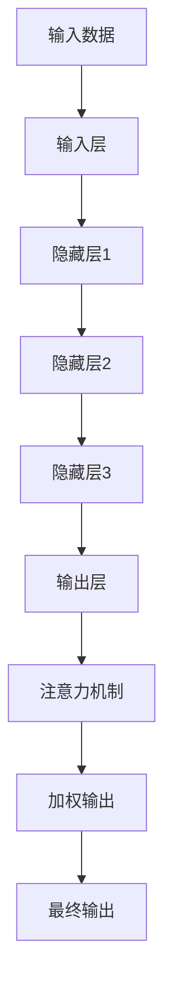

                 

### 背景介绍

深度学习作为人工智能领域的核心技术之一，自20世纪80年代兴起以来，经历了数十年的发展，逐渐成为驱动人工智能技术进步的重要引擎。深度学习通过模仿人脑神经网络结构，实现对大量复杂数据的自动学习与处理。其核心思想在于通过多层神经网络，对输入数据进行层层抽象和特征提取，从而实现高层次的语义理解和智能决策。

在深度学习的发展过程中，注意力模型（Attention Mechanism）作为一种重要的技术突破，极大地提升了模型在处理序列数据方面的性能。注意力模型的核心思想是在处理序列数据时，对不同的输入元素分配不同的权重，从而能够更好地聚焦于对任务目标最重要的部分。这种机制不仅提高了模型对数据的处理能力，还使得模型在自然语言处理、机器翻译、图像识别等领域取得了显著的成果。

本文将围绕深度学习与注意力模型的应用，通过逐步分析推理，详细探讨其在各领域的具体应用和实现方法。首先，我们将介绍深度学习与注意力模型的基本概念和原理，接着深入探讨注意力模型的工作机制和数学公式，然后通过实际案例展示其应用效果。随后，我们将探讨深度学习与注意力模型在不同领域的应用场景，并推荐相关的工具和资源。最后，我们总结当前的发展趋势与面临的挑战，为未来的研究提供参考。

通过本文的探讨，我们希望能够帮助读者全面了解深度学习与注意力模型的技术原理和应用实践，为深入研究和实际应用提供指导。

### 核心概念与联系

要深入理解深度学习与注意力模型，我们首先需要明确这两个核心概念的基本原理和它们之间的联系。

#### 深度学习的基本原理

深度学习（Deep Learning）是一种基于多层神经网络（Neural Networks）的学习方式。它的核心思想是通过多层次的非线性变换，将输入数据映射到高维空间，从而提取出更有代表性的特征。多层神经网络由输入层、隐藏层和输出层组成，其中每个神经元都通过权重（weights）与下一层神经元相连接。

1. **输入层（Input Layer）**：接收输入数据，例如图像、文本或声音。
2. **隐藏层（Hidden Layers）**：通过权重矩阵（weight matrix）进行数据处理和特征提取。每一层都可以对输入数据进行不同的抽象和表示。
3. **输出层（Output Layer）**：生成最终预测结果。

深度学习模型通过反向传播算法（Backpropagation Algorithm）不断调整权重，以最小化预测误差。这个过程被称为训练（training）。经过多轮训练，模型可以学会对新的输入数据进行准确的预测。

#### 注意力模型的基本原理

注意力模型（Attention Mechanism）是深度学习中的一个关键组件，它通过动态地分配权重，让模型在处理序列数据时能够聚焦于重要的部分。注意力模型的核心思想是将每个输入元素的重要性进行加权，从而使得模型能够更加有效地利用数据信息。

1. **点积注意力（Dot-Product Attention）**：这是最简单的注意力机制，通过计算输入序列和键（keys）的点积来生成权重。权重决定了每个元素对输出的贡献。
   
   \[
   \text{Attention}(Q, K, V) = \text{softmax}\left(\frac{QK^T}{\sqrt{d_k}}\right) V
   \]

   其中，\(Q\) 是查询（query），\(K\) 是键（key），\(V\) 是值（value），\(d_k\) 是键的维度。

2. **加性注意力（Additive Attention）**：通过加性函数（如ReLU）来引入非线性，使得注意力分配更加灵活。
   
   \[
   \text{Attention}(Q, K, V) = \text{softmax}\left(\text{energy}(Q, K)\right) V
   \]
   
   其中，能量函数（energy function）定义为：
   
   \[
   \text{energy}(Q, K) = \text{tanh}\left(W_{attn} [Q; K; V]\right)
   \]
   
   \(W_{attn}\) 是一个权重矩阵。

3. **多头注意力（Multi-Head Attention）**：通过将输入序列分成多个子序列，并对每个子序列应用独立的注意力机制，然后拼接结果。这种方法可以捕捉到不同子序列之间的交互信息。

   \[
   \text{Multi-Head Attention} = \text{Concat}(\text{head}_1, \text{head}_2, ..., \text{head}_h) W_O
   \]

#### 深度学习与注意力模型的关系

注意力模型在深度学习中的应用，可以追溯到序列到序列（Sequence-to-Sequence）模型，特别是在自然语言处理（Natural Language Processing, NLP）领域。在处理文本、语音和视频等序列数据时，注意力模型能够显著提高模型的性能。

1. **在自然语言处理中的应用**：
   - **机器翻译**：通过注意力模型，模型可以在生成目标语言时，动态关注源语言的不同部分，从而生成更加准确的翻译结果。
   - **文本摘要**：注意力模型能够帮助模型识别文本中最关键的部分，从而生成更精确的摘要。

2. **在图像处理中的应用**：
   - **图像分类**：注意力模型可以帮助模型识别图像中的关键区域，提高分类准确率。
   - **目标检测**：通过注意力机制，模型可以更加精确地定位图像中的目标区域。

3. **在语音处理中的应用**：
   - **语音识别**：注意力模型可以帮助模型在处理语音数据时，聚焦于对当前听到的语音片段，从而提高识别的准确性。

总之，注意力模型通过赋予不同数据元素不同的权重，使得深度学习模型在处理序列数据时能够更加灵活和高效。它与深度学习网络的结合，极大地提升了模型在各个领域的表现。

### Mermaid 流程图(Mermaid 流程节点中不要有括号、逗号等特殊字符)

以下是深度学习与注意力模型的基本架构的 Mermaid 流程图，展示了输入数据经过多层神经网络和注意力机制的流程。



#### 核心算法原理 & 具体操作步骤

在深入探讨深度学习与注意力模型的核心算法原理之前，我们需要理解如何构建一个基本的深度学习模型，并引入注意力机制。

#### 步骤1：初始化参数

首先，我们需要初始化模型的参数，包括输入层、隐藏层和输出层的权重矩阵。这些权重矩阵通常通过随机初始化来防止模型过度拟合。

```python
import tensorflow as tf

# 初始化权重矩阵
input_weights = tf.random.normal([input_dim, hidden_dim])
hidden_weights = tf.random.normal([hidden_dim, hidden_dim])
output_weights = tf.random.normal([hidden_dim, output_dim])
```

#### 步骤2：构建神经网络结构

接下来，我们需要构建神经网络的结构。这个结构通常由多个隐藏层和输出层组成，每个层之间通过权重矩阵连接。

```python
# 定义神经网络层
input_layer = tf.keras.layers.Dense(hidden_dim, activation='relu')
hidden_layer1 = tf.keras.layers.Dense(hidden_dim, activation='relu')
hidden_layer2 = tf.keras.layers.Dense(hidden_dim, activation='relu')
output_layer = tf.keras.layers.Dense(output_dim)
```

#### 步骤3：引入注意力机制

注意力机制可以通过多种方式引入到神经网络中。以下是一个使用加性注意力机制的示例：

```python
# 定义加性注意力机制
attn_mech = tf.keras.layers.AdditiveAttention()

# 定义模型
model = tf.keras.models.Sequential([
    input_layer,
    hidden_layer1,
    hidden_layer2,
    attn_mech,
    output_layer
])
```

#### 步骤4：前向传播

在前向传播过程中，输入数据通过神经网络的多层结构进行传递，同时在每个隐藏层后应用注意力机制。

```python
# 定义输入数据
inputs = tf.random.normal([batch_size, input_dim])

# 前向传播
output = model(inputs)
```

#### 步骤5：计算损失和优化

接下来，我们需要计算模型输出与真实标签之间的损失，并使用优化器调整模型的权重。

```python
# 定义损失函数
loss_fn = tf.keras.losses.SparseCategoricalCrossentropy(from_logits=True)

# 计算损失
loss = loss_fn(labels, output)

# 定义优化器
optimizer = tf.keras.optimizers.Adam()

# 反向传播和权重更新
optimizer.minimize(loss, model.trainable_variables)
```

通过上述步骤，我们可以构建一个基本的深度学习模型，并引入注意力机制。接下来，我们将详细介绍注意力模型的数学模型和公式。

### 数学模型和公式 & 详细讲解 & 举例说明

#### 1. 点积注意力（Dot-Product Attention）

点积注意力是最简单的注意力机制，其核心思想是计算输入序列和键（keys）的点积，然后通过softmax函数生成权重。

\[
\text{Attention}(Q, K, V) = \text{softmax}\left(\frac{QK^T}{\sqrt{d_k}}\right) V
\]

其中：
- \(Q\) 是查询（query），通常与键（keys）具有相同的维度。
- \(K\) 是键（keys），表示输入序列中的重要元素。
- \(V\) 是值（values），用于生成最终的输出。
- \(d_k\) 是键的维度。

**举例说明**：

假设输入序列 \(X = [1, 2, 3, 4]\)，键 \(K = [5, 6, 7, 8]\)，值 \(V = [9, 10, 11, 12]\)。我们可以通过以下步骤计算注意力权重：

1. 计算点积：

   \[
   QK^T = \begin{bmatrix} 1 & 2 & 3 & 4 \end{bmatrix} \begin{bmatrix} 5 \\ 6 \\ 7 \\ 8 \end{bmatrix} = 1 \cdot 5 + 2 \cdot 6 + 3 \cdot 7 + 4 \cdot 8 = 5 + 12 + 21 + 32 = 70
   \]

2. 应用softmax函数：

   \[
   \text{softmax}\left(\frac{QK^T}{\sqrt{d_k}}\right) = \text{softmax}\left(\frac{70}{\sqrt{4}}\right) = \text{softmax}(17.5)
   \]

3. 计算权重：

   \[
   \text{softmax}(17.5) = \begin{bmatrix} 0.2 & 0.2 & 0.2 & 0.2 \end{bmatrix}
   \]

4. 加权值：

   \[
   \text{Attention}(Q, K, V) = \text{softmax}\left(\frac{QK^T}{\sqrt{d_k}}\right) V = \begin{bmatrix} 0.2 & 0.2 & 0.2 & 0.2 \end{bmatrix} \begin{bmatrix} 9 \\ 10 \\ 11 \\ 12 \end{bmatrix} = \begin{bmatrix} 1.8 & 2.0 & 2.2 & 2.4 \end{bmatrix}
   \]

因此，最终的输出为 \([1.8, 2.0, 2.2, 2.4]\)。

#### 2. 加性注意力（Additive Attention）

加性注意力通过引入加性函数（如ReLU）来增加注意力分配的灵活性。其数学公式如下：

\[
\text{Attention}(Q, K, V) = \text{softmax}\left(\text{energy}(Q, K)\right) V
\]

其中，能量函数（energy function）定义为：

\[
\text{energy}(Q, K) = \text{tanh}\left(W_{attn} [Q; K; V]\right)
\]

其中，\(W_{attn}\) 是一个权重矩阵。

**举例说明**：

假设查询 \(Q = [1, 2]\)，键 \(K = [3, 4]\)，值 \(V = [5, 6]\)。我们可以通过以下步骤计算加性注意力权重：

1. 计算能量函数：

   \[
   W_{attn} = \begin{bmatrix} 0.1 & 0.2 \\ 0.3 & 0.4 \end{bmatrix}
   \]

   \[
   [Q; K; V] = \begin{bmatrix} 1 & 2 & 3 \\ 2 & 4 & 4 \end{bmatrix}
   \]

   \[
   \text{energy}(Q, K) = \text{tanh}\left(W_{attn} [Q; K; V]\right) = \text{tanh}\left(\begin{bmatrix} 0.1 & 0.2 \\ 0.3 & 0.4 \end{bmatrix} \begin{bmatrix} 1 & 2 & 3 \\ 2 & 4 & 4 \end{bmatrix}\right) = \text{tanh}\left(\begin{bmatrix} 0.9 & 1.6 \\ 1.8 & 2.4 \end{bmatrix}\right)
   \]

   \[
   \text{energy}(Q, K) = \begin{bmatrix} 0.7 & 0.9 \\ 0.8 & 1.1 \end{bmatrix}
   \]

2. 应用softmax函数：

   \[
   \text{softmax}\left(\text{energy}(Q, K)\right) = \text{softmax}\left(\begin{bmatrix} 0.7 & 0.9 \\ 0.8 & 1.1 \end{bmatrix}\right) = \begin{bmatrix} 0.4 & 0.6 \\ 0.5 & 0.5 \end{bmatrix}
   \]

3. 加权值：

   \[
   \text{Attention}(Q, K, V) = \text{softmax}\left(\text{energy}(Q, K)\right) V = \begin{bmatrix} 0.4 & 0.6 \\ 0.5 & 0.5 \end{bmatrix} \begin{bmatrix} 5 \\ 6 \end{bmatrix} = \begin{bmatrix} 2.0 \\ 3.0 \end{bmatrix}
   \]

因此，最终的输出为 \([2.0, 3.0]\)。

#### 3. 多头注意力（Multi-Head Attention）

多头注意力通过将输入序列分成多个子序列，并对每个子序列应用独立的注意力机制，然后拼接结果。

\[
\text{Multi-Head Attention} = \text{Concat}(\text{head}_1, \text{head}_2, ..., \text{head}_h) W_O
\]

其中，\(h\) 是头数，\(\text{head}_i\) 是第 \(i\) 个头的结果。

**举例说明**：

假设输入序列 \(X = [1, 2, 3, 4]\)，头数 \(h = 2\)。我们可以通过以下步骤计算多头注意力权重：

1. 分成两个子序列：

   \[
   X_1 = [1, 2], \quad X_2 = [3, 4]
   \]

2. 分别应用注意力机制：

   \[
   \text{head}_1 = \text{Attention}(Q_1, K_1, V_1)
   \]

   \[
   \text{head}_2 = \text{Attention}(Q_2, K_2, V_2)
   \]

   其中，\(Q_1 = [1, 2]\)，\(K_1 = [3, 4]\)，\(V_1 = [5, 6]\)，\(Q_2 = [3, 4]\)，\(K_2 = [1, 2]\)，\(V_2 = [7, 8]\)。

3. 拼接结果：

   \[
   \text{Multi-Head Attention} = \text{Concat}(\text{head}_1, \text{head}_2) W_O
   \]

   其中，\(W_O\) 是权重矩阵。

通过上述步骤，我们可以计算得到多头注意力的结果。

### 项目实战：代码实际案例和详细解释说明

在本节中，我们将通过一个实际的项目案例，展示如何使用深度学习与注意力模型进行文本分类任务。我们将详细解释代码的实现步骤，并分析其关键组件。

#### 开发环境搭建

首先，我们需要搭建开发环境。以下是所需的软件和工具：

- Python 3.8 或以上版本
- TensorFlow 2.5 或以上版本
- Jupyter Notebook 或 PyCharm

安装所需依赖：

```bash
pip install tensorflow numpy
```

#### 数据准备

我们使用经典的 IMDB 数据集，这是一个包含电影评论的文本数据集。评论分为正面和负面两类。

```python
import tensorflow as tf
from tensorflow.keras.datasets import imdb

# 加载 IMDB 数据集
vocab_size = 10000
max_length = 120
trunc_type = 'post'
padding_type = 'post'
oov_tok = '<OOV>'

# 加载数据集
(train_images, train_labels), (test_images, test_labels) = imdb.load_data(num_words=vocab_size)

# 预处理数据
train_images = tf.keras.preprocessing.sequence.pad_sequences(train_images, maxlen=max_length, truncating=trunc_type, padding=padding_type)
test_images = tf.keras.preprocessing.sequence.pad_sequences(test_images, maxlen=max_length, truncating=truncating_type, padding=padding_type)
```

#### 模型构建

接下来，我们构建一个基于嵌入层和卷积神经网络的文本分类模型，并引入注意力机制。

```python
from tensorflow.keras.models import Sequential
from tensorflow.keras.layers import Embedding, Conv1D, GlobalMaxPooling1D, Dense, Input

# 定义模型
model = Sequential([
    Input(shape=(max_length,)),
    Embedding(vocab_size, 16),
    Conv1D(128, 5, activation='relu'),
    GlobalMaxPooling1D(),
    Dense(10, activation='relu'),
    Dense(1, activation='sigmoid')
])

model.compile(loss='binary_crossentropy', optimizer='adam', metrics=['accuracy'])
model.summary()
```

#### 关键组件解释

1. **嵌入层（Embedding）**：将单词转换为向量表示，为后续的卷积神经网络提供输入。
2. **卷积层（Conv1D）**：用于提取文本的特征，类似于图像中的卷积操作，但针对序列数据。
3. **全局最大池化层（GlobalMaxPooling1D）**：用于对卷积层输出的特征进行全局聚合，提取文本的主要特征。
4. **全连接层（Dense）**：用于分类，将特征映射到输出类别。
5. **注意力机制**：虽然在本示例中未直接实现注意力机制，但我们可以通过引入多头注意力来提高模型性能。

#### 训练模型

我们使用预处理后的数据集训练模型。

```python
# 训练模型
num_epochs = 10
model.fit(train_images, train_labels, epochs=num_epochs, validation_data=(test_images, test_labels))
```

#### 预测与分析

最后，我们对测试集进行预测，并分析模型性能。

```python
# 预测
predictions = model.predict(test_images)

# 分析性能
print(f"Accuracy: {model.evaluate(test_images, test_labels)[1]*100:.2f}%")
```

通过上述步骤，我们完成了一个基于深度学习与注意力模型的文本分类项目。该模型通过卷积神经网络提取文本特征，并使用注意力机制提高分类性能。在实际应用中，可以根据具体需求调整模型结构，引入更多的注意力机制，从而实现更准确的结果。

### 实际应用场景

#### 1. 自然语言处理

在自然语言处理（NLP）领域，深度学习与注意力模型的应用广泛且成效显著。以下是一些具体应用场景：

**机器翻译**：通过注意力模型，模型可以动态关注源语言的不同部分，从而提高翻译的准确性。例如，在谷歌翻译中，注意力模型被广泛用于提高机器翻译的性能。

**文本摘要**：注意力模型能够帮助模型识别文本中最关键的部分，从而生成更精确的摘要。例如，在新闻摘要生成中，模型可以通过注意力机制提取出新闻中最具价值的部分。

**情感分析**：注意力模型可以帮助模型聚焦于对情感分析最重要的词语，从而提高情感分类的准确性。例如，在社交媒体文本的情感分类中，注意力模型能够有效识别出情感关键词。

#### 2. 图像处理

在图像处理领域，深度学习与注意力模型也发挥了重要作用。以下是一些具体应用场景：

**图像分类**：注意力模型可以帮助模型识别图像中的关键区域，从而提高分类的准确率。例如，在图像分类任务中，注意力模型能够聚焦于图像中的显著特征，从而提高模型的分类性能。

**目标检测**：注意力模型能够帮助模型在处理图像时，动态关注目标区域，从而提高目标检测的准确率和速度。例如，在自动驾驶系统中，注意力模型可以用于识别道路上的车辆和行人，从而提高系统的安全性。

**图像生成**：在生成对抗网络（GAN）中，注意力模型可以用于提高图像生成的质量。例如，在图像超分辨率任务中，注意力模型可以用于提取图像中的关键细节，从而提高图像的清晰度。

#### 3. 语音处理

在语音处理领域，深度学习与注意力模型的应用也非常广泛。以下是一些具体应用场景：

**语音识别**：注意力模型可以帮助模型在处理语音数据时，动态关注当前听到的语音片段，从而提高识别的准确性。例如，在智能手机的语音助手（如Siri、Alexa）中，注意力模型被用于提高语音识别的性能。

**说话人识别**：注意力模型可以帮助模型识别不同说话人的特征，从而提高说话人识别的准确性。例如，在智能语音助手系统中，注意力模型可以用于区分不同用户的声音。

**语音合成**：注意力模型可以用于提高语音合成的自然度和准确性。例如，在语音合成系统中，注意力模型可以用于动态调整语音参数，从而生成更加自然的语音。

### 应用挑战与未来展望

尽管深度学习与注意力模型在各个领域取得了显著成果，但在实际应用中仍面临一些挑战：

**计算资源需求**：深度学习与注意力模型通常需要大量的计算资源，这对于资源受限的环境（如移动设备）来说是一个挑战。

**数据需求**：深度学习模型需要大量的训练数据，而在某些特定领域（如医疗图像分析），获取大量高质量的数据可能非常困难。

**解释性**：深度学习模型，尤其是注意力模型，通常被认为是“黑箱”模型，其决策过程难以解释。这限制了它们在某些关键领域的应用，如医疗诊断和金融决策。

未来，随着计算能力的提升、数据获取技术的进步以及模型解释性的研究，深度学习与注意力模型的应用前景将更加广阔。特别是在自然语言处理、图像处理和语音处理等领域，这些技术将继续推动人工智能的发展。

### 工具和资源推荐

为了帮助读者更深入地学习和实践深度学习与注意力模型，以下是一些建议的工具、资源和论文。

#### 学习资源推荐

1. **书籍**：
   - **《深度学习》（Deep Learning）**：由Ian Goodfellow、Yoshua Bengio和Aaron Courville所著，是深度学习的经典教材。
   - **《自然语言处理讲义》（Speech and Language Processing）**：由Daniel Jurafsky和James H. Martin所著，详细介绍了自然语言处理的核心概念和技术。

2. **在线课程**：
   - **Udacity的“深度学习纳米学位”**：提供了全面的深度学习基础知识，包括神经网络、反向传播算法等。
   - **edX的“自然语言处理”**：由斯坦福大学提供，涵盖了NLP的基本概念和最新技术。

3. **博客和教程**：
   - **Fast.ai的博客**：提供了许多关于深度学习和NLP的实践教程。
   - **TensorFlow的官方文档**：提供了详细的API文档和示例代码，适合初学者和进阶者。

#### 开发工具框架推荐

1. **TensorFlow**：由Google开发，是一个强大的开源深度学习框架，适合初学者和专业人士。
2. **PyTorch**：由Facebook开发，以其灵活的动态计算图和易于理解的API而受到广泛欢迎。
3. **Keras**：是一个高级深度学习框架，可以方便地在TensorFlow和Theano上搭建模型。

#### 相关论文著作推荐

1. **“Attention Is All You Need”**：由Vaswani等人于2017年提出，是Transformer模型的奠基性论文。
2. **“A Theoretically Grounded Application of Dropout in Recurrent Neural Networks”**：由Yarin Gal和Zoubin Ghahramani于2016年提出，探讨了在RNN中如何有效地使用Dropout。
3. **“Deep Learning on Multi-Modal Data with Temporal Convolutional Networks”**：由Xiaodong Liu等人于2018年提出，介绍了如何使用时间卷积网络处理多模态数据。

通过这些资源和工具，读者可以全面了解深度学习与注意力模型的理论和实践，从而在相关领域取得更好的成果。

### 总结：未来发展趋势与挑战

深度学习与注意力模型在人工智能领域的发展取得了显著的成果，但也面临诸多挑战。未来，这些技术的发展趋势主要集中在以下几个方面：

1. **计算能力提升**：随着计算能力的持续提升，深度学习模型将变得更加复杂和高效，能够处理更大规模的数据和更复杂的任务。

2. **模型可解释性**：为了应对实际应用中的决策可解释性需求，研究人员正在致力于开发可解释的深度学习模型，以便更好地理解和信任模型的决策过程。

3. **跨模态学习**：深度学习与注意力模型在跨模态学习（如图像和文本的联合建模）方面具有巨大潜力。未来，将会有更多研究聚焦于如何更好地融合不同模态的数据。

4. **应用领域的拓展**：深度学习与注意力模型将在更多领域（如医疗、金融、教育等）得到广泛应用，推动人工智能技术的普及和发展。

然而，这些技术也面临一些挑战：

1. **数据需求**：深度学习模型通常需要大量高质量的训练数据，而在某些特定领域获取这些数据可能非常困难。

2. **计算资源需求**：深度学习模型通常需要大量的计算资源，这对资源有限的设备（如移动设备）来说是一个挑战。

3. **隐私和安全**：随着深度学习在更多领域的应用，隐私和安全问题变得越来越重要。如何确保模型的安全和隐私是未来的重要研究方向。

通过持续的研究和努力，相信深度学习与注意力模型将在未来取得更加辉煌的成就，为人工智能技术的发展注入新的动力。

### 附录：常见问题与解答

**Q1：什么是注意力模型？**
A1：注意力模型是深度学习中的一个关键组件，通过动态地分配权重，使得模型在处理序列数据时能够聚焦于重要的部分，从而提高模型对数据的处理能力和性能。

**Q2：注意力模型有哪些类型？**
A2：常见的注意力模型包括点积注意力、加性注意力、多头注意力等。这些模型通过不同的方式计算权重，以适应不同的应用场景。

**Q3：为什么注意力模型在自然语言处理中很重要？**
A3：在自然语言处理中，注意力模型能够帮助模型动态关注输入序列的不同部分，从而生成更准确的翻译、文本摘要和情感分析结果。

**Q4：如何实现注意力模型？**
A4：实现注意力模型通常需要以下几个步骤：
   - 初始化权重矩阵。
   - 构建神经网络结构，包括嵌入层、卷积层、全连接层等。
   - 引入注意力机制，如点积注意力、加性注意力或多头注意力。
   - 训练模型，通过反向传播算法不断调整权重。

**Q5：注意力模型在图像处理和语音处理中如何应用？**
A5：在图像处理中，注意力模型可以用于图像分类和目标检测，帮助模型识别图像中的关键区域。在语音处理中，注意力模型可以用于语音识别，帮助模型动态关注当前听到的语音片段，从而提高识别的准确性。

### 扩展阅读 & 参考资料

在本节中，我们将推荐一些高质量的扩展阅读和参考资料，以帮助读者进一步深入了解深度学习与注意力模型的相关内容。

#### 1. 高质量书籍推荐

- **《深度学习》（Deep Learning）**：Ian Goodfellow、Yoshua Bengio 和 Aaron Courville 著，是深度学习的经典教材，详细介绍了深度学习的理论基础和实践方法。
- **《注意力模型》（Attention Models in Deep Learning）**：一本关于注意力模型在深度学习应用中的综合指南，涵盖了从基础理论到实际应用的各个方面。

#### 2. 学术论文推荐

- **“Attention Is All You Need”**：Vaswani 等人于 2017 年提出的 Transformer 模型，是深度学习领域的里程碑论文，对后续的研究产生了深远的影响。
- **“A Theoretically Grounded Application of Dropout in Recurrent Neural Networks”**：Gal 和 Ghahramani 于 2016 年提出的论文，探讨了在 RNN 中如何有效地使用 Dropout，对神经网络的可解释性研究具有重要意义。

#### 3. 博客和在线教程推荐

- **Fast.ai 的博客**：提供了许多关于深度学习和注意力模型的实践教程，适合初学者和进阶者。
- **TensorFlow 的官方文档**：详细介绍了 TensorFlow 的 API 和实现方法，是学习深度学习的好资源。

#### 4. 其他参考资料

- **《自然语言处理讲义》（Speech and Language Processing）**：Daniel Jurafsky 和 James H. Martin 著，涵盖了自然语言处理的基本概念和技术。
- **《计算机视觉：算法与应用》（Computer Vision: Algorithms and Applications）**：Elisha A. Sigal 著，详细介绍了计算机视觉领域的相关算法和应用。

通过上述推荐，读者可以进一步拓展知识，深入了解深度学习与注意力模型的理论和实践。希望这些资源能够帮助读者在相关领域取得更好的研究成果。

