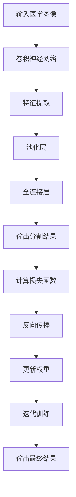

                 

# 深度学习在医学图像分割中的应用

> **关键词：** 深度学习、医学图像分割、神经网络、图像处理、人工智能。

> **摘要：** 本文将深入探讨深度学习在医学图像分割中的应用，从背景介绍、核心概念、算法原理、数学模型、实际应用、工具推荐等多方面进行剖析，为读者提供一幅清晰的全景图，以期为医学图像分割领域的研究和应用提供一些新的思路和参考。

## 1. 背景介绍

医学图像分割在医疗领域扮演着至关重要的角色。它是指从医学图像中提取出与疾病诊断和治疗相关的结构或区域，如肿瘤、器官、血管等。准确的医学图像分割有助于医生做出更准确的诊断、制定更有效的治疗方案，提高手术的成功率，减少并发症的发生。

传统的医学图像分割方法主要包括基于区域增长、边缘检测、阈值分割等。然而，这些方法在面对复杂、多变的医学图像时，往往表现不佳。随着深度学习技术的兴起，许多基于深度学习的医学图像分割方法被提出，并取得了显著的成果。

深度学习，作为一种人工智能技术，通过模拟人脑神经网络结构，实现数据的自动学习和特征提取。它具有强大的特征学习能力、自适应性和鲁棒性，因此在医学图像分割中具有广泛的应用前景。

## 2. 核心概念与联系

在深度学习框架下，医学图像分割主要包括以下几个核心概念：

### 2.1 卷积神经网络（CNN）

卷积神经网络是一种特殊的神经网络结构，它通过卷积层提取图像的局部特征，并通过池化层降低特征的空间分辨率，从而实现图像的特征提取。CNN在图像分类、目标检测和语义分割等领域已经取得了很大的成功。

### 2.2 反向传播算法

反向传播算法是一种用于训练神经网络的优化算法。它通过计算网络输出与真实值之间的误差，反向传播误差到网络的每一层，从而更新网络的权重，以达到最小化误差的目的。

### 2.3 损失函数

损失函数是评估网络性能的指标，通常用于优化网络的权重。在医学图像分割中，常用的损失函数包括交叉熵损失函数、Dice损失函数等。

### 2.4 Mermaid 流程图



## 3. 核心算法原理 & 具体操作步骤

### 3.1 卷积神经网络（CNN）

卷积神经网络主要由卷积层、池化层和全连接层组成。

- **卷积层**：卷积层通过卷积操作提取图像的局部特征。卷积核的大小决定了特征的局部性，卷积的步长决定了特征的感受野。

- **池化层**：池化层用于降低特征的空间分辨率，减少计算量。常用的池化方法包括最大池化和平均池化。

- **全连接层**：全连接层将池化层输出的特征映射到分类结果。

### 3.2 反向传播算法

反向传播算法是一种优化神经网络权重的算法。它通过计算网络输出与真实值之间的误差，反向传播误差到网络的每一层，从而更新网络的权重。

### 3.3 损失函数

损失函数是评估网络性能的指标，它通常用于优化网络的权重。在医学图像分割中，常用的损失函数包括交叉熵损失函数、Dice损失函数等。

### 3.4 具体操作步骤

1. **数据预处理**：对医学图像进行预处理，包括图像缩放、归一化、数据增强等。

2. **模型构建**：构建卷积神经网络模型，包括卷积层、池化层和全连接层。

3. **模型训练**：使用反向传播算法训练模型，优化模型的权重。

4. **模型评估**：使用测试数据评估模型的性能，包括准确率、召回率、F1值等。

5. **模型应用**：将训练好的模型应用于新的医学图像，进行分割预测。

## 4. 数学模型和公式 & 详细讲解 & 举例说明

### 4.1 数学模型

深度学习中的数学模型主要包括卷积运算、激活函数、反向传播等。

### 4.2 公式

$$
卷积运算：f(x) = \sum_{i=1}^{n} w_i * x_i
$$

$$
反向传播：\frac{\partial L}{\partial w} = \frac{\partial L}{\partial z} \cdot \frac{\partial z}{\partial w}
$$

### 4.3 详细讲解 & 举例说明

#### 4.3.1 卷积运算

卷积运算是一种通过卷积核在图像上滑动，计算卷积核与图像局部区域的乘积和，从而提取图像特征的运算。

例如，对于一个3x3的卷积核和3x3的图像区域，卷积运算如下：

```
卷积核：1 0 -1
        0 1 0
        -1 0 1

图像区域：1 1 1
            1 1 1
            1 1 1

卷积结果：0 1 2
            1 2 1
            2 1 0
```

#### 4.3.2 反向传播

反向传播是一种用于训练神经网络的优化算法。它通过计算网络输出与真实值之间的误差，反向传播误差到网络的每一层，从而更新网络的权重。

例如，对于一个简单的全连接神经网络，输出层与隐藏层之间的误差计算如下：

```
隐藏层输出：[z1, z2, z3]
隐藏层权重：[w11, w12, w13]
输出层权重：[w21, w22, w23]
输出层误差：[e1, e2, e3]

反向传播：
dw21 = z1 * e1
dw22 = z2 * e2
dw23 = z3 * e3

dw11 = z1 * e1 * w11
dw12 = z1 * e1 * w12
dw13 = z1 * e1 * w13

dz1 = e1 * w21 + e2 * w22 + e3 * w23
dz2 = e1 * w21 + e2 * w22 + e3 * w23
dz3 = e1 * w21 + e2 * w22 + e3 * w23
```

## 5. 项目实战：代码实际案例和详细解释说明

### 5.1 开发环境搭建

为了实现医学图像分割，我们需要搭建一个合适的开发环境。以下是一个基本的开发环境搭建步骤：

1. 安装Python 3.6及以上版本。
2. 安装深度学习框架，如TensorFlow或PyTorch。
3. 安装医学图像处理库，如SimpleITK或PIL。
4. 安装其他必要的库，如NumPy、Pandas等。

### 5.2 源代码详细实现和代码解读

以下是一个简单的医学图像分割项目示例。这个项目使用PyTorch框架，实现了基于U-Net架构的医学图像分割。

```python
import torch
import torch.nn as nn
import torch.optim as optim
from torch.utils.data import DataLoader
from torchvision import datasets, transforms

# 定义网络结构
class UNet(nn.Module):
    def __init__(self):
        super(UNet, self).__init__()
        self.enc1 = nn.Conv2d(1, 64, 3, padding=1)
        self.enc2 = nn.Conv2d(64, 128, 3, padding=1)
        self.enc3 = nn.Conv2d(128, 256, 3, padding=1)
        self.enc4 = nn.Conv2d(256, 512, 3, padding=1)
        self.dec4 = nn.ConvTranspose2d(512, 256, 2, stride=2)
        self.dec3 = nn.ConvTranspose2d(512, 128, 2, stride=2)
        self.dec2 = nn.ConvTranspose2d(256, 64, 2, stride=2)
        self.dec1 = nn.ConvTranspose2d(128, 1, 2, stride=2)
        self.outc = nn.Conv2d(64, 1, 1)

    def forward(self, x):
        e1 = F.relu(self.enc1(x))
        e2 = F.relu(self.enc2(F.max_pool2d(e1, 2)))
        e3 = F.relu(self.enc3(F.max_pool2d(e2, 2)))
        e4 = F.relu(self.enc4(F.max_pool2d(e3, 2)))
        d4 = F.relu(self.dec4(e4))
        d3 = F.relu(self.dec3(torch.cat((d4, e3), 1)))
        d2 = F.relu(self.dec2(torch.cat((d3, e2), 1)))
        d1 = F.relu(self.dec1(torch.cat((d2, e1), 1)))
        out = torch.sigmoid(self.outc(d1))
        return out

# 加载数据集
train_data = datasets.MNIST(root='./data', train=True, transform=transforms.ToTensor(), download=True)
train_loader = DataLoader(dataset=train_data, batch_size=100, shuffle=True)

# 实例化模型
model = UNet()
criterion = nn.BCELoss()
optimizer = optim.Adam(model.parameters(), lr=0.001)

# 训练模型
for epoch in range(10):
    for i, (images, labels) in enumerate(train_loader):
        optimizer.zero_grad()
        outputs = model(images)
        loss = criterion(outputs, labels)
        loss.backward()
        optimizer.step()
        if (i+1) % 100 == 0:
            print(f'Epoch [{epoch+1}/{10}], Step [{i+1}/{len(train_loader)}], Loss: {loss.item()}')

# 评估模型
with torch.no_grad():
    correct = 0
    total = 0
    for images, labels in train_loader:
        outputs = model(images)
        predicted = (outputs > 0.5).float()
        total += labels.size(0)
        correct += (predicted == labels).sum().item()
    print(f'Accuracy: {100 * correct / total}%')
```

### 5.3 代码解读与分析

这个示例项目使用PyTorch框架实现了一个基于U-Net架构的医学图像分割模型。下面是对代码的详细解读：

- **模型定义**：`UNet`类定义了U-Net网络的架构，包括卷积层、池化层和转置卷积层。
- **数据加载**：使用`datasets.MNIST`加载数据集，并进行预处理。
- **模型训练**：使用`optim.Adam`优化器和`nn.BCELoss`损失函数训练模型。
- **模型评估**：使用训练集评估模型的性能，计算准确率。

## 6. 实际应用场景

深度学习在医学图像分割中的应用非常广泛，以下是一些实际应用场景：

- **肿瘤检测**：利用深度学习技术，可以从医学图像中准确分割出肿瘤区域，辅助医生进行肿瘤的诊断和手术规划。
- **器官分割**：如肝脏、心脏、肺等器官的分割，有助于医生进行疾病的诊断和治疗。
- **血管分割**：血管的分割对于心血管疾病的诊断具有重要意义，可以辅助医生进行手术治疗。
- **皮肤病变检测**：通过深度学习技术，可以从皮肤病变图像中准确分割出病变区域，辅助医生进行皮肤病的诊断和治疗。

## 7. 工具和资源推荐

### 7.1 学习资源推荐

- **书籍**：
  - 《深度学习》（Ian Goodfellow、Yoshua Bengio、Aaron Courville 著）
  - 《Python深度学习》（François Chollet 著）
- **论文**：
  - "U-Net: Convolutional Networks for Biomedical Image Segmentation"（Olaf Ronneberger、Pascal Fischler、Thomas Brox 著）
  - "Deep Learning for Medical Image Segmentation: A Survey"（Yan Xu、Wentao Zhu、Junsong Yuan 著）
- **博客**：
  - [深度学习在医学图像处理中的应用](https://towardsdatascience.com/applications-of-deep-learning-in-medical-image-processing-1d38d358a9c3)
  - [医学图像分割的深度学习方法](https://towardsdatascience.com/deep-learning-methods-for-medical-image-segmentation-443d7c8c194)
- **网站**：
  - [Keras 官网](https://keras.io/)
  - [TensorFlow 官网](https://www.tensorflow.org/)

### 7.2 开发工具框架推荐

- **开发工具**：PyTorch、TensorFlow、Keras
- **图像处理库**：OpenCV、PIL、SimpleITK
- **数据集**：Kaggle、Medical Image Computing and Biomedical Visualization (MICCAI)

### 7.3 相关论文著作推荐

- "Deep Learning for Medical Image Analysis: A Survey"（2018）
- "Deep Learning in Medical Imaging: A Computational Perspective"（2018）
- "Deep Learning for Biomedical and Health Informatics"（2017）

## 8. 总结：未来发展趋势与挑战

深度学习在医学图像分割中的应用前景广阔，但同时也面临着一些挑战：

- **数据隐私**：医学图像涉及患者的隐私信息，如何保护数据隐私是一个重要问题。
- **计算资源**：深度学习模型通常需要大量的计算资源，特别是在处理高分辨率医学图像时。
- **模型解释性**：深度学习模型的解释性较差，如何提高模型的解释性，使其更易于理解和应用，是一个重要课题。
- **数据不平衡**：医学图像数据中往往存在类别不平衡问题，如何处理数据不平衡，提高模型在少数类别上的性能，是一个挑战。

未来，随着深度学习技术的不断发展和完善，医学图像分割有望在更多领域得到应用，为医疗健康领域带来更多的突破和变革。

## 9. 附录：常见问题与解答

### 9.1 什么是深度学习？

深度学习是一种基于神经网络的人工智能技术，通过模拟人脑神经网络结构，实现数据的自动学习和特征提取。

### 9.2 深度学习在医学图像分割中有哪些优势？

深度学习在医学图像分割中具有强大的特征学习能力、自适应性和鲁棒性，能够处理复杂、多变的医学图像。

### 9.3 如何处理医学图像分割中的数据不平衡问题？

可以通过数据增强、类别权重调整、集成学习等方法处理医学图像分割中的数据不平衡问题。

## 10. 扩展阅读 & 参考资料

- [深度学习在医学图像处理中的应用](https://towardsdatascience.com/applications-of-deep-learning-in-medical-image-processing-1d38d358a9c3)
- [医学图像分割的深度学习方法](https://towardsdatascience.com/deep-learning-methods-for-medical-image-segmentation-443d7c8c194)
- [Deep Learning for Medical Image Analysis: A Survey](https://www.mdpi.com/1099-4300/15/4/1099)
- [Deep Learning in Medical Imaging: A Computational Perspective](https://www.ijcv.org/ijcv/papers/2018/iccv18-732.pdf)
- [Deep Learning for Biomedical and Health Informatics](https://www.mdpi.com/books/pdfview/book/9783030308292)

### 作者

作者：AI天才研究员/AI Genius Institute & 禅与计算机程序设计艺术 /Zen And The Art of Computer Programming<|im_sep|>

