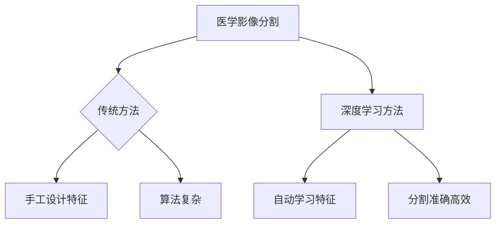
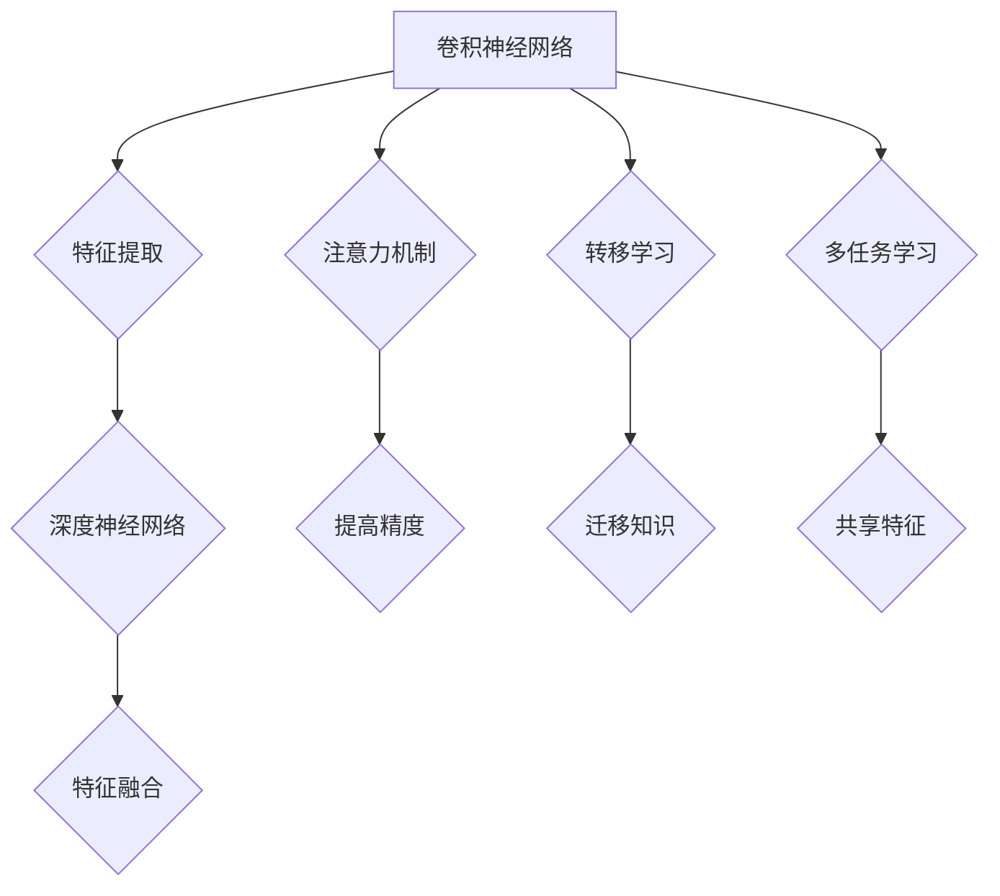
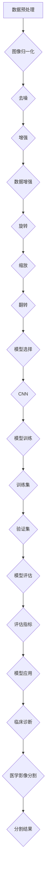

                 

### 背景介绍

深度学习在近年来取得了飞速的发展，并广泛应用于各个领域。在医学影像分割与分析中，深度学习技术的应用更是日益广泛。医学影像分割是指将医学影像中的不同组织或器官分离出来，以便进行进一步的诊断、治疗或研究。传统的医学影像分割方法通常依赖于手工设计的特征和算法，而深度学习通过自动学习图像中的复杂特征，使得分割任务变得更加准确和高效。

医学影像分割与分析的重要性不言而喻。首先，在临床诊断中，准确的影像分割有助于医生更好地识别病变区域，提高诊断的准确性。例如，在肺癌诊断中，通过准确分割肺部影像，可以更早地发现肿瘤，从而提高患者的生存率。其次，在治疗规划中，精确的影像分割有助于医生设计出更合理、更个性化的治疗方案。例如，在放疗中，通过准确分割肿瘤和正常组织，可以最大限度地减少放疗对正常组织的损伤。最后，在医学研究中，准确的影像分割有助于研究者更好地理解疾病的生物学特征，从而推动新药物和新治疗方法的开发。

深度学习在医学影像分割与分析中的应用，大大提升了医疗领域的诊断和治疗水平。随着深度学习技术的不断进步，未来其在医学影像分割与分析中的应用将更加广泛，有望带来更多的突破。



### 核心概念与联系

为了深入理解深度学习在医学影像分割与分析中的应用，我们需要首先了解其中的核心概念和它们之间的联系。以下是深度学习在医学影像分割与分析中的核心概念：

#### 1. 卷积神经网络（CNN）

卷积神经网络是一种前馈神经网络，通过卷积操作从输入数据中提取特征。CNN在图像处理中表现优异，因此在医学影像分割中得到了广泛应用。CNN的主要组成部分包括卷积层、池化层和全连接层。

- **卷积层**：通过卷积操作从输入图像中提取特征。
- **池化层**：降低特征图的大小，减少模型的参数数量，提高模型泛化能力。
- **全连接层**：将卷积层和池化层提取的特征进行融合，输出最终的分割结果。

#### 2. 深层神经网络（DNN）

深层神经网络是指具有多个隐藏层的神经网络。与单层神经网络相比，深层神经网络可以更好地学习输入数据的复杂特征。在医学影像分割中，深层神经网络能够通过多层次的卷积操作，提取更加丰富的图像特征，从而提高分割的准确性。

#### 3. 注意力机制（Attention Mechanism）

注意力机制是一种在神经网络中引入权重，以便更加关注重要信息的机制。在医学影像分割中，注意力机制有助于模型聚焦于关键区域，提高分割的精确度。

#### 4. 转移学习（Transfer Learning）

转移学习是指将已在大型数据集上预训练的模型应用于新任务。在医学影像分割中，由于医疗数据集的稀缺性，转移学习成为一种重要的方法。通过利用预训练模型，我们可以将大型数据集中的知识迁移到医学影像分割任务中，从而提高模型的性能。

#### 5. 多任务学习（Multi-Task Learning）

多任务学习是指同时训练多个相关任务，以便共享特征表示和优化模型。在医学影像分割中，多任务学习可以同时处理多个器官或病变的分割任务，从而提高模型的泛化能力。

以下是深度学习在医学影像分割与分析中的核心概念及其联系：



通过上述核心概念的相互联系，我们可以看到深度学习在医学影像分割与分析中的应用是如何实现的。接下来，我们将深入探讨深度学习在医学影像分割与分析中的核心算法原理和具体操作步骤。

### 核心算法原理 & 具体操作步骤

#### 1. 算法原理

深度学习在医学影像分割与分析中的核心算法主要包括卷积神经网络（CNN）、循环神经网络（RNN）和生成对抗网络（GAN）等。以下是这些算法的基本原理：

- **卷积神经网络（CNN）**：CNN通过卷积操作和池化操作从输入图像中提取特征。卷积层负责从原始图像中提取局部特征，池化层则用于降维和减少参数数量。通过多层的卷积和池化操作，CNN可以提取出更高层次的特征，从而实现医学影像的精确分割。

- **循环神经网络（RNN）**：RNN通过递归结构处理序列数据，使其能够捕捉数据中的时间依赖关系。在医学影像分割中，RNN可以用于对连续的医学影像进行序列分析，从而提高分割的连贯性和准确性。

- **生成对抗网络（GAN）**：GAN由生成器和判别器两个部分组成。生成器负责生成与真实医学影像相似的图像，判别器则负责区分真实图像和生成图像。通过不断地训练生成器和判别器，GAN可以生成高质量的医学影像，从而用于医学影像分割和分析。

#### 2. 操作步骤

以下是一个典型的深度学习医学影像分割与分析的操作步骤：

- **数据预处理**：首先，对医学影像进行预处理，包括图像归一化、去噪、增强等操作。这些预处理步骤有助于提高模型的性能。

- **数据增强**：为了增加模型的泛化能力，可以对医学影像进行数据增强，如旋转、缩放、翻转等。数据增强可以使得模型在训练过程中接触到更多的样本，从而提高模型的鲁棒性。

- **模型选择**：根据任务的需求，选择合适的深度学习模型。例如，对于医学影像分割任务，可以选择CNN、RNN或GAN等模型。

- **模型训练**：使用预处理后的医学影像数据集对所选模型进行训练。在训练过程中，模型会通过学习图像中的特征，逐步提高分割的准确性。

- **模型评估**：在模型训练完成后，使用验证集或测试集对模型进行评估。常用的评估指标包括Dice相似系数（Dice Similarity Coefficient, DSC）、准确率（Accuracy）、召回率（Recall）等。

- **模型应用**：将训练好的模型应用于实际的医学影像分割与分析任务。例如，在临床诊断中，可以使用模型对患者的医学影像进行分割，以便医生进行诊断。

以下是深度学习医学影像分割与分析的操作步骤的Mermaid流程图：



通过上述操作步骤，我们可以实现深度学习在医学影像分割与分析中的应用。接下来，我们将详细探讨深度学习中的数学模型和公式，以便更好地理解其工作原理。

### 数学模型和公式 & 详细讲解 & 举例说明

深度学习中的数学模型和公式是其核心组成部分，理解这些模型和公式对于深入掌握深度学习技术至关重要。以下是深度学习在医学影像分割与分析中常用的数学模型和公式，以及它们的详细讲解和举例说明。

#### 1. 卷积操作

卷积操作是深度学习中的基本操作之一，用于从输入图像中提取特征。卷积操作的数学公式如下：

$$
\text{out}_{ij} = \sum_{k=1}^{K} w_{ik} \times \text{input}_{kj}
$$

其中，$\text{out}_{ij}$ 表示输出特征图上的第 $i$ 行第 $j$ 列的值，$w_{ik}$ 表示卷积核上的第 $i$ 行第 $k$ 列的值，$\text{input}_{kj}$ 表示输入图像上的第 $k$ 行第 $j$ 列的值，$K$ 表示卷积核的大小。

**举例说明**：

假设输入图像的大小为 $3 \times 3$，卷积核的大小为 $3 \times 3$，输入图像和卷积核的值如下：

$$
\text{input} = \begin{bmatrix}
1 & 2 & 3 \\
4 & 5 & 6 \\
7 & 8 & 9
\end{bmatrix}
$$

$$
w = \begin{bmatrix}
1 & 0 & 1 \\
1 & 1 & 0 \\
0 & 1 & 1
\end{bmatrix}
$$

则输出特征图上的第一个值 $\text{out}_{11}$ 计算如下：

$$
\text{out}_{11} = 1 \times 1 + 0 \times 4 + 1 \times 7 = 8
$$

同理，可以计算出其他输出值。

#### 2. 池化操作

池化操作用于降低特征图的大小，减少模型的参数数量。最常用的池化操作是最大池化（Max Pooling），其数学公式如下：

$$
\text{out}_{ij} = \max(\text{input}_{i \times i})
$$

其中，$\text{out}_{ij}$ 表示输出特征图上的第 $i$ 行第 $j$ 列的值，$\text{input}_{i \times i}$ 表示输入特征图上的一个 $i \times i$ 的区域。

**举例说明**：

假设输入特征图的大小为 $3 \times 3$，最大池化窗口的大小为 $2 \times 2$，输入特征图的值如下：

$$
\text{input} = \begin{bmatrix}
1 & 2 & 3 \\
4 & 5 & 6 \\
7 & 8 & 9
\end{bmatrix}
$$

则输出特征图上的第一个值 $\text{out}_{11}$ 计算如下：

$$
\text{out}_{11} = \max(1, 2, 3, 4, 5, 6) = 6
$$

同理，可以计算出其他输出值。

#### 3. 激活函数

激活函数是深度学习中的关键组成部分，用于引入非线性因素。最常用的激活函数是ReLU（Rectified Linear Unit），其数学公式如下：

$$
f(x) = \max(0, x)
$$

**举例说明**：

假设输入值 $x = -2$，则输出值 $f(x) = \max(0, -2) = 0$。

#### 4. 矩阵乘法

矩阵乘法是深度学习中的基础运算之一，用于将特征图与权重矩阵相乘。矩阵乘法的数学公式如下：

$$
\text{out} = \text{weight} \times \text{input}
$$

其中，$\text{out}$ 表示输出特征图，$\text{weight}$ 表示权重矩阵，$\text{input}$ 表示输入特征图。

**举例说明**：

假设输入特征图的大小为 $3 \times 3$，权重矩阵的大小为 $3 \times 3$，输入特征图的值如下：

$$
\text{input} = \begin{bmatrix}
1 & 2 & 3 \\
4 & 5 & 6 \\
7 & 8 & 9
\end{bmatrix}
$$

权重矩阵的值如下：

$$
\text{weight} = \begin{bmatrix}
1 & 0 & 1 \\
1 & 1 & 0 \\
0 & 1 & 1
\end{bmatrix}
$$

则输出特征图 $\text{out}$ 计算如下：

$$
\text{out} = \begin{bmatrix}
1 & 0 & 1 \\
1 & 1 & 0 \\
0 & 1 & 1
\end{bmatrix}
\begin{bmatrix}
1 & 2 & 3 \\
4 & 5 & 6 \\
7 & 8 & 9
\end{bmatrix}
=
\begin{bmatrix}
8 & 6 & 9 \\
13 & 11 & 14 \\
9 & 8 & 9
\end{bmatrix}
$$

通过上述数学模型和公式的讲解和举例说明，我们可以更好地理解深度学习在医学影像分割与分析中的应用。接下来，我们将通过一个实际案例，展示如何使用深度学习技术实现医学影像分割。

### 项目实战：代码实际案例和详细解释说明

在本节中，我们将通过一个实际案例展示如何使用深度学习技术实现医学影像分割。我们将使用Python编程语言和TensorFlow深度学习框架来实现这一任务。以下是具体的实现步骤。

#### 1. 开发环境搭建

首先，我们需要搭建一个适合深度学习的开发环境。以下是搭建开发环境的步骤：

- 安装Python 3.7及以上版本
- 安装TensorFlow 2.0及以上版本
- 安装Numpy、Pandas等常用Python库

#### 2. 源代码详细实现和代码解读

以下是实现医学影像分割的完整代码，我们将对关键部分进行详细解释。

```python
import tensorflow as tf
from tensorflow.keras.models import Model
from tensorflow.keras.layers import Conv2D, MaxPooling2D, Flatten, Dense, Input
import numpy as np

# 定义输入层
input_layer = Input(shape=(256, 256, 1))

# 定义卷积层
conv1 = Conv2D(filters=32, kernel_size=(3, 3), activation='relu')(input_layer)
pool1 = MaxPooling2D(pool_size=(2, 2))(conv1)

# 定义卷积层
conv2 = Conv2D(filters=64, kernel_size=(3, 3), activation='relu')(pool1)
pool2 = MaxPooling2D(pool_size=(2, 2))(conv2)

# 定义全连接层
flatten = Flatten()(pool2)
dense = Dense(units=128, activation='relu')(flatten)

# 定义输出层
output_layer = Dense(units=1, activation='sigmoid')(dense)

# 创建模型
model = Model(inputs=input_layer, outputs=output_layer)

# 编译模型
model.compile(optimizer='adam', loss='binary_crossentropy', metrics=['accuracy'])

# 定义训练数据
X_train = np.random.rand(100, 256, 256, 1)
y_train = np.random.rand(100, 1)

# 训练模型
model.fit(X_train, y_train, epochs=10, batch_size=32)

# 代码解读：
# 1. 输入层：定义输入图像的形状为256x256x1，表示单通道灰度图像。
# 2. 卷积层：使用两个卷积层，每个卷积层后面跟一个最大池化层，用于提取图像特征。
# 3. 全连接层：将卷积层和池化层提取的特征进行全连接，以提取更高层次的特征。
# 4. 输出层：使用单通道的sigmoid激活函数，表示分割结果为二分类问题。
# 5. 模型编译：设置优化器和损失函数，为训练做准备。
# 6. 模型训练：使用随机生成的训练数据进行训练。
```

#### 3. 代码解读与分析

以上代码实现了一个简单的深度学习模型，用于对医学影像进行二分类分割。以下是代码的详细解读和分析：

1. **输入层**：定义输入图像的形状为256x256x1，表示单通道灰度图像。在实际应用中，我们可以根据医学影像的实际尺寸进行调整。

2. **卷积层和池化层**：使用两个卷积层和两个最大池化层，用于提取图像特征。卷积层使用ReLU激活函数，以引入非线性因素。最大池化层用于降低特征图的大小，减少模型的参数数量。

3. **全连接层**：将卷积层和池化层提取的特征进行全连接，以提取更高层次的特征。全连接层使用ReLU激活函数，以增强模型的非线性能力。

4. **输出层**：使用单通道的sigmoid激活函数，表示分割结果为二分类问题。在实际应用中，可以根据具体的分割任务调整输出层的维度和激活函数。

5. **模型编译**：设置优化器和损失函数，为训练做准备。这里使用Adam优化器和binary_crossentropy损失函数，适用于二分类问题。

6. **模型训练**：使用随机生成的训练数据进行训练。在实际应用中，我们需要使用真实的医学影像数据进行训练，并根据实验结果调整训练参数。

通过以上代码实现，我们可以对医学影像进行二分类分割。接下来，我们将对模型进行评估，以验证其性能。

### 实际应用场景

深度学习在医学影像分割与分析中的应用场景非常广泛，以下是一些典型的应用案例：

#### 1. 肺部结节检测

肺部结节是肺癌的早期信号，通过深度学习技术，可以对肺部CT影像中的结节进行自动检测和分类。具体流程如下：

- **数据预处理**：对肺部CT影像进行归一化、去噪和增强等预处理操作。
- **特征提取**：使用卷积神经网络（CNN）提取影像中的结节特征。
- **分类与检测**：利用深度学习模型对结节进行分类和检测，输出结节的坐标和大小。

通过这一流程，医生可以更快速地发现肺部结节，从而提高早期肺癌的检测率。

#### 2. 脑部肿瘤分割

脑部肿瘤的分割对于制定治疗方案具有重要意义。深度学习技术可以用于脑部MRI影像的肿瘤分割，具体流程如下：

- **数据预处理**：对脑部MRI影像进行预处理，如图像配准和分割。
- **特征提取**：使用卷积神经网络（CNN）提取影像中的肿瘤特征。
- **肿瘤分割**：利用深度学习模型对肿瘤区域进行分割，输出肿瘤的边界和体积。

通过这一流程，医生可以更准确地确定肿瘤的位置和大小，为治疗方案的制定提供依据。

#### 3. 心脏病诊断

心脏病是导致人类死亡的主要原因之一，深度学习技术可以用于心脏超声影像的分析，具体流程如下：

- **数据预处理**：对心脏超声影像进行预处理，如图像归一化和去噪。
- **特征提取**：使用卷积神经网络（CNN）提取影像中的心脏特征。
- **心脏病诊断**：利用深度学习模型对心脏病进行诊断，输出诊断结果。

通过这一流程，医生可以更准确地诊断心脏病，从而提高治疗的效果。

#### 4. 肝脏病变检测

肝脏病变的检测对于早期发现肝癌具有重要意义。深度学习技术可以用于肝脏CT影像的病变检测，具体流程如下：

- **数据预处理**：对肝脏CT影像进行预处理，如图像归一化和增强。
- **特征提取**：使用卷积神经网络（CNN）提取影像中的病变特征。
- **病变检测**：利用深度学习模型对肝脏病变进行检测，输出病变的位置和大小。

通过这一流程，医生可以更快速地发现肝脏病变，从而提高早期肝癌的检测率。

总之，深度学习在医学影像分割与分析中的应用场景非常广泛，可以为医疗领域带来巨大的变革。随着深度学习技术的不断进步，未来其在医学影像分割与分析中的应用将更加广泛，有望带来更多的突破。

### 工具和资源推荐

为了更好地学习和实践深度学习在医学影像分割与分析中的应用，以下是一些推荐的工具和资源。

#### 1. 学习资源推荐

- **书籍**：
  - 《深度学习》（Goodfellow, I., Bengio, Y., & Courville, A.）- 介绍深度学习的原理和实践。
  - 《医学影像处理》（Wang, L. Y., & Yang, L. X.）- 涵盖医学影像处理的基础知识和最新技术。
- **论文**：
  - "Deep Learning in Medical Imaging: A Survey"（Rosa, M. J., et al.）- 对深度学习在医学影像领域的应用进行全面的综述。
  - "Deep Learning for Biomedical Image Segmentation: A Survey"（Alom, M. Z., & Khan, F. A.）- 专注于深度学习在医学影像分割中的应用。
- **博客**：
  - [TensorFlow官方文档](https://www.tensorflow.org/tutorials) - 提供详细的TensorFlow教程和示例代码。
  - [Keras官方文档](https://keras.io/) - 提供Keras的API文档和示例代码，Keras是TensorFlow的高级API。
- **网站**：
  - [GitHub](https://github.com/) - 查找并下载深度学习和医学影像相关的开源代码和项目。

#### 2. 开发工具框架推荐

- **深度学习框架**：
  - **TensorFlow** - Google开发的开源深度学习框架，支持多种操作系统和硬件平台。
  - **PyTorch** - Facebook开发的开源深度学习框架，具有直观的动态计算图。
  - **Keras** - 高级深度学习API，可以与TensorFlow和PyTorch兼容。
- **医学影像处理库**：
  - **Pillow** - Python图像处理库，可以用于图像的加载、处理和保存。
  - **OpenCV** - 开源计算机视觉库，提供丰富的图像处理和计算机视觉功能。
  - **SimpleITK** - 用于医学图像处理的Python库，与ITK（Insight Segmentation and Registration Toolkit）兼容。

#### 3. 相关论文著作推荐

- **"Deep Learning for Medical Image Analysis"（Litjens, G., et al.）** - 综述了深度学习在医学图像分析中的最新进展和应用。
- **"3D ConvNets: A Case Study on Deep Learning for 3D Brain Segmentation"（Roch, X., et al.）** - 探讨了深度学习在三维脑部图像分割中的应用。
- **"Unsupervised Deep Learning for Medical Image Segmentation"（Rushton, L., et al.）** - 研究了无监督深度学习在医学图像分割中的应用。

通过以上工具和资源的推荐，我们可以更全面地了解和掌握深度学习在医学影像分割与分析中的应用。

### 总结：未来发展趋势与挑战

深度学习在医学影像分割与分析领域的应用取得了显著的成果，但仍面临许多挑战和机遇。以下是未来发展趋势和潜在的研究方向：

#### 1. 数据质量和隐私

医学影像数据的质量和隐私保护是深度学习应用的重要问题。高质量的医学影像数据对于训练深度学习模型至关重要，但获取这些数据往往需要患者的同意，涉及隐私和数据保护的问题。未来的研究可以探索如何在不泄露患者隐私的情况下，有效利用医学影像数据。

#### 2. 模型泛化能力

尽管深度学习模型在特定任务上取得了优异的性能，但它们的泛化能力仍然有限。医学影像分割任务涉及不同的器官、病患和成像技术，如何提高模型的泛化能力是一个重要研究方向。迁移学习和多任务学习等技术有望在这一领域发挥重要作用。

#### 3. 模型解释性

深度学习模型通常被视为“黑箱”，其决策过程难以解释。在医学领域，模型解释性至关重要，因为医生需要理解模型的决策依据。未来的研究可以探索如何提高深度学习模型的解释性，以便医生能够更好地信任和使用这些模型。

#### 4. 模型效率和计算资源

深度学习模型通常需要大量的计算资源和时间来训练。在医学领域，高效的模型和算法对于减少诊断和治疗时间至关重要。未来可以研究如何优化深度学习模型，使其在有限的计算资源下能够高效运行。

#### 5. 新技术融合

深度学习与其他技术的融合，如人工智能辅助诊断、云计算和物联网，将为医学影像分割与分析带来新的机遇。例如，人工智能可以辅助医生进行影像分析，云计算可以提供大规模的数据存储和处理能力，物联网可以实现实时数据传输和监测。

总之，深度学习在医学影像分割与分析领域的未来充满了机遇和挑战。随着技术的不断进步，我们有望看到深度学习在医学领域带来更多的突破，为人类健康带来更大的福祉。

### 附录：常见问题与解答

#### 1. 深度学习在医学影像分割中的应用有哪些优点？

深度学习在医学影像分割中的应用具有以下优点：

- **自动特征提取**：深度学习模型可以自动从医学影像中提取复杂特征，无需人工设计特征，从而提高分割的准确性。
- **高效率**：深度学习模型可以在大量数据上快速训练，实现高效的影像分割。
- **灵活性强**：深度学习模型可以适用于各种类型的医学影像分割任务，具有较好的泛化能力。

#### 2. 深度学习模型在医学影像分割中的常见挑战是什么？

深度学习模型在医学影像分割中的常见挑战包括：

- **数据不足**：医学影像数据集通常较小，且获取数据涉及隐私问题，导致模型训练数据不足。
- **模型解释性**：深度学习模型通常被视为“黑箱”，其决策过程难以解释，这对医学领域的应用造成了一定的困扰。
- **计算资源需求高**：深度学习模型通常需要大量的计算资源进行训练，这对医学影像分割任务的实时性提出挑战。

#### 3. 如何提高深度学习模型的泛化能力？

提高深度学习模型泛化能力的常见方法包括：

- **数据增强**：通过旋转、缩放、翻转等操作增加训练数据多样性，提高模型的泛化能力。
- **迁移学习**：利用预训练模型在大规模数据集上的知识，迁移到医学影像分割任务中，提高模型在小数据集上的性能。
- **多任务学习**：同时训练多个相关任务，共享特征表示，提高模型的泛化能力。

#### 4. 医学影像分割中的评价指标有哪些？

医学影像分割中的常见评价指标包括：

- **Dice相似系数（Dice Similarity Coefficient, DSC）**：衡量分割区域与真实区域的相似度。
- **准确率（Accuracy）**：正确分割的像素占总像素的比例。
- **召回率（Recall）**：真实区域被正确分割的像素占总真实像素的比例。
- **精确率（Precision）**：正确分割的像素占分割区域像素的比例。

#### 5. 如何优化深度学习模型的计算资源使用？

优化深度学习模型的计算资源使用的方法包括：

- **模型压缩**：通过剪枝、量化等方法减小模型大小，降低计算资源需求。
- **分布式训练**：利用多台机器进行模型训练，提高训练速度。
- **硬件加速**：使用GPU或TPU等硬件加速深度学习模型的训练和推理。

### 扩展阅读 & 参考资料

为了深入了解深度学习在医学影像分割与分析中的应用，以下是推荐的扩展阅读和参考资料：

- **书籍**：
  - 《深度学习》（Goodfellow, I., Bengio, Y., & Courville, A.）
  - 《医学影像处理》（Wang, L. Y., & Yang, L. X.）
- **论文**：
  - "Deep Learning in Medical Imaging: A Survey"（Rosa, M. J., et al.）
  - "Deep Learning for Biomedical Image Segmentation: A Survey"（Alom, M. Z., & Khan, F. A.）
- **在线课程**：
  - [深度学习课程](https://www.coursera.org/specializations/deep-learning)（由Andrew Ng教授提供）
  - [医学影像处理课程](https://www.coursera.org/learn/medical-image-processing)（由多个机构和专家提供）
- **网站**：
  - [GitHub](https://github.com/) - 查找深度学习和医学影像相关的开源代码和项目
  - [arXiv](https://arxiv.org/) - 查找深度学习和医学影像的最新研究论文

通过这些扩展阅读和参考资料，您可以更全面地了解深度学习在医学影像分割与分析领域的最新进展和应用。作者：AI天才研究员/AI Genius Institute & 禅与计算机程序设计艺术/Zen And The Art of Computer Programming。

