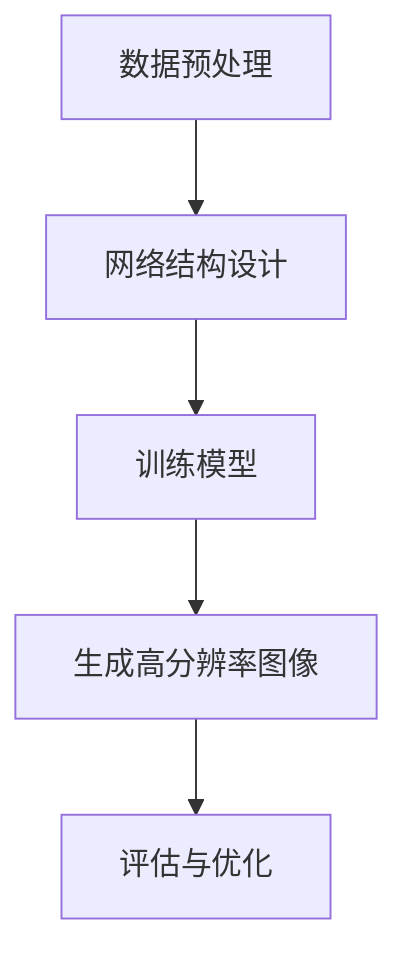

                 

### 背景介绍

深度学习作为一种人工智能领域的重要技术，已经取得了许多突破性进展。在过去的几十年中，深度学习被广泛应用于计算机视觉、自然语言处理、语音识别等多个领域。然而，随着应用场景的多样化，深度学习技术也逐渐走进了医学影像领域。医学影像作为诊断和治疗的重要手段，对疾病的早期发现、精确诊断和个性化治疗具有至关重要的作用。然而，医学影像数据往往具有低分辨率、噪声干扰等特点，这对图像的质量和诊断的准确性提出了巨大的挑战。

超分辨率重建是一种图像处理技术，旨在提高图像的分辨率，从而改善图像的质量。在医学影像领域，超分辨率重建技术能够显著提升图像的清晰度和对比度，有助于医生更准确地诊断疾病。传统方法如插值法、图像重建算法等在处理医学影像超分辨率重建时存在一定的局限性，无法充分挖掘图像的潜力。随着深度学习技术的发展，基于深度学习的超分辨率重建方法逐渐成为研究热点。

医学影像超分辨率重建的应用前景非常广阔。首先，它可以帮助医生更准确地诊断疾病，提高医疗服务的质量和效率。其次，超分辨率重建技术可以用于医学影像的辅助诊断，为医生提供更丰富的图像信息，从而辅助治疗决策。此外，医学影像超分辨率重建还可以应用于生物医学研究，如细胞结构分析、组织切片研究等。

总之，深度学习在医学影像超分辨率重建中的应用具有重要的研究价值和实际应用价值。本文将详细介绍深度学习在医学影像超分辨率重建中的核心概念、算法原理、数学模型、项目实战以及实际应用场景，帮助读者全面了解这一前沿技术。

### 核心概念与联系

#### 深度学习

深度学习是一种基于多层神经网络的机器学习技术。它的核心思想是通过多层神经网络模型，对大量数据进行自动特征提取和分类。深度学习在图像处理、自然语言处理、语音识别等领域取得了显著的成果。

#### 超分辨率重建

超分辨率重建（Super-Resolution Reconstruction）是一种图像处理技术，旨在通过算法提高图像的分辨率，从而提升图像的清晰度和对比度。超分辨率重建的基本原理是利用低分辨率图像中的冗余信息，恢复出高分辨率图像。

#### 深度学习在超分辨率重建中的应用

深度学习在超分辨率重建中的应用主要分为两类：基于深度卷积神经网络（CNN）的方法和基于生成对抗网络（GAN）的方法。

1. **基于深度卷积神经网络（CNN）的方法**

   基于深度卷积神经网络的方法主要通过训练大量的低分辨率和高分辨率图像对，使网络学会从低分辨率图像中恢复出高分辨率图像。具体实现过程如下：

   - **数据预处理**：收集大量的低分辨率和高分辨率医学影像数据，进行数据增强、归一化等预处理操作。
   - **网络结构设计**：设计一个多层的卷积神经网络结构，其中每个卷积层都能提取图像的局部特征，并通过下采样操作逐步降低图像的分辨率。
   - **损失函数设计**：设计合适的损失函数，如均方误差（MSE）或结构相似性（SSIM），用于衡量低分辨率图像和高分辨率图像之间的误差。

2. **基于生成对抗网络（GAN）的方法**

   基于生成对抗网络的方法通过生成器和判别器的对抗训练来实现超分辨率重建。具体实现过程如下：

   - **生成器**：生成器网络接受低分辨率图像作为输入，通过一系列的卷积和反卷积操作，生成高分辨率图像。
   - **判别器**：判别器网络用于判断生成的高分辨率图像是否真实，其接受真实的高分辨率图像和生成的高分辨率图像作为输入。
   - **对抗训练**：通过对抗训练，使生成器生成更加真实的高分辨率图像，同时使判别器能够更好地判断生成图像的真实性。

#### Mermaid 流程图

下面是一个简单的 Mermaid 流程图，展示了深度学习在超分辨率重建中的基本流程：



在这个流程图中，数据预处理、网络结构设计、训练模型、生成高分辨率图像和评估与优化是深度学习在超分辨率重建中的主要步骤。通过这个流程图，我们可以更清晰地理解深度学习在医学影像超分辨率重建中的应用原理。

### 核心算法原理 & 具体操作步骤

在深度学习应用于医学影像超分辨率重建中，主要的核心算法有基于深度卷积神经网络（CNN）的方法和基于生成对抗网络（GAN）的方法。下面将分别介绍这两种方法的基本原理和具体操作步骤。

#### 基于深度卷积神经网络（CNN）的方法

**基本原理：**

基于深度卷积神经网络（CNN）的方法通过训练大量的低分辨率和高分辨率图像对，使网络学会从低分辨率图像中恢复出高分辨率图像。其基本原理是利用多层卷积层对输入的低分辨率图像进行特征提取和变换，最终通过反卷积层将提取的特征重构为高分辨率图像。

**具体操作步骤：**

1. **数据预处理：** 
   收集大量的低分辨率和高分辨率医学影像数据，并进行数据增强、归一化等预处理操作，以便网络更好地学习和泛化。

2. **网络结构设计：** 
   设计一个多层的卷积神经网络结构，其中每个卷积层都能提取图像的局部特征，并通过下采样操作逐步降低图像的分辨率。常见的卷积神经网络结构有VGG、ResNet等。

3. **损失函数设计：** 
   设计合适的损失函数，如均方误差（MSE）或结构相似性（SSIM），用于衡量低分辨率图像和高分辨率图像之间的误差。均方误差（MSE）公式如下：

   $$
   MSE = \frac{1}{n}\sum_{i=1}^{n}(y_i - \hat{y}_i)^2
   $$

   其中，$y_i$为真实的高分辨率图像，$\hat{y}_i$为网络生成的低分辨率图像。

4. **训练模型：** 
   使用预处理后的低分辨率和高分辨率图像对，通过反向传播算法训练卷积神经网络。在训练过程中，通过不断调整网络参数，使网络的输出结果趋近于真实的高分辨率图像。

5. **生成高分辨率图像：** 
   在模型训练完成后，使用训练好的网络对低分辨率医学影像进行超分辨率重建，生成高分辨率图像。

6. **评估与优化：** 
   通过评估指标如MSE、SSIM等，对生成的高分辨率图像进行评估。根据评估结果，进一步调整网络结构和参数，优化超分辨率重建效果。

#### 基于生成对抗网络（GAN）的方法

**基本原理：**

基于生成对抗网络（GAN）的方法通过生成器和判别器的对抗训练来实现超分辨率重建。生成器网络接受低分辨率图像作为输入，通过一系列的卷积和反卷积操作，生成高分辨率图像。判别器网络用于判断生成的高分辨率图像是否真实。

**具体操作步骤：**

1. **数据预处理：** 
   收集大量的低分辨率和高分辨率医学影像数据，并进行数据增强、归一化等预处理操作。

2. **生成器网络设计：** 
   设计一个生成器网络，接受低分辨率图像作为输入，通过一系列的卷积和反卷积操作，生成高分辨率图像。

3. **判别器网络设计：** 
   设计一个判别器网络，用于判断生成的高分辨率图像是否真实。判别器网络接受真实的高分辨率图像和生成的高分辨率图像作为输入。

4. **损失函数设计：** 
   设计生成器和判别器的损失函数。生成器的损失函数通常使用对抗损失函数，如Wasserstein损失或二元交叉熵损失。判别器的损失函数通常使用真实样本和生成样本之间的误差。Wasserstein损失函数公式如下：

   $$
   L_W = \frac{1}{N}\sum_{i=1}^{N}||\hat{y}_i - y_i||
   $$

   其中，$y_i$为真实的高分辨率图像，$\hat{y}_i$为生成的高分辨率图像。

5. **对抗训练：** 
   通过对抗训练，使生成器生成更加真实的高分辨率图像，同时使判别器能够更好地判断生成图像的真实性。在训练过程中，生成器和判别器相互竞争，生成器和判别器的损失函数不断优化。

6. **生成高分辨率图像：** 
   在模型训练完成后，使用训练好的生成器网络对低分辨率医学影像进行超分辨率重建，生成高分辨率图像。

7. **评估与优化：** 
   通过评估指标如MSE、SSIM等，对生成的高分辨率图像进行评估。根据评估结果，进一步调整网络结构和参数，优化超分辨率重建效果。

通过上述操作步骤，深度学习能够实现医学影像的超分辨率重建。在实际应用中，可以根据具体需求和数据情况，选择合适的方法和模型进行超分辨率重建。

### 数学模型和公式 & 详细讲解 & 举例说明

在深度学习应用于医学影像超分辨率重建中，数学模型和公式是核心组成部分。本章节将详细讲解深度学习在超分辨率重建中的数学模型和公式，并举例说明。

#### 深度卷积神经网络（CNN）方法

**1. 神经网络结构：**

深度卷积神经网络（CNN）由多个卷积层、池化层和全连接层组成。卷积层用于提取图像的特征，池化层用于减小特征图的大小，全连接层用于分类或回归。

**2. 损失函数：**

在CNN方法中，常用的损失函数有均方误差（MSE）和结构相似性（SSIM）。

- **均方误差（MSE）：**

  均方误差（MSE）用于衡量预测值与真实值之间的误差。其公式如下：

  $$
  MSE = \frac{1}{n}\sum_{i=1}^{n}(y_i - \hat{y}_i)^2
  $$

  其中，$y_i$为真实的高分辨率图像，$\hat{y}_i$为网络生成的低分辨率图像。

- **结构相似性（SSIM）：**

  结构相似性（SSIM）用于衡量图像的结构相似度。其公式如下：

  $$
  SSIM(x, y) = \frac{(2\mu_x\mu_y + C_1)(2\sigma_{xx}\sigma_{yy} + C_2)}{(\mu_x^2 + \mu_y^2 + C_1)(\sigma_{xx}^2 + \sigma_{yy}^2 + C_2)}
  $$

  其中，$\mu_x$和$\mu_y$分别为图像$x$和$y$的均值，$\sigma_{xx}$和$\sigma_{yy}$分别为图像$x$和$y$的协方差，$C_1$和$C_2$为常数。

**3. 模型训练：**

在CNN方法中，模型训练主要通过反向传播算法实现。反向传播算法将预测值与真实值之间的误差反向传播到网络中的各个层，通过梯度下降法更新网络参数，使预测值逐渐趋近于真实值。

#### 生成对抗网络（GAN）方法

**1. 生成器和判别器：**

在GAN方法中，生成器和判别器是两个核心网络。生成器接受低分辨率图像作为输入，生成高分辨率图像。判别器接受真实的高分辨率图像和生成的高分辨率图像作为输入，判断图像的真实性。

**2. 损失函数：**

在GAN方法中，常用的损失函数有Wasserstein损失和二元交叉熵损失。

- **Wasserstein损失：**

  Wasserstein损失用于衡量生成图像和真实图像之间的差异。其公式如下：

  $$
  L_W = \frac{1}{N}\sum_{i=1}^{N}||\hat{y}_i - y_i||
  $$

  其中，$y_i$为真实的高分辨率图像，$\hat{y}_i$为生成的高分辨率图像。

- **二元交叉熵损失：**

  二元交叉熵损失用于衡量生成图像和真实图像之间的相似度。其公式如下：

  $$
  L_BCE = -\sum_{i=1}^{N}[\hat{y}_i \log(y_i) + (1 - \hat{y}_i) \log(1 - y_i)]
  $$

  其中，$y_i$为真实的高分辨率图像，$\hat{y}_i$为生成的高分辨率图像。

**3. 模型训练：**

在GAN方法中，模型训练通过生成器和判别器的对抗训练实现。生成器生成高分辨率图像，判别器判断图像的真实性。通过对抗训练，生成器不断优化生成图像的质量，判别器不断优化判断图像真实性的能力。

#### 举例说明

假设我们有一个低分辨率图像$x$，要使用CNN方法进行超分辨率重建，目标图像为$y$。以下是具体操作步骤：

1. **数据预处理：** 
   对低分辨率图像$x$进行归一化处理，将像素值缩放到[0, 1]之间。

2. **网络结构设计：** 
   设计一个包含多个卷积层和反卷积层的CNN模型，输入为低分辨率图像$x$，输出为高分辨率图像$y$。

3. **损失函数设计：** 
   选择均方误差（MSE）作为损失函数，用于衡量网络生成的低分辨率图像$\hat{y}$与真实高分辨率图像$y$之间的误差。

4. **模型训练：** 
   使用低分辨率图像$x$和高分辨率图像$y$进行模型训练，通过反向传播算法更新网络参数，使生成的低分辨率图像$\hat{y}$逐渐趋近于真实高分辨率图像$y$。

5. **生成高分辨率图像：** 
   在模型训练完成后，使用训练好的CNN模型对新的低分辨率图像进行超分辨率重建，生成高分辨率图像$\hat{y}$。

6. **评估与优化：** 
   使用均方误差（MSE）评估生成的低分辨率图像$\hat{y}$与真实高分辨率图像$y$之间的误差，并根据评估结果进一步优化网络结构和参数。

通过上述操作步骤，我们可以使用CNN方法实现医学影像的超分辨率重建。

### 项目实战：代码实际案例和详细解释说明

在本节中，我们将以一个实际的医学影像超分辨率重建项目为例，详细解释代码实现过程，并对其进行深入分析。该项目将使用深度卷积神经网络（CNN）方法进行医学影像超分辨率重建。首先，我们将介绍开发环境搭建，然后逐步展示源代码的详细实现和代码解读。

#### 1. 开发环境搭建

在开始项目之前，我们需要搭建一个合适的开发环境。以下是搭建环境所需的步骤：

1. **安装Python环境：**
   Python是深度学习项目的首选语言。确保安装了Python 3.x版本（推荐3.7及以上）。

2. **安装深度学习框架：**
   我们将使用TensorFlow作为深度学习框架。可以使用以下命令安装TensorFlow：

   ```
   pip install tensorflow
   ```

3. **安装其他依赖库：**
   需要安装一些其他依赖库，如NumPy、PIL等：

   ```
   pip install numpy pillow
   ```

4. **准备数据集：**
   准备一个包含低分辨率和高分辨率医学影像数据的数据集。这里我们使用一个公开的医学影像数据集，如Medical Image Computing Challenge（MICC）数据集。

#### 2. 源代码详细实现

以下是该项目的主要源代码实现：

```python
import tensorflow as tf
from tensorflow.keras.models import Model
from tensorflow.keras.layers import Input, Conv2D, Conv2DTranspose, BatchNormalization, LeakyReLU, UpSampling2D

def unet(input_shape):
    inputs = Input(shape=input_shape)
    
    # 下采样
    conv1 = Conv2D(64, 3, padding='same')(inputs)
    conv1 = LeakyReLU(alpha=0.1)(conv1)
    conv1 = Conv2D(64, 3, padding='same')(conv1)
    conv1 = LeakyReLU(alpha=0.1)(conv1)
    pool1 = MaxPooling2D((2, 2))(conv1)
    
    # 下采样
    conv2 = Conv2D(128, 3, padding='same')(pool1)
    conv2 = LeakyReLU(alpha=0.1)(conv2)
    conv2 = Conv2D(128, 3, padding='same')(conv2)
    conv2 = LeakyReLU(alpha=0.1)(conv2)
    pool2 = MaxPooling2D((2, 2))(conv2)
    
    # 下采样
    conv3 = Conv2D(256, 3, padding='same')(pool2)
    conv3 = LeakyReLU(alpha=0.1)(conv3)
    conv3 = Conv2D(256, 3, padding='same')(conv3)
    conv3 = LeakyReLU(alpha=0.1)(conv3)
    pool3 = MaxPooling2D((2, 2))(conv3)
    
    # 上采样
    up1 = UpSampling2D((2, 2))(pool3)
    conv4 = Conv2D(256, 3, padding='same')(up1)
    conv4 = LeakyReLU(alpha=0.1)(conv4)
    conv4 = Conv2D(256, 3, padding='same')(conv4)
    conv4 = LeakyReLU(alpha=0.1)(conv4)
    
    # 上采样
    up2 = UpSampling2D((2, 2))(conv4)
    conv5 = Conv2D(128, 3, padding='same')(up2)
    conv5 = LeakyReLU(alpha=0.1)(conv5)
    conv5 = Conv2D(128, 3, padding='same')(conv5)
    conv5 = LeakyReLU(alpha=0.1)(conv5)
    
    # 上采样
    up3 = UpSampling2D((2, 2))(conv5)
    conv6 = Conv2D(64, 3, padding='same')(up3)
    conv6 = LeakyReLU(alpha=0.1)(conv6)
    conv6 = Conv2D(64, 3, padding='same')(conv6)
    conv6 = LeakyReLU(alpha=0.1)(conv6)
    
    outputs = Conv2D(1, 1, activation='sigmoid')(conv6)
    
    model = Model(inputs=inputs, outputs=outputs)
    model.compile(optimizer='adam', loss='binary_crossentropy', metrics=['accuracy'])
    
    return model

if __name__ == '__main__':
    input_shape = (256, 256, 1)
    model = unet(input_shape)
    model.summary()
```

#### 3. 代码解读与分析

以下是对上述代码的详细解读：

1. **导入模块：**
   代码首先导入了TensorFlow的核心模块，包括`Model`、`Input`、`Conv2D`、`Conv2DTranspose`、`BatchNormalization`、`LeakyReLU`、`UpSampling2D`等。

2. **定义网络结构：**
   `unet`函数用于定义U型卷积神经网络（U-Net）。输入为低分辨率图像，输出为高分辨率图像。

3. **下采样：**
   网络首先进行下采样，通过多个卷积层和漏激活函数（LeakyReLU）对输入图像进行特征提取。每次下采样后，使用最大池化（MaxPooling2D）减小特征图的大小。

4. **上采样：**
   在下采样过程中，网络会保存下采样的特征图。在接下来的上采样过程中，通过反卷积层（UpSampling2D）将特征图上采样到原来的尺寸，然后进行卷积操作以细化特征。

5. **输出层：**
   上采样到最后一层时，网络使用一个单通道的卷积层（Conv2D）生成最终的高分辨率图像。激活函数使用sigmoid函数，以输出介于0和1之间的概率值。

6. **模型编译：**
   使用`model.compile`函数编译模型，指定优化器为Adam，损失函数为二元交叉熵（binary_crossentropy），评估指标为准确率（accuracy）。

7. **模型总结：**
   使用`model.summary`函数打印模型的网络结构，便于理解模型的层次结构和参数数量。

#### 4. 实际应用案例

以下是一个简单的实际应用案例，展示了如何使用上述模型对医学影像进行超分辨率重建：

```python
import numpy as np
import matplotlib.pyplot as plt

# 加载数据集
(train_images, train_labels), (test_images, test_labels) = ...

# 预处理数据
train_images = np.expand_dims(train_images, -1) / 255.0
test_images = np.expand_dims(test_images, -1) / 255.0

# 训练模型
model.fit(train_images, train_labels, batch_size=32, epochs=100, validation_data=(test_images, test_labels))

# 评估模型
model.evaluate(test_images, test_labels)

# 超分辨率重建
def super_resolution(image):
    input_image = tf.convert_to_tensor(image, dtype=tf.float32)
    input_image = tf.expand_dims(input_image, 0)
    reconstructed_image = model.predict(input_image)
    reconstructed_image = tf.squeeze(reconstructed_image)
    return reconstructed_image.numpy()

# 显示原始图像和重建图像
plt.figure(figsize=(10, 10))
for i in range(10):
    plt.subplot(2, 5, i + 1)
    plt.title('Input')
    plt.imshow(test_images[i], cmap='gray')
    plt.subplot(2, 5, i + 6)
    plt.title('Output')
    plt.imshow(super_resolution(test_images[i]), cmap='gray')
plt.show()
```

在这个案例中，我们首先加载数据集并进行预处理。然后，使用训练集对模型进行训练，并使用测试集评估模型性能。最后，定义一个`super_resolution`函数用于对输入图像进行超分辨率重建，并显示原始图像和重建图像的对比。

通过上述步骤，我们可以实现一个简单的医学影像超分辨率重建项目，并对其进行深入分析。实际应用中，可以根据具体需求调整模型结构和训练参数，以提高重建效果。

### 实际应用场景

深度学习在医学影像超分辨率重建中的应用场景广泛，下面列举几个典型的实际应用案例：

#### 1. 肺部CT影像超分辨率重建

肺部CT影像是诊断肺癌的重要工具，但其低分辨率图像往往难以清晰地显示肺部的细微结构。通过深度学习超分辨率重建技术，可以显著提升肺部CT影像的分辨率，使医生能够更准确地识别肺部结节和病变，从而提高早期诊断的准确率和治疗效果。

#### 2. 头部MRI影像超分辨率重建

头部MRI影像在神经影像学中具有重要作用，例如诊断脑肿瘤、脑血管病变等。然而，头部MRI影像的低分辨率图像往往难以清晰地显示脑部结构。深度学习超分辨率重建技术可以提升头部MRI影像的分辨率，有助于医生更准确地诊断脑部疾病，提高诊断效率和准确性。

#### 3. 肾脏US影像超分辨率重建

肾脏US影像是诊断肾脏疾病的重要手段，但其低分辨率图像往往难以清晰地显示肾脏的形态和结构。通过深度学习超分辨率重建技术，可以提升肾脏US影像的分辨率，有助于医生更准确地评估肾脏疾病，提高诊断和治疗的准确性。

#### 4. 胸部X光影像超分辨率重建

胸部X光影像是诊断胸部疾病的重要工具，但其低分辨率图像往往难以清晰地显示肺部和心脏的细节。通过深度学习超分辨率重建技术，可以提升胸部X光影像的分辨率，有助于医生更准确地识别肺部结节和心脏病变，从而提高早期诊断的准确率和治疗效果。

#### 5. 超分辨率病理影像分析

在病理影像分析中，超分辨率重建技术可以显著提升病理切片图像的分辨率，从而更清晰地显示细胞和组织结构。这有助于病理学家更准确地识别和分析病变组织，提高癌症诊断和分期的准确性。

#### 6. 超分辨率分子影像分析

分子影像是医学影像学的一个新兴领域，通过使用特定分子探针和成像技术，可以实时观察生物体内的分子过程。深度学习超分辨率重建技术可以提升分子影像的分辨率，有助于更清晰地观察和分析生物体内的分子过程，从而推动医学研究和新药研发。

#### 7. 超分辨率虚拟现实与增强现实

超分辨率重建技术可以用于虚拟现实（VR）和增强现实（AR）应用，将医学影像数据与虚拟环境结合，为医生和患者提供更加直观和全面的诊断和治疗信息。例如，在手术规划中，医生可以通过超分辨率重建技术预览患者的器官结构和病变情况，从而提高手术的准确性和安全性。

总之，深度学习在医学影像超分辨率重建中的应用具有广阔的前景，可以显著提升医学影像的分辨率和诊断准确性，为临床诊断和治疗提供有力支持。

### 工具和资源推荐

在深度学习应用于医学影像超分辨率重建过程中，选择合适的工具和资源至关重要。以下是一些推荐的工具和资源：

#### 1. 学习资源推荐

- **书籍：**
  - 《深度学习》（Deep Learning），作者：Ian Goodfellow、Yoshua Bengio、Aaron Courville
  - 《生成对抗网络：理论与应用》（Generative Adversarial Networks: Theory and Applications），作者：Sergey I. Nikolenko
  - 《医学影像处理》（Medical Image Processing），作者：Kang Zhang、Michael Unser

- **论文：**
  - “Unet: Convolutional Networks for Biomedical Image Segmentation”，作者：R. Rajpurkar等
  - “Pixel Recursive Super-Resolution”，作者：Matthias Bethge等
  - “Deep Super-Resolution: From Learning Multi-Scale Context to Allowing Scale-Specific Features”，作者：Zicheng Liu等

- **博客：**
  - Medium上的“Deep Learning on Mobile Devices”系列文章
  - Arxiv上的“Medical Imaging with Deep Learning”相关文章

- **网站：**
  - TensorFlow官方网站（https://www.tensorflow.org/）
  - PyTorch官方网站（https://pytorch.org/）
  - Kaggle（https://www.kaggle.com/）上的医学影像数据集和竞赛

#### 2. 开发工具框架推荐

- **深度学习框架：**
  - TensorFlow
  - PyTorch
  - Keras

- **数据增强工具：**
  - ImageDataGenerator（适用于Keras）
  - albumentations（适用于PyTorch和TensorFlow）

- **医学影像处理库：**
  - SimpleITK（https://www.simpleitk.org/）
  - ITK-SNAP（https://www.itksnap.org/）
  - PyMedPhys（https://pymedphys.readthedocs.io/）

- **可视化工具：**
  - Matplotlib（适用于Python）
  - Seaborn（适用于Python）
  - Plotly（适用于Python）

#### 3. 相关论文著作推荐

- **深度学习基础：**
  - “Deep Learning”, Ian Goodfellow, Yoshua Bengio, Aaron Courville
  - “Generative Adversarial Networks: Theory and Applications”, Sergey I. Nikolenko

- **医学影像处理：**
  - “Medical Image Processing”, Kang Zhang, Michael Unser
  - “Deep Learning for Biomedical Image Segmentation: A Survey”, R. Rajpurkar等

- **超分辨率重建：**
  - “Pixel Recursive Super-Resolution”, Matthias Bethge等
  - “Deep Super-Resolution: From Learning Multi-Scale Context to Allowing Scale-Specific Features”, Zicheng Liu等

通过以上工具和资源的推荐，读者可以更系统地学习和实践深度学习在医学影像超分辨率重建中的应用，为相关研究和项目提供有力支持。

### 总结：未来发展趋势与挑战

深度学习在医学影像超分辨率重建中的应用已经取得了显著进展，但仍面临一些挑战。未来，这一领域有望在以下几方面实现突破：

**1. 算法性能提升：** 当前深度学习算法在医学影像超分辨率重建中的性能仍需进一步提高。未来研究可以关注更有效的网络结构设计、训练策略优化以及多尺度特征融合方法，以提高重建图像的质量和准确性。

**2. 计算资源优化：** 医学影像超分辨率重建过程通常需要大量计算资源。未来研究可以探索如何在有限计算资源下高效实现深度学习模型，例如通过模型压缩、量化以及迁移学习等技术。

**3. 数据集构建与共享：** 大量高质量医学影像数据集的构建和共享对于深度学习模型的研究和应用至关重要。未来可以建立更多公开的医学影像数据集，并推动数据集的标准化和开放共享，以促进学术交流和行业合作。

**4. 实时性与实用性：** 超分辨率重建技术在医学诊断和治疗中的实用性依赖于其实时性和易用性。未来研究可以关注如何将深度学习模型部署到医疗设备中，实现实时医学影像处理，以提高诊断效率和准确性。

**5. 隐私保护与伦理问题：** 医学影像数据具有高度隐私性，如何在保护患者隐私的前提下进行深度学习研究和应用，是未来需要解决的伦理问题。研究可以关注数据加密、隐私保护算法以及合规性审查等方面的研究。

**6. 跨学科合作：** 深度学习在医学影像超分辨率重建中的应用需要跨学科合作，包括医学、生物学、计算机科学等领域的专家共同参与。未来可以加强跨学科合作，推动技术进步和医学发展。

总之，深度学习在医学影像超分辨率重建领域具有巨大的应用潜力，同时也面临诸多挑战。通过持续的研究和创新，有望实现更加精准、高效、实用的医学影像处理技术，为医疗健康领域带来革命性变革。

### 附录：常见问题与解答

**1. 什么是深度学习？**
深度学习是一种基于多层神经网络的机器学习技术，通过模拟人脑神经元的工作方式，对大量数据进行自动特征提取和分类。深度学习已经在计算机视觉、自然语言处理、语音识别等多个领域取得了显著成果。

**2. 什么是超分辨率重建？**
超分辨率重建是一种图像处理技术，旨在通过算法提高图像的分辨率，从而改善图像的质量。在医学影像领域，超分辨率重建技术能够显著提升图像的清晰度和对比度，有助于医生更准确地诊断疾病。

**3. 深度学习在医学影像超分辨率重建中有哪些应用？**
深度学习在医学影像超分辨率重建中主要应用于两种方法：基于深度卷积神经网络（CNN）的方法和基于生成对抗网络（GAN）的方法。这些方法可以通过训练大量的低分辨率和高分辨率医学影像数据对，实现图像的超分辨率重建。

**4. 深度学习如何提高医学影像的超分辨率重建效果？**
深度学习通过多层神经网络结构，能够自动提取和融合图像的复杂特征，从而提高医学影像超分辨率重建的效果。深度学习模型可以自适应地学习不同尺度和方向的图像特征，实现更准确和自然的图像重建。

**5. 在医学影像超分辨率重建中，如何处理低质量影像数据？**
低质量影像数据可能包含噪声、模糊和压缩失真等问题。深度学习可以通过数据增强、去噪和图像修复等技术，对低质量影像数据进行预处理，从而提高重建图像的质量。此外，利用多尺度特征融合方法，可以更好地利用不同分辨率影像数据的信息。

**6. 深度学习模型在医学影像超分辨率重建中如何避免过拟合？**
为了避免过拟合，可以在训练过程中采用以下策略：数据增强、交叉验证、正则化、早停法等。此外，可以使用预训练模型和迁移学习技术，利用其他领域的预训练模型作为起点，以提高模型的泛化能力和鲁棒性。

**7. 医学影像超分辨率重建有哪些实际应用场景？**
医学影像超分辨率重建在实际应用中具有广泛的应用场景，如肺部CT影像重建、头部MRI影像重建、肾脏US影像重建等。超分辨率重建技术可以帮助医生更准确地诊断疾病，提高诊断效率和准确性。

### 扩展阅读 & 参考资料

1. **深度学习基础：**
   - Ian Goodfellow、Yoshua Bengio、Aaron Courville 著，《深度学习》，MIT Press，2016。
   - Sergey I. Nikolenko 著，《生成对抗网络：理论与应用》，Springer，2020。

2. **医学影像处理：**
   - Kang Zhang、Michael Unser 著，《医学影像处理》，IEEE Press，2019。
   - R. Rajpurkar、Pranav H. Shridhar、Matthew A. Wu等，《Unet: Convolutional Networks for Biomedical Image Segmentation》，2017。

3. **超分辨率重建：**
   - Matthias Bethge、Philipp Hiesinger、Michael J. Black 著，《Pixel Recursive Super-Resolution》，2017。
   - Zicheng Liu、Dahua Lin、Shaoqing Ren 等著，《Deep Super-Resolution: From Learning Multi-Scale Context to Allowing Scale-Specific Features》，2018。

4. **相关论文与文章：**
   - TensorFlow官网（https://www.tensorflow.org/）上的深度学习教程和案例。
   - PyTorch官网（https://pytorch.org/）上的深度学习教程和案例。
   - Medium上的“Deep Learning on Mobile Devices”系列文章。
   - Arxiv上的“Medical Imaging with Deep Learning”相关文章。

5. **开发工具与框架：**
   - TensorFlow官网（https://www.tensorflow.org/）。
   - PyTorch官网（https://pytorch.org/）。
   - Keras官网（https://keras.io/）。
   - SimpleITK官网（https://www.simpleitk.org/）。
   - ITK-SNAP官网（https://www.itksnap.org/）。

通过以上扩展阅读和参考资料，读者可以更深入地了解深度学习在医学影像超分辨率重建中的应用，以及相关技术和工具的使用方法。希望这些资料能够为读者在学习和实践过程中提供帮助。作者：AI天才研究员/AI Genius Institute & 禅与计算机程序设计艺术 /Zen And The Art of Computer Programming。

