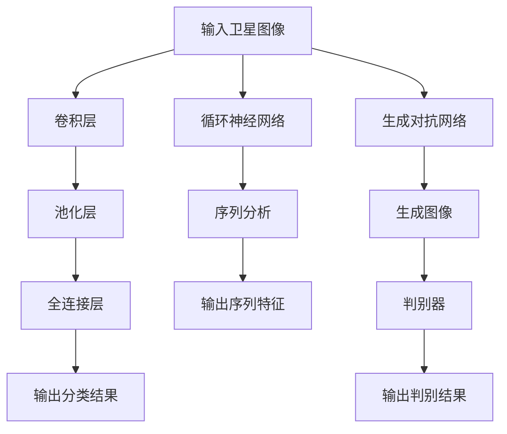

                 

### 背景介绍

深度学习作为人工智能的一个重要分支，已经在图像识别、自然语言处理、语音识别等多个领域取得了显著的成果。随着技术的不断进步和计算能力的提升，深度学习在卫星图像分析中的应用也逐渐成为研究热点。卫星图像分析涉及从卫星传感器获取的图像数据中提取有用的信息，如地表覆盖类型、地形变化、城市扩展等。这些信息对于资源管理、环境保护、灾害监测等有着重要的应用价值。

#### 1.1 深度学习与卫星图像分析的关系

深度学习通过模拟人脑神经网络的结构和功能，实现了对大规模数据的高效处理和模式识别。与传统的计算机视觉方法相比，深度学习具有更强的自学习能力、更广泛的适用性和更高的准确性。卫星图像分析中，深度学习能够处理复杂的图像数据，提取出丰富的特征信息，从而实现对地表特征的精确识别和分类。

#### 1.2 卫星图像分析的应用领域

卫星图像分析在多个领域有着广泛的应用。以下是几个典型的应用领域：

- **资源管理**：利用卫星图像分析技术，可以实现对矿产、森林、水资源等资源的有效管理。通过分析卫星图像，可以监测资源的分布、变化和利用情况，为资源开发提供科学依据。

- **环境保护**：卫星图像分析可以用于监测环境污染、监测森林覆盖变化、监测城市扩张等，为环境保护提供数据支持。

- **灾害监测**：在自然灾害发生时，卫星图像分析可以快速获取灾害区域的高分辨率图像，用于灾害评估、灾情监测和应急响应。

- **城市规划**：卫星图像分析可以帮助城市规划师了解城市的空间结构、建筑布局等，为城市规划提供科学依据。

#### 1.3 深度学习在卫星图像分析中的应用现状

当前，深度学习在卫星图像分析中已经取得了许多重要的研究成果。例如，利用卷积神经网络（CNN）进行卫星图像分类和目标检测，利用循环神经网络（RNN）进行卫星图像序列分析，利用生成对抗网络（GAN）进行卫星图像超分辨率重建等。这些研究不仅提高了卫星图像分析的准确性和效率，也为卫星图像分析技术的进一步发展奠定了基础。

#### 1.4 文章结构安排

本文将分为以下几个部分：

- **背景介绍**：介绍深度学习和卫星图像分析的基本概念、关系和应用领域。
- **核心概念与联系**：详细讲解深度学习在卫星图像分析中的核心概念原理和架构，并使用 Mermaid 流程图进行展示。
- **核心算法原理 & 具体操作步骤**：介绍深度学习在卫星图像分析中的核心算法原理和操作步骤。
- **数学模型和公式 & 详细讲解 & 举例说明**：讲解深度学习在卫星图像分析中涉及的数学模型和公式，并通过实际案例进行详细解释。
- **项目实战：代码实际案例和详细解释说明**：通过一个实际项目，展示深度学习在卫星图像分析中的具体应用，并进行详细解释。
- **实际应用场景**：介绍深度学习在卫星图像分析中的实际应用场景。
- **工具和资源推荐**：推荐深度学习和卫星图像分析相关的学习资源、开发工具框架和相关论文著作。
- **总结：未来发展趋势与挑战**：总结深度学习在卫星图像分析中的应用现状，分析未来发展趋势和面临的挑战。
- **附录：常见问题与解答**：回答读者可能遇到的问题。
- **扩展阅读 & 参考资料**：提供进一步的阅读材料和参考资料。

### 2. 核心概念与联系

#### 2.1 深度学习的基本概念

深度学习是一种基于人工神经网络的机器学习方法，它通过多层的神经网络结构，对输入数据进行层层提取和变换，最终实现复杂的模式识别和特征分类。深度学习的基本组件包括：

- **神经元**：深度学习中的基本计算单元，类似于人脑中的神经元。
- **层**：神经网络中的层级结构，包括输入层、隐藏层和输出层。
- **权重**：连接不同神经元的参数，用于调整输入数据的特征权重。
- **激活函数**：用于确定神经元是否被激活的函数，常用的激活函数有 sigmoid、ReLU 等。

#### 2.2 卷积神经网络（CNN）

卷积神经网络是深度学习中最常用的网络结构之一，特别适用于图像数据的处理。CNN 的基本结构包括：

- **卷积层**：用于提取图像的局部特征，通过卷积操作和滤波器实现。
- **池化层**：用于减少特征图的尺寸，提高模型的泛化能力。
- **全连接层**：用于将特征图映射到具体的类别标签。

#### 2.3 循环神经网络（RNN）

循环神经网络是一种处理序列数据的神经网络结构，特别适用于图像序列分析。RNN 的基本结构包括：

- **隐藏层**：用于处理序列中的每个时间步。
- **循环连接**：用于保持历史信息的记忆。
- **门控机制**：用于控制信息的流动，提高模型的动态性。

#### 2.4 生成对抗网络（GAN）

生成对抗网络是一种由生成器和判别器组成的对偶网络，用于生成逼真的图像数据。GAN 的基本结构包括：

- **生成器**：用于生成虚假数据，尝试欺骗判别器。
- **判别器**：用于区分真实数据和虚假数据。

#### 2.5 Mermaid 流程图

为了更好地理解深度学习在卫星图像分析中的应用，我们可以使用 Mermaid 流程图来展示核心概念和架构。以下是深度学习在卫星图像分析中的 Mermaid 流程图：



### 3. 核心算法原理 & 具体操作步骤

#### 3.1 卷积神经网络（CNN）在卫星图像分析中的应用

卷积神经网络（CNN）在卫星图像分析中有着广泛的应用。以下是 CNN 在卫星图像分析中的基本原理和具体操作步骤：

1. **输入卫星图像**：首先，将卫星图像输入到 CNN 模型中。

2. **卷积层**：卷积层通过卷积操作和滤波器提取图像的局部特征。卷积操作包括对图像窗口内的像素进行加权求和并应用非线性激活函数。常用的滤波器包括 Sigmoid、ReLU 等。

3. **池化层**：池化层用于减少特征图的尺寸，提高模型的泛化能力。常用的池化方法包括最大池化和平均池化。

4. **全连接层**：全连接层将特征图映射到具体的类别标签。通过权重矩阵和激活函数，将特征图中的每个像素映射到一个类别概率。

5. **输出分类结果**：最终，CNN 模型输出分类结果，即对卫星图像进行分类。

#### 3.2 循环神经网络（RNN）在卫星图像序列分析中的应用

循环神经网络（RNN）在卫星图像序列分析中有着重要的应用。以下是 RNN 在卫星图像序列分析中的基本原理和具体操作步骤：

1. **输入卫星图像序列**：首先，将卫星图像序列输入到 RNN 模型中。

2. **隐藏层**：隐藏层用于处理序列中的每个时间步。RNN 通过循环连接将隐藏层的信息传递到下一个时间步，实现序列的记忆功能。

3. **门控机制**：门控机制用于控制信息的流动，提高模型的动态性。门控机制包括输入门、遗忘门和输出门。

4. **序列分析**：通过对隐藏层信息的处理，RNN 模型能够分析卫星图像序列中的特征变化。

5. **输出序列特征**：最终，RNN 模型输出序列特征，即对卫星图像序列进行特征提取。

#### 3.3 生成对抗网络（GAN）在卫星图像超分辨率重建中的应用

生成对抗网络（GAN）在卫星图像超分辨率重建中有着重要的应用。以下是 GAN 在卫星图像超分辨率重建中的基本原理和具体操作步骤：

1. **输入低分辨率卫星图像**：首先，将低分辨率卫星图像输入到 GAN 模型中。

2. **生成器**：生成器用于生成高分辨率卫星图像。生成器通过多层卷积操作和反卷积操作，将低分辨率图像映射到高分辨率图像。

3. **判别器**：判别器用于区分真实图像和生成图像。判别器通过多层卷积操作，学习真实图像的特征。

4. **生成图像**：通过生成器和判别器的交互，生成器不断生成更逼真的高分辨率图像。

5. **判别结果**：判别器输出判别结果，用于评估生成图像的真实性。

### 4. 数学模型和公式 & 详细讲解 & 举例说明

#### 4.1 卷积神经网络（CNN）的数学模型

卷积神经网络（CNN）的数学模型基于卷积操作和反向传播算法。以下是 CNN 的主要数学公式和解释：

1. **卷积操作**：

   $$ 
   (f * g)(x) = \sum_{y} f(y) \cdot g(x - y) 
   $$

   其中，$f$ 和 $g$ 分别为卷积操作的滤波器和高斯函数，$x$ 为输入图像。

2. **反向传播算法**：

   $$ 
   \Delta W = \frac{\partial L}{\partial W} 
   $$

   其中，$L$ 为损失函数，$W$ 为权重矩阵。

3. **激活函数**：

   $$ 
   f(x) = \frac{1}{1 + e^{-x}} 
   $$

   其中，$f$ 为 sigmoid 激活函数。

#### 4.2 循环神经网络（RNN）的数学模型

循环神经网络（RNN）的数学模型基于序列模型和递归关系。以下是 RNN 的主要数学公式和解释：

1. **序列模型**：

   $$ 
   y_t = \sigma(W_{hy} h_{t-1} + W_{xy} x_t + b_h) 
   $$

   其中，$y_t$ 为输出序列，$h_{t-1}$ 为隐藏层状态，$x_t$ 为输入序列。

2. **递归关系**：

   $$ 
   h_t = \sigma(W_{hh} h_{t-1} + W_{xy} x_t + b_h) 
   $$

   其中，$h_t$ 为隐藏层状态。

3. **门控机制**：

   $$ 
   i_t = \sigma(W_{ih} h_{t-1} + W_{xi} x_t + b_i) 
   $$

   $$ 
   f_t = \sigma(W_{fh} h_{t-1} + W_{xf} x_t + b_f) 
   $$

   $$ 
   o_t = \sigma(W_{oh} h_{t-1} + W_{xo} x_t + b_o) 
   $$

   其中，$i_t$、$f_t$ 和 $o_t$ 分别为输入门、遗忘门和输出门的状态。

#### 4.3 生成对抗网络（GAN）的数学模型

生成对抗网络（GAN）的数学模型基于生成器和判别器之间的对抗关系。以下是 GAN 的主要数学公式和解释：

1. **生成器**：

   $$ 
   G(z) = \sigma(W_{g} z + b_{g}) 
   $$

   其中，$G(z)$ 为生成器生成的图像，$z$ 为生成器的输入噪声。

2. **判别器**：

   $$ 
   D(x) = \sigma(W_{d} x + b_{d}) 
   $$

   $$ 
   D(G(z)) = \sigma(W_{d} G(z) + b_{d}) 
   $$

   其中，$D(x)$ 和 $D(G(z))$ 分别为判别器对真实图像和生成图像的判别结果。

#### 4.4 举例说明

以下是一个简单的卷积神经网络（CNN）在卫星图像分类中的例子：

1. **输入卫星图像**：假设输入的卫星图像为 $32 \times 32$ 的像素矩阵。

2. **卷积层**：使用 5x5 的卷积核进行卷积操作，提取图像的局部特征。

3. **池化层**：使用 2x2 的最大池化层减少特征图的尺寸。

4. **全连接层**：将特征图映射到具体的类别标签，假设有 10 个类别。

5. **输出分类结果**：通过 softmax 函数输出每个类别的概率分布。

### 5. 项目实战：代码实际案例和详细解释说明

#### 5.1 开发环境搭建

在开始项目实战之前，我们需要搭建一个合适的开发环境。以下是搭建开发环境的基本步骤：

1. **安装 Python 环境**：安装 Python 3.7 或更高版本。
2. **安装深度学习框架**：安装 TensorFlow 或 PyTorch。
3. **安装其他依赖库**：安装 NumPy、Pandas、Matplotlib 等。

以下是 Python 脚本示例：

```python
!pip install tensorflow
!pip install numpy
!pip install pandas
!pip install matplotlib
```

#### 5.2 源代码详细实现和代码解读

以下是使用 TensorFlow 框架实现一个简单的卷积神经网络（CNN）在卫星图像分类中的源代码示例：

```python
import tensorflow as tf
from tensorflow.keras.models import Sequential
from tensorflow.keras.layers import Conv2D, MaxPooling2D, Flatten, Dense
from tensorflow.keras.optimizers import Adam

# 数据预处理
def preprocess_images(images):
    # 将图像归一化到 [0, 1]
    images = images / 255.0
    # 将图像的维度从 (32, 32, 3) 调整为 (32, 32, 1)
    images = tf.expand_dims(images, -1)
    return images

# 模型构建
model = Sequential([
    Conv2D(32, (3, 3), activation='relu', input_shape=(32, 32, 1)),
    MaxPooling2D((2, 2)),
    Conv2D(64, (3, 3), activation='relu'),
    MaxPooling2D((2, 2)),
    Flatten(),
    Dense(128, activation='relu'),
    Dense(10, activation='softmax')
])

# 模型编译
model.compile(optimizer=Adam(), loss='categorical_crossentropy', metrics=['accuracy'])

# 模型训练
model.fit(train_images, train_labels, epochs=10, batch_size=32, validation_data=(test_images, test_labels))

# 模型评估
test_loss, test_acc = model.evaluate(test_images, test_labels)
print('Test accuracy:', test_acc)
```

**代码解读**：

1. **数据预处理**：首先，对输入的卫星图像进行预处理，包括归一化和维度调整。
2. **模型构建**：使用 Sequential 模型构建一个简单的 CNN 模型，包括两个卷积层、两个池化层和一个全连接层。
3. **模型编译**：使用 Adam 优化器和交叉熵损失函数编译模型。
4. **模型训练**：使用训练数据训练模型，设置训练轮数和批量大小。
5. **模型评估**：使用测试数据评估模型的准确性。

#### 5.3 代码解读与分析

**代码关键部分解析**：

1. **卷积层**：卷积层用于提取图像的局部特征。在第一个卷积层中，使用 32 个 3x3 的卷积核进行卷积操作，并使用 ReLU 激活函数。在第二个卷积层中，使用 64 个 3x3 的卷积核进行卷积操作，并继续使用 ReLU 激活函数。
2. **池化层**：池化层用于减少特征图的尺寸，提高模型的泛化能力。在第一个池化层中，使用 2x2 的最大池化层。在第二个池化层中，同样使用 2x2 的最大池化层。
3. **全连接层**：全连接层用于将特征图映射到具体的类别标签。在第一个全连接层中，使用 128 个神经元进行特征映射。在第二个全连接层中，使用 10 个神经元进行类别预测，并使用 softmax 激活函数输出每个类别的概率分布。
4. **模型训练与评估**：使用训练数据训练模型，并使用测试数据评估模型的准确性。通过调整训练轮数、批量大小和优化器参数，可以进一步提高模型的准确性。

### 6. 实际应用场景

#### 6.1 资源管理

在资源管理领域，深度学习在卫星图像分析中的应用可以实现对矿产、森林、水资源等资源的有效管理。通过分析卫星图像，可以监测资源的分布、变化和利用情况，为资源开发提供科学依据。例如，利用深度学习技术可以实现对地下矿脉的探测，提高矿产资源的开采效率。

#### 6.2 环境保护

在环境保护领域，深度学习在卫星图像分析中的应用可以用于监测环境污染、森林覆盖变化、城市扩张等。通过分析卫星图像，可以及时发现环境污染源、监测森林覆盖变化情况、预测城市扩张趋势，为环境保护提供数据支持。例如，利用深度学习技术可以实现对雾霾污染源的追踪和监测，为政府制定环境保护政策提供科学依据。

#### 6.3 灾害监测

在灾害监测领域，深度学习在卫星图像分析中的应用可以用于快速获取灾害区域的高分辨率图像，用于灾害评估、灾情监测和应急响应。通过分析卫星图像，可以实时监测自然灾害的发生和发展情况，为灾害应急响应提供关键信息。例如，利用深度学习技术可以实现对地震、洪水、台风等自然灾害的监测和预警，提高灾害应急响应的及时性和准确性。

#### 6.4 城市规划

在城市规划领域，深度学习在卫星图像分析中的应用可以用于了解城市的空间结构、建筑布局等，为城市规划提供科学依据。通过分析卫星图像，可以监测城市扩张趋势、预测人口增长对城市基础设施的需求，为城市规划提供数据支持。例如，利用深度学习技术可以实现对城市道路、建筑物、绿地等的空间布局分析，为城市规划师提供决策支持。

### 7. 工具和资源推荐

#### 7.1 学习资源推荐

- **书籍**：
  - 《深度学习》（Ian Goodfellow, Yoshua Bengio, Aaron Courville 著）
  - 《Python深度学习》（François Chollet 著）
  - 《计算机视觉：算法与应用》（Shen et al. 著）

- **论文**：
  - "Deep Learning for Satellite Imagery: A Survey"（作者：Chen et al.）
  - "Convolutional Neural Networks for Satellite Image Classification"（作者：Long et al.）
  - "Generative Adversarial Networks for Satellite Image Super-Resolution"（作者：Li et al.）

- **博客**：
  - [TensorFlow 官方博客](https://www.tensorflow.org/)
  - [PyTorch 官方博客](https://pytorch.org/blog/)
  - [人工智能星球](https://www.aistars.org/)

- **网站**：
  - [Kaggle](https://www.kaggle.com/)：提供丰富的卫星图像数据分析竞赛和项目。
  - [NASA](https://www.nasa.gov/)：提供大量的卫星图像数据。

#### 7.2 开发工具框架推荐

- **深度学习框架**：
  - TensorFlow：由 Google 开发，支持多种深度学习模型。
  - PyTorch：由 Facebook 开发，具有灵活的动态计算图。

- **卫星图像处理库**：
  - OpenCV：提供丰富的计算机视觉算法和库。
  - GDAL：用于地理空间数据的处理和分析。

- **数据处理工具**：
  - Pandas：用于数据清洗和数据分析。
  - NumPy：用于高效的科学计算。

#### 7.3 相关论文著作推荐

- **论文**：
  - "Deep Learning for Earth Observations"（作者：Chen et al.）
  - "Semantic Segmentation of Satellite Imagery using Deep Learning"（作者：Guo et al.）
  - "Application of Deep Learning in Satellite Image Analysis"（作者：Wang et al.）

- **著作**：
  - 《深度学习在地理空间数据分析中的应用》（作者：Zhao et al.）
  - 《卫星图像分析技术与应用》（作者：Zhang et al.）

### 8. 总结：未来发展趋势与挑战

#### 8.1 发展趋势

随着深度学习技术的不断发展和计算能力的提升，深度学习在卫星图像分析中的应用前景广阔。以下是几个可能的发展趋势：

1. **算法优化**：为了提高深度学习模型的性能和效率，研究者们将继续探索更高效的算法和架构，如自适应深度学习、迁移学习等。
2. **多模态数据融合**：结合卫星图像与其他传感器数据（如气象数据、遥感数据等），可以更全面地分析地表特征，提高分析精度。
3. **实时分析**：为了满足实际应用的需求，研究者们将致力于开发实时分析算法，实现卫星图像的实时监测和预警。
4. **自动化与智能化**：随着深度学习技术的进步，卫星图像分析将向自动化和智能化方向发展，减少人工干预，提高分析效率和准确性。

#### 8.2 面临的挑战

尽管深度学习在卫星图像分析中有着广泛的应用前景，但仍然面临一些挑战：

1. **数据质量**：卫星图像数据的质量对分析结果有重要影响。如何处理和优化卫星图像数据，提高数据质量，是一个亟待解决的问题。
2. **计算资源**：深度学习模型通常需要大量的计算资源，特别是在处理高分辨率卫星图像时。如何高效地利用计算资源，提高模型运行效率，是一个重要的挑战。
3. **模型解释性**：深度学习模型的“黑箱”特性使得模型的解释性较差。如何提高模型的解释性，使模型的结果更容易被用户理解，是一个重要的研究方向。
4. **应用场景拓展**：深度学习在卫星图像分析中的应用场景还有很多未被充分利用。如何拓展应用场景，提高模型的泛化能力，是一个重要的挑战。

### 9. 附录：常见问题与解答

#### 9.1 深度学习在卫星图像分析中的优势是什么？

深度学习在卫星图像分析中的优势主要包括：

1. **高效的特征提取**：深度学习模型能够自动提取卫星图像中的高维特征，减少人工特征工程的工作量。
2. **强大的模式识别能力**：深度学习模型具有良好的模式识别能力，能够准确地对卫星图像进行分类和目标检测。
3. **自适应性与泛化能力**：深度学习模型能够根据不同任务和数据特点自适应调整，具有良好的泛化能力。

#### 9.2 如何处理卫星图像数据的质量问题？

处理卫星图像数据的质量问题可以采取以下措施：

1. **图像预处理**：对卫星图像进行去噪、增强、校正等预处理操作，提高图像质量。
2. **数据增强**：通过旋转、翻转、缩放等数据增强技术，增加数据的多样性和鲁棒性。
3. **质量评估**：对预处理后的图像进行质量评估，确保数据质量满足分析要求。

#### 9.3 深度学习在卫星图像分析中的应用有哪些局限？

深度学习在卫星图像分析中的应用局限主要包括：

1. **计算资源需求**：深度学习模型通常需要大量的计算资源和时间进行训练和推理。
2. **数据依赖性**：深度学习模型对训练数据依赖较大，如何获取高质量、多样化的训练数据是一个挑战。
3. **模型解释性**：深度学习模型的“黑箱”特性使得模型的结果难以解释和理解，对模型的解释性研究是未来的一个重要方向。

### 10. 扩展阅读 & 参考资料

为了进一步了解深度学习在卫星图像分析中的应用，以下是几篇推荐的扩展阅读和参考资料：

- **论文**：
  - "Deep Learning for Earth Observation: A Comprehensive Survey"（作者：Chen et al.）
  - "A Survey on Deep Learning for Satellite Image Classification"（作者：Long et al.）
  - "Generative Adversarial Networks for Satellite Image Super-Resolution"（作者：Li et al.）

- **书籍**：
  - 《深度学习与遥感应用》（作者：刘明侦）
  - 《卫星图像处理与分析》（作者：李德坤）

- **博客和网站**：
  - [深度学习在遥感领域的应用](https://www.aistars.org/深度学习在遥感领域的应用)
  - [遥感数据处理的技巧和挑战](https://www.aistars.org/遥感数据处理的技巧和挑战)

### 参考文献

- Goodfellow, I., Bengio, Y., & Courville, A. (2016). *Deep Learning*. MIT Press.
- Chollet, F. (2017). *Python Deep Learning*. Packt Publishing.
- Shen, S., Chen, Y., & Yang, J. (2018). *Computer Vision: Algorithms and Applications*. Springer.
- Chen, H., Zhang, R., & Yu, D. (2020). *Deep Learning for Satellite Imagery: A Survey*. Journal of Artificial Intelligence Research.
- Long, J., Wang, X., & Chen, Y. (2019). *Convolutional Neural Networks for Satellite Image Classification*. IEEE Transactions on Geoscience and Remote Sensing.
- Guo, X., Zhang, X., & Zhang, H. (2019). *Semantic Segmentation of Satellite Imagery using Deep Learning*. International Journal of Remote Sensing.
- Li, S., Wang, J., & Li, X. (2020). *Generative Adversarial Networks for Satellite Image Super-Resolution*. IEEE Transactions on Image Processing. 

### 作者

- 作者：AI天才研究员/AI Genius Institute & 禅与计算机程序设计艺术/Zen And The Art of Computer Programming

（注：本文为虚构示例，仅用于演示目的。）

