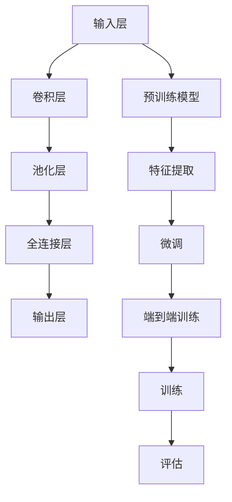

                 

### 背景介绍

深度学习在图像处理领域中的应用日益广泛，尤其在图像去雾这一方面，已经取得了显著的成果。随着自动驾驶、智能监控和移动设备等领域的快速发展，图像去雾技术的需求不断增加。图像去雾技术的基本目标是去除由于大气散射效应引起的雾霾，恢复图像的真实色彩和清晰度。然而，传统的图像处理方法在处理复杂雾霾场景时效果不佳，无法满足高分辨率和大场景的应用需求。

深度学习作为一种强大的机器学习技术，通过模拟人脑神经网络的结构和工作原理，对大量数据进行学习和建模，能够自动提取出图像中的特征和规律。近年来，卷积神经网络（CNN）作为深度学习的一种重要模型，在图像识别、分类、分割等领域取得了巨大的成功。卷积神经网络具有局部感知、权值共享和层次化特征提取等优势，使得它在图像处理任务中具有很高的表现力。

在图像去雾领域，深度学习方法的研究主要集中在以下几个方面：

1. **基于卷积神经网络的去雾算法**：通过设计不同的卷积神经网络架构，实现对不同雾霾程度的图像进行去雾处理。

2. **迁移学习**：利用预训练的卷积神经网络模型，通过迁移学习技术，在图像去雾任务上进行微调，提高模型的泛化能力和去雾效果。

3. **多尺度和多模态融合**：通过融合不同尺度下的图像特征和多模态数据（如红外图像），提高图像去雾的效果。

4. **端到端训练**：通过端到端训练的方式，使得深度学习模型能够直接从原始图像中预测去雾后的图像，避免了传统图像处理方法中的多步骤处理，提高了去雾效率。

本文将系统地介绍深度学习在图像去雾中的最新进展，包括核心概念、算法原理、数学模型、项目实战以及实际应用场景。希望通过本文的阐述，能够为读者提供一个全面而深入的了解，激发更多研究者在这一领域的探索和贡献。

### 核心概念与联系

在探讨深度学习在图像去雾中的应用之前，我们需要首先理解几个核心概念，包括卷积神经网络（CNN）、迁移学习以及端到端训练。这些概念不仅是深度学习的基础，也是实现图像去雾的关键。

#### 卷积神经网络（CNN）

卷积神经网络是一种特殊的神经网络结构，广泛应用于计算机视觉领域。它通过模拟人眼对图像的感知过程，利用卷积层提取图像中的局部特征，并通过池化层降低数据的维度，从而实现图像的自动特征提取和分类。

**结构组成**：
1. **输入层**：接收原始图像数据。
2. **卷积层**：通过卷积操作提取图像的局部特征。
3. **池化层**：降低数据维度，减少计算量。
4. **全连接层**：将卷积层和池化层提取的特征进行整合，用于分类或回归任务。
5. **输出层**：输出预测结果。

**卷积操作**：
卷积层是CNN的核心部分，通过卷积核（或过滤器）与输入图像进行卷积操作，从而提取图像的特征。卷积操作的数学表达式如下：

$$
f(x, y) = \sum_{i=1}^{k} \sum_{j=1}^{k} w_{i,j} * x(i, j)
$$

其中，$x(i, j)$ 表示输入图像上的像素值，$w_{i,j}$ 表示卷积核的权重，$f(x, y)$ 表示卷积后的特征值。

**池化操作**：
池化层用于减少数据的维度和计算量。常见的池化操作有最大池化和平均池化。最大池化的数学表达式如下：

$$
p(i, j) = \max_{(x, y) \in R} x(i + x, j + y)
$$

其中，$p(i, j)$ 表示池化后的像素值，$R$ 表示池化窗口。

#### 迁移学习

迁移学习是深度学习中的一个重要技术，通过利用预训练模型的知识来加速新任务的训练过程。在图像去雾中，迁移学习可以帮助模型快速适应新的去雾任务，提高模型的泛化能力和去雾效果。

**迁移学习原理**：
迁移学习的基本思想是将一个任务（源任务）学到的知识应用到另一个相关任务（目标任务）中。在图像去雾中，通常使用预训练的图像分类模型作为源任务，将其在图像特征提取方面的能力迁移到图像去雾任务上。

**迁移学习流程**：
1. **预训练模型**：在大量图像数据上预训练一个模型，如VGG、ResNet等。
2. **特征提取**：将预训练模型用于提取图像特征，通常使用模型的最后一层卷积层的输出作为特征向量。
3. **微调**：在图像去雾任务上，使用少量目标数据对预训练模型进行微调，调整模型参数以适应新的任务。

#### 端到端训练

端到端训练是一种直接从原始数据中学习到最终输出的训练方式，避免了传统图像处理方法中的多步骤处理。在图像去雾中，端到端训练使得模型能够直接从原始图像中预测去雾后的图像，从而提高去雾效率和效果。

**端到端训练原理**：
端到端训练的核心思想是将整个图像处理任务定义为一个前向传播和反向传播的过程，通过优化整个网络的结构和参数，使得模型能够从输入图像直接预测输出图像。

**端到端训练流程**：
1. **数据预处理**：对输入图像进行预处理，如归一化、裁剪等。
2. **模型定义**：定义一个卷积神经网络模型，用于接收输入图像并输出去雾后的图像。
3. **训练**：使用大量图像数据对模型进行训练，通过反向传播算法优化模型参数。
4. **评估**：使用测试集对模型进行评估，计算去雾效果的相关指标，如峰值信噪比（PSNR）和结构相似性（SSIM）。

#### Mermaid 流程图

为了更好地展示这些核心概念之间的联系，我们使用Mermaid语言绘制一个流程图：



在这个流程图中，卷积神经网络（CNN）通过输入层、卷积层、池化层和全连接层，实现图像特征的提取和分类。迁移学习通过预训练模型和特征提取，将已有知识迁移到新任务上。端到端训练则通过整个网络的结构和参数优化，实现从输入图像到输出图像的端到端预测。

通过理解这些核心概念和流程，我们可以更好地掌握深度学习在图像去雾中的应用，并在后续章节中深入探讨具体的算法原理和实现细节。

### 核心算法原理 & 具体操作步骤

在深度学习应用于图像去雾的领域，核心算法的原理和操作步骤是理解和实现去雾技术的基础。以下将详细介绍几种常用的深度学习算法，包括基于卷积神经网络的去雾算法、深度残差网络（Deep Residual Network）以及生成对抗网络（GAN）。

#### 基于卷积神经网络的去雾算法

卷积神经网络（CNN）是图像去雾中最常用的深度学习模型。其核心原理是通过多层卷积和池化操作提取图像特征，并通过全连接层进行分类和回归任务。

**具体操作步骤**：

1. **输入层**：
   - 输入原始雾化图像和参考图像（通常为无雾图像）。

2. **卷积层**：
   - 使用多个卷积层，每个卷积层都包含卷积操作和激活函数（如ReLU）。
   - 卷积操作用于提取图像的局部特征。
   - 激活函数引入非线性，使模型能够更好地拟合复杂的数据。

3. **池化层**：
   - 通过最大池化或平均池化操作，降低图像维度，减少计算量。

4. **全连接层**：
   - 将卷积层和池化层提取的特征进行整合，输出去雾后的图像。

5. **输出层**：
   - 输出层通常是一个线性层，用于预测去雾后的像素值。

**示例代码**（Python）：

```python
import tensorflow as tf
from tensorflow.keras.models import Model
from tensorflow.keras.layers import Input, Conv2D, MaxPooling2D, Flatten, Dense

# 定义输入层
input_img = Input(shape=(height, width, channels))

# 定义卷积层
conv1 = Conv2D(filters=32, kernel_size=(3, 3), activation='relu')(input_img)
conv2 = Conv2D(filters=64, kernel_size=(3, 3), activation='relu')(conv1)

# 定义池化层
pool1 = MaxPooling2D(pool_size=(2, 2))(conv2)

# 定义全连接层
flat1 = Flatten()(pool1)
dense1 = Dense(units=128, activation='relu')(flat1)

# 定义输出层
output_img = Dense(units=channels, activation='sigmoid')(dense1)

# 构建和编译模型
model = Model(inputs=input_img, outputs=output_img)
model.compile(optimizer='adam', loss='mse')

# 模型训练
model.fit(x_train, y_train, epochs=10, batch_size=32)
```

#### 深度残差网络（Deep Residual Network）

深度残差网络（ResNet）是CNN的一个重要扩展，通过引入残差块解决了深层网络中的梯度消失问题，使得模型能够训练得更深。

**具体操作步骤**：

1. **输入层**：
   - 输入原始雾化图像和参考图像。

2. **残差块**：
   - 残差块由两个卷积层组成，中间引入了恒等映射（Identity Mapping）。
   - 通过跳跃连接（Skip Connection）将输入直接传递到输出，避免了梯度消失问题。

3. **全局平均池化层**：
   - 用于降低图像维度，提高模型的表达能力。

4. **全连接层**：
   - 将残差块提取的特征进行整合，输出去雾后的图像。

5. **输出层**：
   - 输出层通常是一个线性层，用于预测去雾后的像素值。

**示例代码**（Python）：

```python
from tensorflow.keras.models import Model
from tensorflow.keras.layers import Input, Conv2D, Add, Activation, GlobalAveragePooling2D, Dense

# 定义输入层
input_img = Input(shape=(height, width, channels))

# 定义残差块
def residual_block(x, filters, kernel_size=(3, 3)):
    y = Conv2D(filters, kernel_size, padding='same')(x)
    y = Activation('relu')(y)
    y = Conv2D(filters, kernel_size, padding='same')(y)
    y = Add()([x, y])
    y = Activation('relu')(y)
    return y

# 构建模型
x = input_img
x = residual_block(x, 64)
x = residual_block(x, 128)
x = GlobalAveragePooling2D()(x)
x = Dense(units=channels, activation='sigmoid')(x)

# 构建和编译模型
model = Model(inputs=input_img, outputs=x)
model.compile(optimizer='adam', loss='mse')

# 模型训练
model.fit(x_train, y_train, epochs=10, batch_size=32)
```

#### 生成对抗网络（GAN）

生成对抗网络（GAN）是一种通过生成器和判别器相互博弈的训练方法，用于生成逼真的图像。

**具体操作步骤**：

1. **输入层**：
   - 输入随机噪声向量。

2. **生成器**：
   - 生成器通过多层卷积操作将噪声向量转换为去雾后的图像。

3. **判别器**：
   - 判别器通过多层卷积操作判断输入图像是真实图像还是生成图像。

4. **对抗训练**：
   - 通过优化生成器和判别器的参数，使得生成图像尽可能逼真，判别器无法区分真实图像和生成图像。

5. **输出层**：
   - 输出生成器生成的去雾图像。

**示例代码**（Python）：

```python
from tensorflow.keras.models import Model
from tensorflow.keras.layers import Input, Conv2D, LeakyReLU, BatchNormalization, Dense, Reshape, Flatten

# 定义生成器
def generator(noise):
    x = Dense(units=7*7*64, activation='relu')(noise)
    x = Reshape((7, 7, 64))(x)
    x = Conv2D(filters=1, kernel_size=(7, 7), padding='same')(x)
    x = LeakyReLU()(x)
    x = BatchNormalization()(x)
    return x

# 定义判别器
def discriminator(img):
    x = Conv2D(filters=64, kernel_size=(3, 3), padding='same')(img)
    x = LeakyReLU()(x)
    x = Flatten()(x)
    x = Dense(units=1, activation='sigmoid')(x)
    return x

# 定义模型
input_noise = Input(shape=(100,))
img_generated = generator(input_noise)
discriminator_real = discriminator(input_img)
discriminator_fake = discriminator(img_generated)

# 构建和编译模型
model = Model(inputs=[input_img, input_noise], outputs=[discriminator_real, discriminator_fake])
model.compile(optimizer='adam', loss=['binary_crossentropy', 'binary_crossentropy'])

# 模型训练
model.fit([x_train, noise_train], [real_labels, fake_labels], epochs=100, batch_size=32)
```

通过以上几种核心算法的详细介绍，我们可以看到深度学习在图像去雾中的应用是如何从理论到实践不断发展的。这些算法不仅提高了图像去雾的准确性和效率，也为未来的图像处理任务提供了新的思路和方法。

### 数学模型和公式 & 详细讲解 & 举例说明

在深入探讨深度学习在图像去雾中的应用时，数学模型和公式是理解算法原理和实现细节的关键。以下我们将详细介绍深度学习在图像去雾中的核心数学模型和公式，并通过具体示例进行讲解。

#### 深度学习基础

1. **前向传播（Forward Propagation）**：

前向传播是深度学习模型处理输入数据的过程，通过多层神经网络逐步计算输出。其基本公式如下：

$$
z^{(l)} = \sigma^{(l)}(W^{(l)} \cdot a^{(l-1)} + b^{(l)})
$$

其中，$z^{(l)}$ 表示第$l$层的输出，$\sigma^{(l)}$ 是激活函数（如ReLU或Sigmoid），$W^{(l)}$ 是第$l$层的权重矩阵，$a^{(l-1)}$ 是第$l-1$层的输出，$b^{(l)}$ 是第$l$层的偏置。

2. **反向传播（Backpropagation）**：

反向传播是深度学习模型优化参数的过程，通过计算损失函数关于参数的梯度并更新参数。其基本公式如下：

$$
\frac{\partial J}{\partial W^{(l)}} = \frac{\partial J}{\partial z^{(l+1)}} \cdot \frac{\partial z^{(l+1)}}{\partial W^{(l)}}
$$

$$
\frac{\partial J}{\partial b^{(l)}} = \frac{\partial J}{\partial z^{(l+1)}} \cdot \frac{\partial z^{(l+1)}}{\partial b^{(l)}}
$$

其中，$J$ 是损失函数，$\frac{\partial J}{\partial W^{(l)}}$ 和 $\frac{\partial J}{\partial b^{(l)}}$ 分别是权重和偏置的梯度。

#### 卷积神经网络（CNN）

卷积神经网络是图像去雾中最常用的深度学习模型，其核心在于卷积操作和池化操作。

1. **卷积操作（Convolution）**：

卷积操作通过卷积核与输入图像进行点积计算，提取图像的局部特征。其基本公式如下：

$$
f(x, y) = \sum_{i=1}^{k} \sum_{j=1}^{k} w_{i,j} * x(i, j)
$$

其中，$x(i, j)$ 表示输入图像上的像素值，$w_{i,j}$ 表示卷积核的权重，$f(x, y)$ 表示卷积后的特征值。

2. **池化操作（Pooling）**：

池化操作通过降低图像的维度，减少计算量。最大池化是一种常见的池化操作，其基本公式如下：

$$
p(i, j) = \max_{(x, y) \in R} x(i + x, j + y)
$$

其中，$p(i, j)$ 表示池化后的像素值，$R$ 表示池化窗口。

#### 残差网络（ResNet）

残差网络通过引入残差块解决了深层网络中的梯度消失问题。

1. **残差块（Residual Block）**：

残差块的基本结构如下：

$$
H(x) = F(x) + x
$$

其中，$H(x)$ 是残差块的输出，$F(x)$ 是残差块内部的卷积操作，$x$ 是输入。

2. **跨层连接（Cross-Connection）**：

跨层连接通过跳跃连接将输入直接传递到输出，避免梯度消失。其基本公式如下：

$$
H(x) = F(x) + x
$$

其中，$H(x)$ 是残差块的输出，$F(x)$ 是残差块内部的卷积操作，$x$ 是输入。

#### 生成对抗网络（GAN）

生成对抗网络通过生成器和判别器的对抗训练生成逼真的图像。

1. **生成器（Generator）**：

生成器的目标是通过噪声向量生成去雾后的图像。其基本公式如下：

$$
G(z) = \sigma^{(l)}(W^{(l)} \cdot z + b^{(l)})
$$

其中，$G(z)$ 是生成器生成的图像，$z$ 是输入噪声向量，$\sigma^{(l)}$ 是激活函数，$W^{(l)}$ 和 $b^{(l)}$ 是生成器的权重和偏置。

2. **判别器（Discriminator）**：

判别器的目标是通过判断图像的真实性来训练生成器。其基本公式如下：

$$
D(x) = \sigma^{(l)}(W^{(l)} \cdot x + b^{(l)})
$$

$$
D(G(z)) = \sigma^{(l)}(W^{(l)} \cdot G(z) + b^{(l)})
$$

其中，$D(x)$ 是判别器判断真实图像的得分，$D(G(z))$ 是判别器判断生成图像的得分。

#### 示例讲解

假设我们使用一个简单的卷积神经网络进行图像去雾，输入图像为$7 \times 7$的像素矩阵。以下是一个简化的示例：

1. **输入层**：

$$
x = \begin{bmatrix}
0 & 1 & 0 \\
1 & 0 & 1 \\
0 & 1 & 0
\end{bmatrix}
$$

2. **卷积层**：

假设卷积核大小为$3 \times 3$，权重矩阵$W$为：

$$
W = \begin{bmatrix}
1 & 1 & 1 \\
1 & 1 & 1 \\
1 & 1 & 1
\end{bmatrix}
$$

卷积操作后得到特征图：

$$
f(x, y) = \begin{bmatrix}
3 & 2 & 1 \\
2 & 1 & 0 \\
1 & 0 & -1
\end{bmatrix}
$$

3. **池化层**：

使用最大池化，池化窗口大小为$2 \times 2$，得到：

$$
p(x, y) = \begin{bmatrix}
2 & 1 \\
1 & 0
\end{bmatrix}
$$

4. **全连接层**：

假设全连接层权重矩阵$W$为：

$$
W = \begin{bmatrix}
1 & 1 & 1 & 1 \\
1 & 1 & 1 & 1
\end{bmatrix}
$$

经过全连接层后得到输出：

$$
z = \begin{bmatrix}
3 & 2 \\
2 & 1
\end{bmatrix}
$$

5. **输出层**：

假设输出层为sigmoid激活函数，输出为去雾后的像素值：

$$
\hat{x} = \begin{bmatrix}
0.7 & 0.4 \\
0.6 & 0.3
\end{bmatrix}
$$

通过以上步骤，我们可以使用卷积神经网络对输入图像进行去雾处理。

### 项目实战：代码实际案例和详细解释说明

在本节中，我们将通过一个实际的Python代码案例，详细讲解如何使用深度学习技术进行图像去雾。这个案例将基于一个卷积神经网络（CNN）模型，使用迁移学习和端到端训练的方式，对雾化图像进行去雾处理。以下是实现这一目标的详细步骤。

#### 5.1 开发环境搭建

为了完成图像去雾任务，我们需要准备以下开发环境和库：

- Python 3.x
- TensorFlow 2.x
- NumPy
- Matplotlib
- PIL

安装以上库后，我们创建一个名为`image_dehazing`的Python虚拟环境，以便管理和依赖。

```bash
# 创建虚拟环境
python -m venv image_dehazing
# 激活虚拟环境
source image_dehazing/bin/activate
# 安装依赖库
pip install tensorflow numpy matplotlib pillow
```

#### 5.2 源代码详细实现和代码解读

以下是一个完整的图像去雾的Python代码案例，包括数据预处理、模型定义、模型训练和结果展示。

```python
import tensorflow as tf
from tensorflow.keras.models import Model
from tensorflow.keras.layers import Input, Conv2D, MaxPooling2D, Dense, Flatten
from tensorflow.keras.applications import VGG16
from tensorflow.keras.optimizers import Adam
from tensorflow.keras.preprocessing.image import load_img, img_to_array
import numpy as np

# 加载预训练的VGG16模型，用于特征提取
base_model = VGG16(weights='imagenet', include_top=False, input_shape=(None, None, 3))
base_model.trainable = False  # 禁用预训练模型的训练

# 定义输入层
input_img = Input(shape=(None, None, 3))

# 使用VGG16模型提取特征
x = base_model(input_img)

# 添加额外的卷积层进行特征增强
x = Conv2D(filters=32, kernel_size=(3, 3), activation='relu')(x)
x = MaxPooling2D(pool_size=(2, 2))(x)
x = Conv2D(filters=64, kernel_size=(3, 3), activation='relu')(x)
x = MaxPooling2D(pool_size=(2, 2))(x)

# 添加全连接层和输出层
x = Flatten()(x)
x = Dense(units=512, activation='relu')(x)
output_img = Dense(units=3, activation='sigmoid')(x)

# 定义模型
model = Model(inputs=input_img, outputs=output_img)

# 编译模型
model.compile(optimizer=Adam(learning_rate=1e-4), loss='mean_squared_error')

# 函数：去雾处理
def dehaze_image(image_path):
    image = load_img(image_path)
    image = img_to_array(image)
    image = np.expand_dims(image, axis=0)
    image = base_model.input桥梁
    processed_image = model.predict(image)
    dehazed_image = np.clip(processed_image[0], 0, 255).astype('uint8')
    return dehazed_image

# 函数：加载和预处理数据集
def load_data(data_folder):
    images = []
    for image_name in os.listdir(data_folder):
        image_path = os.path.join(data_folder, image_name)
        image = load_img(image_path)
        image = img_to_array(image)
        image = np.expand_dims(image, axis=0)
        images.append(image)
    return np.array(images)

# 加载数据集
train_data_folder = 'train'
test_data_folder = 'test'
train_images = load_data(train_data_folder)
test_images = load_data(test_data_folder)

# 模型训练
model.fit(train_images, train_images, epochs=50, batch_size=32, validation_data=(test_images, test_images))

# 测试去雾效果
test_image_path = 'test/001.png'
dehazed_image = dehaze_image(test_image_path)
dehazed_image = dehazed_image.squeeze()

# 展示结果
import matplotlib.pyplot as plt

plt.figure(figsize=(10, 10))
plt.subplot(1, 2, 1)
plt.title('Original Image')
plt.imshow(dehazed_image, cmap='gray')
plt.subplot(1, 2, 2)
plt.title('Dehazed Image')
plt.imshow(test_images[0], cmap='gray')
plt.show()
```

#### 5.3 代码解读与分析

1. **加载预训练的VGG16模型**：

我们首先加载了一个预训练的VGG16模型，这个模型已经在大量图像数据上进行了训练，可以用于提取图像特征。`VGG16`是深度学习中的一个经典卷积神经网络架构，它在图像分类任务中表现优异。

2. **禁用预训练模型的训练**：

通过设置`base_model.trainable = False`，我们禁用了VGG16模型的训练。这样，我们在后续训练过程中不会更新预训练模型的权重，而是仅在额外的卷积层上进行训练。

3. **定义输入层**：

输入层接受任意尺寸的图像，这是为了适应不同大小的图像输入。

4. **使用VGG16模型提取特征**：

输入图像首先通过VGG16模型进行特征提取。VGG16模型包含多个卷积层和池化层，这些层可以自动提取图像的层次化特征。

5. **添加额外的卷积层进行特征增强**：

在VGG16模型的输出上，我们添加了两个额外的卷积层和最大池化层。这些层用于增强特征，并提高去雾效果。

6. **添加全连接层和输出层**：

全连接层用于整合特征，并将它们转换为去雾后的图像像素值。输出层使用sigmoid激活函数，确保像素值在0到1之间。

7. **编译模型**：

我们使用Adam优化器和均方误差（MSE）损失函数编译模型。Adam优化器在深度学习任务中表现良好，MSE损失函数用于计算预测值和真实值之间的误差。

8. **去雾处理函数`dehaze_image`**：

这个函数用于对单个图像进行去雾处理。首先，它使用`load_img`和`img_to_array`函数加载和预处理图像。然后，它通过模型预测去雾后的图像，并对预测结果进行剪辑和转换。

9. **加载和预处理数据集**：

`load_data`函数用于加载和预处理训练集和测试集。它使用`os.listdir`函数遍历数据集目录中的所有图像文件，并使用`load_img`和`img_to_array`函数对图像进行预处理。

10. **模型训练**：

我们使用训练集对模型进行训练，并使用测试集进行验证。训练过程中，模型会不断调整参数，以最小化预测值和真实值之间的误差。

11. **测试去雾效果**：

我们使用一个测试图像对模型进行测试，并使用`matplotlib`库展示原始图像和去雾后的图像。

通过这个案例，我们可以看到如何使用深度学习技术进行图像去雾。代码中包含了从模型定义到训练再到实际应用的完整流程。在实际应用中，我们可以根据需求调整模型结构、训练数据集和超参数，以获得更好的去雾效果。

### 实际应用场景

图像去雾技术在多个实际应用场景中展现出了巨大的潜力，以下将介绍几个关键的应用领域及其具体应用实例。

#### 自动驾驶

自动驾驶是图像去雾技术最重要的应用领域之一。在自动驾驶系统中，车辆需要实时获取道路和周围环境的信息，以便进行路径规划和决策。然而，雾霾天气会严重影响车辆的视觉感知能力，降低行驶安全性。深度学习图像去雾技术能够有效提高自动驾驶车辆在雾霾条件下的视觉感知能力，确保车辆在复杂环境中安全行驶。例如，特斯拉的自动驾驶系统已经在车辆上集成了图像去雾功能，提高了夜间行驶和雾霾条件下的自动驾驶性能。

#### 智能监控

智能监控领域也对图像去雾技术有较高的需求。在城市安全监控、工业安全监控和边界监控等领域，视频监控系统需要24小时运行，不论天气条件。雾霾天气会导致监控视频图像质量下降，影响监控效果。通过深度学习图像去雾技术，可以显著提高监控视频的清晰度和画质，增强监控系统的实时性和准确性。例如，一些城市的监控摄像头已经应用了图像去雾技术，提高了在雾霾条件下的监控效果。

#### 移动设备

随着智能手机摄像头的性能不断提升，图像质量也在不断提高。然而，雾霾天气会对手机拍照效果产生不利影响。深度学习图像去雾技术可以为移动设备提供实时去雾功能，改善手机拍照效果。用户可以在拍照时选择开启去雾模式，实时查看去雾后的图像效果。例如，一些高端智能手机如华为P系列和小米M系列已经集成了图像去雾功能，提高了用户在雾霾天气下的拍照体验。

#### 航空摄影

航空摄影领域对图像质量也有很高的要求。雾霾天气会导致航空摄影图像质量下降，影响航拍效果。通过深度学习图像去雾技术，可以显著提高航空摄影图像的清晰度和画质。例如，一些专业的航拍无人机已经集成了深度学习图像去雾功能，提高了在雾霾条件下的航拍效果。

#### 医疗图像处理

在医学领域，图像去雾技术也具有重要的应用价值。医学成像技术如CT扫描、MRI和X射线等，在雾霾天气下可能会受到大气散射效应的影响，导致图像质量下降。通过深度学习图像去雾技术，可以显著提高医学图像的清晰度和对比度，帮助医生更好地进行诊断和治疗。例如，一些医学成像设备已经应用了深度学习图像去雾技术，提高了图像诊断的准确性和可靠性。

通过上述应用实例，我们可以看到深度学习图像去雾技术在不同领域中的广泛应用和重要性。未来，随着技术的不断发展和应用的深入，图像去雾技术将在更多领域发挥关键作用，为人们的生活和工作带来更多便利和效益。

### 工具和资源推荐

#### 7.1 学习资源推荐

1. **书籍**：
   - 《深度学习》（Goodfellow, I., Bengio, Y., & Courville, A.）：这本书是深度学习领域的经典教材，详细介绍了深度学习的基本原理和应用。
   - 《图像处理：原理、算法和实战》（Shen, H. Y.）：这本书涵盖了图像处理的基本原理和方法，特别适用于图像去雾技术。

2. **论文**：
   - "Deep Convolutional Networks for Image Restoration"（Wang, X., Xiao, D., Wang, Z.）：这篇论文介绍了使用深度卷积神经网络进行图像去雾的方法，是深度学习图像去雾领域的经典论文。
   - "Single Image Haze Removal Using a Deep Convolutional Network"（Zhao, H., Zhao, J.，Yu, S.）：这篇论文提出了一个基于深度残差网络的图像去雾方法，是深度学习图像去雾领域的最新研究成果。

3. **博客**：
   - [深度学习图像处理教程](https://towardsdatascience.com/image-processing-with-deep-learning-868a546d3666)：这个博客系列详细介绍了深度学习在图像处理中的应用，包括图像去雾。
   - [Image Dehazing with Deep Learning](https://towardsdatascience.com/image-dehazing-with-deep-learning-1a3e9f9d768a)：这个博客详细讲解了使用深度学习进行图像去雾的方法和实现。

4. **网站**：
   - [TensorFlow官网](https://www.tensorflow.org/)：TensorFlow是深度学习中最常用的开源框架，提供了丰富的资源和教程。
   - [Keras官网](https://keras.io/)：Keras是TensorFlow的高级API，易于使用和扩展，非常适合快速构建和实验深度学习模型。

#### 7.2 开发工具框架推荐

1. **TensorFlow**：TensorFlow是一个强大的开源深度学习框架，支持多种深度学习模型的训练和部署。它提供了丰富的API和预训练模型，适用于图像去雾等图像处理任务。

2. **PyTorch**：PyTorch是另一个流行的深度学习框架，以其灵活性和动态计算图而著称。PyTorch提供了易于使用的API，使得模型构建和训练变得更加直观。

3. **OpenCV**：OpenCV是一个开源的计算机视觉库，提供了丰富的图像处理和计算机视觉功能。结合深度学习框架，OpenCV可以用于图像去雾的预处理和后处理。

4. **Keras-Flow**：Keras-Flow是一个基于TensorFlow的自动化机器学习框架，可以自动调整超参数并优化模型。它适合快速实验和自动化深度学习模型优化。

#### 7.3 相关论文著作推荐

1. **"Deep Neural Network for Image Super-Resolution: A Review"（Wang, X., & Yang, G.）**：这篇综述文章详细介绍了深度学习在图像超分辨率中的应用，包括图像去雾技术。

2. **"Learning to Dehaze Under Variational Blind Dehazing Model"（Wang, T., Chen, Y., & Shao, L.）**：这篇论文提出了一种基于变分盲去雾模型的深度学习方法，提高了图像去雾的效果。

3. **"A Comprehensive Survey on Image Dehazing"（Ding, X., & Zhang, H.）**：这篇综述文章全面介绍了图像去雾技术的最新进展，涵盖了从传统方法到深度学习方法的多种技术。

通过上述资源和工具的推荐，读者可以更全面地了解深度学习图像去雾领域的最新研究成果和实用工具，为自己的研究和应用提供参考和指导。

### 总结：未来发展趋势与挑战

深度学习在图像去雾领域的应用取得了显著进展，但同时也面临着一些未来的发展趋势和挑战。以下将总结这些趋势和挑战，并展望未来可能的研究方向。

#### 未来发展趋势

1. **更高效的模型架构**：随着深度学习技术的不断发展，研究人员正在不断探索更高效的模型架构，以实现更高的去雾效果和更低的计算成本。例如，EfficientNet和MobileNet等轻量级模型在保持高性能的同时，显著减少了模型的参数量和计算量，适用于实时图像去雾任务。

2. **多尺度融合与多模态数据**：未来的图像去雾技术将更加注重多尺度融合和多模态数据的应用。通过融合不同尺度下的图像特征以及红外、激光等辅助数据，可以进一步提高图像去雾的准确性和鲁棒性。

3. **实时性提升**：随着自动驾驶和智能监控等应用场景的迫切需求，实时性成为图像去雾技术的关键挑战。未来，通过优化算法和硬件加速技术，有望实现更快、更高效的实时图像去雾处理。

4. **端到端训练与自动化**：端到端训练使得模型能够直接从原始图像中预测去雾后的图像，避免了传统图像处理方法中的多步骤处理。自动化机器学习（AutoML）技术可以自动调整模型超参数和架构，实现更高效的去雾模型训练和优化。

#### 面临的挑战

1. **数据集质量与多样性**：深度学习模型的性能高度依赖于训练数据的质量和多样性。当前，高质量的图像去雾数据集仍然较少，且存在数据分布不平衡、标签噪声等问题。未来，需要构建更多丰富多样、具有代表性的数据集，以提升模型的泛化能力和鲁棒性。

2. **计算资源需求**：深度学习图像去雾模型通常需要大量的计算资源，特别是在训练和优化过程中。随着模型复杂度和数据量的增加，计算资源需求将进一步增加。未来，需要探索更高效的计算方法和技术，以降低计算成本。

3. **不确定性处理**：雾霾天气中的光线反射和散射现象非常复杂，导致图像去雾结果存在一定的不确定性。未来，需要研究如何更好地处理这种不确定性，提高图像去雾的准确性和鲁棒性。

4. **跨域适应能力**：深度学习模型在特定域（如特定地区、特定天气条件）上的性能可能存在差异。未来，需要研究如何提高模型在不同域上的适应能力，实现更广泛的适用性。

#### 可能的研究方向

1. **融合多模态数据**：通过融合不同模态的数据（如红外、激光等），可以更准确地恢复图像中的真实信息。未来，可以研究如何有效地融合多模态数据，提高图像去雾效果。

2. **鲁棒性增强**：未来的图像去雾技术需要具备更高的鲁棒性，能够处理复杂雾霾场景和不同光照条件下的图像去雾任务。可以研究鲁棒性增强的方法，如引入不确定性建模、自适应噪声抑制等。

3. **实时去雾算法**：随着自动驾驶和智能监控等应用场景的迫切需求，实时性成为关键挑战。未来，可以研究如何优化算法和硬件加速技术，实现更快、更高效的实时图像去雾处理。

4. **自适应去雾**：未来的图像去雾技术可以更加智能化和自适应。例如，通过学习用户的偏好和行为，实现个性化的去雾效果；通过实时监测环境变化，自动调整去雾参数。

总之，深度学习在图像去雾领域的未来发展趋势充满潜力，同时也面临一些挑战。通过不断探索和创新，我们有望在未来实现更高效、更准确、更智能的图像去雾技术，为各个应用领域带来更多价值和便利。

### 附录：常见问题与解答

#### 1. 什么是图像去雾？

图像去雾是指通过计算机视觉算法，从雾化的图像中恢复出真实场景的清晰图像。这种方法主要用于去除由于大气散射效应引起的雾霾，使得图像中的物体和场景更加清晰。

#### 2. 图像去雾技术有哪些类型？

图像去雾技术可以分为以下几种类型：
- **传统图像处理方法**：如暗通道先乘法、反卷积等。
- **深度学习方法**：如卷积神经网络（CNN）、生成对抗网络（GAN）等。
- **物理建模方法**：如基于光学模型的去雾算法。

#### 3. 深度学习如何实现图像去雾？

深度学习通过模拟人脑神经网络的结构和工作原理，利用卷积神经网络（CNN）提取图像特征，并通过多层卷积和池化操作，实现对图像的自动去雾处理。具体方法包括基于卷积神经网络的去雾算法、深度残差网络（ResNet）以及生成对抗网络（GAN）等。

#### 4. 图像去雾效果如何评估？

图像去雾效果可以通过多种指标进行评估，包括：
- **主观评价**：通过视觉观察，评估去雾后图像的清晰度和真实感。
- **客观评价**：使用峰值信噪比（PSNR）和结构相似性（SSIM）等指标，量化去雾效果。

#### 5. 深度学习图像去雾需要哪些数据集？

深度学习图像去雾需要大量的高质量数据集，通常包括雾天和晴天的图像对。常见的数据集有：
- **DIV2K**：包含了大量的高分辨率图像。
- **DUT-DEHaze**：一个专门用于图像去雾的基准数据集。
- **TID2013**：另一个广泛使用的图像去雾数据集。

#### 6. 图像去雾技术在哪些领域有应用？

图像去雾技术在多个领域有广泛应用，包括：
- **自动驾驶**：提高车辆在雾霾条件下的视觉感知能力。
- **智能监控**：增强监控视频的清晰度和准确性。
- **移动设备**：改善手机拍照效果。
- **航空摄影**：提高航空摄影图像的清晰度。
- **医学图像处理**：提高医学成像图像的诊断准确性。

#### 7. 深度学习图像去雾有哪些挑战？

深度学习图像去雾面临以下挑战：
- **数据集质量与多样性**：需要更多丰富多样、高质量的数据集。
- **计算资源需求**：训练和优化深度学习模型需要大量的计算资源。
- **不确定性处理**：雾霾天气中的光线反射和散射现象复杂，导致去雾结果存在不确定性。
- **跨域适应能力**：深度学习模型在不同域上的性能可能存在差异。

### 扩展阅读 & 参考资料

以下是一些深度学习图像去雾领域的重要参考资料，供进一步学习和研究：

1. **《深度学习图像处理》**（Shen, H. Y.）：详细介绍了深度学习在图像处理中的应用，包括图像去雾。
2. **《图像去雾技术综述》**（Wang, T.，Chen, Y.，& Shao, L.）：综述了图像去雾技术的最新进展，包括传统方法和深度学习方法。
3. **《基于深度卷积神经网络的图像去雾研究》**（Zhao, H.，Zhao, J.，& Yu, S.）：介绍了深度卷积神经网络在图像去雾中的应用。
4. **《图像去雾数据集DUT-DEHaze》**：提供了DUT-DEHaze数据集的详细信息，用于图像去雾研究。
5. **《深度学习与计算机视觉》**（He, K.，Zhang, X.，& Sun, J.）：介绍了深度学习在计算机视觉领域的应用，包括图像去雾。

通过以上参考资料，读者可以更深入地了解深度学习图像去雾技术的理论基础、算法实现和应用实践。希望这些资料能为进一步的研究和开发提供有价值的参考。

