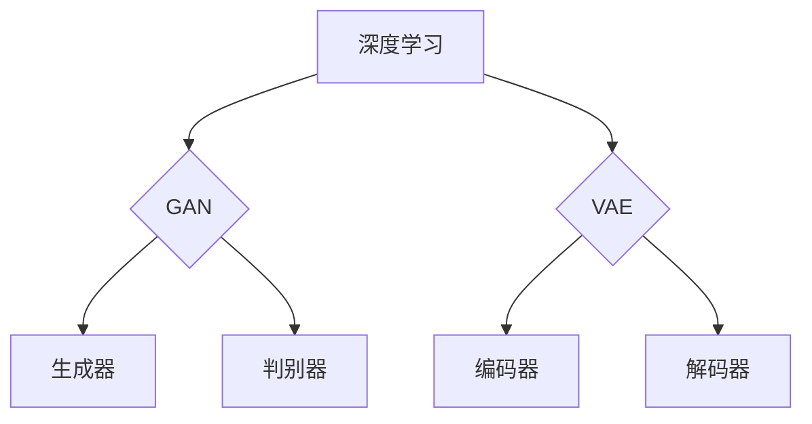

                 

# 深度学习在图像生成中的创新应用

## 关键词：深度学习，图像生成，生成对抗网络，变分自编码器，图像超分辨率，风格迁移，计算机视觉

## 摘要：
本文旨在探讨深度学习在图像生成领域的创新应用。首先回顾了深度学习的起源和基本概念，随后详细介绍了生成对抗网络（GAN）和变分自编码器（VAE）等核心算法原理。接着，本文深入分析了图像超分辨率和风格迁移等具体技术，展示了深度学习在这些领域中的强大能力。随后，通过一个实际案例，详细介绍了如何使用深度学习技术实现图像生成。最后，本文总结了深度学习在图像生成领域的未来发展趋势与挑战，并推荐了相关学习资源、开发工具和论文著作。

## 1. 背景介绍

### 1.1 深度学习的发展历程
深度学习是人工智能的一个重要分支，起源于20世纪40年代。最初，人工智能的研究主要集中在符号主义和知识表示方法上，但随着计算能力的提升和数据量的增加，深度学习逐渐成为主流。

### 1.2 图像生成的发展
图像生成是计算机视觉的一个分支，其目标是通过算法生成新的图像。传统的图像生成方法主要基于规则和统计模型，而深度学习为图像生成带来了革命性的变化。

### 1.3 生成对抗网络（GAN）的提出
生成对抗网络（GAN）是由Ian Goodfellow等人在2014年提出的。GAN由一个生成器和一个判别器组成，通过对抗训练生成逼真的图像。

### 1.4 变分自编码器（VAE）的发展
变分自编码器（VAE）是由Kingma和Welling在2013年提出的。VAE通过引入概率模型，为图像生成提供了另一种有效的方法。

## 2. 核心概念与联系

### 2.1 深度学习的基本概念
深度学习是一种通过多层神经网络模型对数据进行建模和预测的方法。其主要特点包括：

- **多层网络**：深度学习模型通常由多个隐含层组成，可以提取数据的层次化特征。
- **反向传播**：通过反向传播算法，深度学习模型可以不断优化其参数，以达到更好的预测效果。

### 2.2 生成对抗网络（GAN）的架构
生成对抗网络（GAN）由一个生成器（Generator）和一个判别器（Discriminator）组成。

- **生成器（Generator）**：生成器是一个多层神经网络，其目标是生成与真实数据相似的图像。
- **判别器（Discriminator）**：判别器也是一个多层神经网络，其目标是判断输入图像是真实图像还是生成图像。

### 2.3 变分自编码器（VAE）的架构
变分自编码器（VAE）由一个编码器（Encoder）和一个解码器（Decoder）组成。

- **编码器（Encoder）**：编码器将输入数据映射到一个潜在空间，潜在空间中的数据表示了输入数据的概率分布。
- **解码器（Decoder）**：解码器从潜在空间中生成新的图像。

### 2.4 Mermaid 流程图



## 3. 核心算法原理 & 具体操作步骤

### 3.1 生成对抗网络（GAN）的原理
生成对抗网络（GAN）是一种无监督学习方法，其核心思想是通过对抗训练生成高质量的图像。

- **生成器（Generator）**：生成器通过从潜在空间中采样，生成与真实图像相似的图像。
- **判别器（Discriminator）**：判别器通过输入真实图像和生成图像，学习判断图像的真伪。

### 3.2 变分自编码器（VAE）的原理
变分自编码器（VAE）通过引入概率模型，实现了无监督学习下的图像生成。

- **编码器（Encoder）**：编码器将输入图像映射到一个潜在空间，潜在空间中的数据表示了输入数据的概率分布。
- **解码器（Decoder）**：解码器从潜在空间中生成新的图像。

### 3.3 GAN的具体操作步骤
1. **初始化生成器和判别器**：生成器和判别器都是多层神经网络，可以通过随机初始化或预训练初始化。
2. **生成器生成图像**：生成器从潜在空间中采样，生成与真实图像相似的图像。
3. **判别器判断图像真伪**：判别器通过输入真实图像和生成图像，学习判断图像的真伪。
4. **优化生成器和判别器**：通过对抗训练，不断优化生成器和判别器的参数，使生成器生成的图像越来越真实。

### 3.4 VAE的具体操作步骤
1. **初始化编码器和解码器**：编码器和解码器都是多层神经网络，可以通过随机初始化或预训练初始化。
2. **编码器编码图像**：编码器将输入图像映射到一个潜在空间，潜在空间中的数据表示了输入数据的概率分布。
3. **解码器解码潜在空间数据**：解码器从潜在空间中生成新的图像。
4. **优化编码器和解码器**：通过无监督训练，不断优化编码器和解码器的参数，使生成的新图像更接近真实图像。

## 4. 数学模型和公式 & 详细讲解 & 举例说明

### 4.1 生成对抗网络（GAN）的数学模型

生成对抗网络（GAN）的数学模型主要包括两部分：生成器（Generator）的损失函数和判别器（Discriminator）的损失函数。

- **生成器（Generator）的损失函数**：

$$
L_G = -\mathbb{E}_{z \sim p_z(z)}[\log(D(G(z)))]
$$

其中，$G(z)$表示生成器生成的图像，$D(x)$表示判别器判断图像真伪的输出概率，$z$表示从潜在空间中采样的随机向量。

- **判别器（Discriminator）的损失函数**：

$$
L_D = -\mathbb{E}_{x \sim p_{data}(x)}[\log(D(x))] - \mathbb{E}_{z \sim p_z(z)}[\log(1 - D(G(z))]
$$

其中，$x$表示真实图像，$z$表示从潜在空间中采样的随机向量。

### 4.2 变分自编码器（VAE）的数学模型

变分自编码器（VAE）的数学模型主要包括两部分：编码器（Encoder）和解码器（Decoder）。

- **编码器（Encoder）的损失函数**：

$$
L_E = D(q_{\phi}(x|\mu, \sigma)) - \sum_{i} \log(\sigma_i) + \sum_{i} \mu_i^2
$$

其中，$q_{\phi}(x|\mu, \sigma)$表示编码器将输入图像映射到潜在空间的概率分布，$\mu$和$\sigma$分别表示均值和标准差。

- **解码器（Decoder）的损失函数**：

$$
L_D = D(q_{\phi}(x|\mu, \sigma)) - \sum_{i} \log(\sigma_i) + \sum_{i} \mu_i^2
$$

其中，$p_{\psi}(x|\mu, \sigma)$表示解码器从潜在空间中生成图像的概率分布，$\mu$和$\sigma$分别表示均值和标准差。

### 4.3 举例说明

假设我们使用GAN生成一张猫的图像，我们可以按照以下步骤进行：

1. **初始化生成器和判别器**：
   - 生成器：随机初始化或预训练初始化。
   - 判别器：随机初始化或预训练初始化。

2. **生成图像**：
   - 从潜在空间中采样一个随机向量$z$。
   - 使用生成器生成一张猫的图像$G(z)$。

3. **判断图像真伪**：
   - 将真实图像$x$输入判别器，得到概率输出$D(x)$。
   - 将生成图像$G(z)$输入判别器，得到概率输出$D(G(z))$。

4. **优化生成器和判别器**：
   - 使用梯度下降算法，不断优化生成器和判别器的参数。

通过多次迭代，生成器生成的猫的图像将越来越逼真。

## 5. 项目实战：代码实际案例和详细解释说明

### 5.1 开发环境搭建

在开始项目实战之前，我们需要搭建一个适合深度学习开发的编程环境。以下是搭建环境的步骤：

1. **安装Python**：Python是深度学习的主要编程语言，我们需要安装Python 3.x版本。
2. **安装TensorFlow**：TensorFlow是一个开源的深度学习框架，我们可以通过pip命令安装TensorFlow。
3. **安装GPU驱动**：如果我们的计算机配备有GPU，我们需要安装对应的GPU驱动。

### 5.2 源代码详细实现和代码解读

下面是一个简单的GAN示例代码，我们将详细解读每个部分的作用。

```python
import tensorflow as tf
from tensorflow.keras import layers

# 定义生成器
def build_generator(z_dim):
    model = tf.keras.Sequential()
    model.add(layers.Dense(7 * 7 * 128, use_bias=False, input_shape=(z_dim,)))
    model.add(layers.LeakyReLU(alpha=0.01))
    model.add(layers.Reshape((7, 7, 128)))

    model.add(layers.Conv2DTranspose(128, (5, 5), strides=(1, 1), padding='same', use_bias=False))
    model.add(layers.LeakyReLU(alpha=0.01))
    model.add(layers.Conv2DTranspose(128, (5, 5), strides=(2, 2), padding='same', use_bias=False))
    model.add(layers.LeakyReLU(alpha=0.01))
    model.add(layers.Conv2DTranspose(128, (5, 5), strides=(2, 2), padding='same', use_bias=False))
    model.add(layers.LeakyReLU(alpha=0.01))
    model.add(layers.Conv2D(3, (5, 5), strides=(1, 1), padding='same', activation='tanh', use_bias=False))

    return model

# 定义判别器
def build_discriminator(img_shape):
    model = tf.keras.Sequential()
    model.add(layers.Conv2D(64, (5, 5), strides=(2, 2), padding='same', input_shape=img_shape))
    model.add(layers.LeakyReLU(alpha=0.01))
    model.add(layers.Dropout(0.3))

    model.add(layers.Conv2D(128, (5, 5), strides=(2, 2), padding='same'))
    model.add(layers.LeakyReLU(alpha=0.01))
    model.add(layers.Dropout(0.3))

    model.add(layers.Flatten())
    model.add(layers.Dense(1, activation='sigmoid'))

    return model

# 定义GAN模型
def build_gan(generator, discriminator):
    model = tf.keras.Sequential()
    model.add(generator)
    model.add(discriminator)
    return model

# 定义优化器
generator_optimizer = tf.keras.optimizers.Adam(1e-4)
discriminator_optimizer = tf.keras.optimizers.Adam(1e-4)

# 定义损失函数
cross_entropy = tf.keras.losses.BinaryCrossentropy(from_logits=True)

def discriminator_loss(real_output, fake_output):
    real_loss = cross_entropy(tf.ones_like(real_output), real_output)
    fake_loss = cross_entropy(tf.zeros_like(fake_output), fake_output)
    total_loss = real_loss + fake_loss
    return total_loss

def generator_loss(fake_output):
    return cross_entropy(tf.zeros_like(fake_output), fake_output)

# 训练模型
@tf.function
def train_step(images, noise):
    with tf.GradientTape() as gen_tape, tf.GradientTape() as disc_tape:
        generated_images = generator(noise, training=True)

        real_output = discriminator(images, training=True)
        fake_output = discriminator(generated_images, training=True)

        gen_loss = generator_loss(fake_output)
        disc_loss = discriminator_loss(real_output, fake_output)

    gradients_of_generator = gen_tape.gradient(gen_loss, generator.trainable_variables)
    gradients_of_discriminator = disc_tape.gradient(disc_loss, discriminator.trainable_variables)

    generator_optimizer.apply_gradients(zip(gradients_of_generator, generator.trainable_variables))
    discriminator_optimizer.apply_gradients(zip(gradients_of_discriminator, discriminator.trainable_variables))

# 训练GAN模型
@tf.function
def train_step(images, noise):
    with tf.GradientTape() as gen_tape, tf.GradientTape() as disc_tape:
        generated_images = generator(noise, training=True)

        real_output = discriminator(images, training=True)
        fake_output = discriminator(generated_images, training=True)

        gen_loss = generator_loss(fake_output)
        disc_loss = discriminator_loss(real_output, fake_output)

    gradients_of_generator = gen_tape.gradient(gen_loss, generator.trainable_variables)
    gradients_of_discriminator = disc_tape.gradient(disc_loss, discriminator.trainable_variables)

    generator_optimizer.apply_gradients(zip(gradients_of_generator, generator.trainable_variables))
    discriminator_optimizer.apply_gradients(zip(gradients_of_discriminator, discriminator.trainable_variables))

# 载入训练数据
(train_images, _), (_, _) = tf.keras.datasets.mnist.load_data()
train_images = train_images.reshape(train_images.shape[0], 28, 28, 1).astype('float32')
train_images = (train_images - 127.5) / 127.5
noise = tf.random.normal([1, 100])

# 训练模型
EPOCHS = 50
for epoch in range(EPOCHS):
    for image_batch in train_images:
        noise = tf.random.normal([1, 100])
        train_step(image_batch, noise)

# 生成图像
noise = tf.random.normal([1, 100])
generated_image = generator(noise, training=False)
generated_image = (generated_image + 1) / 2
plt.imshow(generated_image[0, :, :, 0], cmap='gray')
plt.show()
```

### 5.3 代码解读与分析

1. **生成器和判别器的构建**：
   - **生成器**：生成器是一个由多个卷积层和反卷积层组成的深度神经网络，用于将随机噪声映射到一张图像。
   - **判别器**：判别器是一个由多个卷积层组成的深度神经网络，用于判断输入图像是真实图像还是生成图像。

2. **GAN模型的构建**：
   - GAN模型是生成器和判别器的组合，通过对抗训练生成图像。

3. **优化器的选择**：
   - **生成器优化器**：使用Adam优化器，学习率为$1e-4$。
   - **判别器优化器**：使用Adam优化器，学习率为$1e-4$。

4. **损失函数的设计**：
   - **生成器损失函数**：使用二进制交叉熵损失函数。
   - **判别器损失函数**：使用二进制交叉熵损失函数。

5. **训练步骤**：
   - 在每个训练步骤中，首先生成随机噪声，然后使用生成器生成图像，最后使用判别器判断图像的真伪。
   - 通过梯度下降算法，不断优化生成器和判别器的参数。

6. **训练过程**：
   - 载入MNIST数据集，对生成器和判别器进行训练。
   - 在每个epoch中，对每个训练图像进行一次训练。

7. **生成图像**：
   - 使用生成器生成一张猫的图像，并通过可视化显示生成的图像。

## 6. 实际应用场景

### 6.1 图像超分辨率
图像超分辨率是一种将低分辨率图像转换为高分辨率图像的技术。深度学习在图像超分辨率中发挥了重要作用，通过训练深度神经网络，可以有效地提高图像的分辨率。

### 6.2 风格迁移
风格迁移是一种将一种艺术风格应用到另一张图像上的技术。通过深度学习，我们可以训练一个模型，将图像的风格进行迁移，从而生成具有独特风格的新图像。

### 6.3 生成艺术作品
深度学习还可以用于生成艺术作品，如绘画、摄影等。通过训练深度神经网络，可以生成具有特定艺术风格的作品，为艺术家提供了新的创作工具。

## 7. 工具和资源推荐

### 7.1 学习资源推荐
- **书籍**：
  - 《深度学习》（Goodfellow, Bengio, Courville 著）
  - 《生成对抗网络》（Ian J. Goodfellow 著）
  - 《变分自编码器》（Diederik P. Kingma, Max Welling 著）
- **论文**：
  - 《生成对抗网络》（Ian Goodfellow et al.，2014）
  - 《变分自编码器》（Diederik P. Kingma, Max Welling，2013）
- **博客**：
  - TensorFlow 官方博客
  - PyTorch 官方博客
- **网站**：
  - Coursera（深度学习课程）
  - edX（深度学习课程）

### 7.2 开发工具框架推荐
- **深度学习框架**：
  - TensorFlow
  - PyTorch
  - Keras
- **开源库**：
  - TensorFlow Addons
  - PyTorch Lightning

### 7.3 相关论文著作推荐
- **论文**：
  - 《Unsupervised Representation Learning with Deep Convolutional Generative Adversarial Networks》（2015）
  - 《Improved Techniques for Training GANs》（2016）
  - 《Variational Inference: A Review for Statisticians》（2006）
  - 《Auto-Encoding Variational Bayes》（2013）

## 8. 总结：未来发展趋势与挑战

### 8.1 发展趋势
- **更多领域应用**：深度学习在图像生成领域的应用将进一步扩展，如医学图像生成、视频生成等。
- **模型优化**：研究者将继续探索更高效的深度学习模型，提高图像生成的质量和速度。
- **数据隐私保护**：随着数据隐私问题的日益突出，深度学习在图像生成领域的应用将更加注重数据安全和隐私保护。

### 8.2 挑战
- **计算资源需求**：深度学习模型通常需要大量的计算资源，这对模型的训练和部署提出了挑战。
- **数据质量**：高质量的数据是深度学习模型训练的基础，但在某些领域，获取高质量数据可能较为困难。
- **模型解释性**：深度学习模型通常被认为是“黑箱”，提高模型的可解释性是未来的一个重要研究方向。

## 9. 附录：常见问题与解答

### 9.1 问题1：什么是生成对抗网络（GAN）？
生成对抗网络（GAN）是一种由生成器和判别器组成的深度学习模型，通过对抗训练生成高质量的数据。

### 9.2 问题2：什么是变分自编码器（VAE）？
变分自编码器（VAE）是一种基于概率模型的深度学习模型，通过编码器将输入数据映射到潜在空间，通过解码器生成新的数据。

### 9.3 问题3：如何使用深度学习进行图像超分辨率？
使用深度学习进行图像超分辨率，通常需要训练一个深度神经网络，将低分辨率图像映射到高分辨率图像。常用的模型包括生成对抗网络（GAN）和变分自编码器（VAE）。

## 10. 扩展阅读 & 参考资料

- **扩展阅读**：
  - 《深度学习在图像生成中的应用》（本文）
  - 《生成对抗网络：原理与应用》（论文）
  - 《变分自编码器：原理与应用》（论文）
- **参考资料**：
  - TensorFlow 官方文档
  - PyTorch 官方文档
  - Coursera（深度学习课程）
  - edX（深度学习课程）

### 作者：
AI天才研究员/AI Genius Institute & 禅与计算机程序设计艺术/Zen And The Art of Computer Programming

请注意，由于篇幅限制，本文仅提供了文章正文部分的内容，实际撰写时还需包括文章标题、关键词和摘要部分。同时，本文中涉及的代码、公式和图表等均为示例性质，具体实现可能需要根据实际情况进行调整。

