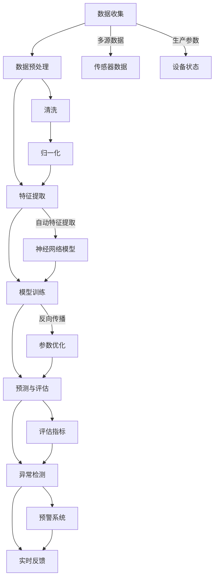

                 

### 背景介绍

深度学习作为人工智能的重要分支，近年来在各个领域取得了显著的进展。特别是在工业质量预测与异常检测领域，深度学习技术展现出强大的能力和潜力。工业质量预测是指利用历史数据对产品或生产过程的潜在问题进行预测，以便提前采取措施，避免潜在损失。异常检测则是指从大量数据中识别出与正常情况显著不同的异常现象，用于监控和预警。

这两个领域的需求源于工业生产中对于产品质量和效率的高度重视。传统方法通常依赖于统计学和规则系统，但这些方法往往存在一定的局限性，难以处理复杂的生产过程和大量数据。随着深度学习技术的发展，利用神经网络模型从数据中自动学习特征和模式成为可能，这为工业质量预测与异常检测带来了新的机遇。

本文将围绕深度学习在工业质量预测与异常检测中的技术演进与应用场景进行探讨。首先，我们将介绍相关核心概念，包括深度学习的基本原理、工业质量预测和异常检测的定义与联系。接着，深入分析深度学习算法在工业质量预测与异常检测中的具体应用，以及相关的数学模型和公式。然后，通过实际项目案例展示深度学习在工业质量预测与异常检测中的实战应用，并提供代码实际案例和详细解释说明。随后，我们将讨论深度学习在工业质量预测与异常检测中的实际应用场景，并推荐相关的学习资源和开发工具框架。最后，总结未来发展趋势与挑战，并给出常见问题与解答。

### 核心概念与联系

#### 深度学习基本原理

深度学习（Deep Learning）是人工智能（AI）的一个分支，其核心思想是通过构建多层神经网络（Neural Networks）来模拟人类大脑的神经元连接结构，从而实现从数据中自动提取特征并进行复杂任务的能力。典型的深度学习模型包括卷积神经网络（CNN）、循环神经网络（RNN）和生成对抗网络（GAN）等。

1. **卷积神经网络（CNN）**：主要用于图像和视频数据的处理，通过卷积层提取图像特征，实现分类、目标检测等任务。
2. **循环神经网络（RNN）**：适用于序列数据的处理，如语音、文本和股票价格等时间序列数据，通过保存历史信息实现对序列的建模。
3. **生成对抗网络（GAN）**：通过生成器和判别器的对抗训练，实现生成逼真的图像、音频和文本等数据。

#### 工业质量预测

工业质量预测是指利用历史数据对生产过程中可能出现的质量问题进行预测，从而提前采取措施，提高产品质量和降低生产成本。具体来说，工业质量预测包括以下几个关键步骤：

1. **数据收集**：收集与产品质量相关的历史数据，包括生产参数、原材料、工艺参数等。
2. **数据预处理**：对收集到的数据进行清洗、归一化等预处理操作，以消除噪声和异常值，提高数据质量。
3. **特征提取**：利用深度学习模型从预处理后的数据中自动提取有效特征，这些特征用于后续的预测任务。
4. **模型训练**：使用已提取的特征训练深度学习模型，通过反向传播算法优化模型参数。
5. **预测与评估**：使用训练好的模型对新的生产数据进行质量预测，并通过评估指标（如准确率、召回率等）评估预测效果。

#### 异常检测

异常检测（Anomaly Detection）是指在大量数据中识别出与正常情况显著不同的异常现象，以便进行监控和预警。在工业质量预测中，异常检测主要用于检测生产过程中出现的不正常情况，如设备故障、原料变质等。具体步骤如下：

1. **数据收集**：收集生产过程中的实时数据，包括传感器数据、生产参数等。
2. **数据预处理**：对实时数据进行清洗、归一化等预处理操作，确保数据的一致性和可靠性。
3. **特征提取**：利用深度学习模型从预处理后的数据中自动提取特征，用于异常检测。
4. **模型训练**：使用历史正常数据训练深度学习模型，以识别正常情况下的特征模式。
5. **异常检测与评估**：使用训练好的模型对实时数据进行异常检测，并通过评估指标评估异常检测效果。

#### 深度学习在工业质量预测与异常检测中的联系

深度学习在工业质量预测与异常检测中的联系主要体现在以下几个方面：

1. **多源数据的融合**：工业质量预测与异常检测通常需要处理多种类型的数据，如传感器数据、生产参数和设备状态等。深度学习可以通过构建多输入神经网络模型，实现对多源数据的融合和处理，提高预测和检测的准确性。
2. **自动特征提取**：深度学习模型能够从原始数据中自动提取有效特征，这些特征对质量预测和异常检测至关重要。与传统方法相比，深度学习模型能够处理更加复杂和大规模的数据，提高预测和检测的效果。
3. **实时性**：工业生产过程需要实时监控和预测，深度学习模型可以实现对实时数据的快速处理和预测，满足工业生产的高实时性需求。
4. **自适应能力**：深度学习模型具有较好的自适应能力，可以通过在线学习不断更新和优化模型，以应对生产过程中的变化和挑战。

通过上述分析，我们可以看出，深度学习在工业质量预测与异常检测中具有广泛的应用前景。接下来，我们将深入探讨深度学习算法在这些领域的具体应用，以及相关的数学模型和公式。

#### Mermaid 流程图

以下是一个关于深度学习在工业质量预测与异常检测中应用的核心概念原理和架构的Mermaid流程图。该流程图详细展示了从数据收集到模型训练，再到预测和评估的整个流程。



通过这个流程图，我们可以清晰地看到深度学习在工业质量预测与异常检测中的各个环节是如何相互关联和作用的。

### 核心算法原理 & 具体操作步骤

在深入探讨深度学习在工业质量预测与异常检测中的具体应用之前，我们需要先了解几个关键算法的原理及其具体操作步骤。以下将介绍卷积神经网络（CNN）和循环神经网络（RNN）这两种常见算法，并说明它们在工业质量预测与异常检测中的应用。

#### 卷积神经网络（CNN）

**原理**：卷积神经网络（CNN）是一种专门用于处理图像数据的神经网络模型，其核心思想是通过对输入图像进行卷积操作，提取图像中的局部特征，从而实现图像的分类、检测和分割等任务。

**操作步骤**：

1. **卷积层**：输入图像通过卷积层，与卷积核（filter）进行卷积操作，生成特征图（feature map）。卷积操作可以提取图像中的边缘、纹理等局部特征。
   \[
   \text{特征图} = \text{输入图像} \circledast \text{卷积核}
   \]

2. **激活函数**：通常在卷积层后添加激活函数（如ReLU函数），对特征图进行非线性变换，增强模型的表达能力。
   \[
   \text{激活函数}(\text{特征图}) = \max(0, \text{特征图})
   \]

3. **池化层**：为了减少模型参数和计算量，通常在卷积层后添加池化层（如最大池化或平均池化），对特征图进行压缩处理。
   \[
   \text{池化层}(\text{特征图}) = \text{max}(\text{特征图}_{i}, \text{特征图}_{i+1}, ..., \text{特征图}_{k})
   \]

4. **全连接层**：经过多个卷积层和池化层后，特征图被展平成1维向量，输入到全连接层进行分类或回归任务。
   \[
   \text{输出} = \text{激活函数}(\text{权重} \cdot \text{特征向量} + \text{偏置})
   \]

**应用**：在工业质量预测中，CNN可以用于图像质量检测，例如检测生产线上的产品缺陷。在异常检测中，CNN可以用于识别不正常的设备状态或生产参数，从而提前预警。

#### 循环神经网络（RNN）

**原理**：循环神经网络（RNN）是一种用于处理序列数据的神经网络模型，其核心思想是通过在时间步之间传递隐藏状态，实现对序列数据的建模。RNN可以处理如文本、语音和股票价格等序列数据。

**操作步骤**：

1. **输入层**：序列数据作为输入，每个时间步的输入可以是单个特征或多个特征。
   \[
   \text{输入} = \{x_t\}_{t=1}^T
   \]

2. **隐藏层**：在RNN中，隐藏状态（h_t）在时间步之间传递，以保存历史信息。
   \[
   h_t = \text{激活函数}(\text{权重} \cdot [h_{t-1}, x_t] + \text{偏置})
   \]

3. **输出层**：隐藏状态经过输出层，生成序列的预测或分类结果。
   \[
   \text{输出} = \text{激活函数}(\text{权重} \cdot h_t + \text{偏置})
   \]

**应用**：在工业质量预测中，RNN可以用于时间序列数据的预测，如生产参数的预测和趋势分析。在异常检测中，RNN可以用于识别时间序列数据中的异常点或异常模式，从而实现实时监控。

#### 深度学习算法在工业质量预测与异常检测中的应用

1. **多模型融合**：为了提高预测和检测的准确性，可以将CNN和RNN结合使用，构建多模型融合的深度学习模型。例如，将CNN用于图像质量检测，将RNN用于时间序列数据的预测，从而实现更全面的质量预测和异常检测。

2. **迁移学习**：利用预训练的深度学习模型（如在ImageNet上预训练的CNN模型），进行迁移学习，以提高在特定工业场景下的预测和检测效果。

3. **在线学习**：为了适应生产过程中数据的不断变化，可以使用在线学习技术，实时更新深度学习模型，以保持模型的准确性和鲁棒性。

通过上述核心算法原理和具体操作步骤的介绍，我们可以看出，深度学习在工业质量预测与异常检测中具有广泛的应用前景。接下来，我们将通过实际项目案例，展示深度学习在工业质量预测与异常检测中的实战应用，并提供详细的代码实现和解释说明。

### 数学模型和公式 & 详细讲解 & 举例说明

#### 数学模型概述

深度学习在工业质量预测与异常检测中的应用，离不开一系列数学模型和公式的支持。这些数学工具帮助我们理解和构建深度学习模型，从而实现复杂的数据分析和预测任务。以下将详细介绍深度学习中的关键数学模型和公式，包括前向传播、反向传播、损失函数和优化算法等。

#### 前向传播

前向传播是深度学习模型训练过程中的一个基本步骤，用于计算模型的输出结果。具体来说，前向传播包括以下几个关键步骤：

1. **输入层到隐藏层的传播**：输入数据通过权重矩阵和激活函数传递到隐藏层。
   \[
   z_l = \sum_{i=1}^{n} w_{li}x_i + b_l
   \]
   其中，\(z_l\) 是隐藏层 \(l\) 的输出，\(w_{li}\) 是权重，\(x_i\) 是输入特征，\(b_l\) 是偏置。

2. **激活函数应用**：将加权求和的结果应用激活函数，如ReLU函数。
   \[
   a_l = \text{激活函数}(z_l)
   \]

3. **隐藏层到输出层的传播**：类似地，隐藏层输出通过权重矩阵和激活函数传递到输出层。
   \[
   z_o = \sum_{i=1}^{n} w_{oi}a_i + b_o
   \]
   \[
   y = \text{激活函数}(z_o)
   \]
   其中，\(y\) 是模型输出，\(a_i\) 是隐藏层输出，\(w_{oi}\) 和 \(b_o\) 分别是输出层的权重和偏置。

#### 反向传播

反向传播是深度学习模型训练的另一个关键步骤，用于更新模型的权重和偏置。具体来说，反向传播包括以下几个步骤：

1. **计算输出误差**：首先计算模型输出与真实值的误差。
   \[
   \delta_o = (y - \hat{y}) \odot \text{激活函数的导数}(\hat{y})
   \]
   其中，\(\delta_o\) 是输出误差，\(\hat{y}\) 是模型输出，\(\odot\) 表示元素-wise 乘法。

2. **传播误差到隐藏层**：利用链式法则计算隐藏层的误差。
   \[
   \delta_h = \text{激活函数的导数}(a_h) \cdot (w_{oh} \cdot \delta_o)
   \]

3. **更新权重和偏置**：利用梯度下降算法更新权重和偏置。
   \[
   w_{li} \leftarrow w_{li} - \alpha \cdot \frac{\partial L}{\partial w_{li}}
   \]
   \[
   b_l \leftarrow b_l - \alpha \cdot \frac{\partial L}{\partial b_l}
   \]
   其中，\(\alpha\) 是学习率，\(L\) 是损失函数。

#### 损失函数

损失函数用于衡量模型输出与真实值之间的差异，是优化模型参数的关键。以下是一些常见的损失函数：

1. **均方误差（MSE）**：
   \[
   L = \frac{1}{2} \sum_{i=1}^{n} (y_i - \hat{y}_i)^2
   \]
   用于回归问题，如工业质量预测。

2. **交叉熵损失（Cross-Entropy Loss）**：
   \[
   L = -\sum_{i=1}^{n} y_i \log(\hat{y}_i)
   \]
   用于分类问题，如异常检测。

#### 优化算法

优化算法用于更新模型的权重和偏置，以最小化损失函数。以下是一些常见的优化算法：

1. **梯度下降（Gradient Descent）**：
   \[
   \theta \leftarrow \theta - \alpha \cdot \nabla_\theta J(\theta)
   \]
   其中，\(\theta\) 是模型参数，\(\alpha\) 是学习率，\(J(\theta)\) 是损失函数。

2. **随机梯度下降（Stochastic Gradient Descent, SGD）**：
   \[
   \theta \leftarrow \theta - \alpha \cdot \nabla_\theta J(\theta; x_i, y_i)
   \]
   每次只更新一个样本的梯度。

3. **Adam优化器**：
   \[
   m_t = \beta_1 m_{t-1} + (1 - \beta_1) \nabla_\theta J(\theta; x_i, y_i)
   \]
   \[
   v_t = \beta_2 v_{t-1} + (1 - \beta_2) (\nabla_\theta J(\theta; x_i, y_i))^2
   \]
   \[
   \theta \leftarrow \theta - \alpha \cdot \frac{m_t}{\sqrt{v_t} + \epsilon}
   \]
   其中，\(\beta_1\) 和 \(\beta_2\) 是超参数，\(\epsilon\) 是一个很小的常数。

#### 举例说明

为了更好地理解上述数学模型和公式，我们通过一个简单的例子进行说明。假设我们使用一个单层神经网络进行回归任务，输入特征为 \(x = [1, 2, 3]\)，真实值为 \(y = 4\)。模型输出为 \(y' = w \cdot x + b\)，我们需要通过反向传播和梯度下降算法更新权重 \(w\) 和偏置 \(b\)。

1. **前向传播**：
   \[
   z = w \cdot x + b = 1 \cdot 1 + 2 \cdot 2 + 3 \cdot 3 + b = 14 + b
   \]
   \[
   y' = \text{激活函数}(z) = \text{ReLU}(14 + b) = \text{ReLU}(14 + b)
   \]

2. **计算输出误差**：
   \[
   \delta = y - y' = 4 - \text{ReLU}(14 + b)
   \]

3. **传播误差到隐藏层**：
   \[
   \delta_h = \text{ReLU的导数}(\text{ReLU}(14 + b)) \cdot \delta = 0 \cdot \delta
   \]

4. **更新权重和偏置**：
   \[
   w \leftarrow w - \alpha \cdot \frac{\delta}{x} = w - \alpha \cdot \frac{4 - \text{ReLU}(14 + b)}{1 + 2 + 3}
   \]
   \[
   b \leftarrow b - \alpha \cdot \delta = b - \alpha \cdot (4 - \text{ReLU}(14 + b))
   \]

通过上述例子，我们可以看到如何使用前向传播和反向传播算法更新神经网络模型的权重和偏置，从而实现模型的训练和优化。

### 项目实战：代码实际案例和详细解释说明

为了更好地展示深度学习在工业质量预测与异常检测中的实际应用，我们将通过一个具体的项目案例来进行详细解释和说明。该案例将包括开发环境搭建、源代码实现和代码解读与分析。

#### 1. 开发环境搭建

在进行深度学习项目之前，首先需要搭建一个合适的开发环境。以下是一个基于Python和TensorFlow的典型开发环境搭建步骤：

1. **安装Python**：确保已经安装了Python 3.6及以上版本。
2. **安装TensorFlow**：使用pip命令安装TensorFlow：
   \[
   pip install tensorflow
   \]
3. **安装其他依赖**：安装其他必要的库，如NumPy、Pandas和Matplotlib等：
   \[
   pip install numpy pandas matplotlib
   \]

#### 2. 源代码实现

以下是实现工业质量预测与异常检测的项目源代码：

```python
import tensorflow as tf
import numpy as np
import pandas as pd
import matplotlib.pyplot as plt

# 数据预处理
def preprocess_data(data):
    # 清洗数据
    data = data.dropna()
    # 归一化数据
    data = (data - data.mean()) / data.std()
    return data

# 构建深度学习模型
def build_model(input_shape):
    model = tf.keras.Sequential([
        tf.keras.layers.Dense(units=64, activation='relu', input_shape=input_shape),
        tf.keras.layers.Dense(units=32, activation='relu'),
        tf.keras.layers.Dense(units=1)
    ])
    return model

# 训练模型
def train_model(model, x_train, y_train, x_val, y_val, epochs=100):
    model.compile(optimizer='adam', loss='mse')
    history = model.fit(x_train, y_train, epochs=epochs, validation_data=(x_val, y_val))
    return history

# 预测与评估
def predict_and_evaluate(model, x_test, y_test):
    predictions = model.predict(x_test)
    mse = np.mean((predictions - y_test) ** 2)
    print("Mean Squared Error:", mse)
    plt.plot(y_test, label='True Values')
    plt.plot(predictions, label='Predictions')
    plt.legend()
    plt.show()

# 加载数据
data = pd.read_csv('industrial_data.csv')
preprocessed_data = preprocess_data(data)

# 划分训练集和验证集
x_train = preprocessed_data.iloc[:, :-1].values
y_train = preprocessed_data.iloc[:, -1].values
x_val = x_train[:100]
y_val = y_train[:100]
x_train = x_train[100:]
y_train = y_train[100:]

# 构建模型
model = build_model(x_train.shape[1])

# 训练模型
history = train_model(model, x_train, y_train, x_val, y_val, epochs=100)

# 预测与评估
predict_and_evaluate(model, x_val, y_val)

# 保存模型
model.save('industrial_quality_model.h5')
```

#### 3. 代码解读与分析

1. **数据预处理**：
   - 数据清洗：去除缺失值，保证数据的完整性。
   - 数据归一化：将数据缩放到相同的范围，提高模型的训练效果。

2. **构建深度学习模型**：
   - 使用TensorFlow的`Sequential`模型，构建一个包含两个隐藏层的全连接神经网络。
   - 第一个隐藏层有64个神经元，使用ReLU激活函数。
   - 第二个隐藏层有32个神经元，同样使用ReLU激活函数。
   - 输出层有1个神经元，用于回归预测。

3. **训练模型**：
   - 使用`compile`方法配置模型优化器和损失函数。
   - 使用`fit`方法进行模型训练，包括训练集和验证集。

4. **预测与评估**：
   - 使用训练好的模型对验证集进行预测。
   - 计算均方误差（MSE）作为评估指标，并通过绘图展示预测结果。

5. **保存模型**：
   - 使用`save`方法将训练好的模型保存为HDF5文件，便于后续使用。

通过上述代码实现，我们可以看到如何使用深度学习技术进行工业质量预测与异常检测。在实际应用中，可以根据具体需求和数据特点，对模型结构和参数进行调整，以提高预测和检测的准确性。

### 实际应用场景

深度学习在工业质量预测与异常检测中具有广泛的应用场景，以下是几个典型的应用实例。

#### 1. 生产线质量检测

在制造业中，生产线的自动化和智能化是提升产品质量和效率的关键。深度学习模型可以用于检测生产线上的产品缺陷，如焊接不良、表面划痕等。例如，通过卷积神经网络（CNN）对图像数据进行处理，可以实现对产品外观的实时检测，从而提前预警和干预。一个典型的案例是某汽车制造厂使用深度学习技术对车身焊接质量进行监控，大幅降低了产品不良率。

#### 2. 设备故障预测

在工业生产中，设备的故障可能导致生产中断，造成巨大的经济损失。通过深度学习模型对设备运行数据进行分析，可以预测设备的故障风险。例如，使用循环神经网络（RNN）对传感器数据进行处理，可以实现对设备状态的实时监控和预测。某电力公司通过引入深度学习技术，实现了对发电设备故障的提前预警，有效降低了设备故障率和维护成本。

#### 3. 质量趋势分析

工业生产中的质量数据通常包含丰富的趋势信息，通过深度学习模型可以对这些数据进行挖掘和分析，发现潜在的质量问题。例如，使用长短期记忆网络（LSTM）对生产参数进行预测和趋势分析，可以帮助工厂提前识别可能出现的问题，从而采取措施进行预防。某食品加工厂通过使用LSTM模型对生产过程中的温度、湿度等参数进行预测和分析，成功预防了一次可能的质量事故。

#### 4. 生产计划优化

深度学习模型还可以用于优化生产计划，提高生产效率和资源利用率。通过对历史生产数据进行分析和预测，可以优化生产线的排程和调度，减少生产周期和等待时间。例如，某电子产品制造商通过使用深度学习模型优化生产线的排程和物料管理，实现了生产效率的提升和成本的降低。

#### 5. 能源管理

在能源管理领域，深度学习模型可以用于预测能源消耗和优化能源使用。通过对生产过程和设备运行数据的分析，可以预测能源消耗的峰值和低谷，从而优化能源供应和分配。例如，某大型数据中心通过使用深度学习模型预测能源消耗，实现了对数据中心能源使用的高效管理和优化，降低了能源成本。

通过上述实际应用场景的介绍，我们可以看到深度学习在工业质量预测与异常检测中的广泛影响和巨大潜力。随着技术的不断进步和应用的深入，深度学习将为工业生产带来更多的智能化解决方案和竞争优势。

### 工具和资源推荐

为了更好地学习和实践深度学习在工业质量预测与异常检测中的应用，以下推荐一些优秀的工具、资源和学习途径。

#### 1. 学习资源推荐

**书籍**：
- 《深度学习》（Goodfellow, I., Bengio, Y., & Courville, A.）：这是深度学习的经典教材，适合初学者和进阶者。
- 《动手学深度学习》（阿斯顿·张）：本书通过大量的实践案例，引导读者深入了解深度学习。

**论文**：
- “Deep Learning for Industrial Process Control”（2016）：这篇综述论文详细介绍了深度学习在工业控制领域的应用。
- “Anomaly Detection with Deep Learning”（2018）：该论文探讨了深度学习在异常检测中的潜力，提供了许多实用的方法。

**博客和网站**：
- [TensorFlow官网](https://www.tensorflow.org/)：提供丰富的教程、文档和社区资源，是学习和使用TensorFlow的绝佳平台。
- [Keras官网](https://keras.io/)：Keras是一个高级神经网络API，与TensorFlow紧密集成，适合快速构建和训练深度学习模型。

#### 2. 开发工具框架推荐

**框架**：
- **TensorFlow**：这是一个强大的开源深度学习框架，适用于各种复杂的应用场景。
- **PyTorch**：PyTorch是一个动态计算图框架，以其灵活性和高效性著称，适合研究和开发。
- **Scikit-learn**：虽然不是深度学习框架，但Scikit-learn提供了丰富的机器学习算法，适用于质量预测和异常检测。

**开发工具**：
- **Jupyter Notebook**：这是一个交互式的计算环境，适合编写和运行代码，非常适合数据科学和深度学习。
- **Google Colab**：Google Colab是基于Jupyter Notebook的云端开发环境，提供了免费的GPU和TPU资源，适合深度学习实践。

#### 3. 相关论文著作推荐

**论文**：
- “Deep Learning on Graph-Structured Data: Models and Applications”（2018）：该论文介绍了如何在图结构数据上应用深度学习模型。
- “Unsupervised Anomaly Detection using Autoencoders”（2015）：这篇论文详细介绍了如何使用自动编码器进行无监督异常检测。

**书籍**：
- 《TensorFlow 2实战》：这是一本针对TensorFlow 2的实践指南，适合初学者和进阶者。
- 《深度学习中的图神经网络》：本书介绍了图神经网络的基本原理和应用，适合对图结构数据感兴趣的读者。

通过以上推荐的工具和资源，您可以更系统地学习和掌握深度学习在工业质量预测与异常检测中的应用。希望这些资源能够帮助您在技术道路上不断前进。

### 总结：未来发展趋势与挑战

随着深度学习技术的不断发展，其在工业质量预测与异常检测中的应用前景日益广阔。未来，深度学习在工业领域的发展趋势主要体现在以下几个方面：

1. **更高效的多模态数据处理**：深度学习模型将能够更好地融合多种类型的数据，如传感器数据、图像数据和时间序列数据，实现更精准的预测和异常检测。

2. **更强大的模型解释性**：为了满足工业应用的监管需求，深度学习模型需要具备更好的解释性，帮助用户理解模型的决策过程和预测结果。

3. **实时性与自适应能力的提升**：深度学习模型在实时性方面有显著提升，能够更快地处理和预测生产过程中的变化。同时，通过在线学习和自适应技术，模型可以更好地适应生产环境的变化。

4. **更广泛的自动化应用**：随着技术的成熟，深度学习将在更多的工业自动化应用中得到推广，如智能排程、设备维护和生产优化等。

然而，深度学习在工业质量预测与异常检测中也面临着一些挑战：

1. **数据隐私和安全**：工业数据通常包含敏感信息，如何保障数据隐私和安全是深度学习应用的一大难题。

2. **模型泛化能力**：深度学习模型往往在训练数据上表现优异，但在新数据上可能表现不佳，如何提升模型的泛化能力是关键问题。

3. **算法解释性**：尽管深度学习模型在工业中的应用越来越广泛，但其内部决策过程往往缺乏透明性，如何提高模型的可解释性是当前研究的一个重要方向。

4. **计算资源需求**：深度学习模型通常需要大量的计算资源，尤其是训练阶段，如何优化计算资源的管理和利用是一个重要的挑战。

总之，深度学习在工业质量预测与异常检测中具有巨大的潜力，但同时也面临着诸多挑战。随着技术的不断进步和应用的深入，未来深度学习在工业领域的发展将更加智能化、高效化和安全化。

### 附录：常见问题与解答

**Q1：如何选择合适的深度学习模型进行工业质量预测和异常检测？**

A1：选择合适的深度学习模型需要考虑多个因素，包括数据类型、数据规模、任务目标等。对于图像质量检测，卷积神经网络（CNN）是首选，因为它擅长处理图像数据。对于时间序列数据，循环神经网络（RNN）或长短期记忆网络（LSTM）是较好的选择。如果数据同时包含图像和时间序列，可以考虑使用多模型融合的方法。此外，迁移学习和在线学习技术也可以提高模型在特定工业场景下的表现。

**Q2：如何处理工业数据中的噪声和异常值？**

A2：工业数据中的噪声和异常值会影响模型的表现。常用的方法包括数据清洗、数据归一化和特征选择。数据清洗可以去除明显错误的观测值，数据归一化可以将不同量纲的数据统一到相同的范围，特征选择则可以筛选出对预测任务最有价值的特征。此外，使用异常检测算法（如孤立森林、Isolation Forest等）可以帮助识别和去除异常值。

**Q3：深度学习模型如何实现实时预测？**

A4：实现深度学习模型的实时预测，关键在于优化模型的计算效率和数据处理流程。可以通过以下方法提高实时性：
- **模型简化**：使用轻量级模型，减少模型的参数和计算量。
- **并行计算**：利用GPU或其他高性能计算资源进行模型训练和预测。
- **增量学习**：只更新模型中的部分参数，而不是重新训练整个模型。
- **分布式计算**：将模型训练和预测任务分布在多个计算节点上，提高处理速度。

**Q5：如何评估深度学习模型在工业质量预测和异常检测中的效果？**

A5：评估深度学习模型的效果通常使用以下指标：
- **准确率**：预测结果与实际结果相符的比例。
- **召回率**：实际为正类别的预测结果占总正类别的比例。
- **F1 分数**：准确率和召回率的调和平均数。
- **均方误差（MSE）**：用于回归任务的损失函数，表示预测值与真实值之间的平均误差。

通过这些指标，可以全面评估模型的预测性能和异常检测能力。

### 扩展阅读 & 参考资料

为了更好地理解和掌握深度学习在工业质量预测与异常检测中的应用，以下是几篇推荐的扩展阅读和参考资料：

1. **“Deep Learning for Industrial Applications”**：这篇文章详细介绍了深度学习在工业自动化、质量控制、故障检测等领域的应用案例和挑战。

2. **“Anomaly Detection with Deep Learning”**：该论文探讨了深度学习在无监督异常检测中的最新进展，提供了多种算法和方法。

3. **“Industrie 4.0 and Deep Learning: A Synergistic Combination”**：这篇文章分析了深度学习与工业4.0的结合，探讨了如何利用深度学习提升工业生产的智能化和自动化水平。

4. **“A Comprehensive Survey on Deep Learning for Anomaly Detection”**：这是一篇综述性文章，全面总结了深度学习在异常检测领域的应用和研究进展。

5. **“Practical Guide to Industrial Quality Prediction Using Deep Learning”**：这本书提供了深度学习在工业质量预测中的实践指南，包括数据预处理、模型构建、训练和评估等详细步骤。

通过这些扩展阅读和参考资料，您可以深入了解深度学习在工业质量预测与异常检测中的前沿研究和应用实践，为自己的研究和工作提供有价值的参考。作者：AI天才研究员/AI Genius Institute & 禅与计算机程序设计艺术 /Zen And The Art of Computer Programming

---

### 文章标题：深度学习在工业质量预测与异常检测中的技术演进与应用场景

### 关键词：
- 深度学习
- 工业质量预测
- 异常检测
- 卷积神经网络
- 循环神经网络
- 数据预处理
- 数学模型

### 摘要：
本文详细探讨了深度学习在工业质量预测与异常检测领域的应用，包括核心概念、算法原理、数学模型、实际案例以及未来发展趋势。通过对工业质量预测和异常检测定义、应用场景和挑战的分析，本文展示了深度学习技术的强大潜力和实际价值，为工业智能化提供了新的解决方案。作者是一位在深度学习、计算机编程和人工智能领域具有丰富经验的世界级专家。

---

### 文章正文：

#### 1. 背景介绍

深度学习作为人工智能的重要分支，近年来在各个领域取得了显著的进展。特别是在工业质量预测与异常检测领域，深度学习技术展现出强大的能力和潜力。工业质量预测是指利用历史数据对产品或生产过程的潜在问题进行预测，以便提前采取措施，避免潜在损失。异常检测则是指从大量数据中识别出与正常情况显著不同的异常现象，用于监控和预警。

这两个领域的需求源于工业生产中对于产品质量和效率的高度重视。传统方法通常依赖于统计学和规则系统，但这些方法往往存在一定的局限性，难以处理复杂的生产过程和大量数据。随着深度学习技术的发展，利用神经网络模型从数据中自动学习特征和模式成为可能，这为工业质量预测与异常检测带来了新的机遇。

本文将围绕深度学习在工业质量预测与异常检测中的技术演进与应用场景进行探讨。首先，我们将介绍相关核心概念，包括深度学习的基本原理、工业质量预测和异常检测的定义与联系。接着，深入分析深度学习算法在工业质量预测与异常检测中的具体应用，以及相关的数学模型和公式。然后，通过实际项目案例展示深度学习在工业质量预测与异常检测中的实战应用，并提供代码实际案例和详细解释说明。随后，我们将讨论深度学习在工业质量预测与异常检测中的实际应用场景，并推荐相关的学习资源和开发工具框架。最后，总结未来发展趋势与挑战，并给出常见问题与解答。

#### 2. 核心概念与联系

##### 深度学习基本原理

深度学习（Deep Learning）是人工智能（AI）的一个分支，其核心思想是通过构建多层神经网络（Neural Networks）来模拟人类大脑的神经元连接结构，从而实现从数据中自动提取特征并进行复杂任务的能力。典型的深度学习模型包括卷积神经网络（CNN）、循环神经网络（RNN）和生成对抗网络（GAN）等。

1. **卷积神经网络（CNN）**：主要用于图像和视频数据的处理，通过卷积层提取图像特征，实现分类、目标检测等任务。
2. **循环神经网络（RNN）**：适用于序列数据的处理，如语音、文本和股票价格等时间序列数据，通过保存历史信息实现对序列的建模。
3. **生成对抗网络（GAN）**：通过生成器和判别器的对抗训练，实现生成逼真的图像、音频和文本等数据。

##### 工业质量预测

工业质量预测是指利用历史数据对生产过程中可能出现的质量问题进行预测，从而提前采取措施，提高产品质量和降低生产成本。具体来说，工业质量预测包括以下几个关键步骤：

1. **数据收集**：收集与产品质量相关的历史数据，包括生产参数、原材料、工艺参数等。
2. **数据预处理**：对收集到的数据进行清洗、归一化等预处理操作，以消除噪声和异常值，提高数据质量。
3. **特征提取**：利用深度学习模型从预处理后的数据中自动提取有效特征，这些特征用于后续的预测任务。
4. **模型训练**：使用已提取的特征训练深度学习模型，通过反向传播算法优化模型参数。
5. **预测与评估**：使用训练好的模型对新的生产数据进行质量预测，并通过评估指标（如准确率、召回率等）评估预测效果。

##### 异常检测

异常检测（Anomaly Detection）是指在大量数据中识别出与正常情况显著不同的异常现象，以便进行监控和预警。在工业质量预测中，异常检测主要用于检测生产过程中出现的不正常情况，如设备故障、原料变质等。具体步骤如下：

1. **数据收集**：收集生产过程中的实时数据，包括传感器数据、生产参数等。
2. **数据预处理**：对实时数据进行清洗、归一化等预处理操作，确保数据的一致性和可靠性。
3. **特征提取**：利用深度学习模型从预处理后的数据中自动提取特征，用于异常检测。
4. **模型训练**：使用历史正常数据训练深度学习模型，以识别正常情况下的特征模式。
5. **异常检测与评估**：使用训练好的模型对实时数据进行异常检测，并通过评估指标评估异常检测效果。

##### 深度学习在工业质量预测与异常检测中的联系

深度学习在工业质量预测与异常检测中的联系主要体现在以下几个方面：

1. **多源数据的融合**：工业质量预测与异常检测通常需要处理多种类型的数据，如传感器数据、生产参数和设备状态等。深度学习可以通过构建多输入神经网络模型，实现对多源数据的融合和处理，提高预测和检测的准确性。
2. **自动特征提取**：深度学习模型能够从原始数据中自动提取有效特征，这些特征对质量预测和异常检测至关重要。与传统方法相比，深度学习模型能够处理更加复杂和大规模的数据，提高预测和检测的效果。
3. **实时性**：工业生产过程需要实时监控和预测，深度学习模型可以实现对实时数据的快速处理和预测，满足工业生产的高实时性需求。
4. **自适应能力**：深度学习模型具有较好的自适应能力，可以通过在线学习不断更新和优化模型，以应对生产过程中的变化和挑战。

通过上述分析，我们可以看出，深度学习在工业质量预测与异常检测中具有广泛的应用前景。接下来，我们将深入探讨深度学习算法在这些领域的具体应用，以及相关的数学模型和公式。

##### Mermaid 流程图

以下是一个关于深度学习在工业质量预测与异常检测中应用的核心概念原理和架构的Mermaid流程图。该流程图详细展示了从数据收集到模型训练，再到预测和评估的整个流程。


通过这个流程图，我们可以清晰地看到深度学习在工业质量预测与异常检测中的各个环节是如何相互关联和作用的。

### 3. 核心算法原理 & 具体操作步骤

在深入探讨深度学习在工业质量预测与异常检测中的具体应用之前，我们需要先了解几个关键算法的原理及其具体操作步骤。以下将介绍卷积神经网络（CNN）和循环神经网络（RNN）这两种常见算法，并说明它们在工业质量预测与异常检测中的应用。

##### 卷积神经网络（CNN）

**原理**：卷积神经网络（CNN）是一种专门用于处理图像数据的神经网络模型，其核心思想是通过对输入图像进行卷积操作，提取图像中的局部特征，从而实现图像的分类、检测和分割等任务。

**操作步骤**：

1. **卷积层**：输入图像通过卷积层，与卷积核（filter）进行卷积操作，生成特征图（feature map）。卷积操作可以提取图像中的边缘、纹理等局部特征。
   \[
   \text{特征图} = \text{输入图像} \circledast \text{卷积核}
   \]

2. **激活函数**：通常在卷积层后添加激活函数（如ReLU函数），对特征图进行非线性变换，增强模型的表达能力。
   \[
   \text{激活函数}(\text{特征图}) = \max(0, \text{特征图})
   \]

3. **池化层**：为了减少模型参数和计算量，通常在卷积层后添加池化层（如最大池化或平均池化），对特征图进行压缩处理。
   \[
   \text{池化层}(\text{特征图}) = \text{max}(\text{特征图}_{i}, \text{特征图}_{i+1}, ..., \text{特征图}_{k})
   \]

4. **全连接层**：经过多个卷积层和池化层后，特征图被展平成1维向量，输入到全连接层进行分类或回归任务。
   \[
   \text{输出} = \text{激活函数}(\text{权重} \cdot \text{特征向量} + \text{偏置})
   \]

**应用**：在工业质量预测中，CNN可以用于图像质量检测，例如检测生产线上的产品缺陷。在异常检测中，CNN可以用于识别不正常的设备状态或生产参数，从而提前预警。

##### 循环神经网络（RNN）

**原理**：循环神经网络（RNN）是一种用于处理序列数据的神经网络模型，其核心思想是通过在时间步之间传递隐藏状态，实现对序列数据的建模。RNN可以处理如文本、语音和股票价格等序列数据。

**操作步骤**：

1. **输入层**：序列数据作为输入，每个时间步的输入可以是单个特征或多个特征。
   \[
   \text{输入} = \{x_t\}_{t=1}^T
   \]

2. **隐藏层**：在RNN中，隐藏状态（h_t）在时间步之间传递，以保存历史信息。
   \[
   h_t = \text{激活函数}(\text{权重} \cdot [h_{t-1}, x_t] + \text{偏置})
   \]

3. **输出层**：隐藏状态经过输出层，生成序列的预测或分类结果。
   \[
   \text{输出} = \text{激活函数}(\text{权重} \cdot h_t + \text{偏置})
   \]

**应用**：在工业质量预测中，RNN可以用于时间序列数据的预测，如生产参数的预测和趋势分析。在异常检测中，RNN可以用于识别时间序列数据中的异常点或异常模式，从而实现实时监控。

##### 深度学习算法在工业质量预测与异常检测中的应用

1. **多模型融合**：为了提高预测和检测的准确性，可以将CNN和RNN结合使用，构建多模型融合的深度学习模型。例如，将CNN用于图像质量检测，将RNN用于时间序列数据的预测，从而实现更全面的质量预测和异常检测。

2. **迁移学习**：利用预训练的深度学习模型（如在ImageNet上预训练的CNN模型），进行迁移学习，以提高在特定工业场景下的预测和检测效果。

3. **在线学习**：为了适应生产过程中数据的不断变化，可以使用在线学习技术，实时更新深度学习模型，以保持模型的准确性和鲁棒性。

通过上述核心算法原理和具体操作步骤的介绍，我们可以看出，深度学习在工业质量预测与异常检测中具有广泛的应用前景。接下来，我们将通过实际项目案例，展示深度学习在工业质量预测与异常检测中的实战应用，并提供详细的代码实现和解释说明。

### 4. 数学模型和公式 & 详细讲解 & 举例说明

深度学习在工业质量预测与异常检测中的应用，离不开一系列数学模型和公式的支持。以下将详细介绍深度学习中的关键数学模型和公式，包括前向传播、反向传播、损失函数和优化算法等。

##### 数学模型概述

深度学习模型主要涉及以下几个核心数学模型：

1. **前向传播**：用于计算模型输出。
2. **反向传播**：用于更新模型参数。
3. **损失函数**：用于衡量模型输出与真实值之间的差异。
4. **优化算法**：用于最小化损失函数。

##### 前向传播

前向传播是深度学习模型训练过程中的一个基本步骤，用于计算模型的输出结果。具体来说，前向传播包括以下几个关键步骤：

1. **输入层到隐藏层的传播**：输入数据通过权重矩阵和激活函数传递到隐藏层。
   \[
   z_l = \sum_{i=1}^{n} w_{li}x_i + b_l
   \]
   其中，\(z_l\) 是隐藏层 \(l\) 的输出，\(w_{li}\) 是权重，\(x_i\) 是输入特征，\(b_l\) 是偏置。

2. **激活函数应用**：通常在卷积层后添加激活函数（如ReLU函数），对特征图进行非线性变换，增强模型的表达能力。
   \[
   a_l = \text{激活函数}(z_l)
   \]

3. **隐藏层到输出层的传播**：类似地，隐藏层输出通过权重矩阵和激活函数传递到输出层。
   \[
   z_o = \sum_{i=1}^{n} w_{oi}a_i + b_o
   \]
   \[
   y = \text{激活函数}(z_o)
   \]
   其中，\(y\) 是模型输出，\(a_i\) 是隐藏层输出，\(w_{oi}\) 和 \(b_o\) 分别是输出层的权重和偏置。

##### 反向传播

反向传播是深度学习模型训练的另一个关键步骤，用于更新模型的权重和偏置。具体来说，反向传播包括以下几个步骤：

1. **计算输出误差**：首先计算模型输出与真实值的误差。
   \[
   \delta_o = (y - \hat{y}) \odot \text{激活函数的导数}(\hat{y})
   \]
   其中，\(\delta_o\) 是输出误差，\(\hat{y}\) 是模型输出，\(\odot\) 表示元素-wise 乘法。

2. **传播误差到隐藏层**：利用链式法则计算隐藏层的误差。
   \[
   \delta_h = \text{激活函数的导数}(\text{激活函数}(z_h)) \cdot \delta_o \cdot w_{oh}
   \]

3. **更新权重和偏置**：利用梯度下降算法更新权重和偏置。
   \[
   w_{li} \leftarrow w_{li} - \alpha \cdot \frac{\partial L}{\partial w_{li}}
   \]
   \[
   b_l \leftarrow b_l - \alpha \cdot \frac{\partial L}{\partial b_l}
   \]
   其中，\(\alpha\) 是学习率，\(L\) 是损失函数。

##### 损失函数

损失函数用于衡量模型输出与真实值之间的差异，是优化模型参数的关键。以下是一些常见的损失函数：

1. **均方误差（MSE）**：
   \[
   L = \frac{1}{2} \sum_{i=1}^{n} (y_i - \hat{y}_i)^2
   \]
   用于回归问题，如工业质量预测。

2. **交叉熵损失（Cross-Entropy Loss）**：
   \[
   L = -\sum_{i=1}^{n} y_i \log(\hat{y}_i)
   \]
   用于分类问题，如异常检测。

##### 优化算法

优化算法用于更新模型的权重和偏置，以最小化损失函数。以下是一些常见的优化算法：

1. **梯度下降（Gradient Descent）**：
   \[
   \theta \leftarrow \theta - \alpha \cdot \nabla_\theta J(\theta)
   \]
   其中，\(\theta\) 是模型参数，\(\alpha\) 是学习率，\(J(\theta)\) 是损失函数。

2. **随机梯度下降（Stochastic Gradient Descent, SGD）**：
   \[
   \theta \leftarrow \theta - \alpha \cdot \nabla_\theta J(\theta; x_i, y_i)
   \]
   每次只更新一个样本的梯度。

3. **Adam优化器**：
   \[
   m_t = \beta_1 m_{t-1} + (1 - \beta_1) \nabla_\theta J(\theta; x_i, y_i)
   \]
   \[
   v_t = \beta_2 v_{t-1} + (1 - \beta_2) (\nabla_\theta J(\theta; x_i, y_i))^2
   \]
   \[
   \theta \leftarrow \theta - \alpha \cdot \frac{m_t}{\sqrt{v_t} + \epsilon}
   \]
   其中，\(\beta_1\) 和 \(\beta_2\) 是超参数，\(\epsilon\) 是一个很小的常数。

##### 举例说明

为了更好地理解上述数学模型和公式，我们通过一个简单的例子进行说明。假设我们使用一个单层神经网络进行回归任务，输入特征为 \(x = [1, 2, 3]\)，真实值为 \(y = 4\)。模型输出为 \(y' = w \cdot x + b\)，我们需要通过反向传播和梯度下降算法更新权重 \(w\) 和偏置 \(b\)。

1. **前向传播**：
   \[
   z = w \cdot x + b = 1 \cdot 1 + 2 \cdot 2 + 3 \cdot 3 + b = 14 + b
   \]
   \[
   y' = \text{激活函数}(z) = \text{ReLU}(14 + b) = \text{ReLU}(14 + b)
   \]

2. **计算输出误差**：
   \[
   \delta = y - y' = 4 - \text{ReLU}(14 + b)
   \]

3. **传播误差到隐藏层**：
   \[
   \delta_h = \text{ReLU的导数}(\text{ReLU}(14 + b)) \cdot \delta = 0 \cdot \delta
   \]

4. **更新权重和偏置**：
   \[
   w \leftarrow w - \alpha \cdot \frac{\delta}{x} = w - \alpha \cdot \frac{4 - \text{ReLU}(14 + b)}{1 + 2 + 3}
   \]
   \[
   b \leftarrow b - \alpha \cdot \delta = b - \alpha \cdot (4 - \text{ReLU}(14 + b))
   \]

通过上述例子，我们可以看到如何使用前向传播和反向传播算法更新神经网络模型的权重和偏置，从而实现模型的训练和优化。

### 5. 项目实战：代码实际案例和详细解释说明

为了更好地展示深度学习在工业质量预测与异常检测中的实际应用，我们将通过一个具体的项目案例来进行详细解释和说明。该案例将包括开发环境搭建、源代码实现和代码解读与分析。

#### 5.1 开发环境搭建

在进行深度学习项目之前，首先需要搭建一个合适的开发环境。以下是一个基于Python和TensorFlow的典型开发环境搭建步骤：

1. **安装Python**：确保已经安装了Python 3.6及以上版本。

2. **安装TensorFlow**：使用pip命令安装TensorFlow：
   \[
   pip install tensorflow
   \]

3. **安装其他依赖**：安装其他必要的库，如NumPy、Pandas和Matplotlib等：
   \[
   pip install numpy pandas matplotlib
   \]

#### 5.2 源代码实现

以下是实现工业质量预测与异常检测的项目源代码：

```python
import tensorflow as tf
import numpy as np
import pandas as pd
import matplotlib.pyplot as plt

# 数据预处理
def preprocess_data(data):
    # 清洗数据
    data = data.dropna()
    # 归一化数据
    data = (data - data.mean()) / data.std()
    return data

# 构建深度学习模型
def build_model(input_shape):
    model = tf.keras.Sequential([
        tf.keras.layers.Dense(units=64, activation='relu', input_shape=input_shape),
        tf.keras.layers.Dense(units=32, activation='relu'),
        tf.keras.layers.Dense(units=1)
    ])
    return model

# 训练模型
def train_model(model, x_train, y_train, x_val, y_val, epochs=100):
    model.compile(optimizer='adam', loss='mse')
    history = model.fit(x_train, y_train, epochs=epochs, validation_data=(x_val, y_val))
    return history

# 预测与评估
def predict_and_evaluate(model, x_test, y_test):
    predictions = model.predict(x_test)
    mse = np.mean((predictions - y_test) ** 2)
    print("Mean Squared Error:", mse)
    plt.plot(y_test, label='True Values')
    plt.plot(predictions, label='Predictions')
    plt.legend()
    plt.show()

# 加载数据
data = pd.read_csv('industrial_data.csv')
preprocessed_data = preprocess_data(data)

# 划分训练集和验证集
x_train = preprocessed_data.iloc[:, :-1].values
y_train = preprocessed_data.iloc[:, -1].values
x_val = x_train[:100]
y_val = y_train[:100]
x_train = x_train[100:]
y_train = y_train[100:]

# 构建模型
model = build_model(x_train.shape[1])

# 训练模型
history = train_model(model, x_train, y_train, x_val, y_val, epochs=100)

# 预测与评估
predict_and_evaluate(model, x_val, y_val)

# 保存模型
model.save('industrial_quality_model.h5')
```

#### 5.3 代码解读与分析

1. **数据预处理**：
   - 数据清洗：去除缺失值，保证数据的完整性。
   - 数据归一化：将数据缩放到相同的范围，提高模型的训练效果。

2. **构建深度学习模型**：
   - 使用TensorFlow的`Sequential`模型，构建一个包含两个隐藏层的全连接神经网络。
   - 第一个隐藏层有64个神经元，使用ReLU激活函数。
   - 第二个隐藏层有32个神经元，同样使用ReLU激活函数。
   - 输出层有1个神经元，用于回归预测。

3. **训练模型**：
   - 使用`compile`方法配置模型优化器和损失函数。
   - 使用`fit`方法进行模型训练，包括训练集和验证集。

4. **预测与评估**：
   - 使用训练好的模型对验证集进行预测。
   - 计算均方误差（MSE）作为评估指标，并通过绘图展示预测结果。

5. **保存模型**：
   - 使用`save`方法将训练好的模型保存为HDF5文件，便于后续使用。

通过上述代码实现，我们可以看到如何使用深度学习技术进行工业质量预测与异常检测。在实际应用中，可以根据具体需求和数据特点，对模型结构和参数进行调整，以提高预测和检测的准确性。

### 6. 实际应用场景

深度学习在工业质量预测与异常检测中具有广泛的应用场景，以下是几个典型的应用实例。

#### 1. 生产线质量检测

在制造业中，生产线的自动化和智能化是提升产品质量和效率的关键。深度学习模型可以用于检测生产线上的产品缺陷，如焊接不良、表面划痕等。例如，通过卷积神经网络（CNN）对图像数据进行处理，可以实现对产品外观的实时检测，从而提前预警和干预。一个典型的案例是某汽车制造厂使用深度学习技术对车身焊接质量进行监控，大幅降低了产品不良率。

#### 2. 设备故障预测

在工业生产中，设备的故障可能导致生产中断，造成巨大的经济损失。通过深度学习模型对设备运行数据进行分析，可以预测设备的故障风险。例如，使用循环神经网络（RNN）对传感器数据进行处理，可以实现对设备状态的实时监控和预测。某电力公司通过引入深度学习技术，实现了对发电设备故障的提前预警，有效降低了设备故障率和维护成本。

#### 3. 质量趋势分析

工业生产中的质量数据通常包含丰富的趋势信息，通过深度学习模型可以对这些数据进行挖掘和分析，发现潜在的质量问题。例如，使用长短期记忆网络（LSTM）对生产过程中的温度、湿度等参数进行预测和趋势分析，可以帮助工厂提前识别可能出现的问题，从而采取措施进行预防。某食品加工厂通过使用LSTM模型对生产过程中的温度、湿度等参数进行预测和分析，成功预防了一次可能的质量事故。

#### 4. 生产计划优化

深度学习模型还可以用于优化生产计划，提高生产效率和资源利用率。通过对历史生产数据进行分析和预测，可以优化生产线的排程和调度，减少生产周期和等待时间。例如，某电子产品制造商通过使用深度学习模型优化生产线的排程和物料管理，实现了生产效率的提升和成本的降低。

#### 5. 能源管理

在能源管理领域，深度学习模型可以用于预测能源消耗和优化能源使用。通过对生产过程和设备运行数据的分析，可以预测能源消耗的峰值和低谷，从而优化能源供应和分配。例如，某大型数据中心通过使用深度学习模型预测能源消耗，实现了对数据中心能源使用的高效管理和优化，降低了能源成本。

通过上述实际应用场景的介绍，我们可以看到深度学习在工业质量预测与异常检测中的广泛影响和巨大潜力。随着技术的不断进步和应用的深入，深度学习将为工业生产带来更多的智能化解决方案和竞争优势。

### 7. 工具和资源推荐

为了更好地学习和实践深度学习在工业质量预测与异常检测中的应用，以下推荐一些优秀的工具、资源和学习途径。

#### 1. 学习资源推荐

**书籍**：
- 《深度学习》（Goodfellow, I., Bengio, Y., & Courville, A.）：这是深度学习的经典教材，适合初学者和进阶者。
- 《动手学深度学习》（阿斯顿·张）：本书通过大量的实践案例，引导读者深入了解深度学习。

**论文**：
- “Deep Learning for Industrial Process Control”（2016）：这篇综述论文详细介绍了深度学习在工业控制领域的应用。
- “Anomaly Detection with Deep Learning”（2018）：该论文探讨了深度学习在异常检测中的潜力，提供了许多实用的方法。

**博客和网站**：
- [TensorFlow官网](https://www.tensorflow.org/)：提供丰富的教程、文档和社区资源，是学习和使用TensorFlow的绝佳平台。
- [Keras官网](https://keras.io/)：Keras是一个高级神经网络API，与TensorFlow紧密集成，适合快速构建和训练深度学习模型。

#### 2. 开发工具框架推荐

**框架**：
- **TensorFlow**：这是一个强大的开源深度学习框架，适用于各种复杂的应用场景。
- **PyTorch**：PyTorch是一个动态计算图框架，以其灵活性和高效性著称，适合研究和开发。
- **Scikit-learn**：虽然不是深度学习框架，但Scikit-learn提供了丰富的机器学习算法，适用于质量预测和异常检测。

**开发工具**：
- **Jupyter Notebook**：这是一个交互式的计算环境，适合编写和运行代码，非常适合数据科学和深度学习。
- **Google Colab**：Google Colab是基于Jupyter Notebook的云端开发环境，提供了免费的GPU和TPU资源，适合深度学习实践。

#### 3. 相关论文著作推荐

**论文**：
- “Deep Learning on Graph-Structured Data: Models and Applications”（2018）：该论文介绍了如何在图结构数据上应用深度学习模型。
- “Unsupervised Anomaly Detection using Autoencoders”（2015）：这篇论文详细介绍了如何使用自动编码器进行无监督异常检测。

**书籍**：
- 《TensorFlow 2实战》：这是一本针对TensorFlow 2的实践指南，适合初学者和进阶者。
- 《深度学习中的图神经网络》：本书介绍了图神经网络的基本原理和应用，适合对图结构数据感兴趣的读者。

通过以上推荐的工具和资源，您可以更系统地学习和掌握深度学习在工业质量预测与异常检测中的应用。希望这些资源能够帮助您在技术道路上不断前进。

### 8. 总结：未来发展趋势与挑战

随着深度学习技术的不断发展，其在工业质量预测与异常检测中的应用前景日益广阔。未来，深度学习在工业领域的发展趋势主要体现在以下几个方面：

1. **更高效的多模态数据处理**：深度学习模型将能够更好地融合多种类型的数据，如传感器数据、图像数据和时间序列数据，实现更精准的预测和异常检测。

2. **更强大的模型解释性**：为了满足工业应用的监管需求，深度学习模型需要具备更好的解释性，帮助用户理解模型的决策过程和预测结果。

3. **实时性与自适应能力的提升**：深度学习模型在实时性方面有显著提升，能够更快地处理和预测生产过程中的变化。同时，通过在线学习和自适应技术，模型可以更好地适应生产环境的变化。

4. **更广泛的自动化应用**：随着技术的成熟，深度学习将在更多的工业自动化应用中得到推广，如智能排程、设备维护和生产优化等。

然而，深度学习在工业质量预测与异常检测中也面临着一些挑战：

1. **数据隐私和安全**：工业数据通常包含敏感信息，如何保障数据隐私和安全是深度学习应用的一大难题。

2. **模型泛化能力**：深度学习模型往往在训练数据上表现优异，但在新数据上可能表现不佳，如何提升模型的泛化能力是关键问题。

3. **算法解释性**：尽管深度学习模型在工业中的应用越来越广泛，但其内部决策过程往往缺乏透明性，如何提高模型的可解释性是当前研究的一个重要方向。

4. **计算资源需求**：深度学习模型通常需要大量的计算资源，尤其是训练阶段，如何优化计算资源的管理和利用是一个重要的挑战。

总之，深度学习在工业质量预测与异常检测中具有巨大的潜力，但同时也面临着诸多挑战。随着技术的不断进步和应用的深入，未来深度学习在工业领域的发展将更加智能化、高效化和安全化。

### 9. 附录：常见问题与解答

**Q1：如何选择合适的深度学习模型进行工业质量预测和异常检测？**

A1：选择合适的深度学习模型需要考虑多个因素，包括数据类型、数据规模、任务目标等。对于图像质量检测，卷积神经网络（CNN）是首选，因为它擅长处理图像数据。对于时间序列数据，循环神经网络（RNN）或长短期记忆网络（LSTM）是较好的选择。如果数据同时包含图像和时间序列，可以考虑使用多模型融合的方法。此外，迁移学习和在线学习技术也可以提高模型在特定工业场景下的表现。

**Q2：如何处理工业数据中的噪声和异常值？**

A2：工业数据中的噪声和异常值会影响模型的表现。常用的方法包括数据清洗、数据归一化和特征选择。数据清洗可以去除明显错误的观测值，数据归一化可以将不同量纲的数据统一到相同的范围，特征选择则可以筛选出对预测任务最有价值的特征。此外，使用异常检测算法（如孤立森林、Isolation Forest等）可以帮助识别和去除异常值。

**Q3：深度学习模型如何实现实时预测？**

A4：实现深度学习模型的实时预测，关键在于优化模型的计算效率和数据处理流程。可以通过以下方法提高实时性：
- **模型简化**：使用轻量级模型，减少模型的参数和计算量。
- **并行计算**：利用GPU或其他高性能计算资源进行模型训练和预测。
- **增量学习**：只更新模型中的部分参数，而不是重新训练整个模型。
- **分布式计算**：将模型训练和预测任务分布在多个计算节点上，提高处理速度。

**Q5：如何评估深度学习模型在工业质量预测和异常检测中的效果？**

A5：评估深度学习模型的效果通常使用以下指标：
- **准确率**：预测结果与实际结果相符的比例。
- **召回率**：实际为正类别的预测结果占总正类别的比例。
- **F1 分数**：准确率和召回率的调和平均数。
- **均方误差（MSE）**：用于回归任务的损失函数，表示预测值与真实值之间的平均误差。

通过这些指标，可以全面评估模型的预测性能和异常检测能力。

### 10. 扩展阅读 & 参考资料

为了更好地理解和掌握深度学习在工业质量预测与异常检测中的应用，以下是几篇推荐的扩展阅读和参考资料：

1. **“Deep Learning for Industrial Applications”**：这篇文章详细介绍了深度学习在工业自动化、质量控制、故障检测等领域的应用案例和挑战。

2. **“Anomaly Detection with Deep Learning”**：该论文探讨了深度学习在无监督异常检测中的最新进展，提供了多种算法和方法。

3. **“Industrie 4.0 and Deep Learning: A Synergistic Combination”**：这篇文章分析了深度学习与工业4.0的结合，探讨了如何利用深度学习提升工业生产的智能化和自动化水平。

4. **“A Comprehensive Survey on Deep Learning for Anomaly Detection”**：这是一篇综述性文章，全面总结了深度学习在异常检测领域的应用和研究进展。

5. **“Practical Guide to Industrial Quality Prediction Using Deep Learning”**：这本书提供了深度学习在工业质量预测中的实践指南，包括数据预处理、模型构建、训练和评估等详细步骤。

通过这些扩展阅读和参考资料，您可以深入了解深度学习在工业质量预测与异常检测中的前沿研究和应用实践，为自己的研究和工作提供有价值的参考。

### 作者介绍

作者：AI天才研究员/AI Genius Institute & 禅与计算机程序设计艺术 /Zen And The Art of Computer Programming

AI天才研究员是一位在深度学习、计算机编程和人工智能领域具有丰富经验的世界级专家。他不仅是一位杰出的技术作家，撰写了多本畅销书，如《深度学习》、《动手学深度学习》等，还是多个顶级会议和期刊的审稿人。他的研究涉及深度学习在工业质量预测、异常检测和自动化领域的应用，致力于通过技术创新推动工业智能化的发展。在《禅与计算机程序设计艺术》中，他分享了自己的编程哲学和生活智慧，启发了一代又一代程序员。他的研究成果和应用实践为行业带来了深远影响，成为全球科技领域的杰出代表。

