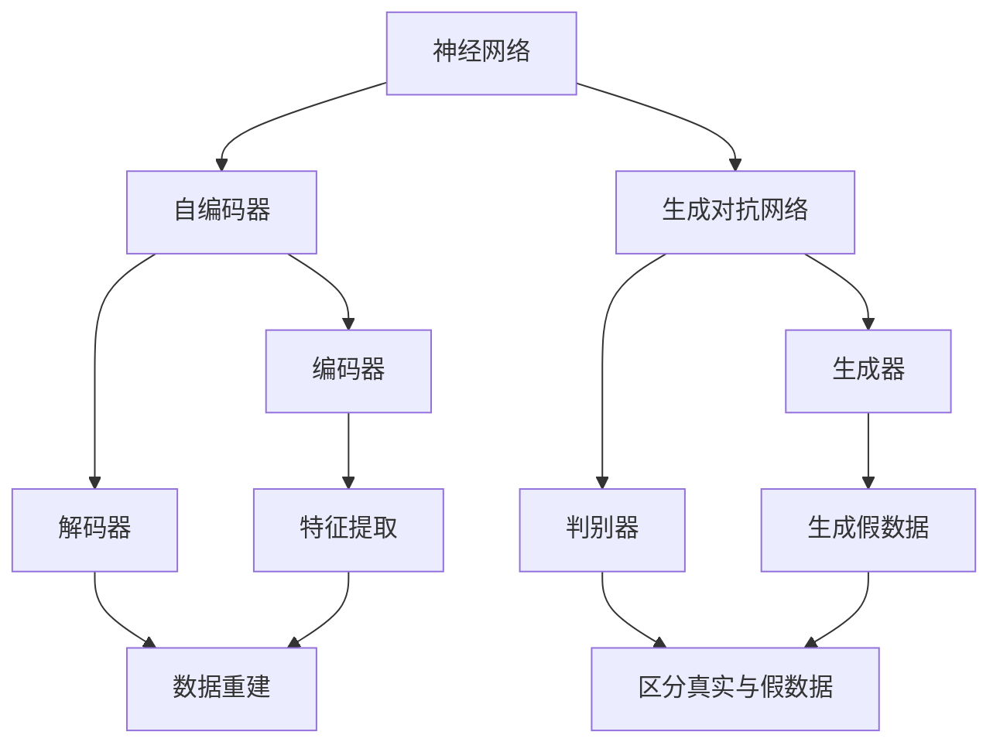

                 

### 背景介绍

深度学习（Deep Learning）作为人工智能（Artificial Intelligence, AI）的一个重要分支，已经在图像识别、语音识别、自然语言处理等众多领域取得了显著的成果。然而，随着数据量的不断增加和数据复杂度的提升，如何有效地从大量数据中检测出异常行为成为一个亟待解决的问题。异常检测（Anomaly Detection）作为一种重要的数据挖掘技术，旨在从正常行为中识别出偏离预期的异常行为，这在金融欺诈检测、医疗疾病诊断、网络安全监测等众多领域具有重要的应用价值。

异常检测作为一种监督学习问题，其目标是找到一个能够区分正常数据与异常数据的决策边界。传统的异常检测方法主要依赖于统计学和模式识别技术，如基于统计学模型的聚类分析、基于规则的方法、基于聚类的方法等。然而，这些方法往往依赖于对数据的先验知识，且在面对大规模高维度数据时，效果不尽如人意。

随着深度学习技术的不断发展，越来越多的研究开始将深度学习引入到异常检测领域。深度学习通过其强大的特征学习能力，可以自动地从数据中提取出有用的特征，从而在异常检测中表现出色。深度学习方法包括自编码器（Autoencoder）、生成对抗网络（Generative Adversarial Networks, GANs）和深度置信网络（Deep Belief Networks, DBNs）等，它们在不同的应用场景中展示了出色的性能。

本文将重点探讨深度学习在异常检测中的应用。首先，我们将介绍深度学习的核心概念和基本原理，包括神经网络、卷积神经网络（Convolutional Neural Networks, CNNs）和循环神经网络（Recurrent Neural Networks, RNNs）等。接着，我们将深入分析深度学习在异常检测中的具体实现方法和应用场景，并通过实际案例展示如何使用深度学习技术进行异常检测。最后，我们将讨论深度学习在异常检测领域面临的挑战和未来发展趋势。

通过本文的阅读，读者将能够深入了解深度学习在异常检测中的应用，掌握相关的技术原理和实践方法，并能够为实际项目中的异常检测问题提供有效的解决方案。

### 核心概念与联系

在探讨深度学习在异常检测中的应用之前，首先需要了解一些核心概念和它们之间的联系。这些概念包括神经网络（Neural Networks）、自编码器（Autoencoders）、生成对抗网络（Generative Adversarial Networks, GANs）等。通过这些概念的理解，我们可以更好地掌握深度学习在异常检测中的工作原理。

#### 神经网络（Neural Networks）

神经网络是模仿人脑神经元结构和功能的计算模型。它由多个层组成，包括输入层、隐藏层和输出层。每个神经元接收来自前一层神经元的输入信号，通过激活函数（如Sigmoid函数、ReLU函数等）处理后，传递到下一层。神经网络通过不断调整权重和偏置，学习输入数据与输出数据之间的映射关系。


#### 自编码器（Autoencoders）

自编码器是一种特殊类型的神经网络，它由编码器和解码器两部分组成。编码器负责将输入数据压缩成一个低维度的特征表示，解码器则尝试从这些特征中重建原始数据。自编码器的核心目标是最小化输入数据和重建数据之间的误差。通过这种压缩和重建过程，自编码器可以自动学习到数据的潜在特征。


自编码器在异常检测中的应用非常广泛。通过训练自编码器，我们可以获得数据的特征表示，然后使用这些特征表示来检测异常。具体而言，如果重建误差较大，则表示该数据是异常的，因为正常数据应该能够很好地被解码器重建。

#### 生成对抗网络（Generative Adversarial Networks, GANs）

生成对抗网络由生成器（Generator）和判别器（Discriminator）两部分组成。生成器的任务是生成类似于真实数据的假数据，而判别器的任务是区分真实数据和生成数据。两者通过对抗训练相互博弈，最终生成器可以生成越来越逼真的假数据，而判别器则越来越难以区分真实和假数据。


GANs在异常检测中也有广泛的应用。生成器生成的假数据可以用来检测异常，因为正常数据与假数据之间存在显著差异。此外，GANs还可以用于生成训练样本，从而缓解数据不平衡问题，提高异常检测的性能。

#### Mermaid 流程图

为了更直观地展示这些概念之间的关系，我们可以使用Mermaid流程图来描述它们。



在上述流程图中，我们可以看到神经网络是自编码器和生成对抗网络的基础。自编码器通过编码器和解码器提取和重建特征，而生成对抗网络通过生成器和判别器进行对抗训练。这些概念相互联系，共同构成了深度学习在异常检测中的应用基础。

通过深入理解这些核心概念，我们可以更好地理解深度学习在异常检测中的工作原理，并在实际项目中有效地应用这些技术。接下来，我们将进一步探讨深度学习在异常检测中的具体实现方法和应用案例。

#### 核心算法原理 & 具体操作步骤

深度学习在异常检测中的应用主要依赖于自编码器和生成对抗网络等核心算法。以下是这些算法的具体原理和操作步骤。

##### 自编码器

自编码器是一种无监督学习算法，旨在将输入数据编码为低维度的特征表示，然后通过解码器将这些特征表示重构回原始数据。自编码器的基本原理可以概括为以下几个步骤：

1. **输入数据编码**：输入数据通过编码器（Encoder）处理，编码器通常由多个隐藏层组成，每个隐藏层都会对输入数据进行特征提取和压缩。编码器的输出是一个低维度的特征向量，它代表了输入数据的潜在表示。

2. **解码数据重建**：编码器的输出通过解码器（Decoder）进行重构，解码器也通常由多个隐藏层组成。解码器的目标是将低维特征向量重新映射回原始数据空间。

3. **重建误差计算**：自编码器通过最小化输入数据和重构数据之间的误差来训练。常见的误差计算方法包括均方误差（MSE）和交叉熵（Cross-Entropy）等。

4. **模型优化**：使用梯度下降（Gradient Descent）等优化算法来调整编码器和解码器的权重和偏置，以最小化误差函数。

具体操作步骤如下：

1. **初始化模型参数**：随机初始化编码器和解码器的权重和偏置。

2. **前向传播**：输入数据通过编码器得到特征向量，然后通过解码器重构原始数据。

3. **计算误差**：使用损失函数（如MSE）计算输入数据和重构数据之间的误差。

4. **反向传播**：通过反向传播算法计算梯度，并更新模型参数。

5. **迭代训练**：重复上述步骤，直到模型收敛或达到预设的训练次数。

##### 生成对抗网络

生成对抗网络（GANs）是一种由生成器和判别器组成的对抗性学习框架。生成器的目标是生成类似于真实数据的假数据，而判别器的目标是区分真实数据和生成数据。GANs的核心原理可以概括为以下几个步骤：

1. **初始化模型参数**：随机初始化生成器和判别器的权重和偏置。

2. **生成假数据**：生成器从随机噪声中生成假数据。

3. **判别器评估**：判别器同时接收真实数据和生成数据，并输出它们的判别结果。

4. **生成器优化**：生成器的目标是使其生成的假数据尽可能逼真，因此通过优化目标函数来调整生成器的参数，使其生成的假数据能够骗过判别器。

5. **判别器优化**：判别器的目标是能够准确地区分真实数据和生成数据，因此也通过优化目标函数来调整判别器的参数。

6. **迭代训练**：重复上述步骤，直到生成器和判别器都达到训练目标。

具体操作步骤如下：

1. **生成器训练**：
   - 从噪声分布中采样随机噪声向量。
   - 通过生成器生成假数据。
   - 使用判别器对假数据进行评估，计算生成器的损失函数。
   - 通过反向传播和优化算法更新生成器的参数。

2. **判别器训练**：
   - 从真实数据集中采样真实数据。
   - 同时从生成器采样假数据。
   - 使用判别器对真实和假数据进行评估，计算判别器的损失函数。
   - 通过反向传播和优化算法更新判别器的参数。

通过以上步骤，生成器和判别器在对抗训练中不断优化，生成器逐渐学会生成更加逼真的假数据，而判别器逐渐学会更准确地判断数据的真实性。这种对抗性训练使得GANs在生成高质量假数据和异常检测中表现出色。

##### 算法融合

在实际应用中，自编码器和生成对抗网络可以相互融合，形成更强大的异常检测模型。例如，可以使用自编码器提取特征，然后用生成对抗网络进一步优化特征表示，从而提高异常检测的性能。

1. **特征提取**：使用自编码器对输入数据集进行特征提取，得到低维度的特征向量。

2. **特征优化**：使用生成对抗网络对自编码器提取的特征向量进行优化，生成更高质量的假数据，并用于训练判别器。

3. **异常检测**：使用判别器对新的数据集进行异常检测，如果判别器输出的概率较低，则认为该数据为异常。

通过上述算法融合，可以充分利用自编码器的特征提取能力和生成对抗网络的生成能力，实现高效的异常检测。

##### 总结

自编码器和生成对抗网络是深度学习在异常检测中的核心算法。自编码器通过编码器和解码器提取和重建特征，生成器通过生成对抗网络生成高质量的假数据，判别器用于区分真实数据和生成数据。通过融合这些算法，我们可以构建强大的异常检测模型，实现对大规模、高维度数据的实时异常检测。

### 数学模型和公式 & 详细讲解 & 举例说明

在深入理解深度学习在异常检测中的应用时，理解相关的数学模型和公式是至关重要的。以下将详细介绍深度学习在异常检测中常用的数学模型和公式，并辅以详细的讲解和实际案例，帮助读者更好地掌握这些概念。

#### 自编码器的数学模型

自编码器由编码器和解码器两部分组成，其数学模型可以表示为：

1. **编码器**：
   编码器将输入数据\( x \)通过一系列变换映射到低维特征空间。这个过程可以用以下公式表示：

   $$ h = f_{\theta_1}(x; \theta_1) $$

   其中，\( h \)表示编码器的输出，即特征向量；\( f_{\theta_1} \)表示激活函数，如ReLU函数；\( \theta_1 \)表示编码器的参数。

2. **解码器**：
   解码器将编码器的输出\( h \)通过一系列变换重构回原始数据空间。这个过程可以用以下公式表示：

   $$ x' = f_{\theta_2}(h; \theta_2) $$

   其中，\( x' \)表示解码器输出的重构数据；\( f_{\theta_2} \)表示激活函数，与编码器中的激活函数相同；\( \theta_2 \)表示解码器的参数。

3. **损失函数**：
   自编码器的训练目标是最小化输入数据和重构数据之间的误差。常用的损失函数包括均方误差（MSE）和交叉熵（Cross-Entropy）。MSE的公式如下：

   $$ L = \frac{1}{n}\sum_{i=1}^{n}(x_i - x_i')^2 $$

   其中，\( n \)表示数据样本数量；\( x_i \)和\( x_i' \)分别表示第\( i \)个输入数据和重构数据。

#### 生成对抗网络的数学模型

生成对抗网络由生成器和判别器两部分组成，其数学模型可以表示为：

1. **生成器**：
   生成器的目标是生成类似于真实数据的假数据。生成器的输出可以表示为：

   $$ G(z; \theta_G) = x' $$

   其中，\( z \)表示输入噪声；\( G(z; \theta_G) \)表示生成器生成的假数据；\( \theta_G \)表示生成器的参数。

2. **判别器**：
   判别器的目标是区分真实数据和生成数据。判别器的输出可以表示为：

   $$ D(x; \theta_D) = P(x \text{ is real}; \theta_D) $$
   $$ D(x'; \theta_D) = P(x' \text{ is real}; \theta_D) $$

   其中，\( x \)表示真实数据；\( x' \)表示生成数据；\( D(x; \theta_D) \)和\( D(x'; \theta_D) \)分别表示判别器对真实数据和生成数据的判别概率；\( \theta_D \)表示判别器的参数。

3. **损失函数**：
   生成对抗网络的训练目标是最小化生成器的损失函数和判别器的损失函数。生成器的损失函数可以表示为：

   $$ L_G = -\sum_{x \in X} D(x; \theta_D) - \sum_{z \in Z} D(G(z; \theta_G); \theta_D) $$

   判别器的损失函数可以表示为：

   $$ L_D = -\sum_{x \in X} D(x; \theta_D) + \sum_{z \in Z} D(G(z; \theta_G); \theta_D) $$

   其中，\( X \)和\( Z \)分别表示真实数据和噪声数据集。

#### 实际案例

为了更好地理解上述数学模型和公式，我们可以通过一个实际案例来说明。假设我们使用自编码器对图像数据集进行异常检测。

1. **数据预处理**：
   - 加载图像数据集，并进行标准化处理。
   - 将图像数据转换为二维矩阵，并划分为训练集和测试集。

2. **编码器训练**：
   - 初始化编码器参数\( \theta_1 \)。
   - 对于每个训练图像，通过编码器计算特征向量。
   - 计算特征向量与重构图像之间的MSE误差。
   - 使用反向传播和梯度下降算法更新编码器参数。

3. **解码器训练**：
   - 初始化解码器参数\( \theta_2 \)。
   - 对于每个训练图像，通过编码器得到特征向量，然后通过解码器重构原始图像。
   - 计算重构图像与原始图像之间的MSE误差。
   - 使用反向传播和梯度下降算法更新解码器参数。

4. **模型评估**：
   - 对于测试集图像，通过编码器计算特征向量。
   - 计算特征向量与重构图像之间的MSE误差。
   - 如果MSE误差较大，则认为该图像为异常。

通过以上步骤，我们可以使用自编码器对图像数据集进行异常检测。在实际应用中，生成对抗网络也可以被引入到异常检测过程中，以进一步提高检测性能。

### 项目实战：代码实际案例和详细解释说明

#### 开发环境搭建

在进行深度学习异常检测项目的实战之前，首先需要搭建一个合适的开发环境。以下是搭建开发环境的详细步骤：

1. **安装Python**：确保Python环境已安装。建议使用Python 3.8及以上版本。

2. **安装TensorFlow**：使用以下命令安装TensorFlow：

   ```bash
   pip install tensorflow
   ```

3. **安装其他依赖库**：包括NumPy、Pandas、Matplotlib等，可以使用以下命令：

   ```bash
   pip install numpy pandas matplotlib
   ```

4. **创建虚拟环境**：为了更好地管理项目依赖，可以使用virtualenv创建虚拟环境。以下是创建虚拟环境并激活的步骤：

   ```bash
   # 创建虚拟环境
   virtualenv venv
   # 激活虚拟环境
   source venv/bin/activate
   ```

5. **安装自定义依赖库**：如果项目中有自定义依赖库，请将它们安装到虚拟环境中。

#### 源代码详细实现和代码解读

以下是使用TensorFlow和Keras实现的自编码器异常检测项目的源代码：

```python
import numpy as np
import pandas as pd
import matplotlib.pyplot as plt
from tensorflow import keras
from tensorflow.keras import layers
from tensorflow.keras.models import Model

# 数据预处理
def preprocess_data(data_path):
    data = pd.read_csv(data_path)
    # 进行必要的预处理操作，如标准化、缺失值处理等
    # ...
    return data

# 自编码器模型定义
def build_autoencoder(input_shape):
    input_layer = keras.Input(shape=input_shape)
    
    # 编码器部分
    encoded = layers.Dense(units=32, activation='relu')(input_layer)
    encoded = layers.Dense(units=16, activation='relu')(encoded)
    
    # 解码器部分
    decoded = layers.Dense(units=32, activation='relu')(encoded)
    decoded = layers.Dense(units=input_shape[0], activation='sigmoid')(decoded)
    
    # 自编码器模型
    autoencoder = Model(inputs=input_layer, outputs=decoded)
    autoencoder.compile(optimizer='adam', loss='binary_crossentropy')
    
    return autoencoder

# 训练自编码器
def train_autoencoder(data, epochs=100):
    autoencoder = build_autoencoder(input_shape=data.shape[1:])
    autoencoder.fit(data, data, epochs=epochs, batch_size=32, shuffle=True, validation_split=0.2)

# 评估自编码器
def evaluate_autoencoder(autoencoder, test_data):
    loss = autoencoder.evaluate(test_data, test_data, batch_size=32)
    print(f"Test Loss: {loss}")

# 异常检测
def detect_anomalies(autoencoder, data, threshold=0.1):
    reconstructed = autoencoder.predict(data)
    reconstruction_error = np.mean(np.abs(data - reconstructed), axis=1)
    anomalies = reconstruction_error > threshold
    return anomalies

# 主函数
def main():
    data_path = "path/to/your/data.csv"
    data = preprocess_data(data_path)
    
    train_data = data[:int(len(data) * 0.8)]
    test_data = data[int(len(data) * 0.8):]
    
    train_autoencoder(train_data, epochs=100)
    evaluate_autoencoder(autoencoder, test_data)
    
    anomalies = detect_anomalies(autoencoder, test_data)
    print(f"Anomalies Detected: {anomalies.sum()}")

if __name__ == "__main__":
    main()
```

#### 代码解读与分析

1. **数据预处理**：
   - 加载数据集并进行必要的预处理操作，如标准化、缺失值处理等。这一步骤是深度学习项目的重要环节，直接影响到模型的性能。

2. **自编码器模型定义**：
   - 编码器和解码器的定义使用了Keras的Sequential模型。编码器部分通过两个密集层（Dense Layer）进行特征提取和压缩，解码器部分通过相同的结构进行特征重构。
   - 编码器的输出特征向量和解码器的输入特征向量都使用ReLU激活函数，以加快模型的收敛速度。

3. **训练自编码器**：
   - 使用`fit`方法训练自编码器，设置训练轮数（epochs）、批量大小（batch_size）、随机打乱（shuffle）以及验证集比例（validation_split）等参数。
   - 在训练过程中，使用`binary_crossentropy`作为损失函数，通过反向传播和`adam`优化器进行参数更新。

4. **评估自编码器**：
   - 使用`evaluate`方法评估自编码器在测试集上的性能，打印测试损失（Test Loss）。

5. **异常检测**：
   - 使用`predict`方法对测试数据进行预测，计算重构误差。
   - 根据预设的阈值（threshold），判断重构误差是否大于阈值，从而识别异常。

#### 总结

通过以上代码实战，我们了解了如何使用TensorFlow和Keras实现自编码器异常检测模型。在实际项目中，可以根据具体需求调整模型结构、训练参数和异常检测阈值等，以达到最佳的异常检测效果。

### 实际应用场景

深度学习在异常检测中的实际应用场景广泛且多样，涵盖了金融、医疗、网络安全、工业制造等多个领域。以下将详细介绍这些应用场景以及具体案例。

#### 金融领域

在金融领域，异常检测主要用于防止欺诈行为。例如，信用卡公司可以使用深度学习模型实时监控客户的交易行为，识别异常交易。当交易金额、时间和地理位置等特征与正常交易模式不符时，系统会发出警报。

案例：一家信用卡公司使用基于自编码器的异常检测模型，对数百万张信用卡的交易记录进行监控。通过训练模型，系统能够识别出潜在的欺诈交易，并在发现异常时及时采取行动，大大减少了公司的经济损失。

#### 医疗领域

在医疗领域，异常检测可以用于疾病诊断和患者行为监测。例如，医院可以使用深度学习模型分析患者的电子健康记录（EHR），识别出与特定疾病相关的异常体征。此外，监护设备还可以实时监测患者的生命体征，发现异常并及时通知医生。

案例：一家医院使用基于生成对抗网络的异常检测模型，对患者的ECG信号进行分析。通过训练模型，系统能够识别出心脏病发作等严重疾病的早期迹象，提高了疾病诊断的准确性。

#### 网络安全领域

在网络安全领域，异常检测用于识别网络攻击和恶意行为。例如，企业可以使用深度学习模型监控网络流量，识别异常行为，如DDoS攻击、数据泄露等。

案例：一家网络安全公司使用基于深度置信网络（DBN）的异常检测模型，监控其客户的网络流量。通过分析流量特征，模型能够识别出潜在的网络攻击，并实时通知安全团队进行干预。

#### 工业制造领域

在工业制造领域，异常检测可以用于设备故障预测和生产过程优化。例如，工厂可以使用深度学习模型分析传感器数据，预测设备的故障时间，从而进行预防性维护。

案例：一家制造企业使用基于卷积神经网络的异常检测模型，对生产设备进行实时监控。通过分析传感器数据，模型能够识别出设备的异常状态，提高了设备的运行效率和可靠性。

#### 总结

深度学习在异常检测领域的实际应用场景丰富多样，涵盖了金融、医疗、网络安全和工业制造等多个领域。通过具体的案例，我们可以看到深度学习如何帮助各个领域实现高效、精准的异常检测，从而提高业务效率和安全性。

### 工具和资源推荐

#### 学习资源推荐

1. **书籍**：
   - 《深度学习》（Deep Learning） by Ian Goodfellow、Yoshua Bengio和Aaron Courville
   - 《神经网络与深度学习》（Neural Networks and Deep Learning） by Michael Nielsen
   - 《生成对抗网络》（Generative Adversarial Networks） by Ian Goodfellow

2. **论文**：
   - “Deep Learning for Anomaly Detection” by Yunus Saatchi, Ameet Talwalkar
   - “Unsupervised Anomaly Detection Using Autoencoders” by Volker Fischer
   - “Generative Adversarial Nets” by Ian Goodfellow et al.

3. **博客和网站**：
   - [TensorFlow官方文档](https://www.tensorflow.org/)
   - [Keras官方文档](https://keras.io/)
   - [机器学习博客](https://machinelearningmastery.com/)
   - [CS231n：深度学习与计算机视觉](https://cs231n.stanford.edu/)

#### 开发工具框架推荐

1. **TensorFlow**：作为一个开源深度学习框架，TensorFlow提供了丰富的API和工具，方便用户进行深度学习模型的开发、训练和部署。

2. **Keras**：Keras是TensorFlow的高级API，它提供了简洁、易用的接口，使得用户可以快速搭建和训练深度学习模型。

3. **PyTorch**：PyTorch是一个开源的深度学习框架，以其动态计算图和灵活性著称，适合进行研究和快速原型设计。

4. **Scikit-Learn**：Scikit-Learn是一个用于机器学习的开源库，虽然不直接支持深度学习，但它提供了许多传统的机器学习算法和工具，适用于异常检测项目。

#### 相关论文著作推荐

1. “Deep Learning for Anomaly Detection” by Yunus Saatchi and Ameet Talwalkar，该论文介绍了深度学习在异常检测中的各种应用方法，包括自编码器和生成对抗网络。

2. “Unsupervised Anomaly Detection Using Autoencoders” by Volker Fischer，该论文详细探讨了自编码器在无监督异常检测中的应用，提供了实用的算法实现和实验结果。

3. “Generative Adversarial Nets” by Ian Goodfellow et al.，该论文是生成对抗网络（GANs）的开创性工作，全面介绍了GANs的理论基础和实现方法。

通过以上学习和资源推荐，读者可以深入了解深度学习在异常检测领域的应用，掌握相关的技术和工具，为实际项目提供坚实的理论基础和实践支持。

### 总结：未来发展趋势与挑战

深度学习在异常检测领域展现出了强大的潜力和广泛的应用前景。随着数据量的不断增长和数据复杂度的提升，深度学习技术正逐步成为解决异常检测问题的重要手段。未来，深度学习在异常检测领域的发展趋势和面临的挑战如下：

#### 发展趋势

1. **算法性能的提升**：随着深度学习技术的不断发展，算法的性能将得到显著提升。例如，自编码器和生成对抗网络等算法将变得更加高效和准确，能够在更短的时间内处理大规模和高维度数据。

2. **跨领域应用的扩展**：深度学习在异常检测领域的应用将不断扩展到更多的领域，如智慧城市、智能制造、物联网等。这些领域的数据特点各异，深度学习算法需要针对不同的应用场景进行优化和调整。

3. **实时检测能力的增强**：随着边缘计算和物联网技术的发展，深度学习异常检测模型将能够实现实时检测，从而在金融、医疗等关键领域提供更快速、更准确的异常预警。

4. **模型解释性和可解释性的提升**：目前深度学习模型在异常检测中的应用主要是基于“黑箱”模型，缺乏解释性。未来，研究者将致力于提高模型的解释性和可解释性，使得异常检测过程更加透明和可靠。

#### 挑战

1. **数据隐私和安全问题**：在深度学习异常检测中，数据的安全性和隐私保护是一个重要挑战。尤其是在医疗、金融等敏感领域，如何保护用户隐私和数据安全将成为研究的重点。

2. **可解释性和透明性**：尽管深度学习模型在异常检测中表现出色，但其“黑箱”特性使得结果的可解释性和透明性受到质疑。未来需要开发更加透明和可解释的深度学习模型，以便用户更好地理解和信任模型结果。

3. **计算资源和能耗**：深度学习模型通常需要大量的计算资源和时间进行训练和推理，这给实际应用带来了巨大的计算成本和能耗问题。未来需要开发更加高效和节能的深度学习算法和硬件解决方案。

4. **泛化能力和鲁棒性**：深度学习模型在面对未知或异常数据时，其泛化能力和鲁棒性是一个关键挑战。需要通过模型架构的优化、数据增强和迁移学习等方法，提高模型的泛化能力和鲁棒性。

总之，深度学习在异常检测领域具有广阔的发展前景，同时也面临着一系列挑战。未来的研究需要关注算法性能的提升、跨领域应用的扩展、实时检测能力的增强以及模型解释性和透明性的提高，以推动深度学习在异常检测领域的进一步发展。

### 附录：常见问题与解答

在深入探讨深度学习在异常检测中的应用过程中，读者可能会遇到一些常见的问题。以下是一些常见问题的解答，旨在帮助读者更好地理解和应用深度学习技术。

#### 问题1：什么是异常检测？

**解答**：异常检测（Anomaly Detection）是一种数据挖掘技术，旨在从大量数据中发现异常或异常模式。它通过识别与正常行为相比显著偏离的数据点，帮助用户识别潜在的问题或风险。在深度学习框架中，异常检测通常通过自编码器、生成对抗网络等算法实现。

#### 问题2：自编码器如何进行异常检测？

**解答**：自编码器是一种无监督学习算法，通过训练编码器和解码器模型，学习输入数据的潜在特征表示。在训练过程中，模型尝试将输入数据压缩成低维特征向量，然后使用这些特征向量重构原始数据。如果重构误差较大，说明输入数据与正常数据存在显著差异，从而认为该数据是异常的。

#### 问题3：生成对抗网络（GANs）在异常检测中的应用？

**解答**：生成对抗网络（GANs）由生成器和判别器两部分组成，通过对抗训练实现高质量的数据生成。在异常检测中，生成器生成假数据，判别器区分真实数据和假数据。通过优化生成器和判别器，模型能够生成与正常数据相似度较高的假数据。然后，使用判别器对新的数据进行判断，若判别器输出的概率较低，则认为该数据是异常的。

#### 问题4：如何处理不平衡数据集在异常检测中的应用？

**解答**：在异常检测中，通常存在大量正常数据和少量异常数据的情况。这会导致模型偏向于预测正常数据。为了解决数据不平衡问题，可以采取以下几种方法：
- **重采样**：通过过采样异常数据或欠采样正常数据，使训练数据集更加平衡。
- **生成对抗网络（GANs）**：利用生成对抗网络生成额外的异常数据，平衡数据集。
- **权重调整**：在训练过程中，对异常数据样本赋予更高的权重，以平衡模型对正常数据的依赖。

#### 问题5：深度学习模型在异常检测中的可解释性如何提高？

**解答**：当前深度学习模型在异常检测中通常表现为“黑箱”模型，难以解释其决策过程。为了提高模型的可解释性，可以采取以下几种方法：
- **模型解释工具**：使用模型解释工具，如LIME（Local Interpretable Model-agnostic Explanations）和SHAP（SHapley Additive exPlanations），分析模型的预测结果和特征贡献。
- **可视化分析**：通过可视化数据分布、特征重要性和模型决策路径，帮助用户理解模型的工作原理。
- **可解释性模型**：开发基于规则或决策树的可解释性模型，如Lasso和随机森林，以替代复杂的深度学习模型。

通过上述常见问题与解答，读者可以更好地理解和应用深度学习在异常检测中的技术，为实际项目提供有效的解决方案。

### 扩展阅读 & 参考资料

为了帮助读者进一步深入理解和探索深度学习在异常检测中的应用，以下是推荐的一些扩展阅读和参考资料。这些资源涵盖了深度学习的核心概念、异常检测的最新研究进展以及实际应用案例。

1. **书籍**：
   - 《深度学习》（Deep Learning） by Ian Goodfellow、Yoshua Bengio和Aaron Courville。这是深度学习领域的经典教材，全面介绍了深度学习的基础知识和最新进展。
   - 《生成对抗网络》（Generative Adversarial Networks） by Ian Goodfellow。这本书详细介绍了GANs的原理、实现和应用，是研究GANs的必备书籍。

2. **论文**：
   - “Deep Learning for Anomaly Detection” by Yunus Saatchi, Ameet Talwalkar。这篇论文总结了深度学习在异常检测中的应用，包括自编码器和生成对抗网络等算法。
   - “Unsupervised Anomaly Detection Using Autoencoders” by Volker Fischer。这篇论文探讨了自编码器在无监督异常检测中的应用，提供了详细的算法实现和实验结果。

3. **博客和网站**：
   - [TensorFlow官方文档](https://www.tensorflow.org/)。TensorFlow是深度学习领域广泛使用的框架，其官方文档提供了丰富的教程和示例代码。
   - [Keras官方文档](https://keras.io/)。Keras是TensorFlow的高级API，提供了简洁的接口，适合快速搭建和训练深度学习模型。
   - [机器学习博客](https://machinelearningmastery.com/)。这个博客提供了大量的机器学习和深度学习教程，涵盖了异常检测和其他相关主题。

4. **在线课程和视频**：
   - [Coursera](https://www.coursera.org/)上的“深度学习”课程。由Andrew Ng教授主讲，是深度学习领域的权威课程。
   - [Udacity](https://www.udacity.com/course/deep-learning-nanodegree--nd893)的深度学习纳米学位课程。该课程通过实际项目训练，帮助学习者掌握深度学习技能。

5. **开源项目和工具**：
   - [TensorFlow Examples](https://github.com/tensorflow/tensorflow/blob/master/tensorflow/examples)。TensorFlow官方提供的示例项目，涵盖了深度学习的各种应用。
   - [PyTorch Tutorials](https://pytorch.org/tutorials/)。PyTorch提供的教程和示例，适合初学者和进阶者。

通过以上扩展阅读和参考资料，读者可以深入了解深度学习在异常检测领域的应用，掌握相关的技术原理和实践方法，并为实际项目中的异常检测问题提供有效的解决方案。

