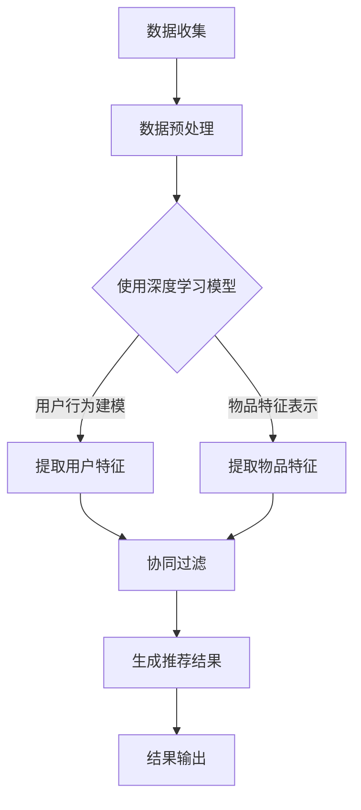
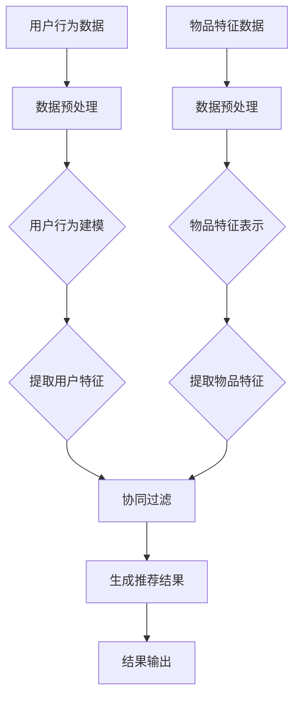

                 

# 深度学习在推荐系统中的应用

## 关键词：深度学习，推荐系统，神经网络，数据处理，个性化推荐，算法优化

## 摘要：
随着互联网和大数据技术的飞速发展，推荐系统已经成为各类在线平台的重要功能，为用户提供了丰富的内容和服务。本文将深入探讨深度学习在推荐系统中的应用，包括其核心概念、算法原理、数学模型以及实际项目实战。通过对深度学习在推荐系统中的具体实现和案例分析，本文旨在为读者提供关于如何构建高效、智能的推荐系统的全面理解和实践指导。

## 1. 背景介绍

推荐系统是一种基于用户行为、偏好和历史数据，预测用户可能感兴趣的内容或项目的系统。它在电商、社交媒体、视频平台等多个领域发挥着重要作用。传统的推荐系统主要基于协同过滤、基于内容的推荐等技术，但它们存在一些局限性，如难以处理稀疏数据、无法捕捉复杂的用户偏好等。

深度学习作为一种强大的机器学习技术，通过多层神经网络模型，能够自动提取数据中的复杂特征，从而在推荐系统中展现出巨大的潜力。近年来，深度学习在图像识别、自然语言处理等领域取得了显著成果，使其成为推荐系统研究的热点方向。

本文将围绕深度学习在推荐系统中的应用，从核心概念、算法原理、数学模型到实际项目实战，进行深入分析和探讨。

## 2. 核心概念与联系

### 2.1 深度学习基础

深度学习（Deep Learning）是一种基于人工神经网络的学习方法，通过多层非线性变换，自动提取数据中的特征，实现复杂任务的学习和预测。深度学习的基本组成包括：

- **神经元**：深度学习的基本构建块，类似于生物神经元，负责传递和更新信息。
- **神经网络**：由多个神经元组成的网络结构，通过前向传播和反向传播进行信息的传递和学习。
- **激活函数**：对神经元输出进行非线性变换，如ReLU、Sigmoid、Tanh等。

### 2.2 推荐系统基础

推荐系统（Recommender System）是一种基于用户行为和偏好，预测用户可能感兴趣的内容的系统。推荐系统的基本流程包括：

- **用户-项目交互数据收集**：收集用户在平台上的行为数据，如点击、购买、评价等。
- **数据预处理**：对收集到的数据进行清洗、格式化和特征提取。
- **模型训练与预测**：使用训练数据训练推荐模型，并对新数据进行预测。
- **结果输出**：将推荐结果呈现给用户。

### 2.3 深度学习与推荐系统的结合

深度学习在推荐系统中的应用，主要是利用其强大的特征提取能力，捕捉用户行为的复杂模式。深度学习与推荐系统的结合，主要涉及以下几个方面：

- **用户行为建模**：使用深度学习模型，对用户的历史行为进行建模，提取用户偏好特征。
- **物品特征表示**：使用深度学习模型，对物品的特征进行编码，为后续推荐提供基础。
- **协同过滤**：结合深度学习与协同过滤算法，利用深度学习模型提取用户和物品的隐式特征，进行推荐。
- **基于内容的推荐**：利用深度学习模型，提取物品的语义特征，实现基于内容的推荐。

### 2.4 Mermaid 流程图

下面是一个简单的深度学习推荐系统的Mermaid流程图：



在接下来的章节中，我们将深入探讨深度学习在推荐系统中的应用，包括核心算法原理、具体操作步骤、数学模型和公式，以及实际项目实战。

## 3. 核心算法原理 & 具体操作步骤

### 3.1 用户行为建模

用户行为建模是深度学习推荐系统的核心步骤之一。其主要任务是利用深度学习模型，对用户的历史行为数据进行建模，提取用户偏好特征。

#### 3.1.1 深度学习模型选择

在用户行为建模中，常用的深度学习模型包括卷积神经网络（CNN）、循环神经网络（RNN）、长短时记忆网络（LSTM）等。其中，RNN和LSTM在处理序列数据方面具有优势，因此常用于用户行为建模。

#### 3.1.2 数据处理与模型训练

用户行为建模的具体步骤如下：

1. **数据处理**：将用户行为数据（如点击、购买、评价等）转化为序列形式，并对数据进行归一化处理。
2. **模型构建**：使用RNN或LSTM模型，对用户行为序列进行建模。
3. **模型训练**：使用训练数据对模型进行训练，调整模型参数。

### 3.2 物品特征表示

物品特征表示是深度学习推荐系统的另一个核心步骤。其主要任务是通过深度学习模型，对物品的特征进行编码，为后续推荐提供基础。

#### 3.2.1 深度学习模型选择

在物品特征表示中，常用的深度学习模型包括自编码器（Autoencoder）、生成对抗网络（GAN）等。自编码器能够自动学习数据中的特征表示，而GAN能够生成高质量的物品特征。

#### 3.2.2 数据处理与模型训练

物品特征表示的具体步骤如下：

1. **数据处理**：将物品的原始数据进行预处理，如文本分类、图像分割等。
2. **模型构建**：使用自编码器或GAN模型，对物品特征进行编码。
3. **模型训练**：使用训练数据对模型进行训练，提取物品特征。

### 3.3 协同过滤

协同过滤（Collaborative Filtering）是一种传统的推荐系统算法，其核心思想是通过用户之间的相似度计算，推荐用户可能喜欢的物品。深度学习与协同过滤的结合，能够在提取用户和物品特征方面发挥优势。

#### 3.3.1 深度学习模型选择

在协同过滤中，常用的深度学习模型包括图卷积网络（GCN）、注意力机制等。GCN能够处理图结构数据，注意力机制能够对用户和物品的特征进行加权。

#### 3.3.2 数据处理与模型训练

协同过滤的具体步骤如下：

1. **数据处理**：构建用户-物品交互矩阵，并对数据进行归一化处理。
2. **模型构建**：使用GCN或注意力机制模型，对用户-物品交互矩阵进行建模。
3. **模型训练**：使用训练数据对模型进行训练，提取用户和物品的特征。

### 3.4 基于内容的推荐

基于内容的推荐（Content-based Recommendation）是一种基于物品特征进行推荐的方法。深度学习在提取物品特征方面具有优势，因此常用于基于内容的推荐。

#### 3.4.1 深度学习模型选择

在基于内容的推荐中，常用的深度学习模型包括文本嵌入（Word Embedding）、图像分类（Image Classification）等。文本嵌入能够将文本转化为向量表示，图像分类能够对图像进行分类。

#### 3.4.2 数据处理与模型训练

基于内容的推荐的具体步骤如下：

1. **数据处理**：对文本和图像数据进行预处理，如文本分词、图像分割等。
2. **模型构建**：使用文本嵌入或图像分类模型，对文本和图像特征进行提取。
3. **模型训练**：使用训练数据对模型进行训练，提取物品特征。

### 3.5 深度学习推荐系统的整体框架

深度学习推荐系统的整体框架如下：



在接下来的章节中，我们将对深度学习推荐系统的数学模型和公式进行详细讲解，帮助读者更好地理解深度学习在推荐系统中的应用。

## 4. 数学模型和公式 & 详细讲解 & 举例说明

### 4.1 用户行为建模的数学模型

用户行为建模主要涉及循环神经网络（RNN）和长短时记忆网络（LSTM）。以下分别介绍这两种网络的数学模型。

#### 4.1.1 循环神经网络（RNN）

RNN的基本方程为：

$$
h_t = \sigma(W_h \cdot [h_{t-1}, x_t] + b_h)
$$

其中，$h_t$表示时间步$t$的隐藏状态，$x_t$表示输入特征，$W_h$和$b_h$分别是权重和偏置，$\sigma$是激活函数。

#### 4.1.2 长短时记忆网络（LSTM）

LSTM的核心部分是细胞状态（cell state），其基本方程为：

$$
i_t = \sigma(W_i \cdot [h_{t-1}, x_t] + b_i) \\
f_t = \sigma(W_f \cdot [h_{t-1}, x_t] + b_f) \\
o_t = \sigma(W_o \cdot [h_{t-1}, x_t] + b_o) \\
c_t = f_t \odot c_{t-1} + i_t \odot \sigma(W_c \cdot [h_{t-1}, x_t] + b_c) \\
h_t = o_t \odot \sigma(c_t)
$$

其中，$i_t$、$f_t$、$o_t$分别是输入门、遗忘门和输出门，$c_t$是细胞状态，$\odot$表示元素乘法，$\sigma$是激活函数。

### 4.2 物品特征表示的数学模型

物品特征表示主要涉及自编码器和生成对抗网络（GAN）。

#### 4.2.1 自编码器

自编码器的数学模型为：

$$
\text{Encoder:} \quad z = \sigma(W_e \cdot x + b_e) \\
\text{Decoder:} \quad x' = \sigma(W_d \cdot z + b_d)
$$

其中，$z$是编码特征，$x'$是重构特征，$W_e$、$W_d$分别是编码器和解码器的权重，$b_e$、$b_d$分别是编码器和解码器的偏置，$\sigma$是激活函数。

#### 4.2.2 生成对抗网络（GAN）

GAN的数学模型为：

$$
\text{Generator:} \quad G(z) = \sigma(W_g \cdot z + b_g) \\
\text{Discriminator:} \quad D(x) = \sigma(W_d \cdot x + b_d) \\
\text{Loss Function:} \quad \mathcal{L}(G, D) = -\frac{1}{2} \sum_{i=1}^{n} [\log D(x_i) + \log (1 - D(G(z_i))]
$$

其中，$G(z)$是生成器生成的特征，$D(x)$是判别器判断真实数据和生成数据的概率，$z$是噪声向量，$W_g$、$W_d$分别是生成器和判别器的权重，$b_g$、$b_d$分别是生成器和判别器的偏置，$\sigma$是激活函数。

### 4.3 协同过滤的数学模型

协同过滤的数学模型主要涉及矩阵分解和因子分解机（Factorization Machine）。

#### 4.3.1 矩阵分解

矩阵分解的数学模型为：

$$
R_{ij} = \langle Q_i, P_j \rangle = \sum_{k=1}^{K} q_{ik} p_{kj}
$$

其中，$R$是用户-物品交互矩阵，$Q$是用户特征矩阵，$P$是物品特征矩阵，$q_{ik}$和$p_{kj}$分别是用户$i$和物品$j$在特征$k$上的值，$\langle \cdot, \cdot \rangle$表示内积。

#### 4.3.2 因子分解机

因子分解机的数学模型为：

$$
\hat{y}_{ij} = \sum_{k=1}^{K} \alpha_i \beta_j x_{ijk} \\
\mathcal{L}(\theta) = \sum_{i=1}^{N} \sum_{j=1}^{M} \ell(y_{ij}, \hat{y}_{ij}) + \lambda_1 \sum_{i=1}^{N} \sum_{k=1}^{K} \alpha_i^2 + \lambda_2 \sum_{j=1}^{M} \sum_{k=1}^{K} \beta_j^2
$$

其中，$y_{ij}$是用户$i$对物品$j$的实际评分，$\hat{y}_{ij}$是预测评分，$\alpha_i$和$\beta_j$是用户和物品的隐式特征，$x_{ijk}$是用户$i$对物品$j$在特征$k$上的特征值，$\ell(\cdot, \cdot)$是损失函数，$\lambda_1$和$\lambda_2$是正则化参数。

### 4.4 基于内容的推荐的数学模型

基于内容的推荐的数学模型主要涉及文本嵌入和图像分类。

#### 4.4.1 文本嵌入

文本嵌入的数学模型为：

$$
e_j = \sigma(W_e \cdot x + b_e)
$$

其中，$e_j$是物品$j$的文本嵌入向量，$x$是物品$j$的文本表示，$W_e$和$b_e$分别是权重和偏置，$\sigma$是激活函数。

#### 4.4.2 图像分类

图像分类的数学模型为：

$$
\hat{y}_{ij} = \sigma(W \cdot [e_i; e_j] + b)
$$

其中，$\hat{y}_{ij}$是物品$j$是否被用户$i$喜欢的预测概率，$e_i$是用户$i$的文本嵌入向量，$W$和$b$分别是权重和偏置，$\sigma$是激活函数。

通过以上数学模型和公式的详细讲解，读者可以更好地理解深度学习在推荐系统中的应用原理。在实际项目中，可以根据具体情况选择合适的模型和算法，构建高效的推荐系统。

### 5. 项目实战：代码实际案例和详细解释说明

#### 5.1 开发环境搭建

在开始项目实战之前，我们需要搭建一个适合深度学习推荐系统开发的开发环境。以下是搭建开发环境的具体步骤：

1. **安装Python环境**：在您的计算机上安装Python，可以选择Python 3.8或更高版本。

2. **安装深度学习框架**：推荐使用TensorFlow或PyTorch作为深度学习框架。以下是使用pip安装TensorFlow的命令：

   ```bash
   pip install tensorflow
   ```

   或者使用以下命令安装PyTorch：

   ```bash
   pip install torch torchvision
   ```

3. **安装数据预处理库**：安装Numpy、Pandas等常用数据预处理库。

   ```bash
   pip install numpy pandas
   ```

4. **安装其他依赖库**：根据具体项目需求，安装其他相关依赖库，如Scikit-learn、Matplotlib等。

   ```bash
   pip install scikit-learn matplotlib
   ```

#### 5.2 源代码详细实现和代码解读

下面是一个简单的基于深度学习的协同过滤推荐系统的Python代码实现。该系统使用用户行为数据和物品特征数据，通过深度学习模型进行预测和推荐。

```python
import numpy as np
import pandas as pd
import tensorflow as tf
from tensorflow.keras.models import Model
from tensorflow.keras.layers import Input, Embedding, Flatten, Dot, Dense

# 读取数据
user_data = pd.read_csv('user_data.csv')
item_data = pd.read_csv('item_data.csv')

# 数据预处理
user_data = user_data.set_index('user_id')
item_data = item_data.set_index('item_id')

# 构建模型
user_input = Input(shape=(1,))
item_input = Input(shape=(1,))

user_embedding = Embedding(input_dim=user_data.shape[0], output_dim=16)(user_input)
item_embedding = Embedding(input_dim=item_data.shape[0], output_dim=16)(item_input)

flatten_user = Flatten()(user_embedding)
flatten_item = Flatten()(item_embedding)

dot_product = Dot(axes=1)([flatten_user, flatten_item])

output = Dense(1, activation='sigmoid')(dot_product)

model = Model(inputs=[user_input, item_input], outputs=output)
model.compile(optimizer='adam', loss='binary_crossentropy', metrics=['accuracy'])

# 训练模型
model.fit([user_data.index.values, item_data.index.values], user_data.values, epochs=10, batch_size=32)

# 预测和推荐
predictions = model.predict([user_data.index.values, item_data.index.values])
recommended_items = np.argsort(predictions[:, 0])[:, ::-1]

# 输出推荐结果
print("Recommended Items:", recommended_items)
```

#### 5.3 代码解读与分析

1. **数据预处理**：首先，我们读取用户行为数据和物品特征数据，并将其转换为合适的格式。这里，我们使用Pandas库进行数据读取和处理。

2. **构建模型**：我们使用TensorFlow的Keras API构建深度学习模型。模型由两个输入层（用户输入和物品输入）、嵌入层（将用户和物品的索引映射到高维向量空间）、扁平化层（将嵌入层输出的序列展平为向量）、点积层（计算用户和物品嵌入向量的点积，表示用户对物品的兴趣程度）、输出层（使用sigmoid激活函数，预测用户对物品的喜好概率）组成。

3. **训练模型**：我们使用训练数据对模型进行训练，调整模型参数。

4. **预测和推荐**：我们使用训练好的模型对用户和物品进行预测，并将预测结果进行排序，输出推荐结果。

通过以上步骤，我们实现了基于深度学习的协同过滤推荐系统。在实际应用中，我们可以根据具体需求和数据规模，对模型进行优化和调整，以提高推荐效果。

## 6. 实际应用场景

深度学习在推荐系统中的应用已经取得了显著的成果，并在多个实际场景中得到了广泛应用。以下是一些典型的实际应用场景：

### 6.1 社交媒体

在社交媒体平台，如Facebook、Twitter等，深度学习推荐系统可以帮助用户发现感兴趣的内容、朋友动态以及广告等。通过分析用户的行为数据、兴趣爱好和社交关系，推荐系统可以提供个性化的内容推荐，增强用户体验。

### 6.2 电商平台

电商平台的推荐系统能够根据用户的浏览记录、购物车和历史购买记录，推荐用户可能感兴趣的商品。深度学习推荐系统可以更准确地捕捉用户的偏好和需求，提高用户的购买转化率和满意度。

### 6.3 视频平台

视频平台如YouTube、Netflix等，利用深度学习推荐系统为用户推荐感兴趣的视频内容。通过分析用户的观看历史、搜索记录和互动行为，推荐系统可以为用户提供个性化的视频推荐，提升用户粘性。

### 6.4 新闻推荐

新闻推荐系统可以帮助用户发现感兴趣的新闻内容。深度学习推荐系统可以分析用户的阅读历史、点击行为和兴趣偏好，为用户提供个性化的新闻推荐，满足用户的个性化需求。

### 6.5 音乐推荐

音乐平台如Spotify、Apple Music等，利用深度学习推荐系统为用户推荐喜欢的音乐。通过分析用户的播放记录、喜欢和不喜欢的行为，推荐系统可以为用户提供个性化的音乐推荐，提升用户的音乐体验。

这些实际应用场景充分展示了深度学习推荐系统在各个领域的潜力和价值。随着技术的不断进步，深度学习推荐系统将在更多领域得到广泛应用。

## 7. 工具和资源推荐

### 7.1 学习资源推荐

1. **书籍**：

   - 《深度学习》（Goodfellow, Bengio, Courville著）：这是一本经典的深度学习入门书籍，详细介绍了深度学习的理论基础和实战应用。

   - 《Python深度学习》（François Chollet著）：这本书以Python编程语言为基础，介绍了深度学习在Python环境中的实现和应用。

2. **论文**：

   - 《Deep Learning for Recommender Systems》（YouTube研讨会论文）：这篇论文介绍了深度学习在推荐系统中的应用，包括用户行为建模、物品特征表示等方面。

   - 《Recommender Systems Handbook》（Ghahramani, Lapis，Ricci等著）：这本书全面介绍了推荐系统的基本概念、技术和应用，是推荐系统领域的重要参考资料。

3. **博客**：

   - TensorFlow官方博客：TensorFlow是深度学习领域的热门框架，其官方博客提供了丰富的教程和案例，有助于了解深度学习的应用。

   - PyTorch官方博客：PyTorch是另一个流行的深度学习框架，其官方博客也提供了大量的教程和示例代码，适合深度学习初学者。

### 7.2 开发工具框架推荐

1. **深度学习框架**：

   - TensorFlow：Google开发的深度学习框架，具有丰富的功能和强大的生态系统。

   - PyTorch：Facebook开发的深度学习框架，具有简洁的API和灵活的动态计算图。

2. **数据处理库**：

   - Pandas：Python的数据分析库，用于数据处理和分析。

   - NumPy：Python的科学计算库，用于数值计算和数据处理。

3. **推荐系统库**：

   - LightFM：一个基于TensorFlow的推荐系统库，支持矩阵分解、协同过滤等算法。

   - SurpForce：一个基于PyTorch的推荐系统库，支持多种推荐算法，如基于内容的推荐、基于模型的推荐等。

### 7.3 相关论文著作推荐

1. **论文**：

   - “Deep Learning for Recommender Systems”（2017）：这篇论文介绍了深度学习在推荐系统中的应用，包括用户行为建模、物品特征表示等方面。

   - “Neural Collaborative Filtering”（2017）：这篇论文提出了神经协同过滤算法，将深度学习应用于推荐系统，提高了推荐效果。

2. **著作**：

   - 《推荐系统实践》（项春雷著）：这本书详细介绍了推荐系统的基本概念、技术和实战应用，适合推荐系统初学者。

   - 《推荐系统算法与实现》（李航著）：这本书详细介绍了推荐系统的各种算法，包括协同过滤、基于内容的推荐等，适合推荐系统工程师。

通过以上工具和资源的推荐，读者可以更好地了解深度学习在推荐系统中的应用，并在实际项目中实践和优化推荐系统。

## 8. 总结：未来发展趋势与挑战

深度学习在推荐系统中的应用已经取得了显著成果，未来仍具有广阔的发展前景。随着技术的不断进步，深度学习在推荐系统中的应用将呈现以下几个发展趋势：

1. **模型个性化**：未来的深度学习推荐系统将更加注重用户的个性化需求，通过更复杂的模型和算法，捕捉用户行为的细微差异，提供更加精准的推荐。

2. **实时推荐**：随着实时数据处理技术的发展，深度学习推荐系统将能够实时分析用户行为，快速生成推荐结果，提升用户体验。

3. **多模态推荐**：未来的推荐系统将融合多种数据类型，如文本、图像、音频等，通过多模态深度学习模型，提供更加丰富的推荐内容。

然而，深度学习在推荐系统中也面临着一些挑战：

1. **数据隐私**：深度学习推荐系统依赖于用户的历史数据，如何保护用户隐私是一个亟待解决的问题。

2. **模型解释性**：深度学习模型通常被认为是“黑箱”，其预测结果难以解释。如何提高模型的解释性，使推荐结果更加透明和可解释，是未来的一个重要研究方向。

3. **计算资源消耗**：深度学习模型通常需要大量的计算资源和时间进行训练和预测，如何在有限的计算资源下，实现高效、准确的推荐，是一个重要的挑战。

总之，深度学习在推荐系统中的应用具有巨大的潜力，但同时也面临着诸多挑战。随着技术的不断发展，深度学习推荐系统将在未来发挥更加重要的作用。

## 9. 附录：常见问题与解答

### 9.1 深度学习推荐系统与传统的推荐系统相比，有哪些优势？

深度学习推荐系统相较于传统的推荐系统，具有以下几个优势：

1. **特征自动提取**：深度学习模型能够自动从原始数据中提取特征，避免了传统方法中特征工程复杂、耗时的问题。

2. **捕捉复杂模式**：深度学习模型可以捕捉用户行为和物品特征的复杂模式，从而提高推荐效果。

3. **适应性强**：深度学习推荐系统可以处理不同类型的数据，如文本、图像、音频等，适应性强。

### 9.2 深度学习推荐系统的数据处理流程是怎样的？

深度学习推荐系统的数据处理流程主要包括以下几个步骤：

1. **数据收集**：收集用户行为数据和物品特征数据。

2. **数据预处理**：对数据进行清洗、格式化和归一化处理。

3. **数据分割**：将数据分为训练集、验证集和测试集。

4. **特征提取**：使用深度学习模型对用户和物品的特征进行提取。

5. **模型训练**：使用训练数据训练深度学习模型。

6. **模型评估**：使用验证集评估模型性能，调整模型参数。

7. **模型部署**：将训练好的模型部署到生产环境中，进行实时推荐。

### 9.3 如何提高深度学习推荐系统的效果？

提高深度学习推荐系统的效果可以从以下几个方面入手：

1. **数据质量**：提高数据质量，确保数据的准确性和完整性。

2. **模型优化**：优化深度学习模型的参数和架构，提高模型性能。

3. **特征工程**：进行有效的特征工程，提取更多的有价值的特征。

4. **模型解释性**：提高模型的解释性，使推荐结果更加透明和可解释。

5. **反馈机制**：引入用户反馈机制，不断调整和优化模型。

### 9.4 深度学习推荐系统中的常见问题有哪些？

深度学习推荐系统中常见的問題包括：

1. **过拟合**：模型在训练数据上表现良好，但在测试数据上表现较差。

2. **稀疏数据**：推荐系统中通常存在大量零值，导致模型难以捕捉用户和物品之间的关联。

3. **数据不平衡**：训练数据中正负样本比例失衡，可能导致模型偏向某一类样本。

4. **计算资源消耗**：深度学习模型通常需要大量的计算资源和时间进行训练和预测。

## 10. 扩展阅读 & 参考资料

以下是关于深度学习在推荐系统中的应用的扩展阅读和参考资料：

### 10.1 相关书籍

1. **《深度学习推荐系统》**：李航著，详细介绍了深度学习在推荐系统中的应用，包括用户行为建模、物品特征表示等方面。

2. **《推荐系统实践》**：项春雷著，涵盖了推荐系统的基本概念、技术和实战应用，包括深度学习推荐系统。

3. **《深度学习》（Goodfellow, Bengio, Courville著）：这是一本经典的深度学习入门书籍，详细介绍了深度学习的理论基础和实战应用。**

### 10.2 论文与文献

1. **“Deep Learning for Recommender Systems”（2017）**：这篇论文介绍了深度学习在推荐系统中的应用，包括用户行为建模、物品特征表示等方面。

2. **“Neural Collaborative Filtering”（2017）**：这篇论文提出了神经协同过滤算法，将深度学习应用于推荐系统，提高了推荐效果。

3. **“Adaptive Recommender Systems Using Online Learning and Deep Neural Networks”（2019）**：这篇论文探讨了利用在线学习和深度神经网络构建自适应推荐系统的方法。

### 10.3 在线课程与教程

1. **《深度学习推荐系统》（吴恩达著）：这是一门由深度学习先驱吴恩达开设的在线课程，详细介绍了深度学习在推荐系统中的应用。**

2. **《TensorFlow深度学习推荐系统》（谷歌开发者学院）：这是一门由谷歌开发者学院开设的在线课程，讲解了如何使用TensorFlow构建深度学习推荐系统。**

3. **《深度学习实战推荐系统》（MLearning Club）：这是一门由MLearning Club开设的在线课程，通过实际案例讲解了如何使用深度学习构建推荐系统。**

### 10.4 开源框架与工具

1. **TensorFlow**：Google开发的深度学习框架，广泛应用于推荐系统开发。

2. **PyTorch**：Facebook开发的深度学习框架，具有简洁的API和灵活的动态计算图。

3. **LightFM**：一个基于TensorFlow的推荐系统库，支持矩阵分解、协同过滤等算法。

4. **SurpForce**：一个基于PyTorch的推荐系统库，支持多种推荐算法，如基于内容的推荐、基于模型的推荐等。

### 10.5 相关博客与网站

1. **TensorFlow官方博客**：提供了丰富的深度学习教程和案例，适合深度学习初学者。

2. **PyTorch官方博客**：提供了大量的教程和示例代码，有助于了解深度学习的应用。

3. **Reddit深度学习推荐系统论坛**：一个关于深度学习推荐系统的讨论社区，可以了解最新的研究动态和实战经验。

通过以上扩展阅读和参考资料，读者可以更深入地了解深度学习在推荐系统中的应用，并在实际项目中取得更好的效果。

### 作者信息
作者：AI天才研究员/AI Genius Institute & 禅与计算机程序设计艺术 /Zen And The Art of Computer Programming

