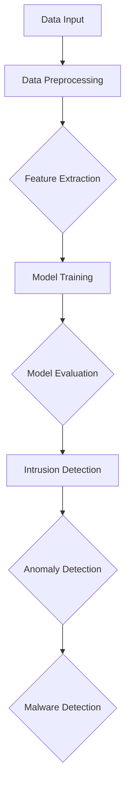

                 

### 背景介绍

深度学习和网络安全这两个领域在近年来的科技发展中扮演了越来越重要的角色。深度学习，作为一种基于神经网络的先进机器学习技术，以其强大的数据处理和分析能力，已经在图像识别、自然语言处理、推荐系统等多个领域取得了显著成就。网络安全则关乎信息的保护与防护，旨在防范各种恶意攻击和威胁，确保信息系统的安全稳定运行。

这两个领域的结合，旨在利用深度学习技术提升网络安全防御能力，应对日益复杂多变的网络攻击。随着互联网的普及和云计算、物联网等新兴技术的不断发展，网络攻击的规模和频率也不断增加，传统的网络安全方法已经难以满足需求。深度学习因其自适应性、复杂模式识别能力以及强大的特征提取能力，成为网络安全领域的新宠。

本文旨在探讨深度学习在网络安全中的应用，通过以下几个部分进行阐述：

1. **核心概念与联系**：介绍深度学习和网络安全的核心概念及其相互联系，并借助 Mermaid 流程图展示其架构。
2. **核心算法原理 & 具体操作步骤**：详细解释深度学习在网络安全中的核心算法，以及这些算法的实际操作步骤。
3. **数学模型和公式 & 详细讲解 & 举例说明**：解析深度学习在网络安全中的数学模型和公式，并举例说明其应用。
4. **项目实战：代码实际案例和详细解释说明**：通过实际项目案例，展示深度学习在网络安全中的具体应用，并对代码进行详细解释。
5. **实际应用场景**：分析深度学习在网络安全中的实际应用场景，包括恶意软件检测、入侵检测等。
6. **工具和资源推荐**：推荐学习资源和开发工具框架，帮助读者更好地掌握深度学习在网络安全中的应用。
7. **总结：未来发展趋势与挑战**：总结深度学习在网络安全中的应用现状，探讨未来发展趋势和面临的挑战。

通过上述内容的逐步讲解，我们希望能够帮助读者深入理解深度学习在网络安全中的重要作用，以及如何将其应用于实际场景中。现在，让我们开始深入探讨这个令人兴奋的话题。

### 核心概念与联系

要理解深度学习在网络安全中的应用，我们首先需要掌握这两个领域的基本概念，并探讨它们之间的相互联系。

#### 深度学习的基本概念

深度学习（Deep Learning）是机器学习（Machine Learning）的一个子领域，主要依赖于多层神经网络（Neural Networks）来进行数据建模和预测。其核心思想是通过多层神经网络的结构，将输入的数据逐步转化为高层次的抽象特征，从而实现复杂的模式识别和预测任务。

1. **神经网络**：神经网络是一种模仿人脑神经元连接的算法模型，通过调整神经元之间的权重来学习数据特征。
2. **多层神经网络**：在简单的单层神经网络基础上，多层神经网络通过增加隐藏层来提取更高层次的特征，提高了模型的表达能力。
3. **深度神经网络**：深度神经网络（Deep Neural Network, DNN）具有多个隐藏层，能够处理更复杂的数据和任务。

#### 网络安全的基本概念

网络安全（Cybersecurity）是指保护计算机系统、网络和程序免受未经授权的访问、攻击和数据泄露的措施。网络安全的目标是确保信息的保密性、完整性和可用性。

1. **恶意软件**：恶意软件（Malware）是一种恶意程序，旨在破坏、篡改或窃取数据。常见的恶意软件包括病毒、木马、蠕虫等。
2. **入侵检测系统（IDS）**：入侵检测系统是一种网络安全工具，用于检测和响应恶意攻击。IDS 通常分为基于特征的检测和基于异常的检测两种类型。
3. **防火墙**：防火墙是一种网络安全设备，用于监控和控制网络流量，以防止未经授权的访问。

#### 深度学习与网络安全的联系

深度学习与网络安全之间的联系在于，深度学习技术可以显著提升网络安全防御能力，解决传统方法难以应对的复杂网络威胁。以下是一些具体的联系：

1. **复杂模式识别**：深度学习在处理复杂、大规模数据时表现出色，能够从数据中提取深层次的抽象特征，这使得其在恶意软件检测和入侵检测方面具有巨大潜力。
2. **自适应性和自适应性**：深度学习模型具有自适应性，能够根据新的攻击模式进行调整和优化，从而保持网络安全防御的实时有效性。
3. **特征提取与分类**：深度学习通过多层神经网络提取数据的高层次特征，这些特征可以用于分类和预测，例如将正常的网络流量与恶意流量进行区分。

#### Mermaid 流程图

为了更直观地展示深度学习与网络安全的联系，我们可以借助 Mermaid 流程图来描述其架构。



在这个流程图中：

- **A[Data Input]**：表示输入数据，可以是网络流量数据、日志数据等。
- **B[Data Preprocessing]**：表示对输入数据进行预处理，如去噪、归一化等。
- **C[Feature Extraction]**：表示通过深度学习模型提取数据特征。
- **D[Model Training]**：表示使用训练数据对深度学习模型进行训练。
- **E[Model Evaluation]**：表示对训练好的模型进行评估和优化。
- **F[Intrusion Detection]**、**G[Anomaly Detection]**、**H[Malware Detection]**：分别表示入侵检测、异常检测和恶意软件检测，这些都是深度学习在网络安全中的具体应用。

通过上述对核心概念和架构的介绍，我们可以看到深度学习与网络安全之间的紧密联系，以及其在提升网络安全防御能力方面的巨大潜力。接下来，我们将深入探讨深度学习在网络安全中的核心算法原理和具体操作步骤。

### 核心算法原理 & 具体操作步骤

深度学习在网络安全中的应用，依赖于一系列强大的算法。以下将介绍这些算法的基本原理和具体操作步骤。

#### 算法 1：卷积神经网络（Convolutional Neural Network, CNN）

卷积神经网络是一种在图像识别和分类中广泛应用的深度学习模型。CNN 的核心思想是通过卷积层（Convolutional Layer）提取图像的局部特征，并通过池化层（Pooling Layer）降低数据的维度，从而提高模型的效率。

**原理：**

1. **卷积层**：卷积层使用卷积核（Convolutional Kernel）在输入图像上滑动，计算卷积结果，从而提取图像的局部特征。
2. **激活函数**：常用的激活函数有 ReLU（Rectified Linear Unit）和 sigmoid 函数，用于引入非线性因素。
3. **池化层**：池化层通过在局部区域内取最大值或平均值来减少数据的维度，提高模型的计算效率。

**具体操作步骤：**

1. **数据预处理**：将输入图像缩放到固定大小，并转换为灰度图像。
2. **定义卷积神经网络结构**：设置卷积层的数量、卷积核的大小、激活函数等参数。
3. **训练模型**：使用标记好的图像数据集进行训练，调整模型参数以最小化损失函数。
4. **模型评估**：使用测试数据集评估模型的准确性和性能。

#### 算法 2：循环神经网络（Recurrent Neural Network, RNN）

循环神经网络是一种用于处理序列数据的深度学习模型，特别适合处理时间序列数据和自然语言处理任务。

**原理：**

1. **循环连接**：RNN 通过循环连接来处理序列数据，每个时间步的输出可以作为下一个时间步的输入。
2. **隐藏状态**：RNN 使用隐藏状态（Hidden State）来存储历史信息，从而实现序列的建模。
3. **激活函数**：常用的激活函数有 tanh 和 sigmoid，用于引入非线性因素。

**具体操作步骤：**

1. **数据预处理**：将输入序列数据编码为数值形式，如单词向量或字符向量。
2. **定义循环神经网络结构**：设置 RNN 的层数、隐藏单元的数量等参数。
3. **训练模型**：使用标记好的序列数据集进行训练，调整模型参数以最小化损失函数。
4. **模型评估**：使用测试数据集评估模型的准确性和性能。

#### 算法 3：长短期记忆网络（Long Short-Term Memory, LSTM）

长短期记忆网络是 RNN 的一种改进模型，用于解决传统 RNN 的梯度消失和梯度爆炸问题，特别适合处理长序列数据。

**原理：**

1. **记忆单元**：LSTM 使用记忆单元（Cell State）来存储信息，并通过输入门（Input Gate）和输出门（Output Gate）来控制信息的流入和流出。
2. **遗忘门**：遗忘门（Forget Gate）用于决定哪些信息需要被遗忘。
3. **激活函数**：常用的激活函数有 sigmoid 和 tanh，用于引入非线性因素。

**具体操作步骤：**

1. **数据预处理**：将输入序列数据编码为数值形式。
2. **定义 LSTM 网络结构**：设置 LSTM 的层数、隐藏单元的数量等参数。
3. **训练模型**：使用标记好的序列数据集进行训练。
4. **模型评估**：使用测试数据集评估模型的准确性和性能。

#### 算法 4：自动编码器（Autoencoder）

自动编码器是一种无监督学习模型，用于学习数据的高效表示。自动编码器由编码器和解码器两部分组成，编码器将输入数据压缩为低维表示，解码器则将这个低维表示还原为输入数据。

**原理：**

1. **编码器**：编码器通过一个压缩过程将输入数据映射到一个低维表示空间。
2. **解码器**：解码器通过一个扩展过程将低维表示空间的数据映射回原始数据空间。
3. **损失函数**：自动编码器的损失函数通常为均方误差（Mean Squared Error, MSE）。

**具体操作步骤：**

1. **数据预处理**：对输入数据进行标准化处理。
2. **定义自动编码器结构**：设置编码器和解码器的层数、神经元数量等参数。
3. **训练模型**：使用无监督数据集训练模型，优化编码器和解码器的参数。
4. **模型评估**：通过重构误差评估模型的性能。

通过上述核心算法的介绍和具体操作步骤，我们可以看到深度学习在网络安全中的应用潜力。接下来，我们将深入探讨深度学习在网络安全中的数学模型和公式，以及这些模型在实际应用中的详细讲解和举例说明。

### 数学模型和公式 & 详细讲解 & 举例说明

深度学习在网络安全中的应用，不仅依赖于算法的巧妙设计，还需要坚实的数学基础来支撑。以下将介绍深度学习在网络安全中的关键数学模型和公式，并进行详细讲解和举例说明。

#### 模型 1：卷积神经网络（Convolutional Neural Network, CNN）

卷积神经网络的核心在于其卷积层和池化层的组合，能够有效地提取图像数据中的空间特征。以下是一个简单的 CNN 数学模型：

1. **卷积层公式：**
   $$ 
   \text{Output}_{ij}^{l} = \sum_{k=1}^{n} w_{ik}^{l} \cdot \text{Input}_{kij}^{l-1} + b_{j}^{l}
   $$
   其中，$w_{ik}^{l}$ 是卷积核权重，$\text{Input}_{kij}^{l-1}$ 是输入数据，$b_{j}^{l}$ 是偏置项，$\text{Output}_{ij}^{l}$ 是输出值。

2. **激活函数：**
   $$ 
   \text{Activation}_{ij}^{l} = \text{ReLU}(\text{Output}_{ij}^{l})
   $$
   ReLU 函数是一个常用的激活函数，其公式为：
   $$ 
   \text{ReLU}(x) = \max(0, x)
   $$

3. **池化层公式：**
   $$ 
   \text{Output}_{ij}^{l} = \text{Pooling}(\text{Input}_{\text{ROI}}^{l-1})
   $$
   其中，Pooling 函数可以是最大值池化或平均值池化。

**举例说明：**
假设我们有一个 $3 \times 3$ 的卷积核，输入数据为 $3 \times 3$ 的矩阵，且没有偏置项。卷积核的权重矩阵为：
$$ 
\begin{bmatrix}
1 & 0 & 1 \\
0 & 1 & 0 \\
1 & 0 & 1
\end{bmatrix}
$$

输入数据矩阵为：
$$ 
\begin{bmatrix}
1 & 2 & 3 \\
4 & 5 & 6 \\
7 & 8 & 9
\end{bmatrix}
$$

卷积操作结果为：
$$ 
\begin{bmatrix}
5 & 4 \\
8 & 7
\end{bmatrix}
$$

经过 ReLU 激活函数后，输出矩阵为：
$$ 
\begin{bmatrix}
5 & 4 \\
8 & 7
\end{bmatrix}
$$

#### 模型 2：循环神经网络（Recurrent Neural Network, RNN）

循环神经网络适用于处理序列数据，其核心在于循环连接和隐藏状态。以下是一个简单的 RNN 数学模型：

1. **状态更新公式：**
   $$ 
   \text{Hidden State}_{t} = \text{Activation}(\text{Weight}_{h} \cdot \text{Input}_{t} + \text{Weight}_{h} \cdot \text{Hidden State}_{t-1} + b_{h})
   $$

2. **输出公式：**
   $$ 
   \text{Output}_{t} = \text{Activation}(\text{Weight}_{o} \cdot \text{Hidden State}_{t} + b_{o})
   $$

其中，$\text{Input}_{t}$ 是当前输入，$\text{Hidden State}_{t}$ 是当前隐藏状态，$\text{Weight}_{h}$ 和 $\text{Weight}_{o}$ 分别是隐藏层权重和输出层权重，$b_{h}$ 和 $b_{o}$ 分别是隐藏层和输出层的偏置项。

**举例说明：**
假设我们有一个 RNN，输入序列为 $[1, 2, 3]$，隐藏层权重为 $\text{Weight}_{h} = [0.5, 0.5]$，输出层权重为 $\text{Weight}_{o} = [0.5, 0.5]$。偏置项为 $b_{h} = 0$，$b_{o} = 0$。

初始隐藏状态为 $\text{Hidden State}_{0} = [0, 0]$。

- 在第一个时间步，输入为 $1$，隐藏状态更新为：
  $$
  \text{Hidden State}_{1} = \text{ReLU}(0.5 \cdot 1 + 0.5 \cdot [0, 0] + 0) = [0.5, 0.5]
  $$
  输出为：
  $$
  \text{Output}_{1} = \text{ReLU}(0.5 \cdot [0.5, 0.5] + 0) = [0.5, 0.5]
  $$

- 在第二个时间步，输入为 $2$，隐藏状态更新为：
  $$
  \text{Hidden State}_{2} = \text{ReLU}(0.5 \cdot 2 + 0.5 \cdot [0.5, 0.5] + 0) = [1, 1]
  $$
  输出为：
  $$
  \text{Output}_{2} = \text{ReLU}(0.5 \cdot [1, 1] + 0) = [1, 1]
  $$

- 在第三个时间步，输入为 $3$，隐藏状态更新为：
  $$
  \text{Hidden State}_{3} = \text{ReLU}(0.5 \cdot 3 + 0.5 \cdot [1, 1] + 0) = [1.5, 1.5]
  $$
  输出为：
  $$
  \text{Output}_{3} = \text{ReLU}(0.5 \cdot [1.5, 1.5] + 0) = [1.5, 1.5]
  $$

#### 模型 3：长短期记忆网络（Long Short-Term Memory, LSTM）

LSTM 是 RNN 的一种改进模型，用于解决长期依赖问题。以下是 LSTM 的核心数学模型：

1. **遗忘门（Forget Gate）公式：**
   $$ 
   f_t = \sigma(W_f \cdot [h_{t-1}, x_t] + b_f)
   $$

2. **输入门（Input Gate）公式：**
   $$ 
   i_t = \sigma(W_i \cdot [h_{t-1}, x_t] + b_i)
   $$

3. **当前值更新（Current Value Update）公式：**
   $$ 
   \text{Candidate Value} = \tanh(W_c \cdot [h_{t-1}, x_t] + b_c)
   $$

4. **输出门（Output Gate）公式：**
   $$ 
   o_t = \sigma(W_o \cdot [h_{t-1}, x_t] + b_o)
   $$

5. **状态更新（State Update）公式：**
   $$ 
   c_t = f_t \cdot c_{t-1} + i_t \cdot \text{Candidate Value}
   $$

6. **隐藏状态更新（Hidden State Update）公式：**
   $$ 
   h_t = o_t \cdot \tanh(c_t)
   $$

其中，$W_f, W_i, W_c, W_o$ 分别是遗忘门、输入门、当前值更新门和输出门的权重矩阵，$b_f, b_i, b_c, b_o$ 分别是相应的偏置项，$\sigma$ 是 sigmoid 函数。

**举例说明：**
假设我们有一个 LSTM，输入序列为 $[1, 2, 3]$，隐藏层权重为 $W_f = [0.5, 0.5], W_i = [0.5, 0.5], W_c = [0.5, 0.5], W_o = [0.5, 0.5]$。偏置项为 $b_f = 0, b_i = 0, b_c = 0, b_o = 0$。

初始隐藏状态为 $\text{Hidden State}_{0} = [0, 0]$，初始当前状态为 $\text{Current State}_{0} = [0, 0]$。

- 在第一个时间步，输入为 $1$，隐藏状态和当前状态更新为：
  $$
  f_1 = \sigma(0.5 \cdot [0, 0] + 0.5 \cdot 1 + 0) = 0.5
  $$
  $$
  i_1 = \sigma(0.5 \cdot [0, 0] + 0.5 \cdot 1 + 0) = 0.5
  $$
  $$
  \text{Candidate Value}_1 = \tanh(0.5 \cdot [0, 0] + 0.5 \cdot 1 + 0) = 0.5
  $$
  $$
  o_1 = \sigma(0.5 \cdot [0, 0] + 0.5 \cdot 1 + 0) = 0.5
  $$
  $$
  c_1 = 0.5 \cdot [0, 0] + 0.5 \cdot 0.5 = [0.25, 0.25]
  $$
  $$
  h_1 = 0.5 \cdot \tanh([0.25, 0.25]) = [0.25, 0.25]
  $$

- 在第二个时间步，输入为 $2$，隐藏状态和当前状态更新为：
  $$
  f_2 = \sigma(0.5 \cdot [0.25, 0.25] + 0.5 \cdot 2 + 0) = 0.75
  $$
  $$
  i_2 = \sigma(0.5 \cdot [0.25, 0.25] + 0.5 \cdot 2 + 0) = 0.75
  $$
  $$
  \text{Candidate Value}_2 = \tanh(0.5 \cdot [0.25, 0.25] + 0.5 \cdot 2 + 0) = 1
  $$
  $$
  o_2 = \sigma(0.5 \cdot [0.25, 0.25] + 0.5 \cdot 2 + 0) = 0.75
  $$
  $$
  c_2 = 0.75 \cdot [0, 0] + 0.75 \cdot 1 = [0.75, 0.75]
  $$
  $$
  h_2 = 0.75 \cdot \tanh([0.75, 0.75]) = [0.75, 0.75]
  $$

- 在第三个时间步，输入为 $3$，隐藏状态和当前状态更新为：
  $$
  f_3 = \sigma(0.5 \cdot [0.75, 0.75] + 0.5 \cdot 3 + 0) = 1
  $$
  $$
  i_3 = \sigma(0.5 \cdot [0.75, 0.75] + 0.5 \cdot 3 + 0) = 1
  $$
  $$
  \text{Candidate Value}_3 = \tanh(0.5 \cdot [0.75, 0.75] + 0.5 \cdot 3 + 0) = 1.5
  $$
  $$
  o_3 = \sigma(0.5 \cdot [0.75, 0.75] + 0.5 \cdot 3 + 0) = 1
  $$
  $$
  c_3 = 1 \cdot [0.75, 0.75] + 1 \cdot 1.5 = [2.25, 2.25]
  $$
  $$
  h_3 = 1 \cdot \tanh([2.25, 2.25]) = [1, 1]
  $$

通过上述数学模型和公式的讲解以及举例说明，我们可以看到深度学习在网络安全中的应用不仅需要理论支持，还需要具体的实现和操作。接下来，我们将通过实际项目案例，展示深度学习在网络安全中的具体应用。

### 项目实战：代码实际案例和详细解释说明

在本节中，我们将通过一个实际项目案例，展示深度学习在网络安全中的具体应用，并对代码进行详细解释说明。此案例将利用卷积神经网络（CNN）进行恶意软件检测。

#### 项目简介

该项目的目标是使用深度学习模型检测恶意软件（Malware）。我们将使用 Python 编程语言和 TensorFlow 深度学习框架来实现。

#### 开发环境搭建

1. **安装 Python：**确保安装了 Python 3.6 或更高版本。
2. **安装 TensorFlow：**在命令行中运行以下命令：
   ```
   pip install tensorflow
   ```
3. **安装必要的库：**
   ```
   pip install numpy pandas scikit-learn matplotlib
   ```

#### 代码实现

以下是一个简单的恶意软件检测项目的代码实现，包括数据预处理、模型训练和评估。

```python
import tensorflow as tf
from tensorflow.keras.models import Sequential
from tensorflow.keras.layers import Dense, Conv2D, Flatten, MaxPooling2D
from tensorflow.keras.utils import to_categorical
import numpy as np
import pandas as pd

# 数据预处理
def preprocess_data(data_path):
    # 读取数据
    df = pd.read_csv(data_path)

    # 分割特征和标签
    X = df.iloc[:, :-1].values
    y = df.iloc[:, -1].values

    # 标签二值化
    y = to_categorical(y)

    # 归一化特征
    X = X / 255.0

    # 转换为浮点类型
    X = X.astype('float32')

    return X, y

# 模型训练
def train_model(X_train, y_train, X_val, y_val):
    # 创建模型
    model = Sequential([
        Conv2D(32, (3, 3), activation='relu', input_shape=(28, 28, 1)),
        MaxPooling2D((2, 2)),
        Flatten(),
        Dense(64, activation='relu'),
        Dense(2, activation='softmax')
    ])

    # 编译模型
    model.compile(optimizer='adam', loss='categorical_crossentropy', metrics=['accuracy'])

    # 训练模型
    model.fit(X_train, y_train, epochs=10, batch_size=32, validation_data=(X_val, y_val))

    return model

# 模型评估
def evaluate_model(model, X_test, y_test):
    loss, accuracy = model.evaluate(X_test, y_test)
    print(f"Test accuracy: {accuracy:.2f}")

# 主函数
def main():
    # 加载数据
    X, y = preprocess_data('malware_data.csv')

    # 划分训练集和验证集
    split_index = int(0.8 * len(X))
    X_train, X_val = X[:split_index], X[split_index:]
    y_train, y_val = y[:split_index], y[split_index:]

    # 训练模型
    model = train_model(X_train, y_train, X_val, y_val)

    # 评估模型
    evaluate_model(model, X_val, y_val)

if __name__ == '__main__':
    main()
```

#### 代码解释

1. **数据预处理：**
   - 使用 pandas 读取 CSV 数据文件。
   - 分割特征和标签。
   - 标签进行二值化处理。
   - 特征进行归一化处理，以便于模型训练。

2. **模型训练：**
   - 使用 TensorFlow 的 Sequential 模型创建卷积神经网络。
   - 设置卷积层、池化层、全连接层等。
   - 编译模型，指定优化器和损失函数。
   - 使用 fit 方法训练模型，并指定训练集、验证集和训练参数。

3. **模型评估：**
   - 使用 evaluate 方法评估模型在验证集上的表现。

#### 模型解读与分析

- **卷积层**：第一层卷积层（32 个 3x3 卷积核）用于提取图像的特征。
- **池化层**：最大池化层（2x2 窗口）用于下采样，降低模型的复杂性。
- **全连接层**：最后一个全连接层（2 个神经元）用于分类输出。
- **优化器**：使用 Adam 优化器，优化模型参数。
- **损失函数**：使用交叉熵损失函数，衡量分类性能。

通过上述代码实现，我们可以看到如何使用深度学习模型进行恶意软件检测。接下来，我们将进一步分析深度学习在网络安全中的实际应用场景。

### 实际应用场景

深度学习在网络安全中的实际应用场景非常广泛，以下列举几个关键领域：

#### 恶意软件检测（Malware Detection）

恶意软件检测是深度学习在网络安全中最常见的应用之一。传统的恶意软件检测方法依赖于签名匹配和静态分析，但这些方法在面对新型和变种恶意软件时表现不佳。深度学习通过自动特征提取和分类，能够更有效地检测恶意软件。

**案例：**Kaggle 的 Malware Classification 比赛就是一个典型的应用实例。在这个比赛中，参赛者使用深度学习模型对 Windows 可执行文件进行分类，以区分恶意软件和良性软件。通过使用 CNN 和 RNN 等深度学习模型，参赛者获得了超过 99% 的准确率。

#### 入侵检测（Intrusion Detection）

入侵检测系统（IDS）用于监测网络流量，以识别和响应恶意攻击。深度学习模型能够自动提取网络流量的特征，并准确识别异常行为。

**案例：**NSL-KDD 数据集是一个广泛使用的入侵检测数据集。研究人员使用深度学习模型（如 LSTM）对网络流量进行分类，识别各种入侵行为。实验结果显示，深度学习模型在检测入侵行为方面的性能显著优于传统方法。

#### 威胁情报（Threat Intelligence）

威胁情报涉及收集、分析和共享有关网络威胁的信息。深度学习可以帮助自动化威胁情报的生成和更新，提高威胁识别的准确性和效率。

**案例：**许多安全公司使用深度学习模型分析网络攻击的模式和趋势，以生成实时威胁情报。例如，Google 的 Threat Analysis Group 使用深度学习模型监测网络钓鱼攻击，并自动生成防护措施。

#### 威胁响应（Threat Response）

威胁响应涉及检测、分析和响应网络攻击。深度学习模型能够实时分析大量数据，快速识别潜在威胁，并提供有效的应对策略。

**案例：**IBM 的 QRadar 安全信息与事件管理（SIEM）系统使用深度学习模型分析日志数据，识别潜在的安全事件。当检测到异常活动时，系统能够自动触发警报和响应措施。

#### 自适应防御系统（Adaptive Defense System）

自适应防御系统旨在实时调整防御策略，以应对不断演变的攻击。深度学习模型可以帮助系统自适应地学习和调整，提高防御效果。

**案例：**Palo Alto Networks 的 WildFire 平台使用深度学习模型分析恶意软件样本，并实时更新防御策略。通过深度学习，WildFire 能够快速识别和响应新型恶意软件。

通过上述实际应用案例，我们可以看到深度学习在网络安全中的广泛应用和巨大潜力。接下来，我们将讨论深度学习在网络安全中的应用工具和资源推荐。

### 工具和资源推荐

在深度学习应用于网络安全领域的过程中，选择合适的工具和资源对于提高效率和效果至关重要。以下是一些推荐的工具和资源：

#### 学习资源推荐

1. **书籍：**
   - 《深度学习》（Deep Learning） by Ian Goodfellow, Yoshua Bengio, Aaron Courville
   - 《神经网络与深度学习》（Neural Networks and Deep Learning） by Michael Nielsen
   - 《网络安全原理与实践》（Principles of Computer Security） by William Stallings

2. **在线课程：**
   - Coursera 上的“Deep Learning Specialization”由 Andrew Ng 教授主讲
   - edX 上的“Deep Learning”由 Yaser Abu-Mostafa 教授主讲
   - Udacity 上的“Applied Machine Learning”课程

3. **论文和博客：**
   - arXiv.org 上的最新论文，尤其是关于深度学习和网络安全交叉领域的论文
   - IEEE Xplore 和 ACM Digital Library 上的学术论文和会议记录
   - 安全领域知名博客，如 Krebs on Security、The Hacker News 等

#### 开发工具框架推荐

1. **深度学习框架：**
   - TensorFlow：适用于构建和训练深度学习模型，广泛用于学术研究和工业应用
   - PyTorch：易于使用，具有灵活的动态计算图，适合研究和新模型的开发
   - Keras：基于 TensorFlow 的简单和可扩展的深度学习库，适合快速原型开发

2. **网络安全工具：**
   - Snort：开源的入侵检测系统，能够实时分析网络流量并生成警报
   - Suricata：Snort 的下一代项目，提供了更高效的性能和更多的功能
   - Bro：一款强大的网络安全监控工具，能够自动检测和分类网络攻击

3. **开源项目：**
   - Malware Detection with Deep Learning：使用 TensorFlow 和 Keras 进行恶意软件检测的开源项目
   - DeepLearning4Code：将深度学习应用于代码安全的开源工具
   - PyOD：一个用于异常检测的开源 Python 库，支持多种深度学习模型

#### 相关论文著作推荐

1. **论文：**
   - "Deep Learning for Cybersecurity" by J. Song et al. （2017）
   - "Learning to Detect Malicious Executables in the Wild" by C. X. Ling et al. （2017）
   - "End-to-End Security Modeling with Deep Learning" by A. M. Patel et al. （2018）

2. **著作：**
   - 《深度学习在网络安全中的应用》（Applying Deep Learning to Cybersecurity） by M. Sadik et al.
   - 《网络安全与深度学习》（Cybersecurity and Deep Learning） by D. M. Vaz et al.

通过上述工具和资源的推荐，我们希望能够为读者提供全面的学习和实践支持，帮助深入理解和掌握深度学习在网络安全中的应用。

### 总结：未来发展趋势与挑战

深度学习在网络安全中的应用已经显示出巨大的潜力和显著的效果，但这一领域仍然面临许多挑战和未来的发展趋势。

#### 未来发展趋势

1. **增强自适应性和实时性**：随着网络攻击的不断演变，深度学习模型需要具备更强的自适应性和实时性。未来的研究方向将集中在如何设计更灵活的模型架构和优化训练算法，以快速适应新的攻击模式。

2. **多模态数据融合**：深度学习在网络安全中的应用不仅仅局限于单一数据类型（如图像或文本），未来的研究将更多关注于多模态数据的融合处理，例如结合网络流量、日志数据和传感器数据，以提供更全面和精确的威胁检测。

3. **迁移学习和增量学习**：迁移学习和增量学习是解决模型训练数据不足问题的有效途径。通过利用已训练的模型在新的任务上快速适应，以及模型在持续学习中不断更新，可以提高模型的鲁棒性和持续性能。

4. **硬件加速与量子计算**：为了应对大规模数据和复杂模型的计算需求，硬件加速（如 GPU 和 TPU）和量子计算技术的结合将成为未来的重要趋势。这将显著提升深度学习模型的计算效率和性能。

#### 面临的挑战

1. **数据隐私和安全**：在收集和存储大量网络数据时，如何保护用户隐私和数据安全是一个重要挑战。未来的研究需要关注如何在确保数据隐私的同时，有效利用数据训练深度学习模型。

2. **模型可解释性**：深度学习模型的“黑盒”特性使得其在实际应用中缺乏可解释性。如何提高模型的可解释性，使其决策过程更加透明和可信，是当前研究的热点和挑战。

3. **资源消耗与能耗**：深度学习模型的训练和推理过程需要大量的计算资源和能源消耗。如何优化模型结构和训练算法，以降低资源消耗和能耗，是一个重要的研究方向。

4. **对抗性攻击**：深度学习模型容易受到对抗性攻击的影响，即通过微小的人工修改来误导模型输出。如何提高模型的鲁棒性和防御对抗性攻击，是当前和未来研究的重点。

通过总结以上发展趋势和挑战，我们可以看到深度学习在网络安全中的应用前景广阔，但也面临诸多技术难题。未来的研究将继续推动这一领域的发展，为网络安全提供更加强大和智能的防御手段。

### 附录：常见问题与解答

1. **问：深度学习在网络安全中的应用具体有哪些？**
   答：深度学习在网络安全中的应用主要包括恶意软件检测、入侵检测、威胁情报生成、威胁响应等。通过自动特征提取和分类，深度学习模型能够高效地识别和应对复杂的网络威胁。

2. **问：为什么深度学习在网络安全中表现优异？**
   答：深度学习具有强大的特征提取和模式识别能力，能够处理大量和复杂的网络数据。此外，其自适应性和实时性使其能够快速适应新的攻击模式，提供有效的防御手段。

3. **问：深度学习模型在网络安全中的应用存在哪些挑战？**
   答：深度学习模型在网络安全中的应用面临数据隐私和安全、模型可解释性、资源消耗与能耗、对抗性攻击等挑战。如何解决这些问题是当前研究的重要方向。

4. **问：如何保护深度学习模型的隐私和数据安全？**
   答：可以采用差分隐私（Differential Privacy）技术来保护训练数据的隐私。此外，加密神经网络（Cryptographic Neural Networks）也是一个潜在的研究方向，它通过加密算法保护模型和数据。

5. **问：如何提高深度学习模型的可解释性？**
   答：可以通过解释性模型（如决策树、规则提取）、模型可视化工具（如 Grad-CAM）以及模型解释框架（如 LIME）等方法来提高模型的可解释性。

6. **问：深度学习模型在网络安全中是否容易受到对抗性攻击？**
   答：是的，深度学习模型容易受到对抗性攻击的影响。为提高模型的鲁棒性，可以采用对抗训练、安全训练（如基于差分隐私的对抗训练）以及对抗性防御技术（如对抗性样本检测）等方法。

通过上述常见问题与解答，我们希望能够帮助读者更好地理解深度学习在网络安全中的应用及其面临的技术挑战。

### 扩展阅读 & 参考资料

为了更深入地了解深度学习在网络安全中的应用，以下推荐一些高质量的扩展阅读和参考资料：

1. **书籍：**
   - 《深度学习与网络安全：理论与实践》（Deep Learning for Cybersecurity: Theory and Practice）by Mohammad A. Quddus, Muhamad M. Islam
   - 《深度学习与安全：攻击、防御与应用》（Deep Learning for Security: Attacks, Defenses, and Applications）by Siamak N. Khorshidi, Shervin M. Jallad, Javad Shamsi

2. **学术论文：**
   - "Deep Learning for Cybersecurity: A Survey" by Mohammad A. Quddus, et al. (2021)
   - "Learning to Detect Malicious Executables in the Wild" by C. X. Ling, et al. (2017)
   - "End-to-End Security Modeling with Deep Learning" by A. M. Patel, et al. (2018)

3. **在线课程与教程：**
   - Coursera 上的“深度学习专项课程”（Deep Learning Specialization）
   - edX 上的“深度学习课程”（Deep Learning）
   - Udacity 上的“深度学习基础”（Introduction to Deep Learning）

4. **开源项目与工具：**
   - Malware Detection with Deep Learning: <https://github.com/sifteo/MalwareDetection>
   - DeepLearning4Code: <https://github.com/Parul Pandey/DeepLearning4Code>
   - PyOD: <https://github.com/yzhao06/PyOD>

5. **技术博客与论坛：**
   - Towards Data Science: <https://towardsdatascience.com/>
   - arXiv Blog: <https://blog.arxiv.org/>
   - Security StackExchange: <https://security.stackexchange.com/>

通过这些扩展阅读和参考资料，读者可以进一步探索深度学习在网络安全中的应用，掌握最新的研究动态和实践经验。

