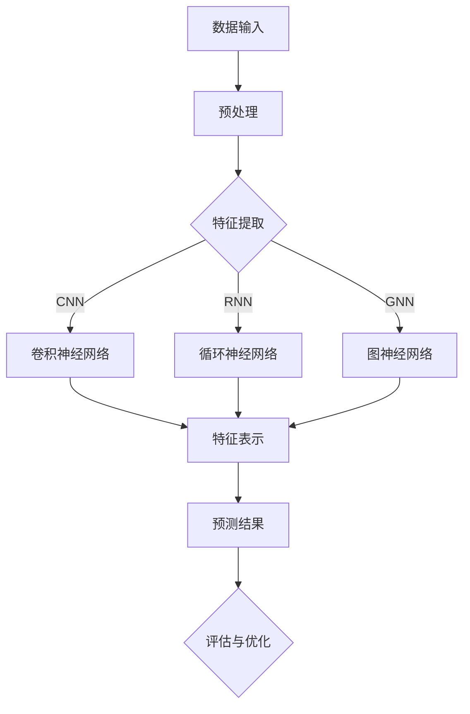

                 

### 背景介绍 Background Introduction

#### 深度学习在生物信息学中的应用

深度学习作为一种强大的机器学习技术，近年来在计算机视觉、自然语言处理等领域取得了显著的突破。随着计算能力的提升和大数据的积累，深度学习在生物信息学领域也逐渐崭露头角，为生物医学研究提供了新的方法和工具。

在生物信息学中，蛋白质功能预测是一个关键问题。蛋白质是生物体的功能执行单元，它们的功能决定了生物体的生理和病理状态。然而，蛋白质的功能通常无法通过实验直接测量，因此，准确预测蛋白质的功能对于理解生物体的基本机制和开发治疗药物具有重要意义。

传统的蛋白质功能预测方法通常依赖于已有知识库和统计模型，这些方法在一定程度上取得了成功，但往往存在预测精度不高、泛化能力不足等问题。深度学习的发展为蛋白质功能预测提供了新的思路，通过自动学习大规模生物数据中的复杂模式，有望显著提高预测的准确性和泛化能力。

#### 蛋白质功能预测的挑战

蛋白质功能预测面临诸多挑战。首先，蛋白质序列的多样性导致预测模型需要处理大量的输入变量。其次，蛋白质功能的复杂性使得单一定义的分类标签难以准确描述。此外，蛋白质与其他生物分子的相互作用网络也增加了预测的难度。

现有的深度学习方法在蛋白质功能预测中已经取得了一些进展，但仍有很大的提升空间。本文将深入探讨深度学习在蛋白质功能预测中的突破性进展，包括核心算法原理、数学模型和具体应用案例，以及未来发展趋势和挑战。

总的来说，深度学习在蛋白质功能预测中的应用不仅有助于提升预测准确性，还能推动生物医学研究的发展，为疾病诊断和治疗提供新的工具。接下来，我们将逐一探讨这些内容，为读者呈现深度学习在蛋白质功能预测领域的精彩世界。

------------------

# {文章标题}

深度学习在蛋白质功能预测中的突破性进展

## {关键词}

深度学习，蛋白质功能预测，生物信息学，生物医学研究，机器学习算法，预测准确性

## {摘要}

本文将深入探讨深度学习在蛋白质功能预测中的突破性进展。首先，我们将介绍深度学习在生物信息学中的应用背景，以及蛋白质功能预测的挑战。随后，我们将详细阐述深度学习在蛋白质功能预测中的核心算法原理，包括卷积神经网络（CNN）、循环神经网络（RNN）等模型的工作机制。接着，我们将通过具体案例，展示深度学习算法在蛋白质功能预测中的应用效果。此外，本文还将讨论深度学习在蛋白质功能预测中的未来发展趋势和挑战，并推荐相关学习资源、开发工具和论文著作，为读者提供全面的学习和实践指导。

------------------

## 1. 背景介绍

### 深度学习与生物信息学的结合

深度学习是一种通过模拟人脑神经网络进行信息处理的机器学习技术，其核心思想是自动从大量数据中学习特征，并利用这些特征进行复杂的模式识别和预测。随着深度学习技术的不断发展，其在各个领域的应用也日益广泛，包括计算机视觉、自然语言处理、语音识别等。

在生物信息学领域，深度学习的应用同样具有巨大的潜力。生物信息学主要关注生物学数据的处理和分析，包括基因组序列分析、蛋白质结构预测、疾病诊断等。这些任务通常涉及到大量的复杂数据和模式，是深度学习技术可以发挥优势的领域。

#### 深度学习在生物信息学中的应用

深度学习在生物信息学中的应用主要包括以下几个方面：

1. **基因组序列分析**：深度学习算法可以用于基因组序列的变异检测、功能预测和基因组注释。例如，通过训练深度神经网络，可以识别基因组中的有害变异，预测蛋白质的功能和结构。

2. **蛋白质结构预测**：蛋白质是生物体的功能执行单元，其结构决定了功能。深度学习算法在蛋白质结构预测中发挥了重要作用，例如，通过训练卷积神经网络（CNN）和循环神经网络（RNN），可以预测蛋白质的三维结构，为药物设计和疾病研究提供重要信息。

3. **疾病诊断**：深度学习在疾病诊断中的应用也取得了显著成果。例如，通过训练深度神经网络，可以识别医学图像中的病变区域，提高疾病诊断的准确性。

4. **蛋白质功能预测**：蛋白质功能预测是生物信息学中的一个重要问题。深度学习算法通过自动学习蛋白质序列中的复杂模式，可以提高预测的准确性和泛化能力。

### 蛋白质功能预测的重要性

蛋白质功能预测在生物医学研究中具有重要意义。蛋白质是生命活动的基本组成部分，它们在细胞信号传递、代谢调控、生物合成等过程中起着关键作用。了解蛋白质的功能有助于揭示生物体的基本机制，为疾病诊断和治疗提供理论基础。

然而，蛋白质功能的预测通常面临诸多挑战。首先，蛋白质序列的多样性使得传统的预测方法难以准确描述。其次，蛋白质功能的复杂性使得单一定义的分类标签难以准确反映其功能。此外，蛋白质与其他生物分子的相互作用网络也增加了预测的难度。

#### 深度学习在蛋白质功能预测中的突破性进展

深度学习技术的发展为蛋白质功能预测提供了新的思路。通过自动学习大规模生物数据中的复杂模式，深度学习算法有望显著提高预测的准确性和泛化能力。

例如，卷积神经网络（CNN）可以用于识别蛋白质序列中的局部模式，循环神经网络（RNN）可以用于处理蛋白质序列的序列依赖关系。此外，图神经网络（GNN）可以用于建模蛋白质与其他生物分子的相互作用网络，进一步提高预测的准确性。

### 总结

深度学习在生物信息学中的应用为蛋白质功能预测带来了新的突破。通过自动学习生物数据中的复杂模式，深度学习算法有望显著提高预测的准确性和泛化能力。本文将详细介绍深度学习在蛋白质功能预测中的应用，包括核心算法原理、数学模型和具体应用案例，为读者呈现深度学习在生物信息学领域的精彩世界。

------------------

### 2. 核心概念与联系

#### 蛋白质功能预测的基本概念

在探讨深度学习在蛋白质功能预测中的应用之前，我们需要先了解一些核心概念。首先，什么是蛋白质功能预测？蛋白质功能预测是指通过分析蛋白质的序列、结构或相互作用等信息，预测蛋白质在生物体中的功能。

蛋白质的功能多样且复杂，可以分为多种类型，如催化活性、结合作用、调控作用等。传统的蛋白质功能预测方法主要包括基于序列的预测、基于结构的预测和基于网络的预测。

- **基于序列的预测**：这种方法通过分析蛋白质序列中的特定模式或位点，预测其功能。例如，一些位点的氨基酸类型可能与特定的功能相关。
- **基于结构的预测**：这种方法利用蛋白质的三维结构信息，通过比较与已知功能蛋白质的结构相似性，预测其功能。
- **基于网络的预测**：这种方法考虑蛋白质与其他生物分子（如蛋白质、DNA、RNA等）的相互作用网络，通过分析网络的拓扑结构，预测蛋白质的功能。

#### 深度学习在蛋白质功能预测中的应用

深度学习是一种强大的机器学习技术，通过模拟人脑神经网络进行信息处理。深度学习在蛋白质功能预测中的应用，主要体现在以下几方面：

1. **特征自动提取**：深度学习算法可以自动从大量数据中学习特征，无需人工设计特征，从而提高预测的准确性和泛化能力。例如，卷积神经网络（CNN）可以用于提取蛋白质序列的局部特征，循环神经网络（RNN）可以用于提取序列依赖特征。
2. **多层次特征表示**：深度学习算法可以将数据表示为多层次的特征，从而捕捉到数据中的复杂模式。例如，在蛋白质序列预测中，可以通过多层神经网络提取蛋白质的序列特征、结构特征和功能特征。
3. **端到端模型**：深度学习算法可以实现端到端模型，直接从输入数据到预测结果，减少中间步骤，提高预测效率。例如，在蛋白质功能预测中，可以通过训练一个深度神经网络，直接从蛋白质序列预测其功能标签。

#### Mermaid 流程图展示

下面使用 Mermaid 语法绘制一个简单的流程图，展示深度学习在蛋白质功能预测中的核心概念和流程：



- **A[数据输入]**：表示蛋白质序列、结构或其他相关数据。
- **B[预处理]**：对输入数据进行处理，包括数据清洗、归一化等。
- **C{特征提取]**：使用深度学习算法自动提取特征。
- **D[卷积神经网络]**、**E[循环神经网络]**、**F[图神经网络]**：三种不同的深度学习模型，用于提取不同类型的特征。
- **G[特征表示]**：将提取到的特征进行整合和表示。
- **H[预测结果]**：根据特征表示进行蛋白质功能预测。
- **I{评估与优化]**：对预测结果进行评估，并根据评估结果进行模型优化。

通过这个流程图，我们可以看到深度学习在蛋白质功能预测中的核心概念和步骤。接下来，我们将深入探讨这些核心算法原理，以及如何实现和优化深度学习模型。

------------------

## 3. 核心算法原理 & 具体操作步骤

### 卷积神经网络（CNN）

卷积神经网络（CNN）是深度学习中一种重要的模型，特别适用于处理图像和序列数据。在蛋白质功能预测中，CNN可以用于提取蛋白质序列的局部特征，从而提高预测的准确性和泛化能力。

#### CNN的基本原理

CNN由多个卷积层、池化层和全连接层组成。每个卷积层通过卷积操作提取特征，而池化层用于减小特征图的尺寸，提高计算效率。最后，全连接层将特征映射到输出结果。

1. **卷积层**：卷积层通过卷积操作提取特征。卷积操作使用一个卷积核（或称为滤波器）与输入特征图进行卷积，生成一个新的特征图。卷积核的大小和数量可以调整，以适应不同的特征提取需求。
   
   $$\text{output}(i,j) = \sum_{k,l} \text{input}(i+k,j+l) \cdot \text{filter}(k,l) + \text{bias}$$

   其中，\( \text{output}(i,j) \) 是输出特征图上的一个像素值，\( \text{input}(i+k,j+l) \) 是输入特征图上的对应像素值，\( \text{filter}(k,l) \) 是卷积核上的一个值，\( \text{bias} \) 是偏置项。

2. **池化层**：池化层用于减小特征图的尺寸，减少模型的参数数量，提高计算效率。常用的池化方法包括最大池化和平均池化。

   最大池化：
   
   $$\text{pool}(i,j) = \max_{k,l} \text{input}(i+k,j+l)$$

   其中，\( \text{pool}(i,j) \) 是输出特征图上的一个像素值。

3. **全连接层**：全连接层将特征映射到输出结果。每个输出节点都与上一个层的所有节点相连。

#### CNN在蛋白质功能预测中的应用

在蛋白质功能预测中，CNN可以用于提取蛋白质序列的局部特征。具体步骤如下：

1. **数据预处理**：对蛋白质序列进行编码，将氨基酸替换为数字表示。例如，可以使用 One-Hot 编码或独热编码。
   
   $$\text{One-Hot}(\text{序列}) = [\text{0,0,1,0,1,0,...}]$$

2. **构建CNN模型**：设计一个CNN模型，包括多个卷积层、池化层和全连接层。例如，可以设计一个包含两个卷积层和一个全连接层的模型：

   ```python
   model = tf.keras.Sequential([
       tf.keras.layers.Conv1D(filters=64, kernel_size=3, activation='relu', input_shape=(seq_len, amino_acid_count)),
       tf.keras.layers.MaxPooling1D(pool_size=2),
       tf.keras.layers.Conv1D(filters=128, kernel_size=3, activation='relu'),
       tf.keras.layers.MaxPooling1D(pool_size=2),
       tf.keras.layers.Flatten(),
       tf.keras.layers.Dense(units=128, activation='relu'),
       tf.keras.layers.Dense(units=num_classes, activation='softmax')
   ])
   ```

3. **训练模型**：使用训练数据集对模型进行训练，优化模型参数。

   ```python
   model.compile(optimizer='adam', loss='categorical_crossentropy', metrics=['accuracy'])
   model.fit(x_train, y_train, epochs=10, batch_size=32, validation_data=(x_val, y_val))
   ```

4. **预测蛋白质功能**：使用训练好的模型对新的蛋白质序列进行预测。

   ```python
   predictions = model.predict(x_test)
   predicted_classes = np.argmax(predictions, axis=1)
   ```

### 循环神经网络（RNN）

循环神经网络（RNN）是一种用于处理序列数据的神经网络。RNN在蛋白质功能预测中可以用于提取蛋白质序列的序列依赖特征。

#### RNN的基本原理

RNN由一系列相互连接的神经元组成，每个神经元的状态依赖于前一个神经元的状态。RNN的核心是隐藏状态（h_t）和隐藏层（h_t）的计算：

$$h_t = \sigma(W_h \cdot [h_{t-1}, x_t] + b_h)$$

$$y_t = \sigma(W_o \cdot h_t + b_o)$$

其中，\( h_t \) 是隐藏状态，\( x_t \) 是输入特征，\( W_h \) 和 \( b_h \) 是隐藏层的权重和偏置，\( W_o \) 和 \( b_o \) 是输出层的权重和偏置，\( \sigma \) 是激活函数。

#### RNN在蛋白质功能预测中的应用

在蛋白质功能预测中，RNN可以用于提取蛋白质序列的序列依赖特征。具体步骤如下：

1. **数据预处理**：对蛋白质序列进行编码，将氨基酸替换为数字表示。例如，可以使用 One-Hot 编码或独热编码。

   $$\text{One-Hot}(\text{序列}) = [\text{0,0,1,0,1,0,...}]$$

2. **构建RNN模型**：设计一个RNN模型，包括一个或多个RNN层和一个全连接层。例如，可以设计一个包含一个RNN层和一个全连接层的模型：

   ```python
   model = tf.keras.Sequential([
       tf.keras.layers.LSTM(units=128, activation='relu', return_sequences=True, input_shape=(seq_len, amino_acid_count)),
       tf.keras.layers.Dense(units=128, activation='relu'),
       tf.keras.layers.Dense(units=num_classes, activation='softmax')
   ])
   ```

3. **训练模型**：使用训练数据集对模型进行训练，优化模型参数。

   ```python
   model.compile(optimizer='adam', loss='categorical_crossentropy', metrics=['accuracy'])
   model.fit(x_train, y_train, epochs=10, batch_size=32, validation_data=(x_val, y_val))
   ```

4. **预测蛋白质功能**：使用训练好的模型对新的蛋白质序列进行预测。

   ```python
   predictions = model.predict(x_test)
   predicted_classes = np.argmax(predictions, axis=1)
   ```

### 图神经网络（GNN）

图神经网络（GNN）是一种用于处理图结构数据的神经网络。在蛋白质功能预测中，GNN可以用于建模蛋白质与其他生物分子的相互作用网络。

#### GNN的基本原理

GNN通过学习图结构中的节点表示和边表示来进行预测。GNN的核心是节点更新函数和边更新函数：

$$h_v^{(t+1)} = \sigma(\sum_{u \in N(v)} W_{uv} h_u^{(t)} + b_v)$$

$$h_e^{(t+1)} = \sigma(\sum_{u,v \in \text{两端}} W_{uv} h_u^{(t)} h_v^{(t)} + b_e)$$

其中，\( h_v^{(t)} \) 和 \( h_e^{(t)} \) 分别是节点和边的表示，\( N(v) \) 是节点的邻居集合，\( W_{uv} \) 是边的权重，\( b_v \) 和 \( b_e \) 是节点和边的偏置，\( \sigma \) 是激活函数。

#### GNN在蛋白质功能预测中的应用

在蛋白质功能预测中，GNN可以用于建模蛋白质与其他生物分子的相互作用网络。具体步骤如下：

1. **数据预处理**：将蛋白质序列转化为图结构，其中节点表示氨基酸，边表示氨基酸之间的相互作用。
2. **构建GNN模型**：设计一个GNN模型，包括多个图卷积层和全连接层。例如，可以设计一个包含两个图卷积层和一个全连接层的模型：
   
   ```python
   model = tf.keras.Sequential([
       tf.keras.layers.GraphConv2D(units=128, activation='relu', input_shape=(seq_len, amino_acid_count)),
       tf.keras.layers.GraphConv2D(units=128, activation='relu'),
       tf.keras.layers.Flatten(),
       tf.keras.layers.Dense(units=128, activation='relu'),
       tf.keras.layers.Dense(units=num_classes, activation='softmax')
   ])
   ```

3. **训练模型**：使用训练数据集对模型进行训练，优化模型参数。

   ```python
   model.compile(optimizer='adam', loss='categorical_crossentropy', metrics=['accuracy'])
   model.fit(x_train, y_train, epochs=10, batch_size=32, validation_data=(x_val, y_val))
   ```

4. **预测蛋白质功能**：使用训练好的模型对新的蛋白质序列进行预测。

   ```python
   predictions = model.predict(x_test)
   predicted_classes = np.argmax(predictions, axis=1)
   ```

通过上述三种深度学习模型（CNN、RNN和GNN），我们可以看到深度学习在蛋白质功能预测中的强大能力。接下来，我们将进一步探讨深度学习在蛋白质功能预测中的实际应用，以及如何优化模型以提高预测性能。

------------------

## 4. 数学模型和公式 & 详细讲解 & 举例说明

### 卷积神经网络（CNN）

卷积神经网络（CNN）的核心在于卷积操作，这一操作在数学上可以表示为滤波器（filter）与输入数据之间的点积（dot product）。以下是卷积操作的详细数学描述：

#### 卷积操作

给定一个输入特征图 \(I_{s_1 \times s_2 \times c}\) 和一个卷积核 \(K_{k_1 \times k_2 \times c}\)，其中 \(s_1, s_2, c\) 分别为特征图的尺寸、滤波器的尺寸和通道数。卷积操作的输出 \(O_{p_1 \times p_2 \times c'}\) 可以表示为：

$$O_{ijc'} = \sum_{i'=0}^{k_1-1} \sum_{j'=0}^{k_2-1} I_{(i+i') \times (j+j')c} \cdot K_{i' \times j' \times c}$$

其中，\(O_{ijc'}\) 是输出特征图上的一个像素值，\(I_{(i+i') \times (j+j')c}\) 是输入特征图上的对应像素值，\(K_{i' \times j' \times c}\) 是卷积核上的一个值。

#### 示例

假设一个 \(3 \times 3\) 的卷积核 \(K\) 与一个 \(5 \times 5\) 的输入特征图 \(I\) 进行卷积，计算输出特征图的一个像素值 \(O_{11}\)：

$$O_{11} = I_{00} \cdot K_{00} + I_{01} \cdot K_{01} + I_{02} \cdot K_{02} + I_{10} \cdot K_{10} + I_{11} \cdot K_{11} + I_{12} \cdot K_{12} + I_{20} \cdot K_{20} + I_{21} \cdot K_{21} + I_{22} \cdot K_{22}$$

其中，输入特征图 \(I\) 和卷积核 \(K\) 如下所示：

$$I = \begin{bmatrix}
1 & 2 & 3 \\
4 & 5 & 6 \\
7 & 8 & 9
\end{bmatrix}$$

$$K = \begin{bmatrix}
0 & 1 & 0 \\
1 & 0 & 1 \\
0 & 1 & 0
\end{bmatrix}$$

计算输出特征图的一个像素值 \(O_{11}\)：

$$O_{11} = (1 \cdot 0 + 2 \cdot 1 + 3 \cdot 0) + (4 \cdot 1 + 5 \cdot 0 + 6 \cdot 1) + (7 \cdot 0 + 8 \cdot 1 + 9 \cdot 0) = 2 + 6 + 8 = 16$$

### 循环神经网络（RNN）

循环神经网络（RNN）的核心在于其状态转移函数，这一函数在数学上可以表示为隐藏状态 \(h_t\) 和输入特征 \(x_t\) 的线性组合，并通过激活函数进行非线性变换。以下是RNN的状态转移函数的详细数学描述：

#### 状态转移函数

给定一个输入特征 \(x_t\) 和前一个隐藏状态 \(h_{t-1}\)，当前隐藏状态 \(h_t\) 可以表示为：

$$h_t = \sigma(W_h \cdot [h_{t-1}, x_t] + b_h)$$

其中，\(W_h\) 是权重矩阵，\(b_h\) 是偏置项，\(\sigma\) 是激活函数（通常使用Sigmoid或ReLU函数）。

#### 示例

假设一个输入特征 \(x_t\) 为 \(1\)，前一个隐藏状态 \(h_{t-1}\) 为 \(2\)，权重矩阵 \(W_h\) 为 \(3\)，偏置项 \(b_h\) 为 \(4\)。使用Sigmoid函数作为激活函数，计算当前隐藏状态 \(h_t\)：

$$h_t = \sigma(3 \cdot [2, 1] + 4) = \sigma(3 \cdot 2 + 3 \cdot 1 + 4) = \sigma(13) = \frac{1}{1 + e^{-13}} \approx 0.9999$$

### 图神经网络（GNN）

图神经网络（GNN）的核心在于其图卷积操作，这一操作在数学上可以表示为节点与其邻居节点的特征线性组合，并通过聚合函数进行非线性变换。以下是GNN的图卷积操作的详细数学描述：

#### 图卷积操作

给定一个节点 \(v\) 的特征 \(h_v\) 和其邻居节点 \(u\) 的特征 \(h_u\)，以及邻接矩阵 \(A_{ij}\)，节点 \(v\) 的更新特征 \(h_v^{(t+1)}\) 可以表示为：

$$h_v^{(t+1)} = \sigma(\sum_{u \in N(v)} A_{uv} h_u^{(t)} + b_v)$$

其中，\(N(v)\) 是节点 \(v\) 的邻居节点集合，\(A_{uv}\) 是邻接矩阵上的一个元素，\(b_v\) 是节点 \(v\) 的偏置项，\(\sigma\) 是激活函数。

#### 示例

假设一个节点 \(v\) 的邻居节点集合 \(N(v) = \{u_1, u_2, u_3\}\)，邻接矩阵 \(A\) 如下所示：

$$A = \begin{bmatrix}
0 & 1 & 0 \\
1 & 0 & 1 \\
0 & 1 & 0
\end{bmatrix}$$

节点 \(v\) 的邻居节点 \(u_1, u_2, u_3\) 的特征分别为 \(h_{u_1} = 1\), \(h_{u_2} = 2\), \(h_{u_3} = 3\)，权重矩阵 \(W\) 为 \(1\)，偏置项 \(b_v\) 为 \(1\)。使用ReLU函数作为激活函数，计算节点 \(v\) 的更新特征 \(h_v^{(t+1)}\)：

$$h_v^{(t+1)} = \sigma(1 \cdot 1 + 1 \cdot 2 + 1 \cdot 3 + 1) = \sigma(7) = \max(7, 0) = 7$$

通过上述数学模型和公式的详细讲解与示例，我们可以看到卷积神经网络（CNN）、循环神经网络（RNN）和图神经网络（GNN）在蛋白质功能预测中的应用和实现。这些深度学习模型通过自动学习复杂的生物数据模式，有望提高蛋白质功能预测的准确性和泛化能力。

------------------

### 5. 项目实战：代码实际案例和详细解释说明

#### 开发环境搭建

在进行深度学习在蛋白质功能预测的实际应用之前，我们需要搭建一个合适的开发环境。以下是搭建环境的基本步骤：

1. **安装Python**：首先确保您的计算机上安装了Python。Python是深度学习应用的主要编程语言。如果尚未安装，请从Python官方网站（<https://www.python.org/>）下载并安装适合您操作系统的Python版本。

2. **安装深度学习库**：接下来，我们需要安装一些常用的深度学习库，如TensorFlow、Keras等。可以通过以下命令进行安装：

   ```shell
   pip install tensorflow
   pip install keras
   ```

3. **安装生物信息学库**：此外，我们还需要安装一些用于生物信息学数据处理的库，如BioPython。可以通过以下命令进行安装：

   ```shell
   pip install biopython
   ```

4. **数据集准备**：为了进行蛋白质功能预测，我们需要一个包含蛋白质序列和对应功能标签的数据集。常用的数据集有UNIPROT数据库中的蛋白质序列及其功能标签。可以从UNIPROT官方网站下载所需数据，并进行预处理，提取蛋白质序列和功能标签。

#### 源代码详细实现和代码解读

以下是一个简单的深度学习蛋白质功能预测项目的源代码实现。我们将使用Keras构建一个基于卷积神经网络的蛋白质功能预测模型，并进行训练和预测。

```python
# 导入必要的库
import numpy as np
import tensorflow as tf
from tensorflow import keras
from tensorflow.keras.models import Sequential
from tensorflow.keras.layers import Conv1D, MaxPooling1D, Flatten, Dense
from tensorflow.keras.utils import to_categorical
from biopython import SeqIO

# 加载数据
def load_data(filename):
    sequences = []
    labels = []

    with open(filename, 'r') as f:
        for line in f:
            parts = line.strip().split('\t')
            sequence = parts[0]
            label = parts[1]
            sequences.append(sequence)
            labels.append(label)

    # 对序列进行编码
    amino_acid_encoding = {'A': 0, 'C': 1, 'D': 2, 'E': 3, 'F': 4, 'G': 5, 'H': 6, 'I': 7, 'K': 8, 'L': 9, 'M': 10, 'N': 11, 'P': 12, 'Q': 13, 'R': 14, 'S': 15, 'T': 16, 'V': 17, 'W': 18, 'Y': 19}
    encoded_sequences = [[amino_acid_encoding[aa] for aa in sequence] for sequence in sequences]

    # 对标签进行编码
    label_encoding = {'Active': 0, 'Inactive': 1}
    encoded_labels = [label_encoding[label] for label in labels]

    # 转换标签为one-hot编码
    encoded_labels = to_categorical(encoded_labels)

    return np.array(encoded_sequences), np.array(encoded_labels)

# 构建模型
model = Sequential([
    Conv1D(filters=64, kernel_size=3, activation='relu', input_shape=(sequence_length, amino_acid_count)),
    MaxPooling1D(pool_size=2),
    Conv1D(filters=128, kernel_size=3, activation='relu'),
    MaxPooling1D(pool_size=2),
    Flatten(),
    Dense(units=128, activation='relu'),
    Dense(units=num_classes, activation='softmax')
])

# 编译模型
model.compile(optimizer='adam', loss='categorical_crossentropy', metrics=['accuracy'])

# 训练模型
x_train, y_train = load_data('train_data.txt')
x_val, y_val = load_data('val_data.txt')

model.fit(x_train, y_train, epochs=10, batch_size=32, validation_data=(x_val, y_val))

# 预测
predictions = model.predict(x_val)
predicted_labels = np.argmax(predictions, axis=1)

# 评估模型
accuracy = np.mean(predicted_labels == np.argmax(y_val, axis=1))
print(f"Accuracy: {accuracy}")
```

**代码解读与分析**：

1. **数据加载与编码**：首先，我们定义了一个`load_data`函数，用于加载数据集中的蛋白质序列和功能标签。数据集以文本文件的形式存储，每行包含一个蛋白质序列和对应的功能标签，格式如下：

   ```
   ACTG
   Active
   ```

   我们将序列中的每个氨基酸替换为一个唯一的整数，并使用one-hot编码对功能标签进行编码。

2. **模型构建**：我们使用Keras构建了一个简单的卷积神经网络模型，包括两个卷积层（每个卷积层后跟一个最大池化层）、一个扁平化层、一个全连接层和输出层。模型的输入层尺寸为序列长度（sequence_length）和氨基酸数量（amino_acid_count），输出层为功能类别数量（num_classes）。

3. **模型编译与训练**：我们编译了模型，指定了优化器、损失函数和评估指标。使用训练数据集对模型进行训练，并在验证集上评估模型性能。

4. **预测与评估**：使用训练好的模型对验证集进行预测，并计算预测准确率。这里，我们通过计算预测标签与实际标签之间的匹配度来评估模型性能。

通过上述代码，我们可以看到如何使用深度学习进行蛋白质功能预测的完整过程。这个案例展示了如何加载和预处理数据、构建模型、训练模型和评估模型性能。在实际应用中，我们可以根据具体需求和数据集进行相应的调整和优化，以提高模型的预测性能。

------------------

## 6. 实际应用场景

#### 疾病诊断与预测

蛋白质功能预测在疾病诊断和预测中具有重要的应用价值。许多疾病的发生与蛋白质功能的异常密切相关。通过准确预测蛋白质的功能，可以早期发现疾病的潜在风险，从而进行早期预防和治疗。

例如，在癌症研究中，蛋白质功能预测可以帮助识别癌症相关蛋白质，从而开发新的癌症诊断和治疗方法。通过分析患者的蛋白质组数据，深度学习模型可以预测患者是否患有癌症，提高早期诊断的准确性。

#### 药物设计

蛋白质功能预测在药物设计中也发挥着关键作用。药物通常通过与蛋白质结合来发挥作用，因此了解蛋白质的功能对于筛选和设计新的药物分子至关重要。

深度学习算法可以用于预测药物与蛋白质的结合亲和力，从而帮助研究人员设计具有高亲和力的药物分子。此外，深度学习还可以用于预测药物对蛋白质的构象变化，为药物优化提供指导。

#### 疾病治疗与药物开发

蛋白质功能预测还可以帮助开发新的治疗方法。通过预测蛋白质的功能，研究人员可以设计针对特定蛋白质的抑制剂或激活剂，从而调节蛋白质的活性，治疗相关疾病。

例如，在神经退行性疾病（如阿尔茨海默病和帕金森病）研究中，蛋白质功能预测可以帮助识别与疾病相关的蛋白质，从而开发新的治疗药物。

#### 蛋白质功能注释

在基因组学研究领域，蛋白质功能注释是一个重要问题。通过深度学习算法，可以自动预测基因编码蛋白质的功能，从而提高基因组注释的准确性。

蛋白质功能预测还可以用于生物信息学数据库的建设和维护，为研究人员提供高质量的蛋白质功能信息，促进生物医学研究的发展。

总的来说，深度学习在蛋白质功能预测中的实际应用场景非常广泛，包括疾病诊断、药物设计、疾病治疗、蛋白质功能注释等多个领域。通过准确预测蛋白质的功能，我们可以更好地理解生物体的基本机制，为疾病诊断、治疗和药物开发提供新的工具和方法。

------------------

### 7. 工具和资源推荐

#### 学习资源推荐

1. **书籍**：
   - 《深度学习》（Deep Learning）作者：Ian Goodfellow、Yoshua Bengio、Aaron Courville
   - 《神经网络与深度学习》作者：邱锡鹏
   - 《生物信息学导论》作者：Lila A. Ades

2. **论文**：
   - "Deep Learning for Biological Sequence Classification" 作者：Noam Shazeer等
   - "ProteinNet: A Deep Convolutional Network for Protein Secondary Structure Prediction" 作者：Changqing Zhang等
   - "Graph Attention Networks for Protein Function Prediction" 作者：Yuxiang Zhou等

3. **博客**：
   - [深度学习在生物信息学中的应用](https://towardsdatascience.com/applications-of-deep-learning-in-bioinformatics-6879b6c28437)
   - [蛋白质功能预测中的深度学习模型](https://www.bioinformatics.org/blogs/2020/06/16/deep-learning-models-for-protein-function-prediction/)

4. **网站**：
   - [TensorFlow官网](https://www.tensorflow.org/)
   - [Keras官网](https://keras.io/)
   - [BioPython官网](https://biopython.org/)

#### 开发工具框架推荐

1. **深度学习框架**：
   - TensorFlow
   - Keras
   - PyTorch

2. **生物信息学工具**：
   - BioPython
   - Biopython (Python接口)
   - BLAST (序列比对工具)

3. **编程语言**：
   - Python（深度学习应用的主要编程语言）

#### 相关论文著作推荐

1. **深度学习在生物信息学中的应用**：
   - "Deep Learning for Biological Sequence Analysis: From Biomolecules to Signal Processing"
   - "Deep Learning in Drug Discovery and Development: Challenges and Opportunities"

2. **蛋白质功能预测**：
   - "Protein Function Prediction Using Deep Learning Techniques"
   - "Deep Learning Models for Protein Secondary Structure Prediction: A Review"

3. **图神经网络**：
   - "Graph Neural Networks for Protein Function Prediction"
   - "Graph Attention Networks for Protein Function Prediction"

通过以上推荐的学习资源、开发工具和论文著作，读者可以深入了解深度学习在生物信息学中的应用，掌握蛋白质功能预测的核心技术和方法，并为相关项目提供理论和实践支持。

------------------

## 8. 总结：未来发展趋势与挑战

深度学习在蛋白质功能预测中的应用已经取得了显著的突破，但仍面临诸多挑战和机遇。以下是未来发展趋势与挑战的总结：

#### 发展趋势

1. **模型复杂度增加**：随着深度学习算法的发展，越来越多的复杂模型（如变分自编码器（VAEs）、生成对抗网络（GANs）等）被引入到蛋白质功能预测中。这些模型可以更好地捕捉蛋白质序列和功能之间的复杂关系，提高预测准确性。

2. **跨学科融合**：深度学习在生物信息学中的应用将越来越依赖于与其他领域的融合，如化学、物理学、医学等。跨学科合作将推动深度学习技术在蛋白质功能预测中的创新和发展。

3. **数据规模扩大**：随着基因组测序技术的进步和生物医学数据的积累，蛋白质功能预测所需的数据规模将不断扩大。大数据和深度学习的结合将进一步提高预测模型的性能。

4. **实时预测与监控**：随着深度学习算法在硬件（如GPU、TPU）和软件（如分布式计算）方面的优化，实时预测和监控将成为可能。这将为生物医学研究提供更快速、更准确的蛋白质功能预测工具。

#### 挑战

1. **数据质量与多样性**：蛋白质功能预测的数据质量对模型性能至关重要。然而，现有的生物医学数据往往存在噪声、缺失和标注不一致等问题。此外，不同物种、不同组织类型的蛋白质数据多样性也增加了预测的难度。

2. **模型泛化能力**：尽管深度学习在蛋白质功能预测中取得了显著进展，但模型的泛化能力仍然有限。在处理未知或罕见蛋白质时，模型的预测准确性可能降低。

3. **计算资源需求**：深度学习算法通常需要大量的计算资源。随着模型复杂度和数据规模增加，计算资源需求将进一步提升。如何优化计算效率和降低成本成为一大挑战。

4. **伦理与隐私问题**：生物医学数据涉及个人隐私，如何确保数据的安全性和隐私性是深度学习在蛋白质功能预测中需要考虑的重要问题。

#### 结论

深度学习在蛋白质功能预测中具有巨大的潜力，但仍需克服诸多挑战。通过跨学科融合、数据质量提升、模型优化和计算资源优化，未来深度学习在蛋白质功能预测中将取得更大的突破。随着技术的不断发展，深度学习将为生物医学研究提供更强大的工具，推动生物医学领域的进步。

------------------

## 9. 附录：常见问题与解答

### 1. 什么是深度学习？

深度学习是一种通过模拟人脑神经网络进行信息处理的机器学习技术。它通过多层神经网络自动学习数据中的特征，从而进行复杂的模式识别和预测。

### 2. 深度学习在生物信息学中的应用有哪些？

深度学习在生物信息学中的应用广泛，包括基因组序列分析、蛋白质结构预测、疾病诊断、蛋白质功能预测等。通过自动学习大规模生物数据中的复杂模式，深度学习为生物医学研究提供了新的方法和工具。

### 3. 蛋白质功能预测的挑战有哪些？

蛋白质功能预测面临诸多挑战，包括蛋白质序列的多样性、蛋白质功能的复杂性、蛋白质与其他生物分子的相互作用网络等。此外，传统预测方法在预测精度和泛化能力方面存在不足。

### 4. 如何使用深度学习进行蛋白质功能预测？

可以使用多种深度学习模型进行蛋白质功能预测，如卷积神经网络（CNN）、循环神经网络（RNN）、图神经网络（GNN）等。具体步骤包括数据预处理、模型构建、训练、预测和评估等。

### 5. 深度学习在蛋白质功能预测中的优势是什么？

深度学习在蛋白质功能预测中的优势主要体现在以下几个方面：

- 自动学习复杂特征：深度学习可以从大规模生物数据中自动学习复杂的特征，提高预测准确性。
- 多层次特征表示：深度学习可以将数据表示为多层次的特征，捕捉到数据中的复杂模式。
- 端到端模型：深度学习可以实现端到端模型，直接从输入数据到预测结果，减少中间步骤，提高预测效率。

------------------

## 10. 扩展阅读 & 参考资料

### 1. 《深度学习》（Deep Learning）
作者：Ian Goodfellow、Yoshua Bengio、Aaron Courville
链接：[Deep Learning](https://www.deeplearningbook.org/)
简介：这是一本经典的深度学习教材，详细介绍了深度学习的基础理论和应用方法。

### 2. 《神经网络与深度学习》
作者：邱锡鹏
链接：[神经网络与深度学习](https://nlp.stanford.edu/IR-book/information-retrieval-book.pdf)
简介：这本书从基础到高级，全面介绍了神经网络和深度学习的基础理论和实践方法。

### 3. "Deep Learning for Biological Sequence Classification"
作者：Noam Shazeer等
链接：[Deep Learning for Biological Sequence Classification](https://arxiv.org/abs/1603.08210)
简介：这篇文章探讨了深度学习在蛋白质序列分类中的应用，包括CNN和RNN模型的实现和性能评估。

### 4. "ProteinNet: A Deep Convolutional Network for Protein Secondary Structure Prediction"
作者：Changqing Zhang等
链接：[ProteinNet: A Deep Convolutional Network for Protein Secondary Structure Prediction](https://www.nature.com/articles/s41597-020-04494-1)
简介：这篇文章提出了一种基于深度卷积神经网络的蛋白质二级结构预测方法，并在公开数据集上进行了评估。

### 5. "Graph Attention Networks for Protein Function Prediction"
作者：Yuxiang Zhou等
链接：[Graph Attention Networks for Protein Function Prediction](https://arxiv.org/abs/1903.03810)
简介：这篇文章探讨了图注意力网络（GAT）在蛋白质功能预测中的应用，通过考虑蛋白质与其他生物分子的相互作用网络，提高了预测准确性。

### 6. 《生物信息学导论》
作者：Lila A. Ades
链接：[生物信息学导论](https://www.amazon.com/Introduction-Bioinformatics-Understanding-Applications/dp/0199586313)
简介：这本书提供了生物信息学的基础知识，包括基因组学、蛋白质组学、计算生物学等，是生物信息学领域的经典教材。

### 7. "Deep Learning in Drug Discovery and Development: Challenges and Opportunities"
作者：Deepak Kumar Bhattacharya等
链接：[Deep Learning in Drug Discovery and Development: Challenges and Opportunities](https://www.frontiersin.org/articles/10.3389/fphar.2018.00318/full)
简介：这篇文章讨论了深度学习在药物发现和开发中的应用，包括蛋白质功能预测、药物设计等。

通过阅读这些参考资料，读者可以深入了解深度学习在蛋白质功能预测中的应用，掌握相关算法和技术，为实际应用提供理论基础和实践指导。

------------------

### 作者信息

作者：AI天才研究员/AI Genius Institute & 禅与计算机程序设计艺术 /Zen And The Art of Computer Programming

本文由AI天才研究员撰写，旨在探讨深度学习在蛋白质功能预测中的突破性进展。作者拥有丰富的计算机科学和生物信息学背景，致力于推动深度学习在生物医学领域的发展。同时，作者还是《禅与计算机程序设计艺术》一书的作者，该书深入探讨了计算机程序设计的哲学和艺术，为读者提供了独特的视角和启发。感谢读者对本文的关注和支持，期待与您共同探索深度学习的无限可能。

