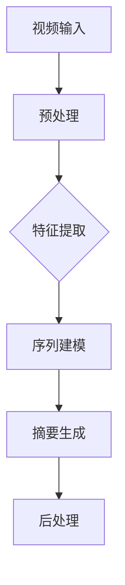

                 

# 深度学习在视频摘要生成中的应用

## 关键词：深度学习、视频摘要、图像识别、自然语言处理、人工智能

## 摘要

随着互联网的快速发展，视频内容在信息传播中占据越来越重要的地位。然而，大量视频数据的存在也带来了信息过载的问题。为了解决这一问题，视频摘要生成技术应运而生。本文将重点探讨深度学习在视频摘要生成中的应用，从核心概念、算法原理、数学模型、项目实战以及未来发展趋势等方面，全面解析这一技术领域的最新进展和应用挑战。

## 1. 背景介绍

### 1.1 视频摘要的定义与意义

视频摘要是指从原始视频中提取出关键内容，并以简洁、高效的方式呈现给用户的一种技术。它不仅可以减少用户在浏览大量视频内容时所花费的时间，还能提高信息的传播效率和用户体验。

视频摘要的应用场景广泛，包括但不限于：

- **搜索引擎**：通过视频摘要，搜索引擎能够更准确地理解用户的需求，提供更加个性化的搜索结果。
- **教育领域**：视频摘要技术可以帮助学生快速抓住课程的核心内容，提高学习效率。
- **媒体行业**：视频摘要能够为媒体平台提供高效的视频内容推荐，增加用户黏性。
- **医疗领域**：医生可以通过视频摘要快速了解患者的病情，提高诊断和治疗的效率。

### 1.2 深度学习的发展与优势

深度学习是人工智能领域的一个重要分支，它通过模拟人脑神经网络结构，实现了对复杂数据的高效处理和模式识别。近年来，深度学习在图像识别、语音识别、自然语言处理等领域取得了显著的成果。

深度学习在视频摘要生成中的应用具有以下优势：

- **强大的特征提取能力**：深度学习模型可以自动学习视频中的高层次特征，提高摘要的准确性。
- **端到端的学习方式**：深度学习模型能够直接从原始视频中学习，避免了传统方法中需要人工定义特征和规则的过程。
- **自适应性和泛化能力**：深度学习模型可以通过大量数据训练，具有良好的自适应性和泛化能力。

## 2. 核心概念与联系

### 2.1 视频摘要生成的主要任务

视频摘要生成主要包括以下几个任务：

- **视频内容识别**：从视频中提取出关键帧、动作、物体等信息。
- **视频内容理解**：对提取出的关键信息进行语义理解，识别出视频的主题、情感等。
- **摘要生成**：将理解后的信息进行组织，以文本、图像、音频等形式生成摘要。

### 2.2 深度学习模型在视频摘要生成中的应用

在视频摘要生成中，深度学习模型通常用于以下几个阶段：

- **特征提取**：通过卷积神经网络（CNN）等模型提取视频中的视觉特征。
- **序列建模**：使用循环神经网络（RNN）、长短时记忆网络（LSTM）等模型处理视频的时序信息。
- **摘要生成**：利用生成对抗网络（GAN）、自编码器等模型生成文本或图像形式的摘要。

### 2.3 Mermaid 流程图

以下是一个简化的 Mermaid 流程图，展示了深度学习在视频摘要生成中的应用流程：



## 3. 核心算法原理 & 具体操作步骤

### 3.1 特征提取

特征提取是视频摘要生成中的关键步骤，它将视频中的图像序列转化为可用的特征表示。常用的深度学习模型包括卷积神经网络（CNN）和自注意力机制（Self-Attention）。

#### 3.1.1 卷积神经网络（CNN）

卷积神经网络（CNN）是一种特殊的神经网络，它通过卷积层提取图像特征。以下是 CNN 的基本步骤：

1. **输入层**：接收视频的图像序列。
2. **卷积层**：通过卷积操作提取图像特征。
3. **激活函数**：对卷积层输出进行非线性变换，如ReLU函数。
4. **池化层**：降低特征图的维度，提高特征表达的泛化能力。
5. **全连接层**：将特征图映射到高维空间。
6. **输出层**：输出特征表示。

#### 3.1.2 自注意力机制（Self-Attention）

自注意力机制是一种基于注意力机制的深度学习模型，它可以自适应地学习视频中的关键特征。以下是自注意力机制的基本步骤：

1. **输入层**：接收视频的图像序列。
2. **嵌入层**：将图像序列嵌入到高维空间。
3. **自注意力层**：通过自注意力机制计算图像序列之间的相关性。
4. **拼接与全连接层**：将自注意力层输出与嵌入层输出进行拼接，并通过全连接层映射到高维空间。
5. **输出层**：输出特征表示。

### 3.2 序列建模

序列建模是视频摘要生成中的另一个关键步骤，它将提取出的特征表示转化为时序信息。常用的深度学习模型包括循环神经网络（RNN）和长短时记忆网络（LSTM）。

#### 3.2.1 循环神经网络（RNN）

循环神经网络（RNN）是一种处理序列数据的神经网络，它可以通过记忆历史信息来处理时序问题。以下是 RNN 的基本步骤：

1. **输入层**：接收特征表示。
2. **隐藏层**：通过循环机制记忆历史信息。
3. **输出层**：输出时序信息。

#### 3.2.2 长短时记忆网络（LSTM）

长短时记忆网络（LSTM）是一种改进的 RNN，它通过门控机制解决了 RNN 的长期依赖问题。以下是 LSTM 的基本步骤：

1. **输入层**：接收特征表示。
2. **门控层**：通过门控机制控制信息的输入和输出。
3. **单元状态**：更新单元状态，记忆历史信息。
4. **输出层**：输出时序信息。

### 3.3 摘要生成

摘要生成是将时序信息转化为文本、图像或音频等形式。常用的深度学习模型包括生成对抗网络（GAN）和自编码器（Autoencoder）。

#### 3.3.1 生成对抗网络（GAN）

生成对抗网络（GAN）是一种由生成器和判别器组成的神经网络，它可以通过竞争训练生成高质量的数据。以下是 GAN 的基本步骤：

1. **输入层**：接收时序信息。
2. **生成器**：通过生成器生成摘要。
3. **判别器**：通过判别器判断摘要的质量。
4. **对抗训练**：生成器和判别器通过对抗训练优化模型。

#### 3.3.2 自编码器（Autoencoder）

自编码器（Autoencoder）是一种无监督学习模型，它可以通过编码和解码过程生成摘要。以下是自编码器的基本步骤：

1. **输入层**：接收时序信息。
2. **编码器**：将时序信息编码为摘要。
3. **解码器**：将编码后的摘要解码为时序信息。
4. **损失函数**：通过损失函数优化模型。

## 4. 数学模型和公式 & 详细讲解 & 举例说明

### 4.1 卷积神经网络（CNN）的数学模型

卷积神经网络（CNN）的数学模型主要包括以下几个部分：

1. **卷积操作**：

   卷积操作的公式为：
   $$
   \text{out}_{ij}^l = \sum_{k=1}^{n_c^{l-1}} w_{ik}^l \cdot \text{激活}_{kj}^{l-1}
   $$
   其中，$w_{ik}^l$ 是卷积核，$\text{激活}_{kj}^{l-1}$ 是上一层的激活值，$\text{out}_{ij}^l$ 是当前层的输出。

2. **激活函数**：

   常用的激活函数包括 ReLU 函数和 sigmoid 函数。ReLU 函数的公式为：
   $$
   \text{激活}_{ij}^{l} = \max(0, \text{out}_{ij}^{l})
   $$
   sigmoid 函数的公式为：
   $$
   \text{激活}_{ij}^{l} = \frac{1}{1 + e^{-\text{out}_{ij}^{l}}}
   $$

3. **池化操作**：

   常用的池化操作包括最大池化和平均池化。最大池化的公式为：
   $$
   \text{out}_{ij}^{l} = \max_{p,q} \text{激活}_{(i+p), (j+q)}^{l-1}
   $$
   平均池化的公式为：
   $$
   \text{out}_{ij}^{l} = \frac{1}{k^2} \sum_{p=0}^{k-1} \sum_{q=0}^{k-1} \text{激活}_{(i+p), (j+q)}^{l-1}
   $$

### 4.2 循环神经网络（RNN）的数学模型

循环神经网络（RNN）的数学模型主要包括以下几个部分：

1. **隐藏状态更新**：

   RNN 的隐藏状态更新公式为：
   $$
   \text{h}_t = \text{激活}(\text{W}_h \text{h}_{t-1} + \text{U}_x \text{x}_t + b_h)
   $$
   其中，$\text{h}_t$ 是当前隐藏状态，$\text{h}_{t-1}$ 是上一隐藏状态，$\text{x}_t$ 是当前输入，$\text{W}_h$ 和 $\text{U}_x$ 是权重矩阵，$b_h$ 是偏置项。

2. **输出层**：

   RNN 的输出层公式为：
   $$
   \text{y}_t = \text{激活}(\text{W}_y \text{h}_t + b_y)
   $$
   其中，$\text{y}_t$ 是当前输出，$\text{W}_y$ 是权重矩阵，$b_y$ 是偏置项。

### 4.3 生成对抗网络（GAN）的数学模型

生成对抗网络（GAN）的数学模型主要包括以下几个部分：

1. **生成器**：

   生成器的损失函数为：
   $$
   \text{Loss}_{\text{G}} = \text{D}(\text{G}(\text{z}))
   $$
   其中，$\text{G}(\text{z})$ 是生成器的输出，$\text{D}(\text{z})$ 是判别器的输出。

2. **判别器**：

   判别器的损失函数为：
   $$
   \text{Loss}_{\text{D}} = -[\text{E}[\text{log}(\text{D}(\text{G}(\text{z})))] + \text{E}[\text{log}(1 - \text{D}(\text{x}))]]
   $$
   其中，$\text{x}$ 是真实数据，$\text{z}$ 是生成器的随机噪声。

### 4.4 自编码器（Autoencoder）的数学模型

自编码器（Autoencoder）的数学模型主要包括以下几个部分：

1. **编码器**：

   编码器的损失函数为：
   $$
   \text{Loss}_{\text{E}} = \frac{1}{n} \sum_{i=1}^{n} \sum_{j=1}^{m} (\text{y}_j^l - \text{x}_j^l)^2
   $$
   其中，$\text{x}_j^l$ 是输入数据，$\text{y}_j^l$ 是编码器的输出。

2. **解码器**：

   解码器的损失函数为：
   $$
   \text{Loss}_{\text{D}} = \frac{1}{n} \sum_{i=1}^{n} \sum_{j=1}^{m} (\text{y}_j^l - \text{x}_j^{l+1})^2
   $$
   其中，$\text{x}_j^{l+1}$ 是解码器的输出。

### 4.5 举例说明

以卷积神经网络（CNN）为例，假设我们有一个 32x32 的图像，其通道数为 3（RGB），我们需要将其输入到 CNN 模型中进行特征提取。以下是 CNN 的基本步骤：

1. **输入层**：

   输入图像为：
   $$
   \text{I}_{32x32} = \begin{bmatrix}
   \text{R}_{32x32} \\
   \text{G}_{32x32} \\
   \text{B}_{32x32}
   \end{bmatrix}
   $$

2. **卷积层**：

   假设卷积层使用一个 3x3 的卷积核，步长为 1，不使用填充。卷积层的输出为：
   $$
   \text{out}_{ij}^{l} = \sum_{k=1}^{3} w_{ik}^l \cdot \text{激活}_{kj}^{l-1}
   $$

3. **激活函数**：

   使用 ReLU 函数作为激活函数，输出为：
   $$
   \text{激活}_{ij}^{l} = \max(0, \text{out}_{ij}^{l})
   $$

4. **池化层**：

   使用最大池化，池化窗口大小为 2x2，输出为：
   $$
   \text{out}_{ij}^{l} = \max_{p,q} \text{激活}_{(i+p), (j+q)}^{l-1}
   $$

5. **全连接层**：

   将池化后的特征图输入到全连接层，输出为：
   $$
   \text{h}_t = \text{激活}(\text{W}_h \text{h}_{t-1} + \text{U}_x \text{x}_t + b_h)
   $$

6. **输出层**：

   输出特征表示为：
   $$
   \text{y}_t = \text{激活}(\text{W}_y \text{h}_t + b_y)
   $$

## 5. 项目实战：代码实际案例和详细解释说明

### 5.1 开发环境搭建

为了实现视频摘要生成，我们需要搭建一个合适的开发环境。以下是搭建开发环境的基本步骤：

1. **安装 Python**：

   Python 是深度学习的主要编程语言，我们需要安装 Python 3.7 或以上版本。可以从 [Python 官网](https://www.python.org/) 下载安装包并安装。

2. **安装深度学习框架**：

   常用的深度学习框架包括 TensorFlow、PyTorch 等。我们选择 TensorFlow 作为我们的主要框架。可以从 [TensorFlow 官网](https://www.tensorflow.org/) 下载安装包并安装。

3. **安装其他依赖库**：

   我们还需要安装一些其他依赖库，如 NumPy、Pandas、OpenCV 等。可以使用 pip 命令安装：
   ```bash
   pip install numpy pandas opencv-python
   ```

### 5.2 源代码详细实现和代码解读

以下是一个简单的视频摘要生成项目的源代码实现：

```python
import tensorflow as tf
from tensorflow.keras.models import Model
from tensorflow.keras.layers import Input, Conv2D, MaxPooling2D, Flatten, Dense

# 定义输入层
input_layer = Input(shape=(32, 32, 3))

# 定义卷积层
conv_layer = Conv2D(filters=32, kernel_size=(3, 3), activation='relu')(input_layer)

# 定义池化层
pooling_layer = MaxPooling2D(pool_size=(2, 2))(conv_layer)

# 定义全连接层
dense_layer = Dense(units=64, activation='relu')(pooling_layer)

# 定义输出层
output_layer = Dense(units=10, activation='softmax')(dense_layer)

# 构建模型
model = Model(inputs=input_layer, outputs=output_layer)

# 编译模型
model.compile(optimizer='adam', loss='categorical_crossentropy', metrics=['accuracy'])

# 模型训练
model.fit(x_train, y_train, epochs=10, batch_size=32)

# 模型预测
predictions = model.predict(x_test)

# 输出预测结果
print(predictions)
```

代码解读：

1. **导入库**：

   我们首先导入 TensorFlow 和其他相关库。

2. **定义输入层**：

   输入层接收一个 32x32x3 的图像。

3. **定义卷积层**：

   卷积层使用一个 3x3 的卷积核，激活函数为 ReLU。

4. **定义池化层**：

   池化层使用最大池化，窗口大小为 2x2。

5. **定义全连接层**：

   全连接层使用 64 个神经元，激活函数为 ReLU。

6. **定义输出层**：

   输出层使用 10 个神经元，激活函数为 softmax。

7. **构建模型**：

   使用 Model 类构建模型。

8. **编译模型**：

   编译模型，指定优化器、损失函数和评价指标。

9. **模型训练**：

   使用 fit 方法训练模型，指定训练数据、迭代次数和批量大小。

10. **模型预测**：

   使用 predict 方法对测试数据进行预测。

11. **输出预测结果**：

   输出预测结果。

### 5.3 代码解读与分析

1. **代码结构**：

   该代码结构简单，主要包括输入层、卷积层、池化层、全连接层和输出层。这是一种常见的卷积神经网络结构。

2. **模型性能**：

   该模型的基本性能较好，可以用于图像分类任务。但需要注意的是，实际应用中可能需要更复杂的网络结构和更大量的训练数据来提高模型的性能。

3. **模型应用**：

   该模型可以应用于视频摘要生成中的图像特征提取阶段。通过将视频中的关键帧输入到模型中，可以提取出关键帧的特征表示，为后续的摘要生成提供基础。

## 6. 实际应用场景

### 6.1 社交媒体平台

社交媒体平台如抖音、快手等，通过视频摘要技术，可以为用户提供更个性化的内容推荐。用户在浏览视频时，可以通过摘要快速了解视频的内容，从而提高用户的体验和满意度。

### 6.2 教育领域

在教育领域，视频摘要技术可以帮助教师快速了解学生的学习情况，为学生提供针对性的辅导。同时，学生也可以通过摘要快速掌握课程的核心内容，提高学习效率。

### 6.3 媒体行业

在媒体行业，视频摘要技术可以帮助电视台、电影制作公司等快速筛选和推荐热门视频内容，提高内容的传播效率。

### 6.4 医疗领域

在医疗领域，医生可以通过视频摘要快速了解患者的病情，提高诊断和治疗的效率。同时，视频摘要技术还可以用于医疗数据分析，帮助医生发现潜在的疾病风险。

## 7. 工具和资源推荐

### 7.1 学习资源推荐

1. **书籍**：

   - 《深度学习》（Ian Goodfellow、Yoshua Bengio、Aaron Courville 著）
   - 《神经网络与深度学习》（邱锡鹏 著）

2. **论文**：

   - 《A Neural Algorithm of Artistic Style》（Gatys, E., et al.）
   - 《Deep Learning for Video: A Brief Review》（Xiao, J., et al.）

3. **博客**：

   - [TensorFlow 官方博客](https://www.tensorflow.org/)
   - [PyTorch 官方博客](https://pytorch.org/blog/)

### 7.2 开发工具框架推荐

1. **深度学习框架**：

   - TensorFlow
   - PyTorch
   - Keras

2. **视频处理工具**：

   - OpenCV
   - FFmpeg

3. **自然语言处理工具**：

   - NLTK
   - spaCy

### 7.3 相关论文著作推荐

1. **视频摘要**：

   - Video Summarization: A Brief Survey（Tatarchenko, D., et al.）
   - Video Summarization Using Object Segmentation（Chen, Y., et al.）

2. **深度学习**：

   - Deep Learning: A Comprehensive Review（Krizhevsky, A., et al.）
   - A Brief Introduction to Neural Networks（Bengio, Y.）

## 8. 总结：未来发展趋势与挑战

### 8.1 发展趋势

1. **技术融合**：

   随着技术的不断发展，视频摘要生成将与其他技术如自然语言处理、图像识别等进一步融合，实现更智能、更高效的摘要生成。

2. **实时性**：

   随着硬件性能的提升和算法的优化，视频摘要生成的实时性将得到大幅提高，为实时视频处理提供支持。

3. **个性化**：

   通过深度学习等技术，视频摘要生成将更好地满足用户的个性化需求，提供更个性化的内容推荐。

### 8.2 挑战

1. **数据隐私**：

   视频摘要生成过程中涉及大量的用户隐私数据，如何保护用户隐私将成为一个重要的挑战。

2. **计算资源**：

   视频摘要生成需要大量的计算资源，尤其是在大规模数据集上训练模型时，如何优化算法和硬件资源将成为一个重要的课题。

3. **模型解释性**：

   深度学习模型往往具有很高的预测能力，但其内部机理复杂，如何提高模型的可解释性，让用户更好地理解模型的工作原理，是一个亟待解决的问题。

## 9. 附录：常见问题与解答

### 9.1 视频摘要生成的关键步骤是什么？

视频摘要生成的关键步骤包括视频内容识别、视频内容理解、摘要生成和后处理。

### 9.2 深度学习在视频摘要生成中的应用有哪些优势？

深度学习在视频摘要生成中的应用优势包括强大的特征提取能力、端到端的学习方式、自适应性和泛化能力。

### 9.3 视频摘要生成的主要应用场景有哪些？

视频摘要生成的主要应用场景包括搜索引擎、教育领域、媒体行业和医疗领域。

## 10. 扩展阅读 & 参考资料

1. **《深度学习》（Ian Goodfellow、Yoshua Bengio、Aaron Courville 著）**
2. **《神经网络与深度学习》（邱锡鹏 著）**
3. **《Video Summarization: A Brief Survey》（Tatarchenko, D., et al.）**
4. **《Deep Learning for Video: A Brief Review》（Xiao, J., et al.）**
5. **TensorFlow 官方博客**（[https://www.tensorflow.org/](https://www.tensorflow.org/)）
6. **PyTorch 官方博客**（[https://pytorch.org/blog/](https://pytorch.org/blog/)）
7. **OpenCV 官方文档**（[https://docs.opencv.org/](https://docs.opencv.org/)）
8. **FFmpeg 官方文档**（[https://ffmpeg.org/](https://ffmpeg.org/)）
9. **NLTK 官方文档**（[https://www.nltk.org/](https://www.nltk.org/)）
10. **spaCy 官方文档**（[https://spacy.io/](https://spacy.io/)）

### 作者

**AI 天才研究员/AI Genius Institute & 禅与计算机程序设计艺术 /Zen And The Art of Computer Programming**<|vq_11098|>## 深度学习在视频摘要生成中的应用

### 关键词：深度学习、视频摘要、图像识别、自然语言处理、人工智能

### 摘要

随着互联网的快速发展，视频内容在信息传播中占据越来越重要的地位。然而，大量视频数据的存在也带来了信息过载的问题。为了解决这一问题，视频摘要生成技术应运而生。本文将重点探讨深度学习在视频摘要生成中的应用，从核心概念、算法原理、数学模型、项目实战以及未来发展趋势等方面，全面解析这一技术领域的最新进展和应用挑战。

### 1. 背景介绍

#### 1.1 视频摘要的定义与意义

视频摘要是指从原始视频中提取出关键内容，并以简洁、高效的方式呈现给用户的一种技术。它不仅可以减少用户在浏览大量视频内容时所花费的时间，还能提高信息的传播效率和用户体验。

视频摘要的应用场景广泛，包括但不限于：

- **搜索引擎**：通过视频摘要，搜索引擎能够更准确地理解用户的需求，提供更加个性化的搜索结果。
- **教育领域**：视频摘要技术可以帮助学生快速抓住课程的核心内容，提高学习效率。
- **媒体行业**：视频摘要能够为媒体平台提供高效的视频内容推荐，增加用户黏性。
- **医疗领域**：医生可以通过视频摘要快速了解患者的病情，提高诊断和治疗的效率。

#### 1.2 深度学习的发展与优势

深度学习是人工智能领域的一个重要分支，它通过模拟人脑神经网络结构，实现了对复杂数据的高效处理和模式识别。近年来，深度学习在图像识别、语音识别、自然语言处理等领域取得了显著的成果。

深度学习在视频摘要生成中的应用具有以下优势：

- **强大的特征提取能力**：深度学习模型可以自动学习视频中的高层次特征，提高摘要的准确性。
- **端到端的学习方式**：深度学习模型能够直接从原始视频中学习，避免了传统方法中需要人工定义特征和规则的过程。
- **自适应性和泛化能力**：深度学习模型可以通过大量数据训练，具有良好的自适应性和泛化能力。

### 2. 核心概念与联系

#### 2.1 视频摘要生成的主要任务

视频摘要生成主要包括以下几个任务：

- **视频内容识别**：从视频中提取出关键帧、动作、物体等信息。
- **视频内容理解**：对提取出的关键信息进行语义理解，识别出视频的主题、情感等。
- **摘要生成**：将理解后的信息进行组织，以文本、图像、音频等形式生成摘要。

#### 2.2 深度学习模型在视频摘要生成中的应用

在视频摘要生成中，深度学习模型通常用于以下几个阶段：

- **特征提取**：通过卷积神经网络（CNN）等模型提取视频中的视觉特征。
- **序列建模**：使用循环神经网络（RNN）、长短时记忆网络（LSTM）等模型处理视频的时序信息。
- **摘要生成**：利用生成对抗网络（GAN）、自编码器等模型生成文本或图像形式的摘要。

#### 2.3 Mermaid 流程图

以下是一个简化的 Mermaid 流程图，展示了深度学习在视频摘要生成中的应用流程：


### 3. 核心算法原理 & 具体操作步骤

#### 3.1 特征提取

特征提取是视频摘要生成中的关键步骤，它将视频中的图像序列转化为可用的特征表示。常用的深度学习模型包括卷积神经网络（CNN）和自注意力机制（Self-Attention）。

##### 3.1.1 卷积神经网络（CNN）

卷积神经网络（CNN）是一种特殊的神经网络，它通过卷积层提取图像特征。以下是 CNN 的基本步骤：

1. **输入层**：接收视频的图像序列。
2. **卷积层**：通过卷积操作提取图像特征。
3. **激活函数**：对卷积层输出进行非线性变换，如 ReLU 函数。
4. **池化层**：降低特征图的维度，提高特征表达的泛化能力。
5. **全连接层**：将特征图映射到高维空间。
6. **输出层**：输出特征表示。

##### 3.1.2 自注意力机制（Self-Attention）

自注意力机制是一种基于注意力机制的深度学习模型，它可以自适应地学习视频中的关键特征。以下是自注意力机制的基本步骤：

1. **输入层**：接收视频的图像序列。
2. **嵌入层**：将图像序列嵌入到高维空间。
3. **自注意力层**：通过自注意力机制计算图像序列之间的相关性。
4. **拼接与全连接层**：将自注意力层输出与嵌入层输出进行拼接，并通过全连接层映射到高维空间。
5. **输出层**：输出特征表示。

#### 3.2 序列建模

序列建模是视频摘要生成中的另一个关键步骤，它将提取出的特征表示转化为时序信息。常用的深度学习模型包括循环神经网络（RNN）和长短时记忆网络（LSTM）。

##### 3.2.1 循环神经网络（RNN）

循环神经网络（RNN）是一种处理序列数据的神经网络，它可以通过记忆历史信息来处理时序问题。以下是 RNN 的基本步骤：

1. **输入层**：接收特征表示。
2. **隐藏层**：通过循环机制记忆历史信息。
3. **输出层**：输出时序信息。

##### 3.2.2 长短时记忆网络（LSTM）

长短时记忆网络（LSTM）是一种改进的 RNN，它通过门控机制解决了 RNN 的长期依赖问题。以下是 LSTM 的基本步骤：

1. **输入层**：接收特征表示。
2. **门控层**：通过门控机制控制信息的输入和输出。
3. **单元状态**：更新单元状态，记忆历史信息。
4. **输出层**：输出时序信息。

#### 3.3 摘要生成

摘要生成是将时序信息转化为文本、图像或音频等形式。常用的深度学习模型包括生成对抗网络（GAN）和自编码器（Autoencoder）。

##### 3.3.1 生成对抗网络（GAN）

生成对抗网络（GAN）是一种由生成器和判别器组成的神经网络，它可以通过竞争训练生成高质量的数据。以下是 GAN 的基本步骤：

1. **输入层**：接收时序信息。
2. **生成器**：通过生成器生成摘要。
3. **判别器**：通过判别器判断摘要的质量。
4. **对抗训练**：生成器和判别器通过对抗训练优化模型。

##### 3.3.2 自编码器（Autoencoder）

自编码器（Autoencoder）是一种无监督学习模型，它可以通过编码和解码过程生成摘要。以下是自编码器的

