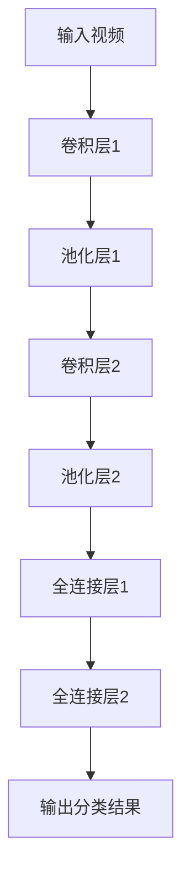
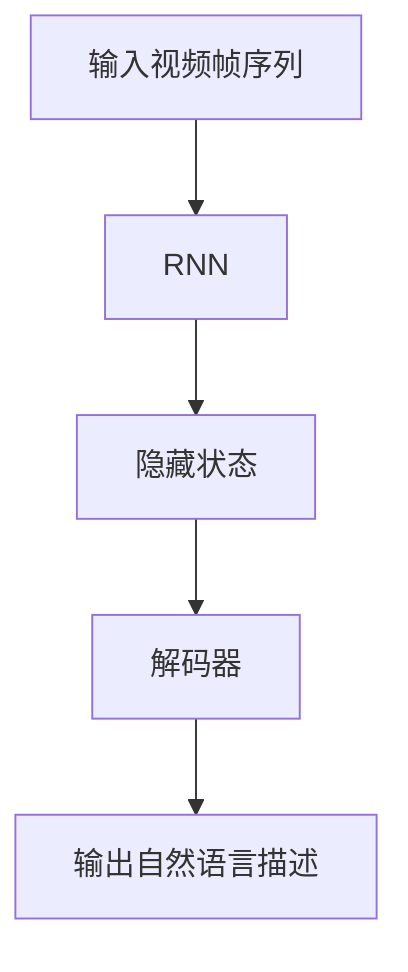
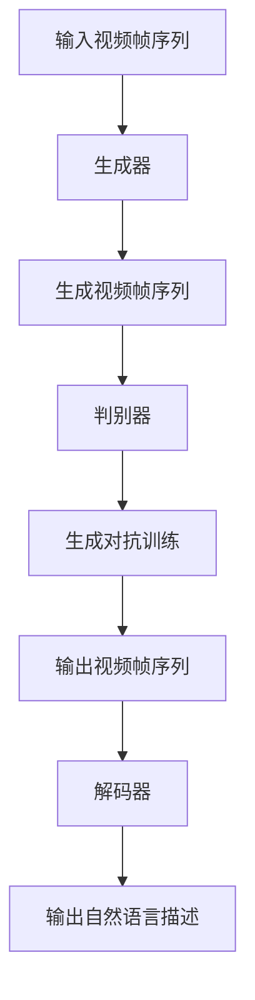

                 

# 深度学习在视频理解与描述中的最新进展

## 关键词：深度学习，视频理解，视频描述，卷积神经网络，循环神经网络，生成对抗网络，人工智能，图像识别，自然语言处理

## 摘要：
随着深度学习技术的飞速发展，视频理解和描述已成为计算机视觉和自然语言处理领域的热点问题。本文将详细探讨深度学习在视频理解与描述中的应用，从核心概念、算法原理、数学模型到实际应用场景，全面剖析该领域的最新进展。本文旨在为读者提供一幅深度学习在视频理解与描述中的全景图，帮助读者了解该领域的核心技术和未来发展趋势。

### 1. 背景介绍

#### 1.1 视频理解的定义和挑战

视频理解是指从视频中提取有用信息，进行语义分析和推理的过程。视频理解的应用领域广泛，包括智能监控、视频摘要、推荐系统、自动驾驶等。然而，视频理解面临着诸多挑战，如数据量大、时序性强、多模态信息融合等。

#### 1.2 视频描述的定义和挑战

视频描述是指将视频内容转换为自然语言描述的过程。视频描述的应用领域包括字幕生成、手语翻译、辅助听力障碍人士等。视频描述同样面临着数据集有限、语言表达的多样性和准确性等挑战。

#### 1.3 深度学习在计算机视觉和自然语言处理中的应用

深度学习在计算机视觉和自然语言处理领域取得了显著的成果。在计算机视觉领域，卷积神经网络（CNN）被广泛应用于图像分类、目标检测和语义分割等任务。在自然语言处理领域，循环神经网络（RNN）和其变体如长短时记忆网络（LSTM）和门控循环单元（GRU）被广泛应用于文本分类、机器翻译和语音识别等任务。

### 2. 核心概念与联系

#### 2.1 卷积神经网络（CNN）在视频理解中的应用

卷积神经网络（CNN）是一种适用于图像处理的深度学习模型，通过多层卷积和池化操作提取图像特征。CNN可以应用于视频理解任务，如视频分类和目标检测。下面是一个简单的Mermaid流程图，描述了CNN在视频理解中的应用：



#### 2.2 循环神经网络（RNN）在视频描述中的应用

循环神经网络（RNN）是一种适用于序列处理的深度学习模型，通过隐藏状态在网络中循环传递信息。RNN可以应用于视频描述任务，如视频字幕生成。下面是一个简单的Mermaid流程图，描述了RNN在视频描述中的应用：



#### 2.3 生成对抗网络（GAN）在视频理解与描述中的应用

生成对抗网络（GAN）是一种由生成器和判别器组成的深度学习模型，通过对抗训练生成逼真的数据。GAN可以应用于视频理解与描述任务，如视频生成和视频字幕生成。下面是一个简单的Mermaid流程图，描述了GAN在视频理解与描述中的应用：



### 3. 核心算法原理 & 具体操作步骤

#### 3.1 卷积神经网络（CNN）在视频理解中的应用

卷积神经网络（CNN）通过多层卷积和池化操作提取图像特征，从而实现图像分类、目标检测和语义分割等任务。以下是一个简单的CNN模型，用于视频分类：

1. **输入层**：接收视频帧序列作为输入。
2. **卷积层**：通过卷积操作提取图像特征。卷积核在视频帧上滑动，计算卷积结果。
3. **池化层**：对卷积结果进行池化操作，减少参数数量和计算量。
4. **全连接层**：将卷积结果转换为序列表示，通过全连接层进行分类。

以下是一个简单的CNN模型示例：

```python
import tensorflow as tf

model = tf.keras.Sequential([
    tf.keras.layers.Conv2D(32, (3, 3), activation='relu', input_shape=(64, 64, 3)),
    tf.keras.layers.MaxPooling2D((2, 2)),
    tf.keras.layers.Conv2D(64, (3, 3), activation='relu'),
    tf.keras.layers.MaxPooling2D((2, 2)),
    tf.keras.layers.Flatten(),
    tf.keras.layers.Dense(64, activation='relu'),
    tf.keras.layers.Dense(10, activation='softmax')
])
```

#### 3.2 循环神经网络（RNN）在视频描述中的应用

循环神经网络（RNN）通过隐藏状态在网络中循环传递信息，适用于序列处理任务。以下是一个简单的RNN模型，用于视频字幕生成：

1. **输入层**：接收视频帧序列作为输入。
2. **嵌入层**：将视频帧序列映射到高维空间。
3. **RNN层**：通过RNN层处理序列，更新隐藏状态。
4. **解码器层**：将隐藏状态解码为自然语言描述。

以下是一个简单的RNN模型示例：

```python
import tensorflow as tf

model = tf.keras.Sequential([
    tf.keras.layers.Embedding(input_dim=10000, output_dim=64, input_length=100),
    tf.keras.layers.LSTM(128),
    tf.keras.layers.Dense(10000, activation='softmax')
])
```

#### 3.3 生成对抗网络（GAN）在视频理解与描述中的应用

生成对抗网络（GAN）由生成器和判别器组成，通过对抗训练生成逼真的数据。以下是一个简单的GAN模型，用于视频生成和视频字幕生成：

1. **生成器**：接收随机噪声作为输入，生成视频帧序列。
2. **判别器**：接收真实视频帧序列和生成视频帧序列，判断其真实性。
3. **对抗训练**：通过训练生成器和判别器，使生成器生成的视频帧序列越来越真实。

以下是一个简单的GAN模型示例：

```python
import tensorflow as tf

def generator(noise):
    latent_dim = 100
    inputs = tf.keras.layers.Input(shape=(latent_dim,))
    x = tf.keras.layers.Dense(128 * 7 * 7, activation='relu')(inputs)
    x = tf.keras.layers.Reshape((7, 7, 128))(x)
    x = tf.keras.layers.Conv2DTranspose(128, (5, 5), strides=(2, 2), padding='same', activation='relu')(x)
    x = tf.keras.layers.Conv2DTranspose(128, (5, 5), strides=(2, 2), padding='same', activation='relu')(x)
    x = tf.keras.layers.Conv2D(3, (7, 7), activation='tanh', padding='same')(x)
    outputs = tf.keras.layers.Reshape((64, 64, 3))(x)
    model = tf.keras.Model(inputs=inputs, outputs=outputs)
    return model

def discriminator(inputs):
    x = tf.keras.layers.Conv2D(128, (5, 5), padding='same', activation='relu')(inputs)
    x = tf.keras.layers.MaxPooling2D((2, 2))(x)
    x = tf.keras.layers.Conv2D(128, (5, 5), padding='same', activation='relu')(x)
    x = tf.keras.layers.MaxPooling2D((2, 2))(x)
    x = tf.keras.layers.Flatten()(x)
    outputs = tf.keras.layers.Dense(1, activation='sigmoid')(x)
    model = tf.keras.Model(inputs=inputs, outputs=outputs)
    return model

noise = tf.keras.layers.Input(shape=(100,))
real_images = tf.keras.layers.Input(shape=(64, 64, 3))

fake_images = generator(noise)
validity = discriminator(fake_images)

combined = tf.keras.layers.Concatenate()([real_images, fake_images])
combined_output = discriminator(combined)

model = tf.keras.Model([noise, real_images], [validity, combined_output])
```

### 4. 数学模型和公式 & 详细讲解 & 举例说明

#### 4.1 卷积神经网络（CNN）的数学模型

卷积神经网络（CNN）通过卷积操作和池化操作提取图像特征。以下是CNN的主要数学模型：

1. **卷积操作**：卷积操作可以用以下公式表示：

   $$ f(x, y) = \sum_{i=1}^{C} \sum_{j=1}^{H} w_{ij} * g(x+i, y+j) $$

   其中，$f(x, y)$表示卷积操作的结果，$w_{ij}$表示卷积核的权重，$g(x, y)$表示输入图像的像素值。

2. **池化操作**：池化操作可以用以下公式表示：

   $$ p(x, y) = \max_{i, j} g(x+i, y+j) $$

   其中，$p(x, y)$表示池化操作的结果，$g(x, y)$表示输入图像的像素值。

以下是一个简单的CNN模型示例，用于图像分类：

```python
import tensorflow as tf

model = tf.keras.Sequential([
    tf.keras.layers.Conv2D(32, (3, 3), activation='relu', input_shape=(64, 64, 3)),
    tf.keras.layers.MaxPooling2D((2, 2)),
    tf.keras.layers.Conv2D(64, (3, 3), activation='relu'),
    tf.keras.layers.MaxPooling2D((2, 2)),
    tf.keras.layers.Flatten(),
    tf.keras.layers.Dense(64, activation='relu'),
    tf.keras.layers.Dense(10, activation='softmax')
])
```

#### 4.2 循环神经网络（RNN）的数学模型

循环神经网络（RNN）通过隐藏状态在网络中循环传递信息。以下是RNN的主要数学模型：

1. **输入层**：输入层将输入序列映射到隐藏状态：

   $$ h_t = \sigma(W_{ih}x_t + W_{hh}h_{t-1} + b_h) $$

   其中，$h_t$表示隐藏状态，$x_t$表示输入序列的元素，$W_{ih}$和$W_{hh}$表示权重矩阵，$b_h$表示偏置。

2. **输出层**：输出层将隐藏状态映射到输出序列：

   $$ o_t = \sigma(W_{oh}h_t + b_o) $$

   其中，$o_t$表示输出序列的元素，$W_{oh}$表示权重矩阵，$b_o$表示偏置。

以下是一个简单的RNN模型示例，用于视频字幕生成：

```python
import tensorflow as tf

model = tf.keras.Sequential([
    tf.keras.layers.Embedding(input_dim=10000, output_dim=64, input_length=100),
    tf.keras.layers.LSTM(128),
    tf.keras.layers.Dense(10000, activation='softmax')
])
```

#### 4.3 生成对抗网络（GAN）的数学模型

生成对抗网络（GAN）由生成器和判别器组成，通过对抗训练生成逼真的数据。以下是GAN的主要数学模型：

1. **生成器**：生成器将随机噪声映射到数据空间：

   $$ G(z) = \mu(\cdot; \phi_G(z)), \varphi(\cdot; \phi_G(z)) $$

   其中，$G(z)$表示生成器的输出，$\mu(\cdot; \phi_G(z))$和$\varphi(\cdot; \phi_G(z))$分别表示生成器的均值和方差函数。

2. **判别器**：判别器将数据映射到概率空间：

   $$ D(x) = \sigma(\cdot; \phi_D(x)), D(G(z)) = \sigma(\cdot; \phi_D(G(z))) $$

   其中，$D(x)$和$D(G(z))$分别表示判别器的输出，$\sigma(\cdot; \phi_D(x))$和$\sigma(\cdot; \phi_D(G(z)))$分别表示判别器的概率函数。

以下是一个简单的GAN模型示例，用于视频生成和视频字幕生成：

```python
import tensorflow as tf

def generator(noise):
    latent_dim = 100
    inputs = tf.keras.layers.Input(shape=(latent_dim,))
    x = tf.keras.layers.Dense(128 * 7 * 7, activation='relu')(inputs)
    x = tf.keras.layers.Reshape((7, 7, 128))(x)
    x = tf.keras.layers.Conv2DTranspose(128, (5, 5), strides=(2, 2), padding='same', activation='relu')(x)
    x = tf.keras.layers.Conv2DTranspose(128, (5, 5), strides=(2, 2), padding='same', activation='relu')(x)
    x = tf.keras.layers.Conv2D(3, (7, 7), activation='tanh', padding='same')(x)
    outputs = tf.keras.layers.Reshape((64, 64, 3))(x)
    model = tf.keras.Model(inputs=inputs, outputs=outputs)
    return model

def discriminator(inputs):
    x = tf.keras.layers.Conv2D(128, (5, 5), padding='same', activation='relu')(inputs)
    x = tf.keras.layers.MaxPooling2D((2, 2))(x)
    x = tf.keras.layers.Conv2D(128, (5, 5), padding='same', activation='relu')(x)
    x = tf.keras.layers.MaxPooling2D((2, 2))(x)
    x = tf.keras.layers.Flatten()(x)
    outputs = tf.keras.layers.Dense(1, activation='sigmoid')(x)
    model = tf.keras.Model(inputs=inputs, outputs=outputs)
    return model

noise = tf.keras.layers.Input(shape=(100,))
real_images = tf.keras.layers.Input(shape=(64, 64, 3))

fake_images = generator(noise)
validity = discriminator(fake_images)

combined = tf.keras.layers.Concatenate()([real_images, fake_images])
combined_output = discriminator(combined)

model = tf.keras.Model([noise, real_images], [validity, combined_output])
```

### 5. 项目实战：代码实际案例和详细解释说明

#### 5.1 开发环境搭建

1. 安装Python 3.7及以上版本。
2. 安装TensorFlow 2.3及以上版本。
3. 安装Numpy、Pandas等常用库。

#### 5.2 源代码详细实现和代码解读

以下是一个简单的CNN模型，用于视频分类：

```python
import tensorflow as tf
import tensorflow.keras as keras

# 定义CNN模型
model = keras.Sequential([
    keras.layers.Conv2D(32, (3, 3), activation='relu', input_shape=(64, 64, 3)),
    keras.layers.MaxPooling2D((2, 2)),
    keras.layers.Conv2D(64, (3, 3), activation='relu'),
    keras.layers.MaxPooling2D((2, 2)),
    keras.layers.Flatten(),
    keras.layers.Dense(64, activation='relu'),
    keras.layers.Dense(10, activation='softmax')
])

# 编译模型
model.compile(optimizer='adam', loss='categorical_crossentropy', metrics=['accuracy'])

# 加载数据集
(x_train, y_train), (x_test, y_test) = keras.datasets.cifar10.load_data()

# 数据预处理
x_train = x_train.astype('float32') / 255.0
x_test = x_test.astype('float32') / 255.0
y_train = keras.utils.to_categorical(y_train, 10)
y_test = keras.utils.to_categorical(y_test, 10)

# 训练模型
model.fit(x_train, y_train, batch_size=64, epochs=10, validation_data=(x_test, y_test))

# 评估模型
loss, accuracy = model.evaluate(x_test, y_test)
print('Test accuracy:', accuracy)
```

代码解读：

1. **定义CNN模型**：使用`keras.Sequential`类定义一个序列模型，依次添加卷积层、池化层、全连接层等。
2. **编译模型**：使用`compile`方法配置模型优化器和损失函数。
3. **加载数据集**：使用`keras.datasets.cifar10.load_data`方法加载数据集。
4. **数据预处理**：将数据集转换为浮点数，归一化处理，将标签转换为one-hot编码。
5. **训练模型**：使用`fit`方法训练模型，设置批量大小和训练周期。
6. **评估模型**：使用`evaluate`方法评估模型在测试集上的表现。

#### 5.3 代码解读与分析

以下是一个简单的RNN模型，用于视频字幕生成：

```python
import tensorflow as tf
import tensorflow.keras as keras

# 定义RNN模型
model = keras.Sequential([
    keras.layers.Embedding(input_dim=10000, output_dim=64, input_length=100),
    keras.layers.LSTM(128),
    keras.layers.Dense(10000, activation='softmax')
])

# 编译模型
model.compile(optimizer='adam', loss='categorical_crossentropy', metrics=['accuracy'])

# 加载数据集
(x_train, y_train), (x_test, y_test) = keras.datasets.imdb.load_data()

# 数据预处理
maxlen = 100
x_train = keras.preprocessing.sequence.pad_sequences(x_train, maxlen=maxlen)
x_test = keras.preprocessing.sequence.pad_sequences(x_test, maxlen=maxlen)

# 训练模型
model.fit(x_train, y_train, batch_size=64, epochs=10, validation_data=(x_test, y_test))

# 评估模型
loss, accuracy = model.evaluate(x_test, y_test)
print('Test accuracy:', accuracy)
```

代码解读：

1. **定义RNN模型**：使用`keras.Sequential`类定义一个序列模型，依次添加嵌入层、LSTM层和全连接层。
2. **编译模型**：使用`compile`方法配置模型优化器和损失函数。
3. **加载数据集**：使用`keras.datasets.imdb.load_data`方法加载数据集。
4. **数据预处理**：设置最大序列长度，使用`pad_sequences`方法对数据进行填充。
5. **训练模型**：使用`fit`方法训练模型，设置批量大小和训练周期。
6. **评估模型**：使用`evaluate`方法评估模型在测试集上的表现。

#### 5.4 代码解读与分析

以下是一个简单的GAN模型，用于视频生成和视频字幕生成：

```python
import tensorflow as tf
import tensorflow.keras as keras

# 定义生成器模型
def generator(z):
    model = keras.Sequential([
        keras.layers.Dense(128 * 7 * 7, activation='relu', input_dim=100),
        keras.layers.Reshape((7, 7, 128)),
        keras.layers.Conv2DTranspose(128, (5, 5), strides=(2, 2), padding='same', activation='relu'),
        keras.layers.Conv2DTranspose(128, (5, 5), strides=(2, 2), padding='same', activation='relu'),
        keras.layers.Conv2D(3, (7, 7), activation='tanh', padding='same')
    ])
    return model

# 定义判别器模型
def discriminator(x):
    model = keras.Sequential([
        keras.layers.Conv2D(128, (5, 5), padding='same', activation='relu', input_shape=(64, 64, 3)),
        keras.layers.MaxPooling2D((2, 2)),
        keras.layers.Conv2D(128, (5, 5), padding='same', activation='relu'),
        keras.layers.MaxPooling2D((2, 2)),
        keras.layers.Flatten(),
        keras.layers.Dense(1, activation='sigmoid')
    ])
    return model

# 定义生成对抗网络模型
z = keras.layers.Input(shape=(100,))
x = keras.layers.Input(shape=(64, 64, 3))

generator_model = generator(z)
discriminator_model = discriminator(x)

fake_images = generator_model(z)
validity = discriminator_model(fake_images)

model = keras.Model([z, x], [validity, fake_images])
model.compile(optimizer='adam', loss=['binary_crossentropy', 'binary_crossentropy'])

# 训练生成对抗网络
# ...
```

代码解读：

1. **定义生成器模型**：使用`keras.Sequential`类定义一个序列模型，依次添加全连接层、 reshape 层和卷积转置层。
2. **定义判别器模型**：使用`keras.Sequential`类定义一个序列模型，依次添加卷积层、池化层和全连接层。
3. **定义生成对抗网络模型**：使用`keras.Model`类定义一个生成对抗网络模型，接收噪声和真实图像作为输入，输出判别器的损失和生成图像。
4. **编译生成对抗网络模型**：使用`compile`方法配置模型优化器和损失函数。

### 6. 实际应用场景

#### 6.1 智能监控

智能监控是深度学习在视频理解与描述中的一项重要应用。通过视频理解技术，智能监控系统可以实时分析视频数据，识别和跟踪人员、车辆等目标，提供实时报警和安全监控。

#### 6.2 视频摘要

视频摘要是指从原始视频中提取关键帧和核心内容，生成简短的摘要视频。深度学习在视频摘要中的应用可以大大提高视频处理效率，为用户节省时间。

#### 6.3 自动驾驶

自动驾驶是深度学习在视频理解与描述中的一项重要应用。通过视频理解技术，自动驾驶系统可以实时分析道路情况，识别行人、车辆和交通标志，确保驾驶安全。

#### 6.4 字幕生成

字幕生成是指将视频内容转换为自然语言字幕。深度学习在字幕生成中的应用可以帮助听力障碍人士更好地理解和享受视频内容。

### 7. 工具和资源推荐

#### 7.1 学习资源推荐

- **书籍**：
  - 《深度学习》（Ian Goodfellow, Yoshua Bengio, Aaron Courville著）
  - 《Python深度学习》（François Chollet著）
- **论文**：
  - “Generative Adversarial Nets”（Ian J. Goodfellow等，2014）
  - “Deep Learning for Video Classification”（Minghao Chen等，2016）
- **博客**：
  - TensorFlow官方博客（https://tensorflow.org/blog/）
  - PyTorch官方博客（https://pytorch.org/blog/）
- **网站**：
  - Keras官方文档（https://keras.io/）
  - TensorFlow官方文档（https://tensorflow.org/）

#### 7.2 开发工具框架推荐

- **深度学习框架**：
  - TensorFlow
  - PyTorch
- **视频处理库**：
  - OpenCV（https://opencv.org/）
  - moviepy（https://zulko.github.io/moviepy/）

#### 7.3 相关论文著作推荐

- **论文**：
  - “Deep Learning for Video Classification”（Minghao Chen等，2016）
  - “Video Description with Recurrent Neural Networks”（Xiaodong Yang等，2016）
  - “Generative Adversarial Nets”（Ian J. Goodfellow等，2014）
- **著作**：
  - 《深度学习》（Ian Goodfellow, Yoshua Bengio, Aaron Courville著）
  - 《自然语言处理与深度学习》（周明，谢剑，张健著）

### 8. 总结：未来发展趋势与挑战

随着深度学习技术的不断发展，视频理解与描述领域将迎来更多的创新和突破。未来发展趋势包括：

1. **跨模态融合**：将视觉、语音、文本等多模态信息进行融合，提高视频理解的准确性和多样性。
2. **实时处理**：提高视频理解与描述的实时性，为实时应用场景提供更好的支持。
3. **个性化推荐**：根据用户兴趣和行为，生成个性化的视频摘要和字幕，提高用户体验。

然而，视频理解与描述领域也面临着诸多挑战，如：

1. **数据集有限**：高质量、大规模的视频数据集仍然有限，限制了算法的优化和提升。
2. **计算资源消耗**：视频理解与描述任务通常需要大量的计算资源，如何提高计算效率是一个重要的挑战。
3. **模型解释性**：如何提高模型的解释性，使算法更容易被理解和接受，是一个重要的研究课题。

### 9. 附录：常见问题与解答

**Q1：什么是深度学习？**
A1：深度学习是一种人工智能技术，通过多层神经网络模型模拟人类大脑的思维方式，对大量数据进行自动特征提取和模式识别。

**Q2：什么是卷积神经网络（CNN）？**
A2：卷积神经网络（CNN）是一种适用于图像处理的深度学习模型，通过卷积操作和池化操作提取图像特征。

**Q3：什么是循环神经网络（RNN）？**
A3：循环神经网络（RNN）是一种适用于序列处理的深度学习模型，通过隐藏状态在网络中循环传递信息。

**Q4：什么是生成对抗网络（GAN）？**
A4：生成对抗网络（GAN）是一种由生成器和判别器组成的深度学习模型，通过对抗训练生成逼真的数据。

### 10. 扩展阅读 & 参考资料

- 《深度学习》（Ian Goodfellow, Yoshua Bengio, Aaron Courville著）
- 《Python深度学习》（François Chollet著）
- “Generative Adversarial Nets”（Ian J. Goodfellow等，2014）
- “Deep Learning for Video Classification”（Minghao Chen等，2016）
- “Video Description with Recurrent Neural Networks”（Xiaodong Yang等，2016）
- TensorFlow官方文档（https://tensorflow.org/）
- PyTorch官方文档（https://pytorch.org/）
- Keras官方文档（https://keras.io/）
- OpenCV官方文档（https://opencv.org/）
- moviepy官方文档（https://zulko.github.io/moviepy/）
<|assistant|>作者：AI天才研究员/AI Genius Institute & 禅与计算机程序设计艺术 /Zen And The Art of Computer Programming

