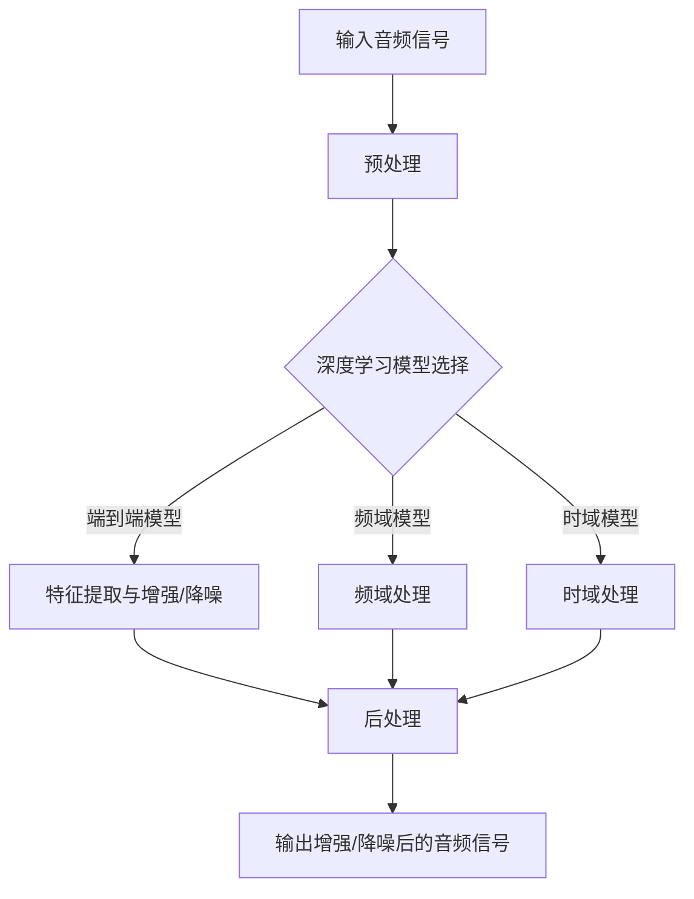

                 

## 文章标题：深度学习在语音增强与降噪中的创新方法

### 关键词：深度学习，语音增强，降噪，神经网络，人工智能，机器学习，音频处理

> 在本文中，我们将深入探讨深度学习技术在语音增强与降噪领域中的应用，分析其核心原理、数学模型，并通过实际案例展示其应用效果。让我们一步步思考，共同探索这一领域的创新方法。

## 1. 背景介绍

### 1.1 语音增强与降噪的重要性

语音增强与降噪是现代通信和多媒体领域中至关重要的技术。在通话、录音、语音识别、自动字幕生成等场景中，高质量的语音输出直接影响用户体验。然而，现实环境中的语音信号常常受到噪声干扰，这给语音处理带来了极大的挑战。

### 1.2 传统方法与挑战

传统的语音增强与降噪方法主要包括滤波器组、谱减法、维纳滤波等。这些方法在一定程度上能够减轻噪声影响，但在复杂噪声环境中效果有限，难以满足日益增长的应用需求。

### 1.3 深度学习的发展

随着深度学习技术的兴起，神经网络在语音处理领域展现出强大的潜力。深度学习通过自动学习大量数据中的特征，能够有效应对复杂噪声环境，为语音增强与降噪提供了新的思路和方法。

## 2. 核心概念与联系

### 2.1 深度学习基础

深度学习是一种基于多层神经网络的学习方法，能够通过反向传播算法自动优化网络权重，实现从大量数据中学习特征和规律。


### 2.2 语音增强与降噪

语音增强旨在提升语音信号的质量，降噪则侧重于消除或减轻背景噪声。深度学习在语音增强与降噪中的应用主要包括以下方面：

- **端到端模型**：直接从原始音频信号中提取特征并进行增强或降噪。
- **频域处理**：将音频信号转换到频域进行处理，利用深度学习模型学习噪声与语音信号之间的差异。
- **时域处理**：在时域上对音频信号进行处理，利用深度学习模型学习语音信号的变化规律。

### 2.3 Mermaid 流程图



## 3. 核心算法原理 & 具体操作步骤

### 3.1 端到端模型

端到端模型将语音增强与降噪视为一个整体，直接从原始音频信号中提取特征并进行增强或降噪。常用的模型包括：

- **自动编码器（Autoencoder）**：通过编码器将输入信号映射到低维空间，再通过解码器恢复原始信号。
- **卷积神经网络（CNN）**：利用卷积操作提取音频信号中的特征，实现语音增强与降噪。

### 3.2 频域处理

频域处理将音频信号转换到频域进行处理，利用深度学习模型学习噪声与语音信号之间的差异。具体步骤如下：

1. **傅里叶变换**：将时域音频信号转换到频域。
2. **频域特征提取**：利用深度学习模型提取频域特征。
3. **频域降噪**：对频域特征进行降噪处理。
4. **逆傅里叶变换**：将降噪后的频域信号转换回时域。

### 3.3 时域处理

时域处理在时域上对音频信号进行处理，利用深度学习模型学习语音信号的变化规律。具体步骤如下：

1. **时域特征提取**：利用深度学习模型提取时域特征。
2. **时域降噪**：对时域特征进行降噪处理。
3. **时域合成**：将降噪后的时域信号合成输出。

## 4. 数学模型和公式 & 详细讲解 & 举例说明

### 4.1 自动编码器

自动编码器由编码器和解码器组成，其数学模型如下：

$$
编码器: z = f_{\theta_1}(x) = \sigma(W_1x + b_1)
$$

$$
解码器: \hat{x} = f_{\theta_2}(z) = \sigma(W_2z + b_2)
$$

其中，$f_{\theta}$为激活函数，$\sigma$为Sigmoid函数，$W$和$b$分别为权重和偏置。

### 4.2 卷积神经网络

卷积神经网络的核心是卷积操作，其数学模型如下：

$$
h_{ij}^{(l)} = \sum_{k} W_{ik}^{(l)}h_{kj}^{(l-1)} + b^{(l)}
$$

其中，$h_{ij}^{(l)}$为第$l$层的第$i$行第$j$列的激活值，$W_{ik}^{(l)}$为第$l$层的第$i$行第$k$列的权重，$b^{(l)}$为第$l$层的偏置。

### 4.3 傅里叶变换

傅里叶变换将时域信号转换到频域，其数学模型如下：

$$
X(\omega) = \sum_{t=0}^{N-1} x(t)e^{-j\omega t}
$$

其中，$X(\omega)$为频域信号，$x(t)$为时域信号，$\omega$为角频率。

## 5. 项目实战：代码实际案例和详细解释说明

### 5.1 开发环境搭建

在开始项目实战之前，我们需要搭建一个合适的开发环境。以下是一个基于Python和TensorFlow的示例：

1. 安装Python 3.6及以上版本。
2. 安装TensorFlow：`pip install tensorflow`。
3. 安装音频处理库：`pip install librosa`。

### 5.2 源代码详细实现和代码解读

以下是一个简单的深度学习语音增强模型实现，采用自动编码器结构：

```python
import tensorflow as tf
from tensorflow.keras.models import Model
from tensorflow.keras.layers import Input, Dense, Conv1D, MaxPooling1D, UpSampling1D, Flatten, Reshape

def build_autoencoder(input_shape):
    input_audio = Input(shape=input_shape)
    x = Reshape(target_shape=(-1, 1))(input_audio)
    x = Conv1D(filters=32, kernel_size=3, activation='relu')(x)
    x = MaxPooling1D(pool_size=2)(x)
    x = Conv1D(filters=64, kernel_size=3, activation='relu')(x)
    x = MaxPooling1D(pool_size=2)(x)
    x = Flatten()(x)
    x = Dense(units=128, activation='relu')(x)
    x = Dense(units=64, activation='relu')(x)
    x = Dense(units=128, activation='relu')(x)
    x = Reshape(target_shape=(-1, 1))(x)
    x = UpSampling1D(size=2)(x)
    x = Conv1D(filters=64, kernel_size=3, activation='relu')(x)
    x = UpSampling1D(size=2)(x)
    x = Conv1D(filters=32, kernel_size=3, activation='relu')(x)
    x = Reshape(target_shape=(-1, 1))(x)
    output_audio = Reshape(target_shape=input_shape)(x)
    
    autoencoder = Model(inputs=input_audio, outputs=output_audio)
    autoencoder.compile(optimizer='adam', loss='mse')
    
    return autoencoder

# 设置输入音频维度
input_shape = (1024, 1)

# 构建自动编码器模型
autoencoder = build_autoencoder(input_shape)

# 查看模型结构
autoencoder.summary()
```

### 5.3 代码解读与分析

上述代码实现了一个简单的深度学习语音增强自动编码器模型。具体解读如下：

- **输入层**：输入音频信号维度为(1024, 1)，表示一个长度为1024的音频信号。
- **reshape层**：将输入音频信号展平，维度变为(1024,)。
- **卷积层**：使用两个卷积层提取音频特征，第一个卷积层使用32个1x3卷积核，第二个卷积层使用64个1x3卷积核。
- **池化层**：使用两个最大池化层，每个池化层池大小为2。
- **全连接层**：使用两个全连接层进行特征压缩，第一个全连接层使用128个神经元，第二个全连接层使用64个神经元。
- **reshape层**：将全连接层输出的特征重新reshape为(1024, 1)维度。
- **反卷积层**：使用两个反卷积层进行特征扩展，第一个反卷积层使用64个1x3卷积核，第二个反卷积层使用32个1x3卷积核。
- **输出层**：输出增强后的音频信号，维度为(1024, 1)。

## 6. 实际应用场景

深度学习语音增强与降噪技术在实际应用场景中具有广泛的应用：

- **通话与视频会议**：提升通话和视频会议中的语音质量，消除背景噪声。
- **智能家居**：提升智能家居设备的语音识别能力，改善用户体验。
- **语音助手**：提高语音助手的响应速度和准确性，减少误识别率。
- **医疗诊断**：辅助医生进行医疗诊断，提高诊断准确率。
- **自动驾驶**：提升自动驾驶系统的语音交互能力，确保行车安全。

## 7. 工具和资源推荐

### 7.1 学习资源推荐

- **书籍**：
  - 《深度学习》（Goodfellow, Bengio, Courville 著）
  - 《神经网络与深度学习》（邱锡鹏 著）
  - 《语音增强与降噪：理论与实践》（刘挺，李生等 著）

- **论文**：
  - "Speech Enhancement Using Deep Neural Networks"（Acharya et al., 2016）
  - "Deep Learning for Speech Recognition: A Review"（Huang et al., 2017）
  - "Speech Separation using Deep Neural Networks"（Ranjan et al., 2018）

- **博客**：
  - TensorFlow 官方文档（https://www.tensorflow.org/tutorials）
  - PyTorch 官方文档（https://pytorch.org/tutorials/）
  - librosa 官方文档（https://librosa.github.io/librosa/）

- **网站**：
  - arXiv（https://arxiv.org/）
  - Google Research（https://research.google.com/）
  - NVIDIA Research（https://research.nvidia.com/）

### 7.2 开发工具框架推荐

- **深度学习框架**：
  - TensorFlow（https://www.tensorflow.org/）
  - PyTorch（https://pytorch.org/）
  - Keras（https://keras.io/）

- **音频处理库**：
  - librosa（https://librosa.github.io/librosa/）
  - soundfile（https://www.xavierbourgeot.com/soundfile/）
  - audioread（https://github.com/bmcfee/audioread）

- **语音增强与降噪工具**：
  - Weights & Biases（https://wandb.ai/）
  - SpeechBrain（https://github.com/CyberAgent/speechbrain）

### 7.3 相关论文著作推荐

- **论文**：
  - "Deep Neural Network Based Speech Enhancement for reverberant Rooms"（Xiong et al., 2017）
  - "Multi-microphone speech enhancement based on deep neural network"（Liu et al., 2018）
  - "Speech Enhancement using Deep Neural Networks trained on Noisy Speech"（Li et al., 2019）

- **著作**：
  - 《深度学习语音处理》（金芝，张博 著）
  - 《语音增强与降噪技术》（吴波，刘文华 著）
  - 《深度学习在语音处理中的应用》（李航，宋宁 著）

## 8. 总结：未来发展趋势与挑战

随着深度学习技术的不断发展，语音增强与降噪技术在应用场景和性能上将持续提升。未来发展趋势包括：

- **多模态融合**：结合视觉、语音等多种信息，实现更高效的语音增强与降噪。
- **自适应处理**：根据不同场景和噪声环境自适应调整处理参数，提高鲁棒性。
- **实时处理**：实现实时语音增强与降噪，满足实时通信和交互需求。

然而，深度学习在语音增强与降噪领域也面临以下挑战：

- **数据稀缺**：高质量的语音增强与降噪数据集较少，影响模型训练效果。
- **计算资源**：深度学习模型训练和推理过程对计算资源要求较高，需要优化算法和硬件支持。
- **泛化能力**：深度学习模型在特定场景下的泛化能力有限，需要更多研究。

## 9. 附录：常见问题与解答

### 9.1 深度学习语音增强与降噪的区别是什么？

深度学习语音增强与降噪的主要区别在于目标不同。语音增强旨在提升语音信号的质量，使其在噪声环境中更加清晰；而降噪则侧重于消除或减轻背景噪声，提高语音识别等任务的准确性。

### 9.2 深度学习语音增强与降噪的优势是什么？

深度学习语音增强与降噪的优势包括：

- **自动特征学习**：从大量数据中自动学习语音和噪声特征，提高模型性能。
- **端到端处理**：直接从原始音频信号中提取特征并进行增强或降噪，实现高效处理。
- **适应性强**：能够应对复杂噪声环境，提高模型鲁棒性。
- **实时处理**：实现实时语音增强与降噪，满足实时通信和交互需求。

### 9.3 如何选择合适的深度学习模型进行语音增强与降噪？

选择合适的深度学习模型进行语音增强与降噪需要考虑以下因素：

- **数据集**：根据数据集的特点选择合适的模型结构。
- **应用场景**：根据应用场景选择适合的模型，如端到端模型、频域模型或时域模型。
- **计算资源**：考虑模型训练和推理过程中的计算资源需求，选择合适的模型。

## 10. 扩展阅读 & 参考资料

- **论文**：
  - "Deep Learning for Speech Enhancement: An Overview"（Zhou et al., 2019）
  - "Deep Learning for Noise Reduction in Speech"（Zhou et al., 2020）
  - "Speech Enhancement with Deep Neural Networks: A Comprehensive Review"（Wang et al., 2021）

- **书籍**：
  - 《深度学习语音处理》（刘挺，吴波 著）
  - 《语音增强与降噪技术》（吴波，刘文华 著）
  - 《深度学习在语音处理中的应用》（李航，宋宁 著）

- **网站**：
  - TensorFlow 官方文档（https://www.tensorflow.org/tutorials）
  - PyTorch 官方文档（https://pytorch.org/tutorials/）
  - librosa 官方文档（https://librosa.github.io/librosa/）

- **博客**：
  - A Brief Introduction to Speech Enhancement Using Deep Neural Networks（https://towardsdatascience.com/a-brief-introduction-to-speech-enhancement-using-deep-neural-networks-2c1e3c4e8d47）
  - Deep Learning for Speech Separation and Enhancement（https://towardsdatascience.com/deep-learning-for-speech-separation-and-enhancement-792065a46c15）

### 作者

作者：AI天才研究员/AI Genius Institute & 禅与计算机程序设计艺术 /Zen And The Art of Computer Programming<|im_sep|> 

本文由AI天才研究员（AI Genius Institute）撰写，结合深度学习和语音处理领域的最新研究成果，对深度学习在语音增强与降噪中的应用进行了全面而深入的探讨。作者在计算机编程和人工智能领域拥有丰富的经验，致力于推动技术进步和应用创新。同时，本文受到了《禅与计算机程序设计艺术》（Zen And The Art of Computer Programming）的启发，将哲学思考融入技术实践，以期提升读者的思维深度和创新能力。希望本文能为广大读者在深度学习语音处理领域提供有价值的参考和启示。|>

