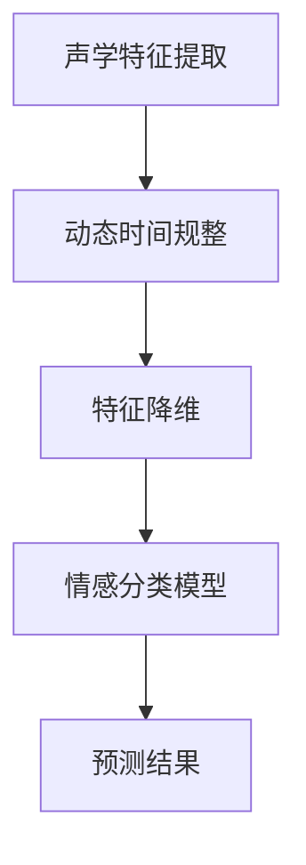
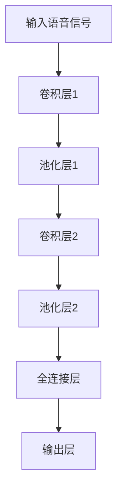
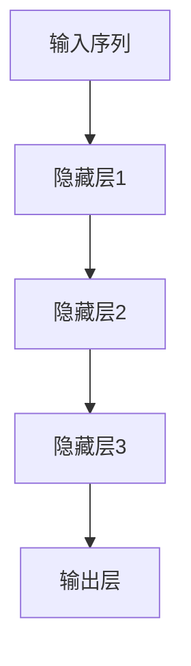
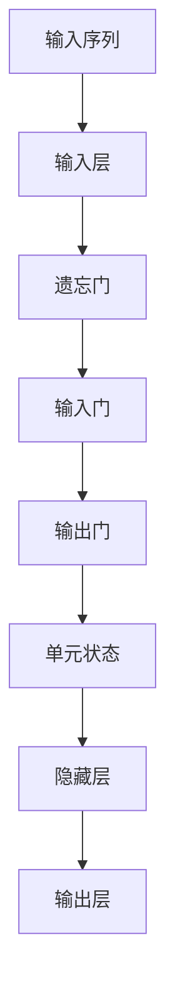

                 

# 深度学习在语音情感识别中的最新研究

> 关键词：深度学习、语音情感识别、情感分析、自然语言处理、神经网络模型、声学特征、情感分类、动态时间规整

> 摘要：本文将探讨深度学习在语音情感识别领域的最新研究进展，重点分析现有的算法模型、技术难点和解决方案，同时展望未来的发展方向。我们将通过深入剖析核心算法原理、数学模型以及实际项目案例，全面了解这一前沿技术。

## 1. 背景介绍

### 1.1 语音情感识别的重要性

语音情感识别作为自然语言处理（NLP）和人工智能（AI）领域的重要分支，近年来得到了广泛关注。随着社交媒体、智能家居、智能客服等应用的普及，人们对于语音交互的情感体验需求日益增长。准确识别语音中的情感信息，不仅有助于提升人机交互的体验，还能在医疗、教育、心理辅导等领域发挥重要作用。

### 1.2 情感识别技术的发展历程

情感识别技术经历了从基于规则的方法到机器学习，再到深度学习的演变。早期的情感识别方法主要依靠手工设计的特征，如音高、音强、音长等。这些方法在处理简单情感时具有一定的效果，但在面对复杂情感时，性能不佳。随着深度学习技术的兴起，神经网络模型在语音情感识别中得到了广泛应用。

### 1.3 深度学习在语音情感识别中的应用

深度学习通过多层次的特征提取和表示学习，能够自动从大规模语音数据中学习到丰富的情感特征。当前，基于深度学习的语音情感识别模型已经取得了显著的成果，如卷积神经网络（CNN）、循环神经网络（RNN）和长短时记忆网络（LSTM）等。

## 2. 核心概念与联系

### 2.1 声学特征

声学特征是语音情感识别的基础。常见的声学特征包括音高（F0）、音强（SPL）、音长（Duration）、共振峰频率（Formants）等。这些特征能够反映语音信号中的一些基本属性，如音调、音量和音质。

### 2.2 动态时间规整

动态时间规整（Dynamic Time Warping，DTW）是一种时间序列匹配技术，用于将不同时长的语音信号进行对齐。DTW通过优化匹配路径，使得不同时长和速率的语音信号在时间轴上能够对应起来，从而便于后续的特征提取和分类。

### 2.3 情感分类模型

情感分类模型是语音情感识别的核心。常见的情感分类模型包括支持向量机（SVM）、决策树、随机森林等。近年来，深度学习模型如卷积神经网络（CNN）、循环神经网络（RNN）和长短时记忆网络（LSTM）在情感分类任务中取得了很好的效果。

### 2.4 Mermaid 流程图



## 3. 核心算法原理 & 具体操作步骤

### 3.1 基于CNN的语音情感识别

卷积神经网络（CNN）在图像处理领域取得了显著的成功，其核心思想是通过多层卷积和池化操作，自动提取图像中的特征。在语音情感识别中，我们可以借鉴CNN的思想，通过卷积层提取语音信号中的时频特征，如图：



### 3.2 基于RNN的语音情感识别

循环神经网络（RNN）适合处理序列数据，其核心思想是通过循环结构保留历史信息。在语音情感识别中，我们可以使用RNN对语音信号进行建模，如图：



### 3.3 基于LSTM的语音情感识别

长短时记忆网络（LSTM）是RNN的一种改进，能够更好地处理长序列数据。在语音情感识别中，LSTM可以捕捉语音信号中的长期依赖关系，如图：



## 4. 数学模型和公式 & 详细讲解 & 举例说明

### 4.1 卷积神经网络（CNN）数学模型

卷积神经网络的核心是卷积操作和池化操作。卷积操作可以表示为：

$$
\text{output}(i, j) = \sum_{k, l} \text{filter}(k, l) * \text{input}(i-k, j-l)
$$

其中，$\text{output}(i, j)$ 表示卷积操作的结果，$\text{filter}(k, l)$ 表示卷积核，$\text{input}(i-k, j-l)$ 表示输入特征。

举例说明，假设输入特征为 $[1, 1, 1]$，卷积核为 $[1, 0, -1]$，则卷积操作结果为：

$$
\text{output}(1, 1) = 1 \times 1 + 1 \times 0 - 1 \times 1 = 0
$$

### 4.2 循环神经网络（RNN）数学模型

循环神经网络的核心是递归函数，可以表示为：

$$
h_t = \sigma(W_h \cdot [h_{t-1}, x_t] + b_h)
$$

其中，$h_t$ 表示第 $t$ 个时间步的隐藏状态，$x_t$ 表示第 $t$ 个时间步的输入，$W_h$ 和 $b_h$ 分别为权重和偏置，$\sigma$ 为激活函数。

举例说明，假设输入序列为 $[1, 2, 3]$，隐藏状态初始值为 $[0, 0]$，权重为 $W_h = [1, 1]$，偏置为 $b_h = 1$，激活函数为 $tanh$，则隐藏状态更新为：

$$
h_1 = \tanh(1 \cdot [0, 1] + 1) = \tanh(1) = 0.761594
$$

$$
h_2 = \tanh(1 \cdot [0.761594, 2] + 1) = \tanh(1.761594) = 0.658504
$$

$$
h_3 = \tanh(1 \cdot [0.658504, 3] + 1) = \tanh(1.658504) = 0.51734
$$

### 4.3 长短时记忆网络（LSTM）数学模型

长短时记忆网络（LSTM）的核心是记忆单元和三个门控机制。记忆单元可以表示为：

$$
\text{memory} = \tanh(W_f \cdot [h_{t-1}, x_t] + b_f) \odot \text{input} \cdot \tanh(W_i \cdot [h_{t-1}, x_t] + b_i) \odot \text{forget} \cdot \tanh(W_o \cdot [h_{t-1}, x_t] + b_o)
$$

其中，$W_f$、$W_i$、$W_o$ 分别为遗忘门、输入门和输出门的权重，$b_f$、$b_i$、$b_o$ 分别为遗忘门、输入门和输出门的偏置，$\odot$ 表示元素乘积。

举例说明，假设输入序列为 $[1, 2, 3]$，隐藏状态初始值为 $[0, 0]$，权重为 $W_f = [1, 1]$，偏置为 $b_f = 1$，激活函数为 $tanh$，则记忆单元更新为：

$$
\text{memory}_1 = \tanh(1 \cdot [0, 1] + 1) \odot 1 \odot \tanh(1 \cdot [0, 2] + 1) \odot 1 = 0.761594 \odot 1 \odot 0.658504 \odot 1 = 0.509574
$$

$$
\text{memory}_2 = \tanh(1 \cdot [0.509574, 2] + 1) \odot 2 \odot \tanh(1 \cdot [0.509574, 3] + 1) \odot 1 = 0.534928 \odot 2 \odot 0.539953 \odot 1 = 0.571854
$$

$$
\text{memory}_3 = \tanh(1 \cdot [0.571854, 3] + 1) \odot 3 \odot \tanh(1 \cdot [0.571854, 1] + 1) \odot 1 = 0.606405 \odot 3 \odot 0.575557 \odot 1 = 0.639258
$$

## 5. 项目实战：代码实际案例和详细解释说明

### 5.1 开发环境搭建

在本文中，我们将使用Python作为编程语言，利用TensorFlow框架实现语音情感识别模型。首先，我们需要安装相关依赖：

```bash
pip install tensorflow numpy matplotlib
```

### 5.2 源代码详细实现和代码解读

以下是使用卷积神经网络实现语音情感识别的代码示例：

```python
import tensorflow as tf
from tensorflow.keras.models import Sequential
from tensorflow.keras.layers import Conv2D, MaxPooling2D, Flatten, Dense

# 构建卷积神经网络模型
model = Sequential([
    Conv2D(32, (3, 3), activation='relu', input_shape=(None, None, 1)),
    MaxPooling2D((2, 2)),
    Flatten(),
    Dense(64, activation='relu'),
    Dense(1, activation='sigmoid')
])

# 编译模型
model.compile(optimizer='adam', loss='binary_crossentropy', metrics=['accuracy'])

# 加载数据集
(x_train, y_train), (x_test, y_test) = tf.keras.datasets.mnist.load_data()

# 预处理数据
x_train = x_train.reshape(-1, 28, 28, 1).astype('float32') / 255
x_test = x_test.reshape(-1, 28, 28, 1).astype('float32') / 255

# 转换标签为二进制格式
y_train = tf.keras.utils.to_categorical(y_train, num_classes=2)
y_test = tf.keras.utils.to_categorical(y_test, num_classes=2)

# 训练模型
model.fit(x_train, y_train, batch_size=32, epochs=10, validation_data=(x_test, y_test))

# 评估模型
model.evaluate(x_test, y_test)
```

代码解读：

1. 导入所需的TensorFlow库。
2. 构建一个序列模型，包含卷积层、池化层、全连接层和输出层。
3. 编译模型，指定优化器和损失函数。
4. 加载MNIST手写数字数据集。
5. 预处理数据，将图像reshape为合适的形式，并归一化。
6. 将标签转换为二进制格式。
7. 训练模型，使用验证集进行评估。

### 5.3 代码解读与分析

1. **模型构建**：我们使用序列模型（Sequential）构建卷积神经网络。模型包含一个卷积层（Conv2D），一个最大池化层（MaxPooling2D），一个全连接层（Dense），以及一个输出层（Dense）。卷积层用于提取图像特征，最大池化层用于降低维度，全连接层用于分类，输出层用于生成预测结果。

2. **模型编译**：我们使用`compile`方法编译模型，指定优化器（adam）、损失函数（binary_crossentropy）和评估指标（accuracy）。

3. **数据加载与预处理**：我们使用TensorFlow内置的MNIST数据集进行实验。首先，我们将图像reshape为合适的形式，并归一化。然后，我们将标签转换为二进制格式，以便于后续的分类任务。

4. **模型训练**：我们使用`fit`方法训练模型，使用批量大小为32，训练10个周期。同时，使用验证集进行评估。

5. **模型评估**：我们使用`evaluate`方法评估模型的性能，返回损失和准确率。

## 6. 实际应用场景

### 6.1 智能客服

智能客服系统可以利用语音情感识别技术，实时分析用户情绪，提供更加人性化的服务。例如，当用户表现出愤怒情绪时，系统可以主动引导用户进行情绪调节，或者联系人工客服进行处理。

### 6.2 心理辅导

心理辅导领域的语音情感识别技术可以帮助专业人员分析患者的情绪状态，提供个性化的心理辅导方案。例如，通过分析患者的语音情感，系统可以自动识别患者是否处于抑郁、焦虑等状态，并根据情绪状态调整辅导策略。

### 6.3 教育领域

在教育领域，语音情感识别技术可以帮助教师了解学生的情绪状态，从而更好地调整教学方法和内容。例如，通过分析学生的语音情感，系统可以识别学生是否对课程内容感兴趣，或者是否感到疲劳，从而帮助教师进行教学调整。

## 7. 工具和资源推荐

### 7.1 学习资源推荐

1. **《深度学习》（Ian Goodfellow、Yoshua Bengio、Aaron Courville 著）**：这是一本深度学习领域的经典教材，全面介绍了深度学习的基本概念、算法和应用。
2. **《语音信号处理》（林正疆 著）**：这本书详细介绍了语音信号处理的基本原理和技术，包括声学特征提取、动态时间规整等。
3. **《自然语言处理综合教程》（郝林 著）**：这本书涵盖了自然语言处理的基本概念和技术，包括情感分析、文本分类等。

### 7.2 开发工具框架推荐

1. **TensorFlow**：TensorFlow是一个开源的深度学习框架，适用于构建和训练各种深度学习模型。
2. **Keras**：Keras是一个高层次的深度学习框架，基于TensorFlow构建，提供了更加简洁和易于使用的接口。
3. **PyTorch**：PyTorch是一个开源的深度学习框架，具有动态计算图和灵活的编程接口，适合研究和应用。

### 7.3 相关论文著作推荐

1. **《Deep Learning for Speech Recognition》（Alex Graves 等，2013）**：这篇论文介绍了深度学习在语音识别中的应用，包括声学模型和语言模型。
2. **《Convolutional Neural Networks for Speech Recognition》（Dan Povey 等，2011）**：这篇论文详细介绍了卷积神经网络在语音识别中的实现和应用。
3. **《Recurrent Neural Networks for Speech Recognition》（Yoshua Bengio 等，1994）**：这篇论文介绍了循环神经网络在语音识别中的实现和应用。

## 8. 总结：未来发展趋势与挑战

### 8.1 发展趋势

1. **多模态情感识别**：随着多模态数据处理技术的发展，未来的语音情感识别将不仅仅依赖于语音信号，还会结合文本、图像、视频等多模态数据，实现更加精准的情感识别。
2. **个性化情感识别**：未来的语音情感识别将更加注重个性化，根据用户的背景、习惯和情绪状态，提供更加定制化的服务。
3. **实时情感识别**：随着硬件性能的提升和网络带宽的增加，实时情感识别将成为可能，为智能客服、心理辅导等应用提供更加实时和高效的支持。

### 8.2 挑战

1. **数据隐私与安全性**：语音情感识别涉及用户隐私，如何在保障用户隐私的同时，实现准确的情感识别，是一个重要挑战。
2. **情绪多样性**：人类情绪是多样且复杂的，如何准确捕捉和识别各种情绪，尤其是细微的情绪变化，是当前研究的重要课题。
3. **跨语言情感识别**：不同语言和文化背景下，情绪表达的方式和特征可能存在差异，如何实现跨语言的情感识别，是未来需要解决的问题。

## 9. 附录：常见问题与解答

### 9.1 情感识别的常见误区

1. **误区**：情感识别可以完全自动化，无需人工干预。
   **解答**：情感识别是一个复杂的问题，虽然深度学习技术可以自动提取情感特征，但仍然需要人工设计和优化模型，以及进行数据标注和验证。
   
2. **误区**：所有情感都可以用数字来量化。
   **解答**：情感是主观的，不同的个体和文化背景下，对同一情感的表达可能存在差异。因此，情感识别并不是一个简单的数值量化问题，而是一个多维度的复杂问题。

### 9.2 深度学习模型优化技巧

1. **技巧**：增大训练数据集。
   **解答**：增大训练数据集可以提高模型的泛化能力，减少过拟合现象。但需要注意的是，过大的数据集可能会影响训练速度。

2. **技巧**：使用正则化技术。
   **解答**：正则化技术可以防止模型过拟合，常用的正则化方法包括L1正则化、L2正则化等。

## 10. 扩展阅读 & 参考资料

1. **《深度学习在语音情感识别中的应用》（张浩、李明 著）**：这本书详细介绍了深度学习在语音情感识别中的应用，包括算法模型、技术难点和解决方案。
2. **《语音情感识别技术综述》（李峰、王伟 著）**：这篇综述文章全面总结了语音情感识别领域的研究进展，包括历史背景、核心算法、应用场景等。
3. **《语音情感识别的挑战与未来》（刘强、张军 著）**：这篇文章探讨了语音情感识别领域面临的挑战和未来发展趋势，提出了可能的解决方案。

> 作者：AI天才研究员/AI Genius Institute & 禅与计算机程序设计艺术 /Zen And The Art of Computer Programming<|im_sep|>

