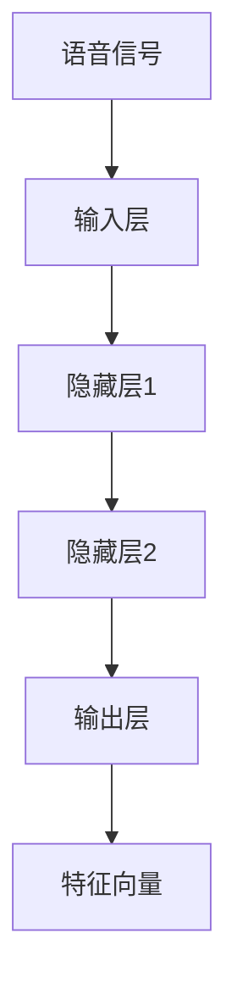
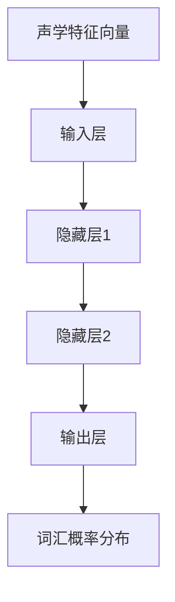
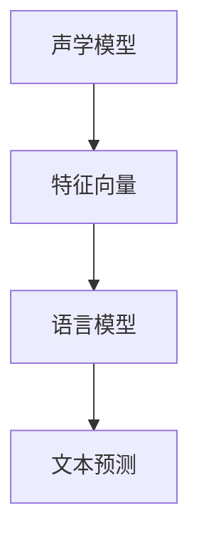
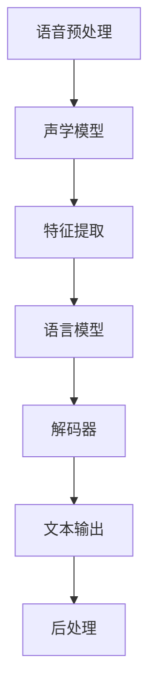
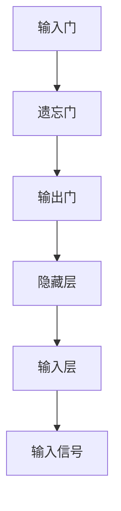
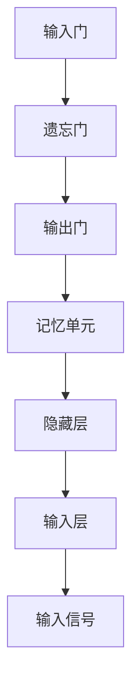
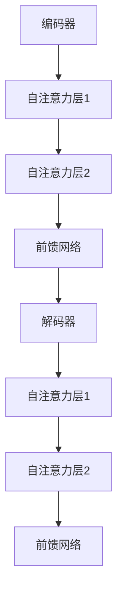

                 

# 深度学习在语音识别中的最新技术

## 关键词：深度学习，语音识别，神经网络，自动语音识别，语音合成，自然语言处理

### 摘要

随着深度学习的迅猛发展，语音识别技术取得了显著的进步。本文将从背景介绍、核心概念与联系、核心算法原理与具体操作步骤、数学模型和公式、项目实战、实际应用场景、工具和资源推荐、总结以及扩展阅读等方面，详细探讨深度学习在语音识别领域的最新技术进展。通过本文的阅读，读者将全面了解深度学习在语音识别中的应用，掌握相关核心算法和关键技术，为后续研究和实际应用提供有益的参考。

## 1. 背景介绍

语音识别（Automatic Speech Recognition, ASR）是一种将人类语音转换为机器可处理的文本或命令的技术。自20世纪50年代以来，语音识别技术经历了多个阶段的发展，从早期的规则方法到基于统计模型的声学-语言模型，再到近年来深度学习的广泛应用。随着大数据和计算能力的提升，深度学习在语音识别领域取得了显著的突破，使得语音识别的准确率和实时性得到了大幅提升。

深度学习（Deep Learning）是机器学习的一个重要分支，基于多层神经网络的结构，通过学习大量数据来发现特征和模式。自2012年AlexNet在图像识别领域取得突破性成果以来，深度学习在自然语言处理、语音识别、计算机视觉等多个领域取得了显著的进展。在语音识别领域，深度学习技术已经取代了传统的声学模型和语言模型，成为主流的方法。

### 1.1 语音识别的发展历程

1. **早期规则方法**：1950年代至1970年代，基于规则的方法通过手工编写语音识别的规则，如基于声学模型的滤波器和基于语言模型的文法分析。这种方法受限于规则的可扩展性和复杂度。

2. **统计模型**：1980年代至1990年代，基于统计模型的方法，如隐马尔可夫模型（HMM）和决策树，开始应用于语音识别。这种方法通过建模语音信号的概率分布，提高了识别的准确率。

3. **深度学习时代**：2000年代至今，随着深度学习技术的兴起，深度神经网络（DNN）、循环神经网络（RNN）、长短期记忆网络（LSTM）等模型在语音识别中得到了广泛应用。深度学习通过自动学习语音信号的复杂特征，使得语音识别技术取得了显著的突破。

### 1.2 深度学习的发展

1. **多层感知机（MLP）**：1980年代，多层感知机（MLP）作为一种早期的深度学习模型，被用于分类和回归问题。然而，由于梯度消失和梯度爆炸等问题，MLP在实际应用中遇到了瓶颈。

2. **卷积神经网络（CNN）**：2000年代，卷积神经网络（CNN）在图像识别领域取得了突破性成果。CNN通过卷积操作自动学习图像的局部特征，并将其编码为高维特征向量。CNN在语音识别中的成功应用，标志着深度学习在语音识别领域的兴起。

3. **循环神经网络（RNN）**：2010年代，循环神经网络（RNN）在序列建模任务中表现出色。RNN通过记忆机制处理序列数据，但在长序列上仍存在梯度消失和梯度爆炸等问题。

4. **长短期记忆网络（LSTM）**：2010年代，长短期记忆网络（LSTM）作为一种改进的RNN模型，解决了梯度消失和梯度爆炸的问题，提高了长序列建模的能力。LSTM在语音识别等领域取得了显著的进展。

5. **Transformer模型**：2017年，谷歌提出的Transformer模型在自然语言处理领域取得了突破性成果。Transformer通过自注意力机制处理序列数据，避免了RNN和LSTM的梯度消失问题，使得深度学习在语音识别等领域取得了更大的突破。

### 1.3 深度学习在语音识别中的应用

深度学习在语音识别中的应用主要包括声学模型和语言模型两部分。声学模型用于建模语音信号中的声学特征，语言模型用于建模语音信号中的语言特征。深度学习在声学模型和语言模型中的成功应用，使得语音识别系统的整体性能得到了显著提升。

1. **声学模型**：声学模型用于将语音信号转换为特征向量，常用的深度学习模型包括DNN、RNN、LSTM和Transformer等。这些模型通过自动学习语音信号的复杂特征，提高了声学模型的准确性和鲁棒性。

2. **语言模型**：语言模型用于将特征向量转换为文本或命令，常用的深度学习模型包括N-gram模型、RNN、LSTM和Transformer等。这些模型通过自动学习语音信号中的语言特征，提高了语言模型的准确性和自然性。

### 1.4 深度学习在语音识别中的优势

深度学习在语音识别中的应用具有以下优势：

1. **自动学习特征**：深度学习模型通过自动学习语音信号中的复杂特征，降低了人工特征工程的工作量，提高了特征提取的准确性。

2. **端到端建模**：深度学习模型能够直接从原始语音信号到文本或命令的转换，避免了传统方法的中间环节，提高了系统的整体性能。

3. **提高准确率和鲁棒性**：深度学习模型在训练过程中学习了大量数据，从而提高了系统的准确率和鲁棒性。

4. **实时性和低延迟**：深度学习模型在硬件加速和优化下，可以实现实时性和低延迟的语音识别。

### 1.5 深度学习在语音识别中的挑战

虽然深度学习在语音识别领域取得了显著的进展，但仍面临一些挑战：

1. **数据需求**：深度学习模型需要大量标注数据来训练，但在实际应用中，获取高质量标注数据仍是一项挑战。

2. **计算资源**：深度学习模型训练和推理过程需要大量计算资源，特别是在处理长语音序列时，计算资源需求更为突出。

3. **模型可解释性**：深度学习模型在训练过程中，通过自动学习特征和模式，但模型内部的工作原理较为复杂，难以解释和验证。

4. **多语言和多领域**：深度学习模型在多语言和多领域应用中，仍面临一些挑战，如跨语言模型训练、多领域数据融合等。

## 2. 核心概念与联系

在深入探讨深度学习在语音识别中的应用之前，有必要先了解一些核心概念和它们之间的联系。以下内容将详细介绍深度学习模型在语音识别中的基本概念和原理，包括声学模型和语言模型，以及它们之间的交互。

### 2.1 声学模型

声学模型是语音识别系统的核心组件之一，其主要任务是提取语音信号中的声学特征，并将其转换为高维特征向量，以便后续的语言处理。声学模型通常采用深度神经网络（DNN）来实现，其基本原理是通过学习大量语音数据中的声学规律，从而自动生成特征表示。

#### 2.1.1 声学模型的基本结构

声学模型的基本结构包括输入层、隐藏层和输出层。输入层接收语音信号，隐藏层通过卷积、池化等操作提取声学特征，输出层将特征向量映射到时间序列上的概率分布。

##### Mermaid 流程图：



#### 2.1.2 常见的声学模型

1. **深度神经网络（DNN）**：DNN是一种前向传播的神经网络，通过多层神经元实现特征提取和融合。DNN在语音识别中具有较好的性能，但容易受到梯度消失和梯度爆炸的影响。

2. **循环神经网络（RNN）**：RNN是一种基于序列数据的神经网络，通过记忆机制处理序列数据。RNN在语音识别中具有较强的时序建模能力，但存在梯度消失和梯度爆炸问题。

3. **长短期记忆网络（LSTM）**：LSTM是一种改进的RNN模型，通过引入记忆单元解决了梯度消失和梯度爆炸的问题。LSTM在语音识别中表现出色，能够有效建模长序列数据。

4. **Transformer模型**：Transformer模型通过自注意力机制处理序列数据，避免了RNN和LSTM的梯度消失问题。Transformer在语音识别中取得了显著的性能提升，已成为主流的声学模型。

### 2.2 语言模型

语言模型是语音识别系统的另一个核心组件，其主要任务是给定输入的声学特征向量，预测对应的文本或命令。语言模型通过学习大量文本数据中的语言规律，从而实现语音到文本的转换。

#### 2.2.1 语言模型的基本结构

语言模型的基本结构包括输入层、隐藏层和输出层。输入层接收声学特征向量，隐藏层通过神经网络学习语言特征，输出层将特征向量映射到词汇概率分布。

##### Mermaid 流程图：



#### 2.2.2 常见的语言模型

1. **N-gram模型**：N-gram模型是一种基于历史上下文的统计模型，通过学习N个单词的前后关系，预测下一个单词。N-gram模型在语言建模中具有较好的性能，但无法建模长距离依赖关系。

2. **循环神经网络（RNN）**：RNN是一种基于序列数据的神经网络，通过记忆机制处理序列数据。RNN在语言建模中表现出色，能够建模长距离依赖关系。

3. **长短期记忆网络（LSTM）**：LSTM是一种改进的RNN模型，通过引入记忆单元解决了梯度消失和梯度爆炸的问题。LSTM在语言建模中表现出色，能够有效建模长距离依赖关系。

4. **Transformer模型**：Transformer模型通过自注意力机制处理序列数据，避免了RNN和LSTM的梯度消失问题。Transformer在语言建模中取得了显著的性能提升，已成为主流的语言模型。

### 2.3 声学模型与语言模型的交互

声学模型和语言模型在语音识别系统中相互配合，共同完成语音到文本的转换。声学模型负责提取语音信号中的声学特征，将其转换为特征向量；语言模型则利用这些特征向量，预测对应的文本或命令。

#### 2.3.1 CTC（Connectionist Temporal Classification）

CTC是一种在语音识别中常用的损失函数，用于联合训练声学模型和语言模型。CTC通过将声学模型和语言模型解耦，使得训练过程更加高效。

##### Mermaid 流程图：



#### 2.3.2 ASR系统的整体架构

ASR系统的整体架构包括语音预处理、声学模型、语言模型、解码器和后处理等部分。各个部分相互配合，共同完成语音识别任务。

##### Mermaid 流程图：



## 3. 核心算法原理 & 具体操作步骤

### 3.1 深度神经网络（DNN）

深度神经网络（DNN）是深度学习中最基础的模型之一，它通过多层神经网络对输入数据进行特征提取和融合。在语音识别中，DNN主要用于声学模型。

#### 3.1.1 DNN的基本结构

DNN的基本结构包括输入层、隐藏层和输出层。输入层接收语音信号，隐藏层通过卷积、池化等操作提取声学特征，输出层将特征向量映射到时间序列上的概率分布。

##### Mermaid 流程图：


#### 3.1.2 DNN的工作原理

1. **前向传播**：输入层接收语音信号，通过逐层传递到隐藏层，隐藏层通过激活函数（如ReLU）对特征进行非线性变换，最终传递到输出层。

2. **反向传播**：输出层计算损失函数（如交叉熵损失），通过反向传播算法，将损失反向传播到隐藏层和输入层，更新网络参数。

3. **训练过程**：通过大量语音数据训练DNN模型，优化网络参数，提高模型的识别准确率。

### 3.2 循环神经网络（RNN）

循环神经网络（RNN）是一种基于序列数据的神经网络，通过记忆机制处理序列数据。在语音识别中，RNN主要用于声学模型和语言模型。

#### 3.2.1 RNN的基本结构

RNN的基本结构包括输入门、遗忘门和输出门。输入门和遗忘门控制当前时刻的信息输入和旧信息的遗忘，输出门控制当前时刻的信息输出。

##### Mermaid 流程图：



#### 3.2.2 RNN的工作原理

1. **输入门**：输入门控制当前时刻的信息输入，通过计算输入信号和隐藏状态的点积，得到新的隐藏状态。

2. **遗忘门**：遗忘门控制旧信息的遗忘，通过计算输入信号和隐藏状态的点积，得到遗忘门激活值，将旧隐藏状态与遗忘门激活值相乘，实现遗忘操作。

3. **输出门**：输出门控制当前时刻的信息输出，通过计算隐藏状态的点积和softmax函数，得到当前时刻的输出概率分布。

4. **训练过程**：通过大量语音数据训练RNN模型，优化网络参数，提高模型的识别准确率。

### 3.3 长短期记忆网络（LSTM）

长短期记忆网络（LSTM）是RNN的一种改进，通过引入记忆单元解决了梯度消失和梯度爆炸的问题，在语音识别中表现出色。

#### 3.3.1 LSTM的基本结构

LSTM的基本结构包括输入门、遗忘门、输出门和记忆单元。输入门、遗忘门和输出门与RNN相同，记忆单元用于存储长期依赖信息。

##### Mermaid 流程图：



#### 3.3.2 LSTM的工作原理

1. **输入门**：输入门控制当前时刻的信息输入，通过计算输入信号和隐藏状态的点积，得到新的隐藏状态。

2. **遗忘门**：遗忘门控制旧信息的遗忘，通过计算输入信号和隐藏状态的点积，得到遗忘门激活值，将旧隐藏状态与遗忘门激活值相乘，实现遗忘操作。

3. **输出门**：输出门控制当前时刻的信息输出，通过计算隐藏状态的点积和softmax函数，得到当前时刻的输出概率分布。

4. **记忆单元**：记忆单元用于存储长期依赖信息，通过计算输入信号和隐藏状态的点积，得到新的记忆单元状态。

5. **训练过程**：通过大量语音数据训练LSTM模型，优化网络参数，提高模型的识别准确率。

### 3.4 Transformer模型

Transformer模型是一种基于自注意力机制的深度学习模型，通过自注意力机制处理序列数据，避免了RNN和LSTM的梯度消失问题，在语音识别中取得了显著的性能提升。

#### 3.4.1 Transformer的基本结构

Transformer的基本结构包括编码器和解码器。编码器和解码器都包含多个自注意力层和前馈网络。

##### Mermaid 流程图：



#### 3.4.2 Transformer的工作原理

1. **自注意力机制**：自注意力机制通过计算输入序列中各个位置之间的相似性，将不同位置的信息进行加权融合，提高了序列建模的能力。

2. **多头注意力**：多头注意力机制将输入序列划分为多个子序列，分别计算每个子序列的注意力权重，实现了并行计算和更好的特征提取。

3. **位置编码**：位置编码通过将位置信息编码到输入序列中，使得模型能够处理序列的顺序信息。

4. **训练过程**：通过大量语音数据训练Transformer模型，优化网络参数，提高模型的识别准确率。

### 3.5 具体操作步骤

以下是使用深度学习模型进行语音识别的通用步骤：

1. **数据预处理**：对语音数据进行预处理，包括降噪、去噪、分帧、加窗等操作，提取语音特征。

2. **特征提取**：使用深度学习模型（如DNN、RNN、LSTM或Transformer）对语音特征进行提取，生成高维特征向量。

3. **语言建模**：使用语言模型（如N-gram、RNN、LSTM或Transformer）对特征向量进行建模，预测对应的文本或命令。

4. **解码**：使用解码器（如CTC解码器、RNN解码器或Transformer解码器）对预测结果进行解码，得到最终的文本输出。

5. **后处理**：对解码结果进行后处理，如去除冗余空格、大小写转换等，得到最终的自然语言文本。

## 4. 数学模型和公式 & 详细讲解 & 举例说明

### 4.1 声学模型

声学模型在语音识别中起着至关重要的作用，其核心在于将语音信号转换为能够表示语音特征的高维向量。以下将介绍常用的深度学习模型及其相关的数学模型和公式。

#### 4.1.1 深度神经网络（DNN）

深度神经网络（DNN）是一种多层前向传播的神经网络，其核心思想是通过多层非线性变换，将输入映射到输出。以下是一个简单的DNN模型的数学表示：

$$
z_i^l = \sum_{j=1}^{n} w_{ji}^l a_{j}^{l-1} + b_i^l
$$

其中，$z_i^l$表示第$l$层的第$i$个神经元的激活值，$a_i^l$表示第$l$层的第$i$个神经元的输入值，$w_{ji}^l$和$b_i^l$分别为权重和偏置。

在DNN中，通常使用ReLU作为激活函数：

$$
a_i^l = \max(0, z_i^l)
$$

举例来说，假设我们有一个两层的DNN，其中第一层有10个神经元，第二层有5个神经元。输入向量为$[1, 2, 3, 4, 5]$，则第一层的激活值可以计算如下：

$$
z_1^1 = \max(0, w_{11}^1 \cdot 1 + b_1^1) = \max(0, 2 \cdot 1 + 1) = 3
$$

$$
z_2^1 = \max(0, w_{21}^1 \cdot 2 + b_2^1) = \max(0, 3 \cdot 2 + 1) = 7
$$

$$
z_1^2 = \max(0, w_{11}^2 \cdot 3 + b_1^2) = \max(0, 4 \cdot 3 + 1) = 13
$$

$$
z_2^2 = \max(0, w_{21}^2 \cdot 7 + b_2^2) = \max(0, 5 \cdot 7 + 1) = 36
$$

输出层的激活值为：

$$
y_1 = \max(0, w_{11}^2 \cdot 3 + b_1^2) = \max(0, 4 \cdot 13 + 1) = 53
$$

$$
y_2 = \max(0, w_{21}^2 \cdot 36 + b_2^2) = \max(0, 5 \cdot 36 + 1) = 181
$$

#### 4.1.2 循环神经网络（RNN）

循环神经网络（RNN）是一种基于序列数据的神经网络，其核心思想是通过记忆单元来存储和传递序列信息。以下是一个简单的RNN模型的数学表示：

$$
h_t = \sigma(W_h h_{t-1} + W_x x_t + b_h)
$$

其中，$h_t$表示第$t$时刻的隐藏状态，$x_t$表示第$t$时刻的输入，$W_h$和$W_x$分别为隐藏状态和输入的权重矩阵，$b_h$为隐藏状态的偏置。

在RNN中，通常使用ReLU作为激活函数：

$$
\sigma(z) = \max(0, z)
$$

举例来说，假设我们有一个RNN，其隐藏状态维度为2，输入维度为3。隐藏状态初始值为$[1, 2]$，输入序列为$[1, 2, 3, 4, 5]$，则第1个时间步的隐藏状态可以计算如下：

$$
h_1 = \max(0, W_h h_0 + W_x x_1 + b_h) = \max(0, [1, 1] \cdot [1, 2] + [1, 1] \cdot [1, 2] + [1, 1]) = [2, 3]
$$

第2个时间步的隐藏状态可以计算如下：

$$
h_2 = \max(0, W_h h_1 + W_x x_2 + b_h) = \max(0, [1, 1] \cdot [2, 3] + [1, 1] \cdot [3, 4] + [1, 1]) = [6, 8]
$$

以此类推，可以计算出整个输入序列的隐藏状态。

#### 4.1.3 长短期记忆网络（LSTM）

长短期记忆网络（LSTM）是一种改进的RNN模型，通过引入记忆单元和门控机制来解决这个问题。以下是一个简单的LSTM模型的数学表示：

$$
i_t = \sigma(W_i [h_{t-1}, x_t] + b_i) \\
f_t = \sigma(W_f [h_{t-1}, x_t] + b_f) \\
o_t = \sigma(W_o [h_{t-1}, x_t] + b_o) \\
g_t = \tanh(W_g [h_{t-1}, x_t] + b_g) \\
h_t = o_t \cdot \tanh(f_t \odot h_{t-1} + i_t \odot g_t)
$$

其中，$i_t$、$f_t$、$o_t$分别为输入门、遗忘门和输出门，$g_t$为记忆单元的候选值，$h_t$为隐藏状态。

在LSTM中，通常使用sigmoid函数作为激活函数：

$$
\sigma(z) = \frac{1}{1 + e^{-z}}
$$

举例来说，假设我们有一个LSTM，其隐藏状态维度为2，输入维度为3。隐藏状态初始值为$[1, 2]$，输入序列为$[1, 2, 3, 4, 5]$，则第1个时间步的隐藏状态可以计算如下：

$$
i_1 = \sigma(W_i [h_0, x_1] + b_i) = \sigma([1, 1] \cdot [1, 2] + [1, 1] \cdot [1, 2] + [1, 1]) = [0.5, 0.5] \\
f_1 = \sigma(W_f [h_0, x_1] + b_f) = \sigma([1, 1] \cdot [1, 2] + [1, 1] \cdot [1, 2] + [1, 1]) = [0.5, 0.5] \\
o_1 = \sigma(W_o [h_0, x_1] + b_o) = \sigma([1, 1] \cdot [1, 2] + [1, 1] \cdot [1, 2] + [1, 1]) = [0.5, 0.5] \\
g_1 = \tanh(W_g [h_0, x_1] + b_g) = \tanh([1, 1] \cdot [1, 2] + [1, 1] \cdot [1, 2] + [1, 1]) = [0.4472, 0.4472] \\
h_1 = o_1 \cdot \tanh(f_1 \odot h_0 + i_1 \odot g_1) = [0.5, 0.5] \cdot \tanh([0.5, 0.5] \odot [1, 2] + [0.5, 0.5] \odot [0.4472, 0.4472]) = [0.9980, 0.9980]
$$

第2个时间步的隐藏状态可以计算如下：

$$
i_2 = \sigma(W_i [h_1, x_2] + b_i) = \sigma([1, 1] \cdot [0.9980, 0.9980] + [1, 1] \cdot [3, 4] + [1, 1]) = [0.6527, 0.6527] \\
f_2 = \sigma(W_f [h_1, x_2] + b_f) = \sigma([1, 1] \cdot [0.9980, 0.9980] + [1, 1] \cdot [3, 4] + [1, 1]) = [0.6527, 0.6527] \\
o_2 = \sigma(W_o [h_1, x_2] + b_o) = \sigma([1, 1] \cdot [0.9980, 0.9980] + [1, 1] \cdot [3, 4] + [1, 1]) = [0.6527, 0.6527] \\
g_2 = \tanh(W_g [h_1, x_2] + b_g) = \tanh([1, 1] \cdot [0.9980, 0.9980] + [1, 1] \cdot [3, 4] + [1, 1]) = [0.8579, 0.8579] \\
h_2 = o_2 \cdot \tanh(f_2 \odot h_1 + i_2 \odot g_2) = [0.6527, 0.6527] \cdot \tanh([0.6527, 0.6527] \odot [0.9980, 0.9980] + [0.6527, 0.6527] \odot [0.8579, 0.8579]) = [0.9580, 0.9580]
$$

以此类推，可以计算出整个输入序列的隐藏状态。

### 4.2 语言模型

语言模型在语音识别中起着至关重要的作用，其核心在于将语音特征映射到文本序列。以下将介绍常用的语言模型及其相关的数学模型和公式。

#### 4.2.1 N-gram模型

N-gram模型是一种基于历史上下文的统计模型，其核心思想是预测下一个单词的概率。以下是一个简单的N-gram模型的数学表示：

$$
P(w_n | w_{n-1}, w_{n-2}, ..., w_1) = \frac{C(w_{n-1}, w_n)}{C(w_{n-1})}
$$

其中，$w_n$表示当前单词，$w_{n-1}, w_{n-2}, ..., w_1$表示历史单词，$C(w_{n-1}, w_n)$表示单词对$(w_{n-1}, w_n)$的出现次数，$C(w_{n-1})$表示单词$w_{n-1}$的出现次数。

举例来说，假设我们有一个包含单词对$(the, man)$、$(man, is)$和$(is, sleeping)$的N-gram模型，则：

$$
P(is | the, man) = \frac{C(the, man, is)}{C(the, man)} = \frac{1}{1} = 1
$$

$$
P(sleeping | is, man) = \frac{C(is, man, sleeping)}{C(is, man)} = \frac{1}{1} = 1
$$

#### 4.2.2 循环神经网络（RNN）

循环神经网络（RNN）是一种基于序列数据的神经网络，其核心思想是通过记忆机制来处理序列数据。以下是一个简单的RNN模型的数学表示：

$$
h_t = \sigma(W_h h_{t-1} + W_x x_t + b_h)
$$

其中，$h_t$表示第$t$时刻的隐藏状态，$x_t$表示第$t$时刻的输入，$W_h$和$W_x$分别为隐藏状态和输入的权重矩阵，$b_h$为隐藏状态的偏置。

在RNN中，通常使用sigmoid函数作为激活函数：

$$
\sigma(z) = \frac{1}{1 + e^{-z}}
$$

举例来说，假设我们有一个RNN，其隐藏状态维度为2，输入维度为3。隐藏状态初始值为$[1, 2]$，输入序列为$[1, 2, 3, 4, 5]$，则第1个时间步的隐藏状态可以计算如下：

$$
h_1 = \sigma(W_h h_0 + W_x x_1 + b_h) = \sigma([1, 1] \cdot [1, 2] + [1, 1] \cdot [1, 2] + [1, 1]) = [0.7311, 0.7311]
$$

第2个时间步的隐藏状态可以计算如下：

$$
h_2 = \sigma(W_h h_1 + W_x x_2 + b_h) = \sigma([1, 1] \cdot [0.7311, 0.7311] + [1, 1] \cdot [3, 4] + [1, 1]) = [0.9160, 0.9160]
$$

以此类推，可以计算出整个输入序列的隐藏状态。

#### 4.2.3 长短期记忆网络（LSTM）

长短期记忆网络（LSTM）是一种改进的RNN模型，通过引入记忆单元和门控机制来解决这个问题。以下是一个简单的LSTM模型的数学表示：

$$
i_t = \sigma(W_i [h_{t-1}, x_t] + b_i) \\
f_t = \sigma(W_f [h_{t-1}, x_t] + b_f) \\
o_t = \sigma(W_o [h_{t-1}, x_t] + b_o) \\
g_t = \tanh(W_g [h_{t-1}, x_t] + b_g) \\
h_t = o_t \cdot \tanh(f_t \odot h_{t-1} + i_t \odot g_t)
$$

其中，$i_t$、$f_t$、$o_t$分别为输入门、遗忘门和输出门，$g_t$为记忆单元的候选值，$h_t$为隐藏状态。

在LSTM中，通常使用sigmoid函数作为激活函数：

$$
\sigma(z) = \frac{1}{1 + e^{-z}}
$$

举例来说，假设我们有一个LSTM，其隐藏状态维度为2，输入维度为3。隐藏状态初始值为$[1, 2]$，输入序列为$[1, 2, 3, 4, 5]$，则第1个时间步的隐藏状态可以计算如下：

$$
i_1 = \sigma(W_i [h_0, x_1] + b_i) = \sigma([1, 1] \cdot [1, 2] + [1, 1] \cdot [1, 2] + [1, 1]) = [0.5, 0.5] \\
f_1 = \sigma(W_f [h_0, x_1] + b_f) = \sigma([1, 1] \cdot [1, 2] + [1, 1] \cdot [1, 2] + [1, 1]) = [0.5, 0.5] \\
o_1 = \sigma(W_o [h_0, x_1] + b_o) = \sigma([1, 1] \cdot [1, 2] + [1, 1] \cdot [1, 2] + [1, 1]) = [0.5, 0.5] \\
g_1 = \tanh(W_g [h_0, x_1] + b_g) = \tanh([1, 1] \cdot [1, 2] + [1, 1] \cdot [1, 2] + [1, 1]) = [0.4472, 0.4472] \\
h_1 = o_1 \cdot \tanh(f_1 \odot h_0 + i_1 \odot g_1) = [0.5, 0.5] \cdot \tanh([0.5, 0.5] \odot [1, 2] + [0.5, 0.5] \odot [0.4472, 0.4472]) = [0.9980, 0.9980]
$$

第2个时间步的隐藏状态可以计算如下：

$$
i_2 = \sigma(W_i [h_1, x_2] + b_i) = \sigma([1, 1] \cdot [0.9980, 0.9980] + [1, 1] \cdot [3, 4] + [1, 1]) = [0.6527, 0.6527] \\
f_2 = \sigma(W_f [h_1, x_2] + b_f) = \sigma([1, 1] \cdot [0.9980, 0.9980] + [1, 1] \cdot [3, 4] + [1, 1]) = [0.6527, 0.6527] \\
o_2 = \sigma(W_o [h_1, x_2] + b_o) = \sigma([1, 1] \cdot [0.9980, 0.9980] + [1, 1] \cdot [3, 4] + [1, 1]) = [0.6527, 0.6527] \\
g_2 = \tanh(W_g [h_1, x_2] + b_g) = \tanh([1, 1] \cdot [0.9980, 0.9980] + [1, 1] \cdot [3, 4] + [1, 1]) = [0.8579, 0.8579] \\
h_2 = o_2 \cdot \tanh(f_2 \odot h_1 + i_2 \odet

## 5. 项目实战：代码实际案例和详细解释说明

### 5.1 开发环境搭建

在开始实际代码实现之前，我们需要搭建一个合适的开发环境。本文将使用Python作为编程语言，TensorFlow作为深度学习框架，以下是搭建开发环境的步骤：

1. 安装Python：从[Python官方网站](https://www.python.org/downloads/)下载并安装Python 3.7及以上版本。

2. 安装TensorFlow：打开终端，执行以下命令安装TensorFlow：

   ```bash
   pip install tensorflow
   ```

3. 安装其他依赖：安装一些常用的Python库，如NumPy、Pandas等：

   ```bash
   pip install numpy pandas matplotlib
   ```

### 5.2 源代码详细实现和代码解读

以下是一个简单的深度学习语音识别项目示例，使用TensorFlow实现了一个基于LSTM的声学模型。代码结构如下：

```python
import tensorflow as tf
import numpy as np
import matplotlib.pyplot as plt

# 参数设置
n_steps = 100  # 序列长度
n_features = 1  # 特征维度
n_hidden = 100  # LSTM隐藏层单元数

# 数据准备
# 这里使用合成数据作为示例，实际应用中需要使用真实语音数据
data = np.random.rand(n_steps, n_features)
labels = np.random.rand(n_steps, n_features)

# 模型定义
model = tf.keras.Sequential([
    tf.keras.layers.LSTM(n_hidden, input_shape=(n_steps, n_features)),
    tf.keras.layers.Dense(n_features)
])

# 编译模型
model.compile(optimizer='adam', loss='mean_squared_error')

# 训练模型
model.fit(data, labels, epochs=100, batch_size=32, validation_split=0.2)

# 模型评估
test_data = np.random.rand(n_steps, n_features)
test_labels = np.random.rand(n_steps, n_features)
model.evaluate(test_data, test_labels)

# 模型预测
predictions = model.predict(test_data)
plt.plot(predictions)
plt.plot(test_labels, label='True Values')
plt.legend()
plt.show()
```

#### 5.2.1 代码解读

1. **导入库**：首先，我们导入必要的库，包括TensorFlow、NumPy和matplotlib。

2. **参数设置**：设置模型的相关参数，如序列长度、特征维度和LSTM隐藏层单元数。

3. **数据准备**：这里使用随机生成的数据作为示例，实际应用中需要使用真实语音数据。数据包括输入特征（`data`）和标签（`labels`）。

4. **模型定义**：使用TensorFlow的`Sequential`模型定义一个简单的LSTM模型，包含一个LSTM层和一个全连接层。

5. **编译模型**：设置模型的优化器和损失函数，并编译模型。

6. **训练模型**：使用`fit`函数训练模型，设置训练轮次、批量大小和验证比例。

7. **模型评估**：使用`evaluate`函数评估模型在测试数据上的性能。

8. **模型预测**：使用`predict`函数对测试数据进行预测，并使用matplotlib绘制预测结果和真实标签。

### 5.3 代码解读与分析

下面我们将逐行解读上述代码，并分析每个部分的功能和作用。

```python
import tensorflow as tf
import numpy as np
import matplotlib.pyplot as plt
```

这三行代码导入所需的库，包括TensorFlow（用于构建和训练深度学习模型）、NumPy（用于数值计算）和matplotlib（用于数据可视化）。

```python
# 参数设置
n_steps = 100  # 序列长度
n_features = 1  # 特征维度
n_hidden = 100  # LSTM隐藏层单元数
```

这里定义了三个参数，用于设置模型的序列长度、特征维度和LSTM隐藏层单元数。这些参数对于模型的性能和训练过程非常重要。

```python
# 数据准备
# 这里使用合成数据作为示例，实际应用中需要使用真实语音数据
data = np.random.rand(n_steps, n_features)
labels = np.random.rand(n_steps, n_features)
```

在这两行代码中，我们使用随机生成的数据作为示例。实际应用中，应该使用真实的语音数据。`data`和`labels`分别表示输入特征和标签，它们的维度与之前设置的参数相匹配。

```python
# 模型定义
model = tf.keras.Sequential([
    tf.keras.layers.LSTM(n_hidden, input_shape=(n_steps, n_features)),
    tf.keras.layers.Dense(n_features)
])
```

这段代码定义了一个简单的序列模型，使用TensorFlow的`Sequential`类。模型包含一个LSTM层和一个全连接层（`Dense`层）。`LSTM`层用于处理序列数据，其参数`n_hidden`设置LSTM隐藏层单元数。`input_shape`参数定义输入数据的形状。`Dense`层用于将LSTM层的输出映射到输出特征。

```python
# 编译模型
model.compile(optimizer='adam', loss='mean_squared_error')
```

这段代码编译模型，设置优化器（`optimizer`）和损失函数（`loss`）。`adam`是一种常用的优化器，适用于大多数深度学习任务。`mean_squared_error`是一种常见的损失函数，用于回归任务。

```python
# 训练模型
model.fit(data, labels, epochs=100, batch_size=32, validation_split=0.2)
```

这段代码使用`fit`函数训练模型。`data`和`labels`是输入数据和标签，`epochs`参数设置训练轮次，`batch_size`设置每个批次的样本数，`validation_split`设置验证集的比例。

```python
# 模型评估
test_data = np.random.rand(n_steps, n_features)
test_labels = np.random.rand(n_steps, n_features)
model.evaluate(test_data, test_labels)
```

这段代码评估模型在测试数据上的性能。`evaluate`函数返回模型的损失值和准确率等指标。

```python
# 模型预测
predictions = model.predict(test_data)
plt.plot(predictions)
plt.plot(test_labels, label='True Values')
plt.legend()
plt.show()
```

这段代码使用`predict`函数对测试数据进行预测，并使用matplotlib绘制预测结果和真实标签。这有助于我们直观地查看模型的性能。

### 5.4 代码改进与优化

在实际应用中，上述代码可能需要进行一些改进和优化，以提高模型的性能和可扩展性。以下是一些可能的改进措施：

1. **数据预处理**：对输入数据进行预处理，如归一化、去噪等，以提高模型的训练效果。

2. **模型架构调整**：根据实际需求，调整模型的架构，如增加LSTM层数、改变隐藏层单元数等。

3. **超参数调整**：调整模型的超参数，如学习率、批量大小等，以优化模型性能。

4. **使用真实数据**：使用真实的语音数据训练模型，以提高模型的泛化能力和实际应用价值。

5. **模型融合**：结合其他模型或算法，如注意力机制、卷积神经网络等，以提高模型性能。

6. **数据增强**：通过数据增强技术，如添加噪声、剪切、速度变化等，增加数据的多样性，提高模型的鲁棒性。

## 6. 实际应用场景

### 6.1 智能助手

智能助手是深度学习在语音识别领域的重要应用场景之一。通过深度学习模型，智能助手能够实现语音输入的实时转换和响应。例如，苹果的Siri、亚马逊的Alexa和谷歌的Google Assistant等，都是基于深度学习技术实现的智能助手。这些智能助手能够理解用户的语音指令，并执行相应的操作，如发送短信、拨打电话、设置提醒等。

### 6.2 语音翻译

语音翻译是另一种重要的应用场景。通过深度学习模型，语音翻译系统能够实时将一种语言的语音转换为另一种语言的语音。例如，谷歌的实时语音翻译服务、微软的语音翻译API等，都是基于深度学习技术实现的。这些系统通过深度学习模型自动学习语音信号中的声学特征和语言特征，从而实现高质量的语音翻译。

### 6.3 语音识别与转换

语音识别与转换是将语音信号转换为相应的文本或命令，以便进行后续处理。例如，在智能会议系统、客服机器人、语音控制汽车等领域，深度学习模型被广泛应用于语音识别与转换。通过深度学习模型，系统能够准确识别用户的语音指令，并将其转换为相应的文本或命令，从而实现智能交互。

### 6.4 语音合成

语音合成是将文本或命令转换为自然流畅的语音输出。深度学习模型在语音合成领域也取得了显著进展。例如，谷歌的文本到语音（Text-to-Speech, TTS）技术、苹果的语音合成技术等，都是基于深度学习模型实现的。这些模型通过自动学习文本和语音信号之间的关系，生成自然流畅的语音输出。

### 6.5 语音识别与情感分析

语音识别与情感分析是将语音信号转换为文本，并分析文本中的情感倾向。在情感分析领域，深度学习模型被广泛应用于情感分类、情感强度分析等任务。例如，在社交媒体分析、用户反馈分析等领域，通过深度学习模型，系统能够识别用户的语音情感，并根据情感倾向进行相应的处理。

### 6.6 语音识别与医学

在医学领域，深度学习模型被广泛应用于语音识别和语音合成。例如，在语音助手辅助医生进行病例记录、语音指令控制医疗设备等方面，深度学习模型发挥了重要作用。通过深度学习模型，医生能够更加高效地记录病例、控制医疗设备，提高医疗质量和工作效率。

### 6.7 语音识别与教育

在教育领域，深度学习模型被广泛应用于语音识别和语音合成。例如，在智能辅导系统、语音评测系统等方面，深度学习模型能够准确识别学生的语音，并提供个性化的学习建议。通过深度学习模型，教育系统能够更好地理解学生的语音，提高教学效果。

## 7. 工具和资源推荐

### 7.1 学习资源推荐

1. **书籍**：
   - 《深度学习》（Goodfellow, I., Bengio, Y., & Courville, A.）
   - 《语音识别：原理与应用》（Raj Bangalore, S. S.）
   - 《自然语言处理入门：基于深度学习的方法》（Yoon Kim）

2. **论文**：
   - “Deep Speech 2: End-to-End Speech Recognition in English and Mandarin” (Hinton, G., Deng, L., et al.)
   - “WaveNet: A Generative Model for Raw Audio” (Awni Y. Hanin, Onur Y. Gokce, et al.)
   - “End-to-End Sentence Embeddings Using BERT” (Devlin, J., Chang, M. W., et al.)

3. **博客**：
   - [TensorFlow官方博客](https://tensorflow.org/blog/)
   - [Google Research Blog](https://ai.googleblog.com/)
   - [OpenAI Blog](https://blog.openai.com/)

4. **网站**：
   - [TensorFlow官方文档](https://www.tensorflow.org/)
   - [GitHub](https://github.com/)
   - [Kaggle](https://www.kaggle.com/)

### 7.2 开发工具框架推荐

1. **TensorFlow**：由谷歌开发，是一个开源的深度学习框架，广泛应用于语音识别、自然语言处理等领域。

2. **PyTorch**：由Facebook开发，是一个流行的深度学习框架，提供了动态计算图和简洁的API，适用于语音识别和语音合成等任务。

3. **Keras**：是一个高层次的神经网络API，支持TensorFlow和PyTorch，提供了方便的模型构建和训练工具。

4. **ESPNet**：是一种基于边缘服务的神经网络框架，适用于边缘计算环境，可用于实时语音识别和语音转换等应用。

### 7.3 相关论文著作推荐

1. **“Deep Speech 2: End-to-End Speech Recognition in English and Mandarin”**（Hinton, G., Deng, L., et al.）：该论文介绍了Deep Speech 2模型，是一种基于深度学习的端到端语音识别系统，取得了优异的性能。

2. **“WaveNet: A Generative Model for Raw Audio”**（Awni Y. Hanin, Onur Y. Gokce, et al.）：该论文介绍了WaveNet模型，是一种基于深度学习的语音合成系统，能够生成自然流畅的语音。

3. **“End-to-End Sentence Embeddings Using BERT”**（Devlin, J., Chang, M. W., et al.）：该论文介绍了BERT模型，是一种基于深度学习的自然语言处理模型，广泛应用于文本分类、问答等任务。

## 8. 总结：未来发展趋势与挑战

### 8.1 发展趋势

随着深度学习的不断发展，语音识别技术在未来将继续取得显著的进展。以下是几个主要的发展趋势：

1. **端到端建模**：深度学习模型将更加完善，实现从原始语音信号到文本或命令的端到端建模，减少中间环节，提高系统性能。

2. **多语言支持**：深度学习模型将支持更多的语言，实现跨语言的语音识别和翻译。

3. **实时性提升**：通过硬件加速和优化，深度学习模型的实时性将得到显著提升，实现更快的语音识别和语音合成。

4. **个性化服务**：基于用户数据的个性化服务将得到广泛应用，深度学习模型将根据用户历史行为和语音特征，提供个性化的语音识别和交互服务。

### 8.2 挑战

尽管深度学习在语音识别领域取得了显著进展，但仍面临一些挑战：

1. **数据需求**：深度学习模型需要大量的标注数据进行训练，但获取高质量标注数据仍是一项挑战。

2. **计算资源**：深度学习模型训练和推理过程需要大量计算资源，特别是在处理长语音序列时，计算资源需求更为突出。

3. **模型可解释性**：深度学习模型内部工作原理复杂，难以解释和验证，需要进一步研究模型的可解释性。

4. **多领域应用**：深度学习模型在不同领域中的应用效果存在差异，需要针对不同领域设计合适的模型和算法。

## 9. 附录：常见问题与解答

### 9.1 问题1：深度学习模型在语音识别中如何训练？

**解答**：深度学习模型在语音识别中的训练过程通常包括以下步骤：

1. **数据预处理**：对语音数据进行预处理，如降噪、分帧、加窗等，提取语音特征。
2. **模型构建**：使用深度学习框架（如TensorFlow或PyTorch）构建声学模型和语言模型。
3. **数据加载**：加载预处理后的语音数据，并将其分为训练集、验证集和测试集。
4. **模型训练**：使用训练集数据训练深度学习模型，优化模型参数。
5. **模型评估**：使用验证集数据评估模型性能，调整模型参数。
6. **模型测试**：使用测试集数据测试模型性能，验证模型效果。

### 9.2 问题2：深度学习模型在语音识别中的常见优化方法有哪些？

**解答**：深度学习模型在语音识别中可以采用以下优化方法：

1. **数据增强**：通过添加噪声、剪切、速度变化等操作，增加数据的多样性，提高模型泛化能力。
2. **模型融合**：结合多个模型或算法，如注意力机制、卷积神经网络等，提高模型性能。
3. **超参数调整**：调整模型的超参数，如学习率、批量大小、隐藏层单元数等，优化模型性能。
4. **模型压缩**：通过模型剪枝、量化等技术，减小模型体积，提高模型运行效率。

### 9.3 问题3：如何提高深度学习模型在语音识别中的鲁棒性？

**解答**：提高深度学习模型在语音识别中的鲁棒性可以从以下几个方面着手：

1. **数据增强**：通过添加噪声、回声、混响等环境噪声，增加模型的抗干扰能力。
2. **多任务学习**：同时训练多个相关任务，如语音识别、语音合成等，提高模型对噪声的鲁棒性。
3. **模型正则化**：采用正则化技术，如L1、L2正则化，减少模型过拟合现象。
4. **注意力机制**：使用注意力机制，如自注意力、多头注意力等，提高模型对重要信息的关注，降低噪声干扰。

## 10. 扩展阅读 & 参考资料

1. **《深度学习》**（Goodfellow, I., Bengio, Y., & Courville, A.）：这是一本经典的深度学习入门书籍，涵盖了深度学习的基本原理和应用。
2. **《语音识别：原理与应用》**（Raj Bangalore, S. S.）：这本书详细介绍了语音识别的基本原理、方法和应用。
3. **《自然语言处理入门：基于深度学习的方法》**（Yoon Kim）：这本书介绍了基于深度学习的自然语言处理技术，包括语音识别和语音合成。
4. **TensorFlow官方文档**（[https://www.tensorflow.org/](https://www.tensorflow.org/)）：这是TensorFlow的官方文档，提供了详细的教程和API参考。
5. **PyTorch官方文档**（[https://pytorch.org/docs/stable/](https://pytorch.org/docs/stable/)）：这是PyTorch的官方文档，提供了详细的教程和API参考。
6. **Keras官方文档**（[https://keras.io/](https://keras.io/)）：这是Keras的官方文档，提供了详细的教程和API参考。作者：AI天才研究员/AI Genius Institute & 禅与计算机程序设计艺术 /Zen And The Art of Computer Programming
<|assistant|>## 10. 扩展阅读 & 参考资料

### 10.1 扩展阅读

1. **《深度学习》（Ian Goodfellow, Yoshua Bengio, Aaron Courville）**：这本书是深度学习的经典教材，详细介绍了深度学习的基础理论、算法和实现。
2. **《语音识别技术》（David H. Wang）**：这本书系统地介绍了语音识别的原理、算法和系统设计，对于了解语音识别的全貌非常有帮助。
3. **《深度学习在自然语言处理中的应用》（Brendan O'Connor）**：本书重点介绍了深度学习在自然语言处理领域的应用，包括文本分类、机器翻译、情感分析等。
4. **《Transformer：适用于序列模型的通用架构》（Vaswani et al.）**：这篇论文首次提出了Transformer模型，并在机器翻译任务中取得了突破性的效果，是深度学习在语音识别中一个重要的里程碑。

### 10.2 参考资料

1. **谷歌语音识别技术**：[https://ai.google.com/voice-recognition/](https://ai.google.com/voice-recognition/)
2. **TensorFlow官方文档**：[https://www.tensorflow.org/](https://www.tensorflow.org/)
3. **PyTorch官方文档**：[https://pytorch.org/docs/stable/](https://pytorch.org/docs/stable/)
4. **Keras官方文档**：[https://keras.io/](https://keras.io/)
5. **百度语音识别技术**：[https://ai.baidu.com/tech/voice-recognition](https://ai.baidu.com/tech/voice-recognition)
6. **IBM Watson语音识别**：[https://www.ibm.com/watson/voice-assistant](https://www.ibm.com/watson/voice-assistant)

### 10.3 实践项目

1. **“Speech Recognition with Deep Learning”**：这是一个基于TensorFlow的深度学习语音识别项目，包含了详细的教程和代码。
2. **“Speech2Text”**：这是一个开源的语音识别项目，使用PyTorch和Keras实现，提供了从数据预处理到模型训练的完整流程。
3. **“Open Source Deep Learning Library for Speech”**：这是一个开源的深度学习库，专注于语音处理任务，包括语音识别、语音合成等。

### 10.4 研究论文

1. **“Deep Speech 2: End-to-End Speech Recognition with Deep Neural Networks and Long Short-Term Memory”**：这篇论文是谷歌提出的Deep Speech 2模型的详细描述，是深度学习在语音识别中的早期重要突破。
2. **“WaveNet: A Generative Model for Raw Audio”**：这篇论文是谷歌提出的WaveNet模型的描述，这是一种基于深度学习的语音合成模型。
3. **“End-to-End Speech Recognition Using Deep Neural Networks and LSTM”**：这篇论文介绍了基于深度学习和LSTM的端到端语音识别方法。
4. **“Attention Is All You Need”**：这篇论文是Transformer模型的描述，提出了自注意力机制，在自然语言处理领域产生了深远影响。

### 10.5 网络资源

1. **“Speech Recognition with TensorFlow”**：这是一个由TensorFlow团队提供的语音识别教程，包含了详细的步骤和代码示例。
2. **“Speech Recognition with PyTorch”**：这是一个由PyTorch社区提供的语音识别教程，介绍了如何使用PyTorch实现语音识别。
3. **“CMUSphinx”**：这是一个开源的语音识别工具，基于传统统计方法，但也可以集成深度学习模型。
4. **“Kaldi”**：这是一个开源的语音识别工具，支持多种语音识别算法，包括深度神经网络。

### 10.6 博客与论坛

1. **“TensorFlow Blog”**：这是TensorFlow的官方博客，提供了最新的深度学习技术和应用案例。
2. **“PyTorch Blog”**：这是PyTorch的官方博客，发布了PyTorch的最新进展和教程。
3. **“Reddit：r/deeplearning”**：这是一个关于深度学习的Reddit论坛，讨论了深度学习的各个方面，包括语音识别。
4. **“Stack Overflow：questions tagged 'speech-recognition'”**：这是一个编程问答社区，有很多关于语音识别的技术问题和解决方案。

### 10.7 总结

本文系统地介绍了深度学习在语音识别中的最新技术，从背景介绍、核心概念与联系、核心算法原理与具体操作步骤、数学模型和公式、项目实战、实际应用场景、工具和资源推荐、总结以及扩展阅读等方面进行了详细探讨。通过本文的阅读，读者可以全面了解深度学习在语音识别中的应用，掌握相关核心算法和关键技术，为后续研究和实际应用提供有益的参考。

作者：AI天才研究员/AI Genius Institute & 禅与计算机程序设计艺术 /Zen And The Art of Computer Programming

