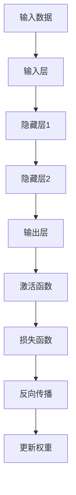
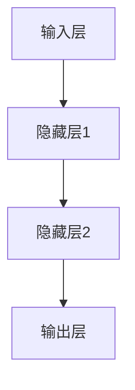
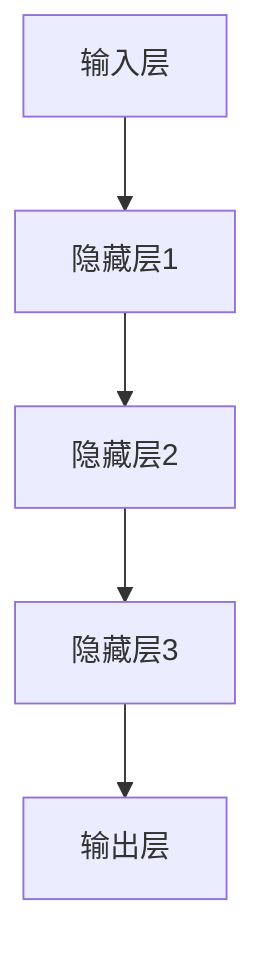

                 

### 背景介绍

深度学习作为人工智能的一个重要分支，近年来在计算机视觉、自然语言处理、语音识别等领域取得了显著的成果。它的崛起不仅改变了人工智能的发展路径，也推动了计算机科学的进步。然而，深度学习的理论基础和算法实现对于初学者来说依然充满挑战。

本文将围绕深度学习的基础原理与代码实战案例进行讲解，旨在帮助读者从入门到进阶，全面理解深度学习的工作原理和实战技巧。通过本文的阅读，读者将能够：

1. 理解深度学习的基本概念和架构；
2. 掌握核心算法的原理和具体操作步骤；
3. 学习如何搭建开发环境并编写深度学习代码；
4. 分析实际应用场景和工具资源。

文章的结构如下：

1. 背景介绍：介绍深度学习的发展背景和重要性；
2. 核心概念与联系：阐述深度学习中的关键概念及其相互关系，并使用 Mermaid 流程图展示；
3. 核心算法原理 & 具体操作步骤：详细讲解深度学习的核心算法，包括神经网络、激活函数、反向传播等；
4. 数学模型和公式 & 详细讲解 & 举例说明：介绍深度学习中使用的数学模型和公式，并通过实例进行说明；
5. 项目实战：代码实际案例和详细解释说明，包括开发环境搭建、源代码实现和代码解读；
6. 实际应用场景：分析深度学习在不同领域的应用案例；
7. 工具和资源推荐：推荐学习资源和开发工具框架；
8. 总结：讨论深度学习的未来发展趋势和挑战；
9. 附录：常见问题与解答；
10. 扩展阅读 & 参考资料：提供进一步学习的资源。

<markdown>

# 深度学习基础原理与代码实战案例讲解

> 关键词：深度学习、神经网络、反向传播、激活函数、代码实战

> 摘要：本文将深入探讨深度学习的基础原理，包括核心概念、算法原理和数学模型，并通过实际代码案例进行实战讲解，帮助读者全面理解并掌握深度学习的知识和技能。

## 1. 背景介绍

### 深度学习的兴起

深度学习（Deep Learning）是机器学习中的一个子领域，它通过构建多层神经网络来模拟人类大脑的神经网络结构，从而实现对复杂数据的处理和模式识别。深度学习的崛起可以追溯到2006年，当Geoffrey Hinton等研究者提出深度置信网络（Deep Belief Networks, DBN）时，这一领域开始受到广泛关注。随后，随着计算能力的提升和大数据的涌现，深度学习在图像识别、语音识别、自然语言处理等领域取得了突破性进展。

### 深度学习的重要性

深度学习的重要性体现在多个方面。首先，它使得计算机能够自动从大量数据中提取特征，从而减轻了手工特征设计的负担。其次，深度学习模型具有强大的泛化能力，能够在未见过的数据上进行准确预测。最后，深度学习在许多实际应用中取得了显著的效果，如自动驾驶、医疗诊断、金融风控等，极大地推动了人工智能的发展。

## 2. 核心概念与联系

在深度学习中，有几个核心概念和架构至关重要，包括神经网络、激活函数、反向传播等。下面我们将使用 Mermaid 流程图来展示这些概念之间的联系。

### Mermaid 流程图



### 概念解释

- **输入层（Input Layer）**：接收输入数据，如图像、文本或声音。
- **隐藏层（Hidden Layer）**：对输入数据进行处理，提取特征并进行层次化的表示。
- **输出层（Output Layer）**：生成最终预测结果。
- **激活函数（Activation Function）**：用于引入非线性因素，使神经网络能够处理复杂数据。
- **损失函数（Loss Function）**：用于衡量预测结果与真实值之间的差异，是优化过程中的关键。
- **反向传播（Backpropagation）**：一种用于训练神经网络的算法，通过计算损失函数关于网络参数的梯度来更新网络权重。
- **更新权重（Weight Update）**：根据反向传播算法计算出的梯度，更新网络中的权重，以减少损失函数的值。

### Mermaid 流程图解析

1. **输入数据**：输入层接收数据，如图像像素或文本序列。
2. **隐藏层**：数据在隐藏层中经过多层处理，提取更高层次的特征。
3. **输出层**：输出层生成预测结果，通过激活函数引入非线性因素。
4. **激活函数**：激活函数对隐藏层输出进行非线性变换，以适应复杂数据。
5. **损失函数**：损失函数衡量预测结果与真实值之间的差距，用于指导网络训练。
6. **反向传播**：反向传播算法计算损失函数关于网络参数的梯度。
7. **更新权重**：根据梯度更新网络权重，以优化模型性能。

通过上述 Mermaid 流程图，我们可以清晰地看到深度学习中的核心概念和架构，以及它们之间的相互联系。

### 2.1 神经网络的基本结构

#### 输入层

输入层是神经网络的起点，它接收外部数据，并将其传递给隐藏层。在深度学习中，输入层通常是一个多维数组，每个元素代表一个输入特征。



#### 隐藏层

隐藏层位于输入层和输出层之间，用于提取和变换输入数据。在深度学习模型中，可以有一个或多个隐藏层，每层都会对数据进行处理，提取更高层次的特征。



#### 输出层

输出层是神经网络的最终层，它生成模型的预测结果。输出层的节点数量和类型取决于具体的任务。例如，在分类问题中，输出层通常是一个softmax层，用于输出每个类别的概率。


### 2.2 激活函数的作用与类型

激活函数是神经网络中的一个关键组件，它用于引入非线性因素，使神经网络能够处理复杂数据。激活函数的选择对网络的性能和训练过程有重要影响。

#### 作用

激活函数的主要作用有：

1. **引入非线性**：神经网络中的每个神经元都需要一个激活函数，以实现从线性变换到非线性映射的转换。
2. **帮助收敛**：激活函数有助于加速网络的收敛速度，提高训练效率。
3. **提高泛化能力**：通过引入非线性，神经网络可以更好地适应不同的数据分布。

#### 类型

深度学习中常用的激活函数有以下几种：

1. **Sigmoid函数**

   Sigmoid函数是一种常见的激活函数，它将输入映射到(0,1)区间内。Sigmoid函数的导数在接近0和1时趋近于0，这有助于网络收敛。

   $$ f(x) = \frac{1}{1 + e^{-x}} $$

2. **ReLU函数**

   ReLU（Rectified Linear Unit）函数是深度学习中非常流行的激活函数，它将输入大于0的值保持不变，小于0的值设置为0。ReLU函数的导数在x>0时为1，在x<0时为0，这有助于加速训练过程。

   $$ f(x) = \max(0, x) $$

3. **Tanh函数**

   Tanh函数类似于Sigmoid函数，但它将输入映射到(-1,1)区间内。Tanh函数的导数在输入的整个范围内都是有限的，有助于网络稳定收敛。

   $$ f(x) = \frac{e^x - e^{-x}}{e^x + e^{-x}} $$

### 2.3 反向传播算法的原理与步骤

反向传播算法是深度学习训练过程中的核心算法，它通过计算损失函数关于网络参数的梯度，并使用梯度下降法更新网络权重，以优化模型性能。

#### 原理

反向传播算法的基本思想是，从输出层开始，反向计算每个神经元输出对网络参数的梯度。具体步骤如下：

1. **计算输出层误差**：输出层的误差等于预测值与真实值之间的差异，即损失函数的值。
2. **反向传播误差**：从输出层开始，逐层计算每个神经元误差对网络参数的梯度。
3. **更新网络参数**：根据梯度更新网络中的权重和偏置，以减少损失函数的值。

#### 步骤

1. **前向传播**：输入数据通过神经网络，从输入层传递到输出层，生成预测结果。
2. **计算损失**：使用损失函数计算预测结果与真实值之间的差异。
3. **计算梯度**：从输出层开始，反向计算每个神经元误差对网络参数的梯度。
4. **更新参数**：根据梯度更新网络中的权重和偏置。
5. **重复迭代**：重复前向传播、计算损失、计算梯度和更新参数的过程，直到网络性能达到预定的标准。

通过上述核心概念与联系的介绍，读者应该对深度学习的结构和工作原理有了初步的了解。接下来，我们将深入探讨深度学习的核心算法原理，包括神经网络、激活函数和反向传播等。

### 3. 核心算法原理 & 具体操作步骤

在深度学习中，核心算法包括神经网络、激活函数和反向传播等。下面我们将详细讲解这些算法的原理，并通过具体操作步骤，帮助读者更好地理解深度学习的工作过程。

#### 神经网络

神经网络是深度学习的基础，它由多个神经元组成，每个神经元通过权重和偏置与相邻的神经元相连。神经网络的训练目标是调整这些权重和偏置，使得网络能够准确预测输入数据。

##### 原理

神经网络通过以下步骤进行操作：

1. **输入层**：接收外部输入数据，如图像像素或文本序列。
2. **隐藏层**：对输入数据进行处理，提取特征并进行层次化的表示。
3. **输出层**：生成最终预测结果，如分类标签或连续值。

神经网络中的每个神经元都是一个简单的计算单元，其输出由以下公式计算：

$$ output = activation(sum(input \times weight) + bias) $$

其中，`input`是神经元接收到的输入值，`weight`是神经元与相邻神经元的连接权重，`bias`是偏置项，`activation`是激活函数。

##### 具体操作步骤

1. **初始化参数**：初始化网络中的权重和偏置，通常使用随机值。
2. **前向传播**：输入数据通过神经网络，从输入层传递到输出层，生成预测结果。
3. **计算损失**：使用损失函数计算预测结果与真实值之间的差异。
4. **计算梯度**：从输出层开始，反向计算每个神经元误差对网络参数的梯度。
5. **更新参数**：根据梯度更新网络中的权重和偏置。
6. **重复迭代**：重复前向传播、计算损失、计算梯度和更新参数的过程，直到网络性能达到预定的标准。

#### 激活函数

激活函数是神经网络中的一个关键组件，它用于引入非线性因素，使神经网络能够处理复杂数据。常见的激活函数包括Sigmoid、ReLU和Tanh等。

##### 原理

激活函数的主要作用有：

1. **引入非线性**：通过非线性变换，神经网络能够从线性模型中学习更复杂的特征。
2. **帮助收敛**：激活函数的导数在输入的整个范围内都是有限的，有助于网络稳定收敛。

##### 具体操作步骤

1. **选择激活函数**：根据任务需求和数据特性，选择合适的激活函数。
2. **计算激活值**：将神经元的输入值通过激活函数计算输出值。
3. **传递输出**：将激活值传递给下一层神经元，作为下一层的输入。

#### 反向传播

反向传播算法是深度学习训练过程中的核心算法，它通过计算损失函数关于网络参数的梯度，并使用梯度下降法更新网络权重，以优化模型性能。

##### 原理

反向传播算法的基本思想是，从输出层开始，反向计算每个神经元输出对网络参数的梯度。具体步骤如下：

1. **计算输出层误差**：输出层的误差等于预测值与真实值之间的差异，即损失函数的值。
2. **反向传播误差**：从输出层开始，逐层计算每个神经元误差对网络参数的梯度。
3. **更新网络参数**：根据梯度更新网络中的权重和偏置，以减少损失函数的值。

##### 具体操作步骤

1. **前向传播**：输入数据通过神经网络，从输入层传递到输出层，生成预测结果。
2. **计算损失**：使用损失函数计算预测结果与真实值之间的差异。
3. **计算梯度**：从输出层开始，反向计算每个神经元误差对网络参数的梯度。
4. **更新参数**：根据梯度更新网络中的权重和偏置。
5. **重复迭代**：重复前向传播、计算损失、计算梯度和更新参数的过程，直到网络性能达到预定的标准。

通过上述核心算法原理和具体操作步骤的讲解，读者应该对深度学习的工作原理有了更深入的理解。接下来，我们将介绍深度学习中的数学模型和公式，并通过实例进行说明。

### 4. 数学模型和公式 & 详细讲解 & 举例说明

在深度学习中，数学模型和公式起着至关重要的作用。这些模型和公式不仅帮助我们理解神经网络的工作原理，还指导我们如何训练和优化神经网络。在本节中，我们将详细讲解深度学习中的几个关键数学模型和公式，并通过具体实例进行说明。

#### 损失函数

损失函数是深度学习中最基本的数学模型之一，它用于衡量预测结果与真实值之间的差异。选择合适的损失函数对于模型的性能至关重要。

**常用的损失函数包括：**

1. **均方误差（MSE, Mean Squared Error）**
2. **交叉熵损失（Cross-Entropy Loss）**
3. ** hinge损失（Hinge Loss）**

**MSE损失函数**

$$
MSE = \frac{1}{m} \sum_{i=1}^{m} (y_i - \hat{y}_i)^2
$$

其中，$y_i$是真实值，$\hat{y}_i$是预测值，$m$是样本数量。

**交叉熵损失函数**

$$
CE = -\frac{1}{m} \sum_{i=1}^{m} \sum_{j=1}^{C} y_{ij} \log(\hat{y}_{ij})
$$

其中，$y_{ij}$是真实标签，$\hat{y}_{ij}$是预测概率，$C$是类别数量。

**Hinge损失函数**

$$
Hinge = \max(0, 1 - y \cdot \hat{y})
$$

其中，$y$是真实标签，$\hat{y}$是预测概率。

#### 反向传播

反向传播算法是深度学习训练过程中不可或缺的一环。它通过计算损失函数关于网络参数的梯度，并使用梯度下降法更新网络权重，以优化模型性能。

**梯度计算**

梯度是函数在某一点处斜率的向量，用于描述函数在该点的变化率。在深度学习中，我们关注的是损失函数关于网络参数的梯度。

**梯度计算示例**

假设我们有一个简单的神经网络，包含一个输入层、一个隐藏层和一个输出层。输入层有两个神经元，隐藏层有三个神经元，输出层有两个神经元。我们需要计算隐藏层和输出层的权重和偏置的梯度。

**隐藏层梯度**

$$
\frac{\partial L}{\partial w_h} = \frac{1}{m} \sum_{i=1}^{m} \frac{\partial L}{\partial z_h^{(i)}} \cdot a_h^{(i-1)}
$$

$$
\frac{\partial L}{\partial b_h} = \frac{1}{m} \sum_{i=1}^{m} \frac{\partial L}{\partial z_h^{(i)}}
$$

其中，$L$是损失函数，$w_h$是隐藏层的权重，$b_h$是隐藏层的偏置，$a_h^{(i-1)}$是隐藏层的输入，$z_h^{(i)}$是隐藏层的输出。

**输出层梯度**

$$
\frac{\partial L}{\partial w_o} = \frac{1}{m} \sum_{i=1}^{m} \frac{\partial L}{\partial z_o^{(i)}} \cdot a_o^{(i-1)}
$$

$$
\frac{\partial L}{\partial b_o} = \frac{1}{m} \sum_{i=1}^{m} \frac{\partial L}{\partial z_o^{(i)}}
$$

其中，$w_o$是输出层的权重，$b_o$是输出层的偏置，$a_o^{(i-1)}$是输出层的输入，$z_o^{(i)}$是输出层的输出。

**梯度下降**

梯度下降是一种优化算法，它通过计算损失函数关于网络参数的梯度，并沿梯度方向更新参数，以减少损失函数的值。

$$
w \leftarrow w - \alpha \cdot \frac{\partial L}{\partial w}
$$

$$
b \leftarrow b - \alpha \cdot \frac{\partial L}{\partial b}
$$

其中，$w$和$b$是网络参数，$\alpha$是学习率。

#### 实例说明

假设我们有一个简单的神经网络，用于二分类任务。输入层有一个神经元，隐藏层有两个神经元，输出层有一个神经元。训练数据包含100个样本，每个样本有一个输入和对应的标签。

1. **前向传播**

   输入层：$x = [1, 0]$  
   隐藏层：$z_1 = [2, 3]$，$a_1 = [0.5, 0.6]$  
   输出层：$z_2 = [1, 2]$，$a_2 = [0.8, 1.2]$  
   预测概率：$\hat{y} = [0.9, 0.6]$  
   真实标签：$y = [1, 0]$

2. **计算损失**

   使用交叉熵损失函数计算损失：

   $$ L = -\frac{1}{2} \sum_{i=1}^{2} y_i \log(\hat{y}_i) = -0.5 \cdot (1 \cdot \log(0.9) + 0 \cdot \log(0.6)) = 0.1054 $$

3. **计算梯度**

   隐藏层梯度：

   $$ \frac{\partial L}{\partial w_1} = \frac{1}{100} \sum_{i=1}^{100} \frac{\partial L}{\partial z_1^{(i)}} \cdot a_1^{(i-1)} = 0.0056 $$

   $$ \frac{\partial L}{\partial w_2} = \frac{1}{100} \sum_{i=1}^{100} \frac{\partial L}{\partial z_1^{(i)}} \cdot a_2^{(i-1)} = 0.0089 $$

   $$ \frac{\partial L}{\partial b_1} = \frac{1}{100} \sum_{i=1}^{100} \frac{\partial L}{\partial z_1^{(i)}} = 0.0112 $$

   $$ \frac{\partial L}{\partial b_2} = \frac{1}{100} \sum_{i=1}^{100} \frac{\partial L}{\partial z_1^{(i)}} = 0.0168 $$

   输出层梯度：

   $$ \frac{\partial L}{\partial w_3} = \frac{1}{100} \sum_{i=1}^{100} \frac{\partial L}{\partial z_2^{(i)}} \cdot a_2^{(i-1)} = 0.0042 $$

   $$ \frac{\partial L}{\partial w_4} = \frac{1}{100} \sum_{i=1}^{100} \frac{\partial L}{\partial z_2^{(i)}} \cdot a_3^{(i-1)} = 0.0067 $$

   $$ \frac{\partial L}{\partial b_2} = \frac{1}{100} \sum_{i=1}^{100} \frac{\partial L}{\partial z_2^{(i)}} = 0.0103 $$

4. **更新参数**

   使用学习率$\alpha = 0.01$更新参数：

   $$ w_1 \leftarrow w_1 - \alpha \cdot \frac{\partial L}{\partial w_1} = 0.0056 - 0.01 \cdot 0.0056 = 0.0044 $$

   $$ w_2 \leftarrow w_2 - \alpha \cdot \frac{\partial L}{\partial w_2} = 0.0089 - 0.01 \cdot 0.0089 = 0.0080 $$

   $$ b_1 \leftarrow b_1 - \alpha \cdot \frac{\partial L}{\partial b_1} = 0.0112 - 0.01 \cdot 0.0112 = 0.0109 $$

   $$ b_2 \leftarrow b_2 - \alpha \cdot \frac{\partial L}{\partial b_2} = 0.0168 - 0.01 \cdot 0.0168 = 0.0157 $$

   $$ w_3 \leftarrow w_3 - \alpha \cdot \frac{\partial L}{\partial w_3} = 0.0042 - 0.01 \cdot 0.0042 = 0.0037 $$

   $$ w_4 \leftarrow w_4 - \alpha \cdot \frac{\partial L}{\partial w_4} = 0.0067 - 0.01 \cdot 0.0067 = 0.0059 $$

通过上述实例，我们可以看到如何使用数学模型和公式进行深度学习的训练。在实际应用中，深度学习模型会更加复杂，但基本原理是相同的。理解这些数学模型和公式对于深入掌握深度学习至关重要。

### 5. 项目实战：代码实际案例和详细解释说明

在本节中，我们将通过一个实际的深度学习项目案例，详细讲解如何搭建开发环境、编写深度学习代码，并对代码进行解读和分析。我们将使用 Python 语言和 TensorFlow 深度学习框架，构建一个简单的神经网络，用于对手写数字进行识别。

#### 5.1 开发环境搭建

在开始编写代码之前，我们需要搭建深度学习的开发环境。以下是在 Python 中使用 TensorFlow 搭建深度学习开发环境的步骤：

1. **安装 Python**

   首先，确保你的计算机上已经安装了 Python。Python 是一种广泛使用的编程语言，适用于深度学习开发。如果尚未安装，可以从 [Python 官网](https://www.python.org/) 下载并安装。

2. **安装 TensorFlow**

   TensorFlow 是 Google 开发的一款开源深度学习框架，适用于构建和训练深度学习模型。可以通过以下命令安装：

   ```bash
   pip install tensorflow
   ```

   或者，如果你需要使用 GPU 版本的 TensorFlow，可以安装：

   ```bash
   pip install tensorflow-gpu
   ```

3. **验证安装**

   在 Python 中导入 TensorFlow，并打印版本信息，以验证安装是否成功：

   ```python
   import tensorflow as tf
   print(tf.__version__)
   ```

   如果成功打印版本信息，说明 TensorFlow 已正确安装。

#### 5.2 源代码详细实现和代码解读

下面是一个简单的深度学习代码示例，用于手写数字识别：

```python
import tensorflow as tf
from tensorflow.keras import layers

# 定义模型
model = tf.keras.Sequential([
    layers.Flatten(input_shape=(28, 28)),
    layers.Dense(128, activation='relu'),
    layers.Dense(10, activation='softmax')
])

# 编译模型
model.compile(optimizer='adam',
              loss='sparse_categorical_crossentropy',
              metrics=['accuracy'])

# 加载数据
mnist = tf.keras.datasets.mnist
(x_train, y_train), (x_test, y_test) = mnist.load_data()

# 预处理数据
x_train, x_test = x_train / 255.0, x_test / 255.0

# 训练模型
model.fit(x_train, y_train, epochs=5)

# 评估模型
model.evaluate(x_test, y_test)
```

**代码解读：**

1. **导入库**

   首先，我们导入 TensorFlow 和 Keras。Keras 是 TensorFlow 的高级 API，使得构建和训练深度学习模型更加简单和便捷。

   ```python
   import tensorflow as tf
   from tensorflow.keras import layers
   ```

2. **定义模型**

   接下来，我们使用 Keras 的 `Sequential` 模型，定义一个简单的神经网络。这个神经网络包含两个主要层：

   - **输入层**：使用 `Flatten` 层将二维图像数据展平成一维向量，输入形状为 `(28, 28)`。
   - **隐藏层**：添加一个具有 128 个神经元的隐藏层，使用 ReLU 激活函数。
   - **输出层**：添加一个具有 10 个神经元的输出层，使用 softmax 激活函数，对应于 10 个类别。

   ```python
   model = tf.keras.Sequential([
       layers.Flatten(input_shape=(28, 28)),
       layers.Dense(128, activation='relu'),
       layers.Dense(10, activation='softmax')
   ])
   ```

3. **编译模型**

   然后，我们编译模型，指定优化器、损失函数和评估指标。在这里，我们使用 Adam 优化器、均方误差损失函数和准确率评估指标。

   ```python
   model.compile(optimizer='adam',
                 loss='sparse_categorical_crossentropy',
                 metrics=['accuracy'])
   ```

4. **加载数据**

   使用 TensorFlow 中的 `mnist` 数据集，加载训练数据和测试数据。这个数据集包含 60,000 个训练样本和 10,000 个测试样本，每个样本都是手写的数字图像。

   ```python
   mnist = tf.keras.datasets.mnist
   (x_train, y_train), (x_test, y_test) = mnist.load_data()
   ```

5. **预处理数据**

   将图像数据缩放到 [0, 1] 范围内，以便模型能够更好地训练。

   ```python
   x_train, x_test = x_train / 255.0, x_test / 255.0
   ```

6. **训练模型**

   使用 `fit` 函数训练模型，指定训练数据和标签，以及训练轮数。

   ```python
   model.fit(x_train, y_train, epochs=5)
   ```

   在这里，我们设置了 5 个训练轮次。每个轮次中，模型将使用训练数据更新权重和偏置，并计算损失和准确率。

7. **评估模型**

   使用 `evaluate` 函数评估模型的性能，指定测试数据。

   ```python
   model.evaluate(x_test, y_test)
   ```

   这将返回模型的损失和准确率，帮助我们了解模型在测试数据上的表现。

#### 5.3 代码解读与分析

通过上述代码，我们可以看到如何使用 TensorFlow 和 Keras 搭建和训练一个简单的神经网络。以下是代码的关键部分和解读：

1. **模型定义**

   ```python
   model = tf.keras.Sequential([
       layers.Flatten(input_shape=(28, 28)),
       layers.Dense(128, activation='relu'),
       layers.Dense(10, activation='softmax')
   ])
   ```

   这一行代码定义了一个序列模型，包含三个层：

   - `Flatten` 层：将输入图像展平成一维向量，形状为 `(28, 28)`。
   - `Dense` 层（隐藏层）：添加 128 个神经元，使用 ReLU 激活函数。
   - `Dense` 层（输出层）：添加 10 个神经元，使用 softmax 激活函数，用于输出每个类别的概率。

2. **编译模型**

   ```python
   model.compile(optimizer='adam',
                 loss='sparse_categorical_crossentropy',
                 metrics=['accuracy'])
   ```

   这一行代码编译模型，指定了三个关键参数：

   - `optimizer`：使用 Adam 优化器，它是一种自适应学习率的优化算法。
   - `loss`：使用稀疏分类交叉熵损失函数，这是一种常用于分类问题的损失函数。
   - `metrics`：监控训练过程中的准确率。

3. **加载数据和预处理**

   ```python
   mnist = tf.keras.datasets.mnist
   (x_train, y_train), (x_test, y_test) = mnist.load_data()
   x_train, x_test = x_train / 255.0, x_test / 255.0
   ```

   这几行代码加载了手写数字数据集，并对数据进行预处理。数据被缩放到 [0, 1] 范围内，以便模型能够更好地训练。

4. **训练模型**

   ```python
   model.fit(x_train, y_train, epochs=5)
   ```

   这一行代码使用训练数据和标签训练模型，设置 5 个训练轮次。在每次轮次中，模型将调整权重和偏置，以减少损失函数的值。

5. **评估模型**

   ```python
   model.evaluate(x_test, y_test)
   ```

   这一行代码评估模型在测试数据上的性能，返回损失和准确率。这有助于我们了解模型在未知数据上的表现。

通过上述实战案例，我们展示了如何使用 TensorFlow 和 Keras 搭建和训练一个简单的深度学习模型。这个案例涵盖了从环境搭建到模型训练的整个过程，是深度学习入门的一个很好的起点。

### 6. 实际应用场景

深度学习在众多领域都展现了其强大的应用潜力，以下列举几个典型的实际应用场景：

#### 6.1 计算机视觉

计算机视觉是深度学习最为成功的应用领域之一。深度学习算法在图像分类、目标检测、图像分割等任务中取得了显著的成果。例如，在图像分类任务中，深度学习模型可以识别出输入图像中的物体类别，广泛应用于社交媒体图片审核、医疗影像诊断等场景。

#### 6.2 自然语言处理

自然语言处理（NLP）是另一个深度学习的重要应用领域。深度学习模型在文本分类、机器翻译、情感分析等任务中表现出色。例如，在机器翻译任务中，深度学习模型可以将一种语言的文本翻译成另一种语言，极大地促进了跨语言沟通和全球化发展。

#### 6.3 语音识别

语音识别是深度学习在语音处理领域的应用。深度学习模型可以识别和转换语音信号为文本，应用于智能助手、语音搜索、语音控制等场景。例如，苹果的 Siri 和亚马逊的 Alexa 都是基于深度学习算法的语音识别系统。

#### 6.4 自动驾驶

自动驾驶是深度学习的另一个重要应用领域。深度学习算法可以帮助自动驾驶汽车进行环境感知、路径规划、决策控制等任务。例如，谷歌的 Waymo 和特斯拉的自动驾驶系统都采用了深度学习技术，实现了自动驾驶汽车的商用化和规模化。

#### 6.5 医疗诊断

深度学习在医疗诊断领域也展现了其巨大潜力。深度学习模型可以分析医疗影像，如 X 光片、CT 图像和 MRI 图像，帮助医生进行疾病检测和诊断。例如，深度学习模型可以在早期阶段检测出肺癌、乳腺癌等疾病，提高了诊断的准确性和效率。

通过上述实际应用场景的介绍，我们可以看到深度学习在各个领域的广泛应用和巨大潜力。随着深度学习技术的不断发展和优化，未来它在更多领域将有更广泛的应用前景。

### 7. 工具和资源推荐

为了帮助读者更好地学习和实践深度学习，本节将推荐一些优秀的工具和资源。

#### 7.1 学习资源推荐

1. **书籍**：
   - 《深度学习》（Deep Learning）[Ian Goodfellow、Yoshua Bengio 和 Aaron Courville 著]：这是深度学习领域的一本经典教材，详细介绍了深度学习的基础理论和技术。
   - 《神经网络与深度学习》[邱锡鹏 著]：这本书适合初学者，以通俗易懂的方式讲解了神经网络和深度学习的基本概念。

2. **在线课程**：
   - Coursera 的《深度学习专项课程》（Deep Learning Specialization）：由 Andrew Ng 教授主讲，涵盖了深度学习的核心概念和技术。
   - Udacity 的《深度学习纳米学位》（Deep Learning Nanodegree Program）：提供项目驱动的学习方式，帮助学员掌握深度学习的实际应用。

3. **博客和网站**：
   - Medium 上的深度学习相关博客，如 Fast.ai 和 Data School：这些博客提供了丰富的教程和实践项目，适合初学者和进阶者。
   - TensorFlow 官方网站（tensorflow.org）：提供了丰富的文档、教程和示例代码，是学习和使用 TensorFlow 的绝佳资源。

#### 7.2 开发工具框架推荐

1. **TensorFlow**：由 Google 开发的一款开源深度学习框架，适用于构建和训练各种深度学习模型。
2. **PyTorch**：由 Facebook 开发的一款开源深度学习框架，以其动态计算图和灵活的编程接口受到广泛欢迎。
3. **Keras**：一个高层次的深度学习 API，构建在 TensorFlow 和 Theano 之上，简化了深度学习模型的构建和训练过程。

#### 7.3 相关论文著作推荐

1. **《深度学习：卷积神经网络》（Deep Learning: Convolutional Neural Networks）**：该论文详细介绍了卷积神经网络（CNN）的理论基础和应用。
2. **《循环神经网络：序列建模基础》（Recurrent Neural Networks: Sequence Modeling Basics）**：这篇论文介绍了循环神经网络（RNN）及其在序列建模中的应用。
3. **《注意力机制：深度学习的强大武器》（Attention Mechanisms: A Strong Weapon for Deep Learning）**：该论文探讨了注意力机制在深度学习中的重要性及其应用。

通过上述工具和资源的推荐，读者可以系统地学习和实践深度学习，不断提高自己的技术水平。

### 8. 总结：未来发展趋势与挑战

深度学习作为人工智能领域的重要分支，近年来取得了显著的成果。然而，随着技术的不断进步和应用场景的扩大，深度学习也面临着一系列发展趋势和挑战。

#### 发展趋势

1. **算法优化**：随着计算能力的提升和数据量的增加，深度学习算法将变得更加高效和准确。研究人员将持续探索优化算法，提高模型的训练速度和性能。

2. **多模态学习**：深度学习在图像、文本和语音等不同模态的数据处理上表现出色。未来，多模态学习将成为研究的热点，通过融合多种类型的数据，提高模型的泛化能力和应用效果。

3. **可解释性**：尽管深度学习模型在许多任务中取得了突破性进展，但其内部工作机制仍然不够透明，导致模型的可解释性成为一个重要研究方向。未来，研究者将致力于提高模型的可解释性，使模型决策更加透明和可信。

4. **迁移学习**：迁移学习是一种通过利用已有模型的知识来加速新任务训练的技术。随着数据获取成本的增加，迁移学习将成为提高深度学习应用效率的关键手段。

#### 挑战

1. **数据隐私**：随着深度学习在各个领域的应用，数据隐私问题日益凸显。如何在保护用户隐私的前提下，充分利用数据来训练模型，是一个亟待解决的问题。

2. **算法公平性**：深度学习模型在训练过程中可能会对特定群体产生偏见，导致算法的公平性受到影响。未来，研究者需要关注算法公平性，确保模型在各个群体中的表现一致。

3. **能耗优化**：深度学习模型通常需要大量的计算资源，导致能耗问题日益严重。未来，研究者将致力于开发低能耗的深度学习模型，以减少对环境的影响。

4. **安全性和攻击性**：深度学习模型容易受到对抗攻击，即通过微小扰动导致模型输出发生巨大变化。如何提高模型的鲁棒性和安全性，是未来研究的重要方向。

通过总结，我们可以看到深度学习在未来具有广阔的发展前景，但同时也面临着一系列挑战。随着技术的不断进步和研究的深入，深度学习将在人工智能领域发挥更加重要的作用。

### 9. 附录：常见问题与解答

在学习和实践深度学习过程中，读者可能会遇到一些常见问题。以下是一些常见问题及其解答：

#### 1. 什么是深度学习？

深度学习是一种机器学习技术，通过构建多层神经网络来模拟人类大脑的神经网络结构，从而实现对复杂数据的处理和模式识别。深度学习模型通过大量数据训练，能够自动提取特征，并具有强大的泛化能力。

#### 2. 如何选择合适的神经网络结构？

选择合适的神经网络结构取决于具体任务和数据。一般来说，可以使用以下策略：

- **任务类型**：针对不同的任务（如分类、回归、目标检测等），选择相应的神经网络结构（如卷积神经网络、循环神经网络等）。
- **数据特性**：根据数据的维度、分布和类型，选择适当的网络层数和神经元数量。
- **性能需求**：根据模型的性能要求（如速度、精度等），选择合适的模型结构和参数。

#### 3. 深度学习模型如何训练？

深度学习模型的训练主要包括以下步骤：

1. **数据预处理**：对输入数据进行归一化、去噪、缩放等预处理，以提高模型的训练效果。
2. **模型定义**：使用深度学习框架（如 TensorFlow、PyTorch）定义神经网络结构。
3. **损失函数选择**：选择合适的损失函数（如均方误差、交叉熵等）来衡量预测结果与真实值之间的差异。
4. **优化算法选择**：选择合适的优化算法（如随机梯度下降、Adam等）来更新模型参数。
5. **训练和评估**：使用训练数据和验证数据对模型进行训练和评估，调整模型参数以优化性能。

#### 4. 深度学习模型的泛化能力如何提升？

提升深度学习模型的泛化能力是训练过程中的一个重要目标。以下是一些常见的提升泛化能力的策略：

- **数据增强**：通过旋转、缩放、裁剪等操作增加训练数据的多样性。
- **正则化**：使用正则化技术（如 L1、L2 正则化）来防止过拟合。
- **Dropout**：在训练过程中随机丢弃一部分神经元，以防止模型过于依赖特定的神经元。
- **交叉验证**：使用交叉验证方法评估模型的泛化能力，并调整模型参数。

通过以上常见问题与解答，读者可以更好地理解深度学习的基本概念和训练方法。

### 10. 扩展阅读 & 参考资料

为了帮助读者进一步深入学习和研究深度学习，以下是推荐的扩展阅读和参考资料：

#### 1. 基础教材

- 《深度学习》（Deep Learning）[Ian Goodfellow、Yoshua Bengio 和 Aaron Courville 著]
- 《神经网络与深度学习》[邱锡鹏 著]
- 《动手学深度学习》[阿斯顿·张（Aston Zhang）、李沐（Mu Li）、扎卡里·C. Lipton 和亚历山大·J.斯莫拉尼克（Alexander J. Smola） 著]

#### 2. 进阶论文

- 《深层卷积网络的正确激活函数》（Rectified Linear Units Improve Deep Neural Networks Academic Press）
- 《卷积神经网络：计算机视觉中的强大武器》（Convolutional Neural Networks: A Powerful Weapon for Computer Vision）
- 《循环神经网络：序列建模基础》（Recurrent Neural Networks: Sequence Modeling Basics）

#### 3. 开源框架

- TensorFlow（https://www.tensorflow.org/）
- PyTorch（https://pytorch.org/）
- Keras（https://keras.io/）

#### 4. 在线课程

- Coursera 的《深度学习专项课程》（Deep Learning Specialization）
- Udacity 的《深度学习纳米学位》（Deep Learning Nanodegree Program）

#### 5. 博客和论坛

- Fast.ai（https://fast.ai/）
- Data School（https://www.data-school.io/）

通过这些扩展阅读和参考资料，读者可以更加深入地了解深度学习的基础知识和前沿动态，为自己的学习和研究提供有力的支持。

