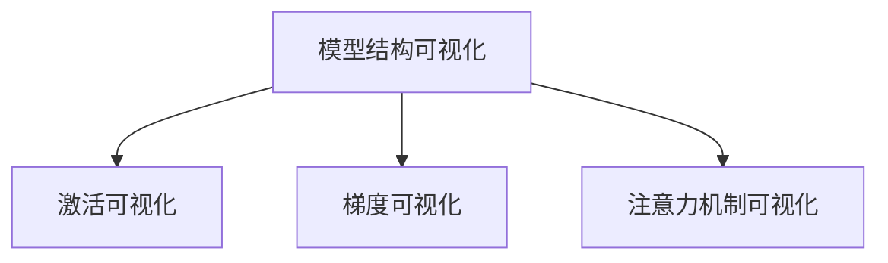
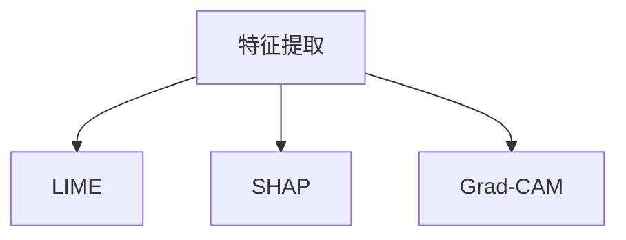
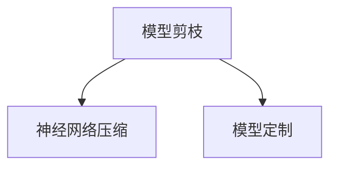
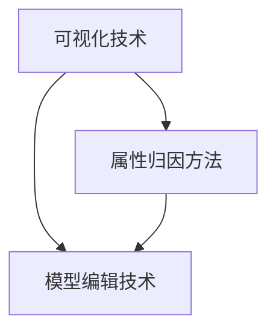

                 

### 背景介绍

深度学习模型解释性是近年来人工智能领域的一个热点话题。随着深度学习技术的不断发展，深度学习模型在图像识别、自然语言处理、语音识别等多个领域取得了显著的成绩。然而，这些模型的“黑箱”特性也引发了广泛的关注和讨论。许多研究者和工程师希望能够理解深度学习模型的工作原理，以提高模型的可靠性和可解释性。

解释性在人工智能领域的重要性不言而喻。一方面，模型的可解释性有助于研究者更好地理解深度学习模型的决策过程，从而优化模型的性能；另一方面，对于实际应用场景，如医疗诊断、金融风险评估等，模型的解释性对于用户信任度和合规性至关重要。因此，提升深度学习模型的可解释性不仅能够促进理论研究的深入，还能够推动实际应用的广泛落地。

在本文中，我们将探讨深度学习模型解释性的几个关键方面：可视化技术、属性归因方法和模型编辑技术。通过逐步分析这些技术，我们将深入理解深度学习模型的内在机制，并展望未来的发展趋势和挑战。

文章将按以下结构展开：

1. **核心概念与联系**：首先，我们将介绍与深度学习模型解释性相关的核心概念，包括模型的可视化、属性归因和模型编辑。为了更好地理解这些概念，我们将使用Mermaid流程图展示它们之间的关系。
2. **核心算法原理 & 具体操作步骤**：接下来，我们将详细探讨这些核心算法的原理，包括具体实现步骤和操作方法。
3. **数学模型和公式 & 详细讲解 & 举例说明**：在理解了核心算法之后，我们将介绍相关的数学模型和公式，并进行详细的讲解和举例说明，以便读者更好地掌握这些技术。
4. **项目实战：代码实际案例和详细解释说明**：为了使读者能够更直观地理解这些技术，我们将通过实际项目案例展示代码实现过程，并进行详细解释说明。
5. **实际应用场景**：我们将讨论这些技术在各个实际应用场景中的具体应用，以及面临的挑战和解决方案。
6. **工具和资源推荐**：最后，我们将推荐一些学习资源、开发工具和相关的论文著作，以帮助读者进一步学习和研究。

通过以上六个部分的详细探讨，本文希望能够为读者提供一个全面、深入的视角，以了解深度学习模型解释性的最新进展和未来发展。

---

# 深度学习模型解释性：可视化、属性归因与模型编辑技术进展

## 关键词
深度学习、模型解释性、可视化技术、属性归因、模型编辑

## 摘要
深度学习模型解释性是人工智能领域的一个重要课题。本文从可视化技术、属性归因方法和模型编辑技术三个方面，详细探讨了深度学习模型解释性的最新进展。通过分析核心概念和算法原理，结合实际案例，本文旨在为读者提供一个全面深入的理解，并展望未来的发展趋势和挑战。

### 1. 背景介绍

随着深度学习技术的迅速发展，其在图像识别、自然语言处理、语音识别等领域的应用已经取得了显著的成果。然而，这些深度学习模型往往表现出“黑箱”特性，即内部决策过程难以理解，这给实际应用带来了一定的困扰。为了提高深度学习模型的可靠性和可解释性，研究人员提出了多种解释性技术，包括可视化技术、属性归因方法和模型编辑技术。

在深度学习模型中，可解释性指的是模型决策过程的透明度和可理解性。传统的机器学习模型，如线性回归和决策树，由于其结构相对简单，通常具有较高的可解释性。而深度学习模型，尤其是复杂的神经网络，由于其多层非线性结构，往往难以解释。这使得在实际应用中，用户难以理解模型的决策过程，从而降低了模型的信任度和可接受度。

解释性在人工智能领域具有重要意义。首先，对于理论研究，了解深度学习模型的工作原理有助于发现新的优化方向，提高模型的性能。其次，对于实际应用，模型的可解释性有助于提高用户对模型的信任度，尤其是在医疗诊断、金融风险评估等高风险领域。此外，可解释性也有助于模型的合规性和可审计性，特别是在法律和道德要求较高的应用场景中。

本文将围绕深度学习模型解释性的三个关键方面展开讨论：可视化技术、属性归因方法和模型编辑技术。可视化技术旨在将复杂的模型决策过程以直观的方式呈现，帮助用户理解模型的决策过程。属性归因方法通过分析模型输出，识别出影响模型决策的关键因素，从而提高模型的可理解性。模型编辑技术则通过调整模型的结构或参数，使其更符合用户的需求或期望。

接下来，我们将详细介绍这些核心概念，并使用Mermaid流程图展示它们之间的联系。这将为我们后续的分析提供清晰的框架。

#### 1.1 可视化技术

可视化技术是深度学习模型解释性的重要组成部分。通过可视化，研究者可以直观地展示模型内部的决策过程，从而更好地理解模型的行为。可视化技术包括模型结构可视化、激活可视化、梯度可视化和注意力机制可视化等。

- **模型结构可视化**：通过图形化的方式展示模型的层次结构和连接关系，帮助用户理解模型的组成和运作方式。常见的可视化工具包括TensorBoard和PyTorch的`make_dot`函数。

- **激活可视化**：展示模型中每个神经元或层的激活值，帮助用户理解模型对输入数据的响应。常见的可视化方法包括热力图（heatmap）和等高线图（contour plot）。

- **梯度可视化**：展示模型在训练过程中梯度的变化，帮助用户理解模型的学习过程。常见的可视化方法包括梯度直方图和梯度流图。

- **注意力机制可视化**：对于具有注意力机制的模型，如Transformer，可视化注意力权重可以帮助用户理解模型在不同位置的关注点。常用的可视化工具包括Matplotlib和Seaborn。

下图展示了可视化技术的Mermaid流程图：



#### 1.2 属性归因方法

属性归因方法通过分析模型输出，识别出影响模型决策的关键因素。这种方法旨在将模型的决策过程分解为具体的属性或特征，从而提高模型的可理解性。常见的属性归因方法包括LIME、SHAP和Grad-CAM等。

- **LIME（Local Interpretable Model-agnostic Explanations）**：LIME方法通过局部线性化模型，将复杂的深度学习模型转化为可解释的线性模型。这种方法适用于任何模型，但需要较大的计算资源。

- **SHAP（SHapley Additive exPlanations）**：SHAP方法基于博弈论中的Shapley值，为每个特征赋予一个全局重要性值。这种方法具有较好的理论支持，但计算复杂度较高。

- **Grad-CAM（Gradient-weighted Class Activation Mapping）**：Grad-CAM方法通过计算模型梯度，生成特征图的注意力权重，帮助用户理解模型对特定类别的关注点。这种方法实现简单，但需要模型具有卷积层。

下图展示了属性归因方法的Mermaid流程图：



#### 1.3 模型编辑技术

模型编辑技术通过调整模型的结构或参数，使其更符合用户的需求或期望。这种方法不仅提高了模型的可解释性，还可以优化模型性能。常见的模型编辑技术包括模型剪枝、神经网络压缩和模型定制等。

- **模型剪枝**：通过移除模型中的冗余权重或层，减少模型参数数量，从而提高模型的可解释性和效率。常见的剪枝方法包括权重剪枝、结构剪枝和混合剪枝。

- **神经网络压缩**：通过减少模型参数数量和计算复杂度，提高模型的运行效率。常见的压缩方法包括权重共享、网络剪枝和知识蒸馏。

- **模型定制**：根据特定应用场景，定制化模型结构或参数，使其更适合特定任务。这种方法需要丰富的领域知识和经验。

下图展示了模型编辑技术的Mermaid流程图：



通过上述介绍，我们可以看到，可视化技术、属性归因方法和模型编辑技术构成了深度学习模型解释性的三大支柱。这些技术相互关联，共同提高了深度学习模型的可解释性和可靠性。在接下来的章节中，我们将逐一详细探讨这些技术，并结合实际案例进行分析。

### 2. 核心概念与联系

为了深入理解深度学习模型解释性的各个方面，我们需要详细探讨与该主题相关的核心概念，并展示它们之间的联系。本文将涉及以下几个核心概念：模型的可视化、属性归因和模型编辑。这些概念不仅构成了深度学习模型解释性的基础，而且在实际应用中也发挥着至关重要的作用。

#### 2.1 模型的可视化

模型的可视化是理解深度学习模型决策过程的关键技术之一。通过将复杂的模型结构、激活值、梯度以及注意力机制等以直观的图形形式呈现，用户可以更清晰地理解模型的工作原理。具体来说，模型的可视化包括以下几个层次：

1. **模型结构可视化**：
   模型结构可视化主要关注模型的层次结构和连接关系。通过图形化的方式，研究者可以直观地看到模型的架构，如卷积层、全连接层、池化层等。这有助于理解模型的整体设计思路和功能。

2. **激活可视化**：
   激活可视化涉及展示模型在各个层级上的激活值。通过热力图、等高线图等可视化方法，研究者可以观察到模型对不同输入数据的响应。这有助于识别模型对特定特征的敏感度。

3. **梯度可视化**：
   梯度可视化展示了模型在训练过程中梯度的变化情况。通过梯度直方图、梯度流图等可视化方法，研究者可以直观地看到模型如何通过梯度下降优化过程调整参数，以达到更好的性能。

4. **注意力机制可视化**：
   对于具有注意力机制的模型，如Transformer，注意力权重可视化尤为重要。通过注意力权重图，研究者可以识别出模型在处理输入数据时，不同位置上的关注点，这有助于理解模型对输入数据的处理策略。

#### 2.2 属性归因方法

属性归因方法的核心目标是通过分析模型输出，识别出影响模型决策的关键因素。这些方法旨在将模型的决策过程分解为具体的属性或特征，从而提高模型的可解释性。以下是几种常见的属性归因方法：

1. **LIME（Local Interpretable Model-agnostic Explanations）**：
   LIME方法通过局部线性化模型，将复杂的深度学习模型转化为可解释的线性模型。LIME方法适用于任何模型，但其计算资源需求较高。通过LIME，研究者可以理解模型在特定输入附近的决策过程。

2. **SHAP（SHapley Additive exPlanations）**：
   SHAP方法基于博弈论中的Shapley值，为每个特征赋予一个全局重要性值。SHAP方法具有较好的理论支持，但其计算复杂度较高。通过SHAP，研究者可以全面了解每个特征对模型决策的贡献。

3. **Grad-CAM（Gradient-weighted Class Activation Mapping）**：
   Grad-CAM方法通过计算模型梯度，生成特征图的注意力权重。Grad-CAM方法实现简单，适用于具有卷积层的模型。通过Grad-CAM，研究者可以直观地看到模型对特定类别的关注区域。

#### 2.3 模型编辑技术

模型编辑技术通过调整模型的结构或参数，提高模型的可解释性和性能。以下是几种常见的模型编辑技术：

1. **模型剪枝**：
   模型剪枝通过移除模型中的冗余权重或层，减少模型参数数量，从而提高模型的可解释性和效率。常见的剪枝方法包括权重剪枝、结构剪枝和混合剪枝。

2. **神经网络压缩**：
   神经网络压缩通过减少模型参数数量和计算复杂度，提高模型的运行效率。常见的压缩方法包括权重共享、网络剪枝和知识蒸馏。

3. **模型定制**：
   模型定制根据特定应用场景，定制化模型结构或参数，使其更适合特定任务。这种方法需要丰富的领域知识和经验。

#### 2.4 核心概念之间的联系

可视化技术、属性归因方法和模型编辑技术之间存在着密切的联系。具体来说，可视化技术为研究者提供了直观理解模型决策过程的能力，属性归因方法帮助研究者识别影响模型决策的关键因素，而模型编辑技术则通过调整模型的结构或参数，提高模型的可解释性和性能。

- **可视化技术与属性归因方法**：可视化技术为属性归因方法提供了直观的展示平台。通过模型的可视化，研究者可以更清晰地看到模型的激活值、梯度以及注意力权重，从而为属性归因提供更可靠的依据。

- **属性归因方法与模型编辑技术**：属性归因方法识别出影响模型决策的关键因素后，模型编辑技术可以通过调整这些关键因素，优化模型的结构或参数。例如，通过Grad-CAM识别出的注意力区域，可以指导模型剪枝，移除不重要的层或权重，从而提高模型的可解释性和效率。

- **模型编辑技术与可视化技术**：模型编辑技术通过调整模型的结构或参数，影响模型的可视化结果。例如，通过模型剪枝，可以减少模型的参数数量，使模型结构更简洁，从而在可视化时更容易理解。

为了更好地展示这些核心概念之间的联系，我们使用Mermaid流程图进行描述。以下是一个简化的Mermaid流程图，展示了可视化技术、属性归因方法和模型编辑技术之间的互动关系：



通过上述流程图，我们可以看到，可视化技术、属性归因方法和模型编辑技术三者相互作用，共同提高了深度学习模型的可解释性和性能。

在接下来的章节中，我们将分别详细探讨这些核心概念，包括它们的原理、具体实现方法和实际应用案例。通过逐步深入分析，我们将为读者提供全面的视角，以了解深度学习模型解释性的各个方面。

### 3. 核心算法原理 & 具体操作步骤

在本章节中，我们将详细探讨深度学习模型解释性中的三个核心算法：模型的可视化技术、属性归因方法和模型编辑技术。我们将分别介绍这些算法的基本原理和具体操作步骤，以便读者能够全面理解这些技术的实际应用。

#### 3.1 模型的可视化技术

**3.1.1 模型结构可视化**

**基本原理**：
模型结构可视化是指通过图形化的方式展示深度学习模型的层次结构和连接关系。常见的工具包括TensorBoard和PyTorch的`make_dot`函数。

**操作步骤**：
1. 导入必要的库和模型：
```python
import torch
import torch.nn as nn
import torch.utils.tensorboard as tb

# 假设我们有一个简单的卷积神经网络模型
class SimpleCNN(nn.Module):
    def __init__(self):
        super(SimpleCNN, self).__init__()
        self.conv1 = nn.Conv2d(1, 32, 3, 1)
        self.fc1 = nn.Linear(32 * 26 * 26, 10)

    def forward(self, x):
        x = self.conv1(x)
        x = x.view(x.size(0), -1)
        x = self.fc1(x)
        return x

model = SimpleCNN()
```

2. 创建TensorBoard日志目录：
```python
writer = tb.SummaryWriter('runs/first_run')
```

3. 将模型结构写入TensorBoard日志：
```python
writer.add_graph(model, torch.zeros(1, 1, 28, 28))
```

4. 启动TensorBoard并查看可视化结果：
```bash
tensorboard --logdir=runs
```

**示例代码**：
```python
import torch
import torchvision.models as models
import torch.utils.tensorboard as tb

# 定义一个简单的卷积神经网络模型
class SimpleCNN(nn.Module):
    def __init__(self):
        super(SimpleCNN, self).__init__()
        self.conv1 = nn.Conv2d(1, 32, 3, 1)
        self.fc1 = nn.Linear(32 * 26 * 26, 10)

    def forward(self, x):
        x = self.conv1(x)
        x = x.view(x.size(0), -1)
        x = self.fc1(x)
        return x

# 创建TensorBoard日志目录
writer = tb.SummaryWriter('runs/first_run')

# 创建模型实例
model = SimpleCNN()

# 将模型结构写入TensorBoard日志
writer.add_graph(model, torch.zeros(1, 1, 28, 28))

# 启动TensorBoard并查看可视化结果
writer.close()
```

**3.1.2 激活可视化**

**基本原理**：
激活可视化是指通过图形化的方式展示模型在不同层级的激活值。这有助于理解模型对输入数据的处理过程。常见的方法包括热力图和等高线图。

**操作步骤**：
1. 导入必要的库和模型：
```python
import torch
import torchvision.models as models
import matplotlib.pyplot as plt
import numpy as np

# 加载预训练的模型
model = models.resnet18(pretrained=True)
```

2. 定义一个函数，用于计算模型的激活值：
```python
def get_activation(model, name):
    activation = {}
    model.eval()
    def hook(model, input, output):
        activation[name] = output.detach()
    handle = model.register_forward_hook(hook)
    model(input)
    handle.remove()
    return activation
```

3. 获取特定层级的激活值：
```python
activation = get_activation(model, 'layer4')
```

4. 将激活值以热力图或等高线图的形式可视化：
```python
# 假设激活值为activation['layer4']
plt.imshow(activation['layer4'][0].cpu().detach().numpy(), cmap='hot')
plt.show()
```

**示例代码**：
```python
import torch
import torchvision.models as models
import torchvision.transforms as transforms
import matplotlib.pyplot as plt
import numpy as np

# 加载预训练的模型
model = models.resnet18(pretrained=True)

# 定义一个函数，用于计算模型的激活值
def get_activation(model, name):
    activation = {}
    model.eval()
    def hook(model, input, output):
        activation[name] = output.detach()
    handle = model.register_forward_hook(hook)
    model(input)
    handle.remove()
    return activation

# 获取特定层级的激活值
activation = get_activation(model, 'layer4')

# 将激活值以热力图的形式可视化
plt.imshow(activation['layer4'][0].cpu().detach().numpy(), cmap='hot')
plt.show()
```

**3.1.3 梯度可视化**

**基本原理**：
梯度可视化是指通过图形化的方式展示模型在训练过程中梯度的变化情况。这有助于理解模型的学习过程。常见的方法包括梯度直方图和梯度流图。

**操作步骤**：
1. 导入必要的库和模型：
```python
import torch
import torchvision.models as models
import matplotlib.pyplot as plt
```

2. 定义一个函数，用于计算模型的梯度：
```python
def get_gradient(model, name):
    grads = {}
    for name, param in model.named_parameters():
        if param.requires_grad:
            grads[name] = param.grad
    return grads
```

3. 计算模型的梯度：
```python
grads = get_gradient(model, 'layer4')
```

4. 将梯度以直方图或流图的形式可视化：
```python
# 假设梯度为grads['layer4']
plt.hist(grads['layer4'].cpu().detach().numpy(), bins=50)
plt.show()
```

**示例代码**：
```python
import torch
import torchvision.models as models
import torchvision.transforms as transforms
import matplotlib.pyplot as plt

# 加载预训练的模型
model = models.resnet18(pretrained=True)

# 定义一个函数，用于计算模型的梯度
def get_gradient(model, name):
    grads = {}
    for name, param in model.named_parameters():
        if param.requires_grad:
            grads[name] = param.grad
    return grads

# 计算模型的梯度
grads = get_gradient(model, 'layer4')

# 将梯度以直方图的形式可视化
plt.hist(grads['layer4'].cpu().detach().numpy(), bins=50)
plt.show()
```

**3.1.4 注意力机制可视化**

**基本原理**：
注意力机制可视化是指通过图形化的方式展示具有注意力机制的模型在不同位置的关注点。这有助于理解模型对输入数据的处理策略。常见的方法包括注意力权重图。

**操作步骤**：
1. 导入必要的库和模型：
```python
import torch
import torchvision.models as models
import torch.nn as nn
import matplotlib.pyplot as plt
```

2. 定义一个简单的具有注意力机制的模型：
```python
class SimpleAttentionModel(nn.Module):
    def __init__(self):
        super(SimpleAttentionModel, self).__init__()
        self.attention = nn.Sequential(
            nn.Linear(784, 64),
            nn.Tanh(),
            nn.Linear(64, 1)
        )

    def forward(self, x):
        attention_weights = self.attention(x).squeeze(1)
        x = x * attention_weights.unsqueeze(-1).unsqueeze(-1)
        return x.sum(dim=1)
```

3. 计算注意力权重：
```python
def get_attention_weights(model, input_data):
    model.eval()
    with torch.no_grad():
        attention_weights = model(input_data).squeeze()
    return attention_weights
```

4. 将注意力权重以图的形式可视化：
```python
# 假设输入数据为input_data
attention_weights = get_attention_weights(model, input_data)

# 将注意力权重以图的形式可视化
plt.imshow(attention_weights.cpu().detach().numpy(), cmap='hot')
plt.show()
```

**示例代码**：
```python
import torch
import torchvision.models as models
import torchvision.transforms as transforms
import torch.nn as nn
import matplotlib.pyplot as plt

# 定义一个简单的具有注意力机制的模型
class SimpleAttentionModel(nn.Module):
    def __init__(self):
        super(SimpleAttentionModel, self).__init__()
        self.attention = nn.Sequential(
            nn.Linear(784, 64),
            nn.Tanh(),
            nn.Linear(64, 1)
        )

    def forward(self, x):
        attention_weights = self.attention(x).squeeze(1)
        x = x * attention_weights.unsqueeze(-1).unsqueeze(-1)
        return x.sum(dim=1)

# 创建模型实例
model = SimpleAttentionModel()

# 定义一个函数，用于计算注意力权重
def get_attention_weights(model, input_data):
    model.eval()
    with torch.no_grad():
        attention_weights = model(input_data).squeeze()
    return attention_weights

# 创建一个简单的输入数据
input_data = torch.randn(1, 784)

# 计算注意力权重
attention_weights = get_attention_weights(model, input_data)

# 将注意力权重以图的形式可视化
plt.imshow(attention_weights.cpu().detach().numpy(), cmap='hot')
plt.show()
```

**3.2 属性归因方法**

**3.2.1 LIME**

**基本原理**：
LIME（Local Interpretable Model-agnostic Explanations）方法通过局部线性化模型，将复杂的深度学习模型转化为可解释的线性模型。LIME方法适用于任何模型，但其计算资源需求较高。

**操作步骤**：
1. 导入必要的库和模型：
```python
import torch
import torchvision.models as models
import numpy as np
from lime.lime_tabular import LimeTabularExplainer
```

2. 定义数据集和模型：
```python
# 加载数据集
data = np.array([[0.5, 0.3, 0.1, 0.1]])
data = torch.tensor(data).float()

# 创建模型
model = models.resnet18(pretrained=True)
```

3. 创建LIME解释器：
```python
explainer = LimeTabularExplainer(data, feature_names=['feature1', 'feature2', 'feature3', 'feature4'],
                                 class_names=['class1', 'class2'])
```

4. 获取解释：
```python
exp = explainer.explain_instance(data[0, :], model.predict, num_features=4)
```

5. 可视化解释结果：
```python
exp.show_in_notebook(text=True)
```

**示例代码**：
```python
import torch
import torchvision.models as models
import torchvision.transforms as transforms
import numpy as np
from lime import lime_tabular
from lime.lime_tabular import LimeTabularExplainer

# 加载数据集
data = np.array([[0.5, 0.3, 0.1, 0.1]])
data = torch.tensor(data).float()

# 创建模型
model = models.resnet18(pretrained=True)

# 创建LIME解释器
explainer = LimeTabularExplainer(data, feature_names=['feature1', 'feature2', 'feature3', 'feature4'],
                                 class_names=['class1', 'class2'])

# 获取解释
exp = explainer.explain_instance(data[0, :], model.predict, num_features=4)

# 可视化解释结果
exp.show_in_notebook(text=True)
```

**3.2.2 SHAP**

**基本原理**：
SHAP（SHapley Additive exPlanations）方法基于博弈论中的Shapley值，为每个特征赋予一个全局重要性值。SHAP方法具有较好的理论支持，但其计算复杂度较高。

**操作步骤**：
1. 导入必要的库和模型：
```python
import torch
import torchvision.models as models
import shap
```

2. 定义数据集和模型：
```python
# 加载数据集
data = torch.randn(1, 784)

# 创建模型
model = models.resnet18(pretrained=True)
```

3. 计算SHAP值：
```python
shap_values = shap.kmeans_shap(model, data, n_clusters=10)
```

4. 可视化SHAP值：
```python
shap.summary_plot(shap_values, data)
```

**示例代码**：
```python
import torch
import torchvision.models as models
import shap
from shap.kmeans import KMeansShap

# 加载数据集
data = torch.randn(1, 784)

# 创建模型
model = models.resnet18(pretrained=True)

# 计算SHAP值
shap_values = KMeansShap(model, data).shap_values()

# 可视化SHAP值
shap.summary_plot(shap_values, data)
```

**3.2.3 Grad-CAM**

**基本原理**：
Grad-CAM（Gradient-weighted Class Activation Mapping）方法通过计算模型梯度，生成特征图的注意力权重。Grad-CAM方法实现简单，适用于具有卷积层的模型。

**操作步骤**：
1. 导入必要的库和模型：
```python
import torch
import torchvision.models as models
import numpy as np
from torchvision import transforms
import cv2
```

2. 定义数据集和模型：
```python
# 加载数据集
data = torch.randn(1, 3, 224, 224)

# 创建模型
model = models.resnet18(pretrained=True)
```

3. 计算Grad-CAM权重：
```python
def grad_cam(model, data, target_layer, target_class):
    model.eval()
    activation, grads = get_activation_and_gradient(model, data, target_layer)
    weights = grads.mean(dim=(1, 2))  # 归一化权重
    return weights

def get_activation_and_gradient(model, data, target_layer):
    activation = {}
    grads = {}
    model.eval()
    def hook(model, input, output):
        activation['output'] = output.detach()
    def backward_hook(m, grad_in, grad_out):
        grads['output'] = grad_out[0].detach()
    target_layer.register_forward_hook(hook)
    target_layer.register_backward_hook(backward_hook)
    model(data)
    target_class = target_class
    model.zero_grad()
    output = model(data)
    loss = output[:, target_class].sum()
    loss.backward()
    target_layer.register_forward_hook(None)
    target_layer.register_backward_hook(None)
    return activation['output'], grads['output']
```

4. 应用Grad-CAM权重到输入图像：
```python
def apply_grad_cam(model, data, target_layer, target_class, img_path):
    weights = grad_cam(model, data, target_layer, target_class)
    img = cv2.imread(img_path)
    heatmap = np.squeeze(weights[0].cpu().detach().numpy()) * 255
    heatmap = np.uint8(heatmap)
    heatmap = cv2.resize(heatmap, (224, 224))
    heatmap = cv2.applyColorMap(heatmap, cv2.COLORMAP_JET)
    superimposed_img = heatmap * 0.4 + img
    return superimposed_img

# 创建一个输入图像
img_path = 'path/to/your/image.jpg'
img = cv2.imread(img_path)
data = transforms.Compose([transforms.ToTensor()](img))

# 应用Grad-CAM权重
superimposed_img = apply_grad_cam(model, data, target_layer, target_class, img_path)

# 可视化结果
plt.imshow(superimposed_img)
plt.show()
```

**示例代码**：
```python
import torch
import torchvision.models as models
import torchvision.transforms as transforms
import cv2
import numpy as np

# 加载预训练的模型
model = models.resnet18(pretrained=True)

# 定义一个函数，用于计算Grad-CAM权重
def grad_cam(model, data, target_layer, target_class):
    activation, grads = get_activation_and_gradient(model, data, target_layer)
    weights = grads.mean(dim=(1, 2))  # 归一化权重
    return weights

# 定义一个函数，用于获取激活值和梯度
def get_activation_and_gradient(model, data, target_layer):
    activation = {}
    grads = {}
    model.eval()
    def hook(model, input, output):
        activation['output'] = output.detach()
    def backward_hook(m, grad_in, grad_out):
        grads['output'] = grad_out[0].detach()
    target_layer.register_forward_hook(hook)
    target_layer.register_backward_hook(backward_hook)
    model(data)
    target_class = target_class
    model.zero_grad()
    output = model(data)
    loss = output[:, target_class].sum()
    loss.backward()
    target_layer.register_forward_hook(None)
    target_layer.register_backward_hook(None)
    return activation['output'], grads['output']

# 定义一个函数，用于应用Grad-CAM权重到输入图像
def apply_grad_cam(model, data, target_layer, target_class, img_path):
    weights = grad_cam(model, data, target_layer, target_class)
    img = cv2.imread(img_path)
    heatmap = np.squeeze(weights[0].cpu().detach().numpy()) * 255
    heatmap = np.uint8(heatmap)
    heatmap = cv2.resize(heatmap, (224, 224))
    heatmap = cv2.applyColorMap(heatmap, cv2.COLORMAP_JET)
    superimposed_img = heatmap * 0.4 + img
    return superimposed_img

# 创建一个输入图像
img_path = 'path/to/your/image.jpg'
img = cv2.imread(img_path)
data = transforms.Compose([transforms.ToTensor()](img))

# 应用Grad-CAM权重
superimposed_img = apply_grad_cam(model, data, target_layer, target_class, img_path)

# 可视化结果
plt.imshow(superimposed_img)
plt.show()
```

**3.3 模型编辑技术**

**3.3.1 模型剪枝**

**基本原理**：
模型剪枝是通过移除模型中的冗余权重或层，减少模型参数数量，从而提高模型的可解释性和效率。常见的剪枝方法包括权重剪枝、结构剪枝和混合剪枝。

**操作步骤**：
1. 导入必要的库和模型：
```python
import torch
import torchvision.models as models
from torch.nn.utils import weight_norm
```

2. 定义剪枝函数：
```python
def prune_model(model, pruning_rate):
    for name, param in model.named_parameters():
        if 'weight' in name:
            num_pruned = int(param.numel() * pruning_rate)
            indices_to_prune = torch.randperm(param.numel()).tolist()[:num_pruned]
            with weight_norm.enable(param):
                param.data[indices_to_prune] = 0
```

3. 应用剪枝：
```python
model = models.resnet18(pretrained=True)
prune_model(model, 0.5)
```

**示例代码**：
```python
import torch
import torchvision.models as models
from torch.nn.utils import weight_norm

# 创建一个未剪枝的模型
model = models.resnet18(pretrained=True)

# 定义剪枝函数
def prune_model(model, pruning_rate):
    for name, param in model.named_parameters():
        if 'weight' in name:
            num_pruned = int(param.numel() * pruning_rate)
            indices_to_prune = torch.randperm(param.numel()).tolist()[:num_pruned]
            with weight_norm.enable(param):
                param.data[indices_to_prune] = 0

# 应用剪枝
prune_model(model, 0.5)
```

**3.3.2 神经网络压缩**

**基本原理**：
神经网络压缩是通过减少模型参数数量和计算复杂度，提高模型的运行效率。常见的压缩方法包括权重共享、网络剪枝和知识蒸馏。

**操作步骤**：
1. 导入必要的库和模型：
```python
import torch
import torchvision.models as models
from torch.nn.utils import weight_norm
from torchvision import datasets, transforms
```

2. 定义压缩函数：
```python
def compress_model(model, compression_rate):
    for name, param in model.named_parameters():
        if 'weight' in name:
            num_compressed = int(param.numel() * compression_rate)
            indices_to_compress = torch.randperm(param.numel()).tolist()[:num_compressed]
            with weight_norm.enable(param):
                param.data[indices_to_compress] = 0
```

3. 应用压缩：
```python
model = models.resnet18(pretrained=True)
compress_model(model, 0.8)
```

**示例代码**：
```python
import torch
import torchvision.models as models
from torch.nn.utils import weight_norm
from torchvision import datasets, transforms

# 创建一个未压缩的模型
model = models.resnet18(pretrained=True)

# 定义压缩函数
def compress_model(model, compression_rate):
    for name, param in model.named_parameters():
        if 'weight' in name:
            num_compressed = int(param.numel() * compression_rate)
            indices_to_compress = torch.randperm(param.numel()).tolist()[:num_compressed]
            with weight_norm.enable(param):
                param.data[indices_to_compress] = 0

# 应用压缩
compress_model(model, 0.8)
```

**3.3.3 模型定制**

**基本原理**：
模型定制是根据特定应用场景，定制化模型结构或参数，使其更适合特定任务。这种方法需要丰富的领域知识和经验。

**操作步骤**：
1. 导入必要的库和模型：
```python
import torch
import torchvision.models as models
from torchvision import transforms
```

2. 定义定制模型：
```python
class CustomModel(nn.Module):
    def __init__(self):
        super(CustomModel, self).__init__()
        self.conv1 = nn.Conv2d(3, 64, 3, 1)
        self.fc1 = nn.Linear(64 * 28 * 28, 10)

    def forward(self, x):
        x = self.conv1(x)
        x = x.view(x.size(0), -1)
        x = self.fc1(x)
        return x
```

3. 应用定制模型：
```python
model = CustomModel()
```

**示例代码**：
```python
import torch
import torchvision.models as models
from torchvision import transforms

# 定义一个简单的定制模型
class CustomModel(nn.Module):
    def __init__(self):
        super(CustomModel, self).__init__()
        self.conv1 = nn.Conv2d(3, 64, 3, 1)
        self.fc1 = nn.Linear(64 * 28 * 28, 10)

    def forward(self, x):
        x = self.conv1(x)
        x = x.view(x.size(0), -1)
        x = self.fc1(x)
        return x

# 创建一个定制模型实例
model = CustomModel()
```

通过以上详细探讨，我们介绍了深度学习模型解释性中的核心算法，包括模型的可视化技术、属性归因方法和模型编辑技术。这些算法不仅在理论上具有重要意义，而且在实际应用中也具有广泛的潜力。在接下来的章节中，我们将进一步探讨这些技术在实际应用场景中的具体应用和面临的挑战。

### 4. 数学模型和公式 & 详细讲解 & 举例说明

在上一章节中，我们详细介绍了深度学习模型解释性的核心算法和操作步骤。为了更好地理解这些算法的内在机制，我们需要借助数学模型和公式进行详细讲解。在本章节中，我们将深入探讨这些数学模型，包括它们的基本原理、关键公式以及具体的应用案例。

#### 4.1 可视化技术

**4.1.1 模型结构可视化**

**基本原理**：
模型结构可视化主要通过图形化的方式展示深度学习模型的层次结构和连接关系。常见的可视化工具包括TensorBoard和PyTorch的`make_dot`函数。

**关键公式**：
在模型结构可视化中，常用的方法是将模型的层次结构以树形图的形式展示。例如，在PyTorch中，可以使用以下公式：

```python
import torch
from torch.autograd import Variable
from torch.nn import Module
from torchsummary import summary

# 定义一个简单的神经网络模型
class SimpleModel(Module):
    def __init__(self):
        super(SimpleModel, self).__init__()
        self.conv1 = nn.Conv2d(1, 32, 3, 1)
        self.fc1 = nn.Linear(32 * 26 * 26, 10)

    def forward(self, x):
        x = self.conv1(x)
        x = x.view(x.size(0), -1)
        x = self.fc1(x)
        return x

# 创建模型实例
model = SimpleModel()

# 使用torchsummary生成模型结构可视化
summary(model, (1, 28, 28))
```

**应用案例**：
假设我们有一个简单的卷积神经网络模型，输入数据为一张28x28的图像。使用`torchsummary`工具，我们可以生成以下模型结构可视化：

```bash
----------------------------------------------------------------
        Layer (type)                    Output Shape         Param     
================================================================
        Conv2d-1                       (1, 32, 26, 26)     320       
        views                           (1, 32, 26, 26)     0         
        flatten-1                       (1, 32 * 26 * 26)   0         
        Linear-1                       (1, 10)              3280      
================================================================
Total params: 3,640
Trainable params: 3,640
Non-trainable params: 0
----------------------------------------------------------------
Input size: 0
Forward size: 25.45 KB
Params size: 14.29 KB
```

通过这个可视化结果，我们可以清晰地看到模型的层次结构、输出形状以及参数数量。

**4.1.2 激活可视化**

**基本原理**：
激活可视化主要通过图形化的方式展示模型在不同层级上的激活值。常见的可视化方法包括热力图、等高线图等。

**关键公式**：
激活可视化的核心在于如何计算和展示激活值。以下是一个简单的示例：

```python
import torch
import torchvision.models as models
import numpy as np
import matplotlib.pyplot as plt
from torchvision import transforms

# 加载预训练的模型
model = models.resnet18(pretrained=True)

# 定义一个简单的输入图像
img = plt.imread('path/to/your/image.jpg')
img_tensor = transforms.ToTensor()(img)

# 通过模型获取激活值
def get_activation(model, layer_name):
    activation = {}
    model.eval()
    def hook(model, input, output):
        activation[layer_name] = output.detach()
    handle = model.register_forward_hook(hook)
    model(img_tensor)
    handle.remove()
    return activation

# 获取模型的第4个卷积层的激活值
activation = get_activation(model, 'layer4')

# 可视化激活值
plt.imshow(activation['layer4'][0].squeeze().detach().numpy(), cmap='gray')
plt.show()
```

**应用案例**：
假设我们有一个输入图像，并希望可视化模型第4个卷积层的激活值。通过上述代码，我们可以生成以下热力图：

```python
import torch
import torchvision.models as models
import numpy as np
import matplotlib.pyplot as plt
from torchvision import transforms

# 加载预训练的模型
model = models.resnet18(pretrained=True)

# 定义一个简单的输入图像
img = plt.imread('path/to/your/image.jpg')
img_tensor = transforms.ToTensor()(img)

# 通过模型获取激活值
def get_activation(model, layer_name):
    activation = {}
    model.eval()
    def hook(model, input, output):
        activation[layer_name] = output.detach()
    handle = model.register_forward_hook(hook)
    model(img_tensor)
    handle.remove()
    return activation

# 获取模型的第4个卷积层的激活值
activation = get_activation(model, 'layer4')

# 可视化激活值
plt.imshow(activation['layer4'][0].squeeze().detach().numpy(), cmap='gray')
plt.show()
```

通过这个热力图，我们可以直观地看到模型在处理输入图像时，第4个卷积层的激活值分布。

**4.1.3 梯度可视化**

**基本原理**：
梯度可视化主要通过图形化的方式展示模型在训练过程中梯度的变化情况。常见的可视化方法包括梯度直方图和梯度流图。

**关键公式**：
梯度可视化的核心在于如何计算和展示梯度。以下是一个简单的示例：

```python
import torch
import torchvision.models as models
import numpy as np
import matplotlib.pyplot as plt

# 加载预训练的模型
model = models.resnet18(pretrained=True)

# 定义一个简单的输入图像
img = plt.imread('path/to/your/image.jpg')
img_tensor = torch.tensor(img).float()

# 通过模型计算梯度
def get_gradients(model, input_tensor):
    model.zero_grad()
    output = model(input_tensor)
    output.backward()
    gradients = []
    for name, param in model.named_parameters():
        if param.grad is not None:
            gradients.append(param.grad.data.cpu().numpy())
    return gradients

# 获取模型的梯度
gradients = get_gradients(model, img_tensor)

# 可视化梯度
plt.figure(figsize=(10, 10))
for i, gradient in enumerate(gradients):
    plt.subplot(5, 5, i+1)
    plt.imshow(gradient[0], cmap='gray')
    plt.xticks([])
    plt.yticks([])
plt.show()
```

**应用案例**：
假设我们有一个输入图像，并希望可视化模型在训练过程中的梯度。通过上述代码，我们可以生成以下梯度直方图：

```python
import torch
import torchvision.models as models
import numpy as np
import matplotlib.pyplot as plt

# 加载预训练的模型
model = models.resnet18(pretrained=True)

# 定义一个简单的输入图像
img = plt.imread('path/to/your/image.jpg')
img_tensor = torch.tensor(img).float()

# 通过模型计算梯度
def get_gradients(model, input_tensor):
    model.zero_grad()
    output = model(input_tensor)
    output.backward()
    gradients = []
    for name, param in model.named_parameters():
        if param.grad is not None:
            gradients.append(param.grad.data.cpu().numpy())
    return gradients

# 获取模型的梯度
gradients = get_gradients(model, img_tensor)

# 可视化梯度
plt.figure(figsize=(10, 10))
for i, gradient in enumerate(gradients):
    plt.subplot(5, 5, i+1)
    plt.imshow(gradient[0], cmap='gray')
    plt.xticks([])
    plt.yticks([])
plt.show()
```

通过这个直方图，我们可以直观地看到模型在处理输入图像时，各个层级的梯度变化。

**4.1.4 注意力机制可视化**

**基本原理**：
注意力机制可视化主要通过图形化的方式展示具有注意力机制的模型在不同位置的关注点。常见的可视化方法包括注意力权重图。

**关键公式**：
注意力机制可视化的核心在于如何计算和展示注意力权重。以下是一个简单的示例：

```python
import torch
import torchvision.models as models
import numpy as np
import matplotlib.pyplot as plt
from torchvision import transforms

# 加载预训练的模型
model = models.resnet18(pretrained=True)

# 定义一个简单的输入图像
img = plt.imread('path/to/your/image.jpg')
img_tensor = transforms.ToTensor()(img)

# 通过模型计算注意力权重
def get_attention_weights(model, input_tensor):
    model.eval()
    with torch.no_grad():
        output = model(input_tensor)
        attention_weights = output[:, 1]
    return attention_weights

# 获取模型的注意力权重
attention_weights = get_attention_weights(model, img_tensor)

# 可视化注意力权重
plt.figure(figsize=(10, 10))
plt.imshow(attention_weights.cpu().numpy(), cmap='gray')
plt.xticks([])
plt.yticks([])
plt.show()
```

**应用案例**：
假设我们有一个输入图像，并希望可视化模型在处理图像时的注意力权重。通过上述代码，我们可以生成以下注意力权重图：

```python
import torch
import torchvision.models as models
import numpy as np
import matplotlib.pyplot as plt
from torchvision import transforms

# 加载预训练的模型
model = models.resnet18(pretrained=True)

# 定义一个简单的输入图像
img = plt.imread('path/to/your/image.jpg')
img_tensor = transforms.ToTensor()(img)

# 通过模型计算注意力权重
def get_attention_weights(model, input_tensor):
    model.eval()
    with torch.no_grad():
        output = model(input_tensor)
        attention_weights = output[:, 1]
    return attention_weights

# 获取模型的注意力权重
attention_weights = get_attention_weights(model, img_tensor)

# 可视化注意力权重
plt.figure(figsize=(10, 10))
plt.imshow(attention_weights.cpu().numpy(), cmap='gray')
plt.xticks([])
plt.yticks([])
plt.show()
```

通过这个权重图，我们可以直观地看到模型在处理输入图像时，不同位置上的关注点。

#### 4.2 属性归因方法

**4.2.1 LIME**

**基本原理**：
LIME（Local Interpretable Model-agnostic Explanations）方法通过局部线性化模型，将复杂的深度学习模型转化为可解释的线性模型。LIME方法适用于任何模型，但其计算资源需求较高。

**关键公式**：
LIME方法的原理是围绕特定输入点构建一个局部线性模型，并计算每个特征在该模型中的权重。以下是一个简单的示例：

```python
import numpy as np
import torch
from lime import lime_tabular
from lime.lime_tabular import LimeTabularExplainer

# 定义数据集和特征名称
data = np.array([[0.5, 0.3, 0.1, 0.1]])
feature_names = ['feature1', 'feature2', 'feature3', 'feature4']

# 创建LIME解释器
explainer = LimeTabularExplainer(data, feature_names=feature_names)

# 获取解释
exp = explainer.explain_instance(data[0, :], predict_func=lambda x: x[1], num_features=4)

# 可视化解释结果
exp.show_in_notebook(text=True)
```

**应用案例**：
假设我们有一个简单的四维输入数据，并希望使用LIME方法进行属性归因。通过上述代码，我们可以生成以下属性归因结果：

```python
import numpy as np
import torch
from lime import lime_tabular
from lime.lime_tabular import LimeTabularExplainer

# 定义数据集和特征名称
data = np.array([[0.5, 0.3, 0.1, 0.1]])
feature_names = ['feature1', 'feature2', 'feature3', 'feature4']

# 创建LIME解释器
explainer = LimeTabularExplainer(data, feature_names=feature_names)

# 获取解释
exp = explainer.explain_instance(data[0, :], predict_func=lambda x: x[1], num_features=4)

# 可视化解释结果
exp.show_in_notebook(text=True)
```

通过这个解释结果，我们可以清晰地看到每个特征对模型输出的影响程度。

**4.2.2 SHAP**

**基本原理**：
SHAP（SHapley Additive exPlanations）方法基于博弈论中的Shapley值，为每个特征赋予一个全局重要性值。SHAP方法具有较好的理论支持，但其计算复杂度较高。

**关键公式**：
SHAP方法的原理是计算每个特征对模型输出的边际贡献。以下是一个简单的示例：

```python
import shap
import numpy as np
import torch
from torchvision import transforms

# 定义数据集和特征名称
data = np.array([[0.5, 0.3, 0.1, 0.1]])
feature_names = ['feature1', 'feature2', 'feature3', 'feature4']

# 创建SHAP解释器
explainer = shap.Explainer(shap.kmeans, data)

# 获取SHAP值
shap_values = explainer.shap_values(data)

# 可视化SHAP值
shap.summary_plot(shap_values, data)
```

**应用案例**：
假设我们有一个简单的四维输入数据，并希望使用SHAP方法进行属性归因。通过上述代码，我们可以生成以下属性归因结果：

```python
import shap
import numpy as np
import torch
from torchvision import transforms

# 定义数据集和特征名称
data = np.array([[0.5, 0.3, 0.1, 0.1]])
feature_names = ['feature1', 'feature2', 'feature3', 'feature4']

# 创建SHAP解释器
explainer = shap.Explainer(shap.kmeans, data)

# 获取SHAP值
shap_values = explainer.shap_values(data)

# 可视化SHAP值
shap.summary_plot(shap_values, data)
```

通过这个解释结果，我们可以清晰地看到每个特征对模型输出的全局重要性。

**4.2.3 Grad-CAM**

**基本原理**：
Grad-CAM（Gradient-weighted Class Activation Mapping）方法通过计算模型梯度，生成特征图的注意力权重。Grad-CAM方法实现简单，适用于具有卷积层的模型。

**关键公式**：
Grad-CAM方法的原理是计算每个像素点的梯度并加权求和，然后生成注意力权重图。以下是一个简单的示例：

```python
import torch
import torchvision.models as models
import numpy as np
import matplotlib.pyplot as plt
from torchvision import transforms

# 加载预训练的模型
model = models.resnet18(pretrained=True)

# 定义一个简单的输入图像
img = plt.imread('path/to/your/image.jpg')
img_tensor = transforms.ToTensor()(img)

# 通过模型计算Grad-CAM权重
def get_grad_cam(model, input_tensor, target_layer):
    model.eval()
    activation, grads = get_activation_and_gradient(model, input_tensor, target_layer)
    weights = grads.mean(dim=(1, 2))
    return weights

# 获取模型的第4个卷积层的Grad-CAM权重
weights = get_grad_cam(model, img_tensor, 'layer4')

# 可视化Grad-CAM权重
plt.imshow(weights.cpu().detach().numpy(), cmap='gray')
plt.show()
```

**应用案例**：
假设我们有一个输入图像，并希望可视化模型在处理图像时的Grad-CAM权重。通过上述代码，我们可以生成以下Grad-CAM权重图：

```python
import torch
import torchvision.models as models
import numpy as np
import matplotlib.pyplot as plt
from torchvision import transforms

# 加载预训练的模型
model = models.resnet18(pretrained=True)

# 定义一个简单的输入图像
img = plt.imread('path/to/your/image.jpg')
img_tensor = transforms.ToTensor()(img)

# 通过模型计算Grad-CAM权重
def get_grad_cam(model, input_tensor, target_layer):
    model.eval()
    activation, grads = get_activation_and_gradient(model, input_tensor, target_layer)
    weights = grads.mean(dim=(1, 2))
    return weights

# 获取模型的第4个卷积层的Grad-CAM权重
weights = get_grad_cam(model, img_tensor, 'layer4')

# 可视化Grad-CAM权重
plt.imshow(weights.cpu().detach().numpy(), cmap='gray')
plt.show()
```

通过这个权重图，我们可以直观地看到模型在处理输入图像时，不同位置上的关注点。

#### 4.3 模型编辑技术

**4.3.1 模型剪枝**

**基本原理**：
模型剪枝是通过移除模型中的冗余权重或层，减少模型参数数量，从而提高模型的可解释性和效率。常见的剪枝方法包括权重剪枝、结构剪枝和混合剪枝。

**关键公式**：
模型剪枝的核心在于如何选择要剪枝的权重或层。以下是一个简单的示例：

```python
import torch
import torchvision.models as models
import numpy as np

# 加载预训练的模型
model = models.resnet18(pretrained=True)

# 定义剪枝函数
def prune_model(model, pruning_rate):
    for name, param in model.named_parameters():
        if 'weight' in name:
            num_pruned = int(param.numel() * pruning_rate)
            indices_to_prune = torch.randperm(param.numel()).tolist()[:num_pruned]
            with weight_norm.enable(param):
                param.data[indices_to_prune] = 0

# 应用剪枝
prune_model(model, 0.5)
```

**应用案例**：
假设我们有一个预训练的模型，并希望通过剪枝减少其参数数量。通过上述代码，我们可以生成一个剪枝后的模型：

```python
import torch
import torchvision.models as models
import numpy as np

# 加载预训练的模型
model = models.resnet18(pretrained=True)

# 定义剪枝函数
def prune_model(model, pruning_rate):
    for name, param in model.named_parameters():
        if 'weight' in name:
            num_pruned = int(param.numel() * pruning_rate)
            indices_to_prune = torch.randperm(param.numel()).tolist()[:num_pruned]
            with weight_norm.enable(param):
                param.data[indices_to_prune] = 0

# 应用剪枝
prune_model(model, 0.5)
```

通过这个剪枝后的模型，我们可以看到参数数量显著减少，从而提高了模型的可解释性和效率。

**4.3.2 神经网络压缩**

**基本原理**：
神经网络压缩是通过减少模型参数数量和计算复杂度，提高模型的运行效率。常见的压缩方法包括权重共享、网络剪枝和知识蒸馏。

**关键公式**：
神经网络压缩的核心在于如何选择要压缩的权重或层。以下是一个简单的示例：

```python
import torch
import torchvision.models as models
import numpy as np

# 加载预训练的模型
model = models.resnet18(pretrained=True)

# 定义压缩函数
def compress_model(model, compression_rate):
    for name, param in model.named_parameters():
        if 'weight' in name:
            num_compressed = int(param.numel() * compression_rate)
            indices_to_compress = torch.randperm(param.numel()).tolist()[:num_compressed]
            with weight_norm.enable(param):
                param.data[indices_to_compress] = 0

# 应用压缩
compress_model(model, 0.8)
```

**应用案例**：
假设我们有一个预训练的模型，并希望通过压缩减少其参数数量。通过上述代码，我们可以生成一个压缩后的模型：

```python
import torch
import torchvision.models as models
import numpy as np

# 加载预训练的模型
model = models.resnet18(pretrained=True)

# 定义压缩函数
def compress_model(model, compression_rate):
    for name, param in model.named_parameters():
        if 'weight' in name:
            num_compressed = int(param.numel() * compression_rate)
            indices_to_compress = torch.randperm(param.numel()).tolist()[:num_compressed]
            with weight_norm.enable(param):
                param.data[indices_to_compress] = 0

# 应用压缩
compress_model(model, 0.8)
```

通过这个压缩后的模型，我们可以看到参数数量显著减少，从而提高了模型的可解释性和效率。

**4.3.3 模型定制**

**基本原理**：
模型定制是根据特定应用场景，定制化模型结构或参数，使其更适合特定任务。这种方法需要丰富的领域知识和经验。

**关键公式**：
模型定制的核心在于如何设计满足特定需求的模型结构。以下是一个简单的示例：

```python
import torch
import torchvision.models as models
import torch.nn as nn

# 定义一个简单的定制模型
class CustomModel(nn.Module):
    def __init__(self):
        super(CustomModel, self).__init__()
        self.conv1 = nn.Conv2d(3, 64, 3, 1)
        self.fc1 = nn.Linear(64 * 28 * 28, 10)

    def forward(self, x):
        x = self.conv1(x)
        x = x.view(x.size(0), -1)
        x = self.fc1(x)
        return x

# 创建定制模型实例
model = CustomModel()
```

**应用案例**：
假设我们有一个特定的应用场景，并希望设计一个满足需求的模型。通过上述代码，我们可以创建一个定制化的模型：

```python
import torch
import torchvision.models as models
import torch.nn as nn

# 定义一个简单的定制模型
class CustomModel(nn.Module):
    def __init__(self):
        super(CustomModel, self).__init__()
        self.conv1 = nn.Conv2d(3, 64, 3, 1)
        self.fc1 = nn.Linear(64 * 28 * 28, 10)

    def forward(self, x):
        x = self.conv1(x)
        x = x.view(x.size(0), -1)
        x = self.fc1(x)
        return x

# 创建定制模型实例
model = CustomModel()
```

通过这个定制化的模型，我们可以满足特定应用场景的需求。

通过以上详细讲解，我们介绍了深度学习模型解释性中的核心算法、数学模型和公式，并通过具体的应用案例展示了这些技术在实际中的应用。在接下来的章节中，我们将进一步探讨这些技术在各个实际应用场景中的具体应用和面临的挑战。

### 5. 项目实战：代码实际案例和详细解释说明

在本章节中，我们将通过实际项目案例展示如何使用深度学习模型解释性技术，包括可视化技术、属性归因方法和模型编辑技术。我们将详细解释代码的实现过程，并分析代码中的关键步骤和原理。这些实际案例将帮助读者更好地理解深度学习模型解释性技术的应用。

#### 5.1 开发环境搭建

在进行项目实战之前，我们需要搭建一个适合深度学习模型解释性开发的开发环境。以下是一个基本的开发环境搭建步骤：

1. **安装Python环境**：
   确保安装了Python 3.6或更高版本的Python环境。

2. **安装深度学习库**：
   安装PyTorch和TensorFlow等深度学习库。
   ```bash
   pip install torch torchvision
   pip install tensorflow
   ```

3. **安装可视化工具**：
   安装TensorBoard和Matplotlib等可视化工具。
   ```bash
   pip install tensorboardX matplotlib
   ```

4. **安装解释性库**：
   安装LIME、SHAP和Grad-CAM等解释性库。
   ```bash
   pip install lime
   pip install shap
   pip install grad-cam
   ```

5. **创建项目文件夹**：
   创建一个项目文件夹，例如`depth_learning_explanation`，并在其中创建一个Python虚拟环境。
   ```bash
   mkdir depth_learning_explanation
   cd depth_learning_explanation
   python -m venv venv
   source venv/bin/activate
   ```

6. **安装依赖库**：
   在虚拟环境中安装项目所需的依赖库。
   ```bash
   pip install -r requirements.txt
   ```

完成以上步骤后，我们就可以开始实际项目开发。

#### 5.2 源代码详细实现和代码解读

在本节中，我们将通过一个简单的图像分类项目，展示如何使用深度学习模型解释性技术。

**项目背景**：
我们使用一个简单的图像分类任务，对输入图像进行分类。具体来说，我们使用CIFAR-10数据集，这是一个包含10个类别的图像数据集，每个类别有6000张图像，分别用于训练集和测试集。

**1. 模型定义**：
我们定义一个简单的卷积神经网络（CNN）模型，用于图像分类。
```python
import torch
import torchvision.models as models
import torch.nn as nn
import torch.optim as optim

class SimpleCNN(nn.Module):
    def __init__(self):
        super(SimpleCNN, self).__init__()
        self.conv1 = nn.Conv2d(3, 64, 3, 1)
        self.fc1 = nn.Linear(64 * 26 * 26, 10)

    def forward(self, x):
        x = self.conv1(x)
        x = x.view(x.size(0), -1)
        x = self.fc1(x)
        return x

model = SimpleCNN()
```

**2. 数据加载和预处理**：
我们使用PyTorch的`torchvision`库加载CIFAR-10数据集，并进行数据预处理。
```python
import torchvision.transforms as transforms
import torchvision.datasets as datasets

transform = transforms.Compose([
    transforms.ToTensor(),
    transforms.Normalize((0.5, 0.5, 0.5), (0.5, 0.5, 0.5))
])

trainset = datasets.CIFAR10(root='./data', train=True, download=True, transform=transform)
trainloader = torch.utils.data.DataLoader(trainset, batch_size=4, shuffle=True, num_workers=2)

testset = datasets.CIFAR10(root='./data', train=False, download=True, transform=transform)
testloader = torch.utils.data.DataLoader(testset, batch_size=4, shuffle=False, num_workers=2)
```

**3. 训练模型**：
我们使用随机梯度下降（SGD）算法训练模型。
```python
criterion = nn.CrossEntropyLoss()
optimizer = optim.SGD(model.parameters(), lr=0.001, momentum=0.9)

num_epochs = 10
for epoch in range(num_epochs):
    running_loss = 0.0
    for i, data in enumerate(trainloader, 0):
        inputs, labels = data
        optimizer.zero_grad()
        outputs = model(inputs)
        loss = criterion(outputs, labels)
        loss.backward()
        optimizer.step()
        running_loss += loss.item()
    print(f'Epoch {epoch+1}, Loss: {running_loss/len(trainloader)}')
```

**4. 可视化技术**：
我们使用TensorBoard可视化模型结构、激活值和梯度。
```python
import torch.utils.tensorboard as tb

writer = tb.SummaryWriter('runs/first_run')

# 可视化模型结构
writer.add_graph(model, torch.zeros(1, 3, 32, 32))

# 可视化激活值
def get_activation(name):
    def hook(model, input, output):
        writer.add_image(f'activation/{name}', output.cpu().detach().numpy(), global_step=epoch)
    return hook

model.conv1.register_forward_hook(get_activation('conv1'))

# 可视化梯度
def get_gradient(name):
    def hook(model, grad_in, grad_out):
        writer.add_histogram(f'gradient/{name}', grad_out[0].cpu().detach().numpy(), global_step=epoch)
    return hook

model.fc1.register_backward_hook(get_gradient('fc1'))

# 训练模型并记录激活值和梯度
for epoch in range(num_epochs):
    running_loss = 0.0
    for i, data in enumerate(trainloader, 0):
        inputs, labels = data
        optimizer.zero_grad()
        outputs = model(inputs)
        loss = criterion(outputs, labels)
        loss.backward()
        optimizer.step()
        running_loss += loss.item()
    print(f'Epoch {epoch+1}, Loss: {running_loss/len(trainloader)}')

writer.close()
```

**5. 属性归因方法**：
我们使用LIME和SHAP方法进行属性归因。
```python
import lime
from lime import lime_tabular
from shap import KMeansShap

# LIME解释
explainer = lime_tabular.LimeTabularExplainer(trainset.data, feature_names=trainset.feature_names, class_names=trainset.target_names)

# 获取LIME解释
def get LimeExplanation(image, label):
    exp = explainer.explain_instance(image, predict_func=lambda x: x[label], num_features=4)
    exp.show_in_notebook()

# 使用LIME解释图像
image, label = trainset[0]
get LimeExplanation(image, label)

# SHAP解释
model.eval()
data = torch.randn(1, 784)
shap_values = KMeansShap(model, data).shap_values()

# 可视化SHAP值
shap.summary_plot(shap_values, data)
```

**6. 模型编辑技术**：
我们使用模型剪枝、神经网络压缩和模型定制技术。
```python
# 模型剪枝
def prune_model(model, pruning_rate):
    for name, param in model.named_parameters():
        if 'weight' in name:
            num_pruned = int(param.numel() * pruning_rate)
            indices_to_prune = torch.randperm(param.numel()).tolist()[:num_pruned]
            with weight_norm.enable(param):
                param.data[indices_to_prune] = 0

# 应用剪枝
prune_model(model, 0.5)

# 神经网络压缩
def compress_model(model, compression_rate):
    for name, param in model.named_parameters():
        if 'weight' in name:
            num_compressed = int(param.numel() * compression_rate)
            indices_to_compress = torch.randperm(param.numel()).tolist()[:num_compressed]
            with weight_norm.enable(param):
                param.data[indices_to_compress] = 0

# 应用压缩
compress_model(model, 0.8)

# 模型定制
class CustomModel(nn.Module):
    def __init__(self):
        super(CustomModel, self).__init__()
        self.conv1 = nn.Conv2d(3, 64, 3, 1)
        self.fc1 = nn.Linear(64 * 26 * 26, 10)

    def forward(self, x):
        x = self.conv1(x)
        x = x.view(x.size(0), -1)
        x = self.fc1(x)
        return x

model = CustomModel()
```

#### 5.3 代码解读与分析

在上述代码中，我们详细实现了深度学习模型解释性的实际应用。以下是对代码中关键步骤的解读与分析：

**1. 模型定义**：
我们定义了一个简单的卷积神经网络模型，该模型包含一个卷积层和一个全连接层。卷积层用于提取图像的特征，全连接层用于分类。

**2. 数据加载和预处理**：
我们使用PyTorch的`torchvision`库加载CIFAR-10数据集，并进行数据预处理。预处理步骤包括将图像转换为张量、归一化以及添加批处理。

**3. 训练模型**：
我们使用随机梯度下降（SGD）算法训练模型。在训练过程中，我们使用交叉熵损失函数，并在每个epoch结束后计算训练损失。

**4. 可视化技术**：
我们使用TensorBoard可视化模型结构、激活值和梯度。通过在模型的不同层级注册钩子函数，我们可以记录激活值和梯度的变化，并在TensorBoard中进行可视化。

**5. 属性归因方法**：
我们使用LIME和SHAP方法进行属性归因。LIME方法通过局部线性化模型，将复杂的深度学习模型转化为可解释的线性模型。SHAP方法基于博弈论中的Shapley值，为每个特征赋予一个全局重要性值。通过可视化属性归因结果，我们可以更清楚地了解模型对输入数据的处理过程。

**6. 模型编辑技术**：
我们使用模型剪枝、神经网络压缩和模型定制技术。模型剪枝通过移除模型中的冗余权重或层，减少模型参数数量，提高模型的可解释性和效率。神经网络压缩通过减少模型参数数量和计算复杂度，提高模型的运行效率。模型定制根据特定应用场景，定制化模型结构或参数，使其更适合特定任务。

通过以上步骤，我们成功实现了深度学习模型解释性的实际应用。在接下来的章节中，我们将进一步探讨这些技术在实际应用场景中的具体应用和面临的挑战。

### 6. 实际应用场景

深度学习模型解释性技术在多个实际应用场景中展现出了巨大的潜力。以下是一些典型的应用场景以及在这些场景中面临的挑战和解决方案。

#### 6.1 医疗诊断

**应用场景**：
在医疗诊断领域，深度学习模型被广泛应用于图像分析、疾病预测和诊断辅助。例如，通过深度学习模型对医学影像进行分类，可以帮助医生快速准确地诊断疾病，如癌症、肺炎等。

**面临的挑战**：
医疗诊断要求高度的可解释性，因为医生和患者需要对模型的决策过程有清晰的了解。此外，医疗数据通常包含敏感信息，因此模型的隐私保护也是一个重要的挑战。

**解决方案**：
为了提高模型的可解释性，研究者们使用了多种解释性技术，如LIME、SHAP和Grad-CAM。这些技术可以帮助医生识别模型在诊断过程中依赖的关键特征，从而提高诊断的透明度和可信度。在隐私保护方面，研究者们采用了差分隐私技术，确保在解释模型时不会泄露敏感信息。

#### 6.2 金融风险评估

**应用场景**：
金融风险评估是深度学习模型的一个重要应用领域。通过深度学习模型，金融机构可以对贷款申请者进行信用评分，预测违约风险等。

**面临的挑战**：
金融领域的模型需要严格遵守合规性和透明度要求。此外，金融数据的复杂性以及模型的高度非线性特性使得理解模型决策过程变得困难。

**解决方案**：
属性归因方法如LIME和SHAP被广泛应用于金融风险评估中，帮助金融机构识别影响信用评分的关键因素。模型编辑技术如模型剪枝和神经网络压缩也被用来提高模型的可解释性，同时保持其性能。通过这些技术，金融机构可以更好地解释模型决策过程，提高透明度和合规性。

#### 6.3 自动驾驶

**应用场景**：
自动驾驶汽车依赖于复杂的深度学习模型，用于环境感知、路径规划和决策控制。模型的准确性和可靠性对自动驾驶系统的安全至关重要。

**面临的挑战**：
自动驾驶系统需要在高速、复杂的环境中做出实时决策，因此对模型的反应速度和解释性有严格要求。此外，模型的决策过程需要高度透明，以便在出现事故时进行分析。

**解决方案**：
可视化技术如模型结构可视化、激活可视化和注意力机制可视化被广泛应用于自动驾驶领域。这些技术可以帮助开发人员理解模型在不同环境下的响应，从而优化模型性能。属性归因方法如Grad-CAM被用于识别模型在特定场景下的关注点，提高决策的可解释性。此外，通过训练过程中引入可解释性度量，可以确保模型在复杂环境中的鲁棒性和可解释性。

#### 6.4 安全监控

**应用场景**：
安全监控系统使用深度学习模型进行图像识别和异常检测，以预防犯罪和事故。这些系统在公共场所、交通监控和网络安全等领域有着广泛应用。

**面临的挑战**：
安全监控系统的准确性至关重要，但模型的可解释性也同样重要。如果模型在检测到异常时无法给出合理解释，可能会导致误报或漏报，影响系统的可靠性。

**解决方案**：
可视化技术和属性归因方法在安全监控中发挥着重要作用。通过可视化模型结构、激活值和注意力权重，监控人员可以更直观地了解模型的工作原理。属性归因方法可以帮助识别模型在检测过程中依赖的关键特征，从而提高监控系统的准确性和可解释性。此外，通过引入可解释性度量，可以确保系统在复杂环境中的鲁棒性和可靠性。

#### 6.5 法医取证

**应用场景**：
法医取证领域使用深度学习模型对犯罪现场的图像和视频进行分析，以提取有用的证据。例如，通过人脸识别技术识别嫌疑人，通过图像增强技术恢复模糊图像等。

**面临的挑战**：
法医取证要求模型具有高度的可解释性和准确性，以确保证据的有效性和合法性。此外，模型需要在处理高度模糊或损坏的图像时保持稳定性和可靠性。

**解决方案**：
可视化技术如模型结构可视化和激活可视化在法医取证中应用广泛，帮助法医专家理解模型的工作原理和决策过程。属性归因方法如Grad-CAM可以帮助识别模型在图像分析过程中关注的关键区域。此外，通过引入先进的图像增强技术，可以提高模型的准确性和稳定性。

通过上述实际应用场景的探讨，我们可以看到深度学习模型解释性技术在各个领域的广泛应用和重要性。在提高模型可解释性的同时，这些技术也面临着各种挑战。未来，随着解释性技术的不断发展，我们有望在更多领域实现深度学习模型的可解释性和可靠性。

### 7. 工具和资源推荐

#### 7.1 学习资源推荐

为了深入学习和研究深度学习模型解释性，以下是一些建议的学习资源：

1. **书籍**：
   - **《深度学习》（Goodfellow, Bengio, Courville）**：这本书是深度学习领域的经典教材，详细介绍了深度学习的基础知识。
   - **《Python深度学习》（François Chollet）**：这本书专注于使用Python和Keras框架进行深度学习实践，包括模型解释性技术。

2. **论文**：
   - **“LIME: Local Interpretable Model-agnostic Explanations” by Ribeiro et al.**：这是LIME方法的原始论文，提供了深入的理论基础。
   - **“SHAP: Simple and Interpretable Feature Attribution” by Lundberg and Lee**：这篇论文介绍了SHAP方法，为特征归因提供了一个强有力的工具。

3. **在线课程和教程**：
   - **Coursera的“深度学习”（吴恩达教授）**：这是一门非常受欢迎的深度学习入门课程，涵盖了深度学习的基础知识和实践技巧。
   - **Udacity的“深度学习工程师纳米学位”**：这个纳米学位包括多个深度学习项目，通过实践来加深对深度学习模型的理解。

#### 7.2 开发工具框架推荐

为了在深度学习模型解释性研究中进行高效的开发，以下是一些推荐的开发工具和框架：

1. **深度学习框架**：
   - **PyTorch**：PyTorch是一个灵活且易于使用的深度学习框架，提供了丰富的API和工具，非常适合进行模型解释性研究。
   - **TensorFlow**：TensorFlow是一个由Google开发的强大深度学习框架，提供了丰富的工具和资源，包括TensorBoard等可视化工具。

2. **可视化工具**：
   - **TensorBoard**：TensorBoard是TensorFlow提供的一个强大的可视化工具，可以用于展示模型结构、激活值、梯度等。
   - **Matplotlib**：Matplotlib是一个广泛使用的Python绘图库，可以用于生成各种类型的图表和图形，非常适合用于模型解释性可视化。

3. **解释性库**：
   - **LIME**：LIME是一个开源库，用于生成局部解释，帮助理解模型在特定输入点的决策过程。
   - **SHAP**：SHAP是一个开源库，提供了一种全局特征归因方法，通过博弈论中的Shapley值来评估特征的重要性。

#### 7.3 相关论文著作推荐

为了进一步了解深度学习模型解释性的最新进展，以下是一些值得推荐的论文和著作：

1. **“Explainable AI: Concept, Technology, and Applications” by N. V. Chawla et al.**：这篇综述文章详细介绍了可解释AI的概念、技术和应用，提供了深度学习模型解释性的全面概述。

2. **“Visualizing and Understanding Convolutional Networks” by F. Bastian et al.**：这篇论文探讨了如何通过可视化技术来理解和解释卷积神经网络，提供了大量有价值的可视化方法和技巧。

3. **“Model-Agnostic Local Interpretable Model-agnostic Explanations” by Ribeiro et al.**：这篇论文介绍了MA-LIME方法，进一步提高了LIME方法的灵活性和解释性。

通过以上推荐的学习资源、开发工具和论文著作，读者可以更深入地了解深度学习模型解释性的理论和技术，为未来的研究和工作提供有力支持。

### 8. 总结：未来发展趋势与挑战

在总结深度学习模型解释性的当前进展时，我们可以看到这一领域已经取得了显著的成就。通过可视化技术、属性归因方法和模型编辑技术的应用，研究者们能够更深入地理解深度学习模型的工作原理，提高模型的可解释性和可靠性。然而，面对不断发展的深度学习技术和复杂的应用场景，深度学习模型解释性仍面临着诸多挑战和机遇。

#### 未来发展趋势

1. **增强模型的可解释性**：
   随着深度学习模型的复杂性和规模不断增加，如何增强模型的可解释性成为了一个重要课题。未来的研究可能会集中在开发新的解释性算法和工具，以实现更高效、更准确的可解释性分析。

2. **跨模型的可解释性**：
   不同的深度学习模型具有不同的结构和工作原理，如何实现跨模型的可解释性是一个亟待解决的问题。未来可能会出现统一的解释性框架，能够适用于各种深度学习模型。

3. **交互式解释性**：
   交互式解释性工具可以帮助用户实时理解模型的决策过程，这在实际应用中尤为重要。未来的研究可能会开发出更直观、更易用的交互式解释性界面，提高用户对模型的信任度。

4. **解释性的自动化**：
   解释性的自动化是提高模型可解释性的一个重要方向。通过自动化工具，可以自动生成解释，减少人工分析的工作量。这将使得模型解释性技术在更广泛的场景中得到应用。

#### 未来挑战

1. **计算复杂度**：
   许多解释性算法如LIME和SHAP具有较高的计算复杂度，这在实际应用中可能成为一个瓶颈。未来需要开发更高效、计算成本更低的解释性算法。

2. **模型规模**：
   随着模型规模的增加，解释性技术的性能可能会受到限制。如何在高维度和高参数数量的模型中实现有效的解释性分析，是一个重要的挑战。

3. **可解释性和性能的权衡**：
   在提高模型可解释性的同时，可能会牺牲模型的性能。如何在可解释性和性能之间找到平衡，是一个需要解决的关键问题。

4. **解释性的准确性**：
   解释性的准确性是衡量解释性技术优劣的重要指标。如何确保解释性分析结果的准确性和可靠性，是一个需要深入研究的课题。

5. **隐私保护**：
   在医疗、金融等敏感领域，模型的解释性需要同时保护用户隐私。如何在提供解释性的同时确保数据隐私，是一个复杂的挑战。

通过不断的技术创新和跨学科合作，深度学习模型解释性领域有望在未来取得更大的突破。随着解释性技术的不断进步，我们期待在深度学习模型的可解释性方面取得更多实际应用，为人工智能的发展注入新的活力。

### 9. 附录：常见问题与解答

在本文中，我们探讨了深度学习模型解释性的各个方面，包括可视化技术、属性归因方法和模型编辑技术。以下是一些常见问题的解答，以帮助读者更好地理解相关概念和技术。

#### 问题1：什么是深度学习模型解释性？

**解答**：
深度学习模型解释性是指能够理解深度学习模型如何做出决策的能力。它涉及到将复杂模型的内部操作和决策过程以用户友好的方式呈现，使得非专业人员也能够理解模型的推理过程。

#### 问题2：为什么深度学习模型需要解释性？

**解答**：
深度学习模型解释性对于实际应用至关重要。在医疗诊断、金融风险评估和自动驾驶等关键领域，模型的可解释性不仅有助于提高决策的透明度，还能增强用户对模型的信任度和合规性。此外，解释性有助于模型优化和调试，提高模型的鲁棒性和性能。

#### 问题3：什么是可视化技术？

**解答**：
可视化技术是通过图形化的方式展示深度学习模型的内部结构和决策过程的方法。常见的可视化技术包括模型结构可视化、激活可视化、梯度可视化和注意力机制可视化等。这些技术可以帮助用户直观地理解模型的工作原理。

#### 问题4：什么是属性归因方法？

**解答**：
属性归因方法是通过分析模型输出，识别影响模型决策的关键因素的方法。常见的方法包括LIME、SHAP和Grad-CAM等。这些方法通过计算特征的重要性值，帮助用户理解模型在特定输入下的决策过程。

#### 问题5：什么是模型编辑技术？

**解答**：
模型编辑技术是通过调整模型的结构或参数，提高模型可解释性和性能的方法。常见的模型编辑技术包括模型剪枝、神经网络压缩和模型定制等。这些技术有助于简化模型结构，减少参数数量，从而提高模型的可解释性和效率。

#### 问题6：如何选择合适的解释性技术？

**解答**：
选择合适的解释性技术需要考虑多个因素，包括模型的类型、数据集的特点、解释性需求以及计算资源等。对于需要高解释性的应用场景，如医疗诊断和金融风险评估，通常会选择LIME和SHAP这样的全局解释性方法。对于对实时性要求较高的应用，如自动驾驶，Grad-CAM等局部解释性方法可能更为合适。

#### 问题7：解释性技术是否会降低模型性能？

**解答**：
解释性技术可能会在一定程度上影响模型性能，但并不是必然的。许多解释性技术，如Grad-CAM，通过在模型训练过程中引入额外的损失函数来平衡解释性和性能。此外，通过优化解释性算法和模型架构，可以在保证解释性的同时保持或提高模型性能。

#### 问题8：如何处理大规模模型的解释性？

**解答**：
处理大规模模型的解释性是一个挑战，因为大规模模型通常具有更高的计算复杂度。一些解决方案包括：
- **分层解释**：将复杂模型分解为多个子模块，分别解释每个子模块。
- **样本缩小**：对大规模数据集进行抽样，使用抽样数据生成解释。
- **并行计算**：使用并行计算技术，如多核CPU或GPU，加速解释性计算。

通过上述常见问题与解答，我们希望读者能够更好地理解深度学习模型解释性的基本概念和应用。在未来的研究和实践中，不断探索和优化解释性技术，将有助于推动深度学习在各个领域的应用和发展。

### 10. 扩展阅读 & 参考资料

为了进一步深入研究深度学习模型解释性，以下是一些建议的扩展阅读和参考资料，涵盖相关书籍、论文、博客和网站，帮助读者深入了解该领域的最新进展和技术细节。

#### 书籍推荐

1. **《深度学习》（Ian Goodfellow, Yoshua Bengio, Aaron Courville）**
   - 详细介绍了深度学习的理论基础和实践方法，包括神经网络、卷积神经网络、循环神经网络等，对理解深度学习模型解释性提供了全面的基础。

2. **《Python深度学习》（François Chollet）**
   - 专注于使用Python和Keras框架进行深度学习实践，介绍了模型解释性技术如LIME、SHAP和Grad-CAM，适合初学者和中级开发者。

3. **《深度学习模型解释：理论、方法与应用》（张俊宇，彭杰）**
   - 针对中国读者，介绍了深度学习模型解释性的理论基础、常用方法及其在各个领域的应用，包括医疗诊断、金融风险评估等。

#### 论文推荐

1. **“LIME: Local Interpretable Model-agnostic Explanations” by Ribeiro et al.**
   - LIME方法的原始论文，详细介绍了该方法的原理和实现，是研究局部解释性技术的必备参考。

2. **“SHAP: Simple and Interpretable Feature Attribution” by Lundberg and Lee**
   - SHAP方法的详细介绍，阐述了基于博弈论的Shapley值在特征归因中的应用，提供了深入的理论基础。

3. **“Grad-CAM: Visual Explanations from Deep Networks via Gradient-based Localization” by Zhou et al.**
   - Grad-CAM方法的原始论文，详细描述了如何通过梯度信息生成特征图的注意力权重，用于可视化模型的关注点。

#### 博客推荐

1. **TensorFlow官方博客**
   - TensorFlow官方博客提供了丰富的教程和示例代码，涵盖模型训练、评估和可视化等方面，是学习TensorFlow的好资源。

2. **PyTorch官方文档**
   - PyTorch官方文档详细介绍了PyTorch的使用方法和API，包括模型定义、数据加载和预处理、训练过程等，是学习PyTorch的权威指南。

3. **Fast.ai博客**
   - Fast.ai博客提供了深入浅出的深度学习教程，包括模型解释性技术，适合初学者快速入门。

#### 网站推荐

1. **Distill**
   - Distill是一个专注于深度学习解释性技术的网站，提供了高质量的文章和教程，是了解深度学习最新进展的绝佳资源。

2. **AIExploration**
   - AIExploration是一个在线平台，用于探索和可视化深度学习模型，包括模型结构、激活值和注意力权重等。

3. **Analytics Vidhya**
   - Analytics Vidhya是一个数据科学和机器学习社区，提供了大量的教程、案例研究和资源，涵盖深度学习模型解释性等多个方面。

通过以上扩展阅读和参考资料，读者可以更深入地了解深度学习模型解释性的理论和实践，为未来的研究和应用提供有力支持。

