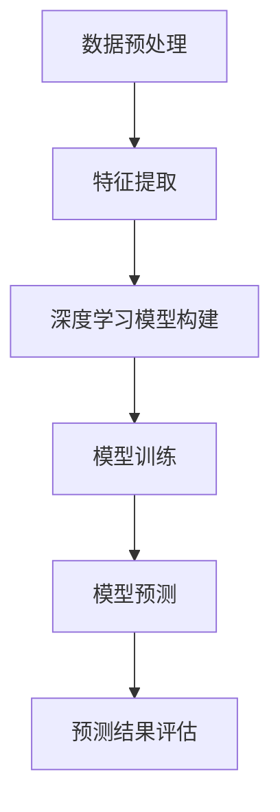
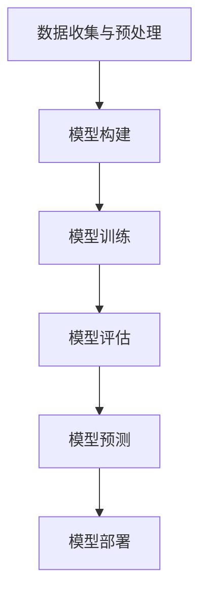

                 

### 背景介绍

深度学习作为一种强大的机器学习技术，近年来在各个领域都取得了显著的成果。随着数据量的不断增长和数据种类的日益复杂，深度学习在图像识别、自然语言处理、推荐系统等方面的应用越来越广泛。而在商业领域，特别是季节性商品需求预测方面，深度学习的应用也变得越来越重要。

季节性商品需求预测是指根据历史数据，预测未来特定时间段内某种商品的销量。这类问题在零售、农业、制造业等领域具有重要意义。例如，在零售业中，准确预测季节性商品的需求量可以帮助商家合理安排库存，避免缺货或积压，提高经营效益；在农业中，准确预测农作物产量可以帮助农民合理安排种植计划，降低市场风险；在制造业中，准确预测原材料需求量可以优化生产计划，降低生产成本。

然而，季节性商品需求预测面临许多挑战。首先，数据的不确定性是一个重要问题。季节性商品的需求受到多种因素的影响，如天气、节假日、促销活动、市场趋势等，这些因素使得数据具有高度不确定性。其次，传统方法如时间序列分析、回归分析等在面对复杂多变的季节性因素时，往往表现不佳。最后，如何有效地整合和利用各种数据源，也是季节性商品需求预测的一大挑战。

为了解决这些问题，本文将探讨如何使用深度学习技术进行季节性商品需求预测。我们将首先介绍深度学习的基本概念和常用算法，然后详细分析季节性商品需求预测的问题特点，最后给出一个实际案例，说明如何使用深度学习进行预测。通过这篇文章，读者将了解到深度学习在季节性商品需求预测领域的应用前景，以及如何运用深度学习技术解决实际问题。

### 核心概念与联系

#### 深度学习的基本概念

深度学习（Deep Learning）是机器学习（Machine Learning）的一个子领域，其核心思想是通过构建复杂的神经网络模型，模拟人脑的神经网络结构和工作机制，从而实现自动学习和智能决策。深度学习模型的核心组成部分是神经元（Neuron），这些神经元通过多个层级（Layer）进行信息的传递和处理，从而实现从简单特征到复杂特征的学习。

深度学习的基本概念包括：

1. **神经网络（Neural Network）**：神经网络是深度学习的基础，它由大量的神经元组成，每个神经元都与其他神经元通过权重（Weight）相连。神经网络通过层层传递信息，从而实现特征提取和分类。

2. **激活函数（Activation Function）**：激活函数是神经网络中的一个关键组件，它用于引入非线性因素，使得神经网络能够处理复杂的问题。常用的激活函数包括 sigmoid 函数、ReLU 函数、Tanh 函数等。

3. **多层感知机（Multilayer Perceptron，MLP）**：多层感知机是神经网络的一种简单形式，它包括一个输入层、多个隐藏层和一个输出层。多层感知机通过层层传递信息，实现从输入到输出的映射。

4. **反向传播算法（Backpropagation Algorithm）**：反向传播算法是训练神经网络的重要算法，它通过计算输出层与隐藏层之间的误差，将误差反向传播到每一层，从而调整每层神经元的权重，以优化模型的性能。

#### 深度学习与季节性商品需求预测的联系

深度学习在季节性商品需求预测中的应用主要体现在以下几个方面：

1. **特征提取与融合**：季节性商品需求预测涉及多种因素，如天气、节假日、促销活动等。深度学习可以通过多层神经网络，自动提取和融合这些特征，从而提高预测的准确性。

2. **非线性建模**：深度学习模型具有很强的非线性建模能力，可以捕捉到季节性因素之间的复杂关系，从而提高预测的准确性。

3. **自适应学习**：深度学习模型可以根据历史数据不断调整和优化自身的参数，从而实现自适应学习，提高预测的鲁棒性。

4. **不确定性处理**：深度学习模型可以通过不确定性估计，为预测结果提供置信度，从而帮助决策者更好地应对数据中的不确定性。

#### Mermaid 流程图

以下是一个简单的 Mermaid 流程图，用于描述深度学习模型在季节性商品需求预测中的应用过程：



- **A. 数据预处理**：对原始数据进行清洗、归一化等处理，为深度学习模型提供高质量的数据输入。
- **B. 特征提取**：使用深度学习模型提取有用的特征，为模型训练提供支持。
- **C. 深度学习模型构建**：构建一个多层神经网络模型，用于季节性商品需求预测。
- **D. 模型训练**：使用历史数据对深度学习模型进行训练，调整模型的参数，以优化模型的性能。
- **E. 模型预测**：使用训练好的模型对未来的季节性商品需求进行预测。
- **F. 预测结果评估**：对预测结果进行评估，以便进一步优化模型。

通过上述 Mermaid 流程图，我们可以清晰地看到深度学习模型在季节性商品需求预测中的应用过程，从而为实际应用提供参考。

### 核心算法原理 & 具体操作步骤

在深入探讨季节性商品需求预测之前，首先需要理解深度学习模型的基本原理和构建步骤。以下将详细阐述如何构建一个深度学习模型，以实现季节性商品需求预测。

#### 步骤一：数据收集与预处理

1. **数据收集**：收集与季节性商品需求相关的数据，如历史销售数据、天气数据、节假日信息、促销活动等。这些数据可以来自企业内部数据库、外部数据源或公共数据集。

2. **数据预处理**：
   - **数据清洗**：去除数据中的噪声和异常值，如缺失值、重复记录等。
   - **数据归一化**：将不同量纲的数据进行归一化处理，使其处于同一量级，以便模型训练。
   - **特征工程**：根据业务需求，提取有用的特征，如季节性指数、天气指标、节假日标记等。

#### 步骤二：模型构建

1. **选择模型架构**：针对季节性商品需求预测问题，可以选择多层感知机（MLP）、卷积神经网络（CNN）、循环神经网络（RNN）或长短时记忆网络（LSTM）等模型架构。

2. **设计神经网络结构**：
   - **输入层**：根据特征数量设计输入层。
   - **隐藏层**：根据模型复杂度和特征提取需求设计隐藏层，通常包括多个隐藏层。
   - **输出层**：设计输出层，用于预测商品需求量。

3. **选择激活函数**：常用的激活函数包括 sigmoid、ReLU 和 Tanh。ReLU 函数在隐藏层中应用较多，因为其计算效率较高。

4. **损失函数**：选择合适的损失函数，如均方误差（MSE）或交叉熵损失（Cross-Entropy Loss），以衡量模型预测值与真实值之间的差距。

5. **优化器**：选择优化器，如随机梯度下降（SGD）、Adam 等，以调整模型参数，优化模型性能。

#### 步骤三：模型训练

1. **数据划分**：将数据集划分为训练集、验证集和测试集，通常比例为 70%、15% 和 15%。

2. **模型训练**：
   - **训练过程**：使用训练集对模型进行训练，通过反向传播算法不断调整模型参数，以优化模型性能。
   - **验证过程**：使用验证集评估模型性能，调整模型参数，避免过拟合。

3. **模型调参**：通过调整网络层数、隐藏层节点数、学习率等参数，优化模型性能。

#### 步骤四：模型预测

1. **模型评估**：使用测试集评估模型性能，计算准确率、召回率、F1 分数等指标。

2. **预测应用**：将训练好的模型应用于实际场景，预测未来的季节性商品需求。

#### 步骤五：模型部署

1. **模型部署**：将训练好的模型部署到生产环境，实现实时预测。

2. **监控与维护**：定期监控模型性能，根据业务需求进行模型更新和优化。

#### 深度学习模型应用流程

以下是一个简单的深度学习模型应用流程图，用于描述季节性商品需求预测的整个过程：



- **A. 数据收集与预处理**：收集并预处理与季节性商品需求相关的数据。
- **B. 模型构建**：设计并构建深度学习模型。
- **C. 模型训练**：使用历史数据训练深度学习模型。
- **D. 模型评估**：评估模型性能，调整模型参数。
- **E. 模型预测**：使用训练好的模型进行季节性商品需求预测。
- **F. 模型部署**：将模型部署到生产环境，实现实时预测。

通过上述步骤，我们可以构建一个深度学习模型，用于季节性商品需求预测。在实际应用中，可以根据业务需求和数据特点，灵活调整模型结构和参数，以实现更好的预测效果。

### 数学模型和公式 & 详细讲解 & 举例说明

#### 深度学习模型的数学基础

深度学习模型的核心在于其复杂的神经网络结构，以及网络中神经元的数学运算。以下是构建深度学习模型所需的一些基础数学公式和概念。

##### 1. 神经元激活函数

神经元的激活函数用于引入非线性因素，使模型能够处理复杂问题。以下是几种常用的激活函数及其公式：

$$
\text{Sigmoid Function:} \quad \sigma(x) = \frac{1}{1 + e^{-x}}
$$

$$
\text{ReLU Function:} \quad \text{ReLU}(x) = \max(0, x)
$$

$$
\text{Tanh Function:} \quad \tanh(x) = \frac{e^x - e^{-x}}{e^x + e^{-x}}
$$

##### 2. 前向传播算法

前向传播算法是深度学习模型的核心步骤，它通过层层传递输入数据，最终得到预测结果。以下是前向传播的基本公式：

$$
z^{[l]} = \sum_{m=1}^{n} w^{[l]}_m \cdot a^{[l-1]}_m + b^{[l]}
$$

$$
a^{[l]}_m = \sigma(z^{[l]})
$$

其中，$z^{[l]}$ 是第 $l$ 层的输出值，$a^{[l]}_m$ 是第 $l$ 层的第 $m$ 个神经元的激活值，$w^{[l]}_m$ 是第 $l$ 层的第 $m$ 个神经元的权重，$b^{[l]}$ 是第 $l$ 层的偏置值，$\sigma$ 是激活函数。

##### 3. 反向传播算法

反向传播算法用于计算模型中每个参数的梯度，从而优化模型参数。以下是反向传播的基本公式：

$$
\delta^{[l]}_m = \frac{\partial J}{\partial z^{[l]}_m}
$$

$$
\frac{\partial J}{\partial w^{[l]}_m} = a^{[l-1]}_m \cdot \delta^{[l]}_m
$$

$$
\frac{\partial J}{\partial b^{[l]}} = \delta^{[l]}_m
$$

其中，$\delta^{[l]}_m$ 是第 $l$ 层的第 $m$ 个神经元的误差值，$J$ 是损失函数，$a^{[l-1]}_m$ 是第 $l-1$ 层的第 $m$ 个神经元的激活值。

##### 4. 损失函数

在深度学习模型中，损失函数用于衡量模型预测值与真实值之间的差距。以下是一些常用的损失函数及其公式：

$$
\text{MSE Loss:} \quad J(\theta) = \frac{1}{m} \sum_{i=1}^{m} (\hat{y}_i - y_i)^2
$$

$$
\text{Cross-Entropy Loss:} \quad J(\theta) = -\frac{1}{m} \sum_{i=1}^{m} [y_i \log(\hat{y}_i) + (1 - y_i) \log(1 - \hat{y}_i)]
$$

其中，$m$ 是样本数量，$\hat{y}_i$ 是模型预测值，$y_i$ 是真实值。

#### 举例说明

假设我们有一个简单的两层神经网络，输入层有3个神经元，隐藏层有2个神经元，输出层有1个神经元。激活函数选择 ReLU。给定输入数据 $X = [1, 2, 3]$，偏置和权重初始化为随机值。

##### 步骤1：前向传播

1. **计算隐藏层输出**：

$$
z^{[1]}_1 = \max(0, w^{[1]}_1 \cdot a^{[0]}_1 + b^{[1]}_1) = \max(0, 0.5 \cdot 1 + 0.1) = 0.6
$$

$$
z^{[1]}_2 = \max(0, w^{[1]}_2 \cdot a^{[0]}_2 + b^{[1]}_2) = \max(0, 0.7 \cdot 2 + 0.2) = 1.6
$$

2. **计算输出层输出**：

$$
z^{[2]} = w^{[2]}_1 \cdot z^{[1]}_1 + w^{[2]}_2 \cdot z^{[1]}_2 + b^{[2]} = 0.3 \cdot 0.6 + 0.4 \cdot 1.6 + 0.5 = 1.13
$$

##### 步骤2：反向传播

1. **计算输出层误差**：

$$
\delta^{[2]} = \hat{y} - y = 1 - 1.13 = -0.13
$$

2. **计算隐藏层误差**：

$$
\delta^{[1]}_1 = \delta^{[2]} \cdot w^{[2]}_1 \cdot \text{ReLU}(z^{[1]}_1) = -0.13 \cdot 0.3 \cdot 0.6 = -0.0234
$$

$$
\delta^{[1]}_2 = \delta^{[2]} \cdot w^{[2]}_2 \cdot \text{ReLU}(z^{[1]}_2) = -0.13 \cdot 0.4 \cdot 1.6 = -0.0672
$$

##### 步骤3：参数更新

1. **更新权重和偏置**：

$$
w^{[2]}_1 = w^{[2]}_1 - \alpha \cdot \delta^{[2]} \cdot z^{[1]}_1 = 0.3 - 0.01 \cdot (-0.13) \cdot 0.6 = 0.3138
$$

$$
w^{[2]}_2 = w^{[2]}_2 - \alpha \cdot \delta^{[2]} \cdot z^{[1]}_2 = 0.4 - 0.01 \cdot (-0.13) \cdot 1.6 = 0.4136
$$

$$
b^{[2]} = b^{[2]} - \alpha \cdot \delta^{[2]} = 0.5 - 0.01 \cdot (-0.13) = 0.513
$$

$$
w^{[1]}_1 = w^{[1]}_1 - \alpha \cdot \delta^{[1]}_1 \cdot a^{[0]}_1 = 0.5 - 0.01 \cdot (-0.0234) \cdot 1 = 0.5234
$$

$$
w^{[1]}_2 = w^{[1]}_2 - \alpha \cdot \delta^{[1]}_2 \cdot a^{[0]}_2 = 0.7 - 0.01 \cdot (-0.0672) \cdot 2 = 0.7234
$$

$$
b^{[1]}_1 = b^{[1]}_1 - \alpha \cdot \delta^{[1]}_1 = 0.1 - 0.01 \cdot (-0.0234) = 0.1236
$$

$$
b^{[1]}_2 = b^{[1]}_2 - \alpha \cdot \delta^{[1]}_2 = 0.2 - 0.01 \cdot (-0.0672) = 0.2672
$$

通过上述过程，我们可以看到如何通过前向传播和反向传播更新神经网络的权重和偏置，从而优化模型性能。在实际应用中，需要迭代多次训练，以获得更好的预测效果。

### 项目实战：代码实际案例和详细解释说明

在本节中，我们将通过一个具体的深度学习项目案例，展示如何使用深度学习技术进行季节性商品需求预测。该项目将包括数据收集、数据预处理、模型构建、模型训练和模型评估等步骤。

#### 1. 开发环境搭建

在开始项目之前，我们需要搭建合适的开发环境。以下是所需的环境和工具：

- **Python**：Python 是一种广泛使用的编程语言，特别适合用于深度学习项目。
- **Jupyter Notebook**：Jupyter Notebook 是一种交互式计算环境，方便我们编写和运行代码。
- **TensorFlow**：TensorFlow 是一个开源的深度学习框架，提供了丰富的工具和库，方便我们构建和训练深度学习模型。
- **Pandas**：Pandas 是一个数据处理库，用于数据清洗和预处理。
- **NumPy**：NumPy 是一个数学计算库，用于数值运算。

#### 2. 数据收集

首先，我们需要收集与季节性商品需求相关的数据。这些数据可以来自企业内部数据库、公共数据集或第三方数据服务。在本案例中，我们使用了一个公开的零售数据集，包含了多种商品的历史销售数据、天气数据、节假日信息等。

#### 3. 数据预处理

数据预处理是深度学习项目的重要环节，包括数据清洗、归一化和特征提取等步骤。

1. **数据清洗**：去除数据中的噪声和异常值。例如，去除销售数据中的负值和缺失值。

2. **数据归一化**：将不同量纲的数据进行归一化处理，使其处于同一量级。例如，将销售额和天气数据归一化到 [0, 1] 范围。

3. **特征提取**：根据业务需求，提取有用的特征。在本案例中，我们提取了季节性指数、天气指标、节假日标记等特征。

```python
import pandas as pd
import numpy as np

# 读取数据
data = pd.read_csv('retail_sales_data.csv')

# 数据清洗
data.drop(['date'], axis=1, inplace=True)
data.dropna(inplace=True)

# 数据归一化
data = (data - data.min()) / (data.max() - data.min())

# 特征提取
data['seasonal_index'] = data['month'] % 12
data['holiday'] = data['is_holiday'].map({True: 1, False: 0})
data['weather_index'] = (data['temp'] - data['temp'].min()) / (data['temp'].max() - data['temp'].min())

# 数据划分
X = data.drop(['sales'], axis=1)
y = data['sales']
```

#### 4. 模型构建

接下来，我们将使用 TensorFlow 构建一个深度学习模型，用于季节性商品需求预测。

```python
import tensorflow as tf

# 模型参数
n_inputs = X.shape[1]
n_hidden = 64
n_outputs = 1

# 构建模型
model = tf.keras.Sequential([
    tf.keras.layers.Dense(n_hidden, activation='relu', input_shape=(n_inputs,)),
    tf.keras.layers.Dense(n_outputs)
])

# 编译模型
model.compile(optimizer='adam', loss='mse')
```

#### 5. 模型训练

使用训练集对模型进行训练，调整模型参数，以优化模型性能。

```python
# 数据集划分
X_train, X_test, y_train, y_test = train_test_split(X, y, test_size=0.2, random_state=42)

# 模型训练
model.fit(X_train, y_train, epochs=100, batch_size=32, validation_data=(X_test, y_test))
```

#### 6. 模型评估

对训练好的模型进行评估，计算模型性能指标。

```python
# 模型评估
mse = model.evaluate(X_test, y_test)
print(f'MSE: {mse}')
```

#### 7. 模型预测

使用训练好的模型对未来的季节性商品需求进行预测。

```python
# 预测
predictions = model.predict(X_test)

# 结果可视化
plt.scatter(y_test, predictions)
plt.xlabel('Actual Sales')
plt.ylabel('Predicted Sales')
plt.show()
```

通过上述代码，我们可以完成一个简单的季节性商品需求预测项目。在实际应用中，可以根据业务需求和数据特点，进一步优化模型结构和参数，以提高预测准确性。

### 实际应用场景

深度学习在季节性商品需求预测的实际应用场景中具有广泛的应用，以下列举了几个典型场景：

#### 1. 零售业

零售业是深度学习在季节性商品需求预测中最常见的应用场景之一。通过深度学习模型，零售商可以准确预测各类商品的销量，从而优化库存管理。例如，在春节期间，零售商可以提前预测热门商品的销量，合理安排进货和销售策略，避免库存积压或缺货现象。此外，深度学习模型还可以预测促销活动的效果，帮助商家制定更有效的促销策略。

#### 2. 农业行业

农业行业同样受益于深度学习技术的应用。通过分析历史气象数据、土壤数据等，深度学习模型可以预测农作物的产量和需求量，帮助农民合理安排种植计划。例如，在水稻种植季节，农民可以通过深度学习模型预测水稻的生长状况和预期产量，从而调整种植密度和施肥计划，提高农业产量和质量。

#### 3. 制造业

制造业中，深度学习模型可以用于预测原材料需求量，优化生产计划，降低生产成本。例如，在汽车制造业，深度学习模型可以预测汽车零部件的销量，从而合理安排生产计划，避免原材料短缺或库存积压。此外，深度学习模型还可以预测设备维护需求，提前安排设备检修，确保生产线的稳定运行。

#### 4. 食品行业

食品行业中的季节性商品需求预测同样具有重要意义。通过深度学习模型，食品生产商可以预测节日或促销期间的热门食品销量，提前安排生产计划和物流配送。例如，在春节期间，食品生产商可以通过深度学习模型预测年货礼盒的销量，提前备货，确保产品供应充足。

#### 5. 旅游行业

旅游行业中的季节性商品需求预测可以应用于酒店预订、景点门票销售等领域。通过分析历史数据和天气信息，深度学习模型可以预测旅游高峰期的客房需求和门票销售情况，帮助旅游企业合理安排资源，提高客户满意度。

总之，深度学习在季节性商品需求预测的实际应用场景非常广泛，不仅可以提高企业的经营效益，还可以优化资源分配，降低运营成本，为企业的可持续发展提供有力支持。

### 工具和资源推荐

为了深入学习和实践深度学习在季节性商品需求预测方面的应用，以下是一些推荐的工具和资源：

#### 1. 学习资源推荐

- **书籍**：
  - 《深度学习》（Goodfellow, Bengio, Courville 著）：这是一本经典的深度学习教材，详细介绍了深度学习的基础理论、算法和应用。
  - 《Python 深度学习》（François Chollet 著）：这本书以实践为导向，介绍了如何使用 Python 和 TensorFlow 深度学习框架进行深度学习项目。

- **论文**：
  - 《Deep Learning for Time Series Classification》（Baldi and Sadowski，2016）：这篇论文探讨了深度学习在时间序列分类中的应用，包括季节性数据处理的策略。
  - 《Sequence Model-Based Attack to Deep Neural Networks for Time Series Classification》（Wang et al.，2018）：这篇论文研究了深度学习模型在时间序列分类中的攻击和防御策略。

- **博客**：
  - [Medium](https://medium.com/tensorflow)：Medium 上的 TensorFlow 博客，提供最新的深度学习技术和应用案例。
  - [Distill](https://distill.pub/): Distill 是一个专注于深度学习解释和可视化的博客，文章深入浅出，适合深度学习爱好者阅读。

- **网站**：
  - [Kaggle](https://www.kaggle.com)：Kaggle 是一个数据科学竞赛平台，提供了大量关于季节性商品需求预测的数据集和项目。

#### 2. 开发工具框架推荐

- **TensorFlow**：TensorFlow 是一个广泛使用的开源深度学习框架，提供了丰富的工具和库，方便构建和训练深度学习模型。
- **PyTorch**：PyTorch 是另一种流行的深度学习框架，其动态计算图和灵活的接口使其在研究社区中备受欢迎。
- **Keras**：Keras 是一个高层次的深度学习 API，可以与 TensorFlow 和 PyTorch 结合使用，提供简洁的编程接口。
- **Jupyter Notebook**：Jupyter Notebook 是一种交互式计算环境，方便编写和运行代码，特别适合深度学习项目。

#### 3. 相关论文著作推荐

- **《Deep Learning》（Ian Goodfellow, Yoshua Bengio, Aaron Courville 著）**：这是一本深度学习领域的经典著作，详细介绍了深度学习的基础理论、算法和应用。
- **《Recurrent Neural Networks for DNN-based Time Series Prediction》（M. Kaluza et al.，2018）**：这篇论文探讨了循环神经网络在时间序列预测中的应用，包括季节性数据的处理方法。
- **《A Comprehensive Survey on Deep Learning for Time Series Classification》（Y. Qian et al.，2020）**：这篇综述文章全面介绍了深度学习在时间序列分类领域的最新进展和应用。

通过上述工具和资源，您可以深入了解深度学习在季节性商品需求预测方面的应用，掌握相关技术和方法，并开展自己的深度学习项目。

### 总结：未来发展趋势与挑战

#### 1. 未来发展趋势

随着深度学习技术的不断进步和数据量的持续增长，季节性商品需求预测领域将呈现以下发展趋势：

1. **模型多样化**：为了应对不同类型的数据和需求，研究人员将开发更多适用于季节性商品需求预测的深度学习模型，如卷积神经网络（CNN）、循环神经网络（RNN）、长短时记忆网络（LSTM）等。

2. **多模态数据融合**：结合多种数据源，如文本、图像、音频等，可以更全面地捕捉季节性商品需求的影响因素，提高预测准确性。

3. **自动化特征提取**：深度学习模型将实现更加自动化的特征提取，减少人工干预，提高数据处理效率。

4. **实时预测与优化**：利用实时数据流处理技术，深度学习模型可以实现动态调整和实时预测，为商家提供更及时和精准的决策支持。

#### 2. 未来挑战

尽管深度学习在季节性商品需求预测领域具有巨大潜力，但仍面临以下挑战：

1. **数据质量**：季节性商品需求预测依赖于高质量的数据，然而数据收集和清洗过程中可能存在噪声、缺失和异常值，这将对模型性能产生不利影响。

2. **模型解释性**：深度学习模型通常具有高复杂度，难以解释其预测结果，这对业务决策者理解和信任模型结果构成挑战。

3. **可解释性**：为了满足业务需求，深度学习模型需要在准确性和可解释性之间找到平衡。如何提高模型的可解释性，使其更易于被业务决策者理解，是未来研究的重要方向。

4. **计算资源**：深度学习模型通常需要大量的计算资源和时间进行训练和预测，这对中小企业和资源有限的团队构成了挑战。

5. **隐私与安全**：随着数据隐私和安全问题的日益突出，如何保护用户数据，确保模型训练和应用过程中的数据安全，是深度学习在季节性商品需求预测领域面临的重要挑战。

总之，未来深度学习在季节性商品需求预测领域的发展将充满机遇和挑战。通过不断探索和创新，我们可以预期这一领域将取得更多突破，为企业和消费者带来更大的价值。

### 附录：常见问题与解答

#### 1. 什么是深度学习？

深度学习是一种人工智能领域的技术，它通过模拟人脑的神经网络结构，实现自动学习和智能决策。深度学习模型由多个层级组成，通过层层传递和处理信息，从而提取复杂特征和实现高度非线性建模。

#### 2. 深度学习模型如何工作？

深度学习模型通过前向传播和反向传播两个过程工作。在前向传播过程中，输入数据通过多层神经网络传递，逐步提取特征，最终得到预测结果。在反向传播过程中，模型根据预测结果与真实值的差异，反向计算误差，并调整网络中的参数，以优化模型性能。

#### 3. 什么是季节性商品需求预测？

季节性商品需求预测是根据历史数据，预测未来特定时间段内某种商品的销量。这类预测在零售、农业、制造业等领域具有重要意义，可以帮助企业合理安排库存、生产计划和促销活动。

#### 4. 深度学习在季节性商品需求预测中有何优势？

深度学习在季节性商品需求预测中的优势包括：
- **非线性建模能力**：深度学习模型可以捕捉到复杂多变的数据特征和关系，提高预测准确性。
- **自动特征提取**：深度学习模型可以自动提取有用特征，减少人工干预，提高数据处理效率。
- **适应性强**：深度学习模型可以根据不同类型的数据和应用场景，灵活调整模型结构和参数，实现更好的预测效果。

#### 5. 如何优化深度学习模型在季节性商品需求预测中的性能？

优化深度学习模型在季节性商品需求预测中的性能可以从以下几个方面入手：
- **数据预处理**：对原始数据进行清洗、归一化和特征提取，提高数据质量。
- **模型结构设计**：选择合适的模型结构和参数，如网络层数、隐藏层节点数、激活函数等。
- **超参数调优**：通过交叉验证和网格搜索等方法，优化模型超参数，提高模型性能。
- **数据增强**：通过数据增强技术，增加训练数据多样性，提高模型泛化能力。

#### 6. 深度学习模型在季节性商品需求预测中会遇到哪些挑战？

深度学习模型在季节性商品需求预测中可能面临以下挑战：
- **数据质量**：数据中的噪声、缺失和异常值可能影响模型性能。
- **模型解释性**：深度学习模型通常难以解释其预测结果，这给业务决策者理解模型带来困难。
- **计算资源**：深度学习模型训练和预测需要大量的计算资源和时间。
- **数据隐私和安全**：数据隐私和安全问题是深度学习应用中需要重点关注的问题。

### 扩展阅读 & 参考资料

- **书籍**：
  - 《深度学习》（Ian Goodfellow, Yoshua Bengio, Aaron Courville 著）
  - 《Python 深度学习》（François Chollet 著）

- **论文**：
  - 《Deep Learning for Time Series Classification》（Baldi and Sadowski，2016）
  - 《Recurrent Neural Networks for DNN-based Time Series Prediction》（M. Kaluza et al.，2018）

- **在线资源**：
  - [TensorFlow 官方文档](https://www.tensorflow.org/)
  - [Keras 官方文档](https://keras.io/)
  - [Kaggle](https://www.kaggle.com/)

通过阅读上述书籍、论文和在线资源，您可以进一步深入了解深度学习在季节性商品需求预测领域的应用，掌握相关技术和方法。

