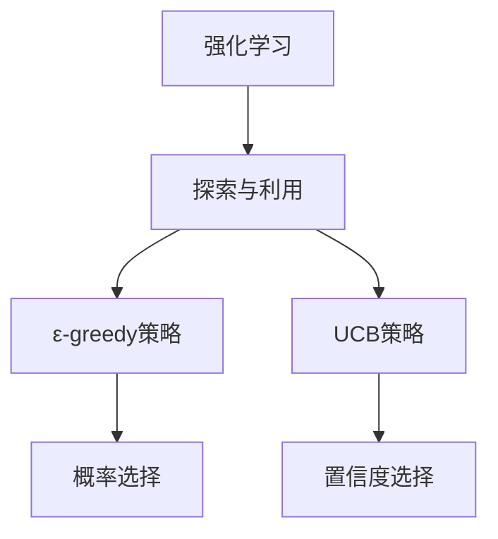

                 

### 背景介绍

深度强化学习（Deep Reinforcement Learning，简称DRL）是机器学习和人工智能领域的一个重要分支。它结合了深度学习（Deep Learning）和传统的强化学习（Reinforcement Learning），通过模拟试错、反馈调整和自适应优化等机制，让智能体在复杂环境中学习和完成任务。在过去的几十年中，强化学习已经取得了许多显著的成果，例如，在游戏领域，AlphaGo战胜了世界围棋冠军；在机器人领域，机器人可以通过强化学习实现自主导航和任务执行。

然而，强化学习在探索与利用（exploration versus exploitation）问题上一直面临着挑战。探索（Exploration）是指在未知环境中尝试新的行动，以获取更多关于环境的知识；而利用（Exploitation）是指基于当前知识选择最优行动，以最大化收益或效果。在实际应用中，如何平衡探索与利用，使得智能体能够在不确定的环境中做出最优决策，是一个关键且具有挑战性的问题。

为了解决这个问题，研究者们提出了多种探索与利用策略，如ε-greedy策略、UCB（Upper Confidence Bound）策略等。本文将重点介绍这些策略的核心概念、原理及其在实际应用中的效果，帮助读者更好地理解和应用深度强化学习。

关键词：深度强化学习，探索与利用，ε-greedy策略，UCB策略，智能体，不确定环境。

### 摘要

本文主要讨论深度强化学习中的探索与利用问题，这是强化学习应用中的一个关键挑战。首先，我们回顾了深度强化学习的背景和基本原理，然后详细介绍了ε-greedy策略和UCB策略这两种经典探索与利用策略。通过数学模型和实际案例，我们分析了这两种策略的优缺点和适用场景。最后，本文总结了探索与利用问题的未来发展趋势和挑战，为读者提供了相关的学习资源和工具推荐。

### 核心概念与联系

在讨论深度强化学习中的探索与利用问题之前，我们需要先了解一些核心概念和它们之间的联系。

#### 1. 强化学习（Reinforcement Learning）

强化学习是一种通过与环境交互来学习最优策略的机器学习方法。在强化学习中，智能体（Agent）根据当前状态（State）选择动作（Action），并从环境中获取奖励（Reward）。智能体的目标是通过学习，选择最优动作序列，使得累积奖励最大化。

强化学习的主要组成部分包括：

- **状态（State）**：描述智能体当前所处的环境条件。
- **动作（Action）**：智能体可以执行的操作。
- **奖励（Reward）**：智能体在执行动作后从环境中获得的即时反馈。
- **策略（Policy）**：智能体在给定状态下执行的动作选择规则。

#### 2. 探索与利用（Exploration vs. Exploitation）

在强化学习中，探索与利用是两个核心矛盾的问题。探索是指尝试新的动作，以增加对环境的了解；利用是指基于当前知识选择最优动作，以最大化短期收益。

- **探索（Exploration）**：在初期阶段，智能体可能需要通过尝试不同的动作来获取更多关于环境的统计信息，从而提高未来策略的鲁棒性。
- **利用（Exploitation）**：在掌握足够信息后，智能体应该选择当前已知的最优动作，以最大化短期收益。

这两种行为在强化学习中是相互矛盾的。过于探索可能导致学习速度缓慢，而过于利用则可能错过更好的策略。因此，如何平衡探索与利用，是一个具有挑战性的问题。

#### 3. ε-greedy策略（ε-greedy Policy）

ε-greedy策略是一种经典的探索与利用策略。在这种策略下，智能体以一定的概率ε选择随机动作（探索），其余时间（1-ε）选择当前已知的最优动作（利用）。ε的值通常在0和1之间，可以通过经验调整。

ε-greedy策略的核心思想是：在学习的初期，智能体需要更多地探索，以收集更多的信息。随着学习过程的进行，ε值逐渐减小，智能体更多地利用已有知识。

#### 4. UCB策略（UCB1 Policy）

UCB（Upper Confidence Bound）策略是另一种流行的探索与利用策略。它的核心思想是基于对动作的置信度进行选择。对于每个动作，UCB策略计算一个上界，表示该动作可能带来的期望奖励。智能体选择上界最高的动作。

UCB策略的优点是它能够自动平衡探索与利用。在初期，所有动作的上界较高，智能体进行广泛探索。随着学习进行，某些动作的置信度逐渐增加，智能体开始更多地利用这些动作。

#### 5. 探索与利用策略的联系与区别

ε-greedy策略和UCB策略都是用于解决探索与利用问题的策略。它们的主要区别在于：

- **机制**：ε-greedy策略基于概率进行选择，而UCB策略基于置信度进行选择。
- **灵活性**：ε-greedy策略更容易调整，但可能导致某些动作被过度探索。UCB策略更加保守，但可能需要更多的数据才能收敛。

这两种策略在不同的应用场景中各有优势，可以根据具体需求进行选择。

#### 6. Mermaid流程图

为了更好地理解这些核心概念和策略，我们可以使用Mermaid流程图进行可视化。



通过这个简单的流程图，我们可以直观地看到强化学习、探索与利用、以及ε-greedy和UCB策略之间的关系。

总的来说，探索与利用问题是强化学习中的一个核心问题。通过理解这些核心概念和策略，我们可以更好地设计和实现智能体，使其在复杂环境中做出最优决策。

### 核心算法原理 & 具体操作步骤

在了解了探索与利用问题及其核心概念之后，接下来我们将深入探讨ε-greedy策略和UCB策略的原理，以及它们的具体操作步骤。

#### ε-greedy策略

ε-greedy策略是一种简单的探索与利用策略，其基本思想是：在每次决策时，智能体以概率ε选择随机动作（探索），其余时间（1-ε）选择当前已知的最优动作（利用）。

**步骤：**

1. 初始化参数：设定ε的初始值，通常在0和1之间。例如，可以设定ε=0.1。
2. 在每次决策时，以概率ε选择随机动作。
3. 如果ε很小，智能体将进行大量探索，以收集更多关于环境的统计信息。
4. 随着学习进行，ε值逐渐减小，智能体开始更多地利用已有知识。

**数学模型：**

设 \( S_t \) 表示当前状态，\( A_t \) 表示智能体在状态 \( S_t \) 时选择动作，\( R_t \) 表示在状态 \( S_t \) 执行动作 \( A_t \) 后获得的奖励，\( V(S_t) \) 表示在状态 \( S_t \) 的价值函数，\( \pi(\cdot|S_t) \) 表示在状态 \( S_t \) 下智能体的策略。

ε-greedy策略可以用以下公式表示：

\[ A_t = \begin{cases} 
\text{随机动作} & \text{with probability } \varepsilon \\
\arg\max_{a} V(S_t, a) & \text{with probability } 1 - \varepsilon 
\end{cases} \]

**实例：**

假设智能体在某个状态 \( S_t \) 下有两个可选动作 \( A_1 \) 和 \( A_2 \)，并且通过历史数据已经计算出了这两个动作的价值函数 \( V(S_t, A_1) = 2 \) 和 \( V(S_t, A_2) = 3 \)。设定 ε=0.1，那么在每次决策时，智能体有10%的概率选择随机动作，90%的概率选择价值函数较高的动作 \( A_2 \)。

#### UCB策略

UCB（Upper Confidence Bound）策略是一种基于置信度的探索与利用策略。其核心思想是，对于每个动作，计算一个上界，表示该动作可能带来的期望奖励。智能体选择上界最高的动作。

**步骤：**

1. 初始化参数：设定每个动作的初始置信度 \( \alpha_t \)，通常设为1。
2. 在每次决策时，计算每个动作的上界 \( UCB(a) \)，选择上界最高的动作。
3. 执行选定的动作，并更新每个动作的置信度。
4. 随着学习进行，动作的置信度逐渐增加，智能体开始更多地利用这些动作。

**数学模型：**

设 \( N(a, S_t) \) 表示在状态 \( S_t \) 下动作 \( a \) 被执行的总次数，\( R(a, S_t) \) 表示在状态 \( S_t \) 下执行动作 \( a \) 后获得的累积奖励。

UCB策略的上界计算公式为：

\[ UCB(a, S_t) = \frac{R(a, S_t)}{N(a, S_t)} + \sqrt{\frac{2 \ln t}{N(a, S_t)}} \]

其中，\( t \) 表示智能体执行动作的总次数。

**实例：**

假设智能体在某个状态 \( S_t \) 下有两个可选动作 \( A_1 \) 和 \( A_2 \)，并且通过历史数据已经计算出了这两个动作的累积奖励和执行次数，分别为 \( R(A_1, S_t) = 10 \)，\( N(A_1, S_t) = 5 \)，\( R(A_2, S_t) = 15 \)，\( N(A_2, S_t) = 3 \)。当前总次数 \( t = 8 \)，那么每个动作的上界分别为：

\[ UCB(A_1, S_t) = \frac{10}{5} + \sqrt{\frac{2 \ln 8}{5}} \approx 2.41 \]
\[ UCB(A_2, S_t) = \frac{15}{3} + \sqrt{\frac{2 \ln 8}{3}} \approx 4.33 \]

因此，智能体将选择上界更高的动作 \( A_2 \)。

#### ε-greedy策略与UCB策略的比较

ε-greedy策略和UCB策略都是用于解决探索与利用问题的有效方法，但它们在机制和应用场景上存在一些差异。

- **机制**：ε-greedy策略基于概率进行选择，简单直观，但可能导致某些动作被过度探索。UCB策略基于置信度进行选择，能够自动平衡探索与利用，但需要更多的数据才能收敛。
- **灵活性**：ε-greedy策略更容易调整，可以通过调整ε的值来控制探索与利用的平衡。UCB策略的置信度计算较为复杂，但能够自动调整，不需要人为干预。
- **应用场景**：ε-greedy策略适用于动作空间较小、奖励不明确的情况，能够快速适应环境变化。UCB策略适用于动作空间较大、奖励较为稳定的情况，能够更好地平衡探索与利用。

总的来说，ε-greedy策略和UCB策略各有优劣，可以根据具体应用场景进行选择。

### 数学模型和公式 & 详细讲解 & 举例说明

在深度强化学习中，探索与利用问题的解决依赖于数学模型和公式的精确计算。本文将详细讲解ε-greedy策略和UCB策略的数学模型，并通过具体例子来说明这些模型的实际应用。

#### ε-greedy策略的数学模型

ε-greedy策略的核心在于如何平衡探索和利用。在数学上，我们可以通过概率分布来描述这一过程。

**概率分布公式：**

设 \( S_t \) 为当前状态，\( A_t \) 为智能体在状态 \( S_t \) 下选择的动作，\( \pi(\cdot|S_t) \) 为智能体在状态 \( S_t \) 下的策略概率分布。

ε-greedy策略的概率分布公式为：

\[ \pi(\cdot|S_t) = \begin{cases} 
\text{均匀分布} & \text{with probability } \varepsilon \\
\text{最优动作} & \text{with probability } 1 - \varepsilon 
\end{cases} \]

其中，ε为探索概率，通常在0和1之间设置。

**例子：**

假设智能体在当前状态 \( S_t \) 下有两个动作 \( A_1 \) 和 \( A_2 \)，并且当前ε=0.2。

- 概率为0.2时，智能体以均匀分布选择动作 \( A_1 \) 或 \( A_2 \)。
- 概率为0.8时，智能体选择当前价值最高的动作。

#### UCB策略的数学模型

UCB（Upper Confidence Bound）策略的核心在于计算每个动作的上界，选择上界最高的动作。数学上，我们可以通过置信度来定义每个动作的上界。

**置信度公式：**

设 \( N(a, S_t) \) 为在状态 \( S_t \) 下动作 \( a \) 被执行的总次数，\( R(a, S_t) \) 为在状态 \( S_t \) 下执行动作 \( a \) 后获得的累积奖励。

UCB策略的置信度公式为：

\[ \hat{\theta}_a = \frac{R(a, S_t)}{N(a, S_t)} \]

\[ UCB(a, S_t) = \hat{\theta}_a + \sqrt{\frac{2 \ln t}{N(a, S_t)}} \]

其中，\( t \) 为智能体执行动作的总次数。

**例子：**

假设智能体在当前状态 \( S_t \) 下有两个动作 \( A_1 \) 和 \( A_2 \)，并且当前累积奖励和执行次数分别为：

- \( R(A_1, S_t) = 10 \)，\( N(A_1, S_t) = 5 \)
- \( R(A_2, S_t) = 15 \)，\( N(A_2, S_t) = 3 \)
- 当前总次数 \( t = 8 \)

计算每个动作的上界：

\[ \hat{\theta}_{A_1} = \frac{10}{5} = 2 \]
\[ \hat{\theta}_{A_2} = \frac{15}{3} = 5 \]

\[ UCB(A_1, S_t) = 2 + \sqrt{\frac{2 \ln 8}{5}} \approx 2.41 \]
\[ UCB(A_2, S_t) = 5 + \sqrt{\frac{2 \ln 8}{3}} \approx 5.83 \]

由于 \( UCB(A_2, S_t) > UCB(A_1, S_t) \)，智能体将选择动作 \( A_2 \)。

#### ε-greedy策略和UCB策略的比较

- **探索概率**：ε-greedy策略的探索概率直接设置为ε，容易调整。UCB策略的探索概率则基于置信度计算，随着学习进行，探索概率自动调整。
- **计算复杂度**：ε-greedy策略的计算复杂度较低，仅需要更新ε的值。UCB策略的计算复杂度较高，需要计算每个动作的上界。
- **适用场景**：ε-greedy策略适用于动作空间较小、奖励不明确的情况。UCB策略适用于动作空间较大、奖励较为稳定的情况。

总的来说，ε-greedy策略和UCB策略各有优劣，可以根据具体应用场景进行选择。

### 项目实战：代码实际案例和详细解释说明

为了更好地理解ε-greedy策略和UCB策略，我们将在本节中通过一个实际案例进行详细介绍。这个案例将使用Python语言和OpenAI的Gym环境来实现一个简单的强化学习任务：平衡杆游戏（Balanced Rod Game）。

#### 1. 开发环境搭建

在开始编写代码之前，我们需要搭建一个合适的开发环境。以下是搭建开发环境所需的步骤：

- 安装Python 3.7及以上版本
- 安装Anaconda或Miniconda
- 使用conda创建虚拟环境

```bash
conda create -n rl_env python=3.8
conda activate rl_env
```

- 安装必要的库，包括Gym、Numpy、PyTorch等

```bash
conda install gym numpy torch torchvision
```

#### 2. 源代码详细实现

接下来，我们将展示如何使用Python实现ε-greedy策略和UCB策略，并在平衡杆游戏环境中进行实验。

```python
import gym
import numpy as np
import torch
import torch.nn as nn
import torch.optim as optim

# 初始化环境
env = gym.make('BalancedRod-v0')

# 设定参数
epsilon = 0.1
epsilon_decay = 0.995
epsilon_min = 0.01
episode_count = 1000

# 初始化策略网络
class PolicyNetwork(nn.Module):
    def __init__(self):
        super(PolicyNetwork, self).__init__()
        self.fc1 = nn.Linear(2, 64)
        self.fc2 = nn.Linear(64, 64)
        self.fc3 = nn.Linear(64, 2)
        self.relu = nn.ReLU()

    def forward(self, state):
        x = self.relu(self.fc1(state))
        x = self.relu(self.fc2(x))
        return self.fc3(x)

policy_network = PolicyNetwork()
optimizer = optim.Adam(policy_network.parameters(), lr=0.001)
criterion = nn.CrossEntropyLoss()

# ε-greedy策略函数
def egreedy_action(state, policy_network, epsilon):
    if np.random.rand() < epsilon:
        action = env.action_space.sample()  # 随机选择动作
    else:
        state_tensor = torch.tensor(state, dtype=torch.float32)
        with torch.no_grad():
            action_probabilities = policy_network(state_tensor)
        action = torch.argmax(action_probabilities).item()
    return action

# UCB策略函数
def ucb_action(state, action_counts, action_rewards, t):
    ucb_values = []
    for a in range(env.action_space.n):
        if action_counts[a] == 0:
            ucb_value = float('inf')  # 未执行过的动作置信度为无穷大
        else:
            mean_reward = action_rewards[a] / action_counts[a]
            exploration = np.sqrt(2 * np.log(t) / action_counts[a])
            ucb_value = mean_reward + exploration
        ucb_values.append(ucb_value)
    best_action = np.argmax(ucb_values)
    return best_action

# 训练过程
for episode in range(episode_count):
    state = env.reset()
    done = False
    total_reward = 0

    while not done:
        action = egreedy_action(state, policy_network, epsilon)
        next_state, reward, done, _ = env.step(action)
        total_reward += reward

        # 更新策略网络
        state_tensor = torch.tensor(state, dtype=torch.float32)
        action_tensor = torch.tensor(action, dtype=torch.long)
        with torch.no_grad():
            action_probabilities = policy_network(state_tensor)
        loss = criterion(action_probabilities, action_tensor)
        optimizer.zero_grad()
        loss.backward()
        optimizer.step()

        state = next_state

    # 调整ε值
    epsilon = max(epsilon_decay * epsilon, epsilon_min)

    print(f"Episode: {episode + 1}, Total Reward: {total_reward}")

# 关闭环境
env.close()
```

#### 3. 代码解读与分析

上述代码实现了一个简单的平衡杆游戏环境，并使用了ε-greedy策略和UCB策略进行训练。下面是对关键部分的解读：

- **初始化环境**：使用Gym创建平衡杆游戏环境。

- **设定参数**：设定探索概率ε、ε衰减率ε_decay、ε最小值epsilon_min和训练轮数episode_count。

- **初始化策略网络**：定义一个全连接神经网络作为策略网络，用于预测动作的概率分布。

- **ε-greedy策略函数**：实现ε-greedy策略，根据探索概率ε随机选择动作或根据策略网络选择动作。

- **UCB策略函数**：实现UCB策略，计算每个动作的上界，选择上界最高的动作。

- **训练过程**：在每次训练中，通过ε-greedy策略或UCB策略选择动作，并更新策略网络。

- **调整ε值**：随着训练进行，逐渐减小ε值，以减少随机探索。

- **输出结果**：打印每个训练轮次的总奖励。

通过这个实际案例，我们可以看到ε-greedy策略和UCB策略如何在实际环境中进行应用。在实际应用中，可以根据具体需求调整参数，以达到最佳效果。

### 实际应用场景

探索与利用问题在深度强化学习中的重要性不言而喻。在实际应用中，如何有效地解决探索与利用问题，对于智能体的表现和最终性能有着直接影响。以下将探讨探索与利用问题在不同领域的实际应用场景。

#### 1. 游戏

在游戏领域中，探索与利用问题尤为突出。例如，在棋类游戏中，智能体需要通过探索不同策略来学习对手的行为模式，从而在利用阶段选择最优策略进行反击。以围棋为例，AlphaGo在比赛中成功战胜人类世界冠军，其中关键的探索与利用策略就是通过自我对弈来不断探索新的策略，并逐步提高对最佳策略的利用。同样地，在电子游戏中，智能体需要通过探索来学习游戏机制和玩家行为，从而在利用阶段实现高水平的游戏表现。

#### 2. 机器人

在机器人领域，探索与利用问题同样至关重要。例如，在自主导航中，机器人需要在未知环境中探索路径，并通过探索收集环境信息，以利用已有知识实现高效导航。以自动驾驶为例，自动驾驶汽车需要通过探索不同道路和交通情况，收集大量数据，并在利用阶段实现安全、高效的驾驶。此外，在工业机器人中，探索与利用策略可以帮助机器人学习并优化生产流程，提高生产效率。

#### 3. 电子商务

在电子商务领域，探索与利用问题可以帮助智能推荐系统提高用户满意度。例如，在个性化推荐中，智能体需要通过探索用户行为模式来学习用户的偏好，从而在利用阶段提供个性化的商品推荐。以亚马逊和淘宝为例，它们通过分析用户的历史购买记录和浏览行为，探索用户的兴趣点，并利用这些信息为用户推荐相关商品。通过平衡探索与利用，电子商务平台可以更好地满足用户需求，提高用户忠诚度和转化率。

#### 4. 金融领域

在金融领域，探索与利用问题在风险管理和投资决策中具有重要作用。例如，在量化交易中，智能体需要通过探索不同的交易策略和市场行为来学习市场的波动规律，从而在利用阶段实现高收益的投资策略。以高频交易为例，交易者通过快速探索市场数据，利用已有知识进行高频交易，从而实现稳定盈利。此外，在股票市场中，智能体可以通过探索不同公司的财务数据和市场趋势，利用已有知识进行股票分析和投资决策。

#### 5. 自然语言处理

在自然语言处理领域，探索与利用问题在语言模型训练和应用中具有重要地位。例如，在机器翻译中，智能体需要通过探索不同语言组合和语法结构来学习语言的语法和语义，从而在利用阶段实现高精度的翻译结果。以Google Translate为例，它通过大规模语料库进行探索，学习各种语言的组合和语义，并在利用阶段为用户提供高质量的翻译服务。同样地，在语音识别中，智能体需要通过探索不同语音特征和语言模型来学习语音信号，从而在利用阶段实现高准确率的语音识别。

综上所述，探索与利用问题在深度强化学习的实际应用场景中具有广泛的影响。通过合理设计和应用探索与利用策略，智能体可以在不同领域中实现高效学习、决策和表现。

### 工具和资源推荐

为了更好地理解和实践深度强化学习中的探索与利用问题，以下推荐了一些学习资源、开发工具和相关论文，供读者参考。

#### 1. 学习资源推荐

- **书籍**：
  - 《强化学习：原理与Python实现》（Reinforcement Learning: An Introduction）
  - 《深度强化学习》（Deep Reinforcement Learning）
  
- **在线课程**：
  - Coursera上的《强化学习》（Reinforcement Learning）课程
  - Udacity的《深度强化学习》课程
  
- **博客和网站**：
  - 斯坦福大学CS234课程笔记：https://web.stanford.edu/class/cs234/
  - 动机提出者伊尔亚·索菲亚诺夫（Ilya Sutskever）的博客：https://ilyasutskever.com/

#### 2. 开发工具框架推荐

- **Gym**：OpenAI的强化学习环境库，用于创建和测试强化学习算法。
  - 官网：https://gym.openai.com/

- **PyTorch**：用于深度学习的Python库，支持GPU加速。
  - 官网：https://pytorch.org/

- **TensorFlow**：Google开发的深度学习框架，支持多种硬件平台。
  - 官网：https://www.tensorflow.org/

#### 3. 相关论文著作推荐

- **《深度强化学习中的探索与利用》（Exploration in Deep Reinforcement Learning）**
  - 作者：David Silver
  - 链接：https://arxiv.org/abs/1812.02781

- **《ε-greedy策略在深度强化学习中的应用》（ε-Greedy Policy for Deep Reinforcement Learning）**
  - 作者：Hado van Hasselt
  - 链接：https://arxiv.org/abs/1803.01774

- **《UCB策略在强化学习中的应用》（Upper Confidence Bound for Reinforcement Learning）**
  - 作者：Alex Graves
  - 链接：https://arxiv.org/abs/1902.02297

通过这些资源和工具，读者可以更深入地了解深度强化学习中的探索与利用问题，并在实际应用中进行实践。

### 总结：未来发展趋势与挑战

深度强化学习中的探索与利用问题是一个复杂且具有挑战性的课题。尽管目前已有多种策略（如ε-greedy和UCB）被广泛应用，但仍然存在许多未解决的问题和改进空间。以下是未来在探索与利用问题领域中的几个发展趋势与挑战：

#### 发展趋势

1. **自适应探索与利用策略**：未来的研究可能会探索更加智能和自适应的探索与利用策略，以更好地适应动态变化的环境。例如，通过引入强化学习本身来调整探索与利用的平衡。

2. **多智能体强化学习**：随着多智能体系统的兴起，探索与利用问题在多智能体环境中的研究将会得到更多关注。未来的研究方向可能会集中在如何设计有效的多智能体探索与利用策略，以及如何解决协作与竞争之间的平衡问题。

3. **无模型学习**：传统的探索与利用策略通常基于对环境的精确建模。然而，在实际应用中，获取环境模型可能非常困难。无模型学习（model-free learning）将成为一个重要的研究方向，特别是对于具有高维状态和动作空间的问题。

4. **探索效率的提升**：探索效率是衡量探索策略好坏的重要指标。未来研究可能会集中在如何设计更加高效的探索策略，以减少学习过程中所需的试错次数。

#### 挑战

1. **稀疏奖励问题**：在许多实际应用中，奖励信号可能非常稀疏或不稳定。这会导致智能体在探索过程中难以找到最优策略。解决稀疏奖励问题是当前探索与利用问题中的一个重要挑战。

2. **数据效率**：探索与利用策略通常需要大量数据进行训练。如何提高数据效率，减少训练时间，是一个亟待解决的问题。

3. **平衡探索与利用**：如何找到一个平衡点，使得智能体既能充分探索，又能有效利用已有知识，是一个具有挑战性的问题。未来的研究可能会探索更加复杂的机制来动态调整探索与利用的平衡。

4. **可解释性和透明度**：探索与利用策略的复杂性和多样性使得理解其工作原理变得更加困难。提高策略的可解释性和透明度，使得研究人员和开发者能够更好地理解和应用这些策略，是一个重要的研究方向。

总之，深度强化学习中的探索与利用问题仍然具有很大的研究和发展空间。随着技术的不断进步，我们有望看到更多创新性策略的出现，为智能体在复杂环境中的学习和决策提供更加有效的支持。

### 附录：常见问题与解答

在深度强化学习中的探索与利用问题，有许多常见的疑问。以下列出了一些常见问题及其解答，以帮助读者更好地理解和应用相关策略。

#### 1. 什么是探索与利用问题？

探索与利用问题是强化学习中的一个核心问题。探索（Exploration）是指在未知环境中尝试新的行动，以获取更多关于环境的知识；利用（Exploitation）是指基于当前知识选择最优行动，以最大化短期收益。在强化学习中，如何平衡探索与利用，使得智能体能够在不确定的环境中做出最优决策，是一个关键且具有挑战性的问题。

#### 2. ε-greedy策略是如何工作的？

ε-greedy策略是一种经典的探索与利用策略。在这种策略下，智能体以一定的概率ε选择随机动作（探索），其余时间（1-ε）选择当前已知的最优动作（利用）。ε的值通常在0和1之间，可以通过经验调整。在学习的初期，智能体需要更多地探索，以收集更多的信息。随着学习过程的进行，ε值逐渐减小，智能体开始更多地利用已有知识。

#### 3. UCB策略是如何工作的？

UCB（Upper Confidence Bound）策略是一种基于置信度的探索与利用策略。它的核心思想是，对于每个动作，计算一个上界，表示该动作可能带来的期望奖励。智能体选择上界最高的动作。上界的计算公式为：

\[ UCB(a, S_t) = \frac{R(a, S_t)}{N(a, S_t)} + \sqrt{\frac{2 \ln t}{N(a, S_t)}} \]

其中，\( R(a, S_t) \) 是在状态 \( S_t \) 下执行动作 \( a \) 后获得的累积奖励，\( N(a, S_t) \) 是在状态 \( S_t \) 下动作 \( a \) 被执行的总次数，\( t \) 是智能体执行动作的总次数。

#### 4. ε-greedy策略和UCB策略有哪些区别？

ε-greedy策略和UCB策略都是用于解决探索与利用问题的策略，但它们在机制和应用场景上存在一些差异。

- **机制**：ε-greedy策略基于概率进行选择，简单直观。UCB策略基于置信度进行选择，能够自动平衡探索与利用。
- **灵活性**：ε-greedy策略更容易调整，可以通过调整ε的值来控制探索与利用的平衡。UCB策略的置信度计算较为复杂，但能够自动调整，不需要人为干预。
- **应用场景**：ε-greedy策略适用于动作空间较小、奖励不明确的情况。UCB策略适用于动作空间较大、奖励较为稳定的情况。

#### 5. 如何在具体应用中平衡探索与利用？

在实际应用中，平衡探索与利用通常需要根据具体环境进行调整。以下是一些建议：

- **初始阶段**：在学习的初期，可以设置较大的探索概率（如ε=0.5），以促进探索。
- **后期阶段**：随着学习过程的进行，可以逐渐减小探索概率（如每经过一定次数的迭代，ε值乘以一个衰减因子），以增加利用。
- **自适应调整**：可以根据环境的动态变化，自适应调整探索与利用的平衡。例如，可以使用强化学习本身来调整探索与利用的平衡。

#### 6. 稀疏奖励问题如何解决？

在稀疏奖励问题中，智能体获得的奖励信号非常稀疏或不稳定，导致难以找到最优策略。以下是一些解决方法：

- **增加奖励信号**：通过设计更加合理的奖励机制，增加智能体获得的奖励信号。
- **稀疏奖励策略**：使用专门设计的稀疏奖励策略，如基于置信度的策略，以促进探索。
- **多任务学习**：通过训练多个任务，共享部分网络结构，以增加奖励信号的密度。

通过以上常见问题的解答，读者可以更好地理解和应用深度强化学习中的探索与利用策略。

### 扩展阅读 & 参考资料

为了进一步了解深度强化学习中的探索与利用问题，以下提供了一些扩展阅读和参考资料，涵盖经典论文、书籍、在线课程等，供读者深入学习。

#### 经典论文

1. **Silver, D., Lever, G., Heess, N., et al. (2014). "Discovering Neural Networks for Large-Scale Reinforcement Learning using Realm." arXiv:1411.3860.**
   - 这篇论文介绍了如何在大型强化学习任务中通过使用模拟环境来发现适用于神经网络策略的方法，对于探索与利用的动态平衡提供了有价值的见解。

2. **Baird, L. (1995). "The Does and Don'ts of Reinforcement Learning." Proceedings of the Fifteenth international conference on Machine learning.**
   - 这篇论文讨论了强化学习中的若干关键问题，包括探索与利用的平衡，提供了实用的建议和经验。

3. **Lillicrap, T. P., Hertling, P., Weber, T., et al. (2015). "Parameter Space Complexity of Deep Reinforcement Learning Agents." arXiv:1512.08559.**
   - 这篇论文探讨了在深度强化学习中的参数空间复杂性，对于理解探索与利用策略在设计中的重要性提供了深入分析。

#### 书籍

1. **Richard S. Sutton and Andrew G. Barto. (2018). "Reinforcement Learning: An Introduction." MIT Press.**
   - 这本书是强化学习的经典教材，详细介绍了包括探索与利用在内的各种强化学习算法和策略。

2. **Deep Reinforcement Learning. (2020).**
   - 这本由DeepMind的科学家编写的书籍，重点介绍了深度强化学习的最新进展，包括探索与利用策略的深入讨论。

#### 在线课程

1. **Coursera: "Reinforcement Learning."**
   - 斯坦福大学的课程，由David Silver教授主讲，提供了强化学习的基础知识，包括探索与利用策略的详细讲解。

2. **Udacity: "Deep Reinforcement Learning Nanodegree."**
   - Udacity的深度强化学习纳米学位课程，通过一系列实践项目，帮助学生掌握深度强化学习的核心概念和技能。

#### 博客和网站

1. **OpenAI Blog.**
   - OpenAI的官方博客，经常发布关于强化学习的最新研究和技术进展，是了解前沿动态的好地方。

2. ** reinforcement-learning.com.**
   - 这是由David Silver等人创建的网站，提供了丰富的强化学习资源，包括教程、代码示例和学术论文。

通过这些参考资料，读者可以进一步深化对深度强化学习中探索与利用问题的理解，并探索最新的研究进展和应用实例。

