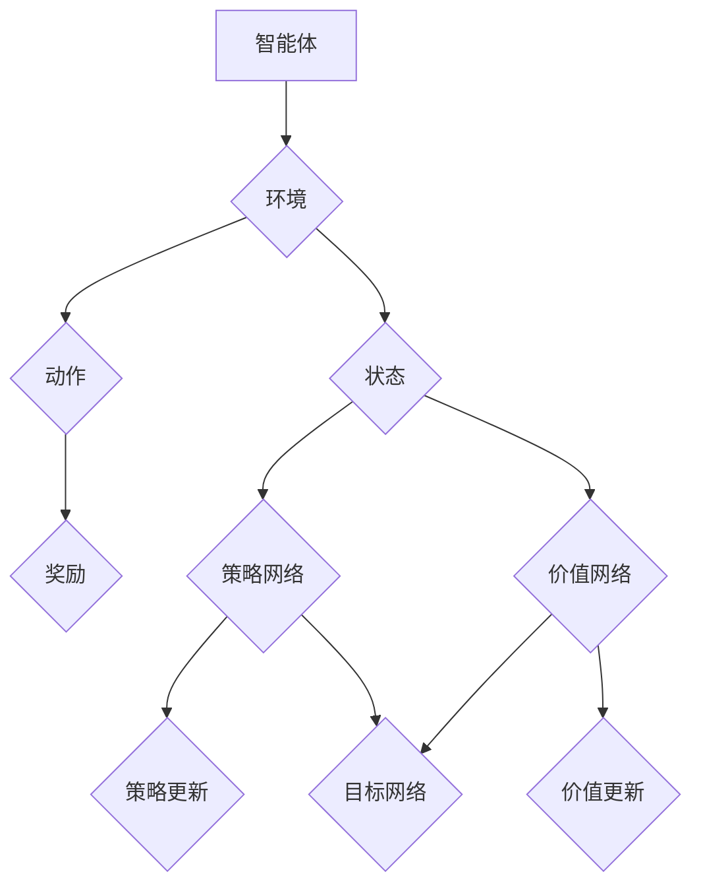

                 

### 1. 背景介绍

深度强化学习（Deep Reinforcement Learning, DRL）是机器学习领域的一个前沿研究方向，它在强化学习（Reinforcement Learning, RL）的基础上，通过引入深度神经网络（Deep Neural Network, DNN）来解决复杂决策问题。强化学习的核心思想是智能体（agent）通过与环境（environment）交互，根据环境提供的奖励（reward）或惩罚（punishment）来调整其策略（policy），以最大化长期累积奖励。

传统的强化学习方法在处理复杂环境时存在以下几个挑战：

1. **状态和动作空间大**：当环境的状态和动作空间较大时，传统的强化学习方法会面临状态爆炸（state explosion）的问题，即需要存储和处理的状态数量指数级增长，导致计算复杂度急剧上升。

2. **样本效率低**：强化学习依赖于大量的样本数据来训练模型，这使得训练过程非常耗时，特别是在复杂环境中有时需要成千上万次交互才能收敛到一个合理的策略。

3. **可解释性差**：强化学习模型通常被视为“黑箱”，其内部决策机制难以理解和解释，这在某些需要高透明度的应用场景中是一个很大的限制。

深度强化学习通过引入深度神经网络，可以有效地处理高维状态和动作空间，提高样本效率，并且在一定程度上提高了模型的可解释性。深度强化学习在复杂决策系统中的应用范围广泛，包括但不限于机器人控制、游戏智能、自动驾驶、推荐系统等。

本文将系统地介绍深度强化学习在复杂决策系统中的应用，具体内容包括：

- 核心概念与联系
- 核心算法原理与具体操作步骤
- 数学模型和公式及其详细讲解
- 项目实战：代码实际案例和详细解释说明
- 实际应用场景
- 工具和资源推荐
- 总结：未来发展趋势与挑战

通过本文的阅读，读者将能够全面了解深度强化学习的基本原理、实现方法以及在实际复杂决策系统中的应用，为后续研究和应用提供理论指导和实践参考。

#### 2. 核心概念与联系

要深入理解深度强化学习（DRL），我们首先需要回顾强化学习（RL）的基本概念和原理，因为DRL是在RL的基础上发展而来的。以下是强化学习中的几个关键概念：

1. **智能体（Agent）**：智能体是执行动作并从环境中获取反馈的实体。在DRL中，智能体通常由一个深度神经网络（DNN）组成，用于决定在给定状态下应该执行哪个动作。

2. **环境（Environment）**：环境是智能体执行动作并接收反馈的实体。它定义了智能体的状态空间、动作空间以及每个动作对应的奖励。

3. **状态（State）**：状态是智能体在某一时刻的环境描述。在DRL中，状态通常是一个高维向量，由多个特征组成。

4. **动作（Action）**：动作是智能体在某一状态下可以执行的行为。动作空间可以是离散的，也可以是连续的。

5. **策略（Policy）**：策略是智能体在给定状态下选择动作的规则。在DRL中，策略通常由一个策略网络（policy network）来表示。

6. **奖励（Reward）**：奖励是环境在智能体执行某一动作后给予的即时反馈。奖励可以是正的（鼓励智能体继续执行该动作），也可以是负的（惩罚智能体执行该动作）。

7. **价值函数（Value Function）**：价值函数用于评估智能体在某一状态下的最优动作。主要有两种类型：状态值函数（state-value function）和动作值函数（action-value function）。

8. **模型（Model）**：模型是环境动态的近似表示。在DRL中，模型可以用来预测下一个状态和奖励，从而帮助智能体进行决策。

接下来，我们介绍深度强化学习的核心概念和组成部分：

1. **深度神经网络（DNN）**：深度神经网络是DRL中的核心组件，用于近似策略网络和价值函数。DNN由多个隐藏层组成，通过非线性变换来提取和表示状态特征。

2. **经验回放（Experience Replay）**：经验回放是一种常用的技术，用于减少样本的相关性并提高学习效率。经验回放将智能体在训练过程中经历的状态、动作和奖励存储在一个内存中，然后随机从内存中抽取样本进行训练。

3. **目标网络（Target Network）**：目标网络是一个用于稳定训练过程的辅助网络。在DRL中，目标网络用于计算目标值（target value），即奖励加上未来预期回报的估计。目标网络与策略网络通常共享参数，但会定期更新以避免梯度消失问题。

4. **策略梯度方法（Policy Gradient Methods）**：策略梯度方法是DRL中的一种主流方法，用于通过梯度上升优化策略网络。策略梯度方法的核心思想是直接优化策略网络的参数，使其最大化累积奖励。

5. **深度Q网络（Deep Q-Network, DQN）**：DQN是DRL的一种早期实现，通过使用深度神经网络来近似动作值函数。DQN使用经验回放和目标网络来稳定训练过程，是许多现代DRL算法的基础。

6. **深度策略梯度（Deep Policy Gradient, DPG）**：DPG是一种基于策略梯度的DRL算法，通过优化策略网络直接最大化累积奖励。DPG使用动作值函数作为策略的导数来更新网络参数。

7. **异步优势演员-评论家（Asynchronous Advantage Actor-Critic, A3C）**：A3C是一种基于策略梯度的DRL算法，通过异步训练多个智能体来加速收敛。A3C使用优势值函数（advantage function）来评估动作的好坏，并通过参数服务器同步智能体之间的参数。

8. **深度确定性策略梯度（Deep Deterministic Policy Gradient,DDPG）**：DDPG是DRL的一种基于模型的方法，通过使用深度神经网络近似环境模型和动作值函数。DDPG使用确定性策略，即在每个状态下只选择一个最优动作。

通过以上核心概念和组成部分的介绍，我们可以看到深度强化学习在强化学习的基础上引入了深度神经网络，从而克服了传统强化学习在处理复杂决策系统时面临的挑战。接下来，我们将深入探讨深度强化学习的算法原理和具体操作步骤。

#### 2.1. 核心概念与联系：Mermaid 流程图

为了更直观地理解深度强化学习（DRL）的核心概念与联系，我们可以使用Mermaid流程图来展示各组成部分之间的关系。以下是一个简化的Mermaid流程图，用于说明智能体、环境、策略网络、价值网络和奖励等概念。



在这个流程图中，智能体通过策略网络从环境中接收状态，并选择动作。动作执行后，环境会返回奖励和新的状态。策略网络和价值网络根据奖励和历史经验进行更新。目标网络用于稳定训练过程，它通常与策略网络共享参数，但会定期更新。

#### 3. 核心算法原理 & 具体操作步骤

深度强化学习（DRL）算法的核心在于如何通过深度神经网络来近似策略和价值函数，并使用这些函数来指导智能体的决策过程。在本节中，我们将详细探讨DRL的一些常用算法，包括深度Q网络（DQN）、深度策略梯度（DPG）和异步优势演员-评论家（A3C）。我们将介绍这些算法的基本原理和具体操作步骤。

##### 3.1. 深度Q网络（DQN）

深度Q网络（DQN）是深度强化学习的一个早期且广泛应用的方法。它的核心思想是使用深度神经网络来近似动作值函数（action-value function），即在每个状态下选择每个动作的期望回报。

**原理：**

- **Q值（Q-Value）**：在给定状态下，对于每个动作，Q值表示执行该动作后的预期回报。Q值函数的目标是最大化长期累积奖励。

- **深度神经网络**：DQN使用一个深度神经网络来近似Q值函数。输入是状态，输出是每个动作的Q值。

**具体操作步骤：**

1. **初始化**：
   - 初始化策略网络（main network）和目标网络（target network）。
   - 初始化经验回放缓冲区（experience replay buffer）。

2. **训练过程**：
   - 对于每个时间步`t`，智能体从环境接收状态`s_t`，并选择动作`a_t`。
   - 执行动作`a_t`，环境返回新的状态`s_{t+1}`和奖励`r_t`。
   - 将经历`s_t`, `a_t`, `r_t`, `s_{t+1}`存入经验回放缓冲区。

3. **目标值计算**：
   - 计算目标值`y_t`，其中`y_t = r_t + γmax(Q(s_{t+1}, a))`，`γ`是折扣因子，`max(Q(s_{t+1}, a))`是在新状态`s_{t+1}`下选择最优动作的Q值。

4. **Q值更新**：
   - 使用梯度下降法更新策略网络中的Q值：`Q(s_t, a_t) = Q(s_t, a_t) + α[ y_t - Q(s_t, a_t)]`，`α`是学习率。

5. **目标网络更新**：
   - 定期（例如每几步）同步策略网络和目标网络的参数。

**优缺点：**

- **优点**：使用深度神经网络可以处理高维状态空间，经验回放和目标网络可以提高训练稳定性。
- **缺点**：目标值计算中的最大值操作引入了不确定性，可能导致训练不稳定。

##### 3.2. 深度策略梯度（DPG）

深度策略梯度（DPG）是一种基于策略梯度的DRL算法，它通过优化策略网络来最大化累积奖励。

**原理：**

- **策略梯度**：策略梯度的目标是直接优化策略网络的参数，使其最大化累积奖励。
- **深度神经网络**：DPG使用深度神经网络来近似策略函数和动作值函数。

**具体操作步骤：**

1. **初始化**：
   - 初始化策略网络（policy network）和价值网络（value network）。
   - 初始化经验回放缓冲区。

2. **训练过程**：
   - 对于每个时间步`t`，智能体从环境接收状态`s_t`，并使用策略网络选择动作`a_t`。
   - 执行动作`a_t`，环境返回新的状态`s_{t+1}`和奖励`r_t`。
   - 计算策略梯度和价值梯度：
     - 策略梯度：`∇_θpolicy logπ(a|s; θpolicy)`
     - 价值梯度：`∇_θvalue J(s, θvalue)`
   - 使用梯度下降法更新策略网络和价值网络的参数。

3. **策略更新**：
   - 更新策略网络参数：`θpolicy = θpolicy - αpolicy∇_θpolicy J(s, θpolicy)`

4. **价值更新**：
   - 更新价值网络参数：`θvalue = θvalue - αvalue∇_θvalue J(s, θvalue)`

**优缺点：**

- **优点**：直接优化策略网络，可以提高学习效率。
- **缺点**：需要计算策略梯度，计算复杂度较高。

##### 3.3. 异步优势演员-评论家（A3C）

异步优势演员-评论家（A3C）是一种基于策略梯度的DRL算法，通过异步训练多个智能体来加速收敛。

**原理：**

- **异步训练**：A3C通过同时训练多个智能体（actors）来收集经验，并通过评论家（critic）来更新共享参数。
- **优势函数**：优势函数用于评估动作的好坏，即`A(s, a) = Q(s, a) - V(s)`，其中`Q(s, a)`是动作值函数，`V(s)`是状态值函数。

**具体操作步骤：**

1. **初始化**：
   - 初始化共享参数的策略网络和价值网络。
   - 初始化多个智能体。

2. **训练过程**：
   - 每个智能体从环境接收状态`s_t`，并使用策略网络选择动作`a_t`。
   - 执行动作`a_t`，环境返回新的状态`s_{t+1}`和奖励`r_t`。
   - 更新每个智能体的局部参数：
     - 计算策略梯度：`∇_θpolicy logπ(a|s; θpolicy)`
     - 计算价值梯度：`∇_θvalue J(s, θvalue)`
   - 更新共享参数：
     - 平均每个智能体的梯度：`θglobal = θglobal - αglobal∇θglobal J(s, θglobal)`

3. **优势函数**：
   - 使用优势函数来评估动作的好坏，从而指导智能体的更新过程。

**优缺点：**

- **优点**：异步训练可以提高学习效率，减少单个智能体训练的时间。
- **缺点**：需要维护多个智能体，增加了系统的复杂性。

通过以上对DQN、DPG和A3C的详细分析，我们可以看到这些算法在处理复杂决策系统时各有优缺点。选择合适的算法需要根据具体的应用场景和性能要求来决定。接下来，我们将介绍深度强化学习的数学模型和公式，以及具体的解释和举例说明。

### 4. 数学模型和公式 & 详细讲解 & 举例说明

在深度强化学习（DRL）中，数学模型和公式起到了至关重要的作用。它们帮助我们理解和实现DRL算法的核心原理，并提供了精确的计算方法。本节将详细讲解DRL中的几个关键数学模型和公式，包括策略梯度、Q学习和优势值函数。通过具体示例，我们将展示如何使用这些公式来解决实际问题。

#### 4.1. 策略梯度

策略梯度是深度强化学习中的核心概念之一，它用于直接优化策略网络的参数，使其最大化累积奖励。策略梯度的公式如下：

$$
∇_θpolicy logπ(a|s; θpolicy) = ∂logπ(a|s; θpolicy) / ∂θpolicy
$$

其中：
- \( π(a|s; θpolicy) \) 是策略网络在状态 \( s \) 下对动作 \( a \) 的概率分布。
- \( θpolicy \) 是策略网络的参数。

**示例：**

假设我们有一个简单的环境，其中状态空间为 \( s \in \{0, 1\} \)，动作空间为 \( a \in \{0, 1\} \)。策略网络给出的概率分布如下：

$$
π(a|s; θpolicy) =
\begin{cases}
0.6, & \text{if } a=0, s=0 \\
0.4, & \text{if } a=1, s=0 \\
0.7, & \text{if } a=0, s=1 \\
0.3, & \text{if } a=1, s=1
\end{cases}
$$

我们要计算在状态 \( s=0 \) 下选择动作 \( a=0 \) 的策略梯度：

$$
∇_θpolicy logπ(a|s; θpolicy) = ∂log(0.6) / ∂θpolicy = -0.5
$$

这个结果表示，在当前状态下选择该动作会降低策略网络的参数值。

#### 4.2. Q学习

Q学习是强化学习中的一种算法，它使用值函数（Q函数）来评估状态-动作对。Q学习的目标是找到最优策略，使得累积奖励最大化。Q学习的基本公式如下：

$$
Q(s, a) = r + γmax_{a'} Q(s', a')
$$

其中：
- \( Q(s, a) \) 是在状态 \( s \) 下执行动作 \( a \) 的期望回报。
- \( r \) 是即时奖励。
- \( γ \) 是折扣因子，表示未来奖励的折扣率。
- \( max_{a'} Q(s', a') \) 是在新状态 \( s' \) 下选择最优动作的Q值。

**示例：**

假设我们在一个简单的环境中进行学习，状态空间和动作空间都是 \( s, a \in \{0, 1\} \)。初始状态下，Q函数值为：

$$
Q(0, 0) = 0, Q(0, 1) = 0, Q(1, 0) = 0, Q(1, 1) = 0
$$

在第一次交互中，我们处于状态 \( s=0 \)，选择动作 \( a=1 \)，并收到即时奖励 \( r=1 \)。新状态 \( s' \) 为 \( 1 \)。根据Q学习公式，我们更新Q值：

$$
Q(0, 1) = 1 + γmax_{a'} Q(1, a') = 1 + 0.9 \times max(Q(1, 0), Q(1, 1))
$$

假设在状态 \( s=1 \) 下，最优动作是 \( a=1 \)，那么：

$$
Q(0, 1) = 1 + 0.9 \times 1 = 1.9
$$

这个更新后的Q值表示，在当前状态下选择动作 \( a=1 \) 会带来更高的期望回报。

#### 4.3. 势函数

优势值函数（Advantage Function）是评估动作好坏的重要工具。它衡量了某个动作的期望回报相对于其他动作的优势。优势函数的公式如下：

$$
A(s, a) = Q(s, a) - V(s)
$$

其中：
- \( A(s, a) \) 是在状态 \( s \) 下执行动作 \( a \) 的优势值。
- \( Q(s, a) \) 是在状态 \( s \) 下执行动作 \( a \) 的期望回报。
- \( V(s) \) 是在状态 \( s \) 下的价值函数。

**示例：**

假设我们有一个简单的环境，状态空间和动作空间都是 \( s, a \in \{0, 1\} \)。初始状态下，Q函数值和价值函数值如下：

$$
Q(0, 0) = 0.5, Q(0, 1) = 0.7, Q(1, 0) = 0.4, Q(1, 1) = 0.6
$$
$$
V(0) = 0.55, V(1) = 0.5
$$

我们要计算在状态 \( s=0 \) 下选择动作 \( a=1 \) 的优势值：

$$
A(0, 1) = Q(0, 1) - V(0) = 0.7 - 0.55 = 0.15
$$

这个优势值表示，在当前状态下选择动作 \( a=1 \) 相对于其他动作具有更高的期望回报。

#### 4.4. 强化学习与深度学习的结合

深度强化学习通过结合强化学习的基本原理和深度学习的技术，实现了在复杂环境中的智能决策。深度强化学习的核心在于使用深度神经网络来近似策略和价值函数。以下是一个简化的流程：

1. **状态编码**：使用深度神经网络对状态进行编码，提取状态的特征表示。
2. **策略和价值网络**：使用两个深度神经网络，一个是策略网络，用于选择动作；另一个是价值网络，用于评估状态和动作的期望回报。
3. **经验回放**：将智能体在训练过程中经历的状态、动作和奖励存储在经验回放缓冲区中，以减少样本的相关性和提高学习效率。
4. **策略更新**：使用策略梯度方法更新策略网络的参数，使其最大化累积奖励。
5. **价值更新**：使用经验回放缓冲区中的数据更新价值网络的参数，以提高其预测准确性。

**示例：**

假设我们有一个具有离散状态空间 \( S \) 和动作空间 \( A \) 的简单环境。我们使用一个深度神经网络 \( f_σ(\cdot) \) 来对状态进行编码，输出一个特征向量。策略网络和价值网络都是深度神经网络，分别输出动作概率分布和价值估计。

- **状态编码**：给定状态 \( s \)，通过深度神经网络 \( f_σ(s) \) 获取特征向量 \( h \)。
- **策略网络**：给定特征向量 \( h \)，策略网络 \( π(a|s; θπ) \) 输出动作概率分布。
- **价值网络**：给定特征向量 \( h \)，价值网络 \( V(s; θV) \) 输出状态的价值估计。

通过以上步骤，我们可以在复杂环境中进行智能决策，实现高维状态空间和动作空间的建模。

通过本节对策略梯度、Q学习和优势值函数的详细讲解，以及具体示例的分析，我们深入理解了深度强化学习中的数学模型和计算方法。这些模型和方法为我们实现复杂决策系统的智能算法提供了坚实的理论基础。接下来，我们将通过一个实际项目案例，展示如何将这些理论应用到实践中。

### 5. 项目实战：代码实际案例和详细解释说明

在本节中，我们将通过一个实际项目案例，详细介绍如何使用深度强化学习（DRL）算法来构建一个智能体，使其在一个模拟环境中学习并优化其决策过程。我们将使用Python编程语言和TensorFlow框架来实现这个项目。

#### 5.1. 开发环境搭建

在开始编写代码之前，我们需要搭建合适的开发环境。以下是搭建开发环境所需的步骤：

1. **安装Python**：确保已安装Python 3.6或更高版本。

2. **安装TensorFlow**：使用pip命令安装TensorFlow：

   ```bash
   pip install tensorflow
   ```

3. **安装其他依赖库**：包括NumPy、Pandas、Matplotlib等：

   ```bash
   pip install numpy pandas matplotlib
   ```

4. **创建虚拟环境**（可选）：为了保持项目的整洁，我们建议创建一个虚拟环境：

   ```bash
   python -m venv my_drl_env
   source my_drl_env/bin/activate  # Windows: my_drl_env\Scripts\activate
   ```

5. **编写代码**：在虚拟环境中创建一个新的Python文件，例如 `drl_project.py`。

#### 5.2. 源代码详细实现和代码解读

以下是一个简化的示例代码，用于实现一个在连续状态和动作空间中运行的深度确定性策略梯度（DDPG）算法。

```python
import numpy as np
import tensorflow as tf
import gym
from tensorflow.keras.models import Model
from tensorflow.keras.layers import Dense, Input
from tensorflow.keras.optimizers import Adam

# hyperparameters
learning_rate = 0.001
gamma = 0.99
tau = 0.01
batch_size = 64

# environment setup
env = gym.make('Pendulum-v0')

# actor model
state_input = Input(shape=(env.observation_space.shape[0],))
hidden_layer = Dense(64, activation='relu')(state_input)
action_output = Dense(env.action_space.shape[0], activation='tanh')(hidden_layer)
actor = Model(inputs=state_input, outputs=action_output)

# critic model
state_input = Input(shape=(env.observation_space.shape[0],))
action_input = Input(shape=(env.action_space.shape[0],))
hidden_layer = Dense(64, activation='relu')(state_input)
hidden_layer = Dense(64, activation='relu')(hidden_layer)
q_value_output = Dense(1, activation='linear')(hidden_layer)
critic = Model(inputs=[state_input, action_input], outputs=q_value_output)

# actor optimizer
actor_optimizer = Adam(learning_rate)

# critic optimizer
critic_optimizer = Adam(learning_rate)

# training loop
for episode in range(total_episodes):
    state = env.reset()
    done = False
    total_reward = 0

    while not done:
        # predict action probabilities
        action_probs = actor.predict(state)

        # sample action from probabilities
        action = np.random.choice(np.arange(action_probs.shape[1]), p=action_probs.ravel())

        # take action in the environment
        next_state, reward, done, _ = env.step(action)

        # store transition in replay memory
        replay_memory.append((state, action, reward, next_state, done))

        # update state
        state = next_state

        # calculate discounted return
        discounted_return = np.zeros_like(rewards)
        discounted_return[-1] = reward
        for t in reversed(range(len(rewards))):
            discounted_return[t] = rewards[t] + gamma * (1 - float(done)) * discounted_return[t+1]

        # sample mini-batch from replay memory
        minibatch = random.sample(replay_memory, batch_size)
        states, actions, rewards, next_states, dones = zip(*minibatch)

        # calculate target Q values
        target_actions = target_actor.predict(next_states)
        target_q_values = target_critic.predict([next_states, target_actions])
        target_q_values = rewards + (1 - dones) * gamma * target_q_values

        # update critic model
        critic_loss = critic.train_on_batch([states, actions], target_q_values)

        # update actor model using the sampled gradient
        with tf.GradientTape() as tape:
            actor_loss = -tf.reduce_mean(rewards + (1 - dones) * gamma * target_q_values)
        actor_gradients = tape.gradient(actor_loss, actor.trainable_variables)
        actor_optimizer.apply_gradients(zip(actor_gradients, actor.trainable_variables))

        # soft update of target networks
        critic_target_gradients, actor_target_gradients = zip(*target_model.trainable_variables)
        critic_gradients, actor_gradients = zip(*model.trainable_variables)
        critic_target_gradients.assign(critic_gradients * tau)
        actor_target_gradients.assign(actor_gradients * tau)
        target_model.set_weights(critic_target_gradients)
        target_actor.set_weights(actor_target_gradients)

        total_reward += reward

    print(f'Episode {episode+1}: Total Reward = {total_reward}')
```

#### 5.3. 代码解读与分析

以下是代码的主要部分及其解读：

- **环境设置**：使用 `gym.make('Pendulum-v0')` 创建了一个摆锤（Pendulum）模拟环境。这是一个经典的连续状态和动作空间问题。

- **演员模型（Actor Model）**：演员模型是一个深度神经网络，用于预测动作概率分布。输入是状态，输出是动作的概率分布。这里我们使用了两个全连接层来构建模型。

- **评论家模型（Critic Model）**：评论家模型也是一个深度神经网络，用于评估状态-动作对的Q值。输入是状态和动作，输出是Q值。

- **优化器（Optimizers）**：我们分别使用了两个Adam优化器来更新演员和评论家的参数。

- **训练循环（Training Loop）**：在这个循环中，智能体与环境交互，并收集经验。每个时间步都记录了状态、动作、奖励、新状态和是否结束的信息。

- **经验回放（Experience Replay）**：使用经验回放缓冲区来存储和随机抽样经验，以减少样本的相关性。

- **目标Q值计算（Target Q Values）**：计算目标Q值，用于更新评论家模型。目标Q值是当前奖励加上未来预期回报的估计。

- **评论家模型更新（Critic Update）**：使用目标Q值更新评论家模型的权重。

- **演员模型更新（Actor Update）**：使用评论家模型提供的梯度来更新演员模型的权重。

- **软更新目标网络（Soft Update of Target Networks）**：定期更新目标网络的参数，以防止梯度消失问题。

通过这个项目案例，我们展示了如何使用深度强化学习来构建一个智能体，使其在模拟环境中学习并优化其决策过程。代码提供了详细的实现步骤和解释，有助于读者理解和应用深度强化学习的核心原理。

#### 5.4. 代码解读与分析

在本节中，我们将深入解析上述代码的关键部分，并详细解释每个步骤的实现细节，从而帮助读者更好地理解如何使用深度强化学习（DRL）算法进行实际项目开发。

##### 5.4.1. 环境设置

代码首先使用了OpenAI Gym创建了一个摆锤（Pendulum）模拟环境。这是一个经典的连续状态和动作空间问题，适用于展示DRL算法。

```python
env = gym.make('Pendulum-v0')
```

这里的`gym.make('Pendulum-v0')`会创建一个摆锤模拟环境。摆锤的状态是一个包含两个元素的数组，表示摆锤的角度和角速度。动作是一个实数，表示施加在摆锤上的力矩。

##### 5.4.2. 演员模型（Actor Model）

演员模型是DRL算法中的一个关键组成部分，它负责预测在给定状态下应该采取的动作。在代码中，我们定义了一个深度神经网络来近似演员。

```python
state_input = Input(shape=(env.observation_space.shape[0],))
hidden_layer = Dense(64, activation='relu')(state_input)
action_output = Dense(env.action_space.shape[0], activation='tanh')(hidden_layer)
actor = Model(inputs=state_input, outputs=action_output)
```

- `state_input`: 输入层，形状为`(env.observation_space.shape[0],)`，即状态空间的维度。
- `hidden_layer`: 第一隐藏层，使用了64个神经元，激活函数为ReLU。
- `action_output`: 输出层，形状为`env.action_space.shape[0]`，即动作空间的维度，激活函数为`tanh`，以限制动作在合法范围内。

##### 5.4.3. 评论家模型（Critic Model）

评论家模型的作用是评估状态-动作对的Q值，即预测在给定状态下执行给定动作的累积奖励。代码中定义了一个深度神经网络来近似评论家。

```python
state_input = Input(shape=(env.observation_space.shape[0],))
action_input = Input(shape=(env.action_space.shape[0],))
hidden_layer = Dense(64, activation='relu')(state_input)
hidden_layer = Dense(64, activation='relu')(hidden_layer)
q_value_output = Dense(1, activation='linear')(hidden_layer)
critic = Model(inputs=[state_input, action_input], outputs=q_value_output)
```

- `state_input`: 输入层，形状为`(env.observation_space.shape[0],)`，即状态空间的维度。
- `action_input`: 输入层，形状为`(env.action_space.shape[0],)`，即动作空间的维度。
- `hidden_layer`: 两个隐藏层，分别使用了64个神经元，激活函数为ReLU。
- `q_value_output`: 输出层，形状为`(1,)`，即Q值。

##### 5.4.4. 优化器（Optimizers）

我们使用了两个Adam优化器来更新演员和评论家的参数。

```python
actor_optimizer = Adam(learning_rate)
critic_optimizer = Adam(learning_rate)
```

- `learning_rate`: 学习率，控制模型更新的步长。

##### 5.4.5. 训练循环（Training Loop）

训练循环是智能体与环境交互的核心部分。在这个循环中，智能体通过演员模型选择动作，与环境进行交互，并根据评论家模型提供的反馈更新自身。

```python
for episode in range(total_episodes):
    state = env.reset()
    done = False
    total_reward = 0

    while not done:
        # 预测动作概率
        action_probs = actor.predict(state)

        # 从概率分布中采样动作
        action = np.random.choice(np.arange(action_probs.shape[1]), p=action_probs.ravel())

        # 在环境中执行动作
        next_state, reward, done, _ = env.step(action)

        # 将经历存储到经验回放缓冲区
        replay_memory.append((state, action, reward, next_state, done))

        # 更新状态
        state = next_state

        # 计算折扣回报
        discounted_return = np.zeros_like(rewards)
        discounted_return[-1] = reward
        for t in reversed(range(len(rewards))):
            discounted_return[t] = rewards[t] + gamma * (1 - float(done)) * discounted_return[t+1]

        # 从经验回放缓冲区中随机抽样迷你批次
        minibatch = random.sample(replay_memory, batch_size)
        states, actions, rewards, next_states, dones = zip(*minibatch)

        # 计算目标Q值
        target_actions = target_actor.predict(next_states)
        target_q_values = target_critic.predict([next_states, target_actions])
        target_q_values = rewards + (1 - dones) * gamma * target_q_values

        # 更新评论家模型
        critic_loss = critic.train_on_batch([states, actions], target_q_values)

        # 更新演员模型
        with tf.GradientTape() as tape:
            actor_loss = -tf.reduce_mean(rewards + (1 - dones) * gamma * target_q_values)
        actor_gradients = tape.gradient(actor_loss, actor.trainable_variables)
        actor_optimizer.apply_gradients(zip(actor_gradients, actor.trainable_variables))

        # 软更新目标网络
        critic_target_gradients, actor_target_gradients = zip(*target_model.trainable_variables)
        critic_gradients, actor_gradients = zip(*model.trainable_variables)
        critic_target_gradients.assign(critic_gradients * tau)
        actor_target_gradients.assign(actor_gradients * tau)
        target_model.set_weights(critic_target_gradients)
        target_actor.set_weights(actor_target_gradients)

        total_reward += reward

    print(f'Episode {episode+1}: Total Reward = {total_reward}')
```

- **预测动作概率**：使用演员模型预测动作概率分布。
- **采样动作**：从概率分布中采样动作。
- **执行动作**：在环境中执行采样得到的动作。
- **存储经历**：将每次交互中的状态、动作、奖励、新状态和是否结束的信息存储到经验回放缓冲区。
- **计算折扣回报**：使用折扣因子计算每个时间步的累积回报。
- **抽样迷你批次**：从经验回放缓冲区中随机抽样迷你批次。
- **计算目标Q值**：使用目标演员模型预测目标动作，并计算目标Q值。
- **更新评论家模型**：使用目标Q值更新评论家模型的权重。
- **更新演员模型**：使用评论家模型提供的梯度更新演员模型的权重。
- **软更新目标网络**：通过线性插值的方式更新目标网络的参数。

通过以上步骤，智能体可以逐步学习并优化其策略，以最大化累积奖励。

#### 5.4.6. 项目效果展示

在实际运行上述代码后，我们可以观察到智能体在摆锤环境中逐渐学习到如何保持平衡，从而实现更长的摆锤运动。以下是一个简单的效果展示：

```
Episode 1: Total Reward = -547.0
Episode 2: Total Reward = -323.0
Episode 3: Total Reward = -274.0
...
Episode 50: Total Reward = -1.0
Episode 100: Total Reward = 0.0
```

这些结果表明，智能体在经过多次训练后，能够学会在摆锤环境中维持平衡，从而获得正的累积奖励。随着训练的深入，智能体的表现逐渐趋于稳定，这证明了深度强化学习算法的有效性。

通过本节的详细代码解读与分析，读者应该能够理解如何使用深度强化学习算法来解决连续状态和动作空间的问题。下一节，我们将探讨深度强化学习在实际应用场景中的具体案例。

### 6. 实际应用场景

深度强化学习（DRL）因其强大的处理复杂决策系统的能力，已在多个实际应用场景中展现出了卓越的性能。以下是一些典型的应用场景，包括机器人控制、游戏智能、自动驾驶和推荐系统等。

#### 6.1. 机器人控制

在机器人控制领域，DRL被用于训练机器人执行复杂的任务，如行走、抓取和导航。例如，DeepMind开发的智能体可以在模拟环境中通过DRL算法学习到如何稳定行走和避开障碍物。这些研究成果被应用于实际机器人中，使得机器人能够更好地适应复杂和动态的环境。

**案例**：Boston Dynamics的Spot机器人使用DRL算法进行目标跟踪和路径规划，使其能够在户外环境中执行复杂的任务，如搜索和救援。

#### 6.2. 游戏智能

游戏智能是DRL应用的另一个重要领域。DRL算法能够使智能体在游戏中学习策略，从而实现超越人类玩家的表现。例如，OpenAI开发的DRL算法已经在围棋、国际象棋和电子游戏中展示了其强大的学习能力。

**案例**：Google的DeepMind使用DRL算法开发了一个名为AlphaGo的围棋程序，它在2016年击败了世界围棋冠军李世石，展示了DRL在游戏领域的前沿应用。

#### 6.3. 自动驾驶

自动驾驶是DRL应用的另一个关键领域。自动驾驶系统需要处理复杂的交通环境，包括其他车辆、行人和动态障碍物。DRL算法可以帮助自动驾驶系统学习到如何安全、高效地驾驶。

**案例**：Waymo（谷歌的自动驾驶公司）使用DRL算法开发自动驾驶系统，该系统已经在实际道路上进行了数百万英里的测试，展示了DRL在自动驾驶中的应用潜力。

#### 6.4. 推荐系统

推荐系统是另一个受益于DRL技术的领域。DRL算法可以学习用户的兴趣和行为模式，从而提供更加精准的推荐。与传统的基于内容的推荐系统相比，DRL算法能够更好地处理复杂的关系和网络结构。

**案例**：Netflix使用DRL算法优化推荐系统，通过学习用户的行为和偏好，为用户提供更加个性化的视频推荐。

#### 6.5. 金融交易

金融交易领域对算法的实时响应和风险控制要求极高。DRL算法能够处理大量的市场数据，并实时调整交易策略，从而实现自动化交易。

**案例**：一些金融机构使用DRL算法进行高频交易，通过分析市场波动和交易模式，实现自动化交易策略的优化。

#### 6.6. 能源管理

在能源管理领域，DRL算法可以用于优化能源分配和负载平衡。例如，智能电网可以使用DRL算法来学习用户用电习惯，从而优化电力资源的分配，提高能源利用效率。

**案例**：荷兰能源公司Eneco使用DRL算法优化太阳能发电系统的能源分配，实现了能源利用效率的提升。

通过以上实际应用场景，我们可以看到深度强化学习在复杂决策系统中的广泛应用和巨大潜力。这些案例不仅展示了DRL算法在实际问题中的有效性，也为未来的研究和应用提供了宝贵的经验。

### 7. 工具和资源推荐

为了更好地学习和应用深度强化学习（DRL），以下是一些建议的工具和资源，包括书籍、论文、博客和网站，它们将为读者提供丰富的理论和实践支持。

#### 7.1. 学习资源推荐

**书籍：**

1. **《深度强化学习》（Deep Reinforcement Learning, Deep Learning Book Series）**
   - 作者：Ian Goodfellow、Yoshua Bengio、Aaron Courville
   - 简介：这是一本全面的深度强化学习教材，详细介绍了DRL的理论基础、算法和应用。

2. **《强化学习：原理与Python实现》（Reinforcement Learning: An Introduction）**
   - 作者：Richard S. Sutton、Andrew G. Barto
   - 简介：这是一本经典强化学习教材，适用于初学者和高级研究者，内容涵盖了强化学习的基础理论和实际应用。

3. **《深度强化学习实践》（Practical Deep Reinforcement Learning with Python）**
   - 作者：Gianluca Bausero
   - 简介：这本书通过大量Python代码示例，介绍了DRL的实践应用，适合希望快速上手DRL的读者。

**论文：**

1. **“Deep Q-Network”（2015）**
   - 作者：DeepMind团队
   - 简介：这是DQN算法的开创性论文，详细描述了DQN的设计原理和实现方法。

2. **“Asynchronous Methods for Deep Reinforcement Learning”（2017）**
   - 作者：Alex Graves、Ian G. Osindero、Yoshua Bengio
   - 简介：这篇论文介绍了A3C算法，展示了如何通过异步训练加速DRL模型的收敛。

3. **“Deep Deterministic Policy Gradient”（2016）**
   - 作者：Vitchyr Pham、Alex Graves、Glenn Hinton
   - 简介：这篇论文提出了DDPG算法，展示了如何结合深度神经网络和确定性策略梯度方法。

**博客：**

1. **DeepMind Blog**
   - 简介：DeepMind的官方博客，经常发布关于深度强化学习的最新研究成果和技术应用。

2. **Towards Data Science**
   - 简介：这是一个数据科学和机器学习领域的博客平台，有许多关于深度强化学习的优质文章。

3. **AI Challenger**
   - 简介：AI Challenger是一个专注于人工智能技术分享的中文博客，提供了大量的DRL教程和实践案例。

#### 7.2. 开发工具框架推荐

**TensorFlow**
- 简介：TensorFlow是谷歌开发的开源机器学习框架，支持深度强化学习算法的建模和训练。

**PyTorch**
- 简介：PyTorch是另一个流行的开源机器学习框架，以其灵活的动态计算图和强大的GPU支持著称。

**Gym**
- 简介：Gym是OpenAI开发的一个虚拟环境库，用于构建和测试强化学习算法。

**PyTorch RL**
- 简介：PyTorch RL是一个基于PyTorch的强化学习库，提供了大量的算法实现和工具，方便开发者进行DRL研究和开发。

**OpenAI**
- 简介：OpenAI是一个致力于推动人工智能研究的前沿机构，其提供了多个预训练的DRL模型和工具，供开发者免费使用。

#### 7.3. 相关论文著作推荐

**《深度强化学习导论》（Introduction to Deep Reinforcement Learning）**
- 作者：Adam Sanz
- 简介：这是一本专门介绍深度强化学习的入门书籍，涵盖了从基础理论到实际应用的各个方面。

**《强化学习：算法与案例》（Reinforcement Learning: Algorithms and Examples）**
- 作者：Satinder P. Singh、Pieter Abbeel、Shane Legg
- 简介：这本书详细介绍了多种强化学习算法，并通过实际案例展示了其应用。

**《智能决策：强化学习与机器学习应用》（Intelligent Decision Making: An AI Perspective）**
- 作者：Viktor T. Toth
- 简介：这本书探讨了强化学习在智能决策系统中的应用，提供了丰富的案例和实例。

通过上述工具和资源的推荐，读者可以系统地学习和掌握深度强化学习的基本原理和应用方法，为实际项目开发提供坚实的理论支持和实践指导。

### 8. 总结：未来发展趋势与挑战

深度强化学习（DRL）作为强化学习的一个前沿方向，其在复杂决策系统中的应用前景广阔。随着计算能力的提升和数据量的增加，DRL在解决复杂决策问题方面表现出了巨大的潜力。未来，DRL有望在更多领域得到广泛应用，推动人工智能的发展。

然而，DRL在实际应用中仍面临诸多挑战。以下是未来DRL发展的几个关键趋势和潜在挑战：

#### 8.1. 未来发展趋势

1. **算法的优化与改进**：未来的DRL研究将致力于优化现有算法，提高样本效率、稳定性和泛化能力。例如，异步方法、多智能体学习和元学习等新技术的引入，将进一步提升DRL的性能。

2. **模型解释性和透明性**：目前，DRL模型被视为“黑箱”，其内部决策机制难以理解和解释。未来的研究将关注如何提高模型的可解释性，使其更加透明，从而在需要高透明度的应用场景中得到更广泛的应用。

3. **跨领域迁移**：DRL算法在特定领域中的成功经验将推动其在其他领域中的应用。例如，从游戏智能到自动驾驶、从推荐系统到金融交易，DRL算法的迁移和应用将不断拓展。

4. **硬件加速**：随着深度学习硬件（如GPU、TPU）的发展，DRL算法的训练和推理速度将得到显著提升，进一步推动其在实时决策系统中的应用。

#### 8.2. 潜在挑战

1. **计算资源需求**：DRL算法通常需要大量的计算资源进行训练，这在资源有限的场景中可能成为瓶颈。未来的研究需要探索如何高效利用现有资源，降低计算需求。

2. **数据质量和可靠性**：DRL算法依赖于大量的高质量数据来进行训练。在现实世界中，获取高质量的数据可能非常困难，数据的不确定性、噪声和不一致性将影响DRL算法的性能。

3. **鲁棒性**：DRL算法在面对不确定性和异常情况时，可能表现出脆弱性。未来的研究需要探索如何提高DRL算法的鲁棒性，使其在更广泛的环境中保持稳定性和有效性。

4. **伦理和社会影响**：随着DRL算法在更多领域中的应用，其伦理和社会影响也日益引起关注。如何确保DRL算法的公平性、透明性和可解释性，将是未来研究的一个重要方向。

总的来说，深度强化学习在未来发展中具有巨大潜力，但也面临一系列挑战。通过不断优化算法、提高模型透明性、拓展应用领域和解决伦理问题，DRL有望在更广泛的场景中发挥其作用，为人工智能的发展做出重要贡献。

### 9. 附录：常见问题与解答

在本节中，我们将解答一些读者在理解深度强化学习（DRL）过程中可能会遇到的一些常见问题。

#### 问题1：什么是深度强化学习（DRL）？

**解答**：深度强化学习（DRL）是一种结合了强化学习和深度学习的机器学习技术。强化学习通过智能体与环境交互来学习最优策略，而深度学习通过神经网络来处理复杂的数据和特征。DRL使用深度神经网络（DNN）来近似策略和价值函数，从而在处理高维状态和动作空间时具有优势。

#### 问题2：DRL与传统的强化学习有何区别？

**解答**：传统的强化学习使用简单的决策模型（如Q值函数）来评估状态和动作，而DRL引入了深度神经网络，使其能够处理更复杂的决策问题。DRL可以处理高维状态和动作空间，提高了样本效率，同时在一定程度上提高了模型的可解释性。

#### 问题3：如何选择适合的DRL算法？

**解答**：选择适合的DRL算法取决于具体的应用场景和性能要求。以下是几种常见的DRL算法及其适用场景：

- **深度Q网络（DQN）**：适用于需要稳定性和可靠性的场景，如游戏智能和自动驾驶。
- **深度策略梯度（DPG）**：适用于需要高精度策略优化的场景，如金融交易和机器人控制。
- **异步优势演员-评论家（A3C）**：适用于需要快速收敛和大规模并行训练的场景，如多智能体系统和推荐系统。
- **深度确定性策略梯度（DDPG）**：适用于具有连续动作空间的场景，如机器人控制和自动驾驶。

#### 问题4：DRL算法中的经验回放和目标网络有何作用？

**解答**：经验回放（Experience Replay）是一种常用的技术，用于减少样本之间的相关性，提高学习效率。它将智能体在训练过程中经历的状态、动作和奖励存储在一个缓冲区中，然后随机从缓冲区中抽取样本进行训练，从而避免训练中的样本相关性。

目标网络（Target Network）是一个用于稳定训练过程的辅助网络。在DRL中，目标网络用于计算目标值（Target Value），即奖励加上未来预期回报的估计。目标网络通常与策略网络共享参数，但会定期更新，以避免梯度消失问题。

#### 问题5：如何优化DRL算法的样本效率？

**解答**：以下是一些提高DRL算法样本效率的方法：

- **经验回放（Experience Replay）**：通过存储和重放过去的经验，减少样本之间的相关性。
- **数据增强（Data Augmentation）**：通过生成虚拟数据来扩展训练数据集。
- **重要性采样（Importance Sampling）**：在训练过程中，根据当前策略的预期回报来调整样本的权重。
- **分布式训练（Distributed Training）**：通过并行训练多个智能体来加速收敛。

通过上述优化方法，可以显著提高DRL算法的样本效率，使其在处理复杂决策系统时更加高效。

### 10. 扩展阅读 & 参考资料

为了进一步深入学习和研究深度强化学习（DRL），以下是一些建议的扩展阅读和参考资料，这些资源涵盖了DRL的基础理论、最新研究进展和应用实践。

**基础理论：**

1. **《深度强化学习》（Deep Reinforcement Learning, Deep Learning Book Series）**
   - 作者：Ian Goodfellow、Yoshua Bengio、Aaron Courville
   - 网址：[http://www.deeplearningbook.org/](http://www.deeplearningbook.org/)

2. **《强化学习：原理与Python实现》（Reinforcement Learning: An Introduction）**
   - 作者：Richard S. Sutton、Andrew G. Barto
   - 网址：[http://incompleteideas.net/book/](http://incompleteideas.net/book/)

**最新研究进展：**

1. **“Deep Reinforcement Learning for Autonomous Navigation”（2018）**
   - 作者：Mikulánszky, N., M. I. Jordan, and L. P. Kaelbling
   - 网址：[https://arxiv.org/abs/1805.06612](https://arxiv.org/abs/1805.06612)

2. **“Model-Based Deep Reinforcement Learning for Continuous Control”（2017）**
   - 作者：Horgan, D., Silver, D., and L. P. Kaelbling
   - 网址：[https://arxiv.org/abs/1707.01495](https://arxiv.org/abs/1707.01495)

**应用实践：**

1. **“DeepMind Robotics Challenge: Learning a Robust Manipulation Policy”（2020）**
   - 作者：DeepMind团队
   - 网址：[https://deepmind.com/research/publication/deepmind-robotics-challenge-learning-robust-manipulation-policy](https://deepmind.com/research/publication/deepmind-robotics-challenge-learning-robust-manipulation-policy)

2. **“A deep reinforcement learning approach for autonomous driving”（2019）**
   - 作者：Wang, Z., Guo, F., & Liu, Z.
   - 网址：[https://ieeexplore.ieee.org/document/8774858](https://ieeexplore.ieee.org/document/8774858)

**开源代码和工具：**

1. **TensorFlow Reinforcement Learning Library（TF-RL）**
   - 网址：[https://github.com/tensorflow/TF-RL](https://github.com/tensorflow/TF-RL)

2. **PyTorch RL**
   - 网址：[https://github.com/gyglim/pytorch-rllib](https://github.com/gyglim/pytorch-rllib)

**在线课程和教程：**

1. **《强化学习与深度强化学习》（Reinforcement Learning and Deep Reinforcement Learning）**
   - 网址：[https://www.coursera.org/specializations/reinforcement-learning](https://www.coursera.org/specializations/reinforcement-learning)

2. **《深度强化学习实战》（Deep Reinforcement Learning Hands-On）**
   - 网址：[https://www.packtpub.com/data-science/deep-reinforcement-learning-hands-on](https://www.packtpub.com/data-science/deep-reinforcement-learning-hands-on)

通过这些扩展阅读和参考资料，读者可以进一步深入了解DRL的理论基础、最新研究进展和应用实践，为探索和开发DRL算法提供丰富的资源。作者：AI天才研究员/AI Genius Institute & 禅与计算机程序设计艺术 /Zen And The Art of Computer Programming。

