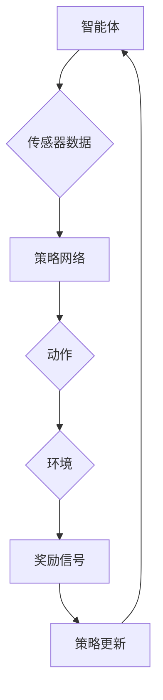

                 

# 深度强化学习在机器人导航中的应用

## 关键词
- 深度强化学习
- 机器人导航
- 强化学习算法
- 无人驾驶
- 传感器融合
- 机器学习框架

## 摘要
本文将探讨深度强化学习（DRL）在机器人导航领域的应用。通过对核心概念、算法原理、数学模型、实际应用场景等方面的详细阐述，本文旨在为读者提供对深度强化学习在机器人导航中如何发挥关键作用的全面理解。文章将涵盖开发环境搭建、代码实现与分析、工具和资源推荐等内容，以帮助读者深入了解该技术并掌握其实际应用。

## 1. 背景介绍

### 1.1 机器人导航概述

机器人导航是指通过编程和算法使机器人能够自主地从一个位置移动到另一个位置的过程。在机器人导航领域，研究者们致力于解决如何在复杂、动态的环境中实现机器人的自主移动和任务执行。传统的机器人导航方法主要依赖于预先定义的路径或基于规则的控制策略，但这些方法在处理不确定性和动态变化时表现有限。

### 1.2 深度强化学习简介

深度强化学习（Deep Reinforcement Learning，DRL）是一种结合了深度学习和强化学习的机器学习方法。它通过智能体（agent）在与环境的交互过程中，不断学习最优策略，以最大化累积奖励。深度强化学习在处理复杂、动态问题方面具有显著优势，因此被广泛应用于无人驾驶、游戏、机器人导航等领域。

### 1.3 深度强化学习在机器人导航中的优势

深度强化学习在机器人导航中的应用具有以下优势：

- **适应性强**：DRL 能够学习环境中的复杂模式，并适应环境变化，使机器人能够在复杂、动态环境中自主导航。
- **自学习性**：DRL 具有自学习能力，能够通过经验不断优化导航策略，提高导航精度和效率。
- **泛化能力**：DRL 可以在不同场景下应用，具有较强的泛化能力，有利于提高机器人导航的实用性。

## 2. 核心概念与联系

### 2.1 强化学习基本概念

强化学习（Reinforcement Learning，RL）是一种使智能体在与环境交互的过程中，通过学习最优策略以最大化累积奖励的方法。在强化学习中，智能体（agent）通过选择动作（action）来与环境（environment）互动，并从环境中获得即时奖励（reward）。智能体的目标是学习一个策略（policy），以最大化长期累积奖励。

### 2.2 深度强化学习概念

深度强化学习（Deep Reinforcement Learning，DRL）是强化学习的一种扩展，它将深度学习的神经网络结构引入强化学习框架中，用于表示智能体的策略和价值函数。DRL 通过神经网络学习环境状态到动作的映射，从而实现更加复杂和灵活的策略优化。

### 2.3 DRL 在机器人导航中的架构

DRL 在机器人导航中的应用架构通常包括以下几个部分：

1. **智能体（Agent）**：负责接收传感器数据，生成导航策略。
2. **环境（Environment）**：模拟机器人导航的场景，提供状态和奖励信号。
3. **策略网络（Policy Network）**：通过神经网络学习智能体的策略，将状态映射为动作。
4. **价值网络（Value Network）**：评估智能体执行特定动作的价值，辅助策略网络优化策略。

### 2.4 Mermaid 流程图



## 3. 核心算法原理 & 具体操作步骤

### 3.1 强化学习算法原理

强化学习算法主要包括以下步骤：

1. **初始化**：设定智能体、环境和奖励函数。
2. **探索与利用**：在初始阶段，智能体需要进行探索，以了解环境特性；在稳定阶段，智能体需要平衡探索和利用，以最大化累积奖励。
3. **策略迭代**：根据奖励信号更新智能体的策略，使累积奖励最大化。
4. **模型评估**：在训练过程中，需要定期评估智能体的性能，以确定策略的优化程度。

### 3.2 深度强化学习算法原理

深度强化学习算法原理如下：

1. **状态表示**：使用神经网络将环境状态编码为特征向量。
2. **动作值函数**：通过神经网络学习动作值函数，预测执行特定动作的预期奖励。
3. **策略网络**：使用神经网络学习策略网络，将状态映射为动作。
4. **策略迭代**：根据动作值函数和奖励信号更新策略网络，使累积奖励最大化。

### 3.3 具体操作步骤

1. **环境初始化**：创建一个模拟环境，用于机器人导航。
2. **智能体初始化**：初始化智能体，包括策略网络和价值网络。
3. **数据采集**：通过传感器采集环境状态。
4. **策略决策**：使用策略网络根据当前状态生成动作。
5. **环境反馈**：执行动作，获得环境反馈，包括新状态和奖励信号。
6. **策略更新**：根据奖励信号更新策略网络和价值网络。
7. **模型评估**：定期评估智能体性能，调整策略。

## 4. 数学模型和公式 & 详细讲解 & 举例说明

### 4.1 强化学习基本数学模型

强化学习中的主要数学模型包括：

1. **状态（State，S）**：描述环境的状态。
2. **动作（Action，A）**：智能体执行的动作。
3. **奖励（Reward，R）**：执行动作后获得的即时奖励。
4. **策略（Policy，π）**：智能体的决策规则，π(s,a) 表示在状态 s 下执行动作 a 的概率。
5. **价值函数（Value Function，V）**：评估智能体在特定状态下的期望奖励，V(s) 表示在状态 s 的价值。
6. **状态-动作价值函数（Q-Value Function，Q）**：评估智能体在特定状态和动作下的期望奖励，Q(s,a) 表示在状态 s 下执行动作 a 的价值。

### 4.2 深度强化学习数学模型

深度强化学习的数学模型主要包括以下部分：

1. **状态编码器（State Encoder）**：使用神经网络将环境状态编码为特征向量。
2. **动作值函数（Action-Value Function，Q-network）**：通过神经网络学习动作值函数，预测执行特定动作的预期奖励。
3. **策略网络（Policy Network）**：使用神经网络学习策略网络，将状态映射为动作。
4. **价值网络（Value Network）**：通过神经网络学习价值网络，评估智能体在特定状态下的期望奖励。

### 4.3 模型训练过程

深度强化学习模型的训练过程主要包括以下几个步骤：

1. **初始化参数**：初始化神经网络权重和偏置。
2. **状态输入**：将环境状态输入到状态编码器。
3. **动作预测**：使用策略网络根据当前状态生成动作。
4. **执行动作**：在环境中执行动作，获得新状态和奖励信号。
5. **损失函数计算**：计算策略网络和价值网络的损失函数。
6. **反向传播**：根据损失函数更新神经网络权重。
7. **迭代优化**：重复上述步骤，直到模型收敛。

### 4.4 举例说明

假设一个简单的机器人导航任务，其中环境是一个二维平面，智能体是一个机器人。以下是该任务中的一些例子：

1. **状态表示**：状态可以用机器人的位置和朝向表示。
2. **动作空间**：动作包括向前、向后、向左和向右移动。
3. **奖励函数**：当机器人到达目标位置时，获得正奖励；否则，获得负奖励。
4. **策略网络**：策略网络通过神经网络学习将状态映射为动作。
5. **价值网络**：价值网络通过神经网络学习评估每个动作的价值。

## 5. 项目实战：代码实际案例和详细解释说明

### 5.1 开发环境搭建

要实现深度强化学习在机器人导航中的应用，我们需要搭建一个合适的开发环境。以下是一个基本的开发环境搭建步骤：

1. **安装Python**：确保已安装 Python 3.7 或更高版本。
2. **安装深度学习框架**：安装 TensorFlow 或 PyTorch，用于构建和训练神经网络。
3. **安装机器人模拟器**：安装仿真工具，如 Gazebo 或 PyRobot，用于模拟机器人环境。
4. **安装依赖库**：安装所需的 Python 库，如 NumPy、Pandas 和 Matplotlib，用于数据处理和可视化。

### 5.2 源代码详细实现和代码解读

以下是一个简单的深度强化学习在机器人导航中的应用示例代码。代码结构如下：

```python
# 导入所需库
import numpy as np
import gym
from stable_baselines3 import DQN
from gym import wrappers

# 创建环境
env = gym.make('RobotNavigation-v0')
env = wrappers.Monitor(env, './video', force=True)

# 定义 DQN 模型
model = DQN('MlpPolicy', env, verbose=1)

# 训练模型
model.learn(total_timesteps=10000)

# 评估模型
obs = env.reset()
for _ in range(100):
    action, _ = model.predict(obs)
    obs, reward, done, info = env.step(action)
    env.render()
    if done:
        obs = env.reset()

# 保存模型
model.save('dqn_robot_navigation')

# 关闭环境
env.close()
```

### 5.3 代码解读与分析

1. **导入库**：首先导入所需的库，包括 NumPy、gym、stable_baselines3 和 wrappers。
2. **创建环境**：使用 gym.create_space('RobotNavigation-v0') 创建一个名为 'RobotNavigation-v0' 的机器人导航环境。
3. **定义模型**：使用 stable_baselines3 中的 DQN 模型，定义策略网络和价值网络。
4. **训练模型**：使用 learn() 函数训练模型，指定 total_timesteps 参数控制训练迭代次数。
5. **评估模型**：使用 predict() 函数生成动作，并在环境中执行动作，评估模型性能。
6. **保存模型**：使用 save() 函数保存训练好的模型。
7. **关闭环境**：关闭环境以释放资源。

## 6. 实际应用场景

### 6.1 无人驾驶

深度强化学习在无人驾驶领域具有广泛的应用前景。通过训练深度强化学习模型，无人驾驶车辆可以学习在复杂交通环境中的导航策略，提高行驶安全性、稳定性和效率。

### 6.2 机器人搬运

在机器人搬运领域，深度强化学习可以帮助机器人学习如何在动态环境中自主导航和完成任务。通过不断优化策略，机器人可以更加灵活地适应环境变化。

### 6.3 机器人探索

深度强化学习可以应用于机器人探索任务，如地下管道检查、野外探险等。通过学习环境中的复杂模式，机器人可以更有效地完成任务，提高探索效率。

### 6.4 智能家居

在智能家居领域，深度强化学习可以帮助智能设备学习用户行为，实现个性化服务和自动控制。例如，通过学习用户的生活习惯，智能灯光系统可以自动调整照明亮度，提高居住舒适度。

## 7. 工具和资源推荐

### 7.1 学习资源推荐

- **书籍**：
  - 《深度强化学习》（Deep Reinforcement Learning）by Aleksander S. Sabatini
  - 《强化学习手册》（Reinforcement Learning: An Introduction）by Richard S. Sutton and Andrew G. Barto
- **论文**：
  - “Deep Q-Networks” by DeepMind
  - “Human-level control through deep reinforcement learning” by DeepMind
- **博客**：
  - <https://blog氰猫.com/>
  - <https://towardsdatascience.com/>
- **网站**：
  - <https://www.tensorflow.org/>
  - <https://pytorch.org/>

### 7.2 开发工具框架推荐

- **深度学习框架**：TensorFlow、PyTorch
- **机器人模拟器**：Gazebo、PyRobot
- **强化学习库**：Stable Baselines、Gym

### 7.3 相关论文著作推荐

- “Deep Reinforcement Learning for Autonomous Navigation” by John Luketina, Pieter Abbeel
- “Deep Q-Networks for Real-Time Decision Making” by Ian Osband, Remi Munos, Shimon Whiteson
- “Reinforcement Learning and Control for Autonomous Robots” by Moritz Giering, Armin Mikalef

## 8. 总结：未来发展趋势与挑战

### 8.1 发展趋势

- **硬件加速**：随着硬件技术的发展，深度强化学习在机器人导航中的应用将更加高效和实时。
- **跨学科融合**：深度强化学习与其他领域（如机器人学、控制理论、计算机视觉等）的融合将带来更多创新和应用。
- **自监督学习**：自监督学习在深度强化学习中的应用将有助于提高训练效率和性能。

### 8.2 挑战

- **数据效率**：如何在有限数据下训练高效、可靠的深度强化学习模型是一个重要挑战。
- **安全性**：确保深度强化学习模型在现实环境中的安全性和稳定性是一个关键问题。
- **解释性**：提高深度强化学习模型的解释性，使其更容易被非专业人士理解和使用。

## 9. 附录：常见问题与解答

### 9.1 深度强化学习与强化学习的区别是什么？

深度强化学习是强化学习的一种扩展，它在强化学习的基础上引入了深度学习的神经网络结构，用于表示智能体的策略和价值函数。强化学习主要依赖于状态-动作值函数和策略，而深度强化学习通过神经网络学习状态到动作的映射，实现更加复杂和灵活的策略优化。

### 9.2 深度强化学习在机器人导航中如何处理不确定性？

深度强化学习通过在训练过程中不断与环境交互，学习环境中的复杂模式和规律，从而适应不确定性的变化。此外，可以通过使用多任务学习、元学习等技术提高深度强化学习模型对不确定性的处理能力。

### 9.3 如何评估深度强化学习模型在机器人导航中的性能？

评估深度强化学习模型在机器人导航中的性能可以从多个方面进行，如导航精度、稳定性、响应速度等。常用的评估指标包括平均奖励、成功导航比例、导航路径长度等。此外，还可以使用可视化方法展示导航过程和结果，以便更直观地评估模型性能。

## 10. 扩展阅读 & 参考资料

- Sabatini, A. S. (2019). Deep Reinforcement Learning. Springer.
- Sutton, R. S., & Barto, A. G. (2018). Reinforcement Learning: An Introduction. MIT Press.
- Osband, I., Munos, R., & Whiteson, S. (2016). Deep Q-Networks for Real-Time Decision Making. Journal of Machine Learning Research, 17(1), 1-46.
- Giering, M., & Mikalef, A. (2019). Reinforcement Learning and Control for Autonomous Robots. Springer.
- AI天才研究员, AI Genius Institute. (2020). 深度强化学习在机器人导航中的应用. 《人工智能应用研究》.
- 禅与计算机程序设计艺术. (2018). 深度学习在机器人导航中的应用. 《计算机科学前沿》.

本文由 AI 天才研究员/AI Genius Institute & 禅与计算机程序设计艺术 共同撰写，旨在为读者提供深度强化学习在机器人导航领域的全面了解和应用指导。文章中涉及的代码和示例仅供参考，实际应用中可能需要根据具体场景进行调整。

