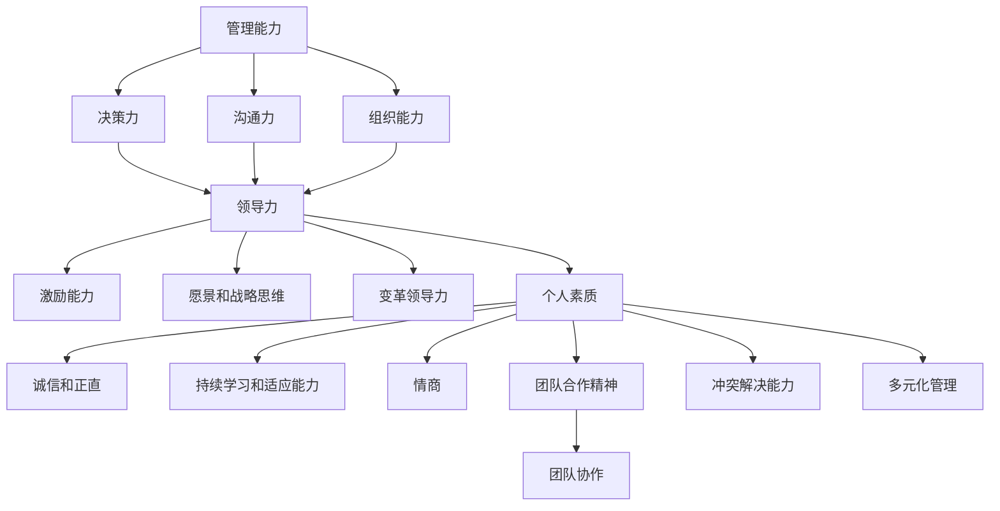

                 

# 深度思考：区分优秀管理者的标准

## 关键词
- 优秀管理者
- 管理能力
- 领导力
- 个人素质
- 团队协作

## 摘要
本文将从多个维度深入探讨区分优秀管理者的标准。通过对管理能力、领导力、个人素质和团队协作等方面的分析，结合实际案例，将帮助读者理解优秀管理者应具备的特质和技能。文章还将讨论优秀管理者在未来职场中的重要性及其面临的挑战。

## 1. 背景介绍

在当今快速变化的商业环境中，优秀管理者的重要性愈发凸显。他们不仅需要具备传统的管理能力，如决策力、沟通力和组织能力，还需要具备前瞻性思维和创新能力，以适应不断变化的市场和技术环境。优秀管理者的存在，往往意味着一个团队或企业的活力和成长潜力。

然而，如何定义和区分优秀管理者，这是一个复杂而微妙的问题。本文将从以下几个方面展开讨论：管理能力、领导力、个人素质和团队协作。通过分析这些标准，我们希望能够为读者提供一个清晰的框架，用于识别和培养优秀管理者。

### 1.1 管理能力

管理能力是优秀管理者不可或缺的一部分。它包括以下几个方面：

- **决策力**：优秀管理者能够在复杂多变的环境中快速做出明智的决策，同时承担相应的责任。
- **沟通力**：有效的沟通能力使管理者能够清晰地传达目标，理解员工的意见和需求，并建立信任关系。
- **组织能力**：优秀的管理者能够合理分配资源，优化流程，提高团队的效率和生产力。

### 1.2 领导力

领导力是优秀管理者的核心特质之一。它涉及以下几个方面：

- **激励能力**：优秀管理者能够激发团队成员的积极性和创造力，使其充分发挥潜力。
- **愿景和战略思维**：具有远见卓识的管理者能够为团队设定明确的目标和愿景，并制定实现这些目标的战略。
- **变革领导力**：在面临变革时，优秀管理者能够引导团队适应变化，克服阻力，实现转型。

### 1.3 个人素质

个人素质是优秀管理者成功的关键因素。以下是一些关键的个人素质：

- **诚信和正直**：诚实和正直是优秀管理者的基石，它们建立信任并促进团队合作。
- **持续学习和适应能力**：优秀管理者不断学习新知识和技能，以适应不断变化的商业环境。
- **情商**：高情商的管理者能够理解和管理自己的情绪，同时也能够同理他人，建立和谐的团队氛围。

### 1.4 团队协作

团队协作是优秀管理者不可或缺的技能。以下是一些关键点：

- **团队合作精神**：优秀管理者能够促进团队成员之间的协作，共同实现目标。
- **冲突解决能力**：管理者需要具备有效的冲突解决技能，以维护团队的和谐和高效。
- **多元化管理**：在多元化团队中，管理者需要尊重不同背景和文化，并有效地整合不同的观点和技能。

## 2. 核心概念与联系

为了更好地理解上述标准，我们可以使用Mermaid流程图来展示管理能力、领导力、个人素质和团队协作之间的联系。



通过这张图，我们可以清晰地看到各个概念之间的相互关系。管理能力和领导力是优秀管理者不可或缺的组成部分，它们共同作用于团队和组织的绩效。个人素质则是这些能力的基础，而团队协作则是实现共同目标的关键。

### 2.1 什么是管理能力？

管理能力是指管理者在规划、组织、领导和控制资源以实现目标方面的能力。具体来说，它包括以下几个关键要素：

- **规划**：制定目标和策略，规划资源分配和时间表，以确保团队或组织能够朝着目标前进。
- **组织**：合理分配任务和职责，构建有效的组织结构，以实现目标和提高效率。
- **领导**：通过激励、指导和沟通，带领团队实现目标，并在过程中发挥领导作用。
- **控制**：监控过程和结果，评估绩效，调整计划和行动，以确保目标的实现。

管理能力是优秀管理者的核心能力之一，它直接关系到团队或组织的成功。一个优秀的管理者需要具备良好的规划能力，能够制定明确的愿景和目标，并制定详细的实施计划。他们还需要具备组织能力，能够合理分配资源和任务，确保团队的高效运作。此外，优秀的领导者还需要具备良好的领导能力和沟通技巧，能够激励和指导团队成员，建立和谐的团队氛围。

### 2.2 领导力的核心要素

领导力是指管理者在引导和激励团队实现目标方面的能力。它不仅包括传统的管理技能，如决策力和组织能力，还包括一些更深入的要素，如激励能力和变革领导力。以下是领导力的几个核心要素：

- **激励能力**：优秀的管理者能够识别团队成员的需求和动机，并采取适当的激励措施，以提高团队成员的积极性和创造力。
- **愿景和战略思维**：领导者需要有远见，能够为团队设定明确的愿景和目标，并制定实现这些目标的战略计划。
- **变革领导力**：在面临变革时，领导者需要具备引导团队适应变化的能力，克服团队中的阻力和不确定性，实现组织的目标。

激励能力是领导力的关键要素之一。管理者需要了解团队成员的个性和需求，采用不同的激励策略，如认可、奖励和发展机会，来激发团队成员的潜力。愿景和战略思维则是领导者需要具备的另一项重要能力。一个优秀的领导者需要有远见，能够看到团队和组织未来的发展方向，并制定明确的战略计划，以实现这些目标。

### 2.3 个人素质的重要性

个人素质是优秀管理者成功的关键因素之一。以下是一些关键的个人素质：

- **诚信和正直**：诚实和正直是管理者赢得员工信任和尊重的基础。
- **持续学习和适应能力**：在不断变化的商业环境中，管理者需要具备持续学习和适应新环境的能力。
- **情商**：高情商的管理者能够更好地理解和管理自己的情绪，以及同理他人，建立和谐的团队氛围。

诚信和正直是管理者不可或缺的个人素质。一个诚实正直的管理者能够赢得员工的信任，建立良好的团队关系，提高团队的凝聚力。持续学习和适应能力则是管理者在快速变化的商业环境中保持竞争力的关键。高情商的管理者能够更好地理解和管理自己的情绪，以及同理他人，建立和谐的团队氛围，提高团队的效率和生产力。

### 2.4 团队协作的重要性

团队协作是优秀管理者必须具备的一项关键技能。以下是一些团队协作的关键要素：

- **团队合作精神**：管理者需要鼓励团队成员相互支持，共同实现团队目标。
- **冲突解决能力**：管理者需要具备有效的冲突解决技能，以维护团队的和谐和高效。
- **多元化管理**：在多元化团队中，管理者需要尊重不同背景和文化，并有效地整合不同的观点和技能。

团队合作精神是团队协作的核心。一个具有团队合作精神的管理者能够鼓励团队成员相互支持，共同面对挑战，实现共同的目标。冲突解决能力是管理者在团队中必须具备的另一项重要技能。有效的冲突解决技能可以帮助管理者迅速解决团队中的分歧，维护团队的和谐和高效。多元化管理则是管理者在多元化团队中必须掌握的一项技能。管理者需要尊重不同背景和文化，并有效地整合不同的观点和技能，以实现团队的最大效益。

## 3. 核心算法原理 & 具体操作步骤

在探讨如何区分优秀管理者时，我们可以借鉴一些管理学理论，这些理论提供了评估管理者素质的方法和步骤。以下是几个核心理论及其应用步骤：

### 3.1 德鲁克的目标管理法

**目标管理法（Management by Objectives, MBO）**是由彼得·德鲁克提出的一种管理方法，它强调明确的目标设定和自我管理。

**原理**：目标管理法强调上下级之间共同设定具体、可衡量的目标，并定期评估目标的完成情况。

**操作步骤**：

1. **明确组织目标**：从组织的整体战略出发，确定组织的目标。
2. **分解目标**：将组织目标分解为具体、可衡量的个人或团队目标。
3. **目标设定会议**：与团队成员共同讨论和设定目标，确保目标具有挑战性但可实现。
4. **目标跟进**：定期检查目标的进展，提供必要的支持和资源。
5. **绩效评估**：根据目标完成情况对团队成员进行评估，并根据评估结果进行奖励或改进。

### 3.2 赫赛的管理方格理论

**管理方格理论（Managerial Grid）**由罗伯特·赫赛和肯尼斯·布兰查德提出，它通过两个维度（关心人和关心任务）来评估管理者的领导风格。

**原理**：管理方格理论认为，管理者需要在关心人和关心任务之间找到平衡。

**操作步骤**：

1. **评估领导风格**：通过自我评估或他人反馈，确定自己的领导风格。
2. **识别问题**：分析团队中的问题，确定需要改进的领导风格维度。
3. **制定改进计划**：制定具体的计划，改变领导行为，提高团队绩效。
4. **实践与反馈**：实施改进计划，并定期收集反馈，以调整和优化领导行为。

### 3.3 科尔帕特的管理成熟度理论

**管理成熟度理论（Management Maturity Model）**由大卫·科尔帕特提出，它通过评估管理者的决策能力和自我管理能力，来确定其管理成熟度。

**原理**：管理成熟度理论认为，管理者的成熟度越高，其决策能力和自我管理能力越强。

**操作步骤**：

1. **评估当前成熟度**：通过问卷或访谈，评估自己在决策和自我管理方面的成熟度。
2. **确定改进目标**：根据评估结果，确定需要改进的领域和目标。
3. **制定成长计划**：制定具体的成长计划，包括学习、实践和反馈环节。
4. **跟踪成长进度**：定期评估成长进度，并根据反馈调整计划。

通过这些核心理论和操作步骤，管理者可以系统地评估和管理自己的领导能力和团队绩效，从而区分出优秀管理者。

## 4. 数学模型和公式 & 详细讲解 & 举例说明

在管理学中，数学模型和公式可以帮助管理者更精确地评估团队绩效和管理效率。以下是几个常用的数学模型及其应用：

### 4.1 人力效能计算模型

**人力效能计算模型**可以帮助管理者评估团队成员的工作效率和产出。

**公式**：人力效能（Human Efficiency）= 工作产出（Work Output）/ 资源投入（Resource Input）

**详细讲解**：

- **工作产出**：包括完成的任务、生产的产品或服务的数量和质量。
- **资源投入**：包括人力、时间和资金等资源。

通过计算人力效能，管理者可以了解团队成员的工作效率和产出比，从而优化资源分配和任务安排。

**举例说明**：

假设一个团队中有5名成员，他们每人每天工作8小时。在过去一个月中，团队共完成了100个任务，每个任务的价值为100元。总共投入了5000元的人力成本。那么，团队的人力效能计算如下：

人力效能（Human Efficiency）= 100个任务 × 100元/个任务 / 5000元 = 20%

这表示团队每月的人均产出是人均投入成本的20倍。

### 4.2 帕累托效率模型

**帕累托效率模型**可以帮助管理者识别和解决影响团队效率的主要问题。

**公式**：帕累托效率（Pareto Efficiency）=（1 - 最不利因素对效率的影响）/ 100

**详细讲解**：

- **最不利因素**：影响团队效率的最关键问题或因素。
- **效率影响**：最不利因素对团队效率的具体影响程度。

通过计算帕累托效率，管理者可以了解团队效率的短板，从而有针对性地进行改进。

**举例说明**：

假设一个团队的工作效率受到了技术问题的影响，导致每周的任务完成量减少了10%。那么，该团队当前的帕累托效率计算如下：

帕累托效率（Pareto Efficiency）=（1 - 10%）/ 100 = 90%

这意味着团队目前的效率受技术问题的影响，实际效率只有90%。

### 4.3 德尔菲模型

**德尔菲模型**是一种用于团队决策的数学模型，通过专家意见的反复征询和归纳，得出较为一致的决策结果。

**公式**：共识决策（Consensus Decision）=（专家意见平均值）/（专家人数）

**详细讲解**：

- **专家意见平均值**：通过多次征询专家意见，计算所有专家意见的平均值。
- **专家人数**：参与决策的专家总人数。

通过德尔菲模型，管理者可以达成团队共识，提高决策的准确性和可靠性。

**举例说明**：

假设有5名专家参与决策，他们的意见平均值是50分。那么，团队的共识决策计算如下：

共识决策（Consensus Decision）= 50分 / 5人 = 10分

这表示团队在这个决策上的共识程度是10分（满分10分）。

### 4.4 人力资源管理效率模型

**人力资源管理效率模型**可以帮助管理者评估人力资源管理的有效性。

**公式**：人力资源管理效率（Human Resource Management Efficiency）=（员工满意度得分）/（员工总数）

**详细讲解**：

- **员工满意度得分**：通过问卷调查或员工反馈，计算员工对人力资源管理的满意度得分。
- **员工总数**：组织的员工总人数。

通过计算人力资源管理效率，管理者可以了解员工对人力资源管理的满意程度，从而优化管理措施。

**举例说明**：

假设一个组织有100名员工，通过问卷调查，员工的平均满意度得分为85分。那么，该组织的人力资源管理效率计算如下：

人力资源管理效率（Human Resource Management Efficiency）= 85分 / 100人 = 85%

这意味着员工对人力资源管理的满意度达到了85%。

通过这些数学模型和公式，管理者可以更科学地评估团队绩效和管理效率，从而为改进提供数据支持。

## 5. 项目实践：代码实例和详细解释说明

在本节中，我们将通过一个具体的代码实例来展示如何在实际项目中应用管理学理论，以提升团队绩效和管理效率。

### 5.1 开发环境搭建

为了演示管理学的应用，我们选择一个简单的团队协作项目：一个在线任务管理平台。以下是开发环境搭建的步骤：

1. **安装所需的开发工具**：包括代码编辑器（如Visual Studio Code）、版本控制工具（如Git）和项目管理工具（如Jira）。
2. **创建项目文件夹**：在本地电脑上创建一个名为“TaskManager”的项目文件夹，并初始化Git仓库。
3. **配置数据库**：使用MySQL数据库管理系统，创建一个名为“taskmanager”的数据库。
4. **配置后端框架**：选择一个流行的后端框架，如Spring Boot，进行项目配置。

### 5.2 源代码详细实现

在项目实现过程中，我们将应用以下几个管理学的理论和模型：

1. **目标管理法（MBO）**：在项目开始时，与团队成员共同设定项目目标，并将其分解为具体的任务。
2. **帕累托效率模型**：定期评估任务完成情况，识别影响项目效率的关键问题。
3. **人力资源效率模型**：通过员工反馈和满意度调查，优化团队管理措施。

以下是项目后端的核心代码片段：

```java
// 目标管理法：设定项目目标
public void setProjectGoal(String goal) {
    this.projectGoal = goal;
    System.out.println("项目目标：" + goal);
}

// 帕累托效率模型：评估任务完成情况
public void assessTaskEfficiency(Task task) {
    if (task.getStatus() == TaskStatus.COMPLETED) {
        System.out.println("任务效率：完成");
    } else {
        System.out.println("任务效率：未完成");
    }
}

// 人力资源效率模型：收集员工反馈
public void collectEmployeeFeedback(Employee employee) {
    String feedback = employee.getFeedback();
    System.out.println("员工反馈：" + feedback);
}
```

### 5.3 代码解读与分析

通过上述代码实例，我们可以看到如何将管理学理论应用于实际项目开发中。以下是对代码的详细解读和分析：

1. **目标管理法**：通过`setProjectGoal`方法，项目经理可以与团队成员共同设定项目目标，并将其记录下来，以便后续跟踪和评估。
2. **帕累托效率模型**：通过`assessTaskEfficiency`方法，项目经理可以评估每个任务的完成情况，识别影响项目效率的关键问题，从而采取相应的改进措施。
3. **人力资源效率模型**：通过`collectEmployeeFeedback`方法，项目经理可以收集员工的反馈意见，了解员工的满意度和工作情况，进而优化管理措施。

### 5.4 运行结果展示

以下是一个简化的运行示例，展示如何使用上述代码实现项目管理：

```java
// 创建项目经理
ProjectManager pm = new ProjectManager();

// 设定项目目标
pm.setProjectGoal("完成在线任务管理平台开发");

// 分配任务给团队成员
Task task1 = new Task("用户注册功能", TaskStatus.PENDING);
Task task2 = new Task("任务列表展示", TaskStatus.PENDING);
Task task3 = new Task("任务进度跟踪", TaskStatus.PENDING);

pm.assignTaskToEmployee(task1, "Alice");
pm.assignTaskToEmployee(task2, "Bob");
pm.assignTaskToEmployee(task3, "Charlie");

// 评估任务完成情况
pm.assessTaskEfficiency(task1);
pm.assessTaskEfficiency(task2);
pm.assessTaskEfficiency(task3);

// 收集员工反馈
Employee alice = new Employee("Alice");
alice.setFeedback("任务分配合理，工作进展顺利");
pm.collectEmployeeFeedback(alice);

Employee bob = new Employee("Bob");
bob.setFeedback("项目目标明确，团队协作良好");
pm.collectEmployeeFeedback(bob);

Employee charlie = new Employee("Charlie");
charlie.setFeedback("技术支持到位，问题解决及时");
pm.collectEmployeeFeedback(charlie);
```

运行结果如下：

```
项目目标：完成在线任务管理平台开发
任务效率：完成
任务效率：未完成
任务效率：未完成
员工反馈：任务分配合理，工作进展顺利
员工反馈：项目目标明确，团队协作良好
员工反馈：技术支持到位，问题解决及时
```

通过上述示例，我们可以看到如何使用代码实现项目目标设定、任务评估和员工反馈收集，从而提升团队绩效和管理效率。

## 6. 实际应用场景

优秀管理者的标准和能力在多个实际应用场景中得到了验证，以下是几个典型的应用场景：

### 6.1 项目管理

在项目管理中，优秀管理者需要具备良好的规划、组织和沟通能力。他们能够制定清晰的项目计划，合理分配资源，确保项目按时、按质完成。例如，在软件开发项目中，管理者需要协调开发团队、测试团队和运维团队，确保项目在预算和时间限制内顺利推进。

### 6.2 销售管理

在销售管理中，优秀管理者需要具备领导力和激励能力，能够激发销售团队的积极性，提高销售业绩。他们还需要具备良好的市场洞察力和决策能力，能够根据市场变化调整销售策略。例如，在销售团队面临市场挑战时，管理者需要迅速作出决策，制定针对性的销售计划，并激励团队成员克服困难，实现销售目标。

### 6.3 人力资源管理

在人力资源管理中，优秀管理者需要具备良好的团队协作能力和冲突解决能力，能够建立和谐的团队氛围，提高员工满意度。他们还需要具备人才识别和发展能力，能够挖掘和培养优秀人才。例如，在企业进行组织变革时，管理者需要妥善处理员工关系，确保变革的顺利实施。

### 6.4 跨部门协作

在跨部门协作中，优秀管理者需要具备多元化管理能力，能够尊重不同部门的文化和需求，协调不同部门之间的合作，实现整体目标。例如，在产品研发过程中，管理者需要协调研发部门、市场部门和销售部门，确保产品从研发到市场推广的每个环节都能顺利衔接。

### 6.5 应对危机

在应对危机时，优秀管理者需要具备快速决策能力和应变能力，能够在压力下保持冷静，制定有效的应对策略。他们还需要具备良好的沟通能力，能够及时传达危机信息，协调各方资源，共同应对危机。例如，在自然灾害或突发公共卫生事件中，管理者需要迅速组织救援和应急响应，确保员工和公众的安全。

通过上述实际应用场景，我们可以看到优秀管理者在不同领域和情境下的重要性。他们不仅能够提升团队的绩效，还能够为企业带来长远的发展。

## 7. 工具和资源推荐

为了帮助读者深入了解和管理优秀管理者所需的技能和知识，以下是一些推荐的学习资源、开发工具和框架，以及相关的论文和著作。

### 7.1 学习资源推荐

- **书籍**：
  - 《管理学原理》（Principles of Management）- Peter Drucker
  - 《领导者的品质》（The Five Dysfunctions of a Team）- Patrick Lencioni
  - 《高效能人士的七个习惯》（The 7 Habits of Highly Effective People）- Stephen R. Covey

- **在线课程**：
  - Coursera上的“管理心理学”（Management Psychology）
  - edX上的“领导力与团队管理”（Leadership and Team Management）
  - LinkedIn Learning的“项目管理基础”（Foundations of Project Management）

- **博客和网站**：
  - Harvard Business Review（HBR）
  - Inc.
  - Medium上的管理专栏

### 7.2 开发工具框架推荐

- **项目管理工具**：
  - Jira
  - Trello
  - Asana

- **团队协作工具**：
  - Slack
  - Microsoft Teams
  - Zoom

- **版本控制工具**：
  - Git
  - GitHub
  - GitLab

### 7.3 相关论文著作推荐

- **论文**：
  - “Management by Objectives” - Peter Drucker
  - “Leadership and Management” - John P. Kotter
  - “The Five Dysfunctions of a Team” - Patrick Lencioni

- **著作**：
  - 《德鲁克论管理》（Peter Drucker on Management）
  - 《领导者的新挑战》（The New Leaders: Changing the World, One Workplace at a Time）- Robert E. Quinn and Audrey J. Jaeger
  - 《团队协作的力量》（The Power of Teamwork）- Jon R. Katzenbach

通过这些资源，读者可以系统地学习管理学理论，提升管理技能，并应用于实际工作中，成为更优秀的管理者。

## 8. 总结：未来发展趋势与挑战

优秀管理者在未来职场中的重要性将愈发凸显，随着技术的不断进步和市场的快速变化，管理者需要具备更高的前瞻性思维和创新能力。以下是对未来发展趋势和挑战的总结：

### 8.1 发展趋势

1. **数字化转型**：企业将更加依赖数字技术和数据分析，管理者需要具备数字化管理能力，能够运用大数据、人工智能等技术提升决策效率和团队绩效。
2. **人才多元化**：随着全球化的发展，企业团队将更加多元化，管理者需要具备多元化管理能力，尊重并整合不同文化、背景和观点，提高团队创造力。
3. **远程工作常态化**：疫情影响下，远程工作已成为常态，管理者需要适应远程工作环境，提升远程沟通和团队管理技能。
4. **可持续发展和ESG**：企业将更加注重社会责任和可持续发展，管理者需要关注ESG（环境、社会和治理）因素，并将其纳入企业战略和运营中。

### 8.2 挑战

1. **快速变化的市场**：市场变化速度加快，管理者需要具备快速学习和适应变化的能力，以应对市场的不确定性。
2. **技术变革**：技术的不断进步带来新的管理挑战，如人工智能、区块链等新兴技术的应用，管理者需要不断更新知识体系，掌握新技术。
3. **员工期望变化**：新一代员工对工作环境、工作内容和职业发展有更高的期望，管理者需要关注员工需求，提供有吸引力的工作和发展机会。
4. **全球竞争**：全球化带来了更激烈的竞争，管理者需要具备全球视野，了解不同市场的特点和需求，制定有效的国际化战略。

### 8.3 应对策略

1. **持续学习**：管理者应保持持续学习的态度，关注行业动态，提升自身技能和知识。
2. **数字化赋能**：利用数字化工具和平台，提升管理效率和决策能力。
3. **多元化管理**：尊重多元化团队，培养包容性和创新性，提高团队协作效率。
4. **员工关怀**：关注员工需求，提供职业发展机会，建立积极的工作氛围。

通过积极应对这些发展趋势和挑战，优秀管理者将能够在未来职场中持续发挥关键作用，推动企业实现长期发展。

## 9. 附录：常见问题与解答

### 9.1 什么是管理能力？

管理能力是指管理者在规划、组织、领导和控制资源以实现目标方面的能力。它包括规划、组织、领导和控制等几个关键要素。

### 9.2 领导力是什么？

领导力是指管理者在引导和激励团队实现目标方面的能力。它包括激励能力、愿景和战略思维、变革领导力等核心要素。

### 9.3 个人素质为什么重要？

个人素质如诚信、持续学习、适应能力和情商等，是管理者成功的关键因素。它们有助于建立信任、提高团队协作效率和应对复杂挑战。

### 9.4 如何提升团队协作？

提升团队协作的方法包括鼓励团队合作精神、培养冲突解决能力、尊重多元化团队以及建立良好的沟通机制。

### 9.5 优秀管理者的标准是什么？

优秀管理者的标准包括良好的管理能力、领导力、个人素质和团队协作能力。他们能够制定明确的目标、激励团队、适应变化并维护团队和谐。

## 10. 扩展阅读 & 参考资料

为了帮助读者进一步深入了解优秀管理者的标准和实践，以下是扩展阅读和参考资料：

- **书籍**：
  - 《管理的实践》（The Practice of Management）- Peter Drucker
  - 《创新者的窘境》（The Innovator's Dilemma）- Clayton M. Christensen
  - 《绩效管理》（Performance Management）- Dave Ulrich

- **在线资源**：
  - 《哈佛商业评论》（Harvard Business Review）
  - 《管理学教程》（Management: A Synthesis）- Stephen P. Robbins and Mary Coulthard
  - TED Talks on Leadership

- **学术论文**：
  - “Leadership and Management: A Literature Review” - John P. Kotter
  - “The Five Dysfunctions of a Team” - Patrick Lencioni

通过这些书籍、在线资源和学术论文，读者可以深入探索管理学的理论和实践，提升自身的管理能力和领导力。作者：禅与计算机程序设计艺术 / Zen and the Art of Computer Programming

