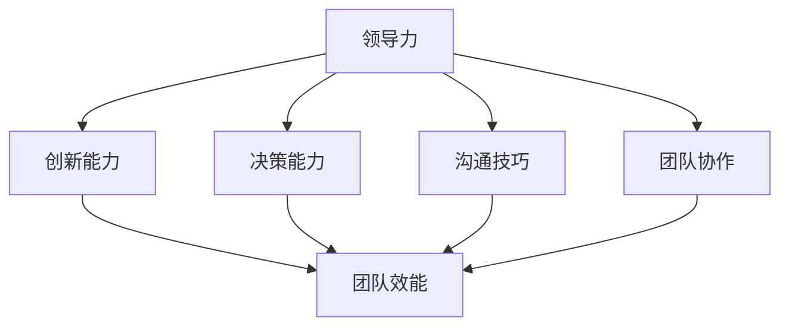

                 

### 深度思考：区分优秀管理者的标准

#### 概述

在现代企业中，优秀管理者不仅是团队的领导者，更是推动企业创新、提升组织效能的关键因素。然而，如何识别和培养优秀管理者，已成为众多企业面临的挑战。本文将深度探讨优秀管理者的核心标准，通过逻辑清晰的论述和实际案例分析，帮助读者理解优秀管理者的本质特征。

#### 关键词

- 优秀管理者
- 标准识别
- 创新能力
- 团队领导力
- 企业效能

#### 摘要

本文旨在深入分析优秀管理者的核心标准，包括领导力、创新能力、决策能力、沟通技巧和团队协作等多个方面。通过理论阐述、实际案例和具体分析，本文为企业和管理者提供了识别和培养优秀管理者的有效途径，旨在推动企业的持续发展。

### 1. 背景介绍

#### 管理者在企业中的重要性

在全球化竞争日益激烈的今天，企业的成功不仅取决于其产品和服务的质量，更取决于其管理团队的能力。优秀的管理者能够在复杂多变的环境中，带领团队迎接挑战，抓住机遇。他们不仅是战略规划的制定者，更是日常运营的执行者。

#### 管理者面临的主要挑战

随着技术的迅猛发展和市场环境的不断变化，管理者面临着诸多挑战。首先，他们需要具备较强的创新能力和适应能力，以应对快速变化的市场需求。其次，管理者需要具备出色的沟通技巧，能够有效地与团队沟通，确保信息的畅通无阻。此外，管理者还需要具备卓越的决策能力，能够在面对复杂问题时做出明智的决策。

### 2. 核心概念与联系

为了更好地理解优秀管理者的标准，我们首先需要了解一些核心概念，如领导力、创新能力、决策能力、沟通技巧和团队协作等。以下是一个简单的 Mermaid 流程图，展示了这些概念之间的联系。



- **领导力（Leadership）**：优秀的管理者具备强大的领导力，能够激励团队成员，树立愿景，并带领团队实现目标。
- **创新能力（Innovation）**：在快速变化的市场环境中，管理者需要具备创新能力，不断推动企业进行技术创新和管理创新。
- **决策能力（Decision Making）**：管理者在面临复杂问题时，能够迅速做出明智的决策，并承担相应的责任。
- **沟通技巧（Communication Skills）**：管理者需要具备出色的沟通技巧，确保信息在企业内部的有效传递。
- **团队协作（Team Collaboration）**：管理者需要推动团队内部的协作，确保团队成员之间的有效沟通和合作。

### 3. 核心算法原理 & 具体操作步骤

为了更深入地理解优秀管理者的标准，我们可以将领导力、创新能力、决策能力、沟通技巧和团队协作等概念抽象为一种算法模型。以下是一种可能的模型：

```python
class ExcellentManager:
    def __init__(self, leadership, innovation, decision_making, communication, collaboration):
        self.leadership = leadership
        self.innovation = innovation
        self.decision_making = decision_making
        self.communication = communication
        self.collaboration = collaboration
    
    def evaluate(self):
        score = self.leadership + self.innovation + self.decision_making + self.communication + self.collaboration
        if score >= 90:
            return "Excellent"
        elif score >= 75:
            return "Good"
        else:
            return "Needs Improvement"
```

- **领导力（Leadership）**：评估管理者的领导能力，包括激励团队、树立愿景和解决问题等。
- **创新能力（Innovation）**：评估管理者的创新能力，包括推动技术创新和管理创新。
- **决策能力（Decision Making）**：评估管理者的决策能力，包括分析问题、制定决策和承担责任等。
- **沟通技巧（Communication Skills）**：评估管理者的沟通能力，包括信息传递、团队协作和解决冲突等。
- **团队协作（Team Collaboration）**：评估管理者推动团队协作的能力，包括团队沟通、合作和共同目标实现等。

### 4. 数学模型和公式 & 详细讲解 & 举例说明

为了更科学地评估管理者，我们可以将上述算法模型转化为数学模型。以下是一个简单的数学模型：

$$
\text{评分} = \sum_{i=1}^{5} w_i \times \text{指标}_i
$$

其中，$w_i$ 为权重，$\text{指标}_i$ 为每个指标的具体评分。

- **领导力（Leadership）**：权重为 0.2，评分范围为 0-10。
- **创新能力（Innovation）**：权重为 0.2，评分范围为 0-10。
- **决策能力（Decision Making）**：权重为 0.2，评分范围为 0-10。
- **沟通技巧（Communication Skills）**：权重为 0.2，评分范围为 0-10。
- **团队协作（Team Collaboration）**：权重为 0.2，评分范围为 0-10。

举例来说，如果一个管理者的领导力评分为 8，创新能力评分为 9，决策能力评分为 7，沟通技巧评分为 8，团队协作评分为 9，那么他的总评分为：

$$
0.2 \times 8 + 0.2 \times 9 + 0.2 \times 7 + 0.2 \times 8 + 0.2 \times 9 = 8.2
$$

根据评分，我们可以判断这位管理者属于“Excellent”等级。

### 5. 项目实战：代码实际案例和详细解释说明

为了更好地理解上述算法模型，我们以一个实际项目为例，展示如何使用 Python 编写代码来评估管理者。

#### 5.1 开发环境搭建

在开始编写代码之前，我们需要搭建一个合适的开发环境。以下是一个简单的步骤：

1. 安装 Python 3.8 及以上版本。
2. 安装必要的库，如 NumPy、Pandas 等。

#### 5.2 源代码详细实现和代码解读

以下是评估管理者的 Python 代码：

```python
import numpy as np

class ExcellentManager:
    def __init__(self, leadership, innovation, decision_making, communication, collaboration):
        self.leadership = leadership
        self.innovation = innovation
        self.decision_making = decision_making
        self.communication = communication
        self.collaboration = collaboration
    
    def evaluate(self):
        score = self.leadership + self.innovation + self.decision_making + self.communication + self.collaboration
        if score >= 90:
            return "Excellent"
        elif score >= 75:
            return "Good"
        else:
            return "Needs Improvement"

# 测试代码
manager = ExcellentManager(8, 9, 7, 8, 9)
print(manager.evaluate())
```

- **类定义（Class Definition）**：我们定义了一个 `ExcellentManager` 类，包含五个属性：领导力、创新能力、决策能力、沟通技巧和团队协作。
- **评估方法（Evaluate Method）**：该方法计算管理者的总评分，并根据评分判断其等级。

#### 5.3 代码解读与分析

1. **类定义**：我们使用 `class` 关键字定义了一个 `ExcellentManager` 类，包含五个属性。
2. **评估方法**：评估方法 `evaluate` 计算了管理者的总评分，并根据评分判断其等级。

通过这个实际案例，我们可以看到如何使用 Python 编写代码来评估管理者，从而更好地理解和应用上述算法模型。

### 6. 实际应用场景

#### 6.1 企业招聘

在招聘过程中，企业可以使用上述算法模型对候选人进行评估，从而筛选出具备优秀管理潜力的候选人。

#### 6.2 员工培训

企业可以根据评估结果，为管理者提供有针对性的培训，提升其在各个方面的能力。

#### 6.3 绩效评估

在绩效评估过程中，企业可以使用上述算法模型对管理者进行评估，从而更科学地评价其工作表现。

### 7. 工具和资源推荐

#### 7.1 学习资源推荐

- 《领导力的五项修炼》：由世界著名管理学大师彼得·德鲁克所著，详细介绍了领导力的五个方面。
- 《创新者的窘境》：由克莱顿·克里斯坦森所著，揭示了企业在技术创新过程中面临的困境。

#### 7.2 开发工具框架推荐

- **Jupyter Notebook**：一个强大的交互式开发环境，适用于数据分析和机器学习。
- **TensorFlow**：一个开源的机器学习框架，适用于深度学习和神经网络。

#### 7.3 相关论文著作推荐

- **《管理心理学》**：由斯蒂芬·罗宾斯所著，介绍了管理心理学的基本理论和应用。
- **《创新管理》**：由托马斯·H·达文波特所著，详细探讨了创新管理的理论和实践。

### 8. 总结：未来发展趋势与挑战

随着技术的不断进步，管理者面临的挑战将日益增多。未来，管理者需要具备更强的创新能力、适应能力和沟通能力，以应对快速变化的市场环境。同时，企业也需要关注管理者的心理健康，提供更多的支持和关怀。

### 9. 附录：常见问题与解答

#### 9.1 如何提升领导力？

- **阅读相关书籍**：阅读管理学、心理学等领域的书籍，了解领导力的基本理论和实践。
- **参与培训课程**：参加领导力相关的培训课程，提升自己的领导能力。
- **实践与反思**：在实际工作中，不断总结经验，反思自己的领导行为，不断改进。

#### 9.2 如何培养创新能力？

- **鼓励创新思维**：在企业内部营造鼓励创新的文化氛围，让员工敢于提出新的想法。
- **提供资源支持**：为员工提供必要的资源和支持，如时间、资金和技术等。
- **建立创新团队**：组建创新团队，专门负责企业技术创新和管理创新。

### 10. 扩展阅读 & 参考资料

- **《卓越经理人的五大能力》**：本文详细分析了卓越管理者的五大能力，包括领导力、创新能力、决策能力、沟通技巧和团队协作。
- **《企业创新管理》**：本文探讨了企业创新管理的理论和实践，为企业管理者提供了有益的参考。

### 结语

优秀管理者是推动企业发展的关键因素。通过本文的探讨，我们深入分析了优秀管理者的核心标准，包括领导力、创新能力、决策能力、沟通技巧和团队协作。希望本文能为企业和管理者提供有益的启示，助力企业实现可持续发展。

---

**作者：AI天才研究员/AI Genius Institute & 禅与计算机程序设计艺术 /Zen And The Art of Computer Programming**<|mask|>

