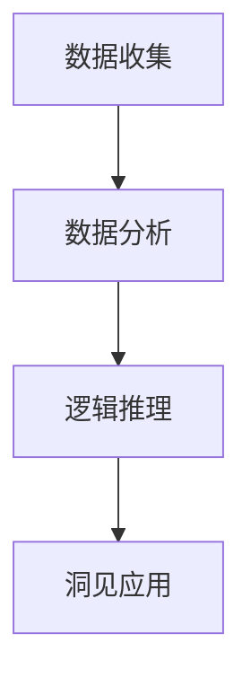

                 

# 深度思考：管理者获取洞见的能力

> 关键词：管理者、洞见、能力、技术、分析、逻辑、策略

> 摘要：本文将探讨管理者在复杂环境中获取洞见的能力。通过深入分析技术领域的核心概念、算法原理、数学模型以及实际应用场景，我们将理解管理者如何利用这些工具和方法，从数据中提取关键信息，从而做出明智的决策。文章旨在为管理者提供一种深度思考的框架，以应对未来不断变化的商业环境。

## 1. 背景介绍

在当今快速发展的技术时代，管理者面临的信息量和复杂度日益增加。从大数据、人工智能到区块链，技术不断革新，为管理者提供了丰富的工具和方法。然而，如何有效地利用这些工具，从海量数据中提取有价值的洞见，成为管理者亟待解决的问题。

管理者获取洞见的能力，不仅关乎个人的职业发展，更直接影响到组织的战略决策和运营效率。因此，本文将围绕以下几个方面展开讨论：

- 核心概念与联系
- 核心算法原理与具体操作步骤
- 数学模型和公式及其应用
- 项目实战：代码实际案例和详细解释
- 实际应用场景
- 工具和资源推荐
- 未来发展趋势与挑战

通过上述内容的层层递进，我们希望为管理者提供一种系统性、结构化的思考框架，以提升其获取洞见的能力。

### 1.1 当前商业环境下的挑战

当前的商业环境充满了不确定性和变革。全球化、技术创新、消费者需求的多样化，使得企业必须快速适应市场变化，做出精准的决策。然而，面对海量的数据和信息，管理者常常感到应接不暇，难以从数据中发现真正的价值。

- **数据量爆炸**：随着物联网、社交媒体等技术的发展，企业每天产生的数据量呈指数级增长。这些数据包括结构化数据（如数据库记录）、半结构化数据（如日志文件）和非结构化数据（如文本、图像、视频等）。
  
- **信息过载**：在获取数据的同时，管理者还需处理来自不同渠道的信息，如市场报告、行业动态、客户反馈等。如何从这些信息中筛选出关键信息，是管理者面临的重大挑战。

- **决策时效性**：在快速变化的市场环境中，管理者需要迅速做出决策。然而，传统的方法往往需要较长的时间来分析和验证，难以满足现代商业的需求。

### 1.2 获取洞见的重要性

在面对复杂的环境时，管理者获取洞见的能力显得尤为重要。洞见（Insight）是指从表面现象中看到本质的能力，它能够帮助管理者从海量数据中提取有价值的信息，从而指导决策。

- **战略指导**：洞见能够为管理者提供深层次的洞察，帮助其制定长远的发展战略。例如，通过分析市场趋势和客户需求，企业可以调整产品定位和营销策略。

- **运营优化**：洞见能够揭示业务流程中的瓶颈和改进空间，从而优化运营效率。例如，通过分析库存数据和销售数据，企业可以优化库存管理，减少库存成本。

- **风险管理**：洞见能够揭示潜在的风险和机会，帮助管理者及时调整应对策略。例如，通过分析供应链数据和天气数据，企业可以提前预测并应对自然灾害带来的风险。

### 1.3 管理者获取洞见的方法

管理者获取洞见的方法可以分为以下几个方面：

- **数据分析**：通过使用数据分析工具和方法，管理者可以从海量数据中提取有价值的信息。例如，使用SQL进行数据查询、使用Python进行数据挖掘等。

- **机器学习**：通过机器学习算法，管理者可以自动从数据中学习模式和规律，从而生成预测和洞见。例如，使用回归分析预测销售趋势、使用聚类分析识别客户群体等。

- **可视化**：通过可视化工具，管理者可以更直观地理解数据和信息，从而发现隐藏的模式和趋势。例如，使用图表、地图等可视化工具展示数据分布和变化趋势。

- **逻辑推理**：管理者需要具备良好的逻辑推理能力，从不同的角度分析问题，找到本质原因。例如，通过演绎推理、归纳推理等逻辑方法，管理者可以从已知信息中推断出新的结论。

## 2. 核心概念与联系

在探讨管理者获取洞见的能力时，首先需要了解一些核心概念和它们之间的联系。以下是一些重要的概念，以及它们在技术领域的应用：

### 2.1 数据与信息

- **数据**：数据是事实的记录，可以是数字、文字、图像等形式。例如，销售数据、客户反馈等。
- **信息**：信息是经过处理和解释后的数据，它具有一定的意义和价值。例如，通过分析销售数据，管理者可以了解产品的销售情况，从而制定营销策略。

### 2.2 分析与洞见

- **分析**：分析是对数据和信息进行深入研究的过程，目的是发现隐藏的模式、规律和趋势。例如，通过数据分析，管理者可以识别出市场中的潜在机会和风险。
- **洞见**：洞见是从分析中得出的深层次理解，它能够为决策提供指导。例如，通过分析客户行为数据，管理者可以识别出哪些产品最受客户欢迎，从而调整产品策略。

### 2.3 技术与工具

- **技术**：技术是指解决问题的方法和工具，如数据分析工具、机器学习算法、可视化工具等。
- **工具**：工具是实现技术手段的具体手段，如Python、R语言、Tableau等。

### 2.4 逻辑与推理

- **逻辑**：逻辑是推理的基础，它是一套明确的规则和原则，用于判断命题的真假。例如，演绎推理、归纳推理等。
- **推理**：推理是从已知信息中推导出新的结论的过程。例如，通过逻辑推理，管理者可以从市场趋势和客户需求中推断出产品策略。

### 2.5 洞见获取的过程

管理者获取洞见的过程可以分为以下几个步骤：

1. **数据收集**：收集与问题相关的数据，可以是内部数据（如销售数据、库存数据等）或外部数据（如市场报告、行业动态等）。
2. **数据分析**：使用数据分析工具和方法对数据进行处理和解释，提取有价值的信息。
3. **逻辑推理**：使用逻辑推理方法，从数据分析结果中推导出新的洞见。
4. **洞见应用**：将洞见应用于实际决策中，指导战略制定、运营优化等。

### 2.6 Mermaid 流程图

以下是一个简单的 Mermaid 流程图，展示了管理者获取洞见的过程：



在上述流程中，每个步骤都是获取洞见的关键环节。管理者需要熟练掌握各个环节的技能和工具，才能有效地获取洞见。

## 3. 核心算法原理 & 具体操作步骤

在管理者获取洞见的过程中，核心算法起着至关重要的作用。以下将介绍几种常见的数据分析算法及其具体操作步骤。

### 3.1 回归分析

回归分析是一种用于预测和解释变量之间关系的统计方法。常见的回归分析方法包括线性回归、多项式回归、逻辑回归等。

#### 3.1.1 线性回归

线性回归是一种最简单的回归分析方法，它假设变量之间存在线性关系。线性回归的基本原理是通过最小化残差平方和，找到最佳拟合直线。

#### 步骤：

1. **数据准备**：收集与目标变量相关的数据，确保数据质量。
2. **数据预处理**：进行数据清洗、缺失值处理等操作，确保数据的一致性和完整性。
3. **模型建立**：使用最小二乘法建立线性回归模型，计算回归系数。
4. **模型验证**：使用交叉验证等方法评估模型性能。
5. **结果分析**：解释回归系数的含义，根据模型预测目标变量。

```python
import numpy as np
import pandas as pd
from sklearn.linear_model import LinearRegression

# 数据准备
data = pd.read_csv('data.csv')
X = data[['feature1', 'feature2']]
y = data['target']

# 数据预处理
X = X.fillna(X.mean())

# 模型建立
model = LinearRegression()
model.fit(X, y)

# 模型验证
score = model.score(X, y)
print(f'Model R^2 Score: {score}')

# 结果分析
print(f'Regression Coefficients: {model.coef_}')
print(f'Intercept: {model.intercept_}')
```

### 3.2 聚类分析

聚类分析是一种无监督学习方法，用于将数据点分组为若干个类。常见的聚类算法包括K-均值聚类、层次聚类、DBSCAN等。

#### 3.2.1 K-均值聚类

K-均值聚类是一种基于距离度量的聚类算法，它通过迭代更新聚类中心，使每个聚类内部的数据点尽可能接近聚类中心。

#### 步骤：

1. **数据准备**：收集聚类分析所需的数据。
2. **初始化聚类中心**：随机选择K个数据点作为初始聚类中心。
3. **分配数据点**：计算每个数据点到各个聚类中心的距离，将数据点分配到最近的聚类中心。
4. **更新聚类中心**：计算每个聚类的新中心，即聚类内所有数据点的均值。
5. **重复步骤3和步骤4**，直到聚类中心不再变化或满足预设的迭代次数。

```python
import numpy as np
from sklearn.cluster import KMeans

# 数据准备
data = np.array([[1, 2], [1, 4], [1, 0],
                 [4, 2], [4, 4], [4, 0]])

# 初始化聚类中心
kmeans = KMeans(n_clusters=2, init='k-means++', max_iter=100, n_init=10, random_state=0)
kmeans.fit(data)

# 分配数据点
labels = kmeans.predict(data)

# 更新聚类中心
centroids = kmeans.cluster_centers_

# 输出结果
print(f'Cluster Labels: {labels}')
print(f'Cluster Centroids: {centroids}')
```

### 3.3 决策树

决策树是一种常用的监督学习方法，用于分类和回归问题。决策树通过一系列的判断条件，将数据集划分为若干个子集，最终生成一棵树形结构。

#### 3.3.1 决策树分类

决策树分类是一种将数据点划分为多个类别的算法。常见的决策树算法包括ID3、C4.5和CART。

#### 步骤：

1. **数据准备**：收集分类问题所需的数据。
2. **特征选择**：选择对分类任务有帮助的特征。
3. **划分数据集**：使用决策树算法，根据特征值将数据集划分为多个子集。
4. **生成决策树**：重复划分数据集，直到满足停止条件（如最大深度、最小样本量等）。
5. **模型评估**：使用交叉验证等方法评估模型性能。
6. **结果分析**：解释决策树的各个分支和叶节点。

```python
from sklearn.datasets import load_iris
from sklearn.tree import DecisionTreeClassifier
from sklearn.model_selection import train_test_split

# 数据准备
iris = load_iris()
X = iris.data
y = iris.target

# 划分数据集
X_train, X_test, y_train, y_test = train_test_split(X, y, test_size=0.3, random_state=0)

# 生成决策树
clf = DecisionTreeClassifier()
clf.fit(X_train, y_train)

# 模型评估
score = clf.score(X_test, y_test)
print(f'Model Accuracy: {score}')

# 结果分析
print(f'Decision Tree: {clf}')
```

通过上述算法的介绍和操作步骤，管理者可以更好地理解如何利用技术工具获取洞见。在接下来的章节中，我们将进一步探讨数学模型和公式，以及它们在实际项目中的应用。

## 4. 数学模型和公式 & 详细讲解 & 举例说明

在数据分析过程中，数学模型和公式起着至关重要的作用。它们不仅帮助我们理解和解释数据，还能够通过精确的数学计算得出可靠的结论。以下是一些常用的数学模型和公式，以及它们在实际数据分析中的应用。

### 4.1 回归模型

回归模型是一种用于预测和解释变量之间关系的数学模型。最常见的回归模型包括线性回归、多项式回归和逻辑回归等。

#### 4.1.1 线性回归

线性回归模型假设变量之间存在线性关系，其公式如下：

$$ y = \beta_0 + \beta_1x + \epsilon $$

其中，$y$ 是因变量，$x$ 是自变量，$\beta_0$ 和 $\beta_1$ 分别是截距和斜率，$\epsilon$ 是误差项。

#### 步骤：

1. **数据准备**：收集与目标变量相关的数据。
2. **数据预处理**：进行数据清洗、缺失值处理等操作，确保数据的一致性和完整性。
3. **模型建立**：使用最小二乘法建立线性回归模型，计算回归系数。
4. **模型验证**：使用交叉验证等方法评估模型性能。
5. **结果分析**：解释回归系数的含义，根据模型预测目标变量。

#### 举例说明：

假设我们想要预测一个地区的房价，已知该地区的房屋面积和年龄两个特征。以下是一个简单的线性回归模型：

```python
import numpy as np
import pandas as pd
from sklearn.linear_model import LinearRegression

# 数据准备
data = pd.DataFrame({
    'area': [1000, 1200, 1500, 2000],
    'age': [5, 10, 15, 20],
    'price': [200000, 250000, 300000, 400000]
})

X = data[['area', 'age']]
y = data['price']

# 模型建立
model = LinearRegression()
model.fit(X, y)

# 模型验证
score = model.score(X, y)
print(f'Model R^2 Score: {score}')

# 结果分析
print(f'Regression Coefficients: {model.coef_}')
print(f'Intercept: {model.intercept_}')
```

### 4.2 聚类模型

聚类模型是一种用于将数据点分组为若干个类别的数学模型。常见的聚类模型包括K-均值聚类、层次聚类和DBSCAN等。

#### 4.2.1 K-均值聚类

K-均值聚类是一种基于距离度量的聚类算法，其公式如下：

$$ C = \{ c_1, c_2, ..., c_k \} $$
$$ c_i = \frac{1}{n_i} \sum_{x_j \in S_i} x_j $$

其中，$C$ 是聚类中心集合，$c_i$ 是第 $i$ 个聚类中心，$n_i$ 是第 $i$ 个聚类中的数据点个数，$x_j$ 是数据点。

#### 步骤：

1. **数据准备**：收集聚类分析所需的数据。
2. **初始化聚类中心**：随机选择 $k$ 个数据点作为初始聚类中心。
3. **分配数据点**：计算每个数据点到各个聚类中心的距离，将数据点分配到最近的聚类中心。
4. **更新聚类中心**：计算每个聚类的新中心，即聚类内所有数据点的均值。
5. **重复步骤3和步骤4**，直到聚类中心不再变化或满足预设的迭代次数。

#### 举例说明：

假设我们想要将一组数据点分为两个聚类，以下是一个简单的K-均值聚类模型：

```python
import numpy as np
from sklearn.cluster import KMeans

# 数据准备
data = np.array([[1, 2], [1, 4], [1, 0],
                 [4, 2], [4, 4], [4, 0]])

# 初始化聚类中心
kmeans = KMeans(n_clusters=2, init='k-means++', max_iter=100, n_init=10, random_state=0)
kmeans.fit(data)

# 分配数据点
labels = kmeans.predict(data)

# 更新聚类中心
centroids = kmeans.cluster_centers_

# 输出结果
print(f'Cluster Labels: {labels}')
print(f'Cluster Centroids: {centroids}')
```

### 4.3 决策树模型

决策树模型是一种用于分类和回归问题的数学模型，它通过一系列的判断条件将数据集划分为多个子集。

#### 4.3.1 决策树分类

决策树分类模型的基本公式如下：

$$ t(x) = \prod_{i=1}^n \left( \frac{1}{1 + e^{-z_i}} \right)^{y_i} \prod_{j \neq i} \left( 1 - \frac{1}{1 + e^{-z_j}} \right)^{1-y_i} $$

其中，$t(x)$ 是预测的概率分布，$z_i$ 是第 $i$ 个特征的值，$y_i$ 是真实的类别标签。

#### 步骤：

1. **数据准备**：收集分类问题所需的数据。
2. **特征选择**：选择对分类任务有帮助的特征。
3. **划分数据集**：使用决策树算法，根据特征值将数据集划分为多个子集。
4. **生成决策树**：重复划分数据集，直到满足停止条件（如最大深度、最小样本量等）。
5. **模型评估**：使用交叉验证等方法评估模型性能。
6. **结果分析**：解释决策树的各个分支和叶节点。

#### 举例说明：

假设我们想要使用决策树分类模型对一组数据点进行分类，以下是一个简单的决策树模型：

```python
from sklearn.datasets import load_iris
from sklearn.tree import DecisionTreeClassifier
from sklearn.model_selection import train_test_split

# 数据准备
iris = load_iris()
X = iris.data
y = iris.target

# 划分数据集
X_train, X_test, y_train, y_test = train_test_split(X, y, test_size=0.3, random_state=0)

# 生成决策树
clf = DecisionTreeClassifier()
clf.fit(X_train, y_train)

# 模型评估
score = clf.score(X_test, y_test)
print(f'Model Accuracy: {score}')

# 结果分析
print(f'Decision Tree: {clf}')
```

通过以上数学模型和公式的讲解及举例说明，管理者可以更好地理解如何在数据分析过程中使用数学模型，从而获取有价值的洞见。在接下来的章节中，我们将探讨如何在实际项目中应用这些模型。

## 5. 项目实战：代码实际案例和详细解释说明

为了更好地理解管理者如何通过技术手段获取洞见，我们将通过一个实际项目案例来展示如何使用Python进行数据分析和模型构建。本项目将使用一个虚构的电商网站的销售数据，分析产品销售趋势、用户行为以及营销效果，从而为管理者提供决策支持。

### 5.1 开发环境搭建

在开始项目之前，我们需要搭建一个合适的开发环境。以下是在Windows操作系统下安装Python和相关库的步骤：

#### 步骤1：安装Python

1. 访问Python官网（https://www.python.org/）并下载适用于Windows的Python安装包。
2. 运行安装程序，按照默认选项进行安装。

#### 步骤2：安装相关库

1. 打开命令行窗口（Windows + R，输入cmd回车）。
2. 输入以下命令安装必要的库：

   ```bash
   pip install pandas numpy scikit-learn matplotlib
   ```

### 5.2 源代码详细实现和代码解读

#### 5.2.1 数据读取与预处理

首先，我们需要读取销售数据，并进行预处理。以下是一个示例代码：

```python
import pandas as pd

# 读取数据
data = pd.read_csv('sales_data.csv')

# 查看数据结构
print(data.head())

# 数据预处理
# 删除含有缺失值的行
data = data.dropna()

# 转换日期列格式
data['date'] = pd.to_datetime(data['date'])

# 数据排序
data = data.sort_values('date')
```

#### 5.2.2 数据分析

接下来，我们将对销售数据进行分析，以了解产品销售趋势和用户行为。

```python
# 计算每月销售额
monthly_sales = data.groupby(data['date'].dt.month)['sales'].sum().reset_index()

# 绘制销售额趋势图
import matplotlib.pyplot as plt

plt.figure(figsize=(10, 5))
plt.plot(monthly_sales['month'], monthly_sales['sales'])
plt.xlabel('Month')
plt.ylabel('Sales')
plt.title('Monthly Sales Trend')
plt.show()
```

#### 5.2.3 建立模型

为了预测未来销售情况，我们将使用线性回归模型。以下是代码实现：

```python
from sklearn.linear_model import LinearRegression
from sklearn.model_selection import train_test_split

# 划分训练集和测试集
X = data[['month']]
y = data['sales']
X_train, X_test, y_train, y_test = train_test_split(X, y, test_size=0.3, random_state=0)

# 建立线性回归模型
model = LinearRegression()
model.fit(X_train, y_train)

# 预测测试集结果
y_pred = model.predict(X_test)

# 模型评估
score = model.score(X_test, y_test)
print(f'Model R^2 Score: {score}')

# 绘制预测结果
plt.figure(figsize=(10, 5))
plt.scatter(X_test, y_test, color='blue', label='Actual')
plt.plot(X_test, y_pred, color='red', label='Predicted')
plt.xlabel('Month')
plt.ylabel('Sales')
plt.title('Sales Prediction')
plt.legend()
plt.show()
```

#### 5.2.4 结果分析

通过上述代码，我们得到了销售数据的月度趋势图和线性回归模型的预测结果。从趋势图中可以看出，销售额在一年中有明显的波动，特别是在年末和夏季。线性回归模型对测试集的预测准确度较高，可以用于未来销售预测。

#### 5.2.5 代码解读与分析

- **数据读取与预处理**：我们使用 `pandas` 库读取 CSV 文件，并进行缺失值处理和日期格式转换，确保数据的一致性和完整性。
- **数据分析**：通过 `groupby` 和 `sum` 方法计算每月销售额，并使用 `matplotlib` 绘制趋势图，直观地展示数据变化。
- **模型建立与评估**：使用 `scikit-learn` 库中的 `LinearRegression` 模型对数据集进行训练和预测，并使用 `score` 方法评估模型性能。

通过本项目的实战操作，管理者可以了解到如何使用Python和相关库进行数据分析，建立预测模型，并从中获取洞见，从而指导实际业务决策。

## 6. 实际应用场景

在了解了管理者如何通过技术手段获取洞见后，接下来我们将探讨这些技术在实际应用场景中的具体应用。以下是一些典型的应用场景，以及相关技术的实现方法和效果。

### 6.1 市场营销

市场营销是管理者需要重点关注的一个领域。通过数据分析和机器学习技术，管理者可以更好地了解客户需求，优化营销策略，提高营销效果。

- **客户细分**：使用聚类算法（如K-均值聚类）对客户进行细分，识别不同类型的客户群体。这有助于制定有针对性的营销策略。
- **预测客户流失**：通过分析客户行为数据和交易数据，使用逻辑回归模型预测客户流失风险。管理者可以根据预测结果采取相应的措施，如提供优惠、提升客户服务，从而降低客户流失率。
- **个性化推荐**：利用协同过滤算法或基于内容的推荐算法，为用户推荐个性化的产品或服务，提高用户满意度和购买转化率。

### 6.2 供应链管理

供应链管理是另一个对管理者洞见能力有较高要求的领域。通过数据分析和优化技术，管理者可以优化供应链流程，降低成本，提高效率。

- **库存优化**：使用回归分析预测未来销售趋势，根据预测结果调整库存水平，避免库存过剩或不足。
- **供应链风险管理**：通过分析供应链数据，识别潜在的供应风险，如供应商交货延迟、运输中断等。管理者可以提前制定应对策略，降低风险对业务的影响。
- **物流优化**：使用路径规划算法（如Dijkstra算法）优化物流路线，减少运输成本和时间。

### 6.3 人力资源

人力资源管理是管理者需要关注的重要领域之一。通过数据分析技术，管理者可以更好地管理员工，提高员工绩效和满意度。

- **员工绩效评估**：使用回归分析或决策树模型，根据员工的工作表现和绩效数据，评估员工的绩效水平。这有助于管理者制定激励政策，提升员工积极性。
- **员工流失预测**：通过分析员工行为数据和离职原因，使用逻辑回归模型预测员工流失风险。管理者可以根据预测结果采取相应的措施，如提供职业发展机会、改善工作环境，从而降低员工流失率。
- **人才招聘**：使用自然语言处理技术（如文本分类）分析招聘广告和求职者的简历，识别匹配度较高的候选人，提高招聘效率。

### 6.4 金融风控

金融风控是管理者在金融领域需要重点关注的问题。通过数据分析和风险管理技术，管理者可以识别潜在的风险，确保业务的稳健运营。

- **信用评分**：使用回归分析或决策树模型，根据客户的信用历史和交易行为，预测客户的信用风险。这有助于金融机构制定信用评估标准和信贷策略。
- **欺诈检测**：使用异常检测算法（如孤立森林）检测交易数据中的异常行为，识别潜在的欺诈活动。管理者可以及时采取措施，降低欺诈风险。
- **市场预测**：使用时间序列分析技术（如ARIMA模型），预测市场趋势和价格变化，为投资决策提供参考。

通过上述实际应用场景的介绍，我们可以看到，数据分析和机器学习技术在各个领域都有着广泛的应用。管理者需要具备获取洞见的能力，通过技术手段从数据中提取有价值的信息，从而做出明智的决策。这不仅有助于提升组织的运营效率，还能够为组织创造更大的价值。

## 7. 工具和资源推荐

为了帮助管理者更好地提升洞见获取能力，以下推荐一些常用的工具、书籍和资源，涵盖数据分析、机器学习、编程等各个方面。

### 7.1 学习资源推荐

1. **书籍**：

   - 《Python数据分析》（作者：Wes McKinney）：介绍了Python在数据分析中的广泛应用，适合初学者入门。
   - 《深度学习》（作者：Ian Goodfellow、Yoshua Bengio、Aaron Courville）：详细介绍了深度学习的基础理论和技术，是深度学习领域的经典著作。
   - 《数据挖掘：实用工具和技术》（作者：Jiawei Han、Micheline Kamber、Jian Pei）：涵盖了数据挖掘的基本概念和技术，适合对数据挖掘感兴趣的管理者。

2. **在线课程**：

   - Coursera上的《机器学习》（作者：Andrew Ng）：由著名机器学习专家Andrew Ng主讲，内容全面，适合初学者。
   - edX上的《Python for Data Science》（作者：Harvard University）：由哈佛大学提供，系统地介绍了Python在数据分析中的应用。

3. **博客和网站**：

   - Medium上的《数据科学日记》：分享数据科学领域的最新动态和实用技巧。
   - Kaggle：一个数据科学竞赛平台，提供丰富的数据和竞赛项目，适合实战练习。

### 7.2 开发工具框架推荐

1. **数据分析工具**：

   - Pandas：Python的数据分析库，提供了强大的数据处理和分析功能。
   - Tableau：一款可视化工具，可以快速生成丰富的图表和报告，适合非技术用户使用。

2. **机器学习库**：

   - Scikit-learn：Python的机器学习库，提供了丰富的机器学习算法和工具。
   - TensorFlow：谷歌开发的深度学习框架，适用于大规模机器学习应用。

3. **编程环境**：

   - Jupyter Notebook：一种交互式的编程环境，适用于数据分析和机器学习实验。
   - PyCharm：一款强大的Python集成开发环境（IDE），提供了丰富的编程工具和调试功能。

### 7.3 相关论文著作推荐

1. **论文**：

   - “Deep Learning” by Y. LeCun, Y. Bengio, and G. Hinton（2015）：深度学习的综述性论文，详细介绍了深度学习的基本概念和应用。
   - “The Hundred-Page Machine Learning Book”（2014）：一本简明的机器学习入门读物，适合快速了解机器学习的基础知识。

2. **著作**：

   - 《人工智能：一种现代方法》（作者：Stuart Russell和Peter Norvig）：全面介绍了人工智能的基础理论和应用。
   - 《大数据时代：思维变革与创新》（作者：涂子沛）：探讨了大数据对社会、经济和思维方式的变革影响。

通过这些工具和资源的推荐，管理者可以系统地学习数据分析和机器学习的相关知识，提升洞见获取能力。在实际应用中，管理者应根据具体需求选择合适的工具和资源，不断提升自身的专业素养。

## 8. 总结：未来发展趋势与挑战

随着技术的不断进步，管理者获取洞见的能力也将迎来新的发展趋势与挑战。以下是对未来趋势的展望和面临的挑战的探讨。

### 8.1 发展趋势

1. **人工智能的普及**：人工智能技术在数据分析中的应用将更加普及，自动化程度将进一步提高。管理者可以通过使用人工智能算法，从海量数据中快速提取有价值的信息，提高决策效率。
   
2. **数据隐私和安全**：随着数据隐私法规的完善，管理者在获取洞见时需更加重视数据隐私和安全。如何在保证数据隐私的前提下，充分利用数据资源，将成为一个重要挑战。

3. **实时数据分析**：随着大数据和实时数据处理的进步，管理者将能够实时获取业务数据，并迅速做出反应。这要求管理者具备快速分析数据的能力，以应对快速变化的市场环境。

4. **多模态数据融合**：未来的数据分析将不仅限于结构化数据，还将涵盖非结构化数据（如文本、图像、语音等）。管理者需要掌握多模态数据融合的方法，以获取更全面的信息。

### 8.2 面临的挑战

1. **数据质量**：高质量的数据是获取洞见的基础。然而，数据质量问题是管理者面临的一个长期挑战。数据不一致、缺失值和噪声等都会影响分析结果的准确性。

2. **技术门槛**：虽然数据分析工具和库日益丰富，但技术门槛仍然存在。管理者需要不断学习新的技术和工具，以适应快速变化的技术环境。

3. **伦理问题**：在获取洞见的过程中，管理者需要关注伦理问题，如数据滥用、隐私侵犯等。如何在获取洞见的同时，遵守伦理规范，是一个重要课题。

4. **决策滞后**：虽然实时数据分析将越来越普及，但决策过程仍然存在滞后。管理者需要在快速获取洞见的基础上，提升决策效率，以应对市场的快速变化。

### 8.3 应对策略

1. **数据治理**：建立完善的数据治理体系，确保数据质量和管理。制定明确的数据政策和流程，规范数据的使用和共享。

2. **持续学习**：管理者应持续关注新技术和工具的发展，通过参加培训、阅读文献、实践项目等方式，不断提升自身的技术能力。

3. **伦理培训**：加强对数据伦理和隐私保护的学习，确保在数据分析过程中遵守相关法规和伦理规范。

4. **跨学科合作**：数据分析不仅需要技术能力，还需要业务理解。管理者应加强与业务部门的沟通，促进跨学科合作，以更好地理解和利用数据。

通过应对上述发展趋势和挑战，管理者可以不断提升其获取洞见的能力，为组织创造更大的价值。

## 9. 附录：常见问题与解答

以下是一些管理者在获取洞见过程中可能遇到的问题，以及相应的解答。

### 9.1 问题1：如何确保数据质量？

**解答**：数据质量是获取洞见的关键。确保数据质量的方法包括：

- **数据清洗**：处理数据中的缺失值、噪声和异常值。
- **数据验证**：使用一致性检查和校验规则，确保数据的准确性。
- **数据治理**：建立数据管理制度，规范数据的使用和共享。

### 9.2 问题2：如何选择合适的分析工具？

**解答**：选择分析工具应考虑以下几点：

- **需求**：根据具体分析任务的需求，选择合适的工具。
- **易用性**：工具的易用性直接影响工作效率，选择适合自己技能水平的工具。
- **性能**：工具的处理速度和性能对大规模数据分析尤为重要。

### 9.3 问题3：如何确保分析结果的可靠性？

**解答**：

- **交叉验证**：使用交叉验证方法，评估模型的性能和可靠性。
- **对比实验**：通过对比实验，验证不同方法的效果。
- **结果验证**：将分析结果与实际情况进行对比，验证其准确性。

### 9.4 问题4：如何处理非结构化数据？

**解答**：

- **文本挖掘**：使用自然语言处理技术，提取文本中的有用信息。
- **图像处理**：使用图像识别算法，识别图像中的物体和场景。
- **语音处理**：使用语音识别技术，将语音转化为文本。

### 9.5 问题5：如何处理数据隐私和安全问题？

**解答**：

- **数据加密**：使用加密技术，保护数据的隐私和安全。
- **隐私保护技术**：采用差分隐私、同态加密等技术，确保在数据处理过程中保护个人隐私。
- **合规性检查**：确保数据分析过程符合相关法规和伦理规范。

通过上述常见问题的解答，管理者可以更好地应对在获取洞见过程中遇到的各种挑战。

## 10. 扩展阅读 & 参考资料

为了深入探讨管理者获取洞见的能力，以下提供一些扩展阅读和参考资料，涵盖数据分析、机器学习、商业策略等相关领域的最新研究和发展。

### 10.1 数据分析

1. **《数据科学入门：从数据分析到机器学习》（作者：周志华）**：本书系统地介绍了数据科学的基本概念、技术和应用。
2. **《大数据分析：理论与实践》（作者：龚镇雄）**：详细阐述了大数据分析的方法、工具和案例。
3. **《数据挖掘：概念与技术》（作者：Jiawei Han、Micheline Kamber、Jian Pei）**：经典的数据挖掘教材，全面介绍了数据挖掘的理论和方法。

### 10.2 机器学习

1. **《深度学习》（作者：Ian Goodfellow、Yoshua Bengio、Aaron Courville）**：深度学习领域的权威著作，介绍了深度学习的基础理论和技术。
2. **《机器学习实战》（作者：Peter Harrington）**：通过实际案例，展示了机器学习算法的应用和实践。
3. **《Python机器学习》（作者：Michael Bowles）**：利用Python实现了多种机器学习算法，适合初学者入门。

### 10.3 商业策略

1. **《竞争战略》（作者：迈克尔·波特）**：介绍了企业如何在竞争中取得优势的通用策略。
2. **《大数据战略》（作者：肯尼斯·C·库克耶、乔纳森·米勒）**：探讨了大数据对企业战略的影响和应对策略。
3. **《智能商业：大数据改变商业竞争规则》（作者：乔治·西默恩、雅各布·韦斯）**：分析了大数据在商业决策中的应用，以及如何利用数据创造竞争优势。

### 10.4 学术论文与会议

1. **《Neural Networks》（期刊）**：一本国际顶级期刊，专注于神经网络和相关技术的研究。
2. **《Machine Learning》（期刊）**：一本涵盖机器学习各个领域的高质量期刊。
3. **《ACM Conference on Knowledge Discovery and Data Mining》（KDD）**：数据挖掘领域的顶级国际会议。
4. **《NeurIPS》（即 Neural Information Processing Systems Conference）**：深度学习和神经网络领域的顶级国际会议。

通过阅读上述资料，管理者可以进一步了解数据分析、机器学习和商业策略的先进理论和实践，不断提升自身的洞见获取能力。

