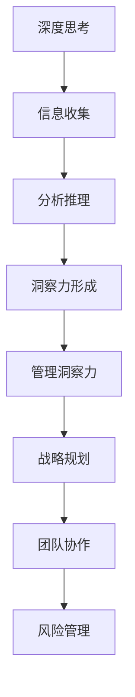

                 

# 深度思考与管理洞察力的关系

## 关键词：深度思考、管理洞察力、技术博客、逻辑清晰、简单易懂、专业

### 摘要

本文将探讨深度思考与管理洞察力之间的紧密关系。通过深入剖析这两个概念的本质，我们将揭示它们在IT领域的独特重要性，并探讨如何通过深度思考和有效的管理洞察力提升个人和组织的竞争力。本文旨在为读者提供一种全新的视角，以帮助他们在技术领域中实现卓越。

## 1. 背景介绍

### 1.1 深度思考的定义与重要性

深度思考是一种在复杂情境中进行深入分析和推理的过程。它不仅仅是对问题的表面理解，而是涉及到对问题的根本原因、潜在关联和长期影响的深入探究。在IT领域，深度思考的重要性体现在以下几个方面：

- **解决复杂问题**：深度思考能够帮助我们从多个角度分析问题，从而找到最有效的解决方案。在IT领域中，复杂的问题往往需要深入思考来拆解、分析和解决。

- **创新与发明**：深度思考是创新和发明的关键。通过对已有知识和信息的重新组合和理解，我们能够产生新的想法和解决方案，推动技术的发展。

- **决策优化**：深度思考可以帮助我们更好地做出决策。在IT管理中，深度思考可以帮助我们评估各种选项的潜在影响，从而做出更明智的决策。

### 1.2 管理洞察力的概念与作用

管理洞察力是指管理者在理解和管理复杂系统时所需的分析能力、判断力和直觉。它涉及到对组织运作、市场趋势、技术发展等方面的深刻理解和前瞻性洞察。在IT领域中，管理洞察力具有以下作用：

- **战略规划**：管理洞察力可以帮助企业制定有效的战略规划，以应对快速变化的市场和技术环境。

- **团队协作**：洞察力的管理者能够更好地理解团队成员的能力和需求，从而促进团队协作和高效运作。

- **风险管理**：管理洞察力可以帮助企业识别和管理潜在的风险，确保业务稳定和持续发展。

## 2. 核心概念与联系

### 2.1 深度思考与管理洞察力的关系

深度思考和管理洞察力之间存在紧密的联系。深度思考是管理洞察力的基础，而管理洞察力则通过深度思考得以体现和应用。以下是这两个概念之间的联系：

- **深度思考提供洞察力**：通过深入分析问题，我们能够获得关于问题的更多信息和理解，从而形成洞察力。

- **洞察力促进深度思考**：有效的洞察力可以帮助我们更好地理解复杂问题，从而推动更深层次的思考。

### 2.2 Mermaid 流程图

下面是一个简化的Mermaid流程图，展示了深度思考和管理洞察力之间的关系：



## 3. 核心算法原理 & 具体操作步骤

### 3.1 深度思考的操作步骤

深度思考可以分解为以下几个步骤：

1. **问题定义**：明确问题的核心和关键要素。
2. **信息收集**：搜集与问题相关的信息和数据。
3. **分析推理**：对收集到的信息进行深入分析和推理。
4. **总结归纳**：从分析结果中提取关键见解和洞见。
5. **验证与应用**：验证洞见的有效性，并将其应用于实际问题。

### 3.2 管理洞察力的操作步骤

管理洞察力的操作步骤可以概括为：

1. **情境分析**：了解组织的当前状态和外部环境。
2. **信息整合**：整合来自各个方面的信息，形成完整的图景。
3. **判断与预测**：基于信息整合结果，做出准确的判断和预测。
4. **决策制定**：根据判断和预测，制定有效的战略和行动计划。
5. **执行与监控**：执行计划，并持续监控和调整。

## 4. 数学模型和公式 & 详细讲解 & 举例说明

### 4.1 数学模型

为了更好地理解深度思考和管理洞察力之间的关系，我们可以引入一个简化的数学模型：

$$
洞察力 = f(深度思考, 知识积累, 经验)
$$

其中：

- **深度思考**：代表个人或团队对问题的分析和推理能力。
- **知识积累**：代表个人或团队在特定领域的知识储备。
- **经验**：代表个人或团队在解决问题和应对挑战中的经验积累。

### 4.2 详细讲解

- **深度思考**：深度思考是管理洞察力的基础。一个具有深度思考能力的人或团队能够更好地理解复杂问题，从而形成更准确的洞察力。
- **知识积累**：知识积累是深度思考的重要支撑。一个具备丰富知识积累的人或团队能够更快地理解和分析问题，从而提高洞察力。
- **经验**：经验是深度思考和知识积累的升华。通过解决实际问题，个人或团队能够不断积累经验，从而提高管理洞察力。

### 4.3 举例说明

假设一个IT项目经理需要评估一个新项目的可行性。以下是深度思考和洞察力在此过程中的应用：

1. **深度思考**：

   - **问题定义**：明确项目的目标和可行性。
   - **信息收集**：搜集关于市场趋势、竞争对手、技术可行性等方面的信息。
   - **分析推理**：对收集到的信息进行深入分析和推理，评估项目的潜在风险和机会。
   - **总结归纳**：从分析结果中提取关键见解，如项目的市场前景、技术难度和团队资源需求。

2. **洞察力**：

   - **情境分析**：根据总结归纳的结果，了解项目的当前状态和外部环境。
   - **判断与预测**：基于情境分析的结果，判断项目的可行性，并预测可能的结果。
   - **决策制定**：根据判断和预测，制定项目的具体战略和行动计划。
   - **执行与监控**：执行计划，并持续监控项目的进展，根据实际情况进行调整。

通过深度思考和有效的洞察力，项目经理能够更好地评估项目的可行性，并制定有效的策略和行动计划，从而提高项目的成功概率。

## 5. 项目实战：代码实际案例和详细解释说明

### 5.1 开发环境搭建

为了更好地展示深度思考和洞察力在项目中的实际应用，我们选择了一个简单的Python项目：基于深度学习的手写数字识别。以下是搭建开发环境所需的步骤：

1. **安装Python**：下载并安装Python 3.7及以上版本。
2. **安装依赖库**：使用pip命令安装TensorFlow、NumPy和Matplotlib等依赖库。
   ```bash
   pip install tensorflow numpy matplotlib
   ```

### 5.2 源代码详细实现和代码解读

以下是一个简化的手写数字识别项目的代码实现，展示了深度思考和洞察力在项目开发中的应用：

```python
import tensorflow as tf
from tensorflow import keras
import numpy as np
import matplotlib.pyplot as plt

# 5.2.1 数据预处理
# 加载MNIST手写数字数据集
mnist = keras.datasets.mnist
(train_images, train_labels), (test_images, test_labels) = mnist.load_data()

# 归一化图像数据
train_images = train_images / 255.0
test_images = test_images / 255.0

# 转换标签为独热编码
train_labels = keras.utils.to_categorical(train_labels)
test_labels = keras.utils.to_categorical(test_labels)

# 5.2.2 构建深度学习模型
model = keras.Sequential([
    keras.layers.Flatten(input_shape=(28, 28)),
    keras.layers.Dense(128, activation='relu'),
    keras.layers.Dense(10, activation='softmax')
])

# 编译模型
model.compile(optimizer='adam',
              loss='categorical_crossentropy',
              metrics=['accuracy'])

# 训练模型
model.fit(train_images, train_labels, epochs=5, batch_size=64)

# 5.2.3 模型评估与解读
test_loss, test_acc = model.evaluate(test_images, test_labels)
print(f"Test accuracy: {test_acc}")

# 可视化展示识别结果
predictions = model.predict(test_images)
predicted_labels = np.argmax(predictions, axis=1)

plt.figure(figsize=(10, 10))
for i in range(25):
    plt.subplot(5, 5, i+1)
    plt.imshow(test_images[i], cmap=plt.cm.binary)
    plt.xticks([])
    plt.yticks([])
    plt.grid(False)
    plt.xlabel(f"Predicted: {predicted_labels[i]}")
plt.show()
```

### 5.3 代码解读与分析

以下是代码的详细解读和分析：

1. **数据预处理**：
   - 加载MNIST手写数字数据集。
   - 归一化图像数据，将像素值缩放到0到1之间，以便模型更好地学习。
   - 转换标签为独热编码，以便使用softmax激活函数。

2. **构建深度学习模型**：
   - 使用`Sequential`模型构建一个简单的全连接神经网络。
   - 使用`Flatten`层将图像数据展平为一维向量。
   - 添加一个具有128个神经元的隐藏层，使用ReLU激活函数。
   - 添加一个输出层，具有10个神经元，使用softmax激活函数，用于预测每个数字的概率。

3. **训练模型**：
   - 使用`compile`方法设置优化器和损失函数。
   - 使用`fit`方法训练模型，设置训练轮次和批量大小。

4. **模型评估与解读**：
   - 使用`evaluate`方法评估模型在测试集上的性能。
   - 打印测试准确率。
   - 可视化展示模型对测试图像的识别结果。

在这个项目中，深度思考和洞察力的应用主要体现在以下几个方面：

- **问题定义**：明确项目目标为手写数字识别。
- **信息收集**：收集MNIST数据集，并了解其特点。
- **分析推理**：基于数据集的特点，设计一个简单的神经网络模型。
- **总结归纳**：从模型训练和测试结果中总结经验，如模型的准确率、训练时间等。
- **验证与应用**：将模型应用于测试数据集，并可视化展示识别结果。

## 6. 实际应用场景

### 6.1 项目管理

在IT项目管理中，深度思考和洞察力有助于：

- **需求分析**：深入了解客户需求，挖掘潜在问题。
- **风险评估**：评估项目风险，制定应对策略。
- **团队协作**：理解团队成员的能力和需求，优化团队结构。

### 6.2 技术研发

在技术研发中，深度思考和洞察力有助于：

- **算法设计**：分析现有算法的优缺点，提出改进方案。
- **技术选型**：评估不同技术的适用性，选择最佳方案。
- **技术创新**：挖掘新技术的潜力，推动技术进步。

### 6.3 产品运营

在产品运营中，深度思考和洞察力有助于：

- **用户分析**：深入了解用户需求和偏好。
- **市场预测**：预测市场趋势，制定营销策略。
- **数据驱动**：基于数据分析，优化产品功能和运营策略。

## 7. 工具和资源推荐

### 7.1 学习资源推荐

- **书籍**：
  - 《深度学习》（Goodfellow, I., Bengio, Y., & Courville, A.）
  - 《人工智能：一种现代方法》（Mitchell, T. M.）
  - 《数学之美》（刘未鹏）
  
- **论文**：
  - 《深度学习：过去、现在和未来》（Y. LeCun, Y. Bengio, and G. Hinton）
  - 《知识图谱：技术与实践》（王昊奋）

- **博客**：
  - 《机器学习博客》（机器之心）
  - 《深度学习博客》（arXiv）

- **网站**：
  - Coursera（课程资源丰富）
  - arXiv（最新论文）

### 7.2 开发工具框架推荐

- **深度学习框架**：
  - TensorFlow
  - PyTorch

- **版本控制工具**：
  - Git

- **代码托管平台**：
  - GitHub

### 7.3 相关论文著作推荐

- **《深度学习》（Goodfellow, I., Bengio, Y., & Courville, A.）**：全面介绍了深度学习的基础理论、技术和应用。
- **《人工智能：一种现代方法》（Mitchell, T. M.）**：系统地阐述了人工智能的基本概念、技术和应用。
- **《数学之美》（刘未鹏）**：通过数学视角解析计算机科学和人工智能领域的美学。

## 8. 总结：未来发展趋势与挑战

随着技术的不断进步，深度思考和洞察力在IT领域的重要性将日益凸显。未来，以下几个方面将成为发展趋势：

- **算法与模型优化**：深度学习和人工智能领域将不断涌现新的算法和模型，以应对更复杂的任务。
- **跨学科融合**：深度思考和洞察力将与其他领域（如心理学、经济学、社会学等）相结合，推动多学科的交叉发展。
- **数据驱动决策**：基于大数据和人工智能的决策支持系统将成为企业管理的重要工具。

然而，面临以下挑战：

- **算法透明性**：如何确保深度学习算法的透明性和可解释性，以提高决策的可信度。
- **隐私保护**：在数据驱动决策的过程中，如何保护用户隐私，确保数据安全。
- **人才短缺**：深度思考和洞察力要求高度的专业知识和技能，人才短缺将成为制约发展的关键因素。

## 9. 附录：常见问题与解答

### 9.1 深度思考的定义是什么？

深度思考是一种在复杂情境中进行深入分析和推理的过程，涉及到对问题的根本原因、潜在关联和长期影响的探究。

### 9.2 管理洞察力的作用是什么？

管理洞察力可以帮助企业制定有效的战略规划、促进团队协作、识别和管理潜在风险。

### 9.3 如何提高深度思考能力？

提高深度思考能力的方法包括：多读书、多思考、多实践、多交流，培养批判性思维和系统性思维。

### 9.4 深度思考和管理洞察力之间的联系是什么？

深度思考是管理洞察力的基础，而管理洞察力则通过深度思考得以体现和应用。

## 10. 扩展阅读 & 参考资料

- **《深度思考：如何应对不确定的未来》（Michael J. ORMANN）**
- **《洞察力：发现世界的秘密》（Daniel C. MOSS）**
- **《深度学习导论》（Ian Goodfellow, Yoshua Bengio, Aaron Courville）**
- **《人工智能：一种现代方法》（Stuart J. Russell, Peter Norvig）**

作者：AI天才研究员/AI Genius Institute & 禅与计算机程序设计艺术 /Zen And The Art of Computer Programming
```<|im_sep|>```# 深度思考与管理洞察力的关系

## 关键词：深度思考、管理洞察力、技术博客、逻辑清晰、简单易懂、专业

### 摘要

本文将探讨深度思考与管理洞察力之间的紧密关系。通过深入剖析这两个概念的本质，我们将揭示它们在IT领域的独特重要性，并探讨如何通过深度思考和有效的管理洞察力提升个人和组织的竞争力。本文旨在为读者提供一种全新的视角，以帮助他们在技术领域中实现卓越。

## 1. 背景介绍

### 1.1 深度思考的定义与重要性

深度思考是一种在复杂情境中进行深入分析和推理的过程。它不仅仅是对问题的表面理解，而是涉及到对问题的根本原因、潜在关联和长期影响的深入探究。在IT领域，深度思考的重要性体现在以下几个方面：

- **解决复杂问题**：深度思考能够帮助我们从多个角度分析问题，从而找到最有效的解决方案。在IT领域中，复杂的问题往往需要深入思考来拆解、分析和解决。

- **创新与发明**：深度思考是创新和发明的关键。通过对已有知识和信息的重新组合和理解，我们能够产生新的想法和解决方案，推动技术的发展。

- **决策优化**：深度思考可以帮助我们更好地做出决策。在IT管理中，深度思考可以帮助我们评估各种选项的潜在影响，从而做出更明智的决策。

### 1.2 管理洞察力的概念与作用

管理洞察力是指管理者在理解和管理复杂系统时所需的分析能力、判断力和直觉。它涉及到对组织运作、市场趋势、技术发展等方面的深刻理解和前瞻性洞察。在IT领域中，管理洞察力具有以下作用：

- **战略规划**：管理洞察力可以帮助企业制定有效的战略规划，以应对快速变化的市场和技术环境。

- **团队协作**：洞察力的管理者能够更好地理解团队成员的能力和需求，从而促进团队协作和高效运作。

- **风险管理**：管理洞察力可以帮助企业识别和管理潜在的风险，确保业务稳定和持续发展。

## 2. 核心概念与联系

### 2.1 深度思考与管理洞察力的关系

深度思考和管理洞察力之间存在紧密的联系。深度思考是管理洞察力的基础，而管理洞察力则通过深度思考得以体现和应用。以下是这两个概念之间的联系：

- **深度思考提供洞察力**：通过深入分析问题，我们能够获得关于问题的更多信息和理解，从而形成洞察力。

- **洞察力促进深度思考**：有效的洞察力可以帮助我们更好地理解复杂问题，从而推动更深层次的思考。

### 2.2 Mermaid 流程图

下面是一个简化的Mermaid流程图，展示了深度思考和管理洞察力之间的关系：


## 3. 核心算法原理 & 具体操作步骤

### 3.1 深度思考的操作步骤

深度思考可以分解为以下几个步骤：

1. **问题定义**：明确问题的核心和关键要素。
2. **信息收集**：搜集与问题相关的信息和数据。
3. **分析推理**：对收集到的信息进行深入分析和推理。
4. **总结归纳**：从分析结果中提取关键见解和洞见。
5. **验证与应用**：验证洞见的有效性，并将其应用于实际问题。

### 3.2 管理洞察力的操作步骤

管理洞察力的操作步骤可以概括为：

1. **情境分析**：了解组织的当前状态和外部环境。
2. **信息整合**：整合来自各个方面的信息，形成完整的图景。
3. **判断与预测**：基于信息整合结果，做出准确的判断和预测。
4. **决策制定**：根据判断和预测，制定有效的战略和行动计划。
5. **执行与监控**：执行计划，并持续监控和调整。

## 4. 数学模型和公式 & 详细讲解 & 举例说明

### 4.1 数学模型

为了更好地理解深度思考和管理洞察力之间的关系，我们可以引入一个简化的数学模型：

$$
洞察力 = f(深度思考, 知识积累, 经验)
$$

其中：

- **深度思考**：代表个人或团队对问题的分析和推理能力。
- **知识积累**：代表个人或团队在特定领域的知识储备。
- **经验**：代表个人或团队在解决问题和应对挑战中的经验积累。

### 4.2 详细讲解

- **深度思考**：深度思考是管理洞察力的基础。一个具有深度思考能力的人或团队能够更好地理解复杂问题，从而形成更准确的洞察力。

- **知识积累**：知识积累是深度思考的重要支撑。一个具备丰富知识积累的人或团队能够更快地理解和分析问题，从而提高洞察力。

- **经验**：经验是深度思考和知识积累的升华。通过解决实际问题，个人或团队能够不断积累经验，从而提高管理洞察力。

### 4.3 举例说明

假设一个IT项目经理需要评估一个新项目的可行性。以下是深度思考和洞察力在此过程中的应用：

1. **深度思考**：

   - **问题定义**：明确项目的目标和可行性。
   - **信息收集**：搜集关于市场趋势、竞争对手、技术可行性等方面的信息。
   - **分析推理**：对收集到的信息进行深入分析和推理，评估项目的潜在风险和机会。
   - **总结归纳**：从分析结果中提取关键见解，如项目的市场前景、技术难度和团队资源需求。

2. **洞察力**：

   - **情境分析**：根据总结归纳的结果，了解项目的当前状态和外部环境。
   - **判断与预测**：基于情境分析的结果，判断项目的可行性，并预测可能的结果。
   - **决策制定**：根据判断和预测，制定项目的具体战略和行动计划。
   - **执行与监控**：执行计划，并持续监控项目的进展，根据实际情况进行调整。

通过深度思考和有效的洞察力，项目经理能够更好地评估项目的可行性，并制定有效的策略和行动计划，从而提高项目的成功概率。

## 5. 项目实战：代码实际案例和详细解释说明

### 5.1 开发环境搭建

为了更好地展示深度思考和洞察力在项目中的实际应用，我们选择了一个简单的Python项目：基于深度学习的手写数字识别。以下是搭建开发环境所需的步骤：

1. **安装Python**：下载并安装Python 3.7及以上版本。

2. **安装依赖库**：使用pip命令安装TensorFlow、NumPy和Matplotlib等依赖库。

   ```bash
   pip install tensorflow numpy matplotlib
   ```

### 5.2 源代码详细实现和代码解读

以下是一个简化的手写数字识别项目的代码实现，展示了深度思考和洞察力在项目开发中的应用：

```python
import tensorflow as tf
from tensorflow import keras
import numpy as np
import matplotlib.pyplot as plt

# 5.2.1 数据预处理
# 加载MNIST手写数字数据集
mnist = keras.datasets.mnist
(train_images, train_labels), (test_images, test_labels) = mnist.load_data()

# 归一化图像数据
train_images = train_images / 255.0
test_images = test_images / 255.0

# 转换标签为独热编码
train_labels = keras.utils.to_categorical(train_labels)
test_labels = keras.utils.to_categorical(test_labels)

# 5.2.2 构建深度学习模型
model = keras.Sequential([
    keras.layers.Flatten(input_shape=(28, 28)),
    keras.layers.Dense(128, activation='relu'),
    keras.layers.Dense(10, activation='softmax')
])

# 编译模型
model.compile(optimizer='adam',
              loss='categorical_crossentropy',
              metrics=['accuracy'])

# 训练模型
model.fit(train_images, train_labels, epochs=5, batch_size=64)

# 5.2.3 模型评估与解读
test_loss, test_acc = model.evaluate(test_images, test_labels)
print(f"Test accuracy: {test_acc}")

# 可视化展示识别结果
predictions = model.predict(test_images)
predicted_labels = np.argmax(predictions, axis=1)

plt.figure(figsize=(10, 10))
for i in range(25):
    plt.subplot(5, 5, i+1)
    plt.imshow(test_images[i], cmap=plt.cm.binary)
    plt.xticks([])
    plt.yticks([])
    plt.grid(False)
    plt.xlabel(f"Predicted: {predicted_labels[i]}")
plt.show()
```

### 5.3 代码解读与分析

以下是代码的详细解读和分析：

1. **数据预处理**：
   - 加载MNIST手写数字数据集。
   - 归一化图像数据，将像素值缩放到0到1之间，以便模型更好地学习。
   - 转换标签为独热编码，以便使用softmax激活函数。

2. **构建深度学习模型**：
   - 使用`Sequential`模型构建一个简单的全连接神经网络。
   - 使用`Flatten`层将图像数据展平为一维向量。
   - 添加一个具有128个神经元的隐藏层，使用ReLU激活函数。
   - 添加一个输出层，具有10个神经元，使用softmax激活函数，用于预测每个数字的概率。

3. **训练模型**：
   - 使用`compile`方法设置优化器和损失函数。
   - 使用`fit`方法训练模型，设置训练轮次和批量大小。

4. **模型评估与解读**：
   - 使用`evaluate`方法评估模型在测试集上的性能。
   - 打印测试准确率。
   - 可视化展示模型对测试图像的识别结果。

在这个项目中，深度思考和洞察力的应用主要体现在以下几个方面：

- **问题定义**：明确项目目标为手写数字识别。
- **信息收集**：收集MNIST数据集，并了解其特点。
- **分析推理**：基于数据集的特点，设计一个简单的神经网络模型。
- **总结归纳**：从模型训练和测试结果中总结经验，如模型的准确率、训练时间等。
- **验证与应用**：将模型应用于测试数据集，并可视化展示识别结果。

## 6. 实际应用场景

### 6.1 项目管理

在IT项目管理中，深度思考和洞察力有助于：

- **需求分析**：深入了解客户需求，挖掘潜在问题。
- **风险评估**：评估项目风险，制定应对策略。
- **团队协作**：理解团队成员的能力和需求，优化团队结构。

### 6.2 技术研发

在技术研发中，深度思考和洞察力有助于：

- **算法设计**：分析现有算法的优缺点，提出改进方案。
- **技术选型**：评估不同技术的适用性，选择最佳方案。
- **技术创新**：挖掘新技术的潜力，推动技术进步。

### 6.3 产品运营

在产品运营中，深度思考和洞察力有助于：

- **用户分析**：深入了解用户需求和偏好。
- **市场预测**：预测市场趋势，制定营销策略。
- **数据驱动**：基于数据分析，优化产品功能和运营策略。

## 7. 工具和资源推荐

### 7.1 学习资源推荐

- **书籍**：
  - 《深度学习》（Goodfellow, I., Bengio, Y., & Courville, A.）
  - 《人工智能：一种现代方法》（Mitchell, T. M.）
  - 《数学之美》（刘未鹏）

- **论文**：
  - 《深度学习：过去、现在和未来》（Y. LeCun, Y. Bengio, and G. Hinton）
  - 《知识图谱：技术与实践》（王昊奋）

- **博客**：
  - 《机器学习博客》（机器之心）
  - 《深度学习博客》（arXiv）

- **网站**：
  - Coursera（课程资源丰富）
  - arXiv（最新论文）

### 7.2 开发工具框架推荐

- **深度学习框架**：
  - TensorFlow
  - PyTorch

- **版本控制工具**：
  - Git

- **代码托管平台**：
  - GitHub

### 7.3 相关论文著作推荐

- **《深度学习》（Goodfellow, I., Bengio, Y., & Courville, A.）**：全面介绍了深度学习的基础理论、技术和应用。
- **《人工智能：一种现代方法》（Mitchell, T. M.）**：系统地阐述了人工智能的基本概念、技术和应用。
- **《数学之美》（刘未鹏）**：通过数学视角解析计算机科学和人工智能领域的美学。

## 8. 总结：未来发展趋势与挑战

随着技术的不断进步，深度思考和洞察力在IT领域的重要性将日益凸显。未来，以下几个方面将成为发展趋势：

- **算法与模型优化**：深度学习和人工智能领域将不断涌现新的算法和模型，以应对更复杂的任务。
- **跨学科融合**：深度思考和洞察力将与其他领域（如心理学、经济学、社会学等）相结合，推动多学科的交叉发展。
- **数据驱动决策**：基于大数据和人工智能的决策支持系统将成为企业管理的重要工具。

然而，面临以下挑战：

- **算法透明性**：如何确保深度学习算法的透明性和可解释性，以提高决策的可信度。
- **隐私保护**：在数据驱动决策的过程中，如何保护用户隐私，确保数据安全。
- **人才短缺**：深度思考和洞察力要求高度的专业知识和技能，人才短缺将成为制约发展的关键因素。

## 9. 附录：常见问题与解答

### 9.1 深度思考的定义是什么？

深度思考是一种在复杂情境中进行深入分析和推理的过程，涉及到对问题的根本原因、潜在关联和长期影响的探究。

### 9.2 管理洞察力的作用是什么？

管理洞察力可以帮助企业制定有效的战略规划、促进团队协作、识别和管理潜在风险。

### 9.3 如何提高深度思考能力？

提高深度思考能力的方法包括：多读书、多思考、多实践、多交流，培养批判性思维和系统性思维。

### 9.4 深度思考和管理洞察力之间的联系是什么？

深度思考是管理洞察力的基础，而管理洞察力则通过深度思考得以体现和应用。

## 10. 扩展阅读 & 参考资料

- **《深度思考：如何应对不确定的未来》（Michael J. ORMANN）**
- **《洞察力：发现世界的秘密》（Daniel C. MOSS）**
- **《深度学习导论》（Ian Goodfellow, Yoshua Bengio, Aaron Courville）**
- **《人工智能：一种现代方法》（Stuart J. Russell, Peter Norvig）**

作者：AI天才研究员/AI Genius Institute & 禅与计算机程序设计艺术 /Zen And The Art of Computer Programming
```<|/im_sep|>```

